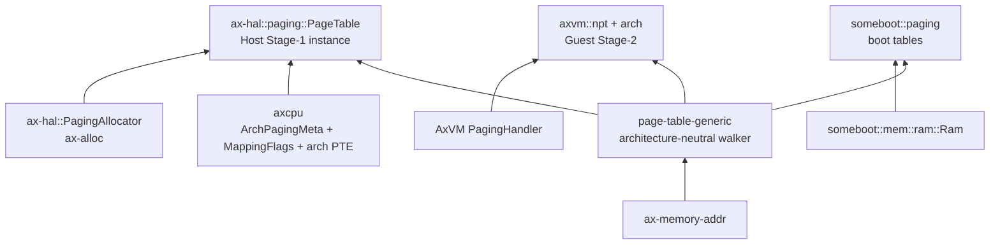

# 页表分层与实现

页表不再由一个同时识别全部架构和执行阶段的 crate 统一实现。代码按执行上下文归属：`page-table-generic` 提供不含 `target_arch` 分支的递归 engine、页帧能力接口和中性页表项配置；主机第一阶段页表同样复用该 engine，由 `ax-hal` 组装成 `PageTable<ArchPagingMeta, PagingAllocator>`，`axcpu` 只提供主机架构事实（`MappingFlags`、`ArchPagingMeta` 与各架构页表项类型）；`axvm` 拥有客户机第二阶段页表适配，`someboot` 拥有启动页表适配。Virtual Memory Area（虚拟内存区域，VMA）和物理页回收策略仍由上层持有。

## 1. 组件结构

主机页表与 CPU 寄存器、页表项格式和地址转换后备缓冲区失效指令直接相关，这些架构事实位于 `components/axcpu`；主机 Stage-1 的具体 `PageTable` 类型在 `os/arceos/modules/axhal/src/paging.rs` 中通过公共泛型组装。第二阶段页表只服务虚拟机，位于 `virtualization/axvm`。启动页表依赖 early bump 和启动地址布局，位于 `platforms/someboot`。只有递归建表、遍历、映射和页帧来源约束可被三个上下文复用。

### 1.1 所有权边界

| 所有者 | 主要源码 | 主要类型 | 消费者 |
| --- | --- | --- | --- |
| `page-table-generic` | `memory/page-table-generic/src/` | `FrameAllocator`、`PageTable`、`TableMeta`、`PageTableEntry`、`PteConfigOf` | `axcpu`、`ax-hal`、`axvm`、`someboot` |
| `axcpu` | `components/axcpu/src/paging.rs`、`src/{aarch64,riscv,x86_64,loongarch64}/paging.rs` | `MappingFlags`、`ArchPagingMeta`（TableMeta 实现）、`A64Pte`/`Rv64Pte`/`X64Pte`/`La64Pte` | `ax-hal`、`ax-mm`、StarryOS |
| `axvm` | `virtualization/axvm/src/arch/*/`、`src/npt.rs` | 第二阶段页表项、几何、失效实现、`GenericNestedPageTable` | Axvisor、`axaddrspace` adapter |
| `someboot` | `platforms/someboot/src/arch/*/paging*` | 启动页表项、几何、寄存器启用流程 | 动态平台启动 |

`page-table-generic` 没有 `stage1`、`stage2` 或 `boot` feature（仅提供 `copy-from`），也不包含架构页表项。关闭虚拟化或动态启动时，相应 adapter 不会因为公共内存 crate 而进入镜像。

### 1.2 依赖边界

公共算法只依赖地址类型和固定开销容器，不依赖 `ax-alloc`。启动 provider 使用 bump arena，主机运行时 provider 使用 Buddy，第二阶段 provider 使用 AxVM 的主机页能力，测试使用模拟 frame source。地址转换后备缓冲区失效是 `TableMeta::flush()` 的必需方法，由各架构 adapter 注入本 CPU 指令；多核远端失效由 `ax-hal` 的 shootdown 基础设施另行提供，不进入公共核心接口。


```mermaid
flowchart BT
    Addr["ax-memory-addr"] --> Core["page-table-generic\narchitecture-neutral walker"]
    Core --> Host["ax-hal::paging::PageTable\nHost Stage-1 instance"]
    Core --> Guest["axvm::npt + arch\nGuest Stage-2"]
    Core --> Boot["someboot::paging\nboot tables"]
    AxcpuMeta["axcpu\nArchPagingMeta + MappingFlags + arch PTE"] --> Host
    RuntimeProvider["ax-hal::PagingAllocator\nax-alloc"] --> Host
    GuestProvider["AxVM PagingHandler"] --> Guest
    BootProvider["someboot::mem::ram::Ram"] --> Boot
```

frame provider 是能力注入，不是 allocator facade。页表层收到 `None` 时返回 `PagingError::NoMemory`，不会注册 reclaim callback 或重试。

## 2. 公共类型

公共类型只描述共享算法所需的 frame ownership、页表项中性配置、几何和失效能力。主机专用权限位和架构页表项属于 `axcpu::paging`。

### 2.1 页帧来源

`FrameAllocator` 要求 `Clone + Sync + Send + 'static`。单 frame 方法是最低能力，多 frame 方法默认只支持 `frames == 1`，需要多 frame root table 的架构由 adapter 覆盖 `alloc_frames()` / `dealloc_frames()`。

```rust
pub trait FrameAllocator: Clone + Sync + Send + 'static {
    fn alloc_frame(&self) -> Option<PhysAddr>;
    fn dealloc_frame(&self, paddr: PhysAddr);
    fn phys_to_virt(&self, paddr: PhysAddr) -> *mut u8;
    fn alloc_frames(&self, frames: usize, align: usize) -> Option<PhysAddr>;
    fn dealloc_frames(&self, start: PhysAddr, frames: usize, frame_size: usize);
}
```

运行时 `os/arceos/modules/axhal/src/paging.rs::PagingAllocator` 使用 `global_allocator().alloc_pages(num, align, UsageKind::PageTable)`。启动期 `Ram` provider 从 early bump 分配且不逐 frame 释放。AxVM 的 `GenericFrameAllocator` 则把调用转交给 `PagingHandler`。

### 2.2 页表项配置与错误

`PteConfig` 是公共 walker 使用的中性配置，`PageTableEntry` 把它转换为第二阶段或启动期的硬件条目。主机第一阶段直接使用架构页表项类型（如 `A64Pte`）实现 `PageTableEntry`，权限语义用 `axcpu::paging::MappingFlags` 表达，不要求公共核心理解主机页表位布局。

| 类型 | 表达内容 | 不表达的内容 |
| --- | --- | --- |
| `MemAttributes` | Normal、PerCpu、Device、Uncached | DMA coherence 协议 |
| `PteConfig` | read/writable/executable/lower/dirty/global 与内存属性 | frame allocation policy；paddr 与 huge 由 `PageTableEntry::new_page(paddr, config, is_huge)` 参数表达 |
| `PagingError` | NoMemory、NotMapped、alignment、conflict、hierarchy 等 | syscall errno 与 signal |
| `axcpu::paging::MappingFlags` | 主机页表 read/write/execute/user/device/uncached 位 | 虚拟内存区域 pathname、写时复制 owner |

上层在 OS 边界把 `PagingError` 转为 `AxError` 或领域错误。页表实现不直接返回 Linux errno，也不记录虚拟内存区域 metadata。

`PteConfig` 与架构位编码无关，AxVM 和 someboot 的 adapter 都通过它表达“页表项应该是什么样”。该结构允许调用方按字段比较编码前后的语义，避免公共 walker 读取架构 bitfield。启动期定义位于 `platforms/someboot/src/mem/mmu.rs`。

```rust
#[derive(Clone, Copy, Debug, Default, Eq, PartialEq)]
pub struct PteConfig {
    pub read: bool,
    pub writable: bool,
    pub executable: bool,
    pub lower: bool,
    pub dirty: bool,
    pub global: bool,
    pub mem_attr: MemAttributes,
}
```

`MemAttributes` 使用枚举，是因为一次映射只能选择 Normal、PerCpu、Device 或 Uncached 之一。组合权限只存在于具体上下文：主机使用 `axcpu::paging::MappingFlags`，AxVM 将 `axvm_types::MappingFlags` 转换为 `PteConfig`，someboot 直接为启动映射构造 `PteConfig`。

## 3. 主机页表

主机第一阶段不维护独立的页表 engine：`os/arceos/modules/axhal/src/paging.rs` 定义 `pub type PageTable = page_table_generic::PageTable<ArchPagingMeta, PagingAllocator>`，几何、页表项格式和失效指令全部来自 `components/axcpu` 的 `ArchPagingMeta` 与架构页表项类型。`MappingFlags` 定义主机权限位（READ/WRITE/EXECUTE/USER/DEVICE/UNCACHED）。

### 3.1 架构元数据

`ArchPagingMeta`（`components/axcpu/src/paging.rs`）为当前目标架构实现 `TableMeta`，其常量来自各架构目录的 paging 模块。当前没有 32 位 ARM 主机支持，RISC-V 主机只实现 Sv39 几何（`satp` 写入硬编码 `Mode::Sv39`；Sv48x4 只存在于第二阶段）。

| 架构（axcpu 源文件） | 层数/地址形态 | 本地失效指令 |
| --- | --- | --- |
| AArch64（`src/aarch64/paging.rs`） | 4 层、48-bit 虚拟地址/物理地址，支持 1 GiB block | `tlbi vaae1is`（inner-shareable）/全量 `tlbi vmalle1`，配 DSB/ISB |
| RISC-V 64（`src/riscv/paging.rs`） | 3 层 Sv39、39-bit 虚拟地址，支持 2 MiB megapage | `sfence.vma` |
| x86_64（`src/x86_64/paging.rs`） | 4 层、48-bit 虚拟地址、最多 52-bit 物理地址 | `invlpg` / 重写 CR3 |
| LoongArch64（`src/loongarch64/paging.rs`） | 4 层、48-bit 虚拟地址（PWCL/PWCH 配置） | `invtlb` |

地址宽度检查由 `page-table-generic` 的 `validate_address_width()`/`is_addr_in_width()` 与 `STRICT_ADDRESS_WIDTH` 常量承担。AArch64 的高地址 canonical 化由 `ArchPagingMeta::canonicalize_vaddr()` 完成 sign-extension。

### 3.2 批量失效阈值

公共 engine 没有独立的失效器对象或状态机。`memory/page-table-generic/src/table.rs` 定义 `const TARGETED_FLUSH_LIMIT: usize = 32`：`map_region()` 用局部 `heapless::Vec<VirtAddr, 32>` 记录本批新映射的地址，未超过阈值时逐地址调用 `TableMeta::flush(Some(va))`，超过后改为全量 `flush(None)`。

其他修改路径不经过批量记录：`protect_page()` 与 `remap_page()` 立即逐地址 flush，`unmap` 在递归删除时逐项 flush。`PageTable::drop()` 只递归释放页表 frame，不执行任何 flush；调用方必须在 Drop 前显式完成需要的失效。

### 3.3 区域页尺寸选择

`memory/page-table-generic/src/table.rs::PageTableRef::map_region()` 配合 `largest_page_size()` 在 `allow_huge=true` 时按从大到小的顺序选择叶子页尺寸。每一步都要求虚拟地址、物理地址和剩余长度满足该页尺寸的对齐与容量条件；任一条件不满足就下降一级。

| 候选页尺寸 | 选择条件 | 单个页表项覆盖范围 |
| --- | --- | ---: |
| 1 GiB | 架构支持，虚拟地址与物理地址均 1 GiB 对齐，剩余长度不少于 1 GiB | 1 GiB |
| 2 MiB | 架构支持，虚拟地址与物理地址均 2 MiB 对齐，剩余长度不少于 2 MiB | 2 MiB |
| 4 KiB | 基础页对齐 | 4 KiB |

算法允许同一请求由不同页尺寸拼接。例如一个起点仅 4 KiB 对齐的范围会先用基础页映射到 2 MiB 边界，再使用 2 MiB 或 1 GiB 页，末尾不足大页的部分再退回基础页。调用方必须在权限、缓存属性或所有权发生变化的边界拆分请求，不能用一个大页跨越属性不同的物理区间。

各执行上下文决定是否启用大页。当前主要调用点的策略如下。

| 消费者路径 | `allow_huge` | 当前原因或结果 |
| --- | --- | --- |
| `someboot` 启动映射 | `true` | 尽量缩小启动页表并减少遍历层级 |
| `axaddrspace` Guest linear | `true` | 已知连续 Host 物理范围可使用大页 |
| `ax-mm` ArceOS linear | `false` | 当前范围 backend 以 4 KiB 基础页执行局部操作 |
| `ax-mm` allocation-backed | `false` | 物理页可能不连续，按基础页拥有和回收 |

因此“页表核心支持 1 GiB/2 MiB 页”不等于“内核直接映射已经使用大页”。大范围映射的性能评估必须记录实际生成的各尺寸页表项数量。

## 4. 地址转换后备缓冲区一致性

页表项修改与地址转换后备缓冲区 shootdown 是同一个正确性协议的两部分。公共接口描述 invalidator scope，`axcpu` 提供本地架构操作，系统层负责保证所有可能运行该地址空间的 CPU 都观察到失效。

### 4.1 失效入口

失效入口是 `TableMeta::flush(Option<VirtAddr>)`：`Some(vaddr)` 表示单地址，`None` 表示全部。`ArchPagingMeta::flush()` 转发到 `ax_cpu::asm::flush_tlb()`，即各架构的本 CPU 指令；公共层没有 scope 枚举或批量 invalidator trait。

| 架构 | 单地址失效 | 全量失效 | 覆盖范围 |
| --- | --- | --- | --- |
| AArch64 | `tlbi vaae1is` + DSB/ISB | `tlbi vmalle1` + DSB/ISB | 单地址指令 inner-shareable 硬件广播；全量指令仅本核 |
| RISC-V 64 | `sfence.vma(vaddr)` | `sfence.vma zero, zero` | 本 hart |
| x86_64 | `invlpg` | 重写 CR3 | 本 CPU |
| LoongArch64 | `invtlb 0x05` | `invtlb 0x00` | 本核 |

AArch64 的地址级 TLBI 带 inner-shareable 广播，但全量失效是本核操作。其余三个架构默认只处理本 CPU；共享内核映射的跨核失效必须走 4.2 节的 shootdown 基础设施，不能把本地失效当作系统完成。

### 4.2 多核远端失效

公共页表与 `ax_mm::init_memory_management()` 都不做多核 capability 校验：后者只创建内核地址空间、写根寄存器并 flush。远端失效由 `os/arceos/modules/axhal/src/cache.rs::flush_tlb_range_all_cpus()` 提供，它经 `axipi` 向 ready 的远端 CPU 发送 flush 请求并等待确认，跳过当前 CPU 与尚未 ready/已下线的 CPU（`CpuOffline`）。当前调用点是 `axruntime::kernel_mapping` 与 StarryOS `mm::access` 中解除共享内核映射的路径。

| 运行配置 | 远端失效方式 |
| --- | --- |
| AArch64 地址级失效 | 硬件 inner-shareable 广播，无需软件 处理器间中断 |
| 其他架构 + `ax-hal/ipi` | `flush_tlb_range_all_cpus()` 软件 shootdown |
| 其他架构、无 处理器间中断、CPU 数大于 1 | 无系统级保证，调用方必须避免跨核共享映射失效 |

该基础设施保证 flush 请求送达已 ready 的 CPU，但每个共享地址空间的具体 shootdown 时序仍由调用方负责。

### 4.3 启动阶段切换

非 AArch64 多核系统在引导处理器初始化 runtime 页表时，处理器间中断 callback 尚未发布可用。`axipi` 用显式 ready 状态机区分两个阶段：

| 阶段 | 行为 | 安全依据 |
| --- | --- | --- |
| secondary 尚未 ready | shootdown 只作用于已 ready CPU，未 ready CPU 被跳过 | secondary 在装载 kernel root 前不运行 runtime address space |
| secondary 调用 `mark_current_cpu_ready()` 之后 | Release 发布 ready，后续 shootdown 同步通知该 CPU | secondary 在发布 ready 前先装载 kernel root 并执行全量本地失效 |

ready 状态用 Release 发布、Acquire 读取。已 ready CPU 的处理器间中断错误是不可恢复的一致性故障；尚未 ready 或已下线 CPU 返回 `CpuOffline` 时可以跳过。内核任务栈 guard 页的 shootdown（`stack-guard-page + smp + ipi`）使用同一套机制并带确认计数与超时 panic，见[栈管理](./stacks.md)。AArch64 的地址级 inner-shareable 广播不进入该软件开关。

## 5. AArch64 内存属性

AArch64 页表项的 `AttrIndx` 必须与对应执行级的 Memory Attribute Indirection Register（内存属性间接寄存器，MAIR）slot 完全一致。运行时布局位于 `components/axcpu/src/aarch64/paging.rs`（私有 `A64MemAttr` 枚举与 `pub(super) const MAIR_VALUE`），启动布局位于 `someboot` 的 AArch64 paging 模块；两者不建立反向 crate 依赖。

### 5.1 属性槽位

运行时布局包含 Device-nGnRE、Normal write-back 和 Normal non-cacheable 三个 slot；启动布局额外写入第四个 Normal WriteThrough transient slot，但启动页表项编码只消费 index 0/1/2。

| 属性 | `AttrIndx` | MAIR byte | 使用场景 |
| --- | --- | --- | --- |
| Device-nGnRE | 0 | `0x04` | MMIO/device mapping |
| Normal write-back | 1 | `0xff` | 普通 RAM、页表、内核代码和数据 |
| Normal non-cacheable | 2 | `0x44` | uncached mapping |
| （仅启动布局）Normal write-through transient | 3 | — | 启动阶段写入，页表项当前不引用 |

axcpu 侧 `MAIR_VALUE` 由 `MAIR_EL1::Attr0/1/2` 字段值在 const 块中计算，结果为 `0x44ff04`。`A64Pte` 从 `MappingFlags::DEVICE` 或 `UNCACHED` 选择对应 index，并为 Normal 类型添加 shareability bits。

### 5.2 写寄存器与编码消费

运行时寄存器写入和运行时页表项引用 `axcpu` 内的同一个布局；启动寄存器写入和启动页表项引用 `someboot` 内的同一个布局。修改 slot 时必须同时验证两个执行上下文，但不能为了共享三个常量而让 `someboot` 依赖完整 `axcpu`。

| 消费位置 | 使用内容 |
| --- | --- |
| `components/axcpu/src/aarch64/init.rs` | 写 `MAIR_EL1` |
| `platforms/someboot/src/arch/aarch64/el1/mod.rs` | boot EL1 MAIR（4 个 slot） |
| `platforms/someboot/src/arch/aarch64/el2/mod.rs` | boot EL2 MAIR（4 个 slot） |
| `platforms/someboot/src/arch/aarch64/paging/pte.rs` | boot 页表项 index encode/decode（index 0/1/2） |
| `components/axcpu/src/aarch64/paging.rs` | Stage-1 `A64Pte` encode/decode 与 `MAIR_VALUE` |

DMA cache maintenance 不能仅靠把页表项改为 uncached 代替。coherent/streaming ownership 和同步时序属于 `dma-api` 与平台 cache adapter。

## 6. 客户机与启动页表

第二阶段和 boot 需要可变层数、可变 base page size和不同 entry 格式，因此复用 `page-table-generic` 的递归 engine。几何和硬件页表项分别由 `axvm` 与 `someboot` 定义，两者不共享策略代码。

### 6.1 可变几何

`TableMeta` 通过常量描述 entry 类型、base page size、每级 index bits、最大 block level 和是否严格检查地址宽度。engine 由这些常量计算每一级 mapping size。

```rust
pub trait TableMeta: Sync + Send + Clone + Copy + 'static {
    type P: PageTableEntry;
    const PAGE_SIZE: usize;
    const LEVEL_BITS: &[usize];
    const MAX_BLOCK_LEVEL: usize;
    const STRICT_ADDRESS_WIDTH: bool = false;
    fn canonicalize_vaddr(vaddr: VirtAddr) -> VirtAddr { vaddr }
    fn flush(vaddr: Option<VirtAddr>);
}
```

`MapConfig` 提供虚拟地址、物理地址、size、页表项 template、`allow_huge` 和 `flush`。递归 mapper 只有在 level、剩余大小及虚拟地址/物理地址对齐都满足时才创建 block mapping。

`PageTable<T, A>` 与 `PageTableRef<T, A>` 通过泛型 `T: TableMeta` 描述几何，使同一份递归 mapper 代码可同时服务第二阶段与 boot。下表列出每个 `TableMeta` 决定的一致性条件；具体架构在所属 crate 中提供这些常量。

| `TableMeta` 常量 | 含义 | 决定的行为 |
| --- | --- | --- |
| `PAGE_SIZE` | base page 字节数 | leaf entry 的最小粒度 |
| `LEVEL_BITS: &[usize]` | 每级 index 位数（root 在前） | 计算每级 table 大小和 mapping size |
| `MAX_BLOCK_LEVEL` | 允许 block/huge mapping 的最深 level | 控制递归何时停在 block entry |
| `STRICT_ADDRESS_WIDTH` | 是否严格拒绝超宽地址 | 影响 `validate_address_width()` / `is_addr_in_width()` 行为 |
| `canonicalize_vaddr(vaddr)` | 地址 canonical 化（默认恒等） | AArch64 等架构的高地址 sign-extension |
| `flush(vaddr)` | flush callback（必需方法） | 由架构 adapter 实现本 CPU 失效指令 |

`TableMeta::flush()` 是必需方法，没有默认实现；测试 mock 或不需要失效的 adapter 必须显式提供空实现。AArch64 hardware-broadcast 与 x86/RISC-V/LoongArch local-only 的差异由具体 adapter 注入，flexible engine 本身不区分架构。

### 6.2 所有权差异

`PageTable<T, A>` 拥有 root frame 并在 Drop 时递归释放；`PageTableRef<T, A>` 引用已有 root，用于接管硬件或固件已建立的表。两者都保留 provider 以完成 frame 地址转换与释放。

| 类型或模块 | root ownership | 典型用途 |
| --- | --- | --- |
| `PageTable` | 拥有并递归释放 | 新建 Guest nested page table |
| `PageTableRef` | 引用既有 root | 固件/硬件表接管或临时操作 |
| `axvm::GenericNestedPageTable` | 由虚拟机生命周期决定 | 客户机中间物理地址或客户机物理地址 → 主机物理地址 |
| `someboot` boot table | early bump 整体保留 | 建立启动 direct map、kernel map |

boot provider 的 deallocation no-op 意味着递归 Drop 不会把页面返回运行时 Buddy；这是 early arena 整体保留语义。Stage-2 runtime provider 则必须真正对称释放页表 frame。

## 7. 消费与审计入口

公共核心只提供机械算法，实际安全性还取决于所属上下文的页表项、provider、地址空间外层同步和架构寄存器初始化。修改公共 API 时必须逐条检查直接消费者。

### 7.1 消费矩阵

当前 workspace 依赖按所有者组合，不再使用统一页表 crate 的阶段 feature。

| 执行路径 | 所有者 | Provider/adapter |
| --- | --- | --- |
| ArceOS / StarryOS Host | `ax-hal::paging::PageTable`（`ArchPagingMeta` 来自 `axcpu`） | `PagingAllocator` → `ax-alloc` |
| StarryOS fork/copy | `page-table-generic` 的 `copy-from` feature | Host runtime page provider |
| 动态平台启动 | `someboot` | `Ram` early bump provider |
| Axvisor Guest | `axvm` | `PagingHandler` / nested ops adapter |
| 公共递归算法 | `page-table-generic` | 由上述所有者注入 |

ArceOS/Starry production tree 不应直接依赖 `axvm` 的第二阶段实现；Axvisor 也不应通过公共核心链接 `someboot` 的启动 adapter。

### 7.2 源码检查点

以下文件覆盖页表分层后的关键一致性条件。对应的页表项往返转换、映射、查询、解除映射和地址转换后备缓冲区刷新范围用例集中在[内存管理测试与验收](./testing.md)。

| 源码 | 审计重点 |
| --- | --- |
| `memory/page-table-generic/src/lib.rs`、`src/def.rs`、`src/frame.rs` | `FrameAllocator`、`PagingError`、frame/root 所有权 |
| `components/axcpu/src/paging.rs` | `MappingFlags`、`ArchPagingMeta`、flush 接线 |
| `components/axcpu/src/{aarch64,riscv,x86_64,loongarch64}/paging.rs` | 主机架构位布局和 `MappingFlags` round-trip |
| `memory/page-table-generic/src/map.rs`、`src/table.rs`、`src/walk.rs` | 递归 map/unmap/protect、区域映射与页尺寸选择、批量 flush 阈值、copy-from |
| `os/arceos/modules/axhal/src/paging.rs` | runtime provider（`PagingAllocator`）与主机 Stage-1 `PageTable` 类型 |
| `os/arceos/modules/axhal/src/cache.rs` | 多核 TLB shootdown 与 `CpuOffline` 处理 |
| `virtualization/axvm/src/arch/*/` | 第二阶段 geometry、entry 和失效实现 |
| `platforms/someboot/src/arch/*/paging*` | boot geometry、entry 和启用时序 |

页帧分配失败、huge mapping 下继续下钻、地址宽度 overflow、已有 mapping conflict、部分 subtree 回收以及批量 flush 阈值的验收项见[内存管理测试与验收](./testing.md)。

## 8. 地址翻译实例

页表行为应从地址位划分、页表页来源和失效范围三个维度同时分析。只看到 `map()` 成功并不能证明 provider ownership 或 多核 地址转换后备缓冲区一致性正确。

### 8.1 四级页表遍历

以 64-bit 四级、每级 9-bit index、4 KiB base page 为例，虚拟地址 `0xffff_8000_1234_5000` 的索引为 L4=`0x100`、L3=`0x000`、L2=`0x091`、L1=`0x145`，页内 offset 为 0。`TableMeta::LEVEL_BITS` 决定层数和地址宽度，递归 mapper 通过 `Frame::virt_to_index()` 提取各级索引。

```text
63                              48 47       39 38       30 29       21 20       12 11        0
+--------------------------------+-----------+-----------+-----------+-----------+------------+
| canonical sign extension       | L4 0x100  | L3 0x000  | L2 0x091  | L1 0x145  | offset 0x0 |
+--------------------------------+-----------+-----------+-----------+-----------+------------+
```

若 L4、L3 已存在而 L2 指向空 entry，映射 4 KiB 页需要为 L1 table 申请一个 frame，再写最终 leaf 页表项。任何中间 frame allocation 返回 `None` 都转换为 `PagingError::NoMemory`，已经临时建立但未链接的 frame 必须释放。


```mermaid
flowchart LR
    Root["root frame"] --> L4["L4[0x100]"]
    L4 --> L3["L3[0x000]"]
    L3 --> L2["L2[0x091]"]
    L2 --> L1["L1[0x145]"]
    L1 --> Frame["target 物理地址 + flags"]
```

如果目标使用 2 MiB mapping，leaf 停在 L2，虚拟地址、物理地址和 size 都必须 2 MiB 对齐；query 返回该 block 的 base 物理地址，再加 `PageSize::align_offset(vaddr)` 得到最终物理地址。已有 huge entry 下不能静默创建更低一级 table，否则会破坏原映射。

### 8.2 页帧来源交接

`FrameAllocator` 的接口已在 2.1 节定义，本节只比较不同实现的所有权结果。页表算法既不知道 DMA32 低地址路径，也不知道 boot bump 或 Guest owner。

三个典型 provider 对同一个“需要一页 L1 table”的请求有不同所有权结果。

| Provider | 分配动作 | `dealloc_frame()` | 生命周期 |
| --- | --- | --- | --- |
| `someboot::mem::ram::Ram` | early bump | no-op | used prefix 整体 Reserved |
| `ax-hal::PagingAllocator` | `Normal × PageTable` | 返回 `ax-alloc` | Stage-1 table owner |
| AxVM 主机页提供者 | 主机页 API | 返回主机分配器 | 虚拟机或嵌套页表所有者 |

因此 boot table 的 Drop 不能用于判断物理页已回收到 Buddy；相反，runtime provider 的 owned `PageTable` 若未对称释放每个子表 frame 就是泄漏。

### 8.3 映射与失效顺序

假设一次 `map_region()` 连续映射 20 个 4 KiB 页。每个新映射的虚拟地址进入局部 `heapless::Vec<VirtAddr, TARGETED_FLUSH_LIMIT>`，批次结束时逐地址调用 `flush(Some(va))`；若映射 40 页，超过 32 的阈值后升级为一次 `flush(None)` 全量失效。

```text
≤ 32 新映射地址    逐地址 flush(Some(va))
> 32 新映射地址    一次 flush(None)
protect/remap      修改后立即逐地址 flush，无批量记录
unmap              递归删除时逐项 flush
PageTable::drop    不 flush，只递归释放页表 frame
```

固定阈值避免页表修改为了记录 flush 又申请 heap。批量记录只存在于 `map_region()` 内部；调用方不能依赖 protect 或 unmap 的批量行为。

在 RISC-V、x86_64 或 LoongArch64 等 local-only 实现中，shared kernel mapping 的 unmap 还需要 `ax_hal::cache::flush_tlb_range_all_cpus()` 等待远端 CPU 完成失效。AArch64 地址级 inner-shareable TLBI 由硬件覆盖 shareable domain，但仍必须保留架构要求的 DSB/ISB 顺序。

### 8.4 客户机映射实例

假设 Guest 客户机物理地址 `0x4000_0000..0x4020_0000` 映射到 Host 物理地址 `0x9000_0000..0x9020_0000`。当 `allow_huge=true` 且 geometry 允许 2 MiB block 时，flexible mapper可以生成一个 block entry；任一端不对齐时必须下降到 base-page entries。

| 客户机物理地址 | 主机物理地址 | 大小 | 选择 |
| --- | --- | ---: | --- |
| `0x4000_0000` | `0x9000_0000` | 2 MiB | 可使用 2 MiB block |
| `0x4000_1000` | `0x9000_0000` | 2 MiB | 客户机物理地址 未对齐，降级或返回 alignment error |
| `0x4000_0000` | `0x9000_1000` | 2 MiB | 主机物理地址 未对齐，降级或返回 alignment error |
| `0x4000_0000` | `0x9000_0000` | 12 KiB | 使用三个 4 KiB leaf |

Stage-2 entry 只描述 Guest translation，不拥有 Guest RAM policy。allocation-backed Guest RAM 由 `axaddrspace` backend 保存并在成功 unmap 或 teardown 时释放；linear Guest mapping 删除 entry 时不能释放调用方传入的 Host 物理地址。

### 8.5 大范围直接映射

假设虚拟地址和物理地址都按 1 GiB 对齐，整个 12 GiB 区间具有相同权限与缓存属性。允许大页时，`page_table_generic::PageTable::map_region()` 可以用 12 个 1 GiB 叶子项完成映射；禁止大页时需要 3,145,728 个 4 KiB 叶子项。

| 映射方式 | 叶子项数量 | 仅 4 KiB 叶子页表存储 | 地址转换后备缓冲区覆盖 |
| --- | ---: | ---: | --- |
| 1 GiB 页 | 12 | 不需要 4 KiB 叶子表 | 每项覆盖 1 GiB |
| 2 MiB 页 | 6,144 | 不需要 4 KiB 叶子表 | 每项覆盖 2 MiB |
| 4 KiB 页 | 3,145,728 | 约 24 MiB | 每项覆盖 4 KiB |

这里的 24 MiB 是 `3,145,728 × 8` 字节的叶子页表项存储，不含少量上级页表。大页通常还能降低地址转换后备缓冲区压力和启动映射时间，但只适用于物理连续、虚拟连续且属性一致的范围；局部 unmap、protect 或写时复制会要求拆分大页或拒绝基础页操作。

页尺寸优化不能代替固件区间分类。固件私有窗口、PCI 地址空洞或不允许 CPU 访问的保留区应先从普通直接映射中排除；只有确定需要 CPU 映射的 RAM 才进入上述尺寸选择。当前 ArceOS linear 直接映射仍传入 `allow_huge=false`，所以表中的 1 GiB 结果是公共递归 engine 已经具备、但该消费路径尚未启用的能力。
