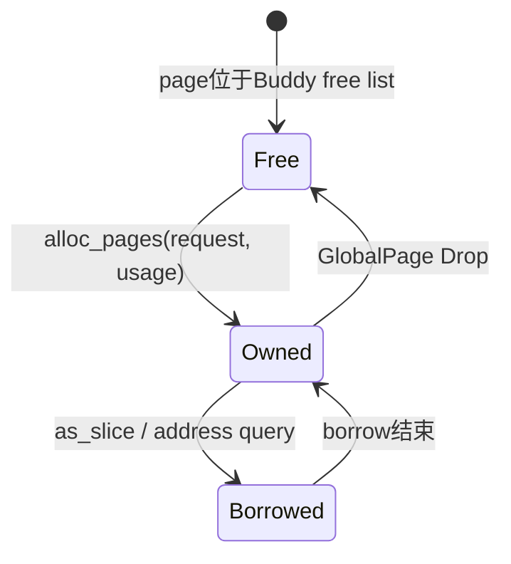

# 运行时页与堆分配器

`memory/ax-alloc` 是运行期物理页、内核字节分配和 Rust `GlobalAlloc` 的公共入口。它固定使用 `buddy-slab-allocator`：Buddy 管理多个物理内存区段，每 CPU Slab 服务小对象，显式页 API 通过地址区域、用途和 Resource Acquisition Is Initialization（资源获取即初始化，RAII）所有者表达约束。

## 1. 初始化与内存布局

运行时 allocator 只能接收已经从固件 RAM 中扣除 KImage、reserved、MMIO 和 early allocations 的 `Free` 区间。所有区间在交接后由 allocator 独占，调用方不得继续直接使用其中的字节。

### 1.1 多区段初始化

`os/arceos/modules/axruntime/src/lib.rs::init_allocator()` 找到最大的 free region 调用 `ax_alloc::global_init()`，其余 free region 逐个调用 `global_add_memory()`。两个入口最终分别调用 `buddy_slab_allocator::GlobalAllocator::init()` 和 `add_region()`。

| 入口 | 使用场景 | 失败条件 |
| --- | --- | --- |
| `global_init(start_vaddr, size)` | 建立第一个 Buddy section | 已初始化、范围溢出、metadata/layout 无效 |
| `global_add_memory(start_vaddr, size)` | 增加后续不连续 section | 未初始化、重叠、范围溢出 |
| `init_percpu_slab(cpu_id)` | CPU bring-up 时初始化本地 Slab | CPU id 超过 `u16` 或重复初始化 |

`add_region()` 对不足以容纳 metadata 和 2 MiB heap 对齐的短 region 会记录日志并跳过。平台验收不能只统计输入 free bytes，还应比较实际 `managed_bytes()`。

### 1.2 区段元数据

每个 region 的前缀存放 `BuddySection` 和与页数相关的 `PageMeta[]`，随后将可管理 heap 起点按 `REGION_GRANULE = 2 MiB` 对齐。metadata 和对齐 padding 不再作为可分配页返回。


多个 region 形成多个独立 section。Buddy 可以在分配时扫描 section，但一个连续 allocation 不会跨越 section 或物理 hole。

## 2. 字节分配

普通 Rust 容器和内核对象通过 `GlobalAlloc` 进入 `ax_alloc::GlobalAllocator::alloc(Layout)`。实现依据 size 和 alignment 选择 Slab 或 Buddy，不暴露可切换的 allocator backend feature。

### 2.1 小对象热路径

满足 `size <= 2048` 且 `align <= 2048` 的 allocation 进入 per-CPU Slab。`SizeClass` 使用固定九档，避免运行期生成动态 class 或复杂 size tree。

| Size class | 对象大小 | Slab backing 规模 |
| --- | --- | --- |
| `Bytes8` 至 `Bytes256` | 8、16、32、64、128、256 B | 每个新 Slab 1 页 |
| `Bytes512`、`Bytes1024` | 512 B、1024 B | 每个新 Slab 2 页 |
| `Bytes2048` | 2048 B | 当前公式最多 4 页 |

当本 CPU 对应 class 没有对象时，Slab 返回 `NeedsSlab`，全局实现从 Buddy 申请 backing pages、标记 `PageFlags::Slab`，再交给本 CPU class。空 Slab 可以将 backing pages 返回 Buddy。

`slab_pages()` 在 `memory/buddy-slab-allocator/src/slab/size_class.rs` 内用三档分支决定单个 Slab 的 backing 页数：8–256 B 用 1 页，512–1024 B 用 2 页，2048 B 最多 4 页。该公式在编译期可推导，避免运行期动态决定 backing 大小。

```rust
pub const fn slab_pages(self, page_size: usize) -> usize {
    let obj_size = self.size();
    if obj_size <= 256 {
        1
    } else if obj_size <= 1024 {
        2
    } else {
        // 2048-byte objects: 4 pages → header + room for objects
        let v = 16 * page_size / (obj_size * 8);
        let v = if v < 4 { v } else { 4 };
        if v < 1 { 1 } else { v }
    }
}
```

`SizeClass::from_layout()` 取 `size.max(align)` 选择最小可容纳 class；若结果超过 2048 B 上限，byte allocation 路径直接退化为 Buddy 大对象。该选择发生在持锁临界区之外，由调用方提前判断。

### 2.2 大对象与跨 CPU释放

超过 Slab 上限的 byte allocation 被向上取整为 4 KiB 页数，由 Buddy 直接完成。它仍以请求的 `Layout` 通过 `GlobalAlloc` 对称释放，不应和显式页 API 混用。

| 路径 | 锁与并发行为 | 统计分类 |
| --- | --- | --- |
| 本 CPU Slab alloc/free | CPU-local `SpinNoIrq<SlabAllocator>` | `Normal × RustHeap` |
| Slab 扩容/归还 | 短时进入全局 `SpinNoIrq<BuddyAllocator>` | `Normal × RustHeap` 的请求字节数 |
| 跨 CPU Slab free | CAS 压入 owner slab page 的 remote-free stack | 释放仍归原 byte allocation |
| 大对象 alloc/free | 全局 `SpinNoIrq<BuddyAllocator>` | `Normal × RustHeap` |

Remote free 不是单独 allocator 或固定容量 manager。释放对象自身保存链表节点，owner CPU 在后续分配或回收 Slab 时通过 Acquire/Release 操作 drain 该栈。

## 3. 显式页接口

页表、用户虚拟内存、页缓存、DMA 和其他需要页粒度所有权的代码使用 `PageRequest` 与 `UsageKind`。公共资源获取即初始化入口是 `alloc_pages()`，少数实现层可使用隐藏的 raw 对称 API。

### 3.1 页请求模型

请求包含连续页数、字节对齐和物理地址约束。当前 base page 固定为 4 KiB，`count` 必须非零，乘法和地址范围都执行 overflow 检查。

```rust
pub struct PageRequest {
    pub count: usize,
    pub align: usize,
    pub zone: MemoryZone,
}

pub fn alloc_pages(
    request: PageRequest,
    usage: UsageKind,
) -> AllocResult<GlobalPage>;
```

`MemoryZone` 只表达物理可达性，`UsageKind` 只表达用途统计。两者不得组合成大量 page class，也不改变分配失败时立即返回 `NoMemory` 的规则。

### 3.2 地址区域

`Normal` 调用 Buddy 的普通 `alloc_pages()`；`Dma32` 调用 `alloc_pages_lowmem()`，只接受物理地址完全位于 4 GiB 以下的结果。当前两者扫描同一组 Buddy section。

| Zone | 地址约束 | 是否独立保留池 | 典型消费者 |
| --- | --- | --- | --- |
| `Normal` | allocator 可管理的任意物理地址 | 否 | 页表、用户页、Guest RAM、内核大对象 |
| `Dma32` | allocation 末地址不超过 32-bit DMA window | 否 | `dma_mask <= u32::MAX` 的设备 |

因为 `Normal` 也能消费低于 4 GiB 的页，Dma32 不是 Linux 式永久 DMA zone reserve。低地址紧张的平台应在启动期规划容量或预分配关键 DMA ring，而不是假设后期请求必然成功。

### 3.3 页所有权

`GlobalPage` 保存 `start_vaddr`、原始 `PageRequest` 和 `UsageKind`。它不实现复制，Drop 根据原 zone 和 usage 返回 Buddy。

| 方法 | 行为 | 所有权影响 |
| --- | --- | --- |
| `GlobalPage::alloc()` | 分配一个 Normal 4 KiB 页 | 返回 live 资源获取即初始化 owner |
| `GlobalPage::alloc_zero()` | 分配并清零一个页 | 返回 live 资源获取即初始化 owner |
| `GlobalPage::alloc_contiguous()` | 分配 Normal 连续页 | 返回同一 owner |
| `as_slice()` / `as_slice_mut()` | 借用完整 allocation | 不转移所有权 |
| `Drop::drop()` | 按 zone 和 usage 归还 | owner 生命周期结束 |

需要把页交给页表项或外部对象长期持有的代码必须明确转移或封装生命周期。不能丢弃 `GlobalPage` 后继续使用其地址，否则 Drop 已经把页返回 allocator。

`Drop` 实现是 owner 协议的执行点，它把构造时记录的 `request` 与 `usage` 原样传回 deallocator，不需要调用方重新传递 zone 或 usage 信息。`deallocate_pages_raw()` 标记为 `unsafe` 是因为它要求调用方保证地址确实来自对称的 `allocate_pages_raw()`。

```rust
impl Drop for GlobalPage {
    fn drop(&mut self) {
        // SAFETY: this owner stores the unchanged request and usage associated
        // with the live allocation, and Drop runs exactly once.
        unsafe {
            global_allocator().deallocate_pages_raw(
                self.start_vaddr.into(),
                self.request,
                self.usage,
            );
        }
    }
}
```

字节分配 `GlobalAllocator::alloc()` 与 `dealloc()` 在进入 Slab/Buddy 前获取 `NoPreempt` 守卫，并在守卫作用域结束前完成所有 upstream 操作。`NoPreempt` 防止任务在持有 per-CPU Slab 引用期间被调度到其他 CPU；remote free 与本 CPU free 的路由也由该守卫保护。

```rust
pub fn alloc(&self, layout: Layout) -> AllocResult<NonNull<u8>> {
    // Slab lookup obtains a pointer to the current CPU's cache. Keep the
    // task on that CPU until the complete upstream operation finishes.
    let _guard = NoPreempt::new();
    let result = self.inner.alloc(layout).map_err(crate::AllocError::from);
    if result.is_ok() {
        self.stats
            .alloc(AllocationSource::Normal, UsageKind::RustHeap, layout.size());
    }
    result
}
```

`_guard` 的作用域与单次 alloc 同步，因此即使 Slab miss 触发短时获取全局 Buddy 锁，`NoPreempt` 仍能保证 task 不会在锁内迁移 CPU。该约束是 `current_percpu_slab()` 通过 `ax_percpu::with_cpu_pin` 拿到本 CPU pointer 的安全前提。

## 4. 统计与失败语义

统计和错误都集中在 `ax-alloc`，消费者不应维护第二份 allocator usage truth。procfs、sysinfo 或诊断接口应从快照派生展示值。

### 4.1 单一统计矩阵

`AllocatorStats` 是 `AllocationSource × UsageKind` 的二维字节计数表。每次成功 allocation 只增加一个 bucket，释放只减少原 bucket。

| 维度 | 当前枚举 | 含义 |
| --- | --- | --- |
| `AllocationSource` | `Normal`、`Dma32` | 请求由哪种物理地址约束满足 |
| `UsageKind` | `RustHeap`、`VirtMem`、`PageCache`、`PageTable`、`Dma`、`Global` | allocation 的逻辑用途 |
| backend occupancy | `used_bytes()` / `available_bytes()` | Buddy 页级占用，不等于请求 layout 精确和 |

每个底层 bucket 使用一个 Relaxed 原子计数；一次分配只写对应 bucket，不再用统计全局锁串行化 per-CPU Slab 命中。`stats()` 读取这些 bucket 生成值快照，`source()`、`usage()` 和 `total()` 都从快照聚合。展示代码不应在读取后反向修改 allocator 状态，也不应把 Dma32 计数误解为静态分区大小。

### 4.2 立即失败

`AllocError` 区分参数、初始化状态、重叠、无内存和错误释放。allocator 内部没有 reclaim callback、虚拟文件系统 callback、阻塞等待或隐藏重试。

| 错误 | 触发示例 | 上层处理 |
| --- | --- | --- |
| `InvalidParam` | `count == 0`、乘法溢出、region range 无效 | 修正调用或返回 `EINVAL` 类错误 |
| `NotInitialized` / `AlreadyInitialized` | 启动顺序错误 | 作为系统状态错误处理 |
| `MemoryOverlap` | 重复交接同一物理区 | 启动失败并检查内存图 |
| `NoMemory` | 没有满足 size/align/zone 的 section | 由调用方决定返回、回收或终止操作 |

Starry 的 clean-page reclaim 位于 fault 外层：只有操作返回 `AxError::NoMemory` 时回收一次，并最多重新执行一次。这个策略不会进入 `ax-alloc` 锁内。

## 5. 实时与处理器启动

嵌入式实时约束通过预分配、具体路径审计和构建配置实现，而不是在 allocator 中加入复杂优先级或可睡眠回收。当前没有公共 实时 guard，文档只对已审计并接入固定资源的路径作确定性承诺。

### 5.1 每 CPU 缓存初始化

引导处理器和每个应用处理器都必须在本 CPU per-CPU storage 可用之后、scheduler/处理器间中断/中断请求可能分配之前调用 `init_percpu_slab(cpu_id)`。未初始化时访问本地 Slab 会触发明确失败，而不是回退到不安全的共享路径。

| CPU 阶段 | 必须完成的动作 | 此后允许 |
| --- | --- | --- |
| someboot 引导处理器 | 预分配全部 CPU metadata/stack/data | 建立 per-CPU 地址 |
| ax-runtime 引导处理器 | 初始化全局 Buddy，再初始化 CPU0 Slab | 启动 scheduler/driver |
| ax-runtime 应用处理器 | 绑定本 CPU per-CPU data，初始化本地 Slab | 开启中断请求、进入 scheduler |

Slab backing 页仍来自共享 Buddy；因此“per-CPU Slab”降低小对象热路径争用，但不意味着首次扩容在中断请求或 实时 critical 中安全。

### 5.2 中断请求与硬实时路径

中断请求和硬实时路径必须由具体消费者在启动或 probe 阶段预分配 ring、descriptor 或固定对象池。当前没有通用的 实时 guard 或 EmergencyReserve 公共接口；只有出现明确消费者、容量依据和耗尽测试后才增加相应能力，避免为未接线的策略保留公共 API 和静态状态。

## 6. 源码入口

allocator 的公共契约、实现和底层算法分属三个集中位置。修改时应保持公共类型不泄露底层 Buddy/Slab 内部结构。

### 6.1 公共接口文件

下面的文件决定消费者可见行为。API 或 feature 改动必须同步更新本页和组件文档。

| 源码 | 关键内容 |
| --- | --- |
| `memory/ax-alloc/src/lib.rs` | zone、request、usage、source、stats、typed error |
| `memory/ax-alloc/src/page.rs` | `GlobalPage` 和 Drop |
| `memory/ax-alloc/src/buddy_slab.rs` | 公共 wrapper、统计、per-CPU Slab 接线 |

上层 crate 应依赖 `ax-alloc`，不应直接依赖 `buddy-slab-allocator` 的 `BuddyAllocator`、`SlabAllocator` 或 metadata 类型。

### 6.2 底层实现文件

底层 crate 负责 allocator 算法，不负责 OS policy。性能回归通常应先定位是 Buddy、Slab 还是平台内存交接问题。

| 源码 | 关键内容 |
| --- | --- |
| `memory/buddy-slab-allocator/src/global.rs` | Buddy + Slab 选择、section 添加、large alloc |
| `memory/buddy-slab-allocator/src/buddy/mod.rs` | 多 section Buddy、lowmem filter、合并与拆分 |
| `memory/buddy-slab-allocator/src/slab/size_class.rs` | 九个固定 size class |
| `memory/buddy-slab-allocator/src/slab/page.rs` | bitmap、owner CPU、remote-free CAS stack |
| `memory/buddy-slab-allocator/src/slab/cache.rs` | partial/full Slab 和 remote drain |

默认优化顺序是先预分配固定池、减少 实时/中断请求动态分配并测量 Buddy 锁，再决定是否需要有限的 per-CPU order-0 cache。当前实现没有该 page cache，也不应在没有基准证据时添加。

## 7. 分配计算实例

运行时分配器的可用容量、内部碎片和地址约束都可以从输入 region 与 `PageRequest` 直接计算。下面的实例对应 `buddy-slab-allocator` 当前 4 KiB page、2 MiB managed-heap 对齐和固定 size class 实现。

### 7.1 区段前缀计算

在 64-bit 目标上，假设平台交接一个完整的 `0x4000_0000..0x4400_0000` 64 MiB region。当前 `BuddySection` 为 8 字节对齐，`PageMeta` 由编译期断言固定为 12 字节；`compute_region_layout_with_heap_align()` 用二分搜索求 metadata 与 managed pages 同时可容纳的最大页数。

| 项目 | 计算 | 结果 |
| --- | --- | ---: |
| Region 大小 | `0x4400_0000 - 0x4000_0000` | 64 MiB |
| Managed heap 起点 | metadata 末端向上对齐到 2 MiB | `0x4020_0000` |
| Managed heap 大小 | `0x4400_0000 - 0x4020_0000` | 62 MiB |
| Managed pages | `62 MiB / 4 KiB` | 15,872 页 |
| `PageMeta[]` | `15,872 × 12` | 190,464 B |
| Region 前缀总损失 | section、metadata 与对齐 padding | 2 MiB |

2 MiB 前缀不是固定 metadata 大小，而是当前地址与 heap 对齐共同产生的结果。非 2 MiB 对齐的 region 起点、不同 pointer width 或未来 `PageMeta` 布局都会改变数值，因此诊断应读取 `managed_section()`/`managed_bytes()`，不能硬编码 62 MiB。

```rust
let mut low = 0usize;
let mut high = max_pages;
while low < high {
    let mid = low + (high - low).div_ceil(2);
    if Self::can_manage_pages::<PAGE_SIZE>(region_end, section_start, mid, heap_align) {
        low = mid;
    } else {
        high = mid - 1;
    }
}
```

这个二分过程位于 `BuddySection::compute_region_layout_with_heap_align()`。它先验证 region 末地址和 metadata 乘法不溢出，再保证最终 `managed_heap_start + managed_heap_size` 不超过原 region。

### 7.2 连续页请求取整

Buddy 按 order 分配，`count` 不是 2 的幂时会提升到 `count.next_power_of_two()`。例如请求 3 个连续页、8 KiB 对齐时，算法实际寻找 order 2 的 4 页 block。

```text
request: count=3, align=0x2000
order:   next_power_of_two(3) = 4 pages = order 2
block:   [P, P+0x1000, P+0x2000, P+0x3000]
usable:  caller按请求语义使用前三页
cost:    Buddy占用四页，产生一页内部碎片
```

`alloc_pages()` 按 section 注册顺序扫描，在每个 section 内从目标 order 向高 order 搜索。找到更大 block 后逐级 split；free 使用同一 order 计算并与空闲 buddy 合并。一次 allocation 不会把两个 section 的相邻虚拟地址误当成物理连续页。

| 请求 | 实际 Buddy block | 说明 |
| --- | ---: | --- |
| 1 页 | 1 页 | order 0 |
| 2 页 | 2 页 | order 1 |
| 3 页 | 4 页 | 1 页内部碎片 |
| 9 页 | 16 页 | 7 页内部碎片，应评估调用方是否需要 scatter/gather |
| `count > 2^MAX_ORDER` | 无 | `InvalidParam` |

高阶连续请求频繁出现时，优先检查设备或 Guest 接口是否真正要求物理连续；不要求连续的对象应保存页列表，而不是扩大 Buddy 或加入 compaction。

### 7.3 小对象选择实例

byte allocation 先比较 `Layout::size()` 和 `Layout::align()` 是否都不超过 2048。size class 取能够覆盖 layout 的最小固定档，首次缺页才进入 Buddy。

| Rust `Layout` | 选择结果 | 后端占用特征 |
| --- | --- | --- |
| `size=24, align=8` | `Bytes32` | 一个对象占 32 B |
| `size=300, align=8` | `Bytes512` | 一个对象占 512 B |
| `size=1024, align=4096` | large allocation | alignment 超过 Slab 上限 |
| `size=3000, align=8` | large allocation | size 超过 Slab 上限，向上取整为页 |
| `size=8192, align=4096` | Buddy 2 页 | 不经过 Slab |

Slab miss 的关键路径先释放本 CPU cache 的状态判断，再短时获取全局 Buddy 锁申请 backing；新页通过 `set_page_flags(addr, PageFlags::Slab)` 标记。跨 CPU free 不重新分类或直接操作 Buddy，而是把对象链接到所属 Slab page 的 remote-free 栈。

```rust
match pool.alloc(layout)? {
    SlabAllocResult::Allocated(ptr) => Ok(ptr),
    SlabAllocResult::NeedsSlab { size_class, pages } => {
        let bytes = pages * PAGE_SIZE;
        let addr = self.buddy.lock().alloc_pages(pages, bytes)?;
        unsafe { self.buddy.lock().set_page_flags(addr, PageFlags::Slab)? };
        pool.add_slab(size_class, addr, bytes);
        // 再执行一次本 CPU allocation。
    }
}
```

这里两次获取 Buddy 锁是有意缩短临界区；`pool.add_slab()` 不在全局 Buddy lock 内执行。首次 class 扩容仍可能失败，所以中断请求/实时 路径不能把“per-CPU Slab”误解为无条件、无界延迟的固定池。

### 7.4 地址约束与所有权

一个 32-bit DMA 设备申请 16 KiB、16 KiB 对齐 buffer 时，runtime adapter 构造 `PageRequest { count: 4, align: 0x4000, zone: Dma32 }` 并使用 `UsageKind::Dma`。Buddy 只接受最后一个 byte 仍低于 `0x1_0000_0000` 的 block。

```rust
let request = PageRequest {
    count: 4,
    align: 0x4000,
    zone: MemoryZone::Dma32,
};
let pages = ax_alloc::alloc_pages(request, UsageKind::Dma)?;
```

假设返回物理地址 `0xffff_c000`，16 KiB 范围正好结束于 `0x1_0000_0000`，仍满足 32-bit mask；若起点为 `0xffff_d000`，末端越界，lowmem path 必须继续扫描或返回 `NoMemory`。`GlobalPage` 保存原 request 与 usage，Drop 不需要调用方重新传递 `_dma32` 一类布尔值。



如果调用方需要把页面交给另一个长期 owner，必须由那个 owner保存完整释放元数据或接管 `GlobalPage`；只拷贝地址后让 `GlobalPage` 提前 Drop 会形成悬空页表项或 DMA 地址。
