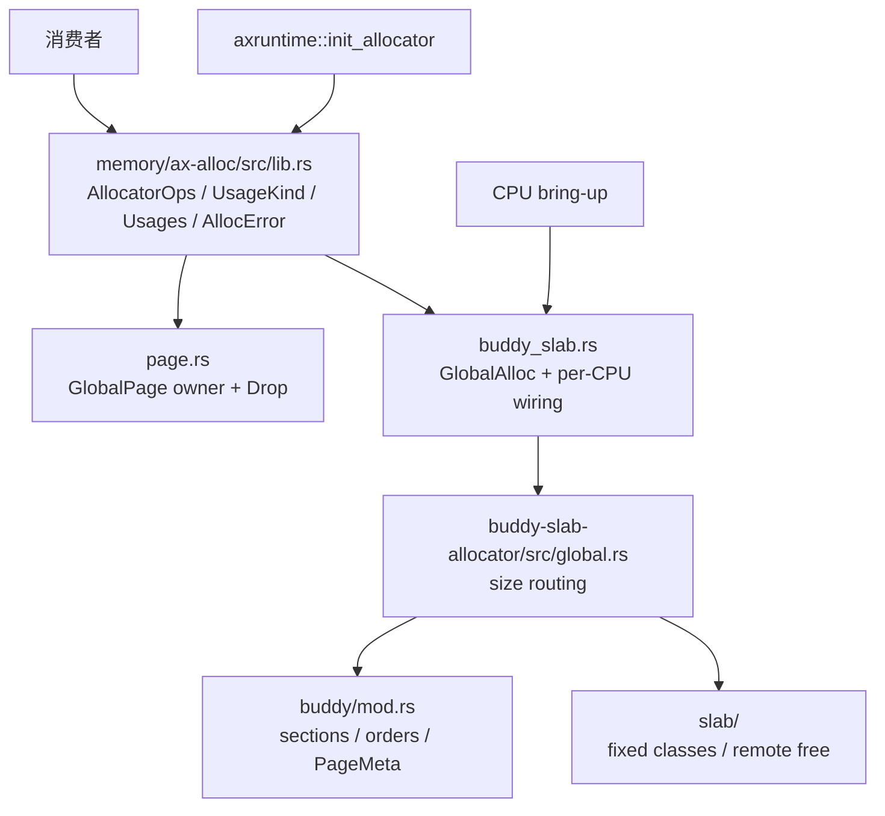
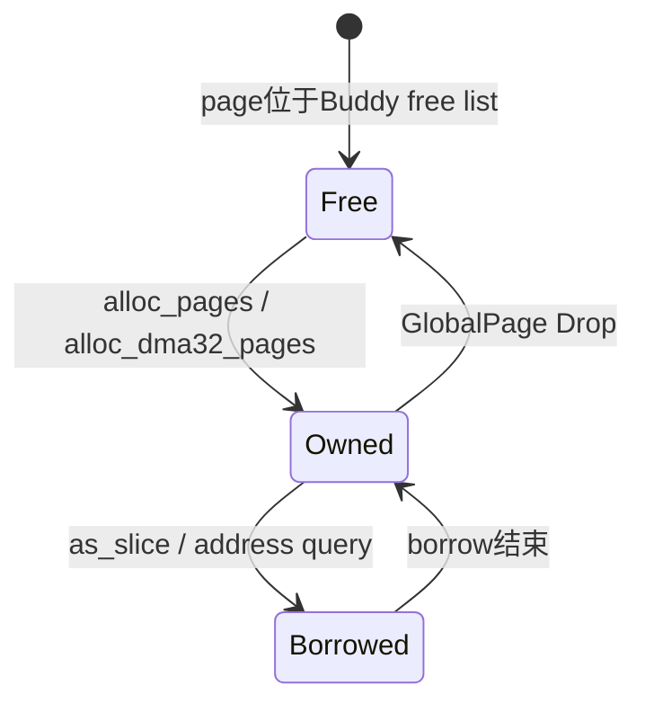

# 运行时页与堆分配器

`memory/ax-alloc` 是运行期物理页、内核字节分配和 Rust `GlobalAlloc` 的公共入口。它在当前配置下使用 `buddy-slab-allocator`：Buddy 管理多个物理内存区段，每 CPU Slab 服务小对象，显式页 API 通过页数、对齐、用途和 Normal/DMA32 两条分配函数表达约束。

## 1. 初始化与内存布局

运行时 allocator 只能接收已经从固件 RAM 中扣除 KImage、reserved、MMIO 和 early allocations 的 `Free` 区间。所有区间在交接后由 allocator 独占，调用方不得继续直接使用其中的字节。

运行时实现分为公共 API、接线层和算法层。`ax-alloc` 保存用途、统计与资源所有者；`buddy-slab-allocator` 只实现 free-list、page metadata 和 size class，不向操作系统暴露第二套分配 API。


```mermaid
flowchart TB
    C["消费者"] --> API["memory/ax-alloc/src/lib.rs\nAllocatorOps / UsageKind / Usages / AllocError"]
    API --> PAGE["page.rs\nGlobalPage owner + Drop"]
    API --> WRAP["buddy_slab.rs\nGlobalAlloc + per-CPU wiring"]
    WRAP --> GLOBAL["buddy-slab-allocator/src/global.rs\nsize routing"]
    GLOBAL --> BUDDY["buddy/mod.rs\nsections / orders / PageMeta"]
    GLOBAL --> SLAB["slab/\nfixed classes / remote free"]
    PLAT["axruntime::init_allocator"] --> API
    CPU["CPU bring-up"] --> WRAP
```

下面的源码表可直接用于沿调用链定位问题。公共接口改动集中在 `ax-alloc`，碎片和锁竞争问题集中在底层算法，平台缺页或 Free 总量错误应回到启动交接检查。

| 源码 | 关键实现 | 主要不变量 |
| --- | --- | --- |
| `memory/ax-alloc/src/lib.rs` | `AllocatorOps`、`UsageKind`、`Usages`、`AllocError`、page reclaim callback | 一个公共入口、一个统计事实源 |
| `memory/ax-alloc/src/page.rs` | `GlobalPage`、连续页 slice、Drop | owner 保存页数和用途，恰好释放一次 |
| `memory/ax-alloc/src/buddy_slab.rs` | `GlobalAlloc`、page adapter、每 CPU Slab | byte 路径固定 CPU；page NoMemory 可在锁外触发注册的 reclaim 回调 |
| `memory/ax-alloc/src/tracking.rs` | 可选 allocation tracking | 仅 tracking feature；不改变生产所有权 |
| `memory/buddy-slab-allocator/src/global.rs` | 小对象/大对象路由、Buddy 锁、section 添加 | Buddy 是唯一页源 |
| `memory/buddy-slab-allocator/src/buddy/mod.rs` | order、split/merge、lowmem 筛选 | 一个 allocation 完全位于一个 section |
| `memory/buddy-slab-allocator/src/buddy/page_meta.rs` | 12 字节 `PageMeta` 和 flags | Free/Allocated/Slab 状态互斥 |
| `memory/buddy-slab-allocator/src/slab/` | 固定 size class、partial/full/empty list、remote free | backing 页归 owner CPU 管理 |

### 1.1 多区段初始化

`os/arceos/modules/axruntime/src/lib.rs::init_allocator()` 找到最大的 free region 调用 `ax_alloc::global_init()`，其余 free region 逐个调用 `global_add_memory()`。两个入口最终分别调用 `buddy_slab_allocator::GlobalAllocator::init()` 和 `add_region()`。

| 入口 | 使用场景 | 失败条件 |
| --- | --- | --- |
| `global_init(start_vaddr, size)` | 建立第一个 Buddy section | 已初始化、范围溢出、metadata/layout 无效 |
| `global_add_memory(start_vaddr, size)` | 增加后续不连续 section | 未初始化、重叠、范围溢出 |
| `init_percpu_slab(cpu_id)` | CPU bring-up 时初始化本地 Slab | CPU id 超过 `u16` 或重复初始化（两者直接 panic） |

`add_region()` 对不足以容纳 metadata 和 2 MiB heap 对齐的短 region 会记录日志并跳过。平台验收不能只统计输入 free bytes，还应比较实际 `managed_bytes()`。

### 1.2 区段元数据

每个 region 的前缀存放 `BuddySection` 和与页数相关的 `PageMeta[]`，随后将可管理 heap 起点按 `REGION_GRANULE = 2 MiB` 对齐。metadata 和对齐 padding 不再作为可分配页返回。


```mermaid
flowchart LR
    Start["region start"] --> Section["BuddySection"]
    Section --> Meta["PageMeta array"]
    Meta --> Pad["alignment padding"]
    Pad --> Heap["managed heap\n2 MiB aligned"]
    Heap --> End["region end"]
```

多个 region 形成多个独立 section。Buddy 可以在分配时扫描 section，但一个连续 allocation 不会跨越 section 或物理 hole。

每个 section 内部把 metadata 放在被管理内存的前缀，不需要从另一个 allocator 申请描述对象。`BuddySection::compute_region_layout_with_heap_align()` 用二分搜索计算可容纳的最大页数，保证 `BuddySection + PageMeta[] + alignment padding + managed pages` 不超过原始 region。

```text
platform Free region
| BuddySection | PageMeta[managed_pages] | padding to 2 MiB | managed page frames |
^ region.start                                                region.end ^
```

free list 保存物理页帧号的链，`PageMeta` 保存状态、order 和链表索引。分配时从目标 order 向上寻找 block 并逐级拆分；释放时根据记录的 order 查找 buddy，只有 buddy 同为 Free 且 order 相同才合并。

## 2. 字节分配

普通 Rust 容器和内核对象通过 `GlobalAlloc` 进入 `ax_alloc::GlobalAllocator::alloc(Layout)`。实现依据 size 和 alignment 选择 Slab 或 Buddy，不暴露可切换的 allocator backend feature。

### 2.1 小对象热路径

满足 `size <= 2048` 且 `align <= 2048` 的 allocation 进入 per-CPU Slab。`SizeClass` 使用固定九档，避免运行期生成动态 class 或复杂 size tree。

| Size class | 对象大小 | Slab backing 规模 |
| --- | --- | --- |
| `Bytes8` 至 `Bytes256` | 8、16、32、64、128、256 B | 每个新 Slab 1 页 |
| `Bytes512`、`Bytes1024` | 512 B、1024 B | 每个新 Slab 2 页 |
| `Bytes2048` | 2048 B | 当前公式最多 4 页 |

当本 CPU 对应 class 没有对象时，Slab 返回 `NeedsSlab`，全局实现从 Buddy 申请 backing pages、标记 `PageFlags::Slab`，再交给本 CPU class。空 Slab 可以将 backing pages 返回 Buddy。

`slab_pages()` 在 `memory/buddy-slab-allocator/src/slab/size_class.rs` 内用三档分支决定单个 Slab 的 backing 页数：8–256 B 用 1 页，512–1024 B 用 2 页，2048 B 最多 4 页。该公式在编译期可推导，避免运行期动态决定 backing 大小。

```rust
pub const fn slab_pages(self, page_size: usize) -> usize {
    let obj_size = self.size();
    if obj_size <= 256 {
        1
    } else if obj_size <= 1024 {
        2
    } else {
        // 2048-byte objects: 4 pages → header + room for objects
        let v = 16 * page_size / (obj_size * 8);
        let v = if v < 4 { v } else { 4 };
        if v < 1 { 1 } else { v }
    }
}
```

`SizeClass::from_layout()` 取 `size.max(align)` 选择最小可容纳 class；若结果超过 2048 B 上限，byte allocation 路径直接退化为 Buddy 大对象。该选择发生在持锁临界区之外，由调用方提前判断。

### 2.2 大对象与跨 CPU释放

超过 Slab 上限的 byte allocation 被向上取整为 4 KiB 页数，由 Buddy 直接完成。它仍以请求的 `Layout` 通过 `GlobalAlloc` 对称释放，不应和显式页 API 混用。

`RustHeap` 记账是无条件的：本 CPU 命中、Slab 扩容、跨 CPU 释放和大对象路径都经 `SpinLock<Usages>` 计入该 bucket，没有独立 feature 开关。跨 CPU 释放只把对象发布给原 owner CPU，不直接操作 Buddy；锁类型、禁止抢占范围、remote-free 原子顺序和锁顺序统一在[内存管理锁与并发](./concurrency.md#3-运行时分配器)维护。

## 3. 显式页接口

页表、用户虚拟内存、页缓存、DMA 和其他需要页粒度所有权的代码直接调用 `global_allocator().alloc_pages(num_pages, align, UsageKind)` 或 `alloc_dma32_pages(num_pages, align, UsageKind)`。`UsageKind` 只表达统计用途；低地址约束由单独的 DMA32 入口表达。

### 3.1 页请求模型

请求包含连续页数和字节对齐。当前 base page 固定为 4 KiB，具体参数合法性由 `buddy-slab-allocator` 检查。Buddy 通过平台 `virt_to_phys` 转换计算普通页和 DMA32 页的候选位置，不能用内核虚拟地址对齐代替物理对齐；这允许直接映射偏移不满足大页对齐时仍返回正确的物理页帧。

```rust
fn alloc_pages(&self, num_pages: usize, align: usize, kind: UsageKind) -> AllocResult<usize>;
fn alloc_dma32_pages(&self, num_pages: usize, align: usize, kind: UsageKind) -> AllocResult<usize>;
```

DMA32 入口只表达物理可达性，`UsageKind` 只表达用途统计。两者不得组合成大量 page class。当前 page 分配失败时会在 allocator 锁外调用已注册的 page reclaim callback，最多 4 轮；没有注册 callback 或回收 0 页时返回 `NoMemory`。

### 3.2 地址区域

普通页调用 Buddy 的 `alloc_pages()`；DMA32 页调用 `alloc_pages_lowmem()`，只接受物理地址完全位于 4 GiB 以下的结果。当前两者扫描同一组 Buddy section。

| 入口 | 地址约束 | 是否独立保留池 | 典型消费者 |
| --- | --- | --- | --- |
| `alloc_pages()` | allocator 可管理的任意物理地址 | 否 | 页表、用户页、Guest RAM、内核大对象 |
| `alloc_dma32_pages()` | allocation 末地址不超过 32-bit DMA window | 否 | `dma_mask <= u32::MAX` 的设备 |

因为 `Normal` 也能消费低于 4 GiB 的页，Dma32 不是 Linux 式永久 DMA zone reserve。低地址紧张的平台应在启动期规划容量或预分配关键 DMA ring，而不是假设后期请求必然成功。

### 3.3 页所有权

`GlobalPage` 保存 `start_vaddr` 和页数。它不实现复制，Drop 根据地址找到对应 Buddy section，并固定使用 `UsageKind::Global` 更新统计。其他用途的页 owner 不应借用 `GlobalPage` 表示所有用途，而应保存地址、页数和对应 `UsageKind` 并调用对称释放。

| 方法 | 行为 | 所有权影响 |
| --- | --- | --- |
| `GlobalPage::alloc()` | 分配一个 Normal 4 KiB 页 | 返回 live 资源获取即初始化 owner |
| `GlobalPage::alloc_zero()` | 分配并清零一个页 | 返回 live 资源获取即初始化 owner |
| `GlobalPage::alloc_contiguous()` | 分配 Normal 连续页 | 返回同一 owner |
| `as_slice()` / `as_slice_mut()` | 借用完整 allocation | 不转移所有权 |
| `Drop::drop()` | 按地址、页数和 usage 归还 | owner 生命周期结束 |

需要把页交给页表项或外部对象长期持有的代码必须明确转移或封装生命周期。不能丢弃 `GlobalPage` 后继续使用其地址，否则 Drop 已经把页返回 allocator。

`Drop` 实现是 `GlobalPage` owner 协议的执行点。它把构造时记录的页数传回 deallocator；分配时的对齐只影响地址选择，释放 Buddy block 时不参与计算。`dealloc_pages()` 本身是安全函数，但调用方仍必须保证地址确实来自对称的页分配，并保持原页数和用途。

```rust
impl Drop for GlobalPage {
    fn drop(&mut self) {
        global_allocator().dealloc_pages(
            self.start_vaddr.into(),
            self.num_pages,
            UsageKind::Global,
        );
    }
}
```

字节分配 `GlobalAllocator::alloc()` 与 `dealloc()` 通过 `buddy-slab-allocator` 的 slab pool hook 获取当前 CPU Slab。`current_percpu_slab()` 使用 `ax_percpu::with_cpu_pin`，安全前提是外层 allocator 操作在访问 CPU-local Slab 时保持当前 CPU pin 有效；remote free 与本 CPU free 的路由由 Slab page header 的 owner CPU 记录决定。

```rust
pub fn alloc(&self, layout: Layout) -> AllocResult<NonNull<u8>> {
    let result = self
        .inner
        .lock_irqsave()
        .alloc(layout)
        .map_err(crate::AllocError::from);
    if result.is_ok() {
        self.usages
            .lock_irqsave()
            .alloc(UsageKind::RustHeap, layout.size());
    }
    result
}
```

当前代码中的 `SpinLock::lock_irqsave()` 负责禁止本地中断并保护 allocator 内部状态；`ax_percpu::with_cpu_pin` 负责在取得 CPU-local 指针时建立 pinning 前提。该约束是 `current_percpu_slab()` 拿到本 CPU pointer 的安全前提。

## 4. 统计与失败语义

统计和错误都集中在 `ax-alloc`，消费者不应维护第二份 allocator usage truth。procfs、sysinfo 或诊断接口应从快照派生展示值。

### 4.1 单一用途统计表

`Usages` 保存一张按 `UsageKind` 索引的字节计数表。每次成功 allocation 只增加一个 bucket，释放只减少原 bucket；当前 buddy-slab wrapper 用 `SpinLock<Usages>` 保护统计，而不是 per-bucket 原子。

| 数据 | 当前枚举或接口 | 含义 |
| --- | --- | --- |
| `UsageKind` | `RustHeap`、`VirtMem`、`PageCache`、`PageTable`、`Dma`、`Global` | allocation 的逻辑用途 |
| backend occupancy | `used_bytes()` / `available_bytes()` | Buddy 页级占用，不等于请求 layout 精确和 |

一次分配只写对应 bucket。地址区域不是 allocation 来源统计维度，因为普通页与 DMA32 当前共享 Buddy section，后者只是地址筛选条件。

### 4.2 立即失败

`AllocError` 区分参数、初始化状态、重叠、无内存、错误释放和未知句柄（`InvalidParam`、`NotInitialized`、`AlreadyInitialized`、`MemoryOverlap`、`NoMemory`、`NotAllocated`、`NotFound`）。allocator 内部有一个可选 page reclaim callback：`register_page_reclaim_fn()` 保存函数指针，页分配失败后 `buddy_slab.rs` 会释放 allocator 锁、调用 `try_page_reclaim(num_pages.max(16))`，然后重试。

| 错误 | 触发示例 | 上层处理 |
| --- | --- | --- |
| `InvalidParam` | `count == 0`、乘法溢出、region range 无效 | 修正调用或返回 `EINVAL` 类错误 |
| `NotInitialized` / `AlreadyInitialized` | 启动顺序错误 | 作为系统状态错误处理 |
| `MemoryOverlap` | 重复交接同一物理区 | 启动失败并检查内存图 |
| `NoMemory` | reclaim/retry 后仍没有满足 size/align/地址约束的 section | 由调用方决定返回或终止操作 |
| `NotAllocated` / `NotFound` | 释放未被分配的内存；请求的地址或实体未找到 | 调用方 bug，应立即暴露 |

StarryOS 在 `kernel/src/entry.rs` 中注册 `ax_fs_ng::vfs::page_cache_reclaim`。回收函数不在 allocator 锁内执行，但它是 `ax-alloc` 页分配失败路径的一部分；因此文档和评审不能再假设 allocator 永远“立即失败且无 callback”。

## 5. 实时与处理器启动

嵌入式实时约束通过预分配、具体路径审计和构建配置实现，而不是在 allocator 中加入复杂优先级或可睡眠回收。当前没有公共 实时 guard，文档只对已审计并接入固定资源的路径作确定性承诺。

### 5.1 每 CPU 缓存初始化

引导处理器和每个应用处理器都必须在本 CPU per-CPU storage 可用之后、scheduler/处理器间中断/中断请求可能分配之前调用 `init_percpu_slab(cpu_id)`。未初始化时访问本地 Slab 会触发明确失败，而不是回退到不安全的共享路径。

| CPU 阶段 | 必须完成的动作 | 此后允许 |
| --- | --- | --- |
| someboot 引导处理器 | 预分配全部 CPU metadata/stack/data | 建立 per-CPU 地址 |
| ax-runtime 引导处理器 | 初始化全局 Buddy，再初始化 CPU0 Slab | 启动 scheduler/driver |
| ax-runtime 应用处理器 | 绑定本 CPU per-CPU data，初始化本地 Slab | 开启中断请求、进入 scheduler |

Slab backing 页仍来自共享 Buddy；因此“per-CPU Slab”降低小对象热路径争用，但不意味着首次扩容在中断请求或 实时 critical 中安全。

### 5.2 中断请求与硬实时路径

中断请求和硬实时路径必须由具体消费者在启动或 probe 阶段预分配 ring、descriptor 或固定对象池。当前没有通用的 实时 guard 或 EmergencyReserve 公共接口；只有出现明确消费者、容量依据和耗尽测试后才增加相应能力，避免为未接线的策略保留公共 API 和静态状态。

### 5.3 多架构运行时差异

Buddy、Slab、统计和所有权代码在 x86_64、AArch64、RISC-V 64 与 LoongArch64 上完全共享。架构差异只通过地址转换、当前 CPU 定位和缓存维护 capability 进入接线层。

| 差异 | x86_64 | AArch64 | RISC-V 64 | LoongArch64 |
| --- | --- | --- | --- | --- |
| section 虚拟地址来源 | 内核重定位后的物理线性映射 | `PAGE_OFFSET` 线性映射 | `PAGE_OFFSET` 线性映射 | RAM 直接映射窗口 |
| Dma32 物理判断 | 去除 `PHYS_VIRT_OFFSET` | 识别镜像、每 CPU 区和普通线性地址 | 识别重定位与线性地址 | `addrspace::to_phys()` 去除 DMW 编码 |
| 当前 CPU Slab | local APIC id 对应 per-CPU area | MPIDR 对应 per-CPU area | hart id 对应 per-CPU area | core id 对应 per-CPU area |
| 非一致 DMA 后续处理 | 通常硬件一致 | 平台执行 cache clean/invalidate | 由平台 cache capability 决定 | 当前平台执行数据屏障 |

这些差异不会产生四套 allocator。若物理地址转换错误，Dma32 筛选和 section metadata 地址都会错误，应修复平台转换，而不是在 Buddy 中增加架构条件分支。

## 6. 分配计算实例

运行时分配器的可用容量、内部碎片和地址约束都可以从输入 region、页数、对齐和是否走 DMA32 入口直接计算。下面的实例对应 `buddy-slab-allocator` 当前 4 KiB page、2 MiB managed-heap 对齐和固定 size class 实现。

### 6.1 区段前缀计算

在 64-bit 目标上，假设平台交接一个完整的 `0x4000_0000..0x4400_0000` 64 MiB region。当前 `BuddySection` 为 8 字节对齐，`PageMeta` 由编译期断言固定为 12 字节；`compute_region_layout_with_heap_align()` 用二分搜索求 metadata 与 managed pages 同时可容纳的最大页数。

| 项目 | 计算 | 结果 |
| --- | --- | ---: |
| Region 大小 | `0x4400_0000 - 0x4000_0000` | 64 MiB |
| Managed heap 起点 | metadata 末端向上对齐到 2 MiB | `0x4020_0000` |
| Managed heap 大小 | `0x4400_0000 - 0x4020_0000` | 62 MiB |
| Managed pages | `62 MiB / 4 KiB` | 15,872 页 |
| `PageMeta[]` | `15,872 × 12` | 190,464 B |
| Region 前缀总损失 | section、metadata 与对齐 padding | 2 MiB |

2 MiB 前缀不是固定 metadata 大小，而是当前地址与 heap 对齐共同产生的结果。非 2 MiB 对齐的 region 起点、不同 pointer width 或未来 `PageMeta` 布局都会改变数值，因此诊断应读取 `managed_section()`/`managed_bytes()`，不能硬编码 62 MiB。

```rust
let mut low = 0usize;
let mut high = max_pages;
while low < high {
    let mid = low + (high - low).div_ceil(2);
    if Self::can_manage_pages::<PAGE_SIZE>(region_end, section_start, mid, heap_align) {
        low = mid;
    } else {
        high = mid - 1;
    }
}
```

这个二分过程位于 `BuddySection::compute_region_layout_with_heap_align()`。它先验证 region 末地址和 metadata 乘法不溢出，再保证最终 `managed_heap_start + managed_heap_size` 不超过原 region。

### 6.2 连续页请求取整

Buddy 按 order 分配，`count` 不是 2 的幂时会提升到 `count.next_power_of_two()`。例如请求 3 个连续页、8 KiB 对齐时，算法实际寻找 order 2 的 4 页 block。

```text
request: count=3, align=0x2000
order:   next_power_of_two(3) = 4 pages = order 2
block:   [P, P+0x1000, P+0x2000, P+0x3000]
usable:  caller按请求语义使用前三页
cost:    Buddy占用四页，产生一页内部碎片
```

`alloc_pages()` 按 section 注册顺序扫描，在每个 section 内从目标 order 向高 order 搜索。找到更大 block 后逐级 split；free 使用同一 order 计算并与空闲 buddy 合并。一次 allocation 不会把两个 section 的相邻虚拟地址误当成物理连续页。

| 请求 | 实际 Buddy block | 说明 |
| --- | ---: | --- |
| 1 页 | 1 页 | order 0 |
| 2 页 | 2 页 | order 1 |
| 3 页 | 4 页 | 1 页内部碎片 |
| 9 页 | 16 页 | 7 页内部碎片，应评估调用方是否需要 scatter/gather |
| `count > 2^MAX_ORDER` | 无 | `InvalidParam` |

高阶连续请求频繁出现时，优先检查设备或 Guest 接口是否真正要求物理连续；不要求连续的对象应保存页列表，而不是扩大 Buddy 或加入 compaction。

### 6.3 小对象选择实例

byte allocation 先比较 `Layout::size()` 和 `Layout::align()` 是否都不超过 2048。size class 取能够覆盖 layout 的最小固定档，首次缺页才进入 Buddy。

| Rust `Layout` | 选择结果 | 后端占用特征 |
| --- | --- | --- |
| `size=24, align=8` | `Bytes32` | 一个对象占 32 B |
| `size=300, align=8` | `Bytes512` | 一个对象占 512 B |
| `size=1024, align=4096` | large allocation | alignment 超过 Slab 上限 |
| `size=3000, align=8` | large allocation | size 超过 Slab 上限，向上取整为页 |
| `size=8192, align=4096` | Buddy 2 页 | 不经过 Slab |

Slab miss 的关键路径先释放本 CPU cache 的状态判断，再短时获取全局 Buddy 锁申请 backing；新页通过 `set_page_flags(addr, PageFlags::Slab)` 标记。跨 CPU free 不重新分类或直接操作 Buddy，而是把对象链接到所属 Slab page 的 remote-free 栈。

```rust
match pool.alloc(layout)? {
    SlabAllocResult::Allocated(ptr) => Ok(ptr),
    SlabAllocResult::NeedsSlab { size_class, pages } => {
        let bytes = pages * PAGE_SIZE;
        let addr = self.buddy().alloc_pages(pages, bytes)?;
        unsafe {
            self.buddy().set_page_flags(addr, PageFlags::Slab)?;
        }
        pool.add_slab(size_class, addr, bytes);
        match pool.alloc(layout)? {
            SlabAllocResult::Allocated(ptr) => Ok(ptr),
            SlabAllocResult::NeedsSlab { .. } => Err(AllocError::NoMemory),
        }
    }
}
```

`self.buddy()` 是返回 `lock_irqsave()` 守卫的私有访问器；这里两次获取 Buddy 锁是有意缩短临界区，`pool.add_slab()` 不在全局 Buddy 锁内执行，新 slab 建立后会再执行一次本 CPU allocation，仍失败则返回 `NoMemory`。首次 class 扩容仍可能失败，所以中断请求/实时 路径不能把“per-CPU Slab”误解为无条件、无界延迟的固定池。

### 6.4 地址约束与所有权

一个 32-bit DMA 设备申请 16 KiB、16 KiB 对齐 buffer 时，runtime adapter 调用 `alloc_dma32_pages(4, 0x4000, UsageKind::Dma)`。Buddy 只接受最后一个 byte 仍低于 `0x1_0000_0000` 的 block。

```rust
let pages = ax_alloc::global_allocator()
    .alloc_dma32_pages(4, 0x4000, UsageKind::Dma)?;
```

假设返回物理地址 `0xffff_c000`，16 KiB 范围正好结束于 `0x1_0000_0000`，仍满足 32-bit mask；若起点为 `0xffff_d000`，末端越界，lowmem path 必须继续扫描或返回 `NoMemory`。释放根据地址定位 Buddy section，不需要调用方重新传递 `_dma32` 一类布尔值。


```mermaid
stateDiagram-v2
    [*] --> Free: page位于Buddy free list
    Free --> Owned: alloc_pages / alloc_dma32_pages
    Owned --> Borrowed: as_slice / address query
    Borrowed --> Owned: borrow结束
    Owned --> Free: GlobalPage Drop
```

如果调用方需要把页面交给另一个长期 owner，必须由那个 owner 保存地址、页数和用途，或直接接管 `GlobalPage`；只拷贝地址后让 `GlobalPage` 提前 Drop 会形成悬空页表项或 DMA 地址。
