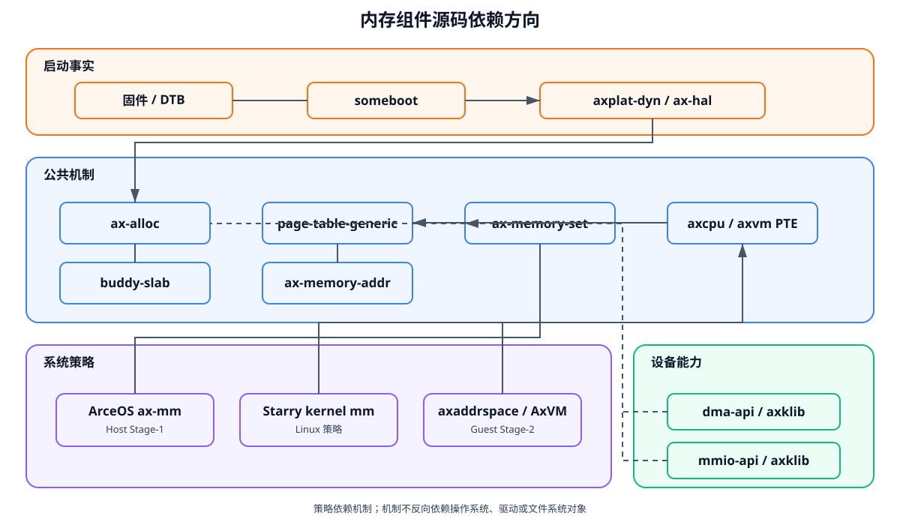

# 内存管理源码结构

内存子系统按固件事实、物理页所有权、地址翻译、操作系统策略和设备能力分层。各层的源码入口、依赖方向与修改边界如下。

## 1. 源码分层

内存主线由启动期、公共机制、系统策略和设备能力四组源码组成。目录层级不是调用深度；例如页表算法通过 `FrameAllocator` 获取页表页，但 `page-table-generic` 和 `axcpu::paging` 都不直接依赖 `ax-alloc`。

### 1.1 公共组件

下表中的组件维护跨 ArceOS、StarryOS 和 Axvisor 共享的不变量。普通消费者只应依赖公共入口，不应直接访问 Buddy 或 Slab 的内部结构。

| 源码目录 | Crate 或模块 | 负责的事实 | 主要入口 |
| --- | --- | --- | --- |
| `memory/memory_addr/` | `ax-memory-addr` | 主机物理地址、虚拟地址、区间和页对齐 | `PhysAddr`、`VirtAddr`、`AddrRange` |
| `components/kernutil/src/memory.rs` | `kernutil::memory` | 启动内存描述符类型与区间覆盖判定 | `MemoryDescriptor`、`MemoryType`、`RangeOp`（`overwritable()`/`mergeable()`） |
| `memory/ranges-ext/src/lib.rs` | `ranges-ext` | 固定容量区间容器的合并与冲突处理 | `VecOp::merge_add()`、`RangeError` |
| `memory/ax-alloc/` | `ax-alloc` | 运行时页、内核堆、全局分配器和统计 | `global_init()`、`global_add_memory()`、`alloc_pages()` |
| `memory/buddy-slab-allocator/` | `buddy-slab-allocator` | 多段 Buddy 与每 CPU Slab 算法 | `GlobalAllocator`，仅供 `ax-alloc` 集成 |
| `memory/page-table-generic/` | `page-table-generic` | 无架构选择的递归页表遍历和页帧契约 | `FrameAllocator`、`TableMeta`、`PageTable` |
| `components/axcpu/src/paging.rs`、`src/{aarch64,riscv,x86_64,loongarch64}/paging.rs` | `axcpu` | 主机页表项、几何常量和本 CPU 失效 | `MappingFlags`、`ArchPagingMeta`、`A64Pte`/`Rv64Pte`/`X64Pte`/`La64Pte` |
| `virtualization/axvm/src/arch/*/` | `axvm` | 客户机第二阶段页表项、几何和失效 | `NestedPageTable`、`GenericNestedPageTable` |
| `platforms/someboot/src/arch/*/paging*` | `someboot` | 启动页表项、几何和启用流程 | 架构 boot table adapter |
| `memory/memory_set/` | `ax-memory-set` | 虚拟内存区域集合和直接 backend 操作 | `MemorySet`、`MemoryArea`、`MappingBackend` |
| `os/StarryOS/kernel/src/mm/` | Starry kernel mm | Linux 兼容 MM 生命周期、persistent VMA、页对象/rmap、事务、缺页和 syscall 接线 | `MmHandle`、`VmaMap`、`MappingOperation`、`PageObject`、`MutationReceipt`、`ProcessVmStat` |
| `memory/dma-api/` | `dma-api` | DMA 设备约束和资源所有权 | `DeviceDma`、`DmaAllocation`、`StreamingMap` |
| `memory/mmio-api/` | `mmio-api` | 内存映射输入输出能力和易失性访问 | `Mmio`、`MmioRaw`、`MmioOp` |

`buddy-slab-allocator` 是算法实现，不是第二个公共分配入口。若新消费者需要页，应扩展 `ax-alloc` 的类型化接口；若页表需要不同来源，应实现 `FrameAllocator`，而不是让页表 crate 反向依赖操作系统。

### 1.2 启动与系统集成

启动和操作系统目录负责把平台事实接到公共机制。它们可以包含策略，但不能复制公共 allocator、页表项或虚拟内存区域容器。

| 源码目录 | 所属路径 | 主要职责 |
| --- | --- | --- |
| `platforms/someboot/src/fdt/memory.rs` | 动态设备树启动 | 收集全部 RAM bank、reservation block 和 `/reserved-memory` |
| `platforms/someboot/src/efi_stub/memmap.rs` | UEFI 启动 | 把 UEFI memory type 归一为 `Free`、`Reserved` 或 `Mmio` |
| `platforms/someboot/src/mem/` | 早期启动 | 选择线性分配区、分配启动对象、发布最终内存图 |
| `platforms/axplat-dyn/src/mem.rs` | 动态平台 | 把启动描述符转换为固定容量平台内存区 |
| `os/arceos/modules/axhal/src/mem.rs` | ArceOS 硬件抽象 | 扣除保留区并进行基础页对齐 |
| `os/arceos/modules/axruntime/src/lib.rs` | ArceOS 运行时 | 初始化第一个 Buddy section，并加入其余不连续内存段 |
| `os/arceos/modules/axmm/` | ArceOS 策略 | 内核和用户第一阶段地址空间、线性映射与按需分配后端 |
| `os/StarryOS/kernel/src/mm/` | StarryOS 接线 | Linux 虚拟内存区域后端、文件系统、页缓存、系统调用和信号转换 |
| `virtualization/axaddrspace/` | Axvisor 策略 | 客户机物理地址空间、客户机 RAM 和第二阶段映射 |
| `components/axklib/src/dma.rs` | DMA 平台适配 | 把 `DeviceDma` 接到页分配、地址转换和缓存维护 |
| `components/axklib/src/mmio.rs` | MMIO 平台适配 | 把设备寄存器窗口接到内核地址空间映射能力 |

StarryOS 的 Linux 语义留在 Starry kernel `mm/`、syscall 和 procfs 接线中，Axvisor 的客户机策略留在 `axaddrspace`。二者都可使用相同页表机制和物理页入口，但不会共享同一个虚拟内存策略对象。

## 2. 依赖方向

依赖必须从策略指向机制，从设备驱动指向能力接口。下图同时给出直接 crate 依赖和运行时注入边界；虚线表示通过 trait 或平台函数注入，并不要求底层 crate 直接依赖上层。

### 2.1 组件依赖图

依赖图省略日志、错误和同步基础库，只展示会影响内存所有权、页表帧来源和设备资源释放的主路径。实线表示直接机制依赖，虚线表示上层通过 trait 或平台函数注入能力。



公共页表层只知道“如何申请、释放和访问一个页表帧”，不知道该页来自 Buddy、启动线性分配器还是测试 provider。这个边界消除了启动页表依赖运行时堆的循环。

### 2.2 禁止的反向依赖

反向依赖会制造第二份资源入口，或把 StarryOS、Axvisor 和驱动策略泄漏到可复用机制层。下表给出禁止方向、具体风险和应当使用的能力边界，新增依赖时需要逐项核对。

| 禁止方向 | 原因 | 正确边界 |
| --- | --- | --- |
| `page-table-generic` 或 `axcpu → ax-alloc` | 启动页表尚不能使用运行时 allocator，CPU 层也不应选择系统 allocator | 上层实现 `FrameAllocator` |
| `buddy-slab-allocator → ax-alloc` | 算法层不应知道公共用途和统计 | `ax-alloc` 包装算法层 |
| 公共机制 crate → Starry kernel/VFS/task | 可复用机制不能依赖操作系统对象 | Starry 专属文件、COW 和 proc 策略留在 `os/StarryOS/kernel/src/mm` |
| `dma-api → ax-alloc` | 设备能力接口不能选择全局 allocator | `axklib::dma` 或 OS adapter 实现 `DeviceDma` |
| 驱动 → `ax-mm::iomap()` | 驱动不应绑定某个操作系统地址空间 | 驱动依赖 `mmio-api` |
| ArceOS/StarryOS → Buddy 内部类型 | 绕过公共统计、zone 和所有权 | 只调用 `ax-alloc` |

这些反向依赖即使能够编译，也会把 allocator、操作系统策略或设备生命周期绑定到错误层级；审查依赖树时应将它们视为边界退化，而不是普通重构差异。

## 3. 关键调用链

调用链以“谁发布下一个阶段能够信任的事实”为主线。定位故障时，应从输出异常的阶段向上游核对，而不是直接修改最终消费者。

### 3.1 启动到运行时

动态平台的主调用链如下。不同架构的入口和页表寄存器不同，但内存图归一和 allocator 交接使用同一协议。

```text
firmware entry
  -> fdt::memory::init_memory_map() / efi_stub::memmap
  -> ranges_ext::VecOp::merge_add()（kernutil 描述符）
  -> mem::early_init()（排序 + 选第一个 > 8 MiB Free 段）
  -> mem::ram::init()
  -> boot page tables + saved DTB + per-CPU areas
  -> mem::memory_map_setup()
  -> axplat-dyn::mem
  -> axhal::mem::memory_regions()
  -> axruntime::init_allocator()
  -> ax_alloc::global_init() + global_add_memory()
  -> ax_alloc::init_percpu_slab(cpu_id)
```

`memory_map_setup()` 是单向交接点。它把线性分配器尚未发布的已用前缀（和 memory-backed debug console 区间）加入保留区；此后 early bump 不再使用，剩余 `Free` 描述符进入 Buddy。当前代码没有强制冻结状态，“交接后不再调用 early allocator”由启动调用顺序约定保证。

### 3.2 运行时请求

每种请求都有唯一分配和释放链。若新增代码无法指出最终 owner 和释放动作，说明边界尚未完整。

| 请求 | 分配调用链 | 释放动作 |
| --- | --- | --- |
| Rust 小对象 | `GlobalAlloc::alloc()` → `ax-alloc` → 当前 CPU Slab | 同一布局进入 Slab；跨 CPU 释放排入 owner 的 remote-free 链 |
| Rust 大对象 | `GlobalAlloc::alloc()` → `ax-alloc` → Buddy | 根据原 `Layout` 归还 Buddy |
| 显式页 | `global_allocator().alloc_pages(num, align, UsageKind)` → Buddy section | `GlobalPage::drop()` 固定归还 `UsageKind::Global`；其他 owner 调用对称 `dealloc_pages()` |
| 页表页 | 策略层 provider → `ax-alloc` | 页表销毁时由同一 provider 释放 |
| Starry 匿名页 | 缺页 backend → `ax-alloc` → 页表映射 → RSS 记账 | 解除页表映射、撤销记账、最后归还物理页 |
| 客户机 RAM | `axaddrspace` backend → `ax-alloc` → 第二阶段页表 | 客户机解除映射或虚拟机销毁 |
| DMA buffer | `DeviceDma` → `axklib::dma` → `ax-alloc` | 资源所有者 Drop 或按值消费 token |

任一调用链新增缓存、引用表或延迟回收后，都必须同步明确该状态由谁持有、在什么事件后释放，以及失败是否保留已经成功的前缀。
