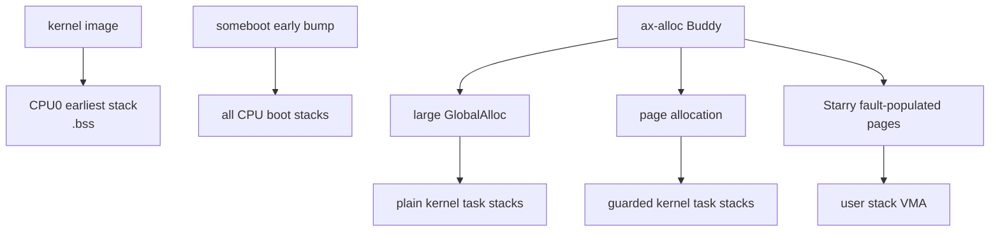
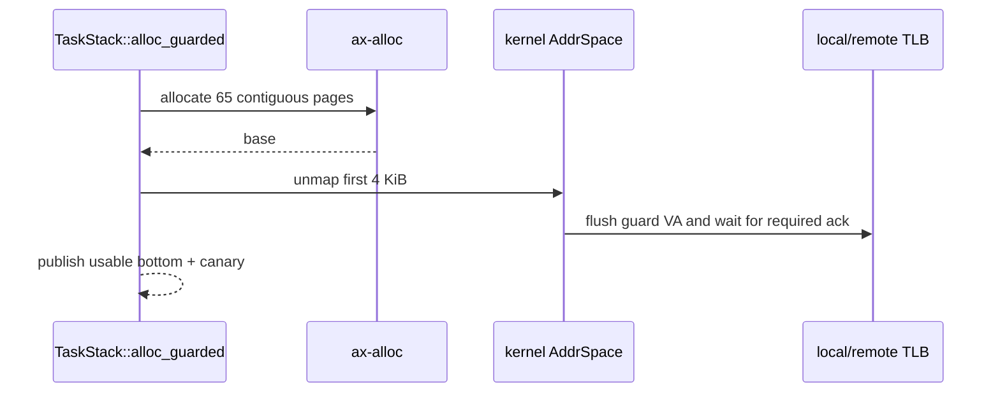

# 启动栈、内核任务栈与用户栈

TGOSKits 没有把物理 RAM 静态切成一个“栈区”和一个“堆区”。CPU0 最早期栈来自内核镜像 `.bss`，每 CPU 启动栈由 `someboot` early bump 预分配，普通内核任务栈从运行时 allocator 获取，Starry 用户栈则是用户地址空间中的 VMA。

## 1. 栈类型与生命周期

不同栈存在于不同启动阶段和地址空间。区分这些栈是分析内存占用、guard page 和释放行为的前提。

### 1.1 栈来源总览

当前主要栈类型如下。默认大小来自当前 linker/build 配置，平台配置可以覆盖任务栈大小。

| 栈类型 | 默认大小 | 来源 | 生命周期 |
| --- | --- | --- | --- |
| CPU0 最早期 linker 栈 | `STACK_SIZE = 0x40000`，256 KiB | kernel `.bss` / `KImage` | 启动早期，镜像范围始终保留 |
| 每 CPU boot/main 栈 | `someboot::mem::stack_size()`，默认 256 KiB | early bump 的 per-CPU 区 | 系统生命周期，`TaskStack::Borrowed` 不释放 |
| 普通内核任务栈 | 默认 `0x40000`，可由构建配置覆盖 | `GlobalAlloc` 或显式页 allocation | task owner Drop 时释放 |
| idle 特殊栈 | 取决于构建 feature，部分配置为 16 KiB | task allocator | idle task 生命周期 |
| Starry 用户栈 | loader/ABI 选择的 VMA 大小 | 用户地址空间 backend，按需填页 | exec/exit/unmap 时回收 |

栈大小不是物理连续 RAM 的全局配额。只有具体 stack allocation 会消耗页；用户栈预留的 VSS 也不等于所有页面已经 resident。

### 1.2 栈与 heap 的关系

“栈和堆如何划分”在运行期表现为不同 owner 使用同一 allocator，而不是两个永久物理分区。下图展示来源关系。



普通任务栈默认 256 KiB，超过 2048 B Slab 上限，因此 plain 模式最终由 Buddy 提供大对象页。启用 guard page 后则直接使用显式连续页 API。

## 2. CPU0 启动栈

CPU0 在 allocator、完整页表和 per-CPU 映射可用之前就需要栈。这个阶段使用 linker 明确预留的静态范围，避免任何动态依赖。

### 2.1 链接布局

`platforms/someboot/src/ld/bss.ld` 在 `.bss` 末尾定义 `__cpu0_stack` 和 `__cpu0_stack_top`，并移动 location counter `STACK_SIZE`。`defaults.ld` 为该符号提供 256 KiB 默认值。

```text
.bss
├── ordinary BSS and COMMON
├── __cpu0_stack
├── STACK_SIZE bytes
└── __cpu0_stack_top
```

该范围包含在 kernel image 的结束边界中，`someboot::mem::early_init()` 将整个镜像记为 `KImage`。它不会进入 `Free`，也不会由运行时 allocator 单独释放。

### 2.2 切换到每 CPU 栈

建立目标页表和 per-CPU 映射后，`someboot::prime_entry()` 读取当前 CPU 的 `PerCpuMeta::stack_top`，转换到 per-CPU 虚拟地址，并通过架构 `jump_to()` 切换 SP 后进入 `__someboot_main`。

| 阶段 | SP 来源 | 可用能力 |
| --- | --- | --- |
| 最早架构入口 | linker CPU0 stack | 最小启动代码、FDT/页表准备 |
| MMU/per-CPU 初始化后 | `PerCpuMeta::stack_top_virt` | dynamic platform main、ax-runtime |
| scheduler 初始化后 | 同一 boot stack 被 main task 借用 | 正常内核任务调度 |

切换后 linker stack 仍属于 KImage，只是不再作为 main task 的运行栈。代码不能假定该旧范围会被回收到 Buddy。

## 3. 每 CPU 启动栈

每个可启动 CPU 都在 BSP early boot 阶段获得自己的 boot stack。AP 启动不依赖通用 heap，避免并发 bring-up 时 allocator 和 per-CPU storage 尚未就绪的问题。

### 3.1 预分配布局

`platforms/someboot/src/smp/layout.rs` 只保留一种每 CPU 连续布局。`layout_info()` 从 linker template 大小、`PerCpuMeta` 大小、stack 大小、页大小和区域对齐计算偏移；所有 CPU 共享同一个 `area_stride`。

| 计算量 | 公式 | 不变量 |
| --- | --- | --- |
| metadata offset | `align_up(data_size, meta_alignment)` | metadata 至少按 `max(align_of::<PerCpuMeta>(), 64)` 对齐 |
| stack offset | `align_up(metadata_end, page_size)` | stack 起点按页对齐 |
| area stride | `align_up(stack_end, region_alignment)` | 每个 CPU slot 可独立寻址 |
| allocation size | `area_stride * cpu_count` | checked multiplication，不能回绕 |

`alloc_percpu()` 按固件 CPU 数一次申请完整区域。最终高地址初始化阶段复制 linker per-CPU template，并为每个 CPU 写入 hardware ID、logical index、stack top 和 secondary entry；完成 cache maintenance 后才发布运行期 CPU 数。

### 3.2 调度器借用

动态平台的 `boot_stack_bounds(cpu_idx)` 从 `somehal::smp::cpu_meta()` 返回 stack bottom 和 size。非 host-test 构建中，`axtask::main_task_stack()` 用 `TaskStack::borrowed()` 包装该范围。

| Owner 状态 | `TaskStackKind` | Drop 行为 |
| --- | --- | --- |
| boot/main/secondary stack | `Borrowed` | 不释放，仅由启动层持有物理范围 |
| plain task allocation | `Alloc` | 用原 `Layout` 归还 `GlobalAlloc` |
| guard-page task allocation | `GuardedAlloc` | 恢复 guard PTE 后归还全部页 |

`Borrowed` 表达“任务使用但不拥有”。这防止 scheduler 在 main task 结束或重建时把 early bump 的系统级 stack 错误释放给 Buddy。

## 4. 普通内核任务栈

`os/arceos/modules/axtask/src/task.rs::TaskStack` 封装 task stack 的地址、大小和所有权类型。任务创建时会把请求大小向 4 KiB 对齐。

### 4.1 普通分配

未启用 `stack-guard-page` 时，`TaskStack::alloc_plain()` 使用 `Layout::from_size_align(size, TASK_STACK_ALIGN)` 和 Rust allocator 分配。默认 256 KiB 请求走 Buddy 大对象路径。

| 操作 | 实现 | 失败语义 |
| --- | --- | --- |
| allocation | `alloc::alloc::alloc(layout)` | null 时当前代码 assert/panic |
| bottom canary | `STACK_END_MAGIC` 写入 stack bottom | 调度检查可发现覆盖 |
| release | `alloc::alloc::dealloc(ptr, layout)` | 必须使用原 size/align |

Canary 能检测已经写到栈底的溢出，但不能阻止继续破坏相邻内存。需要立即 fault 的配置应启用 guard page。

### 4.2 保护页分配

启用 `stack-guard-page` 后，`TaskStack::alloc_guarded()` 申请 `usable pages + 1` 个连续 Normal 页，将最低一页从 kernel address space unmap，并把可用 bottom 设置在 guard page 之后。


Drop 时先通过 `ax-mm::kernel_aspace().map_linear()` 恢复 guard 页映射，再按原 `PageRequest` 释放整段 allocation。先恢复映射可避免 Buddy 重用该页后内核 direct map 仍残留 hole。

## 5. 栈保护一致性

改变 kernel stack guard PTE 后必须让可能缓存该映射的 CPU 失效。单核与 SMP 使用不同路径，但都在继续使用或释放页面前完成。

### 5.1 本地失效

未同时启用 SMP 和 IPI 时，`flush_stack_guard_tlb(vaddr)` 调用 `ax_hal::asm::flush_tlb(Some(vaddr))`。该路径假设没有其他 CPU 持有相关 kernel mapping。

| 事件 | PTE 操作 | TLB 操作 |
| --- | --- | --- |
| stack 创建 | unmap guard VA | local address flush |
| stack Drop | remap guard VA | local address flush |

页表事务成功并不自动替代架构 shootdown。guard stack 代码显式完成这一职责，因为它修改的是所有 CPU 可见的 kernel address space。

### 5.2 远端失效

同时启用 `stack-guard-page + smp + ipi` 时，代码在禁止抢占的 guard 内向所有 ready remote CPU 发送 flush closure，并以 Release/Acquire ack 计数等待完成，最后 flush 本 CPU。

| 约束 | 当前实现 |
| --- | --- |
| CPU 选择 | 跳过 current CPU 和尚未 ready 的 CPU |
| 顺序 | 修改映射后 fence，remote/local flush，再等待 ack |
| 超时 | 5 秒后 panic，报告 ack 数和地址 |
| 页面释放 | 仅在 remap 与 shootdown 完成后执行 |

超时 panic 是内核映射一致性失败，而不是可忽略的性能告警。若某架构提供硬件 broadcast，通用页表层可声明该 scope，但当前 stack guard 路径仍使用自己的 IPI 协议。

## 6. Starry 用户栈

Starry 用户栈属于用户虚拟地址空间，不是 `TaskStack`。loader 和进程内存策略建立 stack VMA，物理页由缺页或 populate 路径按需分配。

### 6.1 虚拟区与驻留页

用户栈的虚拟范围计入 VSS，只有已映射的匿名页计入 RSS。`starry-mm::ProcessMemStats::record_vma()` 通过 `[stack]` 名称或进程 stack range 将 VMA 分类到 `stack_pages`。

| 指标 | 用户栈含义 | 物理占用关系 |
| --- | --- | --- |
| `VmStk` | 被识别为 stack 的 VMA 页数 | 可能包含未驻留页 |
| `VmSize` | 全部 VMA 的 VSS | 不等于 Buddy 已分配页 |
| `RssAnon` | 已驻留匿名页 | 包含实际 fault/populate 的 stack page |
| kernel task stack | 内核态执行栈 | 不计入用户进程 VMA 统计 |

用户栈释放通过 address space unmap/clear 和 backend page owner 完成，不调用 `TaskStack::drop()`。

### 6.2 保护边界

用户访问权限由 Stage-1 PTE 和 Starry VMA flags 共同决定。kernel stack guard feature 只保护 `axtask` 内核栈，不会自动给所有 Starry 用户 stack 增加 guard VMA。

| 边界 | 负责组件 | 故障处理 |
| --- | --- | --- |
| 用户 stack VMA 权限 | Starry `AddrSpace` / backend | 转换为 `FaultOutcome`，再由 kernel 处理 signal |
| kernel task guard page | `axtask` + `ax-mm` | 诊断 `diagnose_stack_guard_page_fault()` |
| CPU boot stack 范围 | `someboot` / `ax-hal` | 启动配置与 canary，当前无动态 guard |

分析 stack overflow 时必须先确认 fault address 属于哪种 stack。把用户 VMA fault 误判成 kernel guard，或把 boot stack 当作 allocator 泄漏，都会得出错误结论。

## 7. 配置与审计入口

栈行为跨 linker、启动平台、scheduler 和用户 VM，修改默认大小或 guard feature 时需要同时检查这些边界。

### 7.1 配置来源

默认值存在于不同构建阶段，最终以平台和 `axbuild` 生成配置为准。重复默认值必须保持语义一致或由构建脚本明确覆盖。

| 配置 | 当前默认 | 源码入口 |
| --- | --- | --- |
| someboot `STACK_SIZE` | `0x40000` | `platforms/someboot/src/ld/defaults.ld` |
| axtask task stack | `0x40000` | `os/arceos/modules/axtask/build.rs` |
| ax-runtime task stack | `0x40000` | `os/arceos/modules/axruntime/build.rs` |
| API exposed task stack | `0x40000` | `arceos_api` / `arceos_posix_api` config |
| user pthread compatibility default | 2 MiB | `os/arceos/ulib/axstd/src/os/libc_compat.rs` |

修改一个默认值后应验证生成的 build info、公开 API 和实际 task creation 参数，避免文档或 resource limit 仍报告旧值。

### 7.2 源码检查点

下面的文件覆盖 stack 从静态布局到释放的完整生命周期。测试应同时覆盖 owner 类型、canary 和 guard shootdown。

| 源码 | 审计重点 |
| --- | --- |
| `platforms/someboot/src/ld/bss.ld` | CPU0 linker stack 是否位于 KImage |
| `platforms/someboot/src/smp/layout.rs` | 每 CPU offset、stride、总大小和 checked arithmetic |
| `platforms/someboot/src/smp/mod.rs` | typed layout 初始化、CPU metadata 发布与 cache maintenance |
| `platforms/axplat-dyn/src/boot.rs` | `boot_stack_bounds()` 元数据来源 |
| `os/arceos/modules/axtask/src/run_queue.rs` | main/secondary task 借用 boot stack |
| `os/arceos/modules/axtask/src/task.rs` | plain/guarded/borrowed Drop 与 TLB flush |
| `memory/starry-mm/src/stats.rs` | 用户 stack VMA 统计分类 |

验收时应记录每 CPU 固定 stack 总开销、最大 task 数乘以配置栈大小、guard page 的额外一页以及 Starry 用户 stack 的 VSS/RSS 差异。

## 8. 栈布局实例

栈内存的地址、物理占用和释放规则取决于栈类型。下面分别计算 per-CPU 区、guarded task stack 和 Starry 用户栈，三个例子不能互换释放逻辑。

### 8.1 四 CPU 启动区

`platforms/someboot/src/smp/layout.rs` 的确定性测试使用 data=128 B、metadata=64 B、stack=4096 B、page/region alignment=4096 B。对四个 CPU，计算结果是 metadata offset 128、stack offset 4096、stride 8192、总 allocation 32768 B。

```rust
let metadata_end = meta_offset.checked_add(metadata_size)?;
let stack_offset = checked_align_up_pow2(metadata_end, page_alignment)?;
let stack_end = stack_offset.checked_add(stack_size)?;
let area_stride = checked_align_up_pow2(stack_end, region_alignment)?;
let total_size = area_stride.checked_mul(cpu_count)?;
```

假设 early bump 返回区域起点 `0x8100_0000`，四个 CPU slot 的物理布局如下。

```text
CPU0 0x8100_0000..0x8100_2000
     data [0x8100_0000,0x8100_0080)
     meta [0x8100_0080,0x8100_00c0)
     pad  [0x8100_00c0,0x8100_1000)
     stack[0x8100_1000,0x8100_2000), top=0x8100_2000

CPU1 0x8100_2000..0x8100_4000, stack top=0x8100_4000
CPU2 0x8100_4000..0x8100_6000, stack top=0x8100_6000
CPU3 0x8100_6000..0x8100_8000, stack top=0x8100_8000
```

实际生产 stack 默认 256 KiB，data 和 `PerCpuMeta` 大小由 linker/template 与目标 ABI决定，计算公式相同。所有乘加和 alignment 都返回 `PerCpuLayoutError`，极端固件 CPU 数不会 wrapping 到小 allocation。

### 8.2 保护页任务栈

启用 `stack-guard-page` 后，请求 256 KiB task stack会把 usable size 对齐到 4 KiB，再额外申请一个 guard page，API request count为 65 页。当前 Buddy会把 65 页提升为 order 7 的 128 页 block；`TaskStack` 可见范围只使用前 65 页，剩余部分属于该 allocation 的内部碎片。可见范围第一页从 kernel address space unmap，`TaskStack::ptr` 指向第二页。

```text
base                                                           base + 0x41000
| guard 4 KiB |--------------- usable stack 256 KiB ----------------|
               ^ bottom / canary                         top / initial SP
```

关键分配代码直接使用显式页 API，而不是先从 `GlobalAlloc` 分配后再猜测页边界。

```rust
let usable_size = align_up_4k(size);
let guarded_size = usable_size
    .checked_add(PAGE_SIZE_4K)
    .expect("guarded task stack size overflow");
let pages = guarded_size / PAGE_SIZE_4K;
let base = ax_alloc::global_allocator().allocate_pages_raw(
    PageRequest {
        count: pages,
        align: PAGE_SIZE_4K,
        zone: MemoryZone::Normal,
    },
    UsageKind::Global,
)
.expect("guarded task stack allocation failed");
```

源码实际把 OOM 作为 task creation 的不可恢复初始化失败处理。guard page建立后必须执行本地或远端 TLB失效，不能只删除 PTE。



Drop 时顺序相反：先 remap guard page并完成 TLB同步，再以原 `count=65` 返回对应 Buddy block。若先 free，其他 CPU 的 stale translation 可能写入已经复用的物理页。这个实例也说明非 2 次幂连续请求的成本；是否调整 stack size必须由最大栈深和物理开销共同决定。

### 8.3 普通任务栈

未启用 guard feature 时，`TaskStack::alloc_plain()` 用 `Layout(size, TASK_STACK_ALIGN)` 进入 Rust allocator。默认 256 KiB 超过 Slab 上限，最终使用 Buddy large allocation，但所有权仍表现为 byte allocation。

| 属性 | Plain stack | Guarded stack |
| --- | --- | --- |
| 入口 | `alloc::alloc::alloc(Layout)` | `allocate_pages_raw(PageRequest)` |
| 下层 | large `GlobalAlloc` → Buddy | Buddy pages |
| overflow 检测 | bottom canary | unmapped guard + canary |
| Drop | `alloc::alloc::dealloc()` | remap guard后 raw page deallocation |
| 可否混用释放 | 否 | 否 |

`TaskStackKind::Borrowed` 两种 feature 下都不释放 backing。main task借用 someboot 预分配 stack，Drop 只能结束 task owner，不能把 early Reserved 区交给 runtime allocator。

### 8.4 Starry 用户栈

x86_64 当前用户栈顶部为 `0x0400_0000_0000`，VMA 大小为 8 MiB，因此起点是 `0x03ff_ff80_0000`。loader 先建立完整 `[stack]` VMA，再只 populate 初始 argv/envp/auxv 实际覆盖的尾部页。

```rust
let ustack_top = VirtAddr::from_usize(crate::config::USER_STACK_TOP);
let ustack_size = crate::config::USER_STACK_SIZE;
let ustack_start = ustack_top - ustack_size;
uspace.map(
    ustack_start,
    ustack_size,
    MappingFlags::READ | MappingFlags::WRITE | MappingFlags::USER,
    false,
    Backend::new_alloc(ustack_start, PageSize::Size4K, "[stack]"),
)?;
```

假设初始 stack image 为 13 KiB，`user_sp` 向下移动 13 KiB，populate range 再向下按页对齐，最多使 16 KiB resident。此时 VSS增加 8 MiB，RSS Anon只增加实际填充的四页；其余页面在后续用户访问时 fault-in。

| 用户栈量 | 示例结果 |
| --- | ---: |
| VMA | 8 MiB |
| 初始 stack data | 13 KiB |
| 初始 resident upper bound | 16 KiB / 4 页 |
| 初始 SP | `USER_STACK_TOP - 13 KiB`，再满足 ABI alignment |

Starry 当前使用固定大小 stack VMA，不实现 Linux `VM_GROWSDOWN`。非 FIXED mmap 的上界还会避开 `STACK_GUARD_GAP`，但这不是一个已映射的物理 guard page；两种 guard 语义不能混用。
