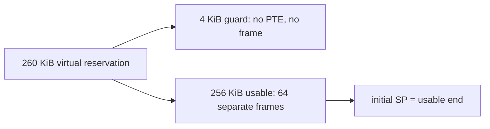

# 启动栈、内核任务栈与用户栈

TGOSKits 没有把物理 RAM 静态切成一个“栈区”和一个“堆区”。CPU0 最早期栈来自内核镜像 `.bss`，每 CPU 启动栈由 `someboot` 早期线性分配器预分配，普通内核任务栈从运行时分配器获取，Starry 用户栈则是用户地址空间中的 Virtual Memory Area（虚拟内存区域，VMA）。

## 1. 栈类型与生命周期

不同栈存在于不同启动阶段和地址空间。区分这些栈是分析内存占用、guard page 和释放行为的前提。

### 1.1 栈来源总览

当前主要栈类型如下。默认大小来自当前 linker/build 配置，平台配置可以覆盖任务栈大小。

| 栈类型 | 默认大小 | 来源 | 生命周期 |
| --- | --- | --- | --- |
| CPU0 最早期 linker 栈 | `STACK_SIZE = 0x40000`，256 KiB | kernel `.bss` / `KImage` | 启动早期，镜像范围始终保留 |
| 每 CPU boot/main 栈 | `someboot::mem::stack_size()`，默认 256 KiB | early bump 的 per-CPU 区 | 系统生命周期，bootstrap resource 不持有可释放 stack handle |
| 普通内核任务栈 | 默认 `0x40000`，可由构建配置覆盖 | `axruntime` 的 heap 或 `KernelVirtualAllocation` | thread resource reaper 释放 |
| idle 栈 | 与运行时任务栈配置一致 | `axruntime` stack allocator | idle thread 生命周期 |
| Starry 用户栈 | loader/应用程序二进制接口选择的虚拟内存区域大小 | 用户地址空间 backend，按需填页 | exec/exit/unmap 时回收 |

栈大小不是物理连续 RAM 的全局配额。只有具体 stack allocation 会消耗页；用户栈预留的虚拟内存大小也不等于所有页面已经 resident。

### 1.2 栈与 heap 的关系

“栈和堆如何划分”在运行期表现为不同 owner 使用同一 allocator，而不是两个永久物理分区。下图展示来源关系。


普通任务栈默认 256 KiB。未启用保护页和 `vmap-task-stack` 时使用 heap；启用任一配置后，由 `KernelVirtualAllocation` 预留连续虚拟区并逐页分配 backing。保护页仅占虚拟地址，物理页统计使用 `UsageKind::TaskStack`。

### 1.3 架构差异

栈的 owner 与分配来源跨架构一致，架构入口仅负责把栈顶写入本架构栈寄存器并跳转：x86_64 使用 `rsp`，AArch64 和 RISC-V 使用 `sp`，LoongArch64 使用 `$sp`。启动 entry 必须在进入 Rust 前满足相应调用约定的栈对齐，栈 owner 不保存架构私有寄存器状态。

Guard page 的架构差异只在本地地址转换缓存指令；四架构的跨 CPU 覆盖都由上层软件 mask、远程失效和确认协议拥有。地址窗口和指令细节统一见[多架构内存实现](./architecture-support.md)，本章后续只说明栈特有的 owner 和 guard 时序。

## 2. CPU0 启动栈

CPU0 在 allocator、完整页表和 per-CPU 映射可用之前就需要栈。这个阶段使用 linker 明确预留的静态范围，避免任何动态依赖。

### 2.1 链接布局

`platforms/someboot/src/ld/bss.ld` 在 `.bss` 末尾定义 `__cpu0_stack` 和 `__cpu0_stack_top`，并移动 location counter `STACK_SIZE`。`defaults.ld` 为该符号提供 256 KiB 默认值。

```text
.bss
├── ordinary BSS and COMMON
├── __cpu0_stack
├── STACK_SIZE bytes
└── __cpu0_stack_top
```

该范围包含在 kernel image 的结束边界中，`someboot::mem::early_init()` 将整个镜像记为 `KImage`。它不会进入 `Free`，也不会由运行时 allocator 单独释放。

### 2.2 切换到每 CPU 栈

建立目标页表和 per-CPU 映射后，`someboot::prime_entry()` 读取当前 CPU 的 `PerCpuMeta::stack_top`，转换到 per-CPU 虚拟地址，并通过架构 `jump_to()` 切换 SP 后进入 `__someboot_main`。

| 阶段 | SP 来源 | 可用能力 |
| --- | --- | --- |
| 最早架构入口 | linker CPU0 stack | 最小启动代码、扁平设备树/页表准备 |
| MMU/per-CPU 初始化后 | `PerCpuMeta::stack_top_virt` | dynamic platform main、ax-runtime |
| scheduler 初始化后 | 同一 boot stack 被 main task 借用 | 正常内核任务调度 |

切换后 linker stack 仍属于 KImage，只是不再作为 main task 的运行栈。代码不能假定该旧范围会被回收到 Buddy。

## 3. 每 CPU 启动栈

每个可启动 CPU 都在引导处理器 early boot 阶段获得自己的 boot stack。应用处理器启动不依赖通用 heap，避免并发 bring-up 时 allocator 和 per-CPU storage 尚未就绪的问题。

### 3.1 预分配布局

`platforms/someboot/src/smp/layout.rs` 只保留一种每 CPU 连续布局。`layout_info()` 从 linker template 大小、`PerCpuMeta` 大小、stack 大小、页大小和区域对齐计算偏移；所有 CPU 共享同一个 `area_stride`。

| 计算量 | 公式 | 保证条件 |
| --- | --- | --- |
| metadata offset | `align_up(data_size, meta_alignment)` | metadata 至少按 `max(align_of::<PerCpuMeta>(), 64)` 对齐 |
| stack offset | `align_up(metadata_end, page_size)` | stack 起点按页对齐 |
| area stride | `align_up(stack_end, region_alignment)` | 每个 CPU slot 可独立寻址 |
| allocation size | `area_stride * cpu_count` | checked multiplication，不能回绕 |

`alloc_percpu()` 按固件 CPU 数一次申请完整区域。最终高地址初始化阶段复制 linker per-CPU template，并为每个 CPU 写入 hardware ID、logical index、stack top 和 secondary entry；完成 cache maintenance 后才发布运行期 CPU 数。

### 3.2 调度器借用

动态平台的 `boot_stack_bounds(cpu_idx)` 从 `somehal::smp::cpu_meta()` 返回 stack bottom 和 size。调度器安装 bootstrap thread 时只接管当前架构 context 与 TLS；`create_bootstrap_resources()` 把 stack handle 设为 `StackHandle::NONE`，明确表示该 boot stack 仍由启动层拥有。

| Owner 状态 | 运行时表示 | 回收行为 |
| --- | --- | --- |
| boot/main/secondary stack | bootstrap `ThreadResources` 中为 `StackHandle::NONE` | 不释放，仅由启动层持有物理范围 |
| plain task allocation | opaque `StackHandle` 指向 `StackBacking::Heap` | 用原 `Layout` 归还 runtime allocator |
| guard-page task allocation | opaque `StackHandle` 指向 `StackBacking::VirtualPages` | 清除 usable PTE 并完成 TLB shootdown 后释放 backing 和 VA |

`StackHandle::NONE` 在 bootstrap resource bundle 中表达“任务正在使用，但 scheduler 没有获得该 stack 的回收所有权”。这防止 bootstrap thread 退休时把 early bump 的系统级 stack 错误释放给 Buddy。

## 4. 普通内核任务栈

`components/ax-task` 只持有运行时提供的 opaque `StackHandle`；分配策略和地址空间操作属于 `os/arceos/modules/axruntime/src/task/resources.rs::RuntimeStack`。普通任务创建先分配 stack/TLS/context，再把三个 handle 作为一个 `ThreadResources` bundle 转交给 scheduler；线程退出后由 resource reaper 按相反顺序销毁。

### 4.1 普通分配

未启用 `stack-guard-page` 和 `vmap-task-stack` 时，`allocate_heap_stack()` 使用请求的 usable size 与 alignment 构造 `Layout`，再经 `ax_alloc::global_allocator()` 分配。ArceOS 传入 16 字节 alignment；默认 256 KiB 请求走 Buddy 大对象路径。

| 操作 | 实现 | 失败语义 |
| --- | --- | --- |
| allocation | `global_allocator().alloc(layout)` | 返回 typed `RuntimeStatus` |
| publication | `Box<RuntimeStack>` 转为唯一 non-zero `StackHandle` | handle 必须只转交和销毁一次 |
| release | `global_allocator().dealloc(ptr, layout)` | 必须使用原 size/align |

plain stack 没有页级溢出隔离。需要越界后立即 fault 的配置应启用 guard page。

### 4.2 保护页分配

启用 `stack-guard-page` 或 `vmap-task-stack` 后，`allocate_virtual_stack()` 构造 `KernelVirtualAllocationLayout`。usable 和 guard 大小按请求对齐向上取整，`with_alignment()` 校验对齐约束。`KernelVirtualAllocation::allocate()` 从 kernel address space 的空洞预留整个区间，guard 范围始终没有 PTE，也没有对应物理页。

backing 的 `Vec`、`Arc` 和 data frame 在 kernel address-space 锁外准备；每个 PTE 通过 `plan_map_page()` 获取计划，在锁外准备 page-table deposit，再加锁重验并安装。并发改变目录会返回 stale deposit，失败的未发布页表页在锁外释放。任何部分安装失败均由已经创建的 token 把整段 reservation 标成 `Retiring`。

## 5. 栈保护一致性

`KernelVirtualAllocation` 和 `KernelVirtualAllocationBackend` 共同持有唯一虚拟区和 backing 生命周期。栈 token 的 `Drop` 只发布退休状态；同步释放与有界重试负责撤销页表和确认 TLB，resource reaper 才能最终释放内存。

### 5.1 发布和退休

新 reservation 从未发布过有效 guard PTE，因此创建栈不需要撤销 direct-map 页，也不等待尚未上线的 CPU。usable 页全部建立后才把栈 handle 交给 scheduler。

| 阶段 | 页表与所有权 |
| --- | --- |
| prepare | 锁外申请 backing，元数据预留 VA，再逐页安装 usable PTE |
| live | runtime 唯一 stack handle 持有 token，MM 元数据持有 backing |
| retiring | token 已放弃使用；元数据仍保留 VA 和全部 frame |
| quarantined | usable PTE 已分离，等待全 CPU TLB 确认 |
| reclaimed | 移除元数据，锁外 Drop backing；VA 可再次使用 |

`prepare_kernel_virtual_release()` 保留共享 kernel 页表目录，仅清除属于本 allocation 的 leaf。局部失败或 TLB 超时不会释放物理页，也不会复用 reservation；`retry_kernel_virtual_quarantines()` 按有界扫描继续处理，每轮失败的区间不会阻止后续独立区间。

### 5.2 调度与分配边界

`components/ax-task` 负责线程资源生命周期，`ax-runtime` 负责消费 `StackHandle`，`ax-mm` 负责 VMA/PTE/backing。调度切换不运行虚拟栈最终释放；普通资源准备会先重试一批退休区间，再申请新栈。

这与 Linux `vunmap_pte_range()` 保留页表目录、`finish_task_switch()` 在 runqueue 解锁后安排 MM 释放的责任划分一致。具体目标 CPU 的选择、上线同步和确认仍由 `ax_hal::cache::flush_tlb_range_all_cpus()` 负责。

## 6. Starry 用户栈

Starry 用户栈属于用户虚拟地址空间，不是 runtime `StackHandle`。loader 和进程内存策略建立 stack 虚拟内存区域，物理页由缺页或 populate 路径按需分配。

### 6.1 虚拟区与驻留页

用户栈的虚拟范围计入虚拟内存大小，只有已映射的匿名页计入常驻内存集大小。`os/StarryOS/kernel/src/mm/stats.rs::ProcessMemStats` 通过 `[stack]` 名称或进程 stack range 将虚拟内存区域分类到 `stack_pages`。

| 指标 | 用户栈含义 | 物理占用关系 |
| --- | --- | --- |
| `VmStk` | 被识别为 stack 的虚拟内存区域页数 | 可能包含未驻留页 |
| `VmSize` | 全部虚拟内存区域的虚拟内存大小 | 不等于 Buddy 已分配页 |
| `RssAnon` | 已驻留匿名页 | 包含实际 fault/populate 的 stack page |
| kernel task stack | 内核态执行栈 | 不计入用户进程虚拟内存区域统计 |

用户栈释放通过 address space unmap/clear 和 backend page owner 完成，不调用 runtime kernel-stack deallocator。

### 6.2 保护边界

用户访问权限由 Stage-1 页表项和 Starry 虚拟内存区域 flags 共同决定。kernel stack guard feature 只保护 `axruntime` 分配的内核栈，不会自动给所有 Starry 用户 stack 增加 guard 虚拟内存区域。

| 边界 | 负责组件 | 故障处理 |
| --- | --- | --- |
| 用户 stack 虚拟内存区域权限 | Starry `AddrSpace` / backend | `handle_page_fault()` 返回是否成功，trap 层再处理 signal |
| kernel task guard page | `axruntime` + `ax-mm` | 诊断 `diagnose_current_stack_guard_page_fault()` |
| CPU boot stack 范围 | `someboot` / `ax-hal` | 启动配置，当前无动态 guard |

分析 stack overflow 时必须先确认 fault address 属于哪种 stack。把用户虚拟内存区域 fault 误判成 kernel guard，或把 boot stack 当作 allocator 泄漏，都会得出错误结论。

## 7. 配置与审计入口

栈行为跨链接布局、启动平台、调度器和用户虚拟内存，修改默认大小或保护页 feature 时需要同时检查这些边界。

### 7.1 配置来源

默认值存在于不同构建阶段，最终以平台和 `axbuild` 生成配置为准。重复默认值必须保持语义一致或由构建脚本明确覆盖。

| 配置 | 当前默认 | 源码入口 |
| --- | --- | --- |
| someboot `STACK_SIZE` | `0x40000` | `platforms/someboot/src/ld/defaults.ld` |
| ax-runtime task stack | `0x40000` | `os/arceos/modules/axruntime/build.rs`；作为 `StackRequest` 传给 runtime allocator |
| API exposed task stack | `0x40000` | `arceos_api` / `arceos_posix_api` config |
| user pthread compatibility default | 2 MiB | `os/arceos/ulib/axstd/src/os/libc_compat.rs` |

修改一个默认值时必须同步生成的 build info、公开 API 和实际 task creation 参数，避免文档或 resource limit 仍报告旧值。

### 7.2 源码检查点

下面的文件覆盖 stack 从静态布局到释放的完整生命周期。resource handle owner 与 guard shootdown 的用例见[内存管理测试](./testing.md)。

| 源码 | 审计重点 |
| --- | --- |
| `platforms/someboot/src/ld/bss.ld` | CPU0 linker stack 是否位于 KImage |
| `platforms/someboot/src/smp/layout.rs` | 每 CPU offset、stride、总大小和 checked arithmetic |
| `platforms/someboot/src/smp/mod.rs` | typed layout 初始化、CPU metadata 发布与 cache maintenance |
| `platforms/axplat-dyn/src/boot.rs` | `boot_stack_bounds()` 元数据来源 |
| `os/arceos/modules/axruntime/src/task/bootstrap.rs` | bootstrap thread 如何保留外部 boot stack owner |
| `components/ax-task/src/thread/spec.rs` | scheduler 如何持有并一次性释放 opaque resource handles |
| `os/arceos/modules/axruntime/src/task/resources.rs` | heap/virtual stack 分配与回收 |
| `os/arceos/modules/axmm/src/kernel_alloc.rs` | reservation、逐页安装、退休和全 CPU TLB shootdown |
| `os/StarryOS/kernel/src/mm/stats.rs` | 用户 stack 虚拟内存区域统计分类 |

容量计算应包含每 CPU 固定 stack 总开销、最大 task 数乘以配置栈大小、guard page 的虚拟地址开销以及 Starry 用户 stack 的虚拟内存大小/常驻内存集大小差异。

## 8. 栈布局实例

栈内存的地址、物理占用和释放规则取决于栈类型。下面分别计算 per-CPU 区、guarded task stack 和 Starry 用户栈，三个例子不能互换释放逻辑。

### 8.1 四 CPU 启动区

以 data=128 B、metadata=64 B、stack=4096 B、page/region alignment=4096 B 为例，对四个 CPU，计算结果是 metadata offset 128、stack offset 4096、stride 8192、总 allocation 32768 B。

```rust
let metadata_end = meta_offset.checked_add(metadata_size)?;
let stack_offset = checked_align_up_pow2(metadata_end, page_alignment)?;
let stack_end = stack_offset.checked_add(stack_size)?;
let area_stride = checked_align_up_pow2(stack_end, region_alignment)?;
let total_size = area_stride.checked_mul(cpu_count)?;
```

假设 early bump 返回区域起点 `0x8100_0000`，四个 CPU slot 的物理布局如下。

```text
CPU0 0x8100_0000..0x8100_2000
     data [0x8100_0000,0x8100_0080)
     meta [0x8100_0080,0x8100_00c0)
     pad  [0x8100_00c0,0x8100_1000)
     stack[0x8100_1000,0x8100_2000), top=0x8100_2000

CPU1 0x8100_2000..0x8100_4000, stack top=0x8100_4000
CPU2 0x8100_4000..0x8100_6000, stack top=0x8100_6000
CPU3 0x8100_6000..0x8100_8000, stack top=0x8100_8000
```

实际生产 stack 默认 256 KiB，data 和 `PerCpuMeta` 大小由 linker/template 与目标应用程序二进制接口决定，计算公式相同。所有乘加和 alignment 都返回 `PerCpuLayoutError`，极端固件 CPU 数不会 wrapping 到小 allocation。

### 8.2 保护页任务栈

启用 `stack-guard-page` 后，256 KiB usable stack 加一个 4 KiB guard 预留 260 KiB 连续虚拟地址。backing 只分配 64 个独立物理页，不再将 65 页连续申请向上提升为 128 页 Buddy block。


```mermaid
flowchart LR
    Reservation["260 KiB virtual reservation"] --> Guard["4 KiB guard: no PTE, no frame"]
    Reservation --> Usable["256 KiB usable: 64 separate frames"]
    Usable --> Stack["initial SP = usable end"]
```

创建时每个 frame 和 page-table deposit 均在锁外准备。销毁时先清除 leaf，再完成 TLB 确认，最后在锁外释放 backing；guard hole 本身没有物理页需要归还。

### 8.3 普通任务栈

未启用上述两个 feature 时，`allocate_heap_stack()` 用 `Layout(usable_size, alignment)` 进入 runtime allocator。默认 256 KiB 超过 Slab 上限，使用 Buddy large allocation，但所有权仍表现为 byte allocation。

| 属性 | Heap stack | Virtual stack |
| --- | --- | --- |
| 入口 | `global_allocator().alloc(Layout)` | `KernelVirtualAllocation::allocate()` |
| 物理连续要求 | 由 byte allocator 决定 | 每页独立分配 |
| overflow 检测 | 无页级隔离 | 配置 guard 时为 unmapped hole |
| 回收 | 原 `Layout` deallocation | leaf detach → TLB 确认 → 锁外释放 |

bootstrap resource bundle 的 stack handle 仍为 `NONE`；someboot 的 Reserved 区不进入 runtime allocator 的退休流程。

### 8.4 Starry 用户栈

用户栈顶部来自当前 `AddrSpace` 捕获的不可变 `UserVirtualAddressLayout`。x86_64 的策略上限为 `0x0400_0000_0000`；LoongArch64 还会把该上限裁剪到 CPUCFG `VALEN` 给出的 lower canonical half，和 Linux 的 `STACK_TOP_MAX = TASK_SIZE64` 原理一致。例如实际 `VALEN=40` 时，`TASK_SIZE` 和栈顶都是 `0x80_0000_0000`。虚拟内存区域大小为 8 MiB；loader 先建立完整 `[stack]` 虚拟内存区域，再只 populate 初始 argv/envp/auxv 实际覆盖的尾部页。

```rust
let ustack_top = uspace.stack_top();
let ustack_size = crate::config::USER_STACK_SIZE;
let ustack_start = ustack_top - ustack_size;
uspace.map(
    ustack_start,
    ustack_size,
    MappingFlags::READ | MappingFlags::WRITE | MappingFlags::USER,
    false,
    MappingOperation::new_alloc(ustack_start, PAGE_SIZE_4K, "[stack]"),
)?;
```

假设初始 stack image 为 13 KiB，`user_sp` 向下移动 13 KiB，populate range 再向下按页对齐，最多使 16 KiB resident。此时虚拟内存大小增加 8 MiB，常驻内存集大小 Anon只增加实际填充的四页；其余页面在后续用户访问时 fault-in。

| 用户栈量 | 示例结果 |
| --- | ---: |
| 虚拟内存区域 | 8 MiB |
| 初始 stack data | 13 KiB |
| 初始 resident upper bound | 16 KiB / 4 页 |
| 初始 SP | 当前 MM 的 `stack_top - 13 KiB`，再满足应用程序二进制接口 alignment |

Starry 当前使用固定大小 stack 虚拟内存区域，不实现 Linux `VM_GROWSDOWN`。非 FIXED mmap 的上界还会避开 `STACK_GUARD_GAP`，但这不是一个已映射的物理 guard page；两种 guard 语义不能混用。
