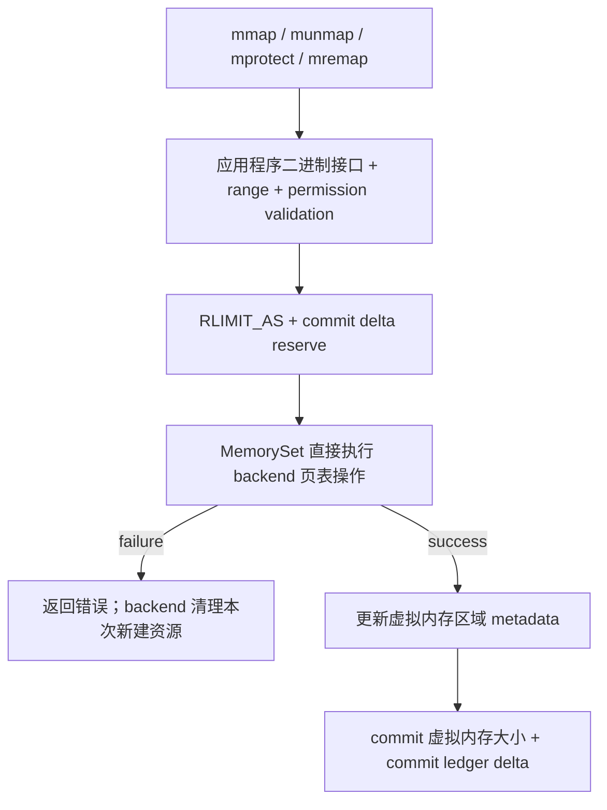
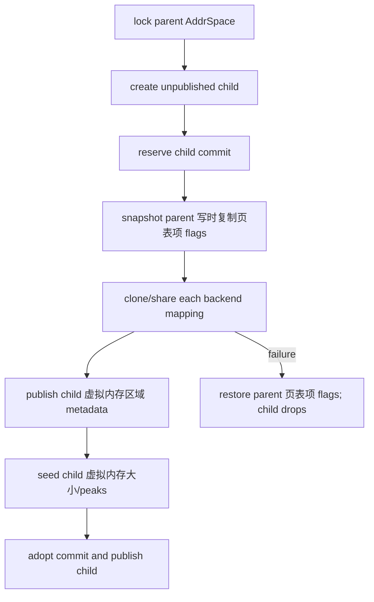
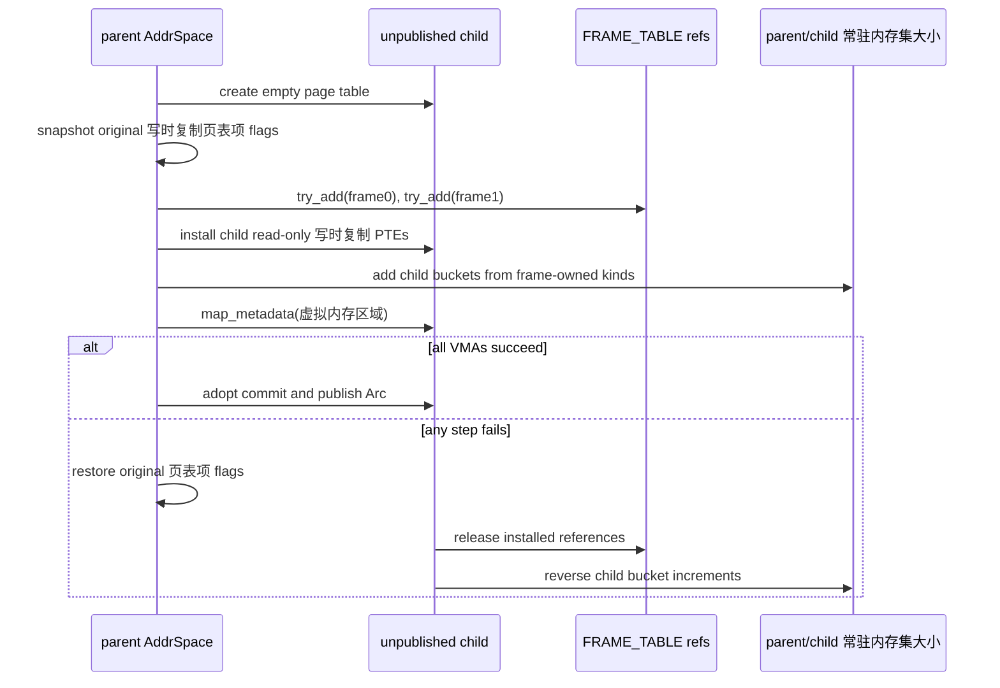

# StarryOS Linux 兼容内存管理

StarryOS 在公共内存机制之上实现 Linux 兼容虚拟内存。`memory/starry-mm` 是 `no_std` 策略与记账 crate；`os/StarryOS/kernel/src/mm` 保留具体 Virtual Memory Area（虚拟内存区域，VMA）后端、页表游标、Virtual File System（虚拟文件系统，VFS）与页缓存适配器，以及系统调用和信号接线。两者共同构成当前实现，不存在要求 Starry 直接复用 ArceOS `ax-mm` 策略的额外包装层。

## 1. 分层边界

Starry 需要 Linux 虚拟内存区域、Copy-on-Write（写时复制，COW）、文件与共享映射、Resident Set Size（常驻内存集大小，RSS）、Virtual Memory Size（虚拟内存大小，VSS）、超额承诺和缺页语义，这些能力不能塞进面向嵌入式内核的 `ax-alloc`。分层原则是把可复用策略向 `starry-mm` 提取，把操作系统对象和 Application Binary Interface（应用程序二进制接口，ABI）留在内核。

### 1.1 公共策略

`starry-mm` 不依赖 Starry kernel、虚拟文件系统、task、signal 或 syscall 实现。它通过小型 capability 接收物理页和文件能力。

| 模块 | 关键类型 | 职责 |
| --- | --- | --- |
| `policy` | `AddressSpaceCommit`、`CommitCharge`、`CommitDelta` | RLIMIT_AS admission、Committed_AS、overcommit mode |
| `accounting` | `MemoryAccounting`、`RssKind` | Anon/File/Shmem 常驻内存集大小聚合计数与 checked 分类转换 |
| `vm_stat` | `ProcessVmStat` | 虚拟内存大小和 peak 虚拟内存大小的增量更新 |
| `stats` | `ProcessMemStats`、`ResidentSnapshot` | `/proc` 需要的进程内存聚合与格式化 |
| `cow` | `CowFrameReferences` | checked `u32` 写时复制引用规则 |
| `pages` | `PageSource`、`SharedPages` | allocated/borrowed 共享页 ownership |
| `capability` | `VmFile`、`PrivateFileMapping` | 私有文件映射的最小读与身份能力 |
| `fault` | `FaultOutcome`、`CleanPageEvictor` | fault 结果和一次有界 clean reclaim |

这些类型不拥有具体 Stage-1 page table。`starry-mm` 对 `axcpu::paging::PageSize` 的依赖只用于共享页和 backend page-size 契约。

### 1.2 内核保留职责

Starry kernel 仍拥有 Linux 虚拟内存中依赖操作系统对象或具体页表项操作的部分。当前代码没有把整个 `mm/aspace/backend` 迁入独立 crate。

| Kernel 路径 | 当前职责 |
| --- | --- |
| `os/StarryOS/kernel/src/mm/aspace/mod.rs` | `AddrSpace` lock、`MemorySet`、page table、commit/常驻内存集大小 owner、fault 与 clone orchestration |
| `os/StarryOS/kernel/src/mm/aspace/backend/` | Linear、Cow、Shared、File backend 和直接页表项操作 |
| `os/StarryOS/kernel/src/syscall/mm/` | mmap/munmap/mprotect/mremap/madvise/msync/mlock/brk/mincore 应用程序二进制接口 |
| `os/StarryOS/kernel/src/task/resources.rs` | `RLIMIT_AS`、`RLIMIT_DATA`、`RLIMIT_STACK` 默认与更新 |
| `os/StarryOS/kernel/src/pseudofs/proc.rs` | meminfo、statm、status 和 overcommit sysctl 展示 |
| `os/StarryOS/kernel/src/file/memfd.rs` / page cache | memfd lifecycle、file page source、clean-page eviction adapter |

Kernel adapter 可以把 `FileBackend` 包装为 `VmFile`，但 `starry-mm` 不得反向引用 `ax_fs_ng::vfs::FileBackend`。

### 1.3 架构边界

Linux 虚拟内存区域、写时复制、常驻内存集大小、虚拟内存大小和 commit 语义不按架构复制。Starry kernel 把架构页表和缺页异常转换为相同 backend 操作与 `FaultOutcome`。

| 架构 | 第一阶段页表 | 缺页入口差异 | Starry 公共结果 |
| --- | --- | --- | --- |
| x86_64 | x86_64 四级页表 | page-fault error code 提供 present/write/user 等信息 | 转换为 read/write/execute fault 和 Linux signal/errno |
| AArch64 | VMSAv8-64 EL1 页表 | ESR/FAR 提供 fault status 与地址 | 同一虚拟内存区域权限和 `FaultOutcome` |
| RISC-V 64 | 当前 Starry 平台使用 Sv39 类页表 | load/store/instruction page fault | 同一缺页填充、写时复制和记账路径 |
| LoongArch64 | PGDL 用户页表与四级 walk | load/store/fetch 相关页异常 | 同一 backend fault 和 signal 转换 |

架构代码只提供 fault address、access type 和页表操作。`RLIMIT_AS`、overcommit、文件映射和写时复制计数不得出现在架构 trap handler 中。

## 2. 地址空间与映射后端

Starry `AddrSpace` 拥有用户虚拟地址 range、`MemorySet<Backend>`、Stage-1 page table、虚拟内存大小/常驻内存集大小记账和 commit ledger。外层 `Arc<Mutex<AddrSpace>>` 负责进程共享和同步。

### 2.1 映射后端

`Backend` 使用 enum dispatch 统一四种实际 mapping。每个 backend 实现 page size、map/unmap/populate/clone/protect 等领域操作，再通过 `MappingBackend` bridge 接入 `MemorySet` 虚拟区域容器。

| Backend | 物理来源 | 典型 mapping | 关键 ownership |
| --- | --- | --- | --- |
| `Linear` | 已知连续物理地址 | device/ION 或 kernel-provided range | 不释放外部物理区 |
| `Cow` | anonymous page 或私有 file page | `MAP_PRIVATE`、匿名 heap/stack | frame table `u32` refs + frame-owned 常驻内存集大小分类 |
| `Shared` | `Arc<SharedPages>` | shared anonymous、SysV SHM、imported pages | 最后一个 `Arc` owner 决定页生命周期 |
| `File` | 虚拟文件系统/page cache | `MAP_SHARED` file mapping | file/page-cache owner 与 dirty/writeback 语义 |

每个 area 同时保存 actual flags 和 reported flags。写时复制页表项可以保持只读以捕获第一次写 fault，而虚拟内存区域仍向用户报告 `PROT_WRITE`。

### 2.2 映射与记账顺序

map、replace、unmap 和 protect 先在 `AddrSpace` 层完成范围、`RLIMIT_AS` 和 commit delta 检查，再由 `ax-memory-set` 直接调用 backend。公共容器不保存逐页 snapshot，也不提供 prepare/commit/rollback/finalize 协议。



Commit charge 使用 move-only token；如果后续虚拟内存区域/页表项操作失败，临时 `CommitCharge` Drop 自动归还全局计数。只有映射操作成功后才调用 `CommitDelta::commit()`。这只保证 commit accounting 不泄漏，不代表跨多个虚拟内存区域的页表操作自动回滚。

## 3. 地址空间准入

Starry 将虚拟地址上限和全局 committed-memory 分开。`RLIMIT_AS` 始终检查，overcommit mode 决定全局 commit limit 是否拒绝请求。

### 3.1 进程地址上限

`starry_mm::admit_address_space(current, replaced, requested, limit)` 计算 replacement 后的虚拟内存大小，并使用 checked addition 防止 overflow。默认 `RLIMIT_AS` 为 `u64::MAX`。

| 输入 | 含义 |
| --- | --- |
| `current_bytes` | 当前 address space 虚拟内存大小 |
| `replaced_bytes` | MAP_FIXED/mremap 等将被替换的虚拟内存大小 |
| `requested_bytes` | 新 mapping 的虚拟内存大小 |
| `limit` | 当前进程 `RLIMIT_AS.current` |

检查 replacement delta 避免 MAP_FIXED 在同等大小替换时被误算成先保留两份完整虚拟内存大小。mmap 与 mremap 从 `proc_data.rlim[RLIMIT_AS]` 取值，brk 同时处理 `RLIMIT_AS` 和 data limit。

### 3.2 内存承诺策略

默认构建使用 Always overcommit，`starry-strict-commit` feature 使用 Strict。两种模式都维护 `Committed_AS`，只有 Strict 在超过 limit 时拒绝 reserve。

| 模式 | Feature | `/proc/sys/vm/overcommit_memory` | Admission |
| --- | --- | --- | --- |
| Always | 默认 | `1` | 记录 committed bytes，但不按 global limit 拒绝 |
| Strict | `starry-strict-commit` | `2` | CAS reserve 后若超过 limit 返回 `CommitLimit` |

Starry 启动时用 `ax_alloc::used_bytes() + available_bytes()` 配置 commit limit，即 allocator 当前管理容量。当前不实现 Linux heuristic mode 0，也不实现 swap-backed commit expansion。

### 3.3 承诺账本

全局 `CommitAccounting` 使用 `AtomicU64`，每个 `AddrSpace` 使用非原子的 `AddressSpaceCommit { bytes }`，后者只在 owning address-space lock 内修改。

`Committed_AS` 按 backing promise 计算，不等于虚拟内存大小：私有匿名/写时复制和私有文件映射只在虚拟内存区域可写时计入每地址空间 ledger；只读私有匿名映射不计入。allocator-owned shared-anonymous `SharedPages` 在创建时持有一次全局 charge，所有虚拟内存区域与 fork 共享同一个 `Arc` owner，最后一个 owner 释放时归还；普通文件、linear/device mapping 和 imported `SharedPages` 不计入。

| 操作 | Ledger 行为 |
| --- | --- |
| 虚拟内存区域扩大 | `prepare_delta()` reserve 增量，成功后 adopt |
| 虚拟内存区域缩小 | 映射操作成功后 release 差额 |
| equal replacement | `CommitDelta::Unchanged` |
| fork clone | `reserve_clone()` 只预留父进程私有 ledger 的同等 bytes；shared owner 仅克隆 `Arc` |
| shared-anonymous owner | `SharedPages::new()` reserve 一次；最后一个 `Arc` Drop 释放 |
| exec/clear/Drop | `AddressSpaceCommit::clear()` 释放全部 bytes |

全局 commit counter 不进入 page fault 热路径。它描述虚拟内存承诺，不等于当前 resident page 数量。

## 4. 写时复制与克隆

写时复制 frame 引用规则位于 `starry-mm`，具体 frame table 和页表项 clone 位于 kernel backend。引用计数从旧的窄计数扩展为 checked `u32`。

### 4.1 页引用

`CowFrameReferences::try_add()` 使用 `checked_add`，overflow 时不修改 count；`release()` 区分仍共享和最后引用。kernel `FRAME_TABLE` 把物理地址映射到同时保存引用计数和常驻内存集大小分类的 `CowFrameState`。

| 操作 | 锁与结果 |
| --- | --- |
| 新写时复制 frame | `HashMap::try_reserve()` 后插入 count=1 与初始分类 |
| fork child reference | 在一次 `FRAME_TABLE` 临界区内 checked increment |
| unmap/clone failure cleanup | 在一次 `FRAME_TABLE` 临界区内 release |
| last reference | 从 frame table 删除并归还物理 frame |

`FRAME_TABLE` 只有一个短临界区，不存在每个物理页的第二级锁。fork 增加的每个 child 引用必须在 child 映射销毁或 clone 失败清理中有且仅有一次对应释放；物理页在表锁释放后归还分配器。

### 4.2 克隆流程

`AddrSpace::try_clone()` 先为 child 建立未发布的空地址空间，reserve commit，预留 parent 写时复制页表项 snapshot，再逐虚拟内存区域调用 backend `clone_map()`。



写时复制 `clone_map()` 在返回前已经安装 child 页表项、增加 frame reference，并根据 frame-owned 分类增加 child 常驻内存集大小汇总，因此随后使用 `map_metadata()` 发布对应虚拟内存区域，不能再次执行普通 backend map。metadata 发布失败时先由同一个写时复制 backend 撤销当前范围，已发布的前序虚拟内存区域再由 fresh child 的 Drop/clear 释放。其他 backend 仍通过普通 `MemorySet::map()` 提交。

失败路径恢复已修改的 parent 页表项 flags；如果恢复本身失败则返回 `AxError::BadState`。fresh child 未发布，其 Drop/clear 负责释放已经建立的 mappings、frame references 和汇总计数。

## 5. 进程内存统计

Starry 区分虚拟映射规模与 resident page。`ProcessVmStat` 负责虚拟内存大小增量，`MemoryAccounting` 负责真实 Anon/File/Shmem 常驻内存集大小，`ProcessMemStats` 在生成 proc 内容时聚合两类快照。

### 5.1 驻留分类

`MemoryAccounting` 使用三个 relaxed atomic bucket 保存汇总值，hiwater 通过 atomic max 更新。每页分类只有一个来源：File/Shared backend 类型，或写时复制 frame 的 `CowFrameState::rss_kind`。

| Bucket | 计入内容 |
| --- | --- |
| `Anon` | anonymous fault、私有 file 写写时复制后的页 |
| `File` | file-backed resident 页和私有 file read fault |
| `Shmem` | shared anonymous / shared memory resident 页 |
| `hiwater_rss` | current total 的历史最大值 |

File-backed private page 第一次写 fault 会把对应 frame 分类和汇总计数从 File 迁移为 Anon。mremap 只移动页表项，frame owner 和汇总计数都不变化，因此不需要维护按虚拟地址移动的记账记录。

`MemoryAccounting` 在 `memory/starry-mm/src/accounting.rs` 中定义。三个常驻内存集大小 bucket 与 hiwater 使用 relaxed atomic；所有减少操作通过 `AtomicU64::try_update()` 检查下溢，分类转换使用 `reclassify(from, to, pages)` 完成 checked 状态转换。

```rust
pub struct MemoryAccounting {
    rss_anon: AtomicU64,
    rss_file: AtomicU64,
    rss_shmem: AtomicU64,
    hiwater_rss: AtomicU64,
}
```

Starry kernel 的 `AddressSpacePageTable` 共同持有实际 `PageTable` 和 `MemoryAccounting`。`MappingBackend::map/unmap/protect` 因而从同一个显式对象访问页表和汇总计数，不使用 scope-local 原始指针或隐藏 registry。

### 5.2 虚拟规模与展示

`ProcessVmStat` 在 map/unmap/replace 成功后更新当前和 peak 虚拟内存大小。`ProcessMemStats::record_vma()` 通过 range、permission、path 与 shared 标志聚合 text/data/stack/exe/shared 虚拟内存大小。

| 展示 | 数据来源 |
| --- | --- |
| `/proc/<pid>/statm` | `ProcessMemStats::format_statm()` |
| `/proc/<pid>/status` Vm/常驻内存集大小行 | `format_status_vm_lines()` |
| `VmRSS` | Anon + File + Shmem，至少为 resident snapshot total |
| `VmPeak` | 虚拟内存大小 peak 与当前虚拟内存大小的最大值 |
| `Committed_AS` | `starry_mm::committed_bytes()` |
| allocator usage | `ax_alloc::AllocatorStats` 聚合 |

`ProcessVmStat` 只维护虚拟内存大小与 peak 虚拟内存大小；常驻内存集大小当前值和 high-water 均由
`MemoryAccounting` 维护，proc 与 `getrusage` 不再从虚拟内存大小推导常驻内存集大小。

## 6. 缺页与回收

用户 fault 先验证虚拟地址和权限，再由 backend populate。allocator 保持立即失败；只有 Starry 地址空间外层对 `NoMemory` 执行一次有界 clean-page reclaim。

### 6.1 故障结果

`AddrSpace::handle_page_fault()` 将内部结果归一为 `FaultOutcome`，kernel trap 层再转换为 resume、signal 或其他用户可见行为。

| 结果 | 条件 |
| --- | --- |
| `Resolved` | backend 至少 populate 一个页并完成 callback |
| `NoMapping` | fault 虚拟地址不在 address space 或无虚拟内存区域 |
| `PermissionDenied` | 虚拟内存区域不允许 requested access |
| `NoMemory` | 一次 reclaim/retry 后仍无法申请页 |
| `BackingError` | file/page source 或 populate 返回非 内存不足 错误 |

这种结果类型避免 `starry-mm` 直接依赖 signal number 或 Linux errno。trap/syscall glue 保留最终应用程序二进制接口转换责任。

### 6.2 有界 clean-page reclaim

`retry_after_clean_page_reclaim(requested_pages, evictor, operation)` 只在第一次结果是 `AxError::NoMemory` 时调用 evictor，且 evict 上限等于请求页数。

| 条件 | 行为 |
| --- | --- |
| 第一次成功 | 直接返回，不回收 |
| 非 `NoMemory` 错误 | 原样返回，不回收 |
| 请求 0 页 | 不回收 |
| evict 返回 0 | 返回第一次 内存不足 |
| evict 成功释放至少一页 | 只重试 operation 一次 |

kernel adapter `KernelPageCacheEvictor` 调用 `ax_fs_ng::file::page_cache_reclaim(max_pages)`，只驱逐 clean pages，不等待 dirty writeback。回收在 allocator 锁外执行。

## 7. 文件与共享页 capability

公共策略通过 capability 接受外部 owner，避免把虚拟文件系统和设备对象拉入 `starry-mm`。

### 7.1 文件能力

`VmFile` 只要求 length、offset read 和稳定身份信息。`PrivateFileMapping` 保存 file `Arc`、虚拟内存区域 base、file start 和可选 file end，并按 fault 虚拟地址计算 file offset。

| 能力 | 用途 |
| --- | --- |
| `len()` | EOF 与最后一页策略 |
| `read_at()` | 私有 file page fault 填充 |
| `info()` | path、inode、device 的虚拟内存区域/proc 报告 |
`PrivateFileMapping::read_page()` 单页读取与尾部清零策略`, `PageSource` capability 注入物理页来源 |

Kernel `KernelVmFile(FileBackend)` 是 adapter；它把虚拟文件系统返回的错误转换为 `AxResult`，不把 `FileBackend` 类型泄露到公共 crate。

### 7.2 共享页所有权

`SharedPages::new()` 通过注入的 `PageSource` 分配并清零全部页，任一中途失败会释放已经取得的页。`SharedPages::borrowed()` 不拥有物理页，可保存 type-erased `Arc` retainer 延长外部资源生命周期。

| Owner variant | Drop 行为 | 使用场景 |
| --- | --- | --- |
| `Allocated { source, commit }` | 逐页调用 `dealloc_page()` 并由 commit token 归还全局计数 | shared anonymous / SysV SHM |
| `Borrowed { retainer }` | 只释放 retainer，不释放物理地址 | dma-buf、设备或外部 owner mapping |

borrowed mapping 必须由 retainer 保证所有页表项消失前物理资源仍然 live。只有物理地址列表而没有 lifetime owner 的导入是不完整的。

`SharedPages::new()` 的关键一致性是“commit 先于物理页申请”，因此 allocation 失败时 commit token 通过 `Drop` 自动归还；具体页面分配失败时已经取得的页逆序释放，保证不会泄漏。下面是 `memory/starry-mm/src/pages.rs` 的核心逻辑。

```rust
pub fn new(
    size: usize,
    page_size: PageSize,
    source: &'static dyn PageSource,
) -> AxResult<Self> {
    let page_bytes = page_size as usize;
    if size == 0 || !size.is_multiple_of(page_bytes) {
        return Err(AxError::InvalidInput);
    }
    let commit = reserve_commit(u64::try_from(size).map_err(|_| AxError::InvalidInput)?)
        .map_err(|_| AxError::NoMemory)?;
    let count = size / page_bytes;
    let mut pages = Vec::with_capacity(count);
    for _ in 0..count {
        match source.alloc_page(PageInitialization::Zeroed, page_size) {
            Ok(paddr) => pages.push(paddr),
            Err(err) => {
                for paddr in pages.drain(..) {
                    source.dealloc_page(paddr, page_size);
                }
                return Err(err);
            }
        }
    }
    Ok(Self { phys_pages: pages, page_size, owner: SharedPagesOwner::Allocated { source, _commit: commit } })
}
```

`Arc<SharedPages>` 在 fork、fd close 和 mmap retainer 之间共享时，commit token 只由 owner variant 持有一次；克隆 `Arc` 不会重复申请 commit，最后一个 `Arc` Drop 时才真正归还全局计数。`borrowed` variant 不携带 commit token，因为 imported memory 的承诺归属外部 owner（如 dma-buf fd）。

`PageSource` 是注入到 `starry-mm` 的物理页能力。`PageInitialization::Zeroed` 要求 `alloc_page()` 在返回前清零，`PageInitialization::Uninitialized` 允许调用方自行初始化；后者通常用于 backend 已经计划写满整页的 fault 路径，避免重复清零。

## 8. 当前边界与源码入口

Starry 的 Linux 兼容内存已经覆盖主要 syscall 与记账，但不是 Linux `mm/` 的完整复制。嵌入式目标要求保持回收和数据结构有界。

### 8.1 当前限制

下列内容是当前实现边界，不应通过 proc 占位值误报为完整支持。

| 限制 | 当前状态 |
| --- | --- |
| swap | 未实现，proc 报告 0 |
| heuristic overcommit mode 0 | 未实现，只报告 1 或 2 |
| multi-generation 最近最少使用 / Maple Tree / 读-复制-更新 虚拟内存区域 | 不引入 |
| dirty-page writeback reclaim | fault 内存不足 路径只做 clean-page 有界 eviction |
| `ProcessVmStat` peak 常驻内存集大小 | 仍有虚拟内存大小近似遗留，真实常驻内存集大小由 `MemoryAccounting` 提供 |
| `/proc/meminfo` 多项 | 部分为分配器派生估算或固定 0，不等同 Linux 全量虚拟内存遥测 |
| backend 提取 | Cow/Shared/File/Linear 的具体页表项实现仍在 kernel |

增加用户可见语义时必须按 `book/guideline/starry/syscall.md` 对齐 Linux 行为，unsupported 路径应返回明确错误，不能静默成功。

### 8.2 源码检查点

下面的文件是 Starry 虚拟内存的主要审计入口。涉及系统调用可见行为时要同时检查对应系统调用和 proc/resource 输出。

| 源码 | 审计重点 |
| --- | --- |
| `memory/starry-mm/src/policy.rs` | RLIMIT_AS、mode 1/2、commit token |
| `memory/starry-mm/src/accounting.rs` | 常驻内存集大小 buckets、checked add/subtract/reclassify |
| `memory/starry-mm/src/cow.rs` | checked `u32` references |
| `memory/starry-mm/src/fault.rs` | 一次有界 clean reclaim |
| `memory/starry-mm/src/pages.rs` | allocated/borrowed owner rollback |
| `os/StarryOS/kernel/src/mm/aspace/` | 虚拟内存区域、页表项、fault、clone 和 backend |
| `os/StarryOS/kernel/src/syscall/mm/` | Linux syscall argument、ordering 与 errno |
| `os/StarryOS/kernel/src/pseudofs/proc.rs` | 对外统计与 overcommit 报告 |

StarryOS 的系统调用、跨虚拟内存区域失败注入、写时复制回滚和两种 commit 模式的用例集中在[内存管理测试与验收](./testing.md)。

## 9. Linux 虚拟内存实例

Starry 的一次内存操作通常同时涉及虚拟内存大小准入、Committed_AS、虚拟内存区域/页表项变更和常驻内存集大小。下面分别展开 `MAP_FIXED`、匿名缺页和 fork 写时复制，避免把四套计数混为同一含义。

### 9.1 固定地址替换

假设进程当前虚拟内存大小为 96 MiB，`RLIMIT_AS` 为 128 MiB。`[0x4000_0000, 0x4100_0000)` 已有 16 MiB 虚拟内存区域，用户用 `MAP_FIXED` 从同一起点请求 24 MiB，即新范围为 `[0x4000_0000, 0x4180_0000)`；其中替换原 16 MiB，并向右扩展 8 MiB。

| 量 | 数值 | 说明 |
| --- | ---: | --- |
| `current_bytes` | 96 MiB | 操作前虚拟内存大小 |
| `replaced_bytes` | 16 MiB | 被覆盖的已有虚拟内存区域字节 |
| `requested_bytes` | 24 MiB | 新 mapping大小 |
| `retained` | 80 MiB | `current - replaced` |
| `next` | 104 MiB | `retained + requested`，低于 128 MiB |

准入必须按净变化计算；若错误地使用 `current + requested`，会得到 120 MiB，虽然本例仍未超限，但会高估 16 MiB。将 limit 改成 112 MiB 时，正确算法仍允许 104 MiB，错误算法会误报 ENOMEM。

```rust
pub fn admit_address_space(
    current_bytes: u64,
    replaced_bytes: u64,
    requested_bytes: u64,
    limit: u64,
) -> Result<u64, AdmissionError> {
    let retained = current_bytes
        .checked_sub(replaced_bytes)
        .ok_or(AdmissionError::AccountingUnderflow)?;
    let next = retained
        .checked_add(requested_bytes)
        .ok_or(AdmissionError::Overflow)?;
    if limit != u64::MAX && next > limit {
        return Err(AdmissionError::AddressLimit);
    }
    Ok(next)
}
```

通过 RLIMIT_AS 后，writable private anonymous mapping 的 commit ledger 只准备净增 8 MiB。`CommitDelta::Increase` 持有 move-only `CommitCharge`；虚拟内存区域/页表项 replace 失败时 token Drop 自动从全局 Committed_AS 退回 8 MiB。当前低层 `replace` 采用先 unmap 再 map 的直接语义，不承诺在新 backend map 失败后恢复被覆盖映射。

### 9.2 匿名缺页

用户第一次写匿名虚拟内存区域的 `0x5000_1000` 时，`AddrSpace::handle_page_fault()` 先查虚拟内存区域和 WRITE 权限，再把地址按 backend page size 对齐并调用 `populate_with_bounded_reclaim()`。

```rust
let range = VirtAddrRange::from_start_size(
    vaddr.align_down(page_size),
    page_size as usize,
);
let populate_result =
    self.populate_with_bounded_reclaim(&backend, range, flags, access_flags);
```

成功的 4 KiB anonymous fault 使虚拟内存大小不变、Committed_AS 不变、常驻内存集大小 Anon 增加 1 页。虚拟内存大小和 commit 在建立虚拟内存区域时已经处理，fault 只兑现 resident page。

| 状态 | fault 前 | fault 后 |
| --- | ---: | ---: |
| 虚拟内存大小 | 例如 64 MiB | 64 MiB |
| address-space commit | 例如 32 MiB | 32 MiB |
| 常驻内存集大小 Anon | 10 页 | 11 页 |
| 页表项 | empty/not present | 指向新 frame，满足 fault access |

若第一次 allocation 返回 `NoMemory`，外层最多驱逐 `requested_pages` 个 clean page-cache 页并重试一次。backing I/O 错误、权限错误和无虚拟内存区域不会触发 reclaim。

```rust
let first = operation();
if !matches!(first, Err(AxError::NoMemory)) {
    return first;
}
if requested_pages == 0 || evictor.evict_clean_pages(requested_pages) == 0 {
    return first;
}
operation()
```

这个流程保证一次 fault 至多执行两次 populate，不会在 allocator 锁内进入虚拟文件系统，也不会因 dirty page writeback 无限等待。

### 9.3 连续填页回滚

文件预读或匿名页连续填充可能一次处理多个地址。假设请求为 `[0x6000_0000, 0x6000_1000]`，第一页已经完成映射和匿名页聚合计数递增，第二页在递增聚合计数时发生 checked overflow。

```text
failure point
虚拟地址 0x6000_0000 -> frame A, 匿名页聚合计数已递增
虚拟地址 0x6000_1000 -> frame B, 页表项已映射，聚合计数递增失败

rollback current
unmap 0x6000_1000 -> deinit frame B

rollback previous in reverse
unmap 0x6000_0000 -> decrement Anon -> deinit frame A
```

`CowBackend::rollback_fault_run()` 只有在页表项取消映射成功后才递减聚合计数并释放物理页。取消映射失败时保留物理页，返回 `BadState`，因为释放仍被页表项引用的页会造成释放后使用。

```rust
for &(vaddr, frame) in mapped.iter().rev() {
    if pt.unmap(vaddr).is_err() {
        restored = false;
        continue;
    }
    let kind = FRAME_TABLE.lock().kind(frame);
    if let (Some(acct), Some(kind)) = (acct, kind)
        && acct.dec(kind, 1).is_err()
    {
        restored = false;
    }
    self.deinit_frame(frame);
}
```

失败后的不变量是两页页表项均不存在、两个临时物理页均已归还，聚合计数恢复到操作前的值。

### 9.4 写时复制克隆

父进程有一个 writable private 虚拟内存区域 `[0x7000_0000, 0x7000_3000)`，其中前两页 resident。fork 不立即复制两页内容，而是把父子页表项调整为只读写时复制，并为两个 frame 增加引用。



父进程原有常驻内存集大小不因 fork 翻倍；child 根据实际安装的 resident 页表项建立自己的常驻内存集大小 snapshot。private commit ledger 会为 child 预留父 ledger 的同等 bytes，而 `SharedPages` 只克隆 `Arc`，不会重复收取 shared-anonymous owner 的全局 commit。

第一次写 fault 时，如果 frame reference count 大于 1，faulting process 申请新 frame并复制原页，再把自己的页表项切到 writable；原 frame reference 减 1。count 为 1 时可以在满足权限和页表规则的前提下直接恢复 writable，避免无意义复制。
