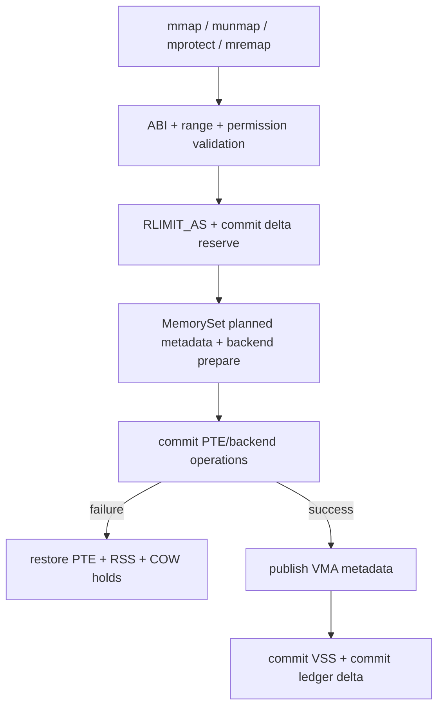
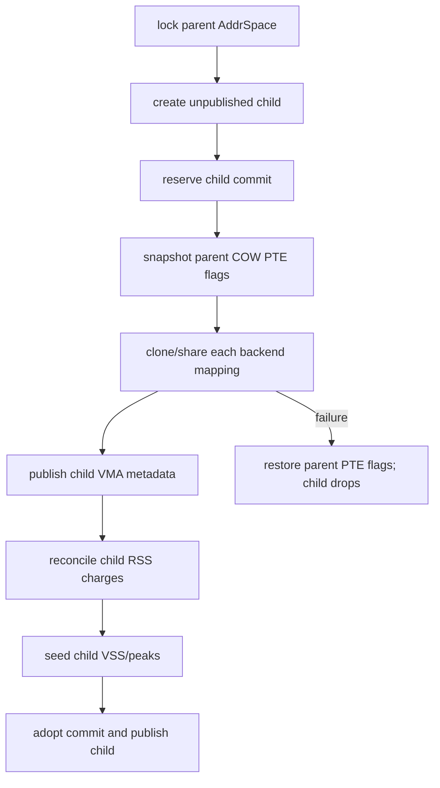
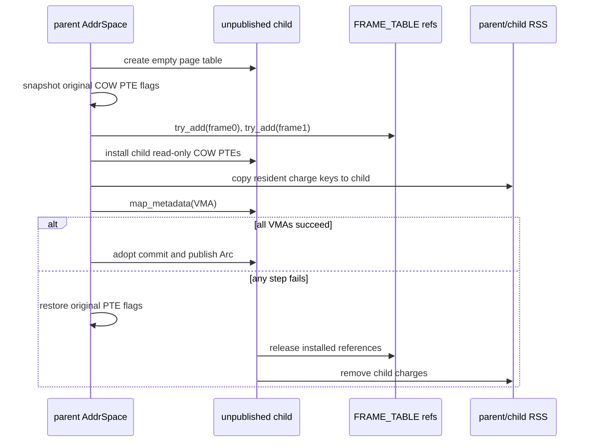

# StarryOS Linux 兼容内存管理

StarryOS 在公共内存机制之上实现 Linux 兼容虚拟内存。`memory/starry-mm` 是 `no_std` 策略与记账 crate；`os/StarryOS/kernel/src/mm` 保留具体 VMA/backend、页表游标、VFS/page-cache adapter 和 syscall/signal 接线。两者共同构成当前实现，不存在要求 Starry 直接复用 ArceOS `ax-mm` 策略的额外包装层。

## 1. 分层边界

Starry 需要 Linux VMA、COW、file/shared mapping、RSS/VSS、overcommit 和 fault 语义，这些能力不能塞进面向嵌入式内核的 `ax-alloc`。分层原则是把可复用策略向 `starry-mm` 提取，把 OS object 和 ABI 留在 kernel。

### 1.1 公共策略

`starry-mm` 不依赖 Starry kernel、VFS、task、signal 或 syscall 实现。它通过小型 capability 接收物理页和文件能力。

| 模块 | 关键类型 | 职责 |
| --- | --- | --- |
| `policy` | `AddressSpaceCommit`、`CommitCharge`、`CommitDelta` | RLIMIT_AS admission、Committed_AS、overcommit mode |
| `accounting` | `MemoryAccounting`、`RssKind` | Anon/File/Shmem RSS 与 COW per-VA charge |
| `vm_stat` | `ProcessVmStat` | VSS 和 peak VSS 的增量更新 |
| `stats` | `ProcessMemStats`、`ResidentSnapshot` | `/proc` 需要的进程内存聚合与格式化 |
| `cow` | `CowFrameReferences` | checked `u32` COW 引用规则 |
| `pages` | `PageSource`、`SharedPages` | allocated/borrowed 共享页 ownership |
| `capability` | `VmFile`、`PrivateFileMapping` | 私有文件映射的最小读与身份能力 |
| `fault` | `FaultOutcome`、`CleanPageEvictor` | fault 结果和一次有界 clean reclaim |

这些类型不拥有具体 Stage-1 page table。`starry-mm` 对 `ax-page-table::stage1::PageSize` 的依赖只用于共享页和 backend page-size 契约。

### 1.2 内核保留职责

Starry kernel 仍拥有 Linux VM 中依赖 OS object 或具体 PTE 操作的部分。当前代码没有把整个 `mm/aspace/backend` 迁入独立 crate。

| Kernel 路径 | 当前职责 |
| --- | --- |
| `os/StarryOS/kernel/src/mm/aspace/mod.rs` | `AddrSpace` lock、`MemorySet`、page table、commit/RSS owner、fault 与 clone orchestration |
| `os/StarryOS/kernel/src/mm/aspace/backend/` | Linear、Cow、Shared、File backend 和 PTE transaction |
| `os/StarryOS/kernel/src/syscall/mm/` | mmap/munmap/mprotect/mremap/madvise/msync/mlock/brk/mincore ABI |
| `os/StarryOS/kernel/src/task/resources.rs` | `RLIMIT_AS`、`RLIMIT_DATA`、`RLIMIT_STACK` 默认与更新 |
| `os/StarryOS/kernel/src/pseudofs/proc.rs` | meminfo、statm、status 和 overcommit sysctl 展示 |
| `os/StarryOS/kernel/src/file/memfd.rs` / page cache | memfd lifecycle、file page source、clean-page eviction adapter |

Kernel adapter 可以把 `FileBackend` 包装为 `VmFile`，但 `starry-mm` 不得反向引用 `ax_fs_ng::vfs::FileBackend`。

## 2. 地址空间与映射后端

Starry `AddrSpace` 拥有用户 VA range、`MemorySet<Backend>`、Stage-1 page table、VSS/RSS 记账和 commit ledger。外层 `Arc<Mutex<AddrSpace>>` 负责进程共享和同步。

### 2.1 映射后端

`Backend` 使用 enum dispatch 统一四种实际 mapping。每个 backend 实现 page size、map/unmap/populate/clone/protect 等领域操作，再通过 `MappingBackend` bridge 接入事务容器。

| Backend | 物理来源 | 典型 mapping | 关键 ownership |
| --- | --- | --- | --- |
| `Linear` | 已知连续 PA | device/ION 或 kernel-provided range | 不释放外部物理区 |
| `Cow` | anonymous page 或私有 file page | `MAP_PRIVATE`、匿名 heap/stack | frame table `u32` refs + per-VA RSS charge |
| `Shared` | `Arc<SharedPages>` | shared anonymous、SysV SHM、imported pages | 最后一个 `Arc` owner 决定页生命周期 |
| `File` | VFS/page cache | `MAP_SHARED` file mapping | file/page-cache owner 与 dirty/writeback 语义 |

每个 area 同时保存 actual flags 和 reported flags。COW PTE 可以保持只读以捕获第一次写 fault，而 VMA 仍向用户报告 `PROT_WRITE`。

### 2.2 映射事务

map、replace、unmap 和 protect 使用 `ax-memory-set` 的 prepare/commit/rollback/finalize 协议。Starry backend plan 保存旧 PTE、page size、RSS kind 和 COW transaction hold。



Commit charge 使用 move-only token；如果后续 VMA/PTE 操作失败，临时 `CommitCharge` Drop 自动归还全局计数。只有 transaction 成功后才调用 `CommitDelta::commit()`。

## 3. 地址空间准入

Starry 将虚拟地址上限和全局 committed-memory 分开。`RLIMIT_AS` 始终检查，overcommit mode 决定全局 commit limit 是否拒绝请求。

### 3.1 进程地址上限

`starry_mm::admit_address_space(current, replaced, requested, limit)` 计算 replacement 后的 VSS，并使用 checked addition 防止 overflow。默认 `RLIMIT_AS` 为 `u64::MAX`。

| 输入 | 含义 |
| --- | --- |
| `current_bytes` | 当前 address space VSS |
| `replaced_bytes` | MAP_FIXED/mremap 等将被替换的 VSS |
| `requested_bytes` | 新 mapping 的 VSS |
| `limit` | 当前进程 `RLIMIT_AS.current` |

检查 replacement delta 避免 MAP_FIXED 在同等大小替换时被误算成先保留两份完整 VSS。mmap 与 mremap 从 `proc_data.rlim[RLIMIT_AS]` 取值，brk 同时处理 `RLIMIT_AS` 和 data limit。

### 3.2 内存承诺策略

默认构建使用 Always overcommit，`starry-strict-commit` feature 使用 Strict。两种模式都维护 `Committed_AS`，只有 Strict 在超过 limit 时拒绝 reserve。

| 模式 | Feature | `/proc/sys/vm/overcommit_memory` | Admission |
| --- | --- | --- | --- |
| Always | 默认 | `1` | 记录 committed bytes，但不按 global limit 拒绝 |
| Strict | `starry-strict-commit` | `2` | CAS reserve 后若超过 limit 返回 `CommitLimit` |

Starry 启动时用 `ax_alloc::used_bytes() + available_bytes()` 配置 commit limit，即 allocator 当前管理容量。当前不实现 Linux heuristic mode 0，也不实现 swap-backed commit expansion。

### 3.3 承诺账本

全局 `CommitAccounting` 使用 `AtomicU64`，每个 `AddrSpace` 使用非原子的 `AddressSpaceCommit { bytes }`，后者只在 owning address-space lock 内修改。

`Committed_AS` 按 backing promise 计算，不等于 VSS：私有匿名/COW 和私有文件映射只在 VMA 可写时计入每地址空间 ledger；只读私有匿名映射不计入。allocator-owned shared-anonymous `SharedPages` 在创建时持有一次全局 charge，所有 VMA 与 fork 共享同一个 `Arc` owner，最后一个 owner 释放时归还；普通文件、linear/device mapping 和 imported `SharedPages` 不计入。

| 操作 | Ledger 行为 |
| --- | --- |
| VMA 扩大 | `prepare_delta()` reserve 增量，成功后 adopt |
| VMA 缩小 | transaction 成功后 release 差额 |
| equal replacement | `CommitDelta::Unchanged` |
| fork clone | `reserve_clone()` 只预留父进程私有 ledger 的同等 bytes；shared owner 仅克隆 `Arc` |
| shared-anonymous owner | `SharedPages::new()` reserve 一次；最后一个 `Arc` Drop 释放 |
| exec/clear/Drop | `AddressSpaceCommit::clear()` 释放全部 bytes |

全局 commit counter 不进入 page fault 热路径。它描述虚拟内存承诺，不等于当前 resident page 数量。

## 4. 写时复制与克隆

COW frame 引用规则位于 `starry-mm`，具体 frame table 和 PTE clone 位于 kernel backend。引用计数从旧的窄计数扩展为 checked `u32`。

### 4.1 页引用

`CowFrameReferences::try_add()` 使用 `checked_add`，overflow 时不修改 count；`release()` 区分仍共享和最后引用。kernel `FRAME_TABLE` 把 PA 映射到 `Arc<SpinNoIrq<CowFrameReferences>>`。

| 操作 | 锁与结果 |
| --- | --- |
| 新 COW frame | `FRAME_TABLE` 插入 count=1 |
| fork/transaction hold | clone table entry 后锁单 frame counter，checked increment |
| unmap/rollback | 锁 counter 并 release |
| last reference | 从 frame table 删除并归还物理 frame |

`FRAME_TABLE` 的 map lock 和每 frame lock 分开，避免持有全局 table lock执行所有引用变化。任何 manual hold 都必须在 abort、rollback 或 finalize 中有且仅有一次对应 release/transfer。

### 4.2 克隆流程

`AddrSpace::try_clone()` 先为 child 建立未发布的空地址空间，reserve commit，预留 parent COW PTE snapshot，再逐 VMA 调用 backend `clone_map()`。



COW `clone_map()` 在返回前已经安装 child PTE、增加 frame reference 并复制 RSS charge，因此随后使用 `map_metadata()` 发布对应 VMA，不能再次执行普通 backend map。metadata 发布失败时先由同一个 COW backend 撤销当前范围，已发布的前序 VMA 再由 fresh child 的 Drop/clear 释放。其他 backend 仍通过普通 `MemorySet::map()` 提交。

失败路径恢复已修改的 parent PTE flags；如果恢复本身失败则返回 `AxError::BadState`。fresh child 未发布，其 Drop/clear 负责释放已经建立的 mappings 和 charges。

## 5. 进程内存统计

Starry 区分虚拟映射规模与 resident page。`ProcessVmStat` 负责 VSS 增量，`MemoryAccounting` 负责真实 Anon/File/Shmem RSS，`ProcessMemStats` 在生成 proc 内容时聚合两类快照。

### 5.1 驻留分类

`MemoryAccounting` 使用三个 relaxed atomic bucket 和一个受 AddrSpace lock 保护的 COW per-VA `BTreeMap<VirtAddr, RssKind>`。hiwater 通过 atomic max 更新。

| Bucket | 计入内容 |
| --- | --- |
| `Anon` | anonymous fault、私有 file 写 COW 后的页 |
| `File` | file-backed resident 页和私有 file read fault |
| `Shmem` | shared anonymous / shared memory resident 页 |
| `hiwater_rss` | current total 的历史最大值 |

File-backed private page 第一次写 fault 会把对应 charge 从 File 迁移为 Anon。mremap 移动 PTE 时调用 `move_charge(src, dst)`，不通过 remove+record 制造瞬时计数偏差。

### 5.2 虚拟规模与展示

`ProcessVmStat` 在 map/unmap/replace 成功后更新当前和 peak VSS。`ProcessMemStats::record_vma()` 通过 range、permission、path 与 shared 标志聚合 text/data/stack/exe/shared VSS。

| 展示 | 数据来源 |
| --- | --- |
| `/proc/<pid>/statm` | `ProcessMemStats::format_statm()` |
| `/proc/<pid>/status` Vm/RSS 行 | `format_status_vm_lines()` |
| `VmRSS` | Anon + File + Shmem，至少为 resident snapshot total |
| `VmPeak` | VSS peak 与当前 VSS 的最大值 |
| `Committed_AS` | `starry_mm::committed_bytes()` |
| allocator usage | `ax_alloc::AllocatorStats` 聚合 |

`ProcessVmStat` 只维护 VSS 与 peak VSS；RSS 当前值和 high-water 均由
`MemoryAccounting` 维护，proc 与 `getrusage` 不再从 VSS 推导 RSS。

## 6. 缺页与回收

用户 fault 先验证 VA 和权限，再由 backend populate。allocator 保持立即失败；只有 Starry 地址空间外层对 `NoMemory` 执行一次有界 clean-page reclaim。

### 6.1 故障结果

`AddrSpace::handle_page_fault()` 将内部结果归一为 `FaultOutcome`，kernel trap 层再转换为 resume、signal 或其他用户可见行为。

| 结果 | 条件 |
| --- | --- |
| `Resolved` | backend 至少 populate 一个页并完成 callback |
| `NoMapping` | fault VA 不在 address space 或无 VMA |
| `PermissionDenied` | VMA 不允许 requested access |
| `NoMemory` | 一次 reclaim/retry 后仍无法申请页 |
| `BackingError` | file/page source 或 populate 返回非 OOM 错误 |

这种结果类型避免 `starry-mm` 直接依赖 signal number 或 Linux errno。trap/syscall glue 保留最终 ABI 转换责任。

### 6.2 有界 clean-page reclaim

`retry_after_clean_page_reclaim(requested_pages, evictor, operation)` 只在第一次结果是 `AxError::NoMemory` 时调用 evictor，且 evict 上限等于请求页数。

| 条件 | 行为 |
| --- | --- |
| 第一次成功 | 直接返回，不回收 |
| 非 `NoMemory` 错误 | 原样返回，不回收 |
| 请求 0 页 | 不回收 |
| evict 返回 0 | 返回第一次 OOM |
| evict 成功释放至少一页 | 只重试 operation 一次 |

kernel adapter `KernelPageCacheEvictor` 调用 `ax_fs_ng::file::page_cache_reclaim(max_pages)`，只驱逐 clean pages，不等待 dirty writeback。回收在 allocator 锁外执行。

## 7. 文件与共享页 capability

公共策略通过 capability 接受外部 owner，避免把 VFS 和设备对象拉入 `starry-mm`。

### 7.1 文件能力

`VmFile` 只要求 length、offset read 和稳定身份信息。`PrivateFileMapping` 保存 file `Arc`、VMA base、file start 和可选 file end，并按 fault VA 计算 file offset。

| 能力 | 用途 |
| --- | --- |
| `len()` | EOF 与最后一页策略 |
| `read_at()` | 私有 file page fault 填充 |
| `info()` | path、inode、device 的 VMA/proc 报告 |
| `PrivateFileMapping::read_page()` | 单页读取与尾部清零策略 |

Kernel `KernelVmFile(FileBackend)` 是 adapter；它把 VFS 返回的错误转换为 `AxResult`，不把 `FileBackend` 类型泄露到公共 crate。

### 7.2 共享页所有权

`SharedPages::new()` 通过注入的 `PageSource` 分配并清零全部页，任一中途失败会释放已经取得的页。`SharedPages::borrowed()` 不拥有物理页，可保存 type-erased `Arc` retainer 延长外部资源生命周期。

| Owner variant | Drop 行为 | 使用场景 |
| --- | --- | --- |
| `Allocated { source, commit }` | 逐页调用 `dealloc_page()` 并由 commit token 归还全局计数 | shared anonymous / SysV SHM |
| `Borrowed { retainer }` | 只释放 retainer，不释放 PA | dma-buf、设备或外部 owner mapping |

borrowed mapping 必须由 retainer 保证所有 PTE 消失前物理资源仍然 live。只有物理地址列表而没有 lifetime owner 的导入是不完整的。

## 8. 当前边界与源码入口

Starry 的 Linux 兼容内存已经覆盖主要 syscall 与记账，但不是 Linux `mm/` 的完整复制。嵌入式目标要求保持回收和数据结构有界。

### 8.1 当前限制

下列内容是当前实现边界，不应通过 proc 占位值误报为完整支持。

| 限制 | 当前状态 |
| --- | --- |
| swap | 未实现，proc 报告 0 |
| heuristic overcommit mode 0 | 未实现，只报告 1 或 2 |
| multi-generation LRU / Maple Tree / RCU VMA | 不引入 |
| dirty-page writeback reclaim | fault OOM 路径只做 clean-page 有界 eviction |
| `ProcessVmStat` peak RSS | 仍有 VSS 近似遗留，真实 RSS 由 `MemoryAccounting` 提供 |
| `/proc/meminfo` 多项 | 部分为 allocator 派生估算或固定 0，不等同 Linux 全量 VM telemetry |
| backend 提取 | Cow/Shared/File/Linear 的具体 PTE 实现仍在 kernel |

这些限制应在增加用户可见语义时按 `book/guideline/starry/syscall.md` 验证 Linux 行为，不能用放宽测试或静默成功掩盖 unsupported 路径。

### 8.2 源码检查点

下面的文件是 Starry VM 的主要审计入口。涉及 syscall 可见行为时要同时检查对应 syscall 和 proc/resource 输出。

| 源码 | 审计重点 |
| --- | --- |
| `memory/starry-mm/src/policy.rs` | RLIMIT_AS、mode 1/2、commit token |
| `memory/starry-mm/src/accounting.rs` | RSS buckets、charge map、fork/mremap reconciliation |
| `memory/starry-mm/src/cow.rs` | checked `u32` references |
| `memory/starry-mm/src/fault.rs` | 一次有界 clean reclaim |
| `memory/starry-mm/src/pages.rs` | allocated/borrowed owner rollback |
| `os/StarryOS/kernel/src/mm/aspace/` | VMA/PTE transaction、fault、clone、backend |
| `os/StarryOS/kernel/src/syscall/mm/` | Linux syscall argument、ordering 与 errno |
| `os/StarryOS/kernel/src/pseudofs/proc.rs` | 对外统计与 overcommit 报告 |

验收至少需要 mmap/munmap/mprotect/mremap/brk 的跨 VMA失败注入、fork COW parent/child rollback、RSS category 迁移、RLIMIT_AS replacement delta、Strict/Always 两种构建和 fault OOM 一次重试计数。

## 9. Linux 虚拟内存实例

Starry 的一次内存操作通常同时涉及 VSS 准入、Committed_AS、VMA/PTE 事务和 RSS。下面分别展开 `MAP_FIXED`、匿名缺页和 fork COW，避免把四套计数混为同一含义。

### 9.1 固定地址替换

假设进程当前 VSS 为 96 MiB，`RLIMIT_AS` 为 128 MiB。`[0x4000_0000, 0x4100_0000)` 已有 16 MiB VMA，用户用 `MAP_FIXED` 从同一起点请求 24 MiB，即新范围为 `[0x4000_0000, 0x4180_0000)`；其中替换原 16 MiB，并向右扩展 8 MiB。

| 量 | 数值 | 说明 |
| --- | ---: | --- |
| `current_bytes` | 96 MiB | 操作前 VSS |
| `replaced_bytes` | 16 MiB | 被覆盖的已有 VMA字节 |
| `requested_bytes` | 24 MiB | 新 mapping大小 |
| `retained` | 80 MiB | `current - replaced` |
| `next` | 104 MiB | `retained + requested`，低于 128 MiB |

准入必须按净变化计算；若错误地使用 `current + requested`，会得到 120 MiB，虽然本例仍未超限，但会高估 16 MiB。将 limit 改成 112 MiB 时，正确算法仍允许 104 MiB，错误算法会误报 ENOMEM。

```rust
pub fn admit_address_space(
    current_bytes: u64,
    replaced_bytes: u64,
    requested_bytes: u64,
    limit: u64,
) -> Result<u64, AdmissionError> {
    let retained = current_bytes
        .checked_sub(replaced_bytes)
        .ok_or(AdmissionError::AccountingUnderflow)?;
    let next = retained
        .checked_add(requested_bytes)
        .ok_or(AdmissionError::Overflow)?;
    if limit != u64::MAX && next > limit {
        return Err(AdmissionError::AddressLimit);
    }
    Ok(next)
}
```

通过 RLIMIT_AS 后，writable private anonymous mapping 的 commit ledger 只准备净增 8 MiB。`CommitDelta::Increase` 持有 move-only `CommitCharge`；VMA/PTE replace 失败时 token Drop 自动从全局 Committed_AS 退回 8 MiB。

### 9.2 匿名缺页

用户第一次写匿名 VMA 的 `0x5000_1000` 时，`AddrSpace::handle_page_fault()` 先查 VMA 和 WRITE 权限，再把地址按 backend page size 对齐并调用 `populate_with_bounded_reclaim()`。

```rust
let range = VirtAddrRange::from_start_size(
    vaddr.align_down(page_size),
    page_size as usize,
);
let populate_result =
    self.populate_with_bounded_reclaim(&backend, range, flags, access_flags);
```

成功的 4 KiB anonymous fault 使 VSS 不变、Committed_AS 不变、RSS Anon 增加 1 页。VSS 和 commit 在建立 VMA 时已经处理，fault 只兑现 resident page。

| 状态 | fault 前 | fault 后 |
| --- | ---: | ---: |
| VSS | 例如 64 MiB | 64 MiB |
| address-space commit | 例如 32 MiB | 32 MiB |
| RSS Anon | 10 页 | 11 页 |
| PTE | empty/not present | 指向新 frame，满足 fault access |

若第一次 allocation 返回 `NoMemory`，外层最多驱逐 `requested_pages` 个 clean page-cache 页并重试一次。backing I/O 错误、权限错误和无 VMA不会触发 reclaim。

```rust
let first = operation();
if !matches!(first, Err(AxError::NoMemory)) {
    return first;
}
if requested_pages == 0 || evictor.evict_clean_pages(requested_pages) == 0 {
    return first;
}
operation()
```

这个流程保证一次 fault 至多执行两次 populate，不会在 allocator 锁内进入 VFS，也不会因 dirty page writeback 无限等待。

### 9.3 连续填页回滚

file readahead 或 anonymous run 可能一次填充多个地址。假设 run 为 `[0x6000_0000, 0x6000_1000]`，第一页已经完成 map 和 Anon charge，第二页在 `record_charge()` 发现重复 key 后失败。

```text
failure point
VA 0x6000_0000 -> frame A, RSS charge存在
VA 0x6000_1000 -> frame B, PTE已map，RSS charge失败

rollback current
unmap 0x6000_1000 -> deinit frame B

rollback previous in reverse
unmap 0x6000_0000 -> remove RSS charge -> deinit frame A
```

`CowBackend::rollback_fault_run()` 只有在 PTE unmap 成功后才移除 charge 并释放 frame。unmap 失败时保留 frame，返回 `BadState`，因为释放仍被 PTE 引用的页会造成 use-after-free。

```rust
for &(vaddr, frame) in mapped.iter().rev() {
    if pt.unmap(vaddr).is_err() {
        restored = false;
        continue;
    }
    if acct.is_some_and(|acct| acct.remove_charge(vaddr).is_none()) {
        restored = false;
    }
    self.deinit_frame(frame);
}
```

对应 kernel axtest 会预置第二页 charge，验证操作失败后两页 PTE 都不存在、第一页临时 charge 已撤销、预置 charge 仍保留。

### 9.4 写时复制克隆

父进程有一个 writable private VMA `[0x7000_0000, 0x7000_3000)`，其中前两页 resident。fork 不立即复制两页内容，而是把父子 PTE 调整为只读 COW，并为两个 frame 增加引用。



父进程原有 RSS 不因 fork 翻倍；child 根据实际安装的 resident PTE建立自己的 RSS snapshot。private commit ledger 会为 child 预留父 ledger 的同等 bytes，而 `SharedPages` 只克隆 `Arc`，不会重复收取 shared-anonymous owner 的全局 commit。

第一次写 fault 时，如果 frame reference count 大于 1，faulting process 申请新 frame并复制原页，再把自己的 PTE切到 writable；原 frame reference 减 1。count 为 1 时可以在满足权限和页表规则的前提下直接恢复 writable，避免无意义复制。
