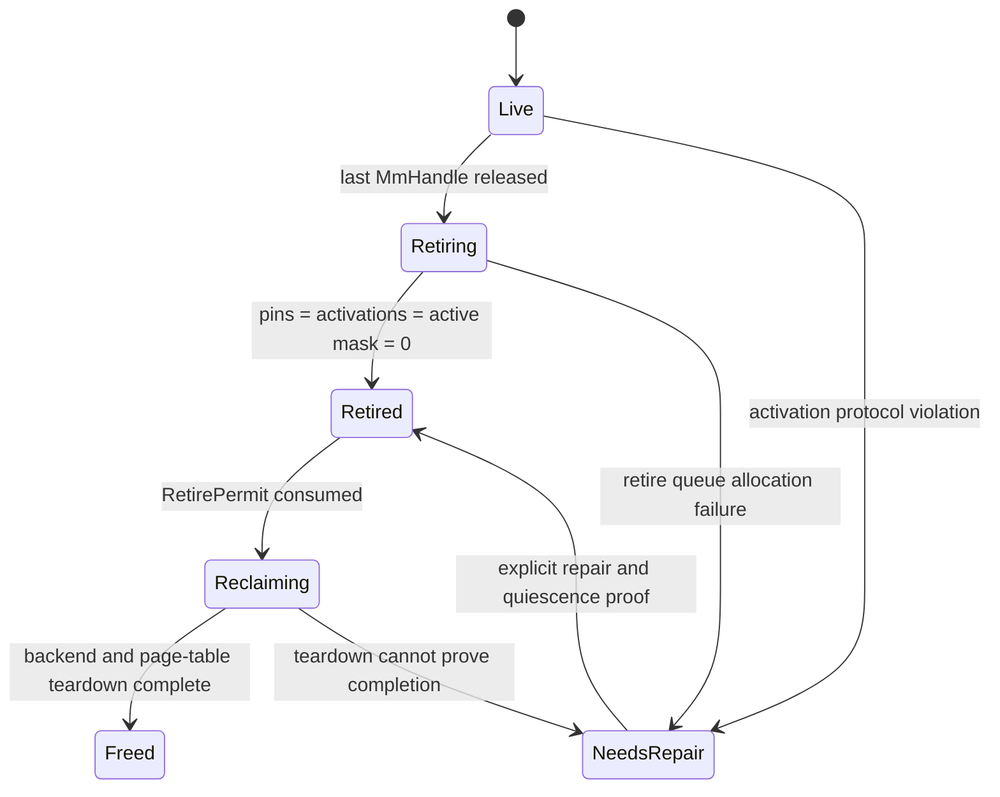
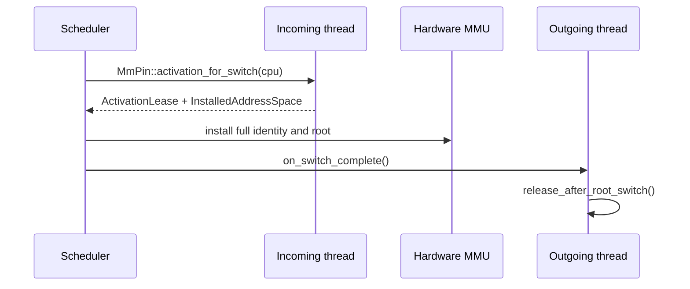
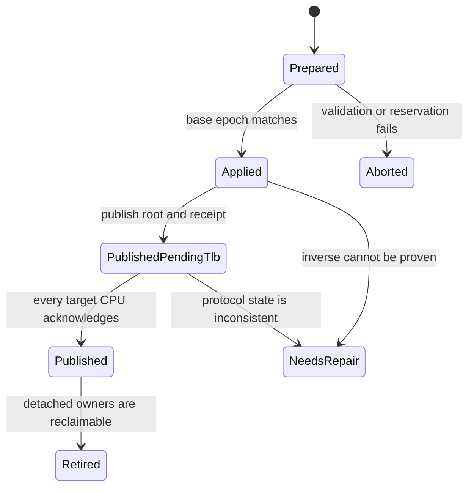
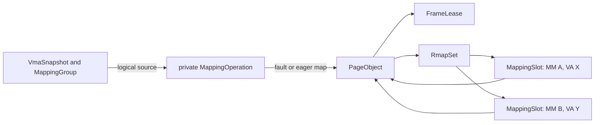
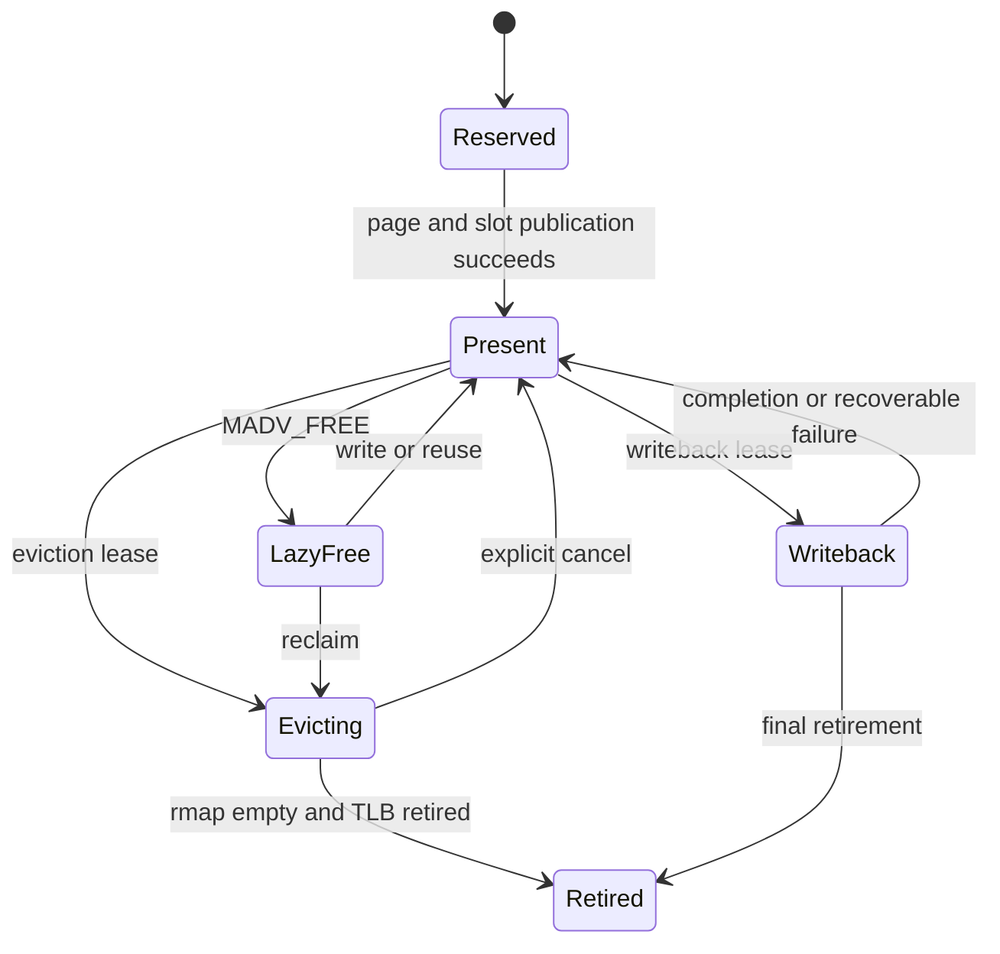

# StarryOS Linux 兼容虚拟内存

StarryOS 在 Starry kernel 内实现 Linux 进程虚拟内存策略，不新增独立的 `starry-mm` crate。通用页表机制位于 `page-table-generic`、`ax-cpu` 和 `ax-mm`，而 VMA、进程地址空间生命周期、页对象、文件映射、Linux ABI 与 procfs 统计位于 `os/StarryOS/kernel/src/mm/`。这一边界让通用 crate 只提供页表与 frame 机制，Starry 负责 Linux 可见语义。

当前设计以四个单一事实源组织状态：`VmaMap` 发布 VMA，`MappingSlot`/`RmapSet` 发布驻留映射，`FrameLease` 持有物理页释放权，`MutationReceipt` 持有已发布修改的 TLB 与延迟回收义务。硬件页表只是这些软件状态的 materialized view，页表 root 不能替代地址空间身份或物理页 ownership。

## 1. 地址空间边界

`AddrSpace` 是一个 MM 的可变实现对象，但进程、内核临时操作和 CPU 激活不再通过同一种 `Arc<Mutex<AddrSpace>>` 引用表达。`os/StarryOS/kernel/src/mm/aspace/mod.rs` 保存 VMA、页表和驻留状态，`lifecycle.rs` 则把外部引用拆成具有不同析构规则的类型。

### 1.1 核心状态

`AddrSpace` 的字段按事实来源而不是 syscall 分类。VMA root、页表、resident graph 与 TLB quarantine 各自维护一种状态，任何公开 syscall 都只能通过 `AddrSpace` 的事务入口组合它们。

| 对象 | 职责 | 不承担的职责 |
| --- | --- | --- |
| `AddressSpaceId` | 与物理 root 无关的单调软件身份 | 不表示 PID、ASID 或 PCID |
| `Arc<VmaMap>` | 唯一 VMA metadata 与 executable-operation publication root | 不拥有已安装 PTE 的 frame |
| `PageTable` | Starry 用户 Stage-1 页表的 owning materialized view | 不作为 VMA、RSS 或地址空间身份 |
| `PageTableDomain` | PTE stripe 与中间页表 structure lock | 不执行文件 I/O 或用户访问 |
| `MutationGate` | epoch、receipt publication 与 repair health | 不在短 commit lock 内修改 PTE 或访问 VFS |
| `mapping_slots` | 当前 MM 已发布 PTE 的 `MappingSlot` 索引 | 不替代 VMA metadata |
| `TlbQuarantine` | 保存远端确认前不可复用的 detached frame | 不持有 VMA 或 page-cache lock |
| `ResidentWatermark` | 从 published slots 派生 RSS 与 VmHWM | 不维护第二份按 VA charge map |

`heap` 也属于 `AddrSpace`，因此 `brk` 的当前值与 heap VMA 在同一 MM 锁和事务边界内更新。进程对象不保存另一份 break 镜像。

### 1.2 与 Linux 的语义关系

Starry 使用 Rust ownership 和显式状态机表达 Linux 已有的 MM 生命周期与锁层次，而不复制 Linux 的结构布局。Linux v7.1 的 `mm_struct.mm_users`、`mm_count`、`mm_mt`、page-table lock、rmap lock 和 `mmu_gather` 分别解决用户引用、lazy TLB、VMA 查找、PTE 并发、反向映射与延迟释放；Starry 将这些责任映射到多个窄类型。

| Linux v7.1 锚点 | Starry 对应语义 | 关键差异 |
| --- | --- | --- |
| `include/linux/mm_types.h` 的 `mm_users`/`mm_count` | `MmHandle`、`MmPin`、`ActivationLease` | Starry 将用户、内核 pin 与 CPU activation 分开计数 |
| `mm_struct.mm_mt` 与 `mm/mmap.c` 的 `find_vma()` | persistent `VmaMap` 与 `VmaSnapshot` | Starry 使用 `Arc` path-copy tree，不移植 Maple Tree/RCU |
| `mm/rmap.c` 的 anon/file rmap | `MappingSlot` 与 `RmapSet` | Starry 以 `(AddressSpaceId, VA)` 显式记录每个 PTE owner |
| `mm/mmu_gather.c` 的 gather/flush/free | `MutationReceipt` 与 `TlbQuarantine` | Starry receipt 携带 epoch 与目标 CPU acknowledgement |
| `kernel/sched/core.c` 的 `switch_mm_irqs_off()` | `InstalledAddressSpace` 与 activation handoff | Starry 采用保守的 incoming-tag invalidation，不复制 Linux per-CPU context cache |

这些对象只要求语义与 Linux 一致，例如“最后一个 CPU 不再使用旧 root 后才能回收”和“VMA 稳定不等于 PTE 稳定”。具体锁、树和引用类型保持 Rust 风格，不能把两边描述成一一同构。

## 2. 类型化生命周期

地址空间的进程 ownership、短期 kernel usage 与硬件激活具有不同释放前置条件。`MmHandle`、`MmPin`、`ActivationLease` 和 `RetirePermit` 让错误的释放顺序不能只靠 `Arc` 引用数偶然避免。

### 2.1 所有权类型

四种 capability 由 `MmInner` 的 `user_refs`、`kernel_pins`、`active_count`、`active_mask` 与 per-CPU activation count 支撑。`active_mask` 只表示某 CPU 可能残留该 MM 的 TLB，不是调度 affinity。

这些引用计数和状态转换由一个很窄的 IRQ-safe `lifecycle_gate` 线性化。gate 只保护 owner、pin、activation、retire/repair permit 的创建与释放；它不覆盖 VMA、PTE、文件 I/O、分配、日志或 backend teardown。`take_retire_permit()` 必须在 gate 内重新验证 `user_refs == 0`、`kernel_pins == 0`、`active_count == 0` 与 `active_mask == 0`，因此不能把一次过期的无引用快照当成回收证明。这对应 Linux 在 `mm_users`/`mm_count`、`active_mm` 与 `mmu_gather` 交界处要求同一同步域内完成“最后引用”和“可释放”判定的原则，但用 Rust guard 和不可伪造 permit 表达。

| 类型 | 创建和持有者 | Drop 或消费语义 |
| --- | --- | --- |
| `MmHandle` | `ProcessData`；`fork`、`CLONE_VM`、`vfork` 显式调用 `clone_user_ref()` | 最后一个 user ref 只进入 `Retiring`，不清页表 |
| `MmPin` | fault、procfs、ptrace、线程运行时等短期内核操作 | 归还 kernel pin；不能在 retiring 后新建，但既有 pin 可授权退出 continuation 完成 |
| `ActivationLease` | scheduler 为当前 CPU 安装用户 root 时取得 | 必须在 root 已切走后调用 `release_after_root_switch()` |
| `RetirePermit` | user、pin、activation 与 active mask 全部清零后产生 | 在可睡眠 reclaimer 中执行 backend/page-table 清理 |

普通 `ActivationLease::drop()` 不假定硬件 root 已经切换。若调用方没有提交 root-switch proof，它把 MM 置为 `NeedsRepair`，并把实际 MM 所有者移入修复队列。只有保留引用计数而没有强引用并不能保持页表存活。`RepairPermit` 被丢弃时也会重新排队，失败状态不会丢失最后一个所有者。

### 2.2 生命周期状态

正常路径只能从 live ownership 进入退休与释放。`NeedsRepair` 是显式异常态，不会被普通 Drop 或超时伪装成成功。

```mermaid
stateDiagram-v2
    [*] --> Live
    Live --> Retiring: last MmHandle released
    Retiring --> Retired: pins = activations = active mask = 0
    Retired --> Reclaiming: RetirePermit consumed
    Reclaiming --> Freed: backend and page-table teardown complete
    Live --> NeedsRepair: activation protocol violation
    Retiring --> NeedsRepair: retire queue allocation failure
    Reclaiming --> NeedsRepair: teardown cannot prove completion
    NeedsRepair --> Retired: explicit repair and quiescence proof
```

`Drop` 不执行可能失败或可能睡眠的 backend 清理。`MmHandle::release_user_ref()`、`MmPin::drop()` 和 activation release 只更新状态并排队；`reap_retired()` 消费 `RetirePermit`，失败时保留 repair candidate。退休与修复队列使用在 `MmInner` 创建时一并准备的 `MmWorkLink`，排队只转移已有 `Arc`，不扩容 `Vec` 或分配节点，类似 Linux `mm_struct::async_put_work`。清理成功后，通过 `Arc::try_unwrap` 取得最后所有者；若生产者仍在执行 token 析构，就把空壳重新排队，避免最终析构落到 IRQ 上下文。

### 2.3 调度与进程操作

`ProcessData` 只保存进程级 `MmHandle`，每个 Starry `Thread` 保存一份运行期 `MmPin`。调度器每 CPU 保存值类型 `SchedulerAddressSpaceActivation`，其中包含完整安装身份和指向既有 `MmInner` 的 `Arc<dyn SchedulerAddressSpaceOwner>`；转换只改变指针元数据，不为每次切换新建 `Box` 或 `Arc` 分配。scheduler context 保存 `InstalledAddressSpace`，其中同时包含 `AddressSpaceId`、root、tag generation 与 `VmEpoch`，不再仅保存裸 `PhysAddr`。

普通 owner activation 只接受 `Live` MM；线程已经持有的 `MmPin` 则可在 `Live` 或 `Retiring` 状态授权调度 activation。后者只允许已经被内核 pin 证明仍存活的退出 continuation 运行到 `Exited`，不能增加 user owner，也不能越过 `Retired`。因此 group-exit 可以先释放最后一个进程 owner，再唤醒被阻塞的 sibling 完成信号退出，而 retire permit 仍被该线程 pin 和 activation 阻止。

```mermaid
sequenceDiagram
    participant S as Scheduler
    participant N as Incoming thread
    participant H as Hardware MMU
    participant O as Outgoing thread
    S->>N: MmPin::activation_for_switch(cpu)
    N-->>S: ActivationLease + InstalledAddressSpace
    S->>H: install full identity and root
    S->>O: on_switch_complete()
    O->>O: release_after_root_switch()
```

该顺序允许 incoming 与 outgoing lease 在切换窗口短暂重叠，但不允许旧 lease 在硬件切 root 前释放。CPU offline 同样先安装 kernel root、完成本地 flush，再用 `CpuOfflineRootSwitchProof` 清除 activation。

内核任务也不能从创建它的 CPU 寄存器中采样当前 user root 作为自己的上下文。scheduler 初始化时发布稳定的 kernel identity：x86 与 RISC-V 的组合 root 指向长期存活的内核页表，AArch64 与 LoongArch 的 split-root identity 则显式使用 root 0，保留独立内核 root。之后每个内核任务只复制这个 identity。该规则对应 Linux kernel thread 对 `active_mm` 的显式借用语义，避免将一次硬件寄存器快照误当成页表生命周期证明。

`fork`、共享 MM 与替换 MM 的具体规则由相同 capability 表达：

| 操作 | MM 行为 |
| --- | --- |
| `fork` | `AddrSpace::try_clone()` 构造新 `AddressSpaceId`、VMA/PTE 与 mapping graph |
| `CLONE_VM` | `clone_aspace_user_ref()` 显式复制 `MmHandle`，不复制 VMA |
| `vfork` | 共享 MM，并由 `vfork_done` 阻塞父线程至 child exec/exit |
| `exec` | 先构造完整新 image/MM，再交换 `MmHandle`、pin 与 activation，最后释放旧 MM |
| `exit` | 完成共享内存清理后释放 owner；真正回收由 retire worker 执行 |

Linux v7.1 中可对照 `kernel/fork.c` 的 `mmget()`/`mmput()`、`dup_mm()`、`mm_release()`，`kernel/exit.c` 的 `exit_mm()`，以及 `kernel/sched/core.c` 的 lazy `active_mm` 交接。Starry 没有照搬 `active_mm` 指针，而用每 CPU activation lease 表达相同的“硬件使用仍存活”前置条件。

## 3. VMA 与发布事务

VMA metadata 使用不可变 root 发布，避免返回跨锁、跨 I/O 存活的 `&MemoryArea`。writer 在旧 root 之外构造完整 successor；reader 取得 `Arc<VmaMap>` 或 `Arc<VmaSnapshot>`，旧快照不会因 split、merge、mprotect 或 unmap 被原地修改。

### 3.1 持久化 VMA

`VmaMap` 是基于 `Arc<VmaNode>` 的 path-copy 有序区间树。插入和删除只复制搜索路径并保持平衡，`without_range()`、`with_permissions()` 与 huge-page advice 更新通过 fragment 生成 successor，而不是完整复制全部 VMA。

| 对象 | 内容 | 设计作用 |
| --- | --- | --- |
| `VmaSnapshot` | range、rights、max rights、group、source offset、THP advice | metadata-only reader 可跨锁持有 |
| `MappingGroup` | `MappingId`、`Arc<MappingSource>`、`PageSizePolicy` | 同一次逻辑 mapping 的 split fragments 共享身份 |
| `MappingSource` | Anonymous、File、External、Linear | 描述数据来源，不拥有 frame |
| private `VmaEntry` | snapshot 加 `MappingOperation` | 仅 MM 内部执行 fault/map/unmap/protect |

相邻 fragment 只有在 mapping identity、权限、page policy、advice 和 source coordinate 连续时才合并。`mremap` 也按 `MappingGroup` 和连续 source offset 验证完整逻辑映射，不能只依赖命中地址的单个 fragment。

私有 `MappingOperation` 是 Rust 的封闭执行分派，作用近似 Linux VMA 的 operation callbacks；它不再是 VMA、frame 或 RSS ownership source。当前 concrete operation 仍负责 materialize PTE，随后同一地址空间事务发布 `MappingSlot`/rmap，这一点是后续继续收紧 PageTable cursor 的实现边界。

### 3.2 Mutation receipt

所有 map、unmap、mprotect、mremap、brk、fault、fork 与 THP split 都围绕同一 epoch protocol 发布。operation-specific 代码先验证输入、预留资源、构造 VMA successor 和 PTE/mapping preimage，再在固定 stripe 内 materialize PTE；`MutationGate` 只负责短时间的 epoch 校验与 receipt publication。

```mermaid
stateDiagram-v2
    [*] --> Prepared
    Prepared --> Applied: base epoch matches
    Prepared --> Aborted: validation or reservation fails
    Applied --> PublishedPendingTlb: publish root and receipt
    PublishedPendingTlb --> Published: every target CPU acknowledges
    Published --> Retired: detached owners are reclaimable
    Applied --> NeedsRepair: inverse cannot be proven
    PublishedPendingTlb --> NeedsRepair: protocol state is inconsistent
```

`MutationReceipt` 记录 `base_epoch/new_epoch`、VMA/PTE/mapping/resident delta、`TlbRequest` 与 `PublishEvent`。`TlbPending` 表示修改已经发布但旧资源仍在 quarantine，不是“操作未发生”的普通失败；调用方不得恢复旧 ABI 结果或复用相关 frame。

软件页表为空不代表旧硬件翻译已经失效。fresh `mmap` 和缺页安装共用 `NoPendingTlbOverlap` 前提：apply 前检查，epoch 发布时再次检查。`MADV_DONTNEED` 等操作留下重叠的 pending request 时，缺页返回 `CancelPendingTlb`；`MmPin` 在锁外撤销候选、完成旧 shootdown，再让后续缺页重新规划。请求使用内联范围存储，不为这条重试路径分配全量快照。

### 3.3 锁与睡眠边界

VMA publication、PTE、page rmap 与 page cache 是不同锁层，符合 Linux “VMA 稳定不等于页表稳定”的原则。当前 Starry 明确下列局部协议，但不声称复制 Linux `mm/rmap.c` 中完整的全局锁序。

| 临界区 | 允许的工作 | 禁止的工作 |
| --- | --- | --- |
| outer `AddrSpace` mutex | 组合 successor、preimage 与 syscall 事务 | 把内部引用返回给跨锁 reader |
| `MutationGate::commit_lock` | 冻结 active CPU、CAS epoch、发布 receipt | PTE walk、文件 I/O、callback |
| `PteStripeCursor` | bounded PTE read/write；多 stripe 升序获取 | `.await`、VFS、用户 copy、未知 callback |
| structure cursor | attach/detach 中间页表节点 | 文件 I/O 与 page-cache lock |
| `PageObject::mapping_graph` | slot、rmap 与 mapping ref 原子更新 | VMA publication 或 TLB IPI |
| page-cache index lock | cache identity/index publication | 地址空间回入与阻塞 writeback |

fault 先读取 immutable VMA entry，再 clone 私有 operation；可能睡眠的文件填页完成后重新取得 PTE domain、核对 preimage 并提交 receipt。eviction 则先把 `PageObject` 标为 `Evicting`，释放 cache index lock，再按 rmap 对每个 MM 发起撤销与 TLB retirement。

## 4. 页对象与反向映射

已安装 PTE 的软件 owner 是 `MappingSlot`，物理 frame 的释放 capability 是 `FrameLease`。共享映射只增加指向同一 `PageObject` 的 slot，不复制裸物理地址所有权。

### 4.1 Ownership graph

`FrameLease` 可以是 owned allocation，也可以是带 retainer 的 borrowed frame；只有它的最终 owner 可以释放物理页。`PageObject` 保存 page state、frame lease、mapping ref、writeback generation 和 `RmapSet`，`MappingSlot` 保存 mapping/MM/VA/page order/resident class。

```mermaid
flowchart LR
    V[VmaSnapshot and MappingGroup] -->|logical source| O[private MappingOperation]
    O -->|fault or eager map| P[PageObject]
    P --> F[FrameLease]
    S1[MappingSlot: MM A, VA X] --> P
    S2[MappingSlot: MM B, VA Y] --> P
    P --> R[RmapSet]
    R --> S1
    R --> S2
```

`MappingSlot::publish()` 以同一个 graph transition 增加 page mapping ref 和 rmap；`detach()` 以相反顺序撤销。rollback 恢复捕获的同一 `Arc<MappingSlot>`，不会用 VA、refcount 和 page id 手工拼出一个近似旧状态。

### 4.2 Page state

页状态把 lazy free、eviction 与 writeback 的失败恢复显式化。进入 `Evicting` 后，lease 的普通 Drop 不会自动恢复为 `Present`；只有显式 cancel 或完成 TLB retirement 后的 resume/retire 可以转换状态。

```mermaid
stateDiagram-v2
    [*] --> Reserved
    Reserved --> Present: page and slot publication succeeds
    Present --> LazyFree: MADV_FREE
    LazyFree --> Present: write or reuse
    Present --> Evicting: eviction lease
    LazyFree --> Evicting: reclaim
    Evicting --> Present: explicit cancel
    Evicting --> Retired: rmap empty and TLB retired
    Present --> Writeback: writeback lease
    Writeback --> Present: completion or recoverable failure
    Writeback --> Retired: final retirement
```

RSS 分类属于 slot，而不是 VMA 或全局 frame table。私有 file page 第一次写时可以只把当前 slot 从 `File` 重分类为 `Anon`，其他 MM 指向同一逻辑来源的 slot 保持各自分类。

### 4.3 COW 与共享页

匿名和 `MAP_PRIVATE` 文件映射使用 COW operation。fork 为 parent/child 安装只读 PTE，并让不同 MM 的 slots 指向同一 `PageObject`；写 fault 只有在 rmap 显示页面并非当前 MM 独占时才分配新匿名 `PageObject`。

`SharedMemoryObject` 为共享匿名与 SysV SHM 提供 typed backing。自行分配的页面使用 owned `FrameLease`；dma-buf、设备或其他外部 backing 使用 borrowed lease 与 `Arc` retainer，最后一个进程 unmap 只删除自己的 slot，不会错误释放 provider-owned frame。

共享匿名对象使用 `SharedPageIndex` 稀疏 radix 索引，逻辑容量与驻留索引分离。空对象不按虚拟跨度分配槽数组；缺页先在 IRQ 锁外通过 `SharedPagePath` 准备节点，再重检并链接。未使用路径和竞争候选均在解锁后释放，查找与发布的成本受地址位宽约束。

### 4.4 文件 fault 与回收

shared file mapping 使用 file page domain 与 page cache identity。fault 在 I/O 前后都核对 file epoch/EOF；超过 EOF 返回 `FaultResult::Sigbus(BusCode::AdrErr)`，对象 I/O 错误返回 `BusCode::ObjErr`，锁或 eviction 竞争返回 `Retry`。

clean file eviction 先取得 `EvictionLease`，再从 `RmapSet` 撤销所有 PTE。未完成的远端 TLB receipt 使页面保持 `Evicting`/quarantined；dirty page 使用 writeback lease 和 generation，失败时数据与 dirty state 仍保留，不能靠 Drop 假装写回成功。

该行为对照 Linux v7.1 `mm/filemap.c` 的 EOF 前后复检与 `VM_FAULT_SIGBUS/RETRY`、`mm/truncate.c` 的两阶段 truncate/invalidate，以及 `mm/rmap.c` 的 folio reverse mapping。Starry 不复用 folio 实现，但保持“truncate race 不安装过期页”和“mapped/dirty/busy page 不能直接释放”的语义。

分配器压力回收在同一 endpoint 排他范围内检查并摘除 clean page，避免竞态失败后重新分配 LRU 节点。它只检查 `Weak` 的强引用数，不升级再丢弃可能成为最后所有者的 endpoint；缓存文件由 registry 读侧保活，回收不会触发缓存文件的最终析构。普通任务上下文的缓存索引仍可管理 LRU 元数据分配，这一限制与 allocator-pressure 路径区分。

`CachedFile::read_at` 只在每块缓存取样时持有布局锁与 `io_lock`，复制到用户缓冲区前全部释放；因此目标是同一文件的未物化私有映射时，COW 缺页可以再次读取缓存。下一块取样前重检 EOF，避免锁外复制期间的 truncate 被忽略。

写回的 mapping-protect 回调在 `io_lock` 外执行；回调窗口允许 truncate 和后续写入提交。`writeback_page_runs` 使用重新取得 `io_lock` 后读取的当前文件长度，避免按旧 EOF 写回而重新扩展已截短文件。

## 5. 页表、TLB 与大页

页表 API 只暴露与 ownership 相符的能力。owning `PageTable` 可在 quiescent teardown 中 detach 或释放页表 frame；`PageTableRef` 是显式 `unsafe` 构造的非 owning view，隐藏 root frame/allocator，也不提供 destroy/deallocate。

### 5.1 PageTableDomain

`PageTableDomain` 使用 64 个固定 PTE stripe。跨范围操作先计算去重的 stripe id 并按升序获取，source/destination 同时参与的 mremap 也遵循同一顺序；中间页表 attach/detach 另用 structure cursor。

`PteStripeCursor` 只证明锁已持有，不返回 `&mut PageTable`。通用页表中的 detached page-table frame token 隐藏物理地址、frame 数量和 allocator，调用方只能在证明 TLB quiescence 后消费 token 执行 `reclaim()`。正常 MM teardown 已由 `RetirePermit` 证明 active CPU 集为空，因此可直接消费 detached token；仍有 TLB obligation 的 mutation 则必须保留在 quarantine。page-table frame 与 data frame 都不会因一个裸地址被提前释放。

### 5.2 Installed identity

`InstalledAddressSpace` 同时携带软件 id、root、hardware tag、tag generation 和 VMA/PTE epoch。scheduler context 比较完整 identity，只有最终架构写 root 的位置才能投影出 `PhysAddr`。

`AddressSpaceTagAllocator` 保留 tag 0 给 `FullFlush`，在 `1..capacity` 分配 tagged identity，并在耗尽时递增 generation 后从 tag 1 重新分配。generation 不能回绕；耗尽时退回 `FullFlush`，不会把旧 generation 伪装成新 identity。scheduler 始终把完整 `InstalledAddressSpace` 交给架构安装入口，不再从 context 中单独写裸 root。

四架构在各自边界探测并安装 tag：x86 仅在 PCID、INVPCID、PGE 与 CR3 前置条件都满足时启用 12-bit PCID；AArch64 EL1 根据 `ID_AA64MMFR0_EL1.ASIDBits` 选择 8/16-bit ASID，EL2 明确退回 full flush；RISC-V 写回读出 `satp.ASID` 宽度，只有 ASID 数量大于可能 CPU 数的两倍时启用；LoongArch 从 CSR.ASID 的实现宽度取得容量。不满足能力条件时统一使用 tag 0 与全量本地失效。

当前 backend 在每次安装 tagged MM 前先失效 incoming tag，再发布对应 root。这样即使数值 tag 在 generation rollover 后被复用，inactive CPU 上的旧 translation 也不会重新变得可达；PTE mutation 的 range shootdown 仍只面向 active CPU，inactive CPU 在下一次安装时完成兜底失效。这个协议比 Linux 的 per-CPU context cache 更保守、切换开销更高，但保持了 Linux ASID/PCID 复用的安全前置条件。后续性能优化只能替换失效策略，不能绕过完整 identity、activation lease 或 quarantine。

### 5.3 THP

THP policy 属于 `MappingGroup`，已安装 leaf 的真实 order 属于 `MappingSlot`。partial munmap、mprotect、discard 或 mremap 通过预留的 `HugeSplitDeposit` 把一个 order-9 leaf 拆成基础页 slots/PTE，frame 数据和 `PageObject` 不因 split 被整块复制。

split 事务保存 huge leaf、deposit、mapping graph 和 RSS preimage；中途失败会恢复原 leaf。当前只支持 order-9 present slot，其他 huge order 或不能完整捕获的边界返回 typed `OperationNotSupported`。Linux v7.1 `mm/memory.c` 的 `__split_huge_pmd()` 可作为语义参照，但 Starry 的 deposited frame token 与 rollback 是自己的 Rust ownership 实现。

## 6. Linux ABI 与用户内存

syscall 层负责 Linux 参数顺序、错误码与 signal 转换，不能直接修改 VMA、PTE、slot 或 RSS。`mmap.rs`、`brk.rs` 和 `mincore.rs` 只调用 `AddrSpace` 的 typed 查询或 mutation API。

### 6.1 映射 syscall

当前实现为主要 mmap family 建立事务边界，并对未实现能力返回明确错误。下表描述的是源码现状，不表示 swap、任意 THP order 或所有 Linux advice 已实现。

| 接口 | 当前语义 |
| --- | --- |
| `mmap`/`munmap` | checked range/alignment；replacement、VMA/PTE/slot/RSS 同一 preimage/receipt |
| `mprotect` | 先验证完整覆盖与 `max_rights`；洞返回 `ENOMEM` 且不修改旧状态 |
| `brk` | heap break 与 VMA 同属 MM；Linux 式失败返回旧 break |
| `mremap` | 先校验 flags、重叠、MappingGroup 与 source continuity，再 split/move；支持受限 `DONTUNMAP` |
| `msync` | `MS_SYNC` 等待 shared-file writeback；`MS_ASYNC` 按 Linux v7.1 为兼容性 no-op；`MS_INVALIDATE` 遇到 locked VMA 返回 `EBUSY`；非法组合与洞明确报错 |
| `madvise` | `DONTNEED/FREE/REMOVE/HUGEPAGE/NOHUGEPAGE/PAGEOUT` 有 typed 路径；未实现 advice 返回 unsupported |
| `mincore` | PTE residency 与 file-cache probe 合并，先完成 Linux 顺序的范围和输出指针校验 |

Linux v7.1 的 `mm/msync.c` 不让 `MS_ASYNC` 主动启动 I/O，也不直接为 `MS_INVALIDATE` 清 page cache；后者要求 locked VMA 返回 `EBUSY`。Starry 将 `VM_LOCKED`/`VM_LOCKONFAULT` 表达为 immutable VMA root 中的 `VmaLockMode`：`mlock`、`mlock2`、`munlock` 与 `MAP_LOCKED` 通过 metadata receipt 发布，partial range 会 split VMA，`mremap` 保留 lock mode，而 `fork` 像 Linux `vm_area_dup()` 一样清除 child 的 lock bits。普通 `mlock` 在发布后 eager populate；`MLOCK_ONFAULT` 只发布 on-fault policy。被动 file-page reclaim 对 locked mapping 的排除仍列在回收限制中，不能仅凭 VMA flag 声称所有 page pin 语义已经完成。

`MADV_PAGEOUT` 目前只进入已有 file reclaim engine；无 swap 的 anonymous/private/tmpfs 路径返回 `OperationNotSupported`。`PROT_GROWSUP`/`PROT_GROWSDOWN` 也尚未实现，不会识别后静默成功。

### 6.2 Fault signal

fault dispatcher 区分 VMA 缺失、权限失败、文件 EOF 与对象 I/O 错误。普通缺失映射产生 `SIGSEGV/SEGV_MAPERR`，权限失败产生 `SIGSEGV/SEGV_ACCERR`，EOF/truncate 失效产生 `SIGBUS/BUS_ADRERR`，文件对象错误产生 `SIGBUS/BUS_OBJERR`。

这与 Linux v7.1 `mm/filemap.c` 的 EOF 双重复检、`mm/memory.c` 的 file PMD EOF 约束以及各架构 fault dispatcher 对 `VM_FAULT_SIGBUS` 的转换相符。Starry 不把这些结果泛化成同一个 `BadAddress`，否则用户程序无法区分无效 VMA 与有效 file mapping 的对象错误。

### 6.3 默认 user-access capability

`user-access-fastpath` Cargo feature 已删除；user-copy 能力现在默认存在于统一接口中，不再产生“打开 feature 才正确”的 ABI 分支。`UserAccess<Faultable>`、`UserAccess<NoFault>`、`UserAccessIntent` 与 checked `UserAccessRange` 共同表达能否睡眠、访问方向和范围。

faultable copy 先尝试最多 16 页的 `user_range_probe_ready()`。AArch64 EL1 用 `AT`/`PAR_EL1` 实现页级 present/permission probe；x86_64、RISC-V、LoongArch 和 AArch64 EL2 当前返回 probe miss，自动走相同的 locked fault-in slow path。probe 只是优化判断，不 pin VMA，最终 copy 仍由 architecture exception table 处理并发 unmap。

写 probe 要求页已经 EL0-writable，因此只读 COW PTE 必然 miss 并进入 `populate_area()` 完成 COW。这个接口把 fast path 设计为可选 architecture capability，而不是条件编译掉 correctness slow path。

套接字等 user-copy 调用方把输入描述符保留在内核栈中，但结果仅回填 ABI 规定的字段。批量接口将每一项的输入导入、执行与结果回填写入同一错误边界，后续项失败时保留已完成数量。描述符传递和成对创建复用 `PreparedFileDescriptor`，先预留编号、完成结果复制，再发布对应 fd；不通过长寿命用户引用完成这些操作。

文件写入先检查地址几何与文件语义，再准备输入页并以可失败预留创建副本。`IoVectorBuf` 只导入一次描述符，长度验证、输入准备和复制都使用这一份快照；`F_SEAL_WRITE` 的检查早于实际 payload fault，与 Linux 7.1 的 `shmem_write_begin()` 一致。RISC-V `hwprobe` 逐项读取 key 并回填结果，不按 pair count 分配数组；后续项失败保留已完成前缀。

### 6.4 RSS 与 procfs

RSS 从 published `MappingSlot` 的 `resident_kind` 派生，VmHWM 由 `ResidentWatermark` 单调维护。VSS、VmPeak 与 heap/VMA 分类继续由 `ProcessVmStat` 和 `ProcessMemStats` 汇总；procfs reader 取得 owned inspection records，不借用 VMA 内部 operation。

memfd 的共享与私有映射从 inode 持有的元数据取得展示名称，fd 关闭后仍显示 `/memfd:name (deleted)`。查询不要求匿名文件具有目录父节点；VMA 检查失败则沿类型化错误返回，不将整个地址空间的统计替换为空集合。

`mincore` 使用 32 项有界批次，缓存查询与用户结果复制在 MM 锁外完成。驻留状态来自 `MappingSlot` 与共享对象，不由当前访问权限决定；批次在后续区间失败前保留已完成结果，文件查询遵守当前凭据的普通访问规则。

`VmRSS` 是 Anon、File 与 Shmem slot 之和，shared 展示由 File/Shmem 组成。`Committed_AS`、完整 overcommit ledger、swap totals 与 OOM victim accounting 尚未实现，procfs 占位值不能被描述成完整 Linux memory commitment 策略。

## 7. Reclaim 与显式限制

已实现的回收集中在 clean file page、dirty writeback lease、anonymous `MADV_DONTNEED/FREE` 和批量 TLB retirement。每条路径都保留 page/rmap/frame owner，直到 PTE 撤销与必要的 TLB acknowledgement 完成。

### 7.1 已实现边界

file cache 通过单一 typed mapping endpoint 发布 eviction/writeback 事件，不扫描所有 VMA，也不把 `Weak<AddrSpace>` callback 转成裸指针。地址空间按 rmap 启动事务，`Busy` 或 `Quarantined` 会保留页面和 cache pin 供后续重试。

allocator 的 page reclaim callback 在 allocator 锁外执行，并保持有界重试。`GlobalAlloc` 接口在失败时返回空指针，使 `try_reserve` 与 `Box::try_new` 可以返回错误；失败请求不写入 tracking 记录。标准库的非 fallible 容器入口仍保留其分配失败处理语义。MM 层不会在 VMA publication lock、PTE stripe、rmap lock 或 page-cache index lock 内执行文件 I/O。

### 7.2 尚未实现

以下能力以 typed unsupported 或显式 fallback 暴露，不能通过 timeout、no-op 或假成功掩盖：

- swap device、swap cache、swap-in/out 与 anonymous `MADV_PAGEOUT`；
- OOM victim selection、KSM、NUMA migration、userfaultfd、DAX 与完整 hugetlbfs；
- order-9 以外的 transactional huge split；
- locked file-page reclaim 排除与 `RLIMIT_MEMLOCK`/`MCL_CURRENT`/`MCL_FUTURE` accounting；
- 完整 committed-memory/overcommit ledger。

`reclaim.rs` 的 `UnsupportedSwap` 保留接口形状，但 swap-in/out 始终返回 unsupported。新增真实 swap owner 前，不应先建立第二套 page state 或 frame registry。

## 8. 审计与验证

MM 改动通常跨越 VMA、页表、page cache、scheduler 与 syscall。审计应从 owner 与状态转换出发，再检查 Linux 用户可见结果，不能只验证某个 syscall 返回值。

### 8.1 源码检查点

下列入口覆盖当前主要事实源。私有 backend 文件只执行 mapping operation，不应重新引入第二份 VMA、RSS 或 frame ownership。

| 源码 | 审计重点 |
| --- | --- |
| `mm/aspace/lifecycle.rs` | `MmHandle`、pin、activation、retire/repair 状态 |
| `mm/aspace/vma.rs` | persistent `VmaMap`、MappingGroup、source coordinate |
| `mm/aspace/mutation.rs` | epoch、receipt、TLB obligation 与 quarantine |
| `mm/aspace/objects.rs` | `FrameLease`、PageObject、MappingSlot、rmap、page state |
| `mm/aspace/domain.rs` | PTE stripe 与 structure capability |
| `mm/aspace/mod.rs` | syscall/fault/fork/THP 的组合事务与 preimage |
| `mm/aspace/backend/` | concrete mapping operation、COW、shared/file I/O |
| `mm/access.rs` | typed faultable/nofault user-copy 与默认 probe capability |
| `mm/stats.rs`、`mm/vm_stat.rs` | RSS/VmHWM/VSS/proc 聚合 |
| `syscall/mm/`、`task/user.rs` | Linux 参数、errno、SIGSEGV/SIGBUS 转换 |
| `components/axcpu`、`axtask` | InstalledAddressSpace 与 root-switch proof |

Linux 差分审查至少核对本地 v7.1 的 `include/linux/mm_types.h`、`include/linux/mmap_lock.h`、`kernel/fork.c`、`kernel/exit.c`、`kernel/sched/core.c`、`mm/mmap.c`、`mm/memory.c`、`mm/filemap.c`、`mm/truncate.c`、`mm/rmap.c` 与 `mm/mmu_gather.c`。这些路径是语义依据，不要求 Starry 复制 Linux 内部 API。

### 8.2 测试证据

host tests 应确定性覆盖 prepare 分配失败、PTE apply 中途失败、epoch conflict、TLB pending/quarantine、retire repair、rmap/COW、EOF SIGBUS 与 THP rollback。系统测试还要通过用户 ABI 观察 fork/exec/exit、shared partial unmap、mmap family、brk、mremap、madvise、msync、truncate 与 user-copy。

最终系统证据使用四架构 grouped runner，并以 `STARRY_GROUPED_TESTS_PASSED` 为完成标记；只构建成功、`/health` 成功、任务取消或单 crate 测试都不等价于系统语义通过。具体命令和用例组织见[内存管理测试](./testing.md)。
