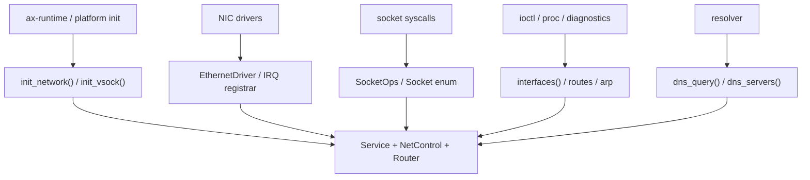

# 对外接口

`ax-net` 的 public API 面向三类调用方：启动阶段的 runtime、系统 ABI/socket 层，以及设备驱动适配层。API 设计保持一个原则：外部通过稳定的接口 ID、快照和 trait object 访问网络栈，不直接接触 `Service`、`Router`、smoltcp `SocketSet` 等内部对象。

核心 re-export 定义在 [lib.rs](net/ax-net/src/lib.rs)：

```rust
pub use self::{
    config::{
        DeviceBinding, InterfaceConfig, InterfaceFlags, InterfaceId, InterfaceInfo,
        InterfaceKind, InterfaceMatcher, Ipv4InterfaceConfig, NetworkConfig,
        RouteInfo, StaticIpConfig,
    },
    device::{
        ArpEntry, EthernetDeviceList, EthernetDriver, EthernetIrqAction,
        EthernetIrqOutcome, EthernetIrqRegistrar, EthernetIrqRegistration,
        EthernetIrqRegistrationError, NetDeviceError, NetDeviceResult,
        NetIrqEvents, NetRxBuffer, NetTxBuffer, RdNetDriver,
        set_ethernet_irq_registrar,
    },
    socket::{
        CMsgData, RecvFlags, RecvOptions, SendFlags, SendOptions,
        Shutdown, Socket, SocketAddrEx, SocketOps,
    },
};
```

## API 分层

public API 按生命周期和调用方分为：

- 初始化与配置 API：由 `ax-runtime` 或平台初始化代码调用。
- 运行时查询 API：由系统 ABI、诊断接口、`/proc`、ioctl 等读取网络状态。
- Socket facade API：由 syscall/socket 层创建并操作具体 socket。
- Socket option API：由 getsockopt/setsockopt 层转发。
- 设备驱动 API：由 NIC driver、IRQ registrar、运行期设备注册路径使用。
- DNS/ARP 辅助 API：由 resolver 和 Linux 兼容层使用。

API 边界如下：



## 初始化与配置

初始化 API 构造全局网络栈。它们是全局单例初始化入口，不返回 `Service` 或 `Router` 的可变引用。

### NetworkConfig

`NetworkConfig` 描述启动时的接口配置：

```rust
pub struct NetworkConfig {
    pub interfaces: Vec<InterfaceConfig>,
    pub default_dns_servers: Vec<Ipv4Addr>,
}

pub struct InterfaceConfig {
    pub name: String,
    pub match_by: InterfaceMatcher,
    pub static_ip: Option<StaticIpConfig>,
    pub dhcp: bool,
    pub metric: u32,
    pub dns_servers: Vec<Ipv4Addr>,
}
```

`InterfaceMatcher` 支持按探测顺序、MAC 或 driver name 匹配设备：

```rust
pub enum InterfaceMatcher {
    ByOrder(usize),
    ByMac(EthernetAddress),
    ByDriverName(String),
}
```

静态 IPv4 配置使用：

```rust
pub struct StaticIpConfig {
    pub ip: Ipv4Addr,
    pub prefix_len: u8,
    pub gateway: Ipv4Addr,
}
```

配置语义：

- `lo` 由 `ax-net` 固定创建，不通过 `NetworkConfig` 覆盖。
- 未显式匹配的 Ethernet 设备按默认策略加入接口 registry。
- `static_ip` 和 `dhcp` 表达互斥配置。
- `metric` 同时影响路由选择和 DNS server 排序。
- `default_dns_servers` 是接口级 DNS 不可用时的 fallback 来源。

### init_network

```rust
pub fn init_network(net_devs: EthernetDeviceList, config: NetworkConfig);
```

调用方传入已发现的 Ethernet driver 列表和结构化配置。初始化会完成：

- 创建 loopback。
- 为每个 Ethernet 设备分配 `InterfaceId` 和接口名。
- 创建 `Router`、`NetControl`、smoltcp `Interface` 和全局 `SocketSet`。
- 安装静态地址、DHCP client 状态、DNS entries 和 route rules。
- 启动非 loopback 设备的 RX/TX worker。
- 启动专用 net-poll worker。

`init_network()` 是一次性初始化入口，重复初始化会触发全局单例保护。

### Poll Trigger

```rust
pub fn request_poll();
```

`request_poll()` 是 socket、设备和控制路径使用的轻量进度请求入口：

```rust
pub fn request_poll() {
    NET_POLL_REQUESTED.store(true, Ordering::Release);
    NET_POLL_WAKE.notify_one(true);
}
```

### Vsock 初始化

```rust
#[cfg(feature = "vsock")]
pub fn init_vsock(vsock_devs: VsockDeviceList);

#[cfg(feature = "vsock")]
pub type VsockDevice = Box<dyn rdif_vsock::Interface>;
#[cfg(feature = "vsock")]
pub type VsockDeviceList = Vec<VsockDevice>;
```

vsock 不进入 smoltcp `SocketSet`，也不实现 `ax-net` 内部 IP `Device` trait。它通过 `rdif_vsock::Interface` 和 vsock connection manager 进入 AF_VSOCK socket backend。

## 运行时查询

查询 API 返回只读快照。调用方不应持有快照并假设其永久有效；DHCP、运行期设备注册或后续 link state 更新都可能改变接口、路由和 DNS 状态。

### 接口快照

```rust
pub fn interfaces() -> Vec<InterfaceInfo>;
pub fn interface_by_name(name: &str) -> Option<InterfaceInfo>;
pub fn interface_by_id(id: InterfaceId) -> Option<InterfaceInfo>;
pub fn ipv4_config(name: &str) -> Option<Ipv4InterfaceConfig>;
```

`InterfaceId` 是稳定接口 ID，同时作为 StarryOS/Linux ifindex 来源：

```rust
pub struct InterfaceId(u32);

impl InterfaceId {
    pub const LOOPBACK: Self = Self(1);
    pub const fn new(raw: u32) -> Self;
    pub const fn get(self) -> u32;
    pub const fn to_linux_ifindex(self) -> i32;
    pub const fn from_linux_ifindex(ifindex: i32) -> Option<Self>;
}
```

`InterfaceInfo` 是 public snapshot：

```rust
pub struct InterfaceInfo {
    pub id: InterfaceId,
    pub name: String,
    pub kind: InterfaceKind,
    pub mac: Option<EthernetAddress>,
    pub ipv4: Option<Ipv4InterfaceConfig>,
    pub mtu: usize,
    pub flags: InterfaceFlags,
    pub metric: u32,
}
```

系统 ABI 映射应使用 `InterfaceId`，而不是假设 `eth0`：

```rust
let info = ax_net::interface_by_name("eth1").ok_or(AxError::NoSuchDevice)?;
let linux_ifindex = info.id.to_linux_ifindex();
let id = InterfaceId::from_linux_ifindex(linux_ifindex).unwrap();
```

### 路由快照

```rust
pub fn default_routes() -> Vec<RouteInfo>;
```

`RouteInfo` 是对外 route snapshot，不暴露 Router 内部 device index：

```rust
pub struct RouteInfo {
    pub filter: IpCidr,
    pub via: Option<IpAddress>,
    pub interface_id: InterfaceId,
    pub source: IpAddress,
    pub metric: u32,
}
```

调用方可用它实现 route 诊断、默认网关展示或 Linux 兼容查询；socket 发送路径不应自行遍历 `RouteInfo`，而应通过 socket backend 调用控制面的 route decision。

### ARP 快照

```rust
pub fn arp_entries() -> Vec<ArpEntry>;
```

`ArpEntry` 用于 `/proc/net/arp` 等兼容层：

```rust
pub struct ArpEntry {
    pub ip_addr: [u8; 4],
    pub hw_type: u16,
    pub flags: u16,
    pub hw_addr: [u8; 6],
    pub device: String,
}
```

`device` 字段是真实接口名。loopback 不产生 ARP entry。

## Socket Facade

socket API 统一 AF_INET、AF_UNIX 和 AF_VSOCK 的公共操作形状。协议细节由具体 backend 负责。

### SocketAddrEx

```rust
pub enum SocketAddrEx {
    Ip(SocketAddr),
    Unix(UnixSocketAddr),
    #[cfg(feature = "vsock")]
    Vsock(VsockAddr),
}
```

地址族不匹配时，`into_ip()`、`into_unix()`、`into_vsock()` 返回对应错误，调用方不需要手工 match 所有 backend。

### Send/Recv Options

```rust
pub type CMsgData = Box<dyn Any + Send + Sync>;

pub struct SendOptions {
    pub to: Option<SocketAddrEx>,
    pub flags: SendFlags,
    pub cmsg: Vec<CMsgData>,
}

pub struct RecvOptions<'a> {
    pub from: Option<&'a mut SocketAddrEx>,
    pub flags: RecvFlags,
    pub cmsg: Option<&'a mut Vec<CMsgData>>,
    pub truncated: Option<&'a mut bool>,
}
```

`SendFlags` 和 `RecvFlags` 使用 Linux `MSG_*` 数值，便于 syscall 层直接转换：

```rust
bitflags! {
    pub struct SendFlags: u32 {
        const OOB = 0x01;
        const DONTROUTE = 0x04;
        const DONTWAIT = 0x40;
        const EOR = 0x80;
        const CONFIRM = 0x800;
        const NOSIGNAL = 0x4000;
        const MORE = 0x8000;
    }

    pub struct RecvFlags: u32 {
        const PEEK = 0x01;
        const TRUNCATE = 0x02;
        const DONTWAIT = 0x40;
    }
}
```

`Shutdown::{Read, Write, Both}` 表达 `shutdown(2)` 的半关闭方向。

### SocketOps

```rust
pub trait SocketOps: Configurable {
    fn bind(&self, local_addr: SocketAddrEx) -> AxResult;
    fn connect(&self, remote_addr: SocketAddrEx) -> AxResult;
    fn listen(&self, _backlog: usize) -> AxResult;
    fn accept(&self) -> AxResult<Socket>;
    fn send(&self, src: impl Read + IoBuf, options: SendOptions) -> AxResult<usize>;
    fn recv(&self, dst: impl Write + IoBufMut, options: RecvOptions<'_>) -> AxResult<usize>;
    fn recv_available(&self) -> AxResult<usize>;
    fn local_addr(&self) -> AxResult<SocketAddrEx>;
    fn peer_addr(&self) -> AxResult<SocketAddrEx>;
    fn shutdown(&self, how: Shutdown) -> AxResult;
}
```

`Socket` 枚举把统一 API 分发给各 backend：

```rust
pub enum Socket {
    Udp(Box<UdpSocket>),
    Tcp(Box<TcpSocket>),
    Raw(Box<RawSocket>),
    Unix(Box<UnixSocket>),
    #[cfg(feature = "vsock")]
    Vsock(Box<VsockSocket>),
}
```

支持的 backend：

| Backend | 构造入口 | 地址族/类型 |
| --- | --- | --- |
| `tcp::TcpSocket` | `TcpSocket::new()` | AF_INET / SOCK_STREAM |
| `udp::UdpSocket` | `UdpSocket::new()` | AF_INET / SOCK_DGRAM |
| `raw::RawSocket` | `RawSocket::new(ip_version, ip_protocol)` | AF_INET / SOCK_RAW |
| `unix::UnixSocket` | `UnixSocket::new(Transport)` | AF_UNIX / stream,dgram |
| `vsock::VsockSocket` | `VsockSocket::new()` | AF_VSOCK / stream |

### 设备绑定

TCP、UDP 和 raw socket 提供直接绑定接口：

```rust
impl TcpSocket {
    pub fn bind_device(&self, interface_id: InterfaceId) -> AxResult;
}
impl UdpSocket {
    pub fn bind_device(&self, interface_id: InterfaceId) -> AxResult;
}
impl RawSocket {
    pub fn bind_device(&self, interface_id: InterfaceId) -> AxResult;
}
```

不存在的接口返回 `AxError::NoSuchDevice`。成功后内部设置：

```rust
pub struct DeviceBinding {
    pub bound_if: Option<InterfaceId>,
}
```

绑定具体本地地址时，TCP/UDP/raw backend 也会通过控制面反查该地址所属接口，并把 route/waker 选择限制到对应接口。未绑定接口的 connect/sendto 由 route decision 自动选择源地址和出接口。

## Socket Options

socket option API 使用一个 get enum 和一个 set enum 表达 SO_*、TCP_* 和 IP_*。

### Configurable

```rust
#[enum_dispatch]
pub trait Configurable {
    fn get_option_inner(&self, opt: &mut GetSocketOption) -> AxResult<bool>;
    fn set_option_inner(&self, opt: SetSocketOption) -> AxResult<bool>;

    fn get_option(&self, mut opt: GetSocketOption) -> AxResult { /* dispatch */ }
    fn set_option(&self, opt: SetSocketOption) -> AxResult { /* dispatch */ }
}
```

`get_option()` / `set_option()` 在 backend 返回 `supported = false` 时映射为 `ENOPROTOOPT`，调用方不需要自己区分“协议不支持”和“选项值非法”。

### Option 集合

```rust
define_options! {
    ReuseAddress(bool),
    Error(i32),
    DontRoute(bool),
    SendBuffer(usize),
    ReceiveBuffer(usize),
    KeepAlive(bool),
    SendTimeout(Duration),
    ReceiveTimeout(Duration),
    SendBufferForce(usize),
    PassCredentials(bool),
    PeerCredentials(UnixCredentials),
    SocketType(i32),
    SocketProtocol(i32),
    SocketDomain(i32),
    BindToDevice(Option<InterfaceId>),

    NoDelay(bool),
    MaxSegment(usize),
    TcpKeepIdle(u32),
    TcpKeepInterval(u32),
    TcpKeepCount(u32),
    TcpUserTimeout(u32),
    TcpInfo(TcpInfo),

    Ttl(u8),
    RecvErr(bool),

    NonBlocking(bool),
}
```

通用选项由 `GeneralOptions` 实现，协议特有选项由具体 socket backend 继续处理。`TcpInfo` 是 transport-independent TCP_INFO snapshot：

```rust
pub struct TcpInfo {
    pub state: TcpState,
    pub options: TcpInfoOptions,
    pub rto_micros: u32,
    pub snd_mss: u32,
    pub rcv_mss: u32,
    pub notsent_bytes: u32,
    pub pmtu: u32,
    pub snd_cwnd: u32,
    pub rcv_space: u32,
    pub snd_wnd: u32,
    pub rcv_wnd: u32,
    // 省略其他 Linux TCP_INFO 兼容字段
}
```

### Option 支持矩阵

`GetSocketOption` / `SetSocketOption` 是跨协议的分发格式，并不表示每个 backend 都支持所有 option。backend 返回 `supported = false` 时，统一映射为 `ENOPROTOOPT`；option 值非法时返回具体参数错误。

| Option | 主要实现者 | 语义 |
| --- | --- | --- |
| `ReuseAddress` | `GeneralOptions`，UDP/TCP bind 路径读取 | UDP 设置后跳过 wrapper UDP bind side table；TCP 仍受 `TCP_BOUND_PORTS` 和 `ListenTable` 的 wildcard/specific 冲突规则约束 |
| `Error` | `GeneralOptions` | 返回并清理 socket error 状态；当前主要作为 Linux ABI 兼容字段 |
| `DontRoute` | `GeneralOptions` | 保存标志位；普通发送路径仍由控制面 route decision 决定接口 |
| `SendBuffer` / `ReceiveBuffer` | `GeneralOptions`、Unix stream/datagram、vsock | 对 IP socket 主要返回配置值或默认预算；Unix/vsock 按各自 ring/queue 容量返回 |
| `SendBufferForce` | `GeneralOptions` | 兼容 `SO_SNDBUFFORCE` 风格入口，语义上等价设置发送缓冲区预算 |
| `KeepAlive` | `GeneralOptions` + TCP | 通用标志由 `GeneralOptions` 保存；TCP backend 同步到 smoltcp keep-alive 配置 |
| `SendTimeout` / `ReceiveTimeout` | `GeneralOptions` | 被 `send_poller*` / `recv_poller*` 使用，决定阻塞等待超时 |
| `PassCredentials` | Unix stream/datagram | 保存或接受 Linux `SO_PASSCRED` 语义；credentials 由 Unix transport 生成 |
| `PeerCredentials` | Unix stream/datagram | 返回 `UnixCredentials { pid, uid, gid }`，uid/gid 当前使用内核默认值 |
| `SocketType` / `SocketProtocol` / `SocketDomain` | `GeneralOptions` | 由 socket 创建时写入，用于 `getsockopt()` 返回 Linux ABI 可见值 |
| `BindToDevice` | `GeneralOptions` | 保存 `DeviceBinding`，影响 route lookup 和设备 waker 注册 |
| `NoDelay` | TCP | 映射 TCP_NODELAY 行为 |
| `MaxSegment` | TCP | 返回或设置 TCP MSS 相关兼容值，受 smoltcp 能力限制 |
| `TcpKeepIdle` / `TcpKeepInterval` / `TcpKeepCount` | TCP | 校验 Linux 兼容范围后同步到 TCP keepalive 配置 |
| `TcpUserTimeout` | TCP | 保存 Linux `TCP_USER_TIMEOUT` 兼容值 |
| `TcpInfo` | TCP | 从 smoltcp socket 状态和本地默认值合成 `TCP_INFO` snapshot |
| `Ttl` | raw / IP socket backend | raw socket 使用该值控制发送 TTL |
| `RecvErr` | `GeneralOptions` | 保存 IP_RECVERR 兼容标志；当前不提供完整 Linux error queue |
| `NonBlocking` | `GeneralOptions` | 与 `MSG_DONTWAIT` 不同，修改 socket 自身阻塞属性 |

### TCP_INFO

`TcpInfo` 的字段来源分三类：

- 直接来自 smoltcp：连接状态、收发队列长度、窗口估计等。
- 来自 `tcp.rs` 默认值：MSS、PMTU、初始 RTO、reordering 等 Linux 兼容默认字段。
- 合成或保守值：smoltcp 未暴露的拥塞控制细节、ECN/SACK/window scale 等字段以保守方式填充。

因此 `TCP_INFO` 适合用于 Linux 兼容探测和调试，不应被上层当作完整 Linux TCP 栈的拥塞控制 ABI。

## DNS 与名称解析

DNS API 位于 [lib.rs](net/ax-net/src/lib.rs)，使用控制面的 DNS registry 和 route decision。

```rust
pub fn dns_servers() -> Vec<Ipv4Address>;
pub fn dns_query(name: &str) -> AxResult<Vec<IpAddr>>;
pub fn dns_query_timeout(name: &str, timeout: Duration) -> AxResult<Vec<IpAddr>>;
```

语义：

- `dns_servers()` 返回按 `(metric, interface_id, server_ip)` 排序并去重的 IPv4 DNS server。
- DNS server 来源包括 DHCP、接口静态配置和 global fallback。
- `dns_query()` 使用默认 5 秒超时。
- `dns_query_timeout()` 会跳过不可路由的 DNS server。
- 查询期间临时创建 smoltcp DNS socket，结束后由 guard 从 `SOCKET_SET` 移除。

## 设备驱动 API

设备驱动 API 是 low-level NIC 和 `ax-net` 之间的能力边界。驱动提供 buffer 和 IRQ 语义，协议栈不依赖具体 DMA ring 或虚拟队列实现。

### EthernetDriver

```rust
pub type EthernetDeviceList = Vec<Box<dyn EthernetDriver>>;

pub trait EthernetDriver: Send + Sync {
    fn device_name(&self) -> &str;
    fn irq_num(&self) -> Option<usize>;
    fn enable_irq(&mut self);
    fn disable_irq(&mut self);
    fn mac_address(&self) -> [u8; 6];
    fn alloc_tx_buffer(&mut self, size: usize) -> NetDeviceResult<Box<dyn NetTxBuffer>>;
    fn recycle_tx_buffers(&mut self) -> NetDeviceResult;
    fn transmit(&mut self, tx_buf: &mut dyn NetTxBuffer) -> NetDeviceResult;
    fn receive(&mut self) -> NetDeviceResult<Box<dyn NetRxBuffer>>;
    fn recycle_rx_buffer(&mut self, rx_buf: &mut dyn NetRxBuffer) -> NetDeviceResult;
    fn handle_irq(&mut self) -> NetIrqEvents;
}
```

RX/TX buffer trait：

```rust
pub trait NetRxBuffer: Send {
    fn packet(&self) -> &[u8];
    fn packet_len(&self) -> usize {
        self.packet().len()
    }
}

pub trait NetTxBuffer: Send {
    fn packet(&self) -> &[u8];
    fn packet_mut(&mut self) -> &mut [u8];
    fn packet_len(&self) -> usize;
}
```

`RdNetDriver` 是基于 `rd-net` 的标准适配实现。

### Driver Buffer 与错误语义

`EthernetDriver` 把底层 NIC 的 DMA ring、virtqueue 或 `rd-net` queue 抽象为一次一个 packet 的 buffer ownership：

```text
RX:
  driver.receive() -> Box<dyn NetRxBuffer>
  EthernetDevice reads packet()
  driver.recycle_rx_buffer(rx_buf)

TX:
  driver.alloc_tx_buffer(frame_len)
  EthernetDevice fills packet_mut()
  driver.transmit(tx_buf)
  driver.recycle_tx_buffers()
```

错误类型保持小集合，便于 Router 和设备 worker 做统一策略：

| 错误 | 语义 |
| --- | --- |
| `Again` | 暂无 RX packet、TX 暂不可用或需要稍后重试 |
| `BadState` | 设备未处于可收发状态 |
| `InvalidParam` | packet size 或参数非法 |
| `Io` | 底层设备或传输错误 |
| `NoMemory` | 驱动无法分配 buffer |
| `Unsupported` | 设备不支持该操作 |

`NetIrqEvents` 是 IRQ summary bitmask。`RX_READY`、`RX_ERROR`、`TX_DONE` 会唤醒相关 worker；`SPURIOUS` 表示没有需要网络栈处理的事件。

### RdNetDriver 适配

`RdNetDriver` 持有 `rd_net::TxQueue`、`rd_net::RxQueue` 和少量 `pending_rx` 预取缓存。它的设计边界是：

- RX 预取目标为 `RX_PREFETCH_TARGET = 1`，只减少一次收包路径上的驱动交互，不形成额外无界缓存。
- TX 分配会把 frame 长度提升到 Ethernet 最小帧长 `ETH_ZLEN = 60`。
- `rd_net::NetError::Retry` 映射为 `NetDeviceError::Again`，`NoMemory` / `NotSupported` 保留对应语义，link down 或其它底层错误映射为 `Io`。
- `ax-net` 上层不依赖 `rd-net` 类型；其它 NIC driver 只要实现 `EthernetDriver` 即可接入。

### IRQ 注册

```rust
pub fn set_ethernet_irq_registrar(registrar: &'static dyn EthernetIrqRegistrar);

pub trait EthernetIrqRegistrar: Send + Sync {
    fn register_shared(
        &self,
        name: &str,
        irq: usize,
        action: EthernetIrqAction,
    ) -> Result<Box<dyn EthernetIrqRegistration>, EthernetIrqRegistrationError>;
}
```

`EthernetIrqAction` 封装平台 IRQ 回调。IRQ handler 返回 `EthernetIrqOutcome::Wake` 时，Ethernet adapter 会唤醒设备 RX worker 和 net-poll 路径。

### 动态设备注册

```rust
pub struct NetConfig {
    pub name: String,
    pub ip: [u8; 4],
    pub prefix_len: u8,
    pub dhcp_server_client_ip: Option<[u8; 4]>,
    pub dedicated_poll: bool,
}

pub fn register_device_with_config(dev: Box<dyn EthernetDriver>, config: NetConfig);
pub fn wake_net_task_irq();
```

`register_device_with_config()` 用于运行期加入静态 IPv4 Ethernet 设备，例如 Wi-Fi AP 模式设备。它会：

- 创建 `EthernetDevice` 或 OOB RX `EthernetDevice`。
- 分配新的 `InterfaceId`。
- 更新 smoltcp address list、接口 registry 和 route table。
- 启动该设备的 RX/TX worker。
- 可选启用内置单客户端 DHCP server。

`dedicated_poll = true` 时，设备 RX readiness 不走 Ethernet IRQ registrar，而由外部驱动线程调用 `wake_net_task_irq()` 唤醒 OOB poll task。

## Unix Namespace API

Unix path socket 需要外部文件系统 namespace provider：

```rust
pub fn register_unix_namespace(ns: impl UnixNamespace + 'static);
```

abstract Unix socket 使用 `ax-net` 内部内存 namespace；path socket 通过注册的 `UnixNamespace` 完成路径绑定和解析。

## 兼容语义

这些 API 语义影响 syscall 层和测试用例，应作为稳定约定维护。

### Per-address Bind/Listen

TCP listen 和 UDP bind 支持 Linux 风格 wildcard/specific-address 冲突：

- wildcard 地址与同端口所有具体地址冲突。
- 两个具体地址只有地址相同时冲突。
- TCP 由 `TCP_BOUND_PORTS` 和 `ListenTable` 共同维护。
- UDP 由 `SocketSetWrapper` 的 `udp_binds` side table 维护。
- `SO_REUSEADDR` 会影响 UDP wrapper side table 注册，但不绕过 smoltcp 自身状态检查。

### Ephemeral Port

TCP/UDP 在 bind port 为 `0` 时分配临时端口。临时端口范围从 `49152` 开始，符合 IANA dynamic/private port 下界。该分配器不是 public API，但影响 `bind(0)` 和自动 bind 行为。

### Error Mapping

常见错误约定：

| 场景 | 错误 |
| --- | --- |
| 绑定不存在接口 | `AxError::NoSuchDevice` |
| 绑定本机不存在地址 | `AxError::NoSuchDeviceOrAddress` |
| 地址/端口冲突 | `AxError::AddrInUse` |
| 操作不支持 | `AxError::OperationNotSupported` |
| nonblocking 或 `MSG_DONTWAIT` 下 would block | `AxError::WouldBlock` |
| 不支持的 socket option | Linux `ENOPROTOOPT` 映射 |

### API 使用建议

- 使用 `interfaces()`、`interface_by_name()`、`interface_by_id()` 和 `ipv4_config(name)` 查询接口状态。
- socket 发送路径不要直接使用 `default_routes()` 自行选路，应交给 TCP/UDP/raw backend。
- 设备驱动只实现 `EthernetDriver`，不要直接接触 `Router` 或 `SocketSet`。
- 需要唤醒协议栈进度时调用 `request_poll()`，不要从调用者上下文同步 poll smoltcp。
