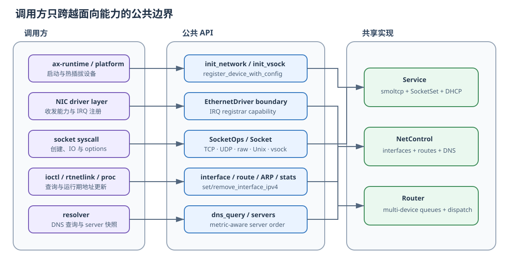

# 对外接口

`ax-net` 的 public API 面向三类调用方：启动阶段的 runtime、系统 ABI/socket 层，以及设备驱动适配层。API 设计保持一个原则：外部通过稳定的接口 ID、快照和 trait object 访问网络栈，不直接接触 `Service`、`Router`、smoltcp `SocketSet` 等内部对象。

核心 re-export 定义在 `lib.rs`：

```rust
pub use self::{
    config::{
        DeviceBinding, InterfaceConfig, InterfaceFlags, InterfaceId, InterfaceInfo,
        InterfaceKind, InterfaceMatcher, Ipv4InterfaceConfig, NetworkConfig,
        RouteInfo, StaticIpConfig,
    },
    device::{ArpEntry, EthernetFramePort, EthernetFramePortList, NetDeviceError, NetDeviceResult},
    queue_runtime::{
        NetQueueStats, NetworkDeviceInput, NetworkQueueRuntime,
        NetworkRuntimeBuilder, NetworkRuntimeError, PinnedNetIrqAction,
        PinnedNetIrqError, PinnedNetIrqOutcome, PinnedNetIrqRegistrar,
        PinnedNetIrqRegistration, ResolvedNetIrqSource,
    },
    socket::{
        CMsgData, IpCmsg, RecvFlags, RecvOptions, SendFlags, SendOptions,
        Shutdown, Socket, SocketAddrEx, SocketCmsg, SocketOps,
    },
    router::NetDevStats,
};
pub use error::{NetError, NetResult};
pub use rd_net::{WifiLinkPolicy, WifiOperation, WifiTransaction, Wpa2Pmk};
```

re-export 列表构成调用方可依赖的稳定表面，内部 `Service`、Router queue 与 smoltcp handle 均未公开。API 分层据此按能力和生命周期组织这些类型，而不是按内部模块目录暴露实现。

## 1. API 分层

公共 API 按生命周期和调用方划分为初始化、驱动、socket、查询、运行期配置与名称解析边界。每类入口只暴露上层完成工作所需的能力，并把 `Service`、`NetControl`、`Router` 和 smoltcp 类型留在 crate 内部，避免调用者依赖锁与存储细节。

- 初始化与配置 API：由 `ax-runtime` 或平台初始化代码调用。
- 运行时查询 API：由系统 ABI、诊断接口、`/proc`、ioctl 等读取网络状态。
- Socket facade API：由 syscall/socket 层创建并操作具体 socket。
- Socket option API：由 getsockopt/setsockopt 层转发。
- 设备驱动 API：由 NIC driver、IRQ registrar、运行期设备注册路径使用。
- DNS/ARP 辅助 API：由 resolver 和 Linux 兼容层使用。

API 边界如下：



图中的多个入口最终汇合到共享实现，但这不意味着调用者可以跨边界交换内部对象。初始化 API 负责创建所有者，查询 API 只返回快照，socket 与驱动 API 则通过 trait 或枚举表达受限能力。

## 2. 初始化配置

初始化 API 构造全局网络栈。它们是全局单例初始化入口，不返回 `Service` 或 `Router` 的可变引用。

### 2.1 网络配置模型

`NetworkConfig` 描述启动阶段接口匹配、IPv4 来源、route metric 与 DNS 配置，是 `init_network()` 发布全局状态前校验的顶层输入。调用方传递拥有型结构，而不是逐项修改 `Service`，从而保证接口、路由和 DNS 可以作为一个一致配置构建。

```rust
pub struct NetworkConfig {
    pub interfaces: Vec<InterfaceConfig>,
    pub default_dns_servers: Vec<Ipv4Addr>,
}

pub struct InterfaceConfig {
    pub name: String,
    pub match_by: InterfaceMatcher,
    pub static_ip: Option<StaticIpConfig>,
    pub dhcp: bool,
    pub metric: u32,
    pub dns_servers: Vec<Ipv4Addr>,
}
```

`InterfaceMatcher` 支持按探测顺序、MAC 或 driver name 匹配设备：

```rust
pub enum InterfaceMatcher {
    ByOrder(usize),
    ByMac(EthernetAddress),
    ByDriverName(String),
}
```

静态 IPv4 配置使用：

```rust
pub struct StaticIpConfig {
    pub ip: Ipv4Addr,
    pub prefix_len: u8,
    pub gateway: Ipv4Addr,
}
```

配置语义：

- `lo` 由 `ax-net` 固定创建，不通过 `NetworkConfig` 覆盖。
- 未显式匹配的 Ethernet 设备按默认策略加入接口 registry。
- `static_ip` 和 `dhcp` 表达互斥配置。
- `metric` 同时影响路由选择和 DNS server 排序。
- `default_dns_servers` 是接口级 DNS 不可用时的 fallback 来源。

字段列表显示 `NetworkConfig` 只描述期望状态，真正的全局所有者尚未创建。网络初始化入口负责校验并把这些配置原子转化为接口、路由、DNS 与已经建立好的 queue runtime。

### 2.2 网络初始化

`init_network()` 是协议网络栈的唯一全局构造入口。调用者先用 `NetworkRuntimeBuilder` 消费全部物理设备、固定 queue executor 与 IRQ，再把得到的 `NetworkQueueRuntime`、协议端口列表和 `NetworkConfig` 一次性交给本函数。维护初始化代码时必须保持 queue runtime 就绪、协议状态构造、全局单例发布和唯一 protocol executor 启动的先后关系，因为 socket API 在该入口返回后会立即依赖这些对象。

```rust
pub fn init_network(
    queue_runtime: Option<NetworkQueueRuntime>,
    frame_ports: EthernetFramePortList,
    config: NetworkConfig,
);
```

调用方传入已发现的 Ethernet driver 列表和结构化配置。初始化会完成：

- 创建 loopback。
- 为每个 Ethernet 设备分配 `InterfaceId` 和接口名。
- 创建 `Router`、`NetControl`、smoltcp `Interface` 和全局 `SocketSet`。
- 安装静态地址、DHCP client 状态、DNS entries 和 route rules。
- 安装已经通过 fixed-affinity 握手并完成 IRQ rearm 的 queue runtime。
- 在选定 CPU 启动唯一 protocol executor。

`init_network()` 是一次性初始化入口，重复初始化会触发全局单例保护。

### 2.3 轮询触发

普通调用者通过 `request_poll()` 发布 generation，表达“协议状态需要继续推进”，而不直接持有 `SERVICE` 执行 smoltcp poll。只有固定 CPU 的 protocol executor 能消费 generation 并调用 smoltcp；socket、queue executor、协议定时器和同步 flush 都只是请求方。

```rust
pub fn request_poll();
```

`request_poll()` 是 socket、设备和控制路径使用的轻量进度请求入口：

```rust
pub fn request_poll() {
    publish_poll_request(&NET_POLL_REQUESTED, || {
        NET_POLL_WAKE.notify_one(true);
    });
}
```

`publish_poll_request()` 使用 `swap(false→true)` 合并重复请求：只有从未 pending 变为 pending 的第一次调用会真正 `notify_one()`。这样 socket 热路径可以频繁请求协议推进，而不会在 worker 尚未消费请求时制造重复唤醒。

### 2.4 Vsock 初始化

`init_vsock()` 只负责发布 vsock 设备并启动其连接管理运行时，不参与 Ethernet `Router` 或 smoltcp `Interface` 的初始化。当前实现从传入列表末尾取一个设备，因此调用方必须把设备选择视为显式约束，而不能假定函数会注册列表中的第一个或全部设备。

```rust
#[cfg(feature = "vsock")]
pub fn init_vsock(vsock_devs: VsockDeviceList);

#[cfg(feature = "vsock")]
pub type VsockDevice = Box<dyn rdif_vsock::Interface>;
#[cfg(feature = "vsock")]
pub type VsockDeviceList = Vec<VsockDevice>;
```

vsock 不进入 smoltcp `SocketSet`，也不实现 `ax-net` 内部 IP `Device` trait。它通过 `rdif_vsock::Interface` 和 vsock connection manager 进入 AF_VSOCK socket backend。

`init_vsock()` 内部用 `pop()` 取传入列表的**最后一个**设备并注册，其余设备忽略；列表为空时仅记录 warning，不创建“已初始化但无设备”的独立状态位。AF_VSOCK 后续操作若没有设备，会在 `device::vsock_*()` 路径返回 `NotFound`。

## 3. 运行时查询

查询 API 返回只读快照。调用方不应持有快照并假设其永久有效；DHCP、运行期设备注册或后续 link state 更新都可能改变接口、路由和 DNS 状态。

### 3.1 接口快照

接口查询 API 从 `NetControl` 返回拥有所有权的 `InterfaceInfo` 快照，使 ioctl、netlink 和诊断代码无需长期持有控制面读锁。`InterfaceId`、接口名、flags 和 IPv4 配置由同一次状态提交维护，调用方应通过这些入口查询，而不是复制另一份接口表。

```rust
pub fn interfaces() -> Vec<InterfaceInfo>;
pub fn interface_by_name(name: &str) -> Option<InterfaceInfo>;
pub fn interface_by_id(id: InterfaceId) -> Option<InterfaceInfo>;
pub fn ipv4_config(name: &str) -> Option<Ipv4InterfaceConfig>;
pub fn net_dev_stats() -> Vec<NetDevStats>;
pub fn set_interface_ipv4(
    interface_id: InterfaceId,
    ip: Ipv4Addr,
    prefix_len: u8,
) -> NetResult<()>;
pub fn remove_interface_ipv4(
    interface_id: InterfaceId,
    ip: Ipv4Addr,
    prefix_len: u8,
) -> NetResult<()>;
```

`set_interface_ipv4()` / `remove_interface_ipv4()` 是 StarryOS rtnetlink 使用的运行期控制入口。当前每个 Ethernet 接口最多保存一个 IPv4 地址：设置第二个地址返回 `AlreadyExists`，删除必须与现有地址和 prefix 完全一致。设置操作会移除该接口的 DHCP 状态、安装 connected route，但不会创建 default route 或 gateway；删除也会关闭该接口 DHCP 并移除它贡献的路由和 DHCP DNS。

`NetDevStats` 按接口返回累计的 `rx/tx bytes`、`packets`、`errors` 和 `dropped`。Ethernet 的字节口径是“不含 FCS 的 L2 frame”，loopback 则按 IP packet 长度；见[多设备实现](devices.md#9-网卡统计)。

`InterfaceId` 是稳定接口 ID，同时作为 StarryOS/Linux ifindex 来源：

```rust
pub struct InterfaceId(u32);

impl InterfaceId {
    pub const LOOPBACK: Self = Self(1);
    pub const fn new(raw: u32) -> Self;
    pub const fn get(self) -> u32;
    pub const fn to_linux_ifindex(self) -> i32;
    pub const fn from_linux_ifindex(ifindex: i32) -> Option<Self>;
}
```

`InterfaceInfo` 是 public snapshot：

```rust
pub struct InterfaceInfo {
    pub id: InterfaceId,
    pub name: String,
    pub kind: InterfaceKind,
    pub mac: Option<EthernetAddress>,
    pub ipv4: Option<Ipv4InterfaceConfig>,
    pub mtu: usize,
    pub flags: InterfaceFlags,
    pub metric: u32,
}
```

系统 ABI 映射应使用 `InterfaceId`，而不是假设 `eth0`：

```rust
let info = ax_net::interface_by_name("eth1").ok_or(NetError::NoSuchDevice)?;
let linux_ifindex = info.id.to_linux_ifindex();
let id = InterfaceId::from_linux_ifindex(linux_ifindex).unwrap();
```

示例强调名称只用于查找，跨 ABI 保存和比较应使用 `InterfaceId`。路由快照沿用同一接口身份，使 route dump 可以和 ioctl、AF_PACKET 结果稳定关联。

### 3.2 路由快照

路由查询将内部 `RouteTable` 的规则转换为稳定的 `RouteInfo`，其中 default route 与普通前缀路由共享 metric 和接口标识语义。该快照服务于 StarryOS route dump 和诊断展示，实际发包仍由 `Router::dispatch()` 在最新共享路由表上重新决策。

```rust
pub fn default_routes() -> Vec<RouteInfo>;
```

`RouteInfo` 是对外 route snapshot，不暴露 Router 内部 device index：

```rust
pub struct RouteInfo {
    pub filter: IpCidr,
    pub via: Option<IpAddress>,
    pub interface_id: InterfaceId,
    pub source: IpAddress,
    pub metric: u32,
}
```

调用方可用它实现 route 诊断、默认网关展示或 Linux 兼容查询；socket 发送路径不应自行遍历 `RouteInfo`，而应通过 socket backend 调用控制面的 route decision。

### 3.3 ARP 快照

`arp_entries()` 聚合各 Ethernet 设备当前可见的邻居缓存，并把驱动内部表示收敛为可供 procfs 或管理接口消费的 `ArpEntry`。返回值是瞬时快照，既不承诺缓存项持续有效，也不会把 ARP 生命周期控制权交给查询方。

```rust
pub fn arp_entries() -> Vec<ArpEntry>;
```

`ArpEntry` 用于 `/proc/net/arp` 等兼容层：

```rust
pub struct ArpEntry {
    pub ip_addr: [u8; 4],
    pub hw_type: u16,
    pub flags: u16,
    pub hw_addr: [u8; 6],
    pub device: String,
}
```

`device` 字段是真实接口名。loopback 不产生 ARP entry。

## 4. Socket 外观层

socket API 统一 AF_INET、AF_UNIX 和 AF_VSOCK 的公共操作形状。协议细节由具体 backend 负责。

### 4.1 地址模型

`SocketAddrEx` 统一承载 IP、Unix 和 vsock 地址，使 `SocketOps` 可以保持单一方法集合，同时让各后端在入口处验证地址族。这个枚举是 syscall 层与具体 transport 之间的类型边界，新增地址族时需要同步审视 bind、connect、name 查询和错误映射。

```rust
pub enum SocketAddrEx {
    Ip(SocketAddr),
    Unix(UnixSocketAddr),
    #[cfg(feature = "vsock")]
    Vsock(VsockAddr),
}
```

地址族不匹配时，`into_ip()`、`into_unix()`、`into_vsock()` 返回对应错误，调用方不需要手工 match 所有 backend。

### 4.2 收发选项

`SendOptions` 和 `RecvOptions` 把 flags、目标地址及控制消息需求从 syscall 参数转换为后端可匹配的结构化输入。选项对象不仅影响复制行为，还决定 peek、非阻塞和 ancillary data 等用户可见语义，因此字段扩展必须同时核对各 transport 的支持矩阵。

```rust
pub type CMsgData = Box<dyn CMsgPayload>;

pub struct SendOptions {
    pub to: Option<SocketAddrEx>,
    pub flags: SendFlags,
    pub cmsg: Vec<CMsgData>,
    pub sender_credentials: Option<UnixCredentials>,
}

pub struct RecvOptions<'a> {
    pub from: Option<&'a mut SocketAddrEx>,
    pub flags: RecvFlags,
    pub cmsg: Option<&'a mut Vec<CMsgData>>,
    pub truncated: Option<&'a mut bool>,
}
```

`SendFlags` 和 `RecvFlags` 使用 Linux `MSG_*` 数值，便于 syscall 层直接转换：

```rust
bitflags! {
    pub struct SendFlags: u32 {
        const OOB = 0x01;
        const DONTROUTE = 0x04;
        const DONTWAIT = 0x40;
        const EOR = 0x80;
        const CONFIRM = 0x800;
        const NOSIGNAL = 0x4000;
        const MORE = 0x8000;
    }

    pub struct RecvFlags: u32 {
        const PEEK = 0x01;
        const TRUNCATE = 0x02;
        const OOB = 0x04;
        const DONTWAIT = 0x40;
    }
}
```

`CMsgPayload` 要求 `Clone` 能力，因而 Unix datagram/seqpacket 的 `MSG_PEEK` 可以复制辅助数据而不消费原消息。接收侧的内建 payload 包括 `IpCmsg::{Ipv4Ttl, Ipv4Tos, Ipv6TrafficClass}` 和 `SocketCmsg::{Credentials, Timestamp}`。`sender_credentials` 由 StarryOS 在实际发送点写入，避免 transport 伪造 pid/uid/gid。

`Shutdown::{Read, Write, Both}` 表达 `shutdown(2)` 的半关闭方向。

### 4.3 套接字能力

`SocketOps` 定义所有 socket backend 必须提供的最小行为面，包括生命周期、地址操作、数据 I/O 和 readiness。上层只依赖这个 trait，TCP、UDP、raw、Unix 与 vsock 则在实现内部维护各自状态，避免 smoltcp 类型泄漏到系统调用层。

```rust
pub trait SocketOps: Configurable {
    fn bind(&self, local_addr: SocketAddrEx) -> NetResult;
    fn connect(&self, remote_addr: SocketAddrEx) -> NetResult;
    fn listen(&self, _backlog: usize) -> NetResult;
    fn is_listening(&self) -> bool;
    fn accept(&self) -> NetResult<Socket>;
    fn send(&self, src: impl Read + IoBuf, options: SendOptions) -> NetResult<usize>;
    fn recv(&self, dst: impl Write + IoBufMut, options: RecvOptions<'_>) -> NetResult<usize>;
    fn recv_available(&self) -> NetResult<usize>;
    fn local_addr(&self) -> NetResult<SocketAddrEx>;
    fn peer_addr(&self) -> NetResult<SocketAddrEx>;
    fn shutdown(&self, how: Shutdown) -> NetResult;
}
```

`Socket` 枚举把统一 API 分发给各 backend：

```rust
pub enum Socket {
    Udp(Box<UdpSocket>),
    Tcp(Box<TcpSocket>),
    Raw(Box<RawSocket>),
    Unix(Box<UnixSocket>),
    #[cfg(feature = "vsock")]
    Vsock(Box<VsockSocket>),
}
```

支持的 backend：

| Backend | 构造入口 | 地址族/类型 |
| --- | --- | --- |
| `tcp::TcpSocket` | `TcpSocket::new()` | AF_INET / SOCK_STREAM |
| `udp::UdpSocket` | `UdpSocket::new()` | AF_INET / SOCK_DGRAM |
| `raw::RawSocket` | `RawSocket::new(ip_version, ip_protocol)`；`new_ipv4_ping()` | AF_INET/AF_INET6 SOCK_RAW；IPv4 ping SOCK_DGRAM |
| `unix::UnixSocket` | `UnixSocket::new(Transport)` | AF_UNIX / stream、datagram、seqpacket |
| `vsock::VsockSocket` | `VsockSocket::new()` | AF_VSOCK / stream |

能力表显示默认方法与 backend 覆盖之间的关系，未覆盖的操作必须返回稳定的 unsupported 错误。设备绑定属于 IP socket 共有的路由约束，因此单独通过 TCP、UDP 和 Raw Socket 的显式入口暴露。

### 4.4 设备绑定

TCP、UDP 和 Raw Socket 都通过 `DeviceBinding` 表达显式 `SO_BINDTODEVICE` 或具体本地地址推导出的接口约束。绑定只过滤 socket 的路由、readiness 和接收候选，不修改全局 `RouteTable`，因此不同 socket 可以安全选择不同出口。

```rust
impl TcpSocket {
    pub fn bind_device(&self, interface_id: InterfaceId) -> NetResult;
}
impl UdpSocket {
    pub fn bind_device(&self, interface_id: InterfaceId) -> NetResult;
}
impl RawSocket {
    pub fn bind_device(&self, interface_id: InterfaceId) -> NetResult;
}
```

不存在的接口返回 `NetError::NoSuchDevice`。成功后内部设置：

```rust
pub struct DeviceBinding {
    pub bound_if: Option<InterfaceId>,
}
```

绑定具体本地地址时，TCP/UDP/raw backend 也会通过控制面反查该地址所属接口，并把 route/waker 选择限制到对应接口。未绑定接口的 connect/sendto 由 route decision 自动选择源地址和出接口。

## 5. Socket 选项

socket option API 使用一个 get enum 和一个 set enum 表达 SO_*、TCP_* 和 IP_*。

### 5.1 选项配置边界

`Configurable` 将 `getsockopt()` 和 `setsockopt()` 收敛为类型化枚举操作，并由 `Socket` 外观层分发到通用或协议专属状态。实现新的选项时应返回明确的 unsupported 或参数错误，不能通过静默保存一个后端永远不会消费的值伪装支持。

```rust
#[enum_dispatch]
pub trait Configurable {
    fn get_option_inner(&self, opt: &mut GetSocketOption) -> NetResult<bool>;
    fn set_option_inner(&self, opt: SetSocketOption) -> NetResult<bool>;

    fn get_option(&self, mut opt: GetSocketOption) -> NetResult { /* dispatch */ }
    fn set_option(&self, opt: SetSocketOption) -> NetResult { /* dispatch */ }
}
```

`get_option()` / `set_option()` 在 backend 返回 `supported = false` 时映射为 `ENOPROTOOPT`，调用方不需要自己区分“协议不支持”和“选项值非法”。

### 5.2 选项集合

选项枚举是 Linux/POSIX 常量与 Rust 后端状态之间的稳定映射，`GeneralOptions` 只保存跨协议共享且确实会被读取的值。协议专属变体应由对应 socket 实现解释，这样调用方可以区分可读回显、实际影响协议行为和明确不支持三种情况。

```rust
define_options! {
    ReuseAddress(bool),
    ReusePort(bool),
    Error(i32),
    DontRoute(bool),
    SendBuffer(usize),
    ReceiveBuffer(usize),
    KeepAlive(bool),
    SendTimeout(Duration),
    ReceiveTimeout(Duration),
    SendBufferForce(usize),
    PassCredentials(bool),
    ReceiveTimestamp(bool),
    PeerCredentials(UnixCredentials),
    SocketType(i32),
    SocketProtocol(i32),
    SocketDomain(i32),
    BindToDevice(Option<InterfaceId>),
    Priority(i32),

    NoDelay(bool),
    MaxSegment(usize),
    TcpKeepIdle(u32),
    TcpKeepInterval(u32),
    TcpKeepCount(u32),
    TcpUserTimeout(u32),
    TcpInfo(TcpInfo),
    TcpCongestionControl(TcpCongestionControl),

    Ttl(u8),
    IpTos(u8),
    RecvTtl(bool),
    RecvTos(bool),
    RecvTrafficClass(bool),
    RecvErr(bool),
    IpMtuDiscover(u8),

    NonBlocking(bool),
}
```

通用选项由 `GeneralOptions` 实现，协议特有选项由具体 socket backend 继续处理。`TcpInfo` 是 transport-independent TCP_INFO snapshot：

```rust
pub struct TcpInfo {
    pub state: TcpState,
    pub options: TcpInfoOptions,
    pub rto_micros: u32,
    pub snd_mss: u32,
    pub rcv_mss: u32,
    pub notsent_bytes: u32,
    pub pmtu: u32,
    pub snd_cwnd: u32,
    pub rcv_space: u32,
    pub snd_wnd: u32,
    pub rcv_wnd: u32,
    // 省略其他 Linux TCP_INFO 兼容字段
}
```

`TcpInfo` 结构包含 Linux ABI 期望的统一字段，但不同值来自 smoltcp 状态、`ax-net` 估算或暂不可用默认。选项支持矩阵先说明更广泛的 getsockopt/setsockopt 分发，再由状态信息小节解释这些 TCP 字段来源。

### 5.3 选项支持矩阵

`GetSocketOption` / `SetSocketOption` 是跨协议的分发格式，并不表示每个 backend 都支持所有 option。backend 返回 `supported = false` 时，统一映射为 `ENOPROTOOPT`；option 值非法时返回具体参数错误。

| Option | 主要实现者 | 语义 |
| --- | --- | --- |
| `ReuseAddress` | `GeneralOptions` | 当前仅保存并可读回；UDP/TCP 端口仲裁不会因此绕过冲突检查 |
| `ReusePort` | `GeneralOptions` + UDP/TCP bind/listen 表 | 两者均为 wildcard 或具体地址相同且所有 owner 都启用时可共同绑定；TCP incoming 目前选择第一个匹配 listener，并未实现 Linux reuseport hash/load balancing |
| `Error` | `GeneralOptions` / TCP override | 通用返回 0；TCP connect 失败后通过 pending error 返回并清理 |
| `DontRoute` | 当前未实现为 socket option | `SetSocketOption::DontRoute` 会落到 `ENOPROTOOPT`；`MSG_DONTROUTE` 也尚未改变普通 route decision |
| `SendBuffer` / `ReceiveBuffer` | TCP/UDP/raw/Unix stream 等具体 backend | IP socket 返回固定 buffer 预算；`GeneralOptions` 只接受 set buffer TODO，不实际调整已分配缓冲区 |
| `SendBufferForce` | 当前未实现 | 返回 `ENOPROTOOPT` |
| `KeepAlive` | TCP | TCP backend 同步到 smoltcp keep-alive 配置；非 TCP backend 返回不支持 |
| `SendTimeout` / `ReceiveTimeout` | `GeneralOptions` | 被 `send_poller*` / `recv_poller*` 使用，决定阻塞等待超时 |
| `PassCredentials` | Unix stream/datagram/seqpacket | 接收端启用时传递发送任务的真实 credentials |
| `ReceiveTimestamp` | Unix datagram/seqpacket | 在消息入队时记录 wall-clock timestamp，并作为 `SocketCmsg::Timestamp` 返回 |
| `PeerCredentials` | Unix stream/datagram/seqpacket | 返回 transport 保存的 `UnixCredentials`；StarryOS 还投影稳定进程身份到调用者 PID namespace |
| `SocketType` / `SocketProtocol` / `SocketDomain` | `GeneralOptions` | 由 socket 创建时写入，用于 `getsockopt()` 返回 Linux ABI 可见值 |
| `BindToDevice` | `GeneralOptions` | 保存 `DeviceBinding`，影响 route lookup 和设备 waker 注册 |
| `Priority` | `GeneralOptions` | 保存 `SO_PRIORITY`，只允许 `0..=6`；当前不影响 Router 或设备队列调度 |
| `NoDelay` | TCP | 映射 TCP_NODELAY 行为 |
| `MaxSegment` | TCP | 返回或设置 TCP MSS 相关兼容值，受 smoltcp 能力限制 |
| `TcpKeepIdle` / `TcpKeepInterval` / `TcpKeepCount` | TCP | 校验 Linux 兼容范围后同步到 TCP keepalive 配置 |
| `TcpUserTimeout` | TCP | 保存 Linux `TCP_USER_TIMEOUT` 兼容值 |
| `TcpInfo` | TCP | 从 smoltcp socket 状态和本地默认值合成 `TCP_INFO` snapshot |
| `TcpCongestionControl` | TCP | 当前只报告/接受 `None`，表示 smoltcp backend 未暴露 Linux 拥塞算法选择 |
| `Ttl` | UDP / raw | UDP 映射 smoltcp hop limit；raw socket 使用该值构造发送 IP header |
| `IpTos` | `GeneralOptions` + TCP/UDP/raw | ECN 位会被清除；TCP/UDP 在 Router dispatch 时按 socket policy 改写 header，raw 发送时直接改写 |
| `RecvTtl` | `RawSocket` | 启用后通过 `IpCmsg::Ipv4Ttl` 返回 IPv4 hop limit |
| `RecvTos` / `RecvTrafficClass` | `GeneralOptions` + UDP recv | UDP `recvmsg()` 可从 ingress packet metadata 生成 IPv4 TOS 或 IPv6 traffic-class cmsg |
| `RecvErr` | `GeneralOptions` | `getsockopt()` 返回 false，`setsockopt()` 作为 TODO 占位接受但不保存；当前不提供完整 Linux error queue |
| `IpMtuDiscover` | `GeneralOptions` | 接受并读回 Linux 模式 `0..=5`，默认 `WANT(1)`；当前不改变 DF/PMTU 数据面行为 |
| `NonBlocking` | `GeneralOptions` | 与 `MSG_DONTWAIT` 不同，修改 socket 自身阻塞属性 |

支持矩阵区分“选项存在”“可以读回”和“确实改变协议行为”，调用方不应把三者混为一谈。TCP 状态信息进一步把运行时观测字段分为精确、近似和暂不可用来源，以维持诊断结果可信度。

### 5.4 TCP 状态信息

`TcpInfo` 把 smoltcp 可观察状态、`ax-net` 自行维护的计时数据和当前无法精确提供的 Linux 字段汇总为 ABI 快照。字段来源必须明确分类，避免用固定零值或近似值冒充真实拥塞控制统计，误导诊断工具。

- 直接来自 smoltcp：连接状态、收发队列长度、窗口估计等。
- 来自 `tcp.rs` 默认值：MSS、PMTU、初始 RTO、reordering 等 Linux 兼容默认字段。
- 合成或保守值：smoltcp 未暴露的拥塞控制细节、ECN/SACK/window scale 等字段以保守方式填充。

因此 `TCP_INFO` 适合用于 Linux 兼容探测和调试，不应被上层当作完整 Linux TCP 栈的拥塞控制 ABI。

## 6. 名称解析

DNS API 位于 `lib.rs`，使用控制面的 DNS registry 和 route decision。

```rust
pub fn dns_servers() -> Vec<Ipv4Address>;
pub fn dns_query(name: &str) -> NetResult<Vec<IpAddr>>;
pub fn dns_query_timeout(name: &str, timeout: Duration) -> NetResult<Vec<IpAddr>>;
```

语义：

- `dns_servers()` 返回按 `(metric, interface_id, server_ip)` 排序并去重的 IPv4 DNS server。
- DNS server 来源包括 DHCP、接口静态配置和 global fallback。
- `dns_query()` 使用默认 5 秒超时。
- `dns_query_timeout()` 会跳过不可路由的 DNS server。
- 查询期间临时创建 smoltcp DNS socket，结束后由 guard 从 `SOCKET_SET` 移除。

DNS 行为列表说明解析过程复用临时 smoltcp socket 和统一轮询，不形成独立 resolver 线程。设备驱动 API 位于更低边界，只提供 packet 与 readiness 能力，不参与名称解析策略。

## 7. 设备与 IRQ API

物理设备边界由 `rdif-eth`/`rd-net` 定义。`NetDevice` 只能消费一次：

```rust
pub trait NetDevice: DriverGeneric + Send + 'static {
    fn into_parts(self: Box<Self>) -> Result<NetDeviceParts, NetError>;
}

pub struct NetDeviceParts {
    pub info: NetDeviceInfo,
    pub control: Box<dyn NetControlEndpoint>,
    pub wifi_control: Option<Box<dyn WifiControl>>,
    pub poll_groups: Vec<NetPollGroupParts>,
}
```

每个 `NetPollGroupParts` 包含 typed group/queue ID、RX/TX queue、一个
task-context `NetPollIrqControl` 和一个或多个 move-only
`NetHardIrqEndpoint`。driver core 不暴露动态 queue 创建、设备级 IRQ 开关或 raw
完整设备 handle。

group 还可以携带 move-only `NetOwnerStartup`。它只在 worker 已固定到 owner CPU、IRQ
callback 已注册但仍 disabled 时执行，供固件下载或 bus 创建等不能在任意 probe CPU
运行的初始化使用。

### 7.1 DMA 与提交错误

`DmaBuffer` 不实现 `Clone`/`Copy`。RX completion 把 token move 到 protocol owner，
消费后从 recycle ring 返回；TX 从 free ring move 到 driver，completion 再归还。
`SubmitError` 必须携带原 buffer，因此 retry、unsupported 或 I/O error 都不能泄漏
DMA ownership。

### 7.2 Hard IRQ 与 task rearm

```rust
pub trait NetHardIrqHandler: Send {
    fn handle_irq(&mut self) -> NetHardIrqResult;
}

pub trait NetPollIrqControl: Send {
    fn quiesce(&mut self) -> Result<(), NetError>;
    fn shutdown(&mut self) -> Result<(), NetError>;
    fn rearm_and_check(&mut self) -> Result<NetRearmResult, NetError>;
}
```

hard endpoint 只返回 `Spurious`、`Schedule(snapshot)` 或 `ProbeDeferred`。它只做
bounded mask/ack/status snapshot，不分配、不访问 DMA payload、不进入 protocol。
queue owner drain 以后才调用原子 `rearm_and_check()`；若窗口中已有工作则保持 IRQ
关闭并重新 schedule。

teardown 只有在 callback disable/synchronize 成功后才由 owner CPU 调用
`shutdown()`。同步失败时 callback lease 与 executor backing 一起隔离，不再并发进入
driver；同步成功但 shutdown 失败时同样隔离完整 poll group，而不是 drop 仍可能被硬件
引用的 token 或 descriptor。

### 7.3 Runtime builder 与 fixed affinity

```rust
pub struct NetworkDeviceInput {
    pub name: String,
    pub device: PreparedNetDevice,
    pub irq_sources: Vec<ResolvedNetIrqSource>,
}

pub trait PinnedNetIrqRegistrar: Sync {
    fn register(
        &self,
        name: String,
        irq: IrqId,
        owner_cpu: usize,
        action: PinnedNetIrqAction,
    ) -> Result<Box<dyn PinnedNetIrqRegistration>, PinnedNetIrqError>;
}
```

`NetworkRuntimeBuilder` 一次性消费全部设备，构造 shared-IRQ affinity domain，等待
worker pin-ready，再以 fixed owner CPU 注册 disabled IRQ。owner startup、initial
refill/rearm、IRQ enable 与 startup transaction 任一步失败都会反向回滚；没有运行时
新增/删除物理 NIC 的公共入口。

### 7.4 Wi-Fi 控制

```rust
pub enum WifiOperation {
    Connect {
        ssid: String,
        pmk: Option<Wpa2Pmk>,
        entropy: Option<[u8; 32]>,
    },
    Disconnect,
    StartOpenAccessPoint { ssid: Vec<u8>, channel: u8 },
}

pub fn WifiTransaction::connect_open(ssid: impl Into<String>) -> WifiTransaction;
pub fn WifiTransaction::connect_wpa2_pmk(
    ssid: impl Into<String>,
    pmk: Wpa2Pmk,
) -> WifiTransaction;
pub fn WifiTransaction::connect_wpa2_pmk_with_entropy(
    ssid: impl Into<String>,
    pmk: Wpa2Pmk,
    entropy: [u8; 32],
) -> WifiTransaction;
pub fn reconfigure_wifi(name: &str, transaction: WifiTransaction) -> NetResult<()>;
```

Wi-Fi control endpoint 随设备 parts 绑定到 queue owner。调用者只提交 owned
transaction；executor quiesce group，在 owner CPU 访问 SDIO/MMIO，rearm 后才返回。
transaction 成功后，唯一 protocol executor 更新 STA DHCP 或 SoftAP 静态地址/DHCP
server。控制调用者不能直接借用 driver handle。

Linux WEXT 的安全连接只接受原生 `iwreq -> iw_point -> iw_encode_ext` 的
`SIOCSIWENCODEEXT` 布局和 `IW_ENCODE_ALG_PMK`。这是 Linux
`wpa_supplicant` `driver_wext` 使用的 PMK-offload UAPI 子集，不是对任意 mainline
cfg80211 WEXT backend 的兼容承诺。passphrase 到 PMK 的 PBKDF2 属于产品侧
`ax-driver` 启动配置边界。`Wpa2Pmk` 的 `Debug` 固定脱敏，drop 时清零；不保留
旧的 raw-passphrase pointer ABI 或 `WifiTransaction::connect(ssid, password)`
兼容入口。

## 8. Unix 命名空间 API

Unix path socket 需要外部文件系统 namespace provider：

```rust
pub fn register_unix_namespace(ns: impl UnixNamespace + 'static);
```

abstract Unix socket 使用 `ax-net` 内部内存 namespace；path socket 通过注册的 `UnixNamespace` 完成路径绑定和解析。

## 9. 兼容语义

兼容语义决定 syscall 层如何把 Linux/POSIX 行为映射到各 socket backend，覆盖地址冲突、临时端口与错误条件。它们不仅是返回值约定，也依赖端口 side table、`ListenTable` 和控制面绑定规则，因此需要作为跨模块稳定契约维护。

### 9.1 按地址绑定与监听

TCP listen 和 UDP bind 支持 Linux 风格 wildcard/specific-address 冲突：

- wildcard 地址与同端口所有具体地址冲突。
- 两个具体地址只有地址相同时冲突。
- TCP 由 `TCP_BOUND_PORTS` 和 `ListenTable` 共同维护。
- UDP 由 `SocketSetWrapper` 的 `udp_binds` side table 维护。
- `SO_REUSEADDR` 当前只保存兼容状态；真正允许相同 endpoint 共同绑定的是 `SO_REUSEPORT`。UDP side table 和 TCP bound/listen table 都继续执行冲突检查。

绑定冲突列表明确 wildcard 和具体地址的兼容边界，并区分 `SO_REUSEPORT` 与仅保存的 `SO_REUSEADDR`。临时端口分配必须在这些相同规则上选择未占用端口，而不能绕过 side table。

### 9.2 临时端口

TCP/UDP 在 bind port 为 `0` 时分配临时端口。临时端口范围从 `49152` 开始，符合 IANA dynamic/private port 下界。该分配器不是 public API，但影响 `bind(0)` 和自动 bind 行为。

### 9.3 错误映射

公共 API 使用 `AxError` 表达可由 syscall 层稳定翻译的失败条件，错误应反映地址、状态、资源或能力边界，而不是泄漏 smoltcp 内部枚举。以下约定是 backend 之间需要保持一致的最小映射，新增路径时应复用而非另造字符串错误。

| 场景 | 错误 |
| --- | --- |
| 绑定不存在接口 | `NetError::NoSuchDevice` |
| 绑定本机不存在地址 | `NetError::NoSuchDeviceOrAddress` |
| 地址/端口冲突 | `NetError::AddrInUse` |
| 操作不支持 | `NetError::OperationNotSupported` |
| nonblocking 或 `MSG_DONTWAIT` 下 would block | `NetError::WouldBlock` |
| 不支持的 socket option | Linux `ENOPROTOOPT` 映射 |

错误表给出跨 backend 需要一致的失败语义，上层 syscall 再把 `AxError` 转换为 Linux errno。使用建议将这些约定落实到查询、轮询和驱动接入方式，避免调用方绕开公共边界。

### 9.4 API 使用建议

调用方应优先使用快照查询、类型化 socket 能力和显式设备配置 API，避免越过公共边界持有内部锁或复刻协议状态。以下约束把初始化、查询、轮询和驱动错误分别留在各自负责的层中，也是后续扩展 API 时需要保持的兼容面。

- 使用 `interfaces()`、`interface_by_name()`、`interface_by_id()` 和 `ipv4_config(name)` 查询接口状态。
- socket 发送路径不要直接使用 `default_routes()` 自行选路，应交给 TCP/UDP/raw backend。
- 设备驱动实现 consumable `NetDevice::into_parts()`，不要直接接触 `Router` 或 `SocketSet`。
- 普通路径需要协议栈进度时调用 `request_poll()`；不要绕过 generation runtime 直接同步 poll smoltcp。`flush_egress()` 也只等待唯一 protocol executor。

这些使用约束共同维持公共 API 的单向依赖：调用方提交配置或操作并接收快照与结构化错误，内部所有者负责锁、队列和协议进展。新 API 应保持相同边界，而不是暴露可变全局对象。
