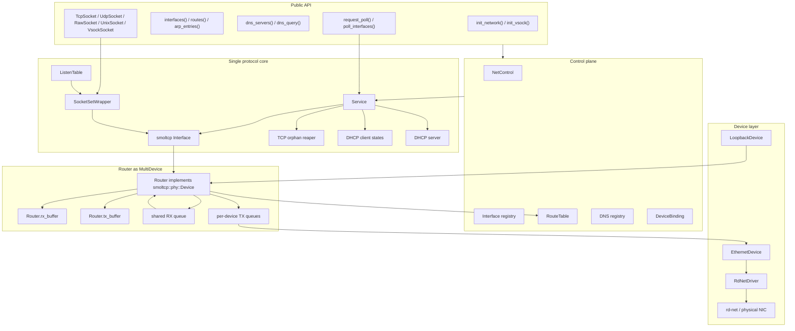
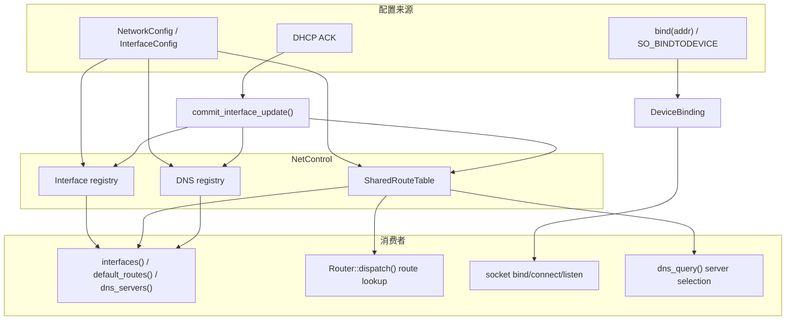
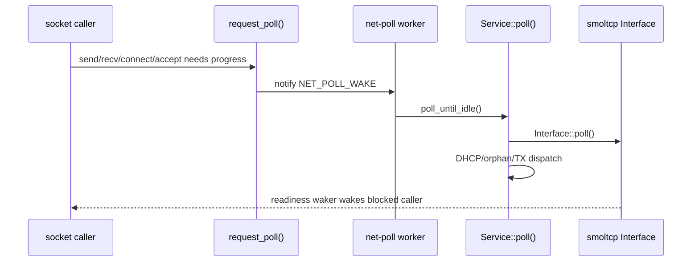
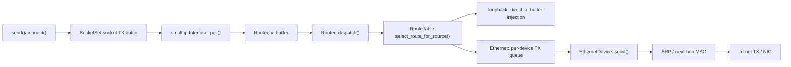

# 总体架构

`ax-net` 是 ArceOS/StarryOS 的网络协议栈 crate。它以 smoltcp 作为单一 TCP/IP 协议核心，在外层补齐多接口、多设备、路由、DNS、DHCP、Linux socket 语义和设备驱动适配。

整体设计可以概括为：

- **单协议栈核心**：所有 IP socket 共享一个 smoltcp `Interface` 和一个全局 `SocketSet`。
- **多设备适配层**：`Router` 对 smoltcp 暴露一个 `phy::Device`，内部聚合 loopback 和多个 Ethernet 设备。
- **控制面与数据面分离**：接口 registry、路由表和 DNS registry 独立于收发路径，可返回只读快照。
- **专用 poll worker**：socket 热路径只请求 poll，由 `net-poll` worker 独占推进 smoltcp。
- **兼容 POSIX/Linux socket 语义**：支持 bind/listen/connect/accept、poll readiness、`SO_BINDTODEVICE`、TCP orphan teardown、Unix domain socket 和可选 vsock。

## 核心设计

`ax-net` 的核心选择是 **Single Interface + Router as Device**：不为每个网卡创建独立 smoltcp `Interface`，而是让所有 IP socket 共享一个 smoltcp `Interface` 和一个全局 `SocketSet`，再用 `Router` 作为虚拟 `Device` 聚合 loopback 与多个 Ethernet 设备。

这种结构保留了 socket 语义的一致性：

| 语义 | 单协议栈核心中的处理方式 |
| --- | --- |
| wildcard listen (`0.0.0.0:port`) | 一个 `ListenTable` entry 覆盖所有可用接口 |
| per-address listen/bind | `IpListenEndpoint` + `DeviceBinding` 做地址/接口约束 |
| ephemeral port 分配 | 在全局 TCP/UDP 端口表中仲裁，避免跨接口重复占用 |
| route change / DHCP 更新 | `RouteTable` 和接口地址原子更新，socket 不需要迁移 |
| poll readiness | 全局 `SocketSet` 中统一计算 readiness 并唤醒调用者 |

如果改成每设备一个 `Interface`/`SocketSet`，这些语义需要在多个协议栈实例之间重新仲裁，例如 wildcard listen 要在所有接口创建 listener，accept queue 要跨实例聚合，端口冲突也要引入中心协调。当前模型更符合多宿主主机上的普通 socket 语义。

### 总体拓扑

### 组件分层

| 层级 | 主要职责 | 关键源码 | 详细文档 |
| --- | --- | --- | --- |
| Public API | 初始化、接口查询、DNS、socket facade、poll trigger | [lib.rs](net/ax-net/src/lib.rs), [socket.rs](net/ax-net/src/socket.rs), [options.rs](net/ax-net/src/options.rs) | [API 参考](api.md) |
| Control plane | 接口 registry、路由决策、DNS 来源、运行期配置提交 | [service.rs](net/ax-net/src/service.rs), [config.rs](net/ax-net/src/config.rs), [router.rs](net/ax-net/src/router.rs) | [控制面](control.md) |
| Single protocol core | 一个 smoltcp `Interface`、全局 `SocketSet`、socket backend、DHCP、orphan 回收、poll 调度 | [service.rs](net/ax-net/src/service.rs), [wrapper.rs](net/ax-net/src/wrapper.rs), [tcp.rs](net/ax-net/src/tcp.rs), [udp.rs](net/ax-net/src/udp.rs), [listen_table.rs](net/ax-net/src/listen_table.rs), [orphan.rs](net/ax-net/src/orphan.rs) | 本文、[Socket 系统](sockets.md) |
| Multi-device Router | smoltcp `Device` 适配、TX 路由、RX 汇聚、loopback 快速路径 | [router.rs](net/ax-net/src/router.rs) | [多设备实现](devices.md) |
| Device layer | Ethernet 封装/解封装、ARP、IRQ/OOB RX、rd-net 适配 | [device/](net/ax-net/src/device/) | [多设备实现](devices.md) |
| Configuration | 静态网络配置、DHCP、MTU、缓冲区、feature | [config.rs](net/ax-net/src/config.rs), [consts.rs](net/ax-net/src/consts.rs), `Cargo.toml` | [配置参考](configuration.md) |
| Integration and tests | OS 集成、启动流程、测试范围 | `ax-runtime`, `starry-kernel`, `ax-api` | [集成](integration.md), [测试](testing.md) |

### TCP/IP 分层映射

| TCP/IP 层 | ax-net 组件 | 主要职责 |
| --- | --- | --- |
| 应用层 | `SocketOps`, `Socket`, `Configurable` | socket API、options、poll readiness、地址类型统一 |
| 传输层 | smoltcp TCP/UDP/raw socket + `tcp.rs`/`udp.rs`/`raw.rs` | TCP 状态机、UDP datagram、raw packet、端口仲裁和 Linux 语义补齐 |
| 网络层 | smoltcp `Interface`, `Router`, `RouteTable`, DHCP/DNS 辅助 | IP packet 处理、路由、接口地址、DHCP client/server、DNS 查询 |
| 链路层 | `EthernetDevice`, `LoopbackDevice`, `RdNetDriver` | Ethernet frame、ARP、IRQ/OOB RX、rd-net 驱动适配 |

smoltcp 负责 TCP/IP 协议核心；`ax-net` 负责多接口、多设备、设备生命周期、socket 兼容语义和 OS 集成。

## Public API

Public API 是上层 OS 模块进入 `ax-net` 的边界，主要定义在 [lib.rs](net/ax-net/src/lib.rs)、[socket.rs](net/ax-net/src/socket.rs) 和 [options.rs](net/ax-net/src/options.rs)。它不暴露 smoltcp 的内部类型，而是提供面向 ArceOS/StarryOS 的稳定能力：

| API 类别 | 代表接口 | 架构作用 |
| --- | --- | --- |
| 初始化 | `init_network()`、`init_vsock()` | 建立 `Service`、`Router`、`NetControl`、设备 worker 和 net-poll worker |
| 接口查询 | `interfaces()`、`interface_by_name()`、`ipv4_config()`、`default_routes()`、`arp_entries()` | 从控制面或设备层返回只读快照 |
| DNS | `dns_servers()`、`dns_query()`、`dns_query_timeout()` | 读取 DNS registry，并通过临时 smoltcp DNS socket 查询 |
| Socket facade | `TcpSocket`、`UdpSocket`、`RawSocket`、`UnixSocket`、`VsockSocket` | 为 syscall/POSIX 层提供统一 socket backend |
| Poll 触发 | `request_poll()`、`poll_interfaces()` | 唤醒专用 net-poll worker，避免应用线程同步驱动协议栈 |
| Socket options | `GetSocketOption`、`SetSocketOption`、`Configurable` | 覆盖通用 `SO_*`、`TCP_*`、`IP_*` 选项 |

Public API 的职责是做边界收敛：上层不需要知道某个 socket 是否由 smoltcp、Unix transport 或 vsock transport 实现，也不需要直接操作 `Service`、`Router` 或 `SocketSet`。具体 API 列表见 [API 参考](api.md)。

## 控制面

控制面负责“网络配置如何被发现、保存、查询和用于决策”。它不直接收发 packet，也不推进 smoltcp poll；数据面只在需要路由、接口地址或 DNS 信息时读取控制面快照。

控制面由 `NetControl` 持有：

- `ControlState`：接口 registry 和 DNS server entries。
- `SharedRouteTable`：路由规则，按最长前缀、metric、插入顺序排序。
- `DeviceBinding`：表达 `SO_BINDTODEVICE` 或本地地址绑定推导出的接口约束。

### 初始化注册

`init_network()` 根据 `NetworkConfig` 和发现到的 Ethernet 设备创建接口 registry：

- `lo` 固定为 `InterfaceId::LOOPBACK`。
- Ethernet 接口从 ifindex 2 开始按发现顺序分配 `InterfaceId`。
- 静态 IPv4、DHCP 开关、metric、DNS server 和默认路由在初始化时写入 `NetControl`。
- `Router` 使用同一份 `SharedRouteTable`，所以控制面的路由更新会直接影响后续 TX dispatch。

### 运行期更新

DHCP client 在 `Service::poll()` 中运行。收到 DHCP ACK 后，`Service` 通过 `commit_interface_update()` 一次性提交：

- 接口 IPv4 地址和 flags。
- smoltcp `Interface` 的 IP address 列表。
- 当前接口的 IPv4 路由。
- 当前接口贡献的 DNS server。

这里使用事务式更新，是为了避免外部查询看到“地址已更新但路由/DNS 还没更新”的中间状态。

### 查询路径

`interfaces()`、`interface_by_name()`、`interface_by_id()`、`ipv4_config()`、`default_routes()` 和 `dns_servers()` 都返回快照。调用方拿到的是当时的只读视图，不持有内部锁，也不应该假设快照会随 DHCP 或接口状态变化自动更新。

### 路由选择

路由表按以下优先级排序：

1. 最长前缀优先。
2. 同前缀时低 metric 优先。
3. 同前缀同 metric 时保留插入顺序。

普通查询使用 `select_route(dst)`，会过滤未 `UP` 的接口。TX dispatch 使用 `select_route_for_source(dst, src)`，同时匹配 smoltcp 已经选出的源地址，避免多宿主主机从错误接口发出带另一接口源地址的包。

### 绑定约束

`DeviceBinding` 是控制面和 socket 语义的连接点：

- `bind(具体本地地址)` 会推导该地址所属接口。
- `SO_BINDTODEVICE` 会显式限制 socket 只使用某个接口。
- wildcard bind 不绑定具体接口，由路由表在发送时选择。

这些约束会影响 socket readiness 注册、端口/listen 语义和路由可用性过滤。更细的规则见[控制面](control.md)。

## Single protocol core

Single protocol core 是 `ax-net` 的协议状态中心，由 `Service`、smoltcp `Interface`、全局 `SocketSetWrapper`、`ListenTable`、DHCP 状态和 TCP orphan 回收共同组成。

### Socket system

IP socket 共享 smoltcp `SocketSet`，但 Linux/POSIX 语义由 `ax-net` 自己补齐：

- `SocketOps` 统一 TCP/UDP/raw/Unix/vsock backend。
- `GeneralOptions` 维护非阻塞、超时、`SO_REUSEADDR`、`SO_BINDTODEVICE` 等通用选项。
- `SocketSetWrapper` 增加 UDP bind 冲突仲裁。
- `TCP_BOUND_PORTS` 和 `ListenTable` 共同维护 TCP bind/listen 端口语义。
- `ListenTable` 在 RX snoop 阶段预创建 TCP socket，支持 accept queue 和 per-address listen。
- `orphan.rs` 在用户关闭仍处于 teardown 的 TCP socket 后继续推进 FIN/TIME_WAIT，避免破坏 TCP 关闭语义。

Unix domain socket 和 vsock 不走 smoltcp IP 层，但通过同一个 public socket facade 暴露给上层。细节见[Socket 系统](sockets.md)。

### 专用 poll worker

smoltcp 的 `Interface::poll()` 由 `net-poll` worker 独占推进。socket 操作、设备 IRQ/OOB RX 和 DNS 等路径只调用 `request_poll()` 触发唤醒，不在应用线程里同步驱动整个协议栈。

这个模型避免应用线程和协议栈驱动线程互相抢协议栈锁，也保证 TCP 重传、keepalive、DHCP 和设备收包不会依赖某个应用线程继续运行。

## Router as MultiDevice

`Router` 是 single protocol core 和真实设备之间的适配层。它位于 smoltcp 的 `phy::Device` 边界上，对上提供一个 IP medium 设备，对下管理多个 `DeviceHandle`。

| 子组件 | 职责 |
| --- | --- |
| `Router.rx_buffer` | smoltcp 从这里取 RX IP packet |
| `Router.tx_buffer` | smoltcp 把待发送 IP packet 写到这里 |
| `RouterQueues::rx` | 所有 Ethernet RX worker 共享的有界 RX 队列 |
| `DeviceHandle.tx_queue` | 每个真实设备独立的有界 TX 队列 |
| `RouteTable` | TX dispatch 的出接口和 next-hop 决策依据 |
| loopback fast path | 回环包直接写入 `rx_buffer`，不经过设备 worker |

`Router::poll()` 负责把设备 RX 队列推进到 smoltcp RX buffer；`Router::dispatch()` 负责把 smoltcp TX buffer 中的包按路由分发到 loopback 或真实设备。更细的 worker、队列和 ARP 行为见[多设备实现](devices.md)。

## Device layer

设备层把不同来源的网络设备统一成 `ax-net` 内部 `Device` trait：

| 设备类型 | 主要源码 | 作用 |
| --- | --- | --- |
| `LoopbackDevice` | [device/loopback.rs](net/ax-net/src/device/loopback.rs) | 零状态占位；真实回环数据路径由 `Router` 快速路径完成 |
| `EthernetDevice` | [device/ethernet.rs](net/ax-net/src/device/ethernet.rs) | Ethernet frame 解析/封装、ARP neighbor 表、pending packet、IRQ/OOB RX |
| `RdNetDriver` | [device/driver.rs](net/ax-net/src/device/driver.rs) | 将 `rd-net` RX/TX queue 适配为 `EthernetDriver` |
| `VsockDevice` | [device/vsock.rs](net/ax-net/src/device/vsock.rs) | 可选 vsock 设备注册和事件入口 |

这一层是协议栈和硬件驱动框架的能力边界。`ax-net` 不直接依赖 FDT、PCI、MMIO、DMA 或平台 IRQ ABI，而是通过 `EthernetDriver`、`EthernetIrqRegistrar` 和 OOB RX 通知机制接入实际设备。

## 数据面流程

### RX 路径

RX worker 只负责从真实设备取包并推入共享 RX 队列。协议处理发生在 `Service::poll()` 内：先由 `Router::poll()` 把 RX 队列 drain 到 `rx_buffer`，再由 smoltcp `Interface::poll()` 交付给 TCP/UDP/raw socket。

### TX 路径

普通 Ethernet 发送会进入设备 TX worker，由 `EthernetDevice` 完成 ARP 和 Ethernet frame 封装。loopback 不走外部设备队列：`Router::dispatch()` 选中 `InterfaceId::LOOPBACK` 时直接把 IP packet 注入 `rx_buffer`，因此本机回环连接可在同一个 poll 周期内继续推进。

### DHCP 和 DNS

DHCP client/server 都位于 `Service::poll()` 调度内，但不依赖 smoltcp 的普通 socket API：

- DHCP client 由 per-interface `DhcpState` 维护 Discover/Request/Bound 状态，收到 ACK 后通过 `commit_interface_update()` 更新地址、路由和 DNS。
- DHCP server 位于 [dhcp_server.rs](net/ax-net/src/dhcp_server.rs)，面向 SoftAP 场景，手工解析/封装 DHCP/UDP/IPv4 包，并通过 `Router::send_on_device()` 发包。
- DNS 查询使用 smoltcp `dns::Socket` 临时加入全局 `SocketSet`，查询完成后由 guard 自动移除。
