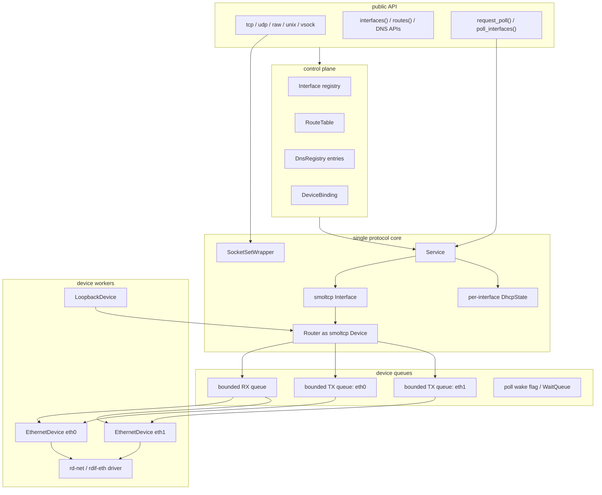

# 网络栈总体架构

`ax-net` 使用单协议栈、多接口、多设备模型。所有 TCP/UDP/raw socket 仍共享一个 smoltcp `Interface` 和一个 `SocketSet`，但接口、路由、DNS、DHCP 和设备收发已经从单 `eth0` 假设扩展为多接口模型。



## 源码组织

整个 crate 源于 [net/ax-net/src/](net/ax-net/src/)，入口为 [net/ax-net/src/lib.rs](net/ax-net/src/lib.rs)。模块划分与职责如下：

| 模块 | 角色 | 关键类型 |
| --- | --- | --- |
| [lib.rs](net/ax-net/src/lib.rs) | public facade，初始化网络、启动 poll worker、导出 API | `init_network`, `request_poll`, `net_poll_worker` |
| [config.rs](net/ax-net/src/config.rs) | 配置与接口信息类型 | `InterfaceId`, `NetworkConfig`, `InterfaceInfo`, `DeviceBinding` |
| [service.rs](net/ax-net/src/service.rs) | 控制面 + 协议核心调度 | `Service`, `NetControl`, `DhcpState` |
| [router.rs](net/ax-net/src/router.rs) | 路由表、有界队列、smoltcp `Device` 适配 | `Router`, `RouteTable`, `RouteDecision` |
| [wrapper.rs](net/ax-net/src/wrapper.rs) | 全局 `SocketSet` 包装与端口冲突仲裁 | `SocketSetWrapper` |
| [socket.rs](net/ax-net/src/socket.rs) | 统一 socket 抽象 | `SocketOps`, `Socket`, `SocketAddrEx` |
| [options.rs](net/ax-net/src/options.rs) | socket 选项与 `Configurable` trait | `GetSocketOption`, `SetSocketOption`, `TcpInfo` |
| [general.rs](net/ax-net/src/general.rs) | 通用 socket 选项、非阻塞/超时/poll helper | `GeneralOptions` |
| [state.rs](net/ax-net/src/state.rs) | socket 状态机锁 | `StateLock`, `StateGuard` |
| [listen_table.rs](net/ax-net/src/listen_table.rs) | TCP listen/accept 表与 SYN 预创建 | `ListenTable` |
| [tcp.rs](net/ax-net/src/tcp.rs) / [udp.rs](net/ax-net/src/udp.rs) / [raw.rs](net/ax-net/src/raw.rs) | IP socket 实现 | `TcpSocket`, `UdpSocket`, `RawSocket` |
| [unix/](net/ax-net/src/unix/) | Unix domain socket | `UnixSocket`, `Transport` |
| [vsock/](net/ax-net/src/vsock/) | 可选 vsock 支持（`vsock` feature） | `VsockSocket`, `VsockTransport` |
| [device/](net/ax-net/src/device/) | loopback、Ethernet、rd-net、vsock 设备适配 | `Device`, `EthernetDevice`, `RdNetDriver` |
| [consts.rs](net/ax-net/src/consts.rs) | 缓冲区大小等常量 | `STANDARD_MTU`, `SOCKET_BUFFER_SIZE` |

## 全局单例

`ax-net` 通过若干 `Once` / `LazyLock` 全局单例持有协议核心与控制面，定义在 [net/ax-net/src/lib.rs#L89-L103](net/ax-net/src/lib.rs#L89-L103)：

```rust
static LISTEN_TABLE: LazyLock<ListenTable> = LazyLock::new(ListenTable::new);
static SOCKET_SET: LazyLock<SocketSetWrapper> = LazyLock::new(SocketSetWrapper::new);

static SERVICE: Once<Mutex<Service>> = Once::new();
static NET_CONTROL: Once<Arc<NetControl>> = Once::new();
static POLLING_INTERFACES: AtomicBool = AtomicBool::new(false);
static POLL_AGAIN: AtomicBool = AtomicBool::new(false);
static NET_POLL_REQUESTED: AtomicBool = AtomicBool::new(false);
static NET_POLL_WAKE: WaitQueue = WaitQueue::new();
static NET_POLL_DEVICE_WAKER: LazyLock<Waker> =
    LazyLock::new(|| Waker::from(Arc::new(NetPollWake)));
```

- `SOCKET_SET` 是所有 IP socket（TCP/UDP/raw/DNS）共享的 smoltcp `SocketSet`。
- `SERVICE` 持有 `Service`（smoltcp `Interface` + `Router` + DHCP 状态），被 mutex 保护。
- `NET_CONTROL` 持有只读控制面（接口 registry、路由表、DNS），可在不持有 `Service` 锁的情况下被查询。
- `NET_POLL_WAKE` 是 `net-poll` worker 的等待队列，`request_poll()` 通过它唤醒 worker。

## 接口标识

`InterfaceId(u32)` 是 `ax-net` 内部接口 ID，同时也是 StarryOS 暴露给 Linux ABI 的 ifindex 数值来源。定义在 [net/ax-net/src/config.rs#L8-L38](net/ax-net/src/config.rs#L8-L38)：

```rust
#[derive(Debug, Clone, Copy, Eq, PartialEq, Ord, PartialOrd, Hash)]
pub struct InterfaceId(u32);

impl InterfaceId {
    pub const LOOPBACK: Self = Self(1);
    pub const fn new(raw: u32) -> Self { Self(raw) }
    pub const fn get(self) -> u32 { self.0 }
    /// Convert to Linux ifindex (i32).
    pub const fn to_linux_ifindex(self) -> i32 { self.0 as i32 }
    pub const fn from_linux_ifindex(ifindex: i32) -> Option<Self> { /* ... */ }
}
```

- `InterfaceId::LOOPBACK == 1`，固定对应 `lo`。
- Ethernet 接口从 `2` 开始，默认发现顺序为 `eth0`、`eth1`（见 [lib.rs](net/ax-net/src/lib.rs#L221) 中 `InterfaceId::new((order as u32) + 2)`）。
- `InterfaceInfo`（[config.rs#L58-L70](net/ax-net/src/config.rs#L58-L70)）是对外只读快照，包含 ID、名称、类型、MAC、IPv4、MTU、flags 和 metric。

```rust
pub struct InterfaceInfo {
    pub id: InterfaceId,
    pub name: String,
    pub kind: InterfaceKind,
    pub mac: Option<EthernetAddress>,
    pub ipv4: Option<Ipv4InterfaceConfig>,
    pub mtu: usize,
    pub flags: InterfaceFlags,
    pub metric: u32,
}
```

## 控制面

控制面由 `NetControl`（[service.rs#L45-L50](net/ax-net/src/service.rs#L45-L50)）统一持有：

```rust
pub struct NetControl {
    state: RwLock<ControlState>,
    pub(crate) routes: SharedRouteTable,
}
```

内部 `ControlState` 保存 `Vec<NetInterface>`（接口 registry）与 `Vec<DnsServerEntry>`（DNS 来源信息）。控制面提供：

- `interfaces()` / `interface_by_name()` / `interface_by_id()`：名称与 ID 查询（[service.rs#L81-L107](net/ax-net/src/service.rs#L81-L107)）。
- `select_route()`：按目的地址查路由，并校验目标接口 `UP`（[service.rs#L147-L174](net/ax-net/src/service.rs#L147-L174)）。
- `local_binding_for()`：把本地监听地址映射为 `DeviceBinding`（[service.rs#L122-L135](net/ax-net/src/service.rs#L122-L135)）。
- `commit_interface_update()`：DHCP ACK 等运行期更新通过一次性事务提交接口地址、smoltcp IP 地址、路由和 DNS，避免外部看到半更新状态（[service.rs#L175-L198](net/ax-net/src/service.rs#L175-L198)）。

控制面查询不进入设备锁，也不直接推进 smoltcp poll。`select_route_if`（[router.rs#L245](net/ax-net/src/router.rs#L245)）会传入一个 `is_usable` 闭包，跳过未 `UP` 的接口：

```rust
pub fn select_route_if(&self, dst, mut is_usable: impl FnMut(InterfaceId) -> bool)
    -> Option<RouteDecision>
{
    self.rules.iter()
        .find(|rule| rule.filter.contains_addr(dst) && is_usable(rule.interface_id))
        .map(|rule| RouteDecision { /* ... */ })
}
```

`RouteTable` 还提供 `select_route_for_source(dst, src)`（[router.rs#L262](net/ax-net/src/router.rs#L262)），用于在 TX dispatch 时同时匹配目的地址和源地址。例如，多宿主（multi-homed）主机有两个接口分别有不同源 IP，发送到同一目的地的包需根据 smoltcp 注入的源地址选择正确的出接口。

### 路由排序策略

`sort_rules()` 的三级排序（[router.rs#L235-L240](net/ax-net/src/router.rs#L235-L240)）：

1. **最长前缀优先**：`b.filter.prefix_len().cmp(&a.filter.prefix_len())` — 更长的前缀排在前面
2. **低 metric 优先**：同前缀长度时，`a.metric.cmp(&b.metric)` — metric 更小的优先
3. **插入顺序稳定**：同前缀同 metric 时，`a.order.cmp(&b.order)` — order 由 `next_order` 自增产生

这使得 `select_route_if` 使用 `find()` 返回第一个匹配项（即最高优先级的路由）。

`SocketSetWrapper`（[wrapper.rs](net/ax-net/src/wrapper.rs)）在 smoltcp 原生 `SocketSet` 之上增加了 UDP 端口冲突仲裁。原生 smoltcp 允许多个 UDP socket bind 同一端口（由上层保证），`ax-net` 在此层实现 `SO_REUSEADDR` 语义：

```rust
pub(crate) struct SocketSetWrapper<'a> {
    pub inner: Mutex<SocketSet<'a>>,   // smoltcp SocketSet
    pub new_socket: Event,              // 通知 accept()/poll() 有新 socket
    udp_binds: Mutex<HashMap<UdpBindKey, SocketHandle>>,  // UDP 端口占用表
}
```

UDP bind 仲裁规则（[wrapper.rs#L59-L71](net/ax-net/src/wrapper.rs#L59-L71)）：

- **精确 bind**（如 `192.168.1.1:53`）：如果已有同地址同端口则拒绝；如果有 wildcard `0.0.0.0:53` 则拒绝。
- **Wildcard bind**（`0.0.0.0:53`）：如果任何地址已占用同一端口则拒绝。
- **`SO_REUSEADDR`**：设置后跳过仲裁。

`add()` 方法调用 `self.new_socket.notify(1)`，用于在 smoltcp 内部唤醒等待 `SocketSet` 变更的轮询者（smoltcp `wait`/`wake` 机制通过此 Event 传递）。

## TCP 端口绑定仲裁

除了 `ListenTable`（管理 `listen()` 端口），`ax-net` 还有独立的 `TCP_BOUND_PORTS`（[tcp.rs](net/ax-net/src/tcp.rs)）来追踪已 bind 但尚未 listen 的端口：

```rust
static TCP_BOUND_PORTS: LazyLock<Mutex<HashMap<u16, Vec<Option<IpAddress>>>>> =
    LazyLock::new(|| Mutex::new(HashMap::new()));

fn register_tcp_bound(endpoint: IpListenEndpoint) -> AxResult;
fn unregister_tcp_bound(endpoint: IpListenEndpoint);
```

两个系统协同工作：
- `LISTEN_TABLE`：管理已进入 `listen()` 状态的端口及 SYN 队列，防止同一端口被多次 listen。
- `TCP_BOUND_PORTS`：追踪已 bind（可能尚未 listen）的端口和地址，防止地址冲突的重复 bind。`register_tcp_bound()` 在 `bind()`、`listen()`、`connect()` 中被调用；`unregister_tcp_bound()` 在 `shutdown()`、`Drop` 和错误回退中被调用。
- `tcp_port_available(port)`：同时检查两个表，确保 `get_ephemeral_port()` 不会分配到已被 bind 或已在 listen 的端口。

`listen_addrs_conflict(a, b)` 判断两个 `IpListenEndpoint` 是否冲突：任一为 `None`（wildcard）即冲突，或两者值相等即冲突。

## Socket 状态机

`StateLock`（[state.rs](net/ax-net/src/state.rs)）为 socket 提供基于 CAS 的轻量状态转换锁：

```
Idle ──bind──→ Idle (不变，但注册 endpoint)
Idle ──listen──→ Listening
Idle ──connect──→ Connecting ──SYN/SYN+ACK──→ Connected
Listening ──accept──→ Listening (不变，但生成新 socket)
Connected ──close──→ Closed
```

核心 API：

```rust
pub fn lock(&self, expect: State) -> Result<StateGuard<'_>, State> {
    // CAS: expect → Busy，失败返回当前状态
}
pub fn transit<R>(self, new: State, f: impl FnOnce() -> AxResult<R>) -> AxResult<R> {
    // 执行 f()，成功则写 new 状态，失败则回退到原始状态
}
```

`StateLock` 保证绑定/监听/连接等操作的原子性：并发 bind+connect 在同一 socket 上只能有一个成功。

## TCP Listen Table 与 SYN Pre-create

`ListenTable`（[listen_table.rs](net/ax-net/src/listen_table.rs)）是 TCP 监听的核心数据结构。它包含 65536 个槽位（每端口一个 `Arc<Mutex<Option<Box<ListenTableEntryInner>>>>`），每个活跃端口存储：

```rust
struct ListenTableEntryInner {
    listen_endpoint: IpListenEndpoint,  // 监听地址和端口
    backlog: usize,                      // SYN 队列容量（clamp 到 LISTEN_QUEUE_SIZE=512）
    syn_queue: VecDeque<PendingTcp>,     // 预创建的连接
}
```

### SYN 预创建机制

`snoop_tcp_packet()`（[router.rs](net/ax-net/src/router.rs#L474-L500)）在 RX 路径中拦截 TCP SYN 包：

1. 解析 TCP 包头，检查 SYN 标志。
2. 查 `LISTEN_TABLE` 是否存在匹配的 listening entry。
3. 如果 SYN queue 未满，**预创建**一个 `TcpSocket` 并调用 `socket.listen()`，将其加入 `syn_queue`。
4. smoltcp 随后 `Interface::poll()` 完成三次握手。
5. `accept()` 时直接从前端取出已完成握手的 socket，无需阻塞等待。

SYN queue 满时丢弃 SYN 包（打 warning），由客户端重传机制保证可靠性。

### accept() 流程

`ListenTable::accept()`（[listen_table.rs#L133-L157](net/ax-net/src/listen_table.rs#L133-L157)）：

1. 遍历 `syn_queue`。
2. 跳过已关闭且无未读数据的 socket（`is_closed_without_data`），移除并销毁。
3. 返回第一个已完成握手的 socket（`is_acceptable` 检查 TCP state 为 Established/CloseWait/FinWait1/FinWait2 等可 accept 状态）。
4. 为减少慢速枚举，`idx > 0` 时打印 warning。

## 通用 Poll 与超时

`GeneralOptions`（[general.rs](net/ax-net/src/general.rs)）为所有 socket 类型提供通用设施：

```rust
pub(crate) struct GeneralOptions {
    nonblock: AtomicBool,             // O_NONBLOCK
    reuse_address: AtomicBool,        // SO_REUSEADDR
    send_timeout_nanos: AtomicU64,    // SO_SNDTIMEO
    recv_timeout_nanos: AtomicU64,    // SO_RCVTIMEO
    bound_if: AtomicU32,              // SO_BINDTODEVICE (InterfaceId)
    socket_type: AtomicI32,           // SOCK_STREAM/DGRAM/RAW
    domain: i32,                      // AF_INET/AF_UNIX/AF_VSOCK
    protocol: i32,                    // IPPROTO_TCP/UDP/ICMP
}
```

提供的 poll helper：

- `send_poller()` / `recv_poller()`：阻塞等待 I/O 就绪或超时。内部流程：检查 `nonblock` → 调用 `register_waker()` 注册到 `Service` → `block_on(poll_io())` 自旋等待 → 超时检查 → 执行操作 → 成功或返回错误。
- `send_poller_with()`：支持指定是否检测 HUP 事件。
- `register_waker()`：根据 `DeviceBinding` 将调用者 waker 注册到对应设备的 `PollSet`。

### socket.domain / socket.protocol / socket_type 常量

每个 socket 创建时固化：

| socket 类型 | socket_type (SOCK_\*) | domain (AF_\*) | protocol (IPPROTO_\*) |
| --- | --- | --- | --- |
| `TcpSocket` | 1 (STREAM) | 2 (INET) | 6 (TCP) |
| `UdpSocket` | 2 (DGRAM) | 2 (INET) | 17 (UDP) |
| `RawSocket` | 3 (RAW) | 2 (INET) | 根据 `IpProtocol` |
| `UnixSocket` (stream) | 1 (STREAM) | 1 (UNIX) | 0 |
| `UnixSocket` (dgram) | 2 (DGRAM) | 1 (UNIX) | 0 |
| `VsockSocket` | 1 (STREAM) | 40 (VSOCK) | 0 |

## Router 内部结构

`Router`（[router.rs](net/ax-net/src/router.rs)）是 smoltcp 与多设备之间的适配层：

```rust
pub struct Router {
    rx_buffer: PacketBuffer,           // smoltcp Device RX buffer（64 个 MTU 槽位）
    tx_buffer: PacketBuffer,           // smoltcp Device TX buffer
    queues: Arc<RouterQueues>,         // 全局 RX 队列（所有设备共享）
    devices: Vec<Arc<DeviceHandle>>,   // 设备列表（按 add_device() 顺序）
    table: SharedRouteTable,           // 路由表
}
```

### BoundedPacketQueue

`BoundedPacketQueue<T>` 是有界 MPSC 队列，容量默认 `SOCKET_BUFFER_SIZE=64`：

```rust
struct BoundedPacketQueue<T> {
    inner: Mutex<VecDeque<T>>,
    capacity: usize,
    len: AtomicUsize,      // 无锁长度读取，用于 is_empty() 检查
}
```

- `push()`：加锁，满则返回 `Err(T)`（上层丢弃并打 warning）。
- `pop()`：加锁，空返回 `None`。
- `is_empty()`：原子读 `len`，无锁。

### DeviceHandle

每设备一个 `DeviceHandle`，持有设备锁、收发队列和唤醒机制：

```rust
struct DeviceHandle {
    interface_id: InterfaceId,
    name: String,
    inner: Arc<Mutex<Box<dyn Device>>>,       // 设备 trait object
    rx_queue: Arc<BoundedPacketQueue<RxPacket>>,  // 指向 RouterQueues::rx（共享）
    tx_queue: Arc<BoundedPacketQueue<TxPacket>>,  // 独立 TX 队列
    rx_wake: Arc<WaitQueue>,                      // 唤醒 RX worker
    tx_wake: Arc<WaitQueue>,                      // 唤醒 TX worker
    rx_waker: Waker,                               // 驱动→rx_wake 的转换器
}
```

RX 队列是所有设备共享的（`RouterQueues::rx`），因为 smoltcp 从同一个 `Router::rx_buffer` 消费；TX 队列每设备独立，由 `dispatch()` 按路由决策分发。

### TX Dispatch

`Router::dispatch()`（[router.rs#L523-L565](net/ax-net/src/router.rs#L523-L565)）从 `tx_buffer` 取出 smoltcp 发出的 IP 包：

- **IPv4 广播**（dst=255.255.255.255）：复制到所有非 loopback Ethernet 设备。
- **IPv4 单播**：按 `select_route_for_source()` 选路由（要求源地址匹配），将包推入对应设备 TX 队列。
- **IPv6 多播**：复制到所有非 loopback Ethernet 设备。
- **IPv6 单播**：按 `select_route()` 选路由。

### RX 数据流

`Router::poll()`（[router.rs#L476-L490](net/ax-net/src/router.rs#L476-L490)）：

1. 从 `RouterQueues::rx` 循环出队，填充 `rx_buffer`。
2. 每包先调 `snoop_tcp_packet()` 检查 TCP SYN，预创建 listen socket。
3. 再调 snoop 回调（DHCP packet 分发）。
4. `rx_buffer` 满则停止出队（剩余包留在队列供下次 poll）。

## Ethernet 设备实现

`EthernetDevice`（[ethernet.rs](net/ax-net/src/device/ethernet.rs)）是 `Device` trait 的主要实现：

```rust
pub struct EthernetDevice {
    name: String,
    inner: Arc<EthernetIrqState>,        // 共享 IRQ 状态
    neighbors: HashMap<IpAddress, Neighbor>,           // ARP 缓存
    pending_neighbors: HashMap<IpAddress, PendingNeighbor>, // 等待 ARP reply
    ip: Option<Ipv4Cidr>,                // 本机 IP
    pending_packets: PacketBuffer<IpAddress>,  // ARP-pending 发包队列（128 个槽位）
}
```

### ARP 处理

`EthernetDevice::recv()` 处理入站 Ethernet 帧：

1. 调用 `EthernetDriver::receive()` 从硬件获取一帧。
2. 解析 `EthernetFrame`，按 `EthernetProtocol` 分派：
   - **ARP**：更新 neighbor 表（reply 和 gratuitous request），从 `pending_packets` 释放等待的包。
   - **IPv4/IPv6**：encapsulation 检查，将 payload 写入 smoltcp `PacketBuffer`。

`send()` 路径：

1. 查 `neighbors` 表，有则直接发送。
2. 无则检查 `pending_neighbors`：如果已发送 ARP request 未超时，将包写入 `pending_packets`。
3. 否则发送 ARP request，记录到 `pending_neighbors`。
4. Neighbor TTL = 300s（与 Linux 一致），ARP retry = 1s。

### IRQ 模型

`EthernetIrqState` 管理 IRQ 注册和驱动锁：

```rust
struct EthernetIrqState {
    irq: Option<usize>,
    irq_registration: spin::Once<Box<dyn EthernetIrqRegistration>>,
    driver: SpinNoIrq<Box<dyn EthernetDriver>>,
    poll_ready: PollSet,
}
```

IRQ 处理链：
1. `ax-runtime` 通过 `set_ethernet_irq_registrar()` 注册 `EthernetIrqRegistrar`。
2. `EthernetDevice::new()` 中通过 `registrar.register_shared(name, irq, action)` 注册 IRQ handler。
3. IRQ 触发时调用 `handle_ethernet_irq()`：运行 `driver.handle_irq()`，如果返回 `RX_READY` 则 `poll_ready.wake()` 唤醒 RX worker。
4. 如果没有注册 IRQ registrar，回退到纯 poll 模式（RX worker 的 `rx_wake.wait()` 可被 `request_poll()` 路径唤醒）。

### RdNetDriver

`RdNetDriver`（[driver.rs](net/ax-net/src/device/driver.rs)）是 `EthernetDriver` trait 的 `rd-net` 适配实现。内部持有 `rd_net::TxQueue` 和 `rd_net::RxQueue`，通过预取 `RX_PREFETCH_TARGET=1` 个包到 `pending_rx: VecDeque` 减少锁竞争。`alloc_tx_buffer()` 返回 `VecTxBuffer`（栈友好），`transmit()` 执行硬件发送。

## Loopback 设备

`LoopbackDevice`（[loopback.rs](net/ax-net/src/device/loopback.rs)）实现本地回环：

- `send()`：将 IP 包写入内部 `PacketBuffer`（64 槽 × 1500 字节），调用 `poll.wake()` 通知 poller。
- `recv()`：从内部 buffer 出队，将 IP 包写入 smoltcp `rx_buffer`。不封装/解封装 Ethernet 帧。
- `register_waker()`：将 waker 注册到内部 `PollSet`。

## 数据面 poll 流程

`Service::poll()`（[service.rs#L494-L509](net/ax-net/src/service.rs#L494-L509)）在每个 poll 周期执行：

```rust
pub fn poll(&mut self, sockets: &mut SocketSet) -> bool {
    let timestamp = now();
    let mut dhcp_events = Vec::new();
    // 1. 唤醒所有 RX worker，让它们有机会推新数据到队列
    self.router.wake_rx_workers();
    // 2. Router::poll()：从 RX 队列消费包到 smoltcp buffer，同时分发 DHCP 包
    {
        let dhcp = &mut self.dhcp;
        self.router.poll(timestamp, sockets, |interface_id, packet| {
            for state in dhcp.iter_mut() {
                if let Some(event) = state.process_packet(interface_id, packet, timestamp) {
                    dhcp_events.push(event);
                }
            }
        });
    }
    // 3. 处理 DHCP 事件（更新地址、路由、DNS）
    for event in dhcp_events { self.handle_dhcp_event(event); }
    // 4. smoltcp Interface::poll()：协议状态机推进
    self.iface.poll(timestamp, &mut self.router, sockets);
    // 5. DHCP 发包定时器
    let dhcp_poll_next = self.poll_dhcp(timestamp);
    // 6. TX dispatch：将 smoltcp 输出的包路由到设备
    self.router.dispatch(timestamp) || dhcp_poll_next
}
```

返回值 `bool` 指示是否需要立即再 poll 一次（用于 `poll_until_idle` 循环）。`next_poll_at()` 调用 `Interface::poll_at()` 获取 smoltcp 建议的下次 poll 时间（用于 `net-poll` worker 的 idle 休眠决策）。

## net-poll Worker

`net_poll_worker`（[lib.rs#L479-L489](net/ax-net/src/lib.rs#L479-L489)）是协议核心的唯一驱动线程：

```rust
fn net_poll_worker() {
    loop {
        let delay = next_poll_delay();          // smoltcp poll_at() 建议延迟
        let timed_out = NET_POLL_WAKE.wait_timeout_until(delay,
            || NET_POLL_REQUESTED.load(Acquire));  // 等 request_poll() 或超时
        if !timed_out { NET_POLL_REQUESTED.store(false, Release); }
        poll_until_idle();                       // 循环 poll 直到无新事件
    }
}
```

`poll_until_idle()` 使用 `POLLING_INTERFACES` CAS 锁防止重入（同一时刻最多一个 poll 进行中），内部循环调用 `poll_once()` 直到 `POLL_AGAIN` 为 false。空闲时 `next_poll_delay()` 返回最多 100ms 的 idle poll interval。

## DHCP 状态机

`DhcpState`（[service.rs#L269-L510](net/ax-net/src/service.rs#L269-L510)）维护 per-interface DHCP 客户端：

```
Discovering ──Offer──→ Requesting ──ACK──→ Bound
    │                     │                    │
    └──timeout→retry──    └──timeout→retry──   └──NAK→Discovering (reset)
```

- **Discovering**：广播 DHCPDISCOVER，指数退避重试（1,2,4,8... 最多 16 秒间隔）。
- **Requesting**：收到 DHCPOFFER 后广播 DHCPREQUEST。
- **Bound**：收到 DHCPACK，状态转为 Bound。NAK 触发 reset → Discovering。

`process_packet()` 按 ingress `InterfaceId` 匹配、解析 IPv4→UDP→DHCP，校验 `transaction_id` 和 `client_hardware_address` 防止误收。`poll_packet()` 在非 Bound 状态且重试时间到达时构造 DHCP 发包。

`dhcp_transaction_id(mac)` 将 MAC 地址低 32 位与 `wall_time_nanos()` 混合生成 transaction ID。

## DNS 解析流程

`dns_query()`（[lib.rs#L506-L536](net/ax-net/src/lib.rs#L506-L536)）：

1. `dns_servers()` 获取按 (metric, interface_id, server_ip) 排序的去重 DNS server 列表。
2. 过滤不可路由的 server（通过 `select_route()` 检查可达性）。
3. 在 `SOCKET_SET` 中创建 `dns::Socket`，发起 A 记录查询。
4. 循环 `request_poll()` + `yield_now()`，检查 `get_query_result()`。
5. 默认 5 秒超时（`DNS_DEFAULT_TIMEOUT`），超时返回 `ETIMEDOUT`。
6. `DnsSocketGuard` 在 drop 时从 `SOCKET_SET` 移除 DNS socket。

执行顺序：

```text
Service::poll()
  -> Router::poll() drain RX queue
  -> DHCP packet snoop
  -> smoltcp Interface::poll()
  -> poll DHCP retry
  -> Router::dispatch() route TX packets
```

`Router`（[router.rs#L318-L326](net/ax-net/src/router.rs#L318-L326)）是 smoltcp `phy::Device` 适配层。它对 smoltcp 实现 `phy::Device` trait（[router.rs#L672](net/ax-net/src/router.rs#L672)），对外只暴露 IP 层（`Medium::Ip`）：

```rust
impl smoltcp::phy::Device for Router {
    type RxToken<'a> = RxToken<'a>;
    type TxToken<'a> = TxToken<'a>;
    fn receive(&mut self, _timestamp: Instant) -> Option<(Self::RxToken<'_>, Self::TxToken<'_>)> { /* ... */ }
    fn transmit(&mut self, _timestamp: Instant) -> Option<Self::TxToken<'_>> { /* ... */ }
    fn capabilities(&self) -> DeviceCapabilities {
        let mut caps = DeviceCapabilities::default();
        caps.medium = Medium::Ip;
        caps.max_transmission_unit = STANDARD_MTU;
        caps.max_burst_size = Some(SOCKET_BUFFER_SIZE);
        caps
    }
}
```

设备 worker 不直接访问 `Router` 本体，只和 `RouterQueues` / per-device TX queue 交互：

- RX worker（[router.rs#L575](net/ax-net/src/router.rs#L575)）从 rd-net 设备读取 packet，复制到有界 RX queue，并 `request_poll()`。
- smoltcp `RxToken`（[router.rs#L656](net/ax-net/src/router.rs#L656)）从 RX buffer 读 packet，并保留 ingress `InterfaceId` 元数据。
- smoltcp `TxToken`（[router.rs#L642](net/ax-net/src/router.rs#L642)）只写入 TX buffer；真实出接口由 `Router::dispatch()`（[router.rs#L498](net/ax-net/src/router.rs#L498)）根据 IP 包源/目的地址和路由表选择。
- TX worker（[router.rs#L559](net/ax-net/src/router.rs#L559)）从对应设备 TX queue 发包。

## 设备能力边界（Device trait）

`ax-net` 不直接依赖硬件驱动框架。所有设备实现统一的内部 `Device` trait（[device/mod.rs#L33-L55](net/ax-net/src/device/mod.rs#L33-L55)）：

```rust
pub trait Device: Send + Sync {
    fn name(&self) -> &str;
    fn recv(&mut self, interface_id: InterfaceId,
            buffer: &mut PacketBuffer<InterfaceId>, timestamp: Instant,
            snoop: &mut dyn FnMut(&[u8])) -> bool;
    /// Sends a packet to the next hop. Returns true if receive became ready.
    fn send(&mut self, next_hop: IpAddress, packet: &[u8], timestamp: Instant) -> bool;
    fn set_ipv4_addr(&mut self, _addr: Option<Ipv4Cidr>) {}
    fn arp_entries(&self, _timestamp: Instant) -> Vec<ArpEntry> { Vec::new() }
    fn register_waker(&self, waker: &Waker);
}
```

两个实现：

- `LoopbackDevice`（[device/loopback.rs#L16](net/ax-net/src/device/loopback.rs#L16)）：用 `PacketBuffer` 自环，`send()` 直接 enqueue 并 wake。
- `EthernetDevice`（[device/ethernet.rs#L106](net/ax-net/src/device/ethernet.rs#L106)）：维护 ARP 邻居表（`NEIGHBOR_TTL = 300s`，见 [ethernet.rs#L133](net/ax-net/src/device/ethernet.rs#L133)）、pending packet 队列、Ethernet 帧封装/解析，并对接 IRQ 适配。

`EthernetDevice` 之下是能力边界 trait `EthernetDriver`（[device/driver.rs#L70-L82](net/ax-net/src/device/driver.rs#L70-L82)），由 `RdNetDriver`（[device/driver.rs#L128](net/ax-net/src/device/driver.rs#L128)）包装 `rd-net` 的 `TxQueue` / `RxQueue` 实现。这样 `ax-net` 避免直接依赖 FDT、PCI、MMIO、DMA、VirtIO 或平台 IRQ ABI。

## SocketSetWrapper

全局 socket 容器 `SocketSetWrapper`（[wrapper.rs#L16-L24](net/ax-net/src/wrapper.rs#L16-L24)）除了持有 smoltcp `SocketSet`，还维护 UDP 端口冲突仲裁（`udp_binds`）：

```rust
pub(crate) struct SocketSetWrapper<'a> {
    pub inner: Mutex<SocketSet<'a>>,
    pub new_socket: Event,
    udp_binds: Mutex<HashMap<UdpBindKey, SocketHandle>>,
}
```

`udp_bind()`（[wrapper.rs#L48-L68](net/ax-net/src/wrapper.rs#L48-L68)）实现 Linux 语义的端口复用规则：具体地址与通配地址互斥，相同地址端口冲突返回 `AddrInUse`（除非 `SO_REUSEADDR`）。

## 为什么不是 multi-smoltcp domain

多个 smoltcp 实例可以让不同 NIC 的协议处理并行，但会引入更复杂的 socket 语义：

- TCP wildcard listen 需要在多个 `SocketSet` 创建 listener 并聚合 accept queue。
- UDP wildcard bind 需要聚合多个 backend 的 recv readiness。
- 端口冲突检查需要跨 domain 统一仲裁。
- 动态路由切换会涉及 socket backend 迁移或重新绑定。
- `SO_BINDTODEVICE`、AF_PACKET、raw socket 和 multicast 的接口集合语义会更复杂。

因此当前 `ax-net` 优先保留单协议栈语义，用多接口 registry、路由决策和设备队列解耦补齐功能和部分性能优化。

## Socket backend 分层

`Socket` 枚举（[socket.rs#L253-L265](net/ax-net/src/socket.rs#L253-L265)）聚合 5 类 backend，统一实现 `SocketOps` + `Configurable`：

| Backend | 类型 | 协议核心 | 源码 |
| --- | --- | --- | --- |
| `TcpSocket` | SOCK_STREAM / AF_INET | smoltcp TCP socket | [tcp.rs#L50](net/ax-net/src/tcp.rs#L50) |
| `UdpSocket` | SOCK_DGRAM / AF_INET | smoltcp UDP socket | [udp.rs#L50](net/ax-net/src/udp.rs#L50) |
| `RawSocket` | SOCK_RAW / AF_INET | smoltcp raw socket | [raw.rs#L50](net/ax-net/src/raw.rs#L50) |
| `UnixSocket` | SOCK_STREAM/SOCK_DGRAM / AF_UNIX | 自包含 `Transport`（不经 smoltcp） | [unix/mod.rs#L70](net/ax-net/src/unix/mod.rs#L70) |
| `VsockSocket` | SOCK_STREAM / AF_VSOCK | `rdif-vsock` 驱动 + ring buffer | [vsock/mod.rs#L68](net/ax-net/src/vsock/mod.rs#L68) |

IP 类 socket 通过 `SOCKET_SET.add()` 注册到全局 `SocketSet`，获得 `SocketHandle`；Unix / vsock 不依赖 smoltcp，各自维护连接状态。

## Socket 状态机

IP socket 使用 `StateLock`（[state.rs#L32-L57](net/ax-net/src/state.rs#L32-L57)）做无锁状态转换，避免在 socket 上长期持锁：

```rust
pub(crate) enum State { Idle, Busy, Connecting, Connected, Listening, Closed }

pub struct StateLock(AtomicU8);
impl StateLock {
    pub fn lock(&self, expect: State) -> Result<StateGuard<'_>, State> {
        // CAS: expect -> Busy
    }
}
```

`StateGuard::transit()`（[state.rs#L65-L76](net/ax-net/src/state.rs#L65-L76)）在执行操作时把状态临时置为 `Busy`，操作成功才提交新状态，失败回滚。这样并发 `connect` / `accept` 不会互相破坏。

非阻塞与超时由 `GeneralOptions`（[general.rs#L113-L145](net/ax-net/src/general.rs#L113-L145)）统一处理，基于 `axpoll::poll_io` 与 `block_on`/`timeout` 实现 `send_poller_with` / `recv_poller_with`。
