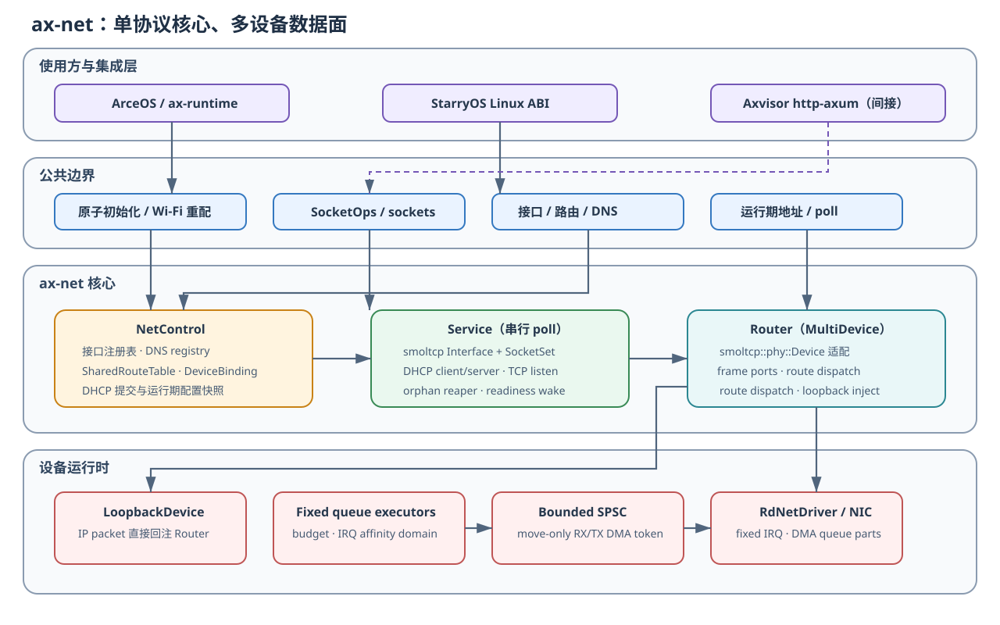
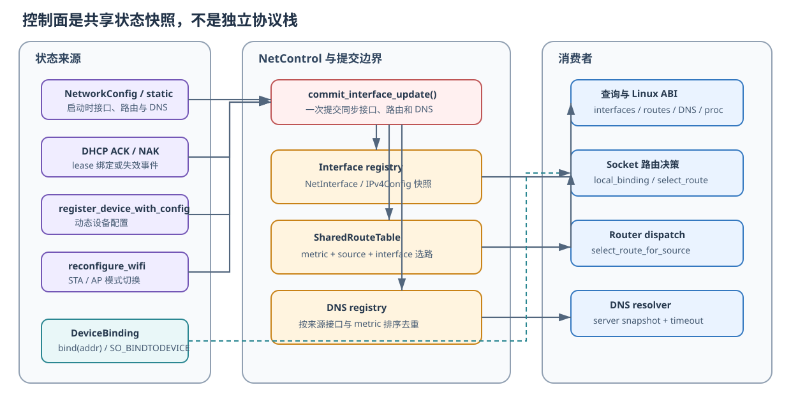
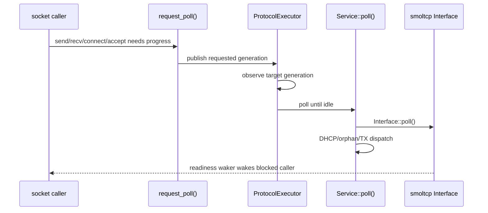
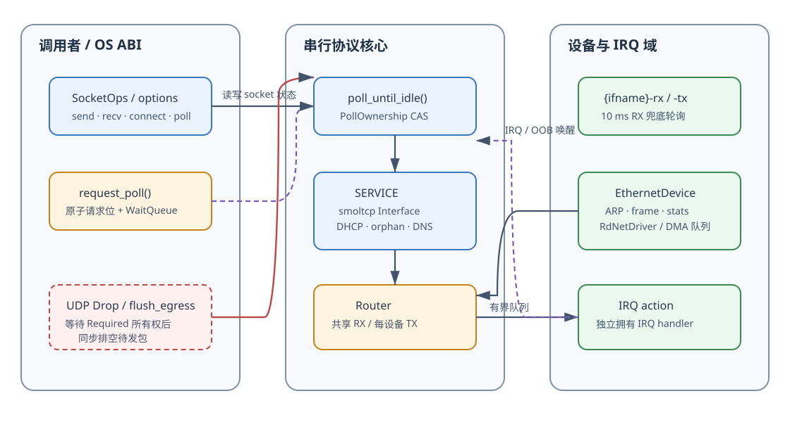
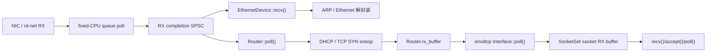
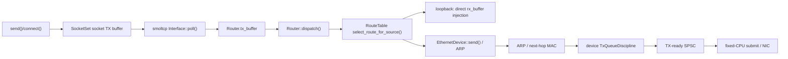

# 总体架构

`ax-net` 是 ArceOS/StarryOS 的网络协议栈 crate。它以 smoltcp 作为单一 TCP/IP 协议核心，在外层补齐多接口、多设备、路由、DNS、DHCP、Linux socket 语义和设备驱动适配。

整体设计可以概括为：

- **单协议栈核心**：所有 IP socket 共享一个 smoltcp `Interface` 和一个全局 `SocketSet`。
- **多设备适配层**：`Router` 对 smoltcp 暴露一个 `phy::Device`，内部聚合 loopback 和多个 Ethernet 设备。
- **控制面与数据面分离**：接口 registry、路由表和 DNS registry 独立于收发路径，可返回只读快照。
- **唯一协议 owner**：普通 socket、设备 RX 与同步 flush 都只发布 generation；固定 CPU 的 `ProtocolExecutor` 是唯一能调用 smoltcp poll 的任务。
- **队列级 IRQ runtime**：每个物理 IRQ affinity domain 绑定一个 CPU；hard callback、queue poll、DMA reclaim/refill 与 rearm 同核执行。
- **兼容 POSIX/Linux socket 语义**：支持 bind/listen/connect/accept、poll readiness、`SO_BINDTODEVICE`、TCP orphan teardown、Unix domain socket 和可选 vsock。

开篇列表概括了单协议核心、多设备适配、控制面分离和统一 socket 语义四个基本约束。核心设计章节将这些约束落到 `Service`、`Router`、`NetControl` 与 `SocketSet` 的具体关系上。

## 1. 核心设计

`ax-net` 的核心选择是 **Single Interface + Router as Device**：不为每个网卡创建独立 smoltcp `Interface`，而是让所有 IP socket 共享一个 smoltcp `Interface` 和一个全局 `SocketSet`，再用 `Router` 作为虚拟 `Device` 聚合 loopback 与多个 Ethernet 设备。

这种结构保留了 socket 语义的一致性：

| 语义 | 单协议栈核心中的处理方式 |
| --- | --- |
| wildcard listen (`0.0.0.0:port`) | 一个 `ListenTable` entry 覆盖所有可用接口 |
| per-address listen/bind | `IpListenEndpoint` + `DeviceBinding` 做地址/接口约束 |
| ephemeral port 分配 | 在全局 TCP/UDP 端口表中仲裁，避免跨接口重复占用 |
| route change / DHCP 更新 | `RouteTable` 和接口地址原子更新，socket 不需要迁移 |
| poll readiness | 全局 `SocketSet` 中统一计算 readiness 并唤醒调用者 |

如果改成每设备一个 `Interface`/`SocketSet`，这些语义需要在多个协议栈实例之间重新仲裁，例如 wildcard listen 要在所有接口创建 listener，accept queue 要跨实例聚合，端口冲突也要引入中心协调。当前模型更符合多宿主主机上的普通 socket 语义。

### 1.1 总体拓扑

总体拓扑强调 `ax-net` 只有一个 smoltcp 协议核心，而 `Router` 在其下聚合 loopback 和多个 Ethernet 设备。真实设备在协议核心下方拆成固定 CPU queue executor 与 frame/token SPSC 边界。

图中最重要的约束是 `Service` 和 protocol executor 各只有一个，而独立 IRQ domain 可以在不同 CPU 上并行 drain。组件分层会在这一拓扑基础上进一步说明每层的源码所有者和对外边界。

### 1.2 组件分层

组件分层按职责而非源码目录划分，目的是让维护者从行为快速定位到稳定边界和详细章节。表中的关键源码是每层的主要入口；跨层修改仍需检查 `Service`、`NetControl` 与 `Router` 之间是否引入新的状态复制或锁反向依赖。

| 层级 | 主要职责 | 关键源码 | 详细文档 |
| --- | --- | --- | --- |
| Public API | 初始化、接口查询、DNS、socket facade、poll trigger | `lib.rs`, `socket.rs`, `options.rs` | [API 参考](api.md) |
| Control plane | 接口 registry、路由决策、DNS 来源、运行期配置提交 | `service.rs`, `config.rs`, `router.rs` | [控制面](control.md) |
| Single protocol core | 一个 smoltcp `Interface`、全局 `SocketSet`、socket backend、DHCP、orphan 回收、poll 调度 | `service.rs`, `wrapper.rs`, `tcp.rs`, `udp.rs`, `listen_table.rs`, `orphan.rs` | 本文、[Socket 系统](sockets.md) |
| Multi-device Router | smoltcp `Device` 适配、TX 路由、RX 汇聚、loopback 快速路径 | `router.rs` | [多设备实现](devices.md) |
| Queue runtime | affinity domain、fixed-CPU executor、SPSC、budget、MISSED、IRQ lifecycle | `queue_runtime/`, `poll_runtime.rs` | [队列级 NAPI](queue-napi-runtime.md) |
| Device layer | Ethernet 封装/解封装、ARP、consumable `rd-net` parts | `device/`, `rd-net`, `rdif-eth` | [多设备实现](devices.md) |
| Locking and concurrency | 单协议 owner、同核 IRQ/queue owner、原子状态与 generation 协调 | `lib.rs`, `queue_runtime/`, `service.rs`, `router.rs` | [锁与并发](locks.md) |
| Configuration | 静态网络配置、DHCP、MTU、缓冲区、feature | `config.rs`, `consts.rs`, `Cargo.toml` | [配置参考](configuration.md) |
| Integration and tests | OS 集成、启动流程、测试范围 | `ax-runtime`, `starry-kernel`, `ax-api` | [集成](integration.md), [测试](testing.md) |

分层表用于定位职责，并不表示调用只能逐层向下：控制面快照会被 ABI 直接查询，设备事件也会跨层唤醒网络任务。下一节按 TCP/IP 语义重新映射同一组对象，用于区分协议职责与工程模块边界。

### 1.3 TCP/IP 分层映射

TCP/IP 分层映射用于区分 smoltcp 已提供的协议能力和 `ax-net` 在外围补充的系统语义。维护 socket 或设备代码时，应先确认变化属于传输、网络还是链路层，避免把 Linux ABI 适配下沉到驱动，或让上层直接依赖 smoltcp 内部类型。

| TCP/IP 层 | ax-net 组件 | 主要职责 |
| --- | --- | --- |
| 应用层 | `SocketOps`, `Socket`, `Configurable` | socket API、options、poll readiness、地址类型统一 |
| 传输层 | smoltcp TCP/UDP/raw socket + `tcp.rs`/`udp.rs`/`raw.rs` | TCP 状态机、UDP datagram、raw packet、端口仲裁和 Linux 语义补齐 |
| 网络层 | smoltcp `Interface`, `Router`, `RouteTable`, DHCP/DNS 辅助 | IP packet 处理、路由、接口地址、DHCP client/server、DNS 查询 |
| 链路层 | `EthernetDevice`, `LoopbackDevice`, `QueueFramePort` | Ethernet frame、ARP、move-only DMA token、poll-group 驱动适配 |

smoltcp 负责 TCP/IP 协议核心；`ax-net` 负责多接口、多设备、设备生命周期、socket 兼容语义和 OS 集成。

## 2. 公共 API

Public API 是上层 OS 模块进入 `ax-net` 的边界，主要定义在 `lib.rs`、`socket.rs` 和 `options.rs`。它不暴露 smoltcp 的内部类型，而是提供面向 ArceOS/StarryOS 的稳定能力：

| API 类别 | 代表接口 | 架构作用 |
| --- | --- | --- |
| 初始化 | `NetworkRuntimeBuilder::build()`、`init_network()`、`init_vsock()` | 原子建立 fixed-CPU queue runtime、唯一 protocol executor、`Service`/`Router`/`NetControl`；vsock 独立初始化 |
| 接口查询 | `interfaces()`、`interface_by_name()`、`ipv4_config()`、`default_routes()`、`arp_entries()`、`net_dev_stats()` | 从控制面或设备层返回只读快照 |
| 运行期地址 | `set_interface_ipv4()`、`remove_interface_ipv4()` | 静态配置或精确删除单个接口 IPv4，并同步 connected route；不配置 gateway |
| DNS | `dns_servers()`、`dns_query()`、`dns_query_timeout()` | 读取 DNS registry，并通过临时 smoltcp DNS socket 查询 |
| Socket facade | `TcpSocket`、`UdpSocket`、`RawSocket`、`UnixSocket`、`VsockSocket` | 为 syscall/POSIX 层提供统一 socket backend |
| Poll 触发 | `request_poll()`、内部 `flush_egress()` | 普通路径发布 generation；同步 flush 等待同一 protocol executor 完成该 generation |
| Socket options | `GetSocketOption`、`SetSocketOption`、`Configurable` | 覆盖通用 `SO_*`、`TCP_*`、`IP_*` 选项 |

Public API 的职责是做边界收敛：上层不需要知道某个 socket 是否由 smoltcp、Unix transport 或 vsock transport 实现，也不需要直接操作 `Service`、`Router` 或 `SocketSet`。具体 API 列表见 [API 参考](api.md)。

## 3. 控制面

控制面负责“网络配置如何被发现、保存、查询和用于决策”。它不直接收发 packet，也不推进 smoltcp poll；数据面只在需要路由、接口地址或 DNS 信息时读取控制面快照。

控制面由 `NetControl` 持有：

- `ControlState`：接口 registry 和 DNS server entries。
- `SharedRouteTable`：路由规则，按最长前缀、metric、插入顺序排序。
- `DeviceBinding`：表达 `SO_BINDTODEVICE` 或本地地址绑定推导出的接口约束。

公共 API 列表说明上层只能通过初始化、快照、socket 和轮询入口使用网络栈，不能直接持有内部状态。控制面初始化注册负责把配置和设备转为这些 API 后续读取的权威快照。

### 3.1 初始化注册

`init_network()` 根据 `NetworkConfig` 和发现到的 Ethernet 设备创建接口 registry：

- `lo` 固定为 `InterfaceId::LOOPBACK`。
- Ethernet 接口从 ifindex 2 开始按发现顺序分配 `InterfaceId`。
- 静态 IPv4、DHCP 开关、metric、DNS server 和默认路由在初始化时写入 `NetControl`。
- `Router` 使用同一份 `SharedRouteTable`，所以控制面的路由更新会直接影响后续 TX dispatch。

初始化列表建立 loopback、设备 ID、静态/DHCP 角色和共享路由表，完成后所有查询都以此为基础。运行期更新只替换受影响接口的状态，不重新分配其他接口身份或重建整个协议核心。

### 3.2 运行期更新

DHCP client 在 `Service::poll()` 中运行。收到 DHCP ACK 后，`Service` 通过 `commit_interface_update()` 一次性提交：

- 接口 IPv4 地址和 flags。
- smoltcp `Interface` 的 IP address 列表。
- 当前接口的 IPv4 路由。
- 当前接口贡献的 DNS server。

这里使用事务式更新，是为了避免外部查询看到“地址已更新但路由/DNS 还没更新”的中间状态。

### 3.3 查询路径

`interfaces()`、`interface_by_name()`、`interface_by_id()`、`ipv4_config()`、`default_routes()` 和 `dns_servers()` 都返回快照。调用方拿到的是当时的只读视图，不持有内部锁，也不应该假设快照会随 DHCP 或接口状态变化自动更新。

### 3.4 路由选择

共享 `RouteTable` 先按目标前缀长度选择最具体规则，再以 metric 和稳定插入顺序决定同级候选。socket 预选路还会应用源地址与 `DeviceBinding`，而 `Router::dispatch()` 使用 smoltcp 已选源地址再次确认实际出口。

1. 最长前缀优先。
2. 同前缀时低 metric 优先。
3. 同前缀同 metric 时保留插入顺序。

普通查询使用 `select_route(dst)`，会过滤未 `UP` 的接口。TX dispatch 使用 `select_route_for_source(dst, src)`，同时匹配 smoltcp 已经选出的源地址，避免多宿主主机从错误接口发出带另一接口源地址的包。

### 3.5 绑定约束

`DeviceBinding` 是控制面接口身份与 socket 语义之间的连接点，可由显式 `SO_BINDTODEVICE` 或具体本地地址推导得到。它只过滤当前 socket 的路由、readiness 和接收候选，不改变全局接口或路由状态。

- `bind(具体本地地址)` 会推导该地址所属接口。
- `SO_BINDTODEVICE` 会显式限制 socket 只使用某个接口。
- wildcard bind 不绑定具体接口，由路由表在发送时选择。

这些约束会影响 socket readiness 注册、端口/listen 语义和路由可用性过滤。更细的规则见[控制面](control.md)。

## 4. 单协议核心

Single protocol core 是 `ax-net` 的协议状态中心，由 `Service`、smoltcp `Interface`、全局 `SocketSetWrapper`、`ListenTable`、DHCP 状态和 TCP orphan 回收共同组成。

### 4.1 Socket 系统

IP socket 共享 smoltcp `SocketSet`，但 Linux/POSIX 语义由 `ax-net` 自己补齐：

- `SocketOps` 统一 TCP/UDP/raw/Unix/vsock backend。
- `GeneralOptions` 维护非阻塞、超时、`SO_REUSEADDR`/`SO_REUSEPORT`、`IP_MTU_DISCOVER`、`SO_BINDTODEVICE` 等通用选项。
- `SocketSetWrapper` 增加 UDP bind 冲突仲裁。
- `TCP_BOUND_PORTS` 和 `ListenTable` 共同维护 TCP bind/listen 端口语义。
- `ListenTable` 在 RX snoop 阶段预创建 TCP socket，支持 accept queue 和 per-address listen。
- `orphan.rs` 在用户关闭仍处于 teardown 的 TCP socket 后继续推进 FIN/TIME_WAIT，避免破坏 TCP 关闭语义。

Unix domain socket 和 vsock 不走 smoltcp IP 层，但通过同一个 public socket facade 暴露给上层。细节见[Socket 系统](sockets.md)。

### 4.2 唯一协议执行器

`ProtocolPollRuntime` 用 `requested/completed` generation 表达工作发布与完成。socket 操作、DNS、queue RX/TX completion 和同步 flush 都只能增加 request generation；固定在选定 CPU 上的 `ProtocolExecutor` 是唯一调用 `Service::poll()` 与 `Interface::poll()` 的任务。`flush_egress()` 等待自己的 generation 完成，调用线程不会临时取得协议所有权。

```mermaid
sequenceDiagram
    participant App as socket caller
    participant Wake as request_poll()
    participant Worker as ProtocolExecutor
    participant Service as Service::poll()
    participant Smol as smoltcp Interface

    App->>Wake: send/recv/connect/accept needs progress
    Wake->>Worker: publish requested generation
    Worker->>Worker: observe target generation
    Worker->>Service: poll until idle
    Service->>Smol: Interface::poll()
    Service->>Service: DHCP/orphan/TX dispatch
    Smol-->>App: readiness waker wakes blocked caller
```

这个模型避免多个线程同时推进协议栈，也保证 TCP 重传、keepalive、DHCP 和设备收包不会依赖某个应用线程继续运行。新 request 与 completion 竞争时，worker 在清除 scheduled 后再次比较 generation，确保至少再执行一轮。

实线表示 packet 或状态访问，虚线表示 generation 请求。同步 flush 只是等待 completion，不再是第二种 poll owner；queue executor 也永远不进入 smoltcp。

## 5. 多设备路由器

`Router` 是 single protocol core 和真实设备之间的适配层。它位于 smoltcp 的 `phy::Device` 边界上，对上提供一个 IP medium 设备，对下管理多个 `DeviceHandle`。

| 子组件 | 职责 |
| --- | --- |
| `Router.rx_buffer` | smoltcp 从这里取 RX IP packet |
| `Router.tx_buffer` | smoltcp 把待发送 IP packet 写到这里 |
| `ProtocolGroupPort` | protocol owner 一侧的 RX/recycle/TX/free SPSC endpoints |
| `QueueGroupExecutor` | owner CPU 一侧的 queue、pending token、budget 与 rearm 状态 |
| `RouteTable` | TX dispatch 的出接口和 next-hop 决策依据 |
| loopback fast path | 回环包直接写入 `rx_buffer`，不经过硬件 queue domain |

`Router::poll()` 从 protocol-owned frame port 推进 RX；`Router::dispatch()` 把 smoltcp TX buffer 按路由送到 loopback 或目标 frame port。真实 DMA token 只在 queue/protocol SPSC 上 move，不进入 Router 的共享扫描队列。更细的 queue、预算和 ARP 行为见[多设备实现](devices.md)。
从驱动 buffer 到用户 buffer、从用户 buffer 到驱动 TX buffer 的完整内存链路见[内存与队列](memory.md)。

## 6. 设备层

设备层通过内部 `Device` trait 统一 loopback、Ethernet 与 `rd-net` driver 的收发、配置、统计和 readiness 能力。链路层细节由 `EthernetDevice` 处理，Router 只观察 IP packet 与接口身份，因此协议核心不会依赖具体硬件类型。

| 设备类型 | 主要源码 | 作用 |
| --- | --- | --- |
| `LoopbackDevice` | `device/loopback.rs` | 零状态占位；真实回环数据路径由 `Router` 快速路径完成 |
| `EthernetDevice` | `device/ethernet.rs` | Ethernet frame 解析/封装、ARP neighbor 表和 pending packet |
| `QueueFramePort` | `queue_runtime/` | 将 poll-group SPSC frame/token 边界适配为 protocol device |
| `VsockDevice` | `device/vsock.rs` | 可选 vsock 设备注册和事件入口 |

这一层是协议栈和硬件驱动框架的能力边界。`ax-net` 不直接依赖 FDT、PCI 或 MMIO，而是消费 `NetDeviceParts`，再通过 `PinnedNetIrqRegistrar` 以 `Fixed(owner_cpu)` 注册 move-only hard endpoint。DMA queue、task rearm 和 control endpoint 保持显式分离。

## 7. 数据面流程

数据面流程由设备 RX 汇聚、smoltcp 协议推进、Router TX 分发和控制协议 snoop 共同组成。下面的 RX/TX 流程图保留 packet 的实际移动顺序，而 DHCP/DNS 小节说明控制协议如何在同一串行 `Service::poll()` 中参与状态更新。

### 7.1 RX 路径

RX 路径从 NIC queue 开始：同核 queue owner 在 IRQ 关闭期间按预算 reclaim，将 move-only completion 推入该 group 的 RX SPSC；唯一 protocol owner 复制出 Ethernet frame、归还 recycle token，再由 `EthernetDevice::recv()` 解封装到 `Router.rx_buffer`。

```mermaid
flowchart LR
    Hw["NIC / rd-net RX"] --> Queue["fixed-CPU queue poll"]
    Queue --> RxQ["RX completion SPSC"]
    RxQ --> Eth["EthernetDevice::recv()"]
    Eth --> Arp["ARP / Ethernet 解封装"]
    RxQ --> RouterPoll["Router::poll()"]
    RouterPoll --> Snoop["DHCP / TCP SYN snoop"]
    Snoop --> RxBuf["Router.rx_buffer"]
    RxBuf --> Smol["smoltcp Interface::poll()"]
    Smol --> Sock["SocketSet socket RX buffer"]
    Sock --> App["recv()/accept()/poll()"]
```

每组 RX reclaim 预算为 64，每 CPU executor round 总预算为 256。RX ring 满时 completion 保留在 owner 的 `pending_rx`，IRQ 保持关闭；protocol owner 释放 ring 空间后精准激活该 group。协议处理发生在 `Service::poll()` 内，再由 smoltcp 交付给 TCP/UDP/raw socket。

### 7.2 TX 路径

TX 路径由 socket buffer 中的待发数据触发，smoltcp 生成 IP packet 后先写入 `Router.tx_buffer`，随后 `Router::dispatch()` 按共享路由表选择 loopback 或具体 frame port。protocol owner 从 TX free ring 取得 token、写入 frame 并 move 到 TX-ready ring；目标 queue owner 才能提交硬件并 reclaim completion。

```mermaid
flowchart LR
    App["send()/connect()"] --> Sock["SocketSet socket TX buffer"]
    Sock --> Smol["smoltcp Interface::poll()"]
    Smol --> TxBuf["Router.tx_buffer"]
    TxBuf --> Dispatch["Router::dispatch()"]
    Dispatch --> Route["RouteTable select_route_for_source()"]
    Route --> Loop["loopback: direct rx_buffer injection"]
    Route --> Eth["EthernetDevice::send() / ARP"]
    Eth --> Arp["ARP / next-hop MAC"]
    Arp --> Qdisc["device TxQueueDiscipline"]
    Qdisc --> TxQ["TX-ready SPSC"]
    TxQ --> Hw["fixed-CPU submit / NIC"]
```

每个 `QueueFramePort` 直接拥有一个设备级 discipline。`NoQueue` 在 TX token 不可用时
返回 `Again`；`Fifo { max_frames }` 按序保留 frame，并在 TX completion 激活下一轮
protocol poll 后先 flush。FIFO 从零容量开始按需分配，limit 不与 hardware ring 或
DMA token 数量合并，也不扩展为全局或 per-hardware-queue qdisc。

普通 Ethernet 发送由 `EthernetDevice` 完成 ARP 和 frame 封装，再通过有界 SPSC 交给 queue owner。submit 失败的 typed error 必须归还原 token；TX completion 也通过 free ring 归还。loopback 不走外部 queue，仍可在同一个 protocol poll 周期内继续推进。

### 7.3 控制协议

DHCP client/server 都位于 `Service::poll()` 调度内，但不依赖 smoltcp 的普通 socket API：

- DHCP client 由 per-interface `DhcpState` 维护 Discover/Request/Bound 状态，收到 ACK 后通过 `commit_interface_update()` 更新地址、路由和 DNS。
- DHCP server 位于 `dhcp_server.rs`，面向 SoftAP 场景，手工解析/封装 DHCP/UDP/IPv4 包，并通过 `Router::send_on_device()` 发包。
- DNS 查询使用 smoltcp `dns::Socket` 临时加入全局 `SocketSet`，查询完成后由 guard 自动移除。

这些控制协议共享 Router ingress 身份与网络轮询所有权，但分别维护独立状态和超时。扩展协议能力时应保持控制面提交与普通 socket 数据路径解耦，并为新状态增加确定的生命周期验证。
