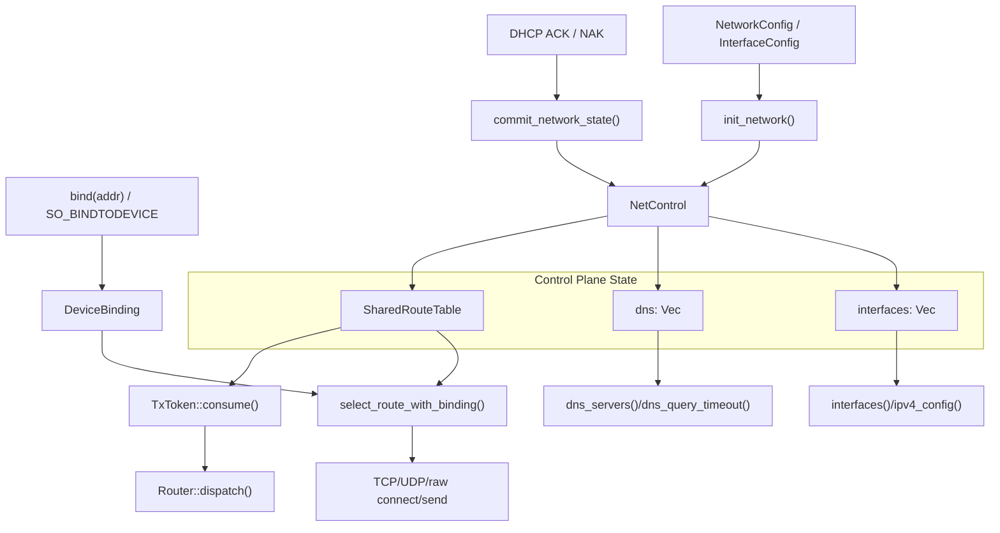
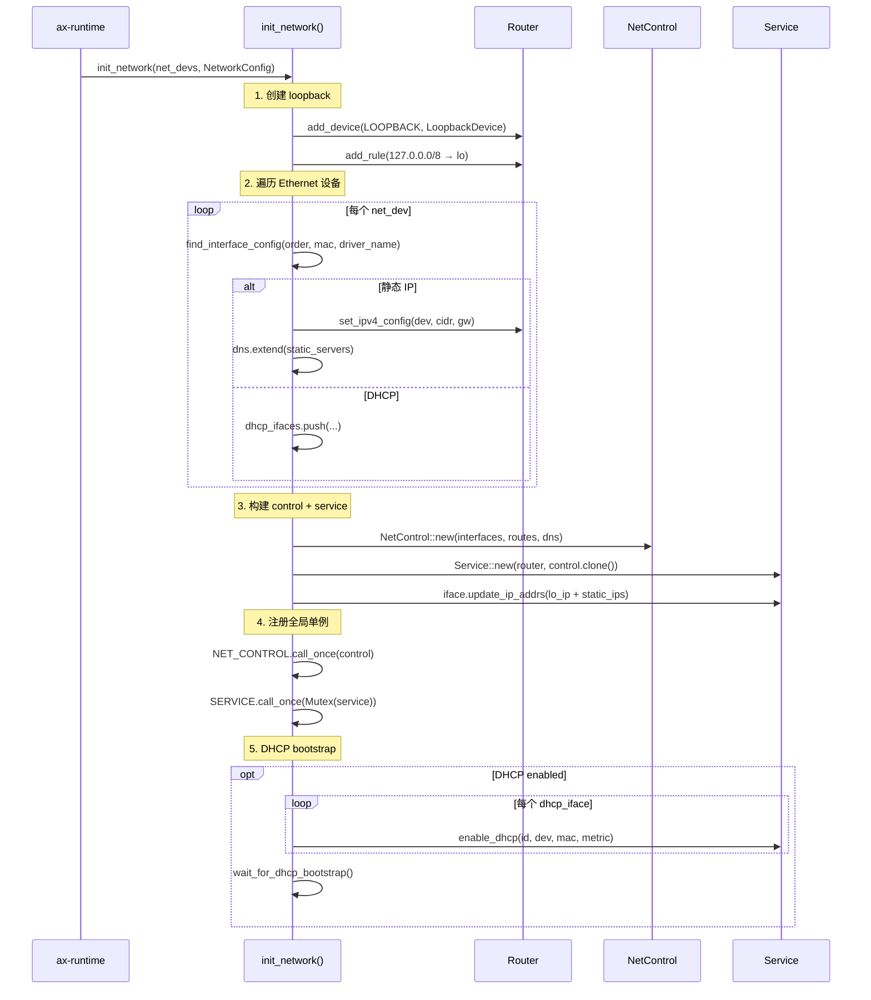
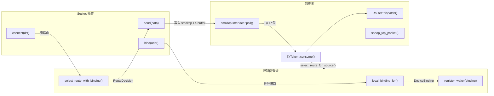

# 控制面

控制面维护 `ax-net` 的接口、地址、路由、DNS 和 socket 设备绑定状态，为协议核心和系统 ABI 提供查询与决策入口。对应到 Linux，相关职责分布在 netdevice、地址管理、FIB/route table、resolver 配置和 socket bind 状态中；对应到 lwIP/smoltcp，则是 netif 配置、地址管理和路由选择逻辑。

核心源码：

| 源码 | 职责 |
| --- | --- |
| [config.rs](net/ax-net/src/config.rs) | 控制面公开数据模型：`InterfaceId`、`InterfaceInfo`、`NetworkConfig`、`RouteInfo`、`DeviceBinding` |
| [service.rs](net/ax-net/src/service.rs) | `NetControl`、接口 registry、DNS registry、DHCP commit、route 查询入口 |
| [router.rs](net/ax-net/src/router.rs) | `RouteTable`、`Rule`、`RouteDecision`、TX token route lookup 和 dispatch |
| [general.rs](net/ax-net/src/general.rs) | socket 通用选项中的 `SO_BINDTODEVICE` / `DeviceBinding` 存取 |
| [tcp.rs](net/ax-net/src/tcp.rs)、[udp.rs](net/ax-net/src/udp.rs)、[raw.rs](net/ax-net/src/raw.rs) | connect/send/bind 时使用控制面做地址、路由和设备绑定决策 |

## 设计边界

控制面是 `NetControl` 持有的只读状态层，通过 `spin::RwLock` 保护接口 registry、DNS registry 和共享路由表。它的查询接口（`interfaces()`、`select_route()`、`dns_servers()` 等）只持读锁、返回快照，不进入 `Service` 或 `SocketSet` 锁，也不接触设备收发队列。协议状态机推进、包收发和 socket payload 读写全部由数据面的 `Service::poll()` 和设备 worker 在独立的锁层级中完成。



控制面状态的写入路径只有两个：`init_network()` 构造初始状态，`commit_interface_update()` 在 DHCP ACK/NAK 后原子替换某接口的地址、DNS 和路由规则。两条路径都在 `Service` 锁内执行，确保 smoltcp IP address list 与控制面状态一致更新。

`SharedRouteTable`（`Arc<RwLock<RouteTable>>`）同时被 `NetControl`（查询侧）和 `Router`（TX token 侧）持有，两者指向同一实例。控制面通过 `select_route_with_binding()` 提供 socket 级别的路由查询；`TxToken::consume()` 在 smoltcp 生成完整 IP packet 后通过 `select_route_for_source()` 做实际发包时的出接口选择，并把结果保存在 `RoutedTxPacket` 中。两者共享同一套路由规则，但查询时机和过滤条件不同。

## 初始化流程

`init_network()` 是控制面状态的唯一构造入口。它按固定顺序构建 loopback、Ethernet 接口、静态地址、DNS registry 和共享路由表，然后把所有状态提交给 `NetControl` 和 `Service`。



关键点：

- `routes` 是 `Arc<RwLock<RouteTable>>`，`Router` 和 `NetControl` 共享同一实例。
- `NetControl` 先于 `SERVICE` 初始化，确保 `get_control()` 在 poll worker 启动前可用。
- DHCP bootstrap 只要求任一 DHCP 接口配置成功即返回，避免断网卡阻塞启动。

## 数据模型

控制面状态分为三类：对外稳定的接口标识、可快照查询的接口/DNS 状态，以及被 Router 和 `NetControl` 共享的路由表。接口 ID 用于跨模块引用同一接口，接口快照用于系统 ABI 和诊断接口，`NetControl` 负责把这些状态组织成可查询的控制面视图。

### 接口标识

`InterfaceId(u32)` 是 `ax-net` 内部和对外统一的接口标识，也是 StarryOS Linux ABI 的 ifindex 来源。

```rust
// config.rs
#[derive(Debug, Clone, Copy, Eq, PartialEq, Ord, PartialOrd, Hash)]
pub struct InterfaceId(u32);

impl InterfaceId {
    pub const LOOPBACK: Self = Self(1);

    pub const fn new(raw: u32) -> Self {
        Self(raw)
    }

    pub const fn get(self) -> u32 {
        self.0
    }

    pub const fn to_linux_ifindex(self) -> i32 {
        self.0 as i32
    }

    pub const fn from_linux_ifindex(ifindex: i32) -> Option<Self> {
        if ifindex > 0 {
            Some(Self(ifindex as u32))
        } else {
            None
        }
    }
}
```

约定：

- `InterfaceId::LOOPBACK == 1`，固定对应 `lo`。
- Ethernet 接口从 `2` 开始分配，默认命名为 `eth0`、`eth1`。
- `InterfaceId(0)` 是内部 TX 占位符，不对外暴露。
- StarryOS 的 `SIOCGIFINDEX`、AF_PACKET `sockaddr_ll.sll_ifindex` 都应通过 `InterfaceId` 映射。

### 接口快照

对外接口信息使用 `InterfaceInfo`，它是快照，不是内部对象引用：

```rust
// config.rs
pub struct InterfaceInfo {
    pub id: InterfaceId,
    pub name: String,
    pub kind: InterfaceKind,
    pub mac: Option<EthernetAddress>,
    pub ipv4: Option<Ipv4InterfaceConfig>,
    pub mtu: usize,
    pub flags: InterfaceFlags,
    pub metric: u32,
}
```

内部状态是 `NetInterface`：

```rust
// service.rs
pub(crate) struct NetInterface {
    pub id: InterfaceId,
    pub name: String,
    pub kind: InterfaceKind,
    pub mac: Option<EthernetAddress>,
    pub ipv4: Option<Ipv4Cidr>,
    pub gateway: Option<Ipv4Address>,
    pub mtu: usize,
    pub metric: u32,
    pub flags: InterfaceFlags,
}

impl NetInterface {
    fn to_info(&self) -> InterfaceInfo {
        InterfaceInfo {
            id: self.id,
            name: self.name.clone(),
            kind: self.kind,
            mac: self.mac,
            ipv4: self.ipv4.map(|address| Ipv4InterfaceConfig {
                address,
                gateway: self.gateway,
            }),
            mtu: self.mtu,
            flags: self.flags,
            metric: self.metric,
        }
    }
}
```

这里特意返回快照，是为了让查询方不持有内部锁，也不依赖接口状态长期不变。DHCP 更新、动态设备注册或后续 link state 更新都可能改变快照内容。

### NetControl

`NetControl` 是控制面的核心对象。它在 `init_network()` 中创建，并早于 `SERVICE` 注册到全局 `NET_CONTROL`。

```rust
// service.rs
struct ControlState {
    interfaces: Vec<NetInterface>,
    dns: Vec<DnsServerEntry>,
}

pub struct NetControl {
    state: RwLock<ControlState>,
    pub(crate) routes: SharedRouteTable,
}

impl NetControl {
    pub(crate) fn new(
        interfaces: Vec<NetInterface>,
        routes: SharedRouteTable,
        dns: Vec<DnsServerEntry>,
    ) -> Self {
        Self {
            state: RwLock::new(ControlState { interfaces, dns }),
            routes,
        }
    }
}
```

初始化时，`lib.rs` 构造 loopback、Ethernet 接口、静态 DNS 和共享路由表，然后把同一份 `routes` 同时交给 `Router` 和 `NetControl`：

```rust
// lib.rs, 简化示意
let routes: SharedRouteTable = Arc::new(spin::RwLock::new(RouteTable::new()));
let mut router = Router::new(routes.clone());

let lo_id = InterfaceId::LOOPBACK;
let lo_dev = router.add_device(lo_id, Box::new(LoopbackDevice::new()));
router.add_rule(Rule::new(
    lo_ip.into(),
    None,
    lo_dev,
    lo_id,
    lo_ip.address().into(),
    0,
));

// 遍历 net_devs，为每个 Ethernet 分配 InterfaceId、name、metric、
// 静态地址或 DHCP 状态，并写入 interfaces / routes / dns。

let control = Arc::new(NetControl::new(interfaces, routes, dns));
let mut service = Service::new(router, control.clone());

NET_CONTROL.call_once(|| control);
SERVICE.call_once(|| Mutex::new(service));
```

这个共享关系很关键：控制面查询看到的是 `NetControl.routes`，数据面 TX route lookup 通过 `Router.table` 完成，两者实际指向同一个 `SharedRouteTable`。

### DNS 注册表

DNS server 不是简单地址列表，而是带来源和 metric 的 registry：

```rust
pub enum DnsSource { Dhcp, Static, Fallback }

pub(crate) struct DnsServerEntry {
    pub server: Ipv4Address,
    pub interface_id: InterfaceId,
    pub metric: u32,
    pub source: DnsSource,
}
```

| 来源 | 创建时机 | metric |
| --- | --- | --- |
| DHCP | DHCP ACK 后 `commit_interface_update()` | 对应接口 metric |
| Static | `init_network()` 从 `InterfaceConfig::dns_servers` | 对应接口 metric |
| Fallback | `init_network()` 从 `NetworkConfig::default_dns_servers` | `u32::MAX` |

`dns_servers()` 排序去重后返回纯地址列表。`dns_query_timeout()` 还会通过 route decision 过滤不可达 server。

## 查询与决策

查询入口只返回快照或 route decision，不把内部锁、Router 设备索引以外的可变对象暴露给调用方。公共 API 通过 `lib.rs` facade 进入 `NetControl`，socket 实现则直接使用 crate 内部查询函数完成 bind/connect/send 前的决策。

### 接口查询

只读查询都走 `NetControl` 的读锁：

```rust
pub fn interfaces(&self) -> Vec<InterfaceInfo> {
    let state = self.state.read();
    state.interfaces.iter().map(NetInterface::to_info).collect()
}

pub fn interface_by_name(&self, name: &str) -> Option<InterfaceInfo> {
    let state = self.state.read();
    state
        .interfaces
        .iter()
        .find(|interface| interface.name == name)
        .map(NetInterface::to_info)
}

pub fn interface_by_id(&self, id: InterfaceId) -> Option<InterfaceInfo> {
    let state = self.state.read();
    state
        .interfaces
        .iter()
        .find(|interface| interface.id == id)
        .map(NetInterface::to_info)
}

pub fn ipv4_config(&self, name: &str) -> Option<Ipv4InterfaceConfig> {
    let state = self.state.read();
    state
        .interfaces
        .iter()
        .find(|interface| interface.name == name)
        .and_then(|interface| interface.ipv4.map(|address| (interface, address)))
        .map(|(interface, address)| Ipv4InterfaceConfig {
            address,
            gateway: interface.gateway,
        })
}
```

public facade 直接转发到 `NetControl`：

```rust
// lib.rs
pub fn interfaces() -> Vec<InterfaceInfo> {
    get_control().interfaces()
}

pub fn interface_by_name(name: &str) -> Option<InterfaceInfo> {
    get_control().interface_by_name(name)
}

pub fn interface_by_id(id: InterfaceId) -> Option<InterfaceInfo> {
    get_control().interface_by_id(id)
}

pub fn ipv4_config(name: &str) -> Option<Ipv4InterfaceConfig> {
    get_control().ipv4_config(name)
}
```

### RouteTable

`RouteTable` 存在于 [router.rs](net/ax-net/src/router.rs)，被 `Arc<RwLock<_>>` 包装为 `SharedRouteTable`。

```rust
pub type SharedRouteTable = Arc<RwLock<RouteTable>>;

#[derive(Debug)]
pub struct Rule {
    pub filter: IpCidr,
    pub via: Option<IpAddress>,
    pub dev: usize,
    pub interface_id: InterfaceId,
    pub src: IpAddress,
    pub metric: u32,
    pub order: u64,
}

pub struct RouteTable {
    rules: Vec<Rule>,
    next_order: u64,
}
```

每条规则同时保存两类索引：

- `dev`：`Router.devices` 的内部索引，用于 TX dispatch 找到真实设备。
- `interface_id`：对外稳定接口 ID，用于查询、绑定和 Linux ifindex 映射。

这两个值不能混用。`dev` 是 Router 内部位置，`interface_id` 是公共语义。

#### 排序策略

路由规则在 add/replace 后排序：

```rust
fn sort_rules(&mut self) {
    self.rules.sort_by(|a, b| {
        b.filter
            .prefix_len()
            .cmp(&a.filter.prefix_len())
            .then_with(|| a.metric.cmp(&b.metric))
            .then_with(|| a.order.cmp(&b.order))
    });
}
```

优先级：

1. 最长前缀匹配。
2. 低 metric 优先。
3. 插入顺序稳定。

#### 查询策略

普通路由查询使用 `select_route_if()`：

```rust
pub fn select_route_if(
    &self,
    dst: &IpAddress,
    mut is_usable: impl FnMut(InterfaceId) -> bool,
) -> Option<RouteDecision> {
    self.rules
        .iter()
        .find(|rule| rule.filter.contains_addr(dst) && is_usable(rule.interface_id))
        .map(|rule| RouteDecision {
            dev: rule.dev,
            interface_id: rule.interface_id,
            source: rule.src,
            next_hop: rule.via.unwrap_or(*dst),
            metric: rule.metric,
        })
}
```

`NetControl::select_route_with_binding()` 在这个闭包里应用两个过滤条件：

- 如果 socket 绑定了接口，只允许该接口。
- 只允许 `InterfaceFlags::UP` 的接口。

```rust
pub fn select_route_with_binding(
    &self,
    dst_addr: &IpAddress,
    binding: DeviceBinding,
) -> AxResult<RouteDecision> {
    let state = self.state.read();
    let routes = self.routes.read();
    let route = routes
        .select_route_if(dst_addr, |interface_id| {
            if binding
                .bound_if
                .is_some_and(|bound_if| bound_if != interface_id)
            {
                return false;
            }
            state
                .interfaces
                .iter()
                .find(|interface| interface.id == interface_id)
                .is_some_and(|interface| interface.flags.contains(InterfaceFlags::UP))
        })
        .ok_or_else(|| {
            ax_err_type!(
                NoSuchDeviceOrAddress,
                format!("no route to destination {dst_addr}")
            )
        })?;
    Ok(route)
}
```

TX packet 生成路径使用 `select_route_for_source()`：

```rust
pub fn select_route_for_source(
    &self,
    dst: &IpAddress,
    source: &IpAddress,
) -> Option<RouteDecision> {
    self.rules
        .iter()
        .find(|rule| rule.filter.contains_addr(dst) && &rule.src == source)
        .map(|rule| RouteDecision {
            dev: rule.dev,
            interface_id: rule.interface_id,
            source: rule.src,
            next_hop: rule.via.unwrap_or(*dst),
            metric: rule.metric,
        })
}
```

这个函数服务于多宿主场景：smoltcp 已经生成 IP 包并选择了源地址，Router 不能只按目的地址选路由，否则可能从 `eth1` 发出源地址属于 `eth0` 的包。

## 状态更新流程

动态状态更新主要来自 DHCP 和运行期设备注册。更新必须同时覆盖 smoltcp `Interface` 地址、控制面接口快照、DNS registry 和 route table，避免外部查询和数据面发送路径看到不一致的网络状态。

### 路由规则更新

静态接口初始化或 DHCP ACK 后都会生成一组 IPv4 规则：

```rust
// router.rs
pub(crate) fn ipv4_rules(
    &mut self,
    dev: usize,
    interface_id: InterfaceId,
    metric: u32,
    address: Option<Ipv4Cidr>,
    gateway: Option<IpAddress>,
) -> Vec<Rule> {
    self.devices[dev].inner.lock().set_ipv4_addr(address);

    let mut rules = Vec::new();
    if let Some(address) = address {
        rules.push(Rule::new(
            address.into(),
            None,
            dev,
            interface_id,
            address.address().into(),
            metric,
        ));
        if let Some(gateway) = gateway {
            rules.push(Rule::new(
                Ipv4Cidr::new(Ipv4Address::UNSPECIFIED, 0).into(),
                Some(gateway),
                dev,
                interface_id,
                address.address().into(),
                metric,
            ));
        }
    }
    rules
}
```

替换某接口 IPv4 规则时使用 `replace_ipv4_rules_for_interface()`：

```rust
pub fn replace_ipv4_rules_for_interface(
    &mut self,
    interface_id: InterfaceId,
    mut new_rules: Vec<Rule>,
) {
    self.remove_ipv4_rules_for_interface(interface_id);
    for rule in &mut new_rules {
        rule.order = self.next_order;
        self.next_order = self.next_order.saturating_add(1);
    }
    self.rules.extend(new_rules);
    self.sort_rules();
}
```

这保证 DHCP 更新不会留下旧地址或旧默认路由。

### DHCP 事务更新

DHCP 更新跨越三类状态：

- smoltcp `Interface` 的 IP address list。
- `NetControl.state.interfaces` 中的 IPv4/gateway。
- DNS entries 和 route table。

更新入口是 `Service::handle_dhcp_event()`：

```rust
fn handle_dhcp_event(&mut self, event: DhcpEvent) {
    let update = match event {
        DhcpEvent::Configured {
            interface_id,
            dev,
            metric,
            address,
            router,
            dns_servers,
            ..
        } => {
            let old_ipv4 = {
                let Some(state) = self
                    .dhcp
                    .iter_mut()
                    .find(|state| state.interface_id == interface_id)
                else {
                    return;
                };
                let old_ipv4 = state.address;
                state.address = Some(address);
                state.dns_servers = dns_servers.clone();
                old_ipv4
            };
            NetworkStateUpdate {
                interface_id,
                dev,
                metric,
                old_ipv4,
                ipv4: Some(address),
                gateway: router,
                dns_source: DnsSource::Dhcp,
                dns_servers,
            }
        }
        DhcpEvent::Deconfigured { /* 同接口清空 DHCP 状态 */ } => {
            /* 生成 ipv4=None / gateway=None / dns_servers=[] 的 update */
        }
    };
    self.commit_network_state(update);
}
```

真正提交在 `commit_network_state()`：

```rust
fn commit_network_state(&mut self, update: NetworkStateUpdate) {
    Self::set_interface_ipv4(&mut self.iface, update.old_ipv4, update.ipv4);
    let routes = self.router.ipv4_rules(
        update.dev,
        update.interface_id,
        update.metric,
        update.ipv4,
        update.gateway.map(IpAddress::Ipv4),
    );
    self.control.commit_interface_update(&update, routes);
}
```

`NetControl::commit_interface_update()` 在一个控制面写锁内替换接口状态、DNS 和路由：

```rust
fn commit_interface_update(
    &self,
    update: &NetworkStateUpdate,
    routes: Vec<crate::router::Rule>,
) {
    let mut state = self.state.write();
    if let Some(interface) = state
        .interfaces
        .iter_mut()
        .find(|interface| interface.id == update.interface_id)
    {
        interface.ipv4 = update.ipv4;
        interface.gateway = update.gateway;
    }
    state.dns.retain(|entry| {
        entry.interface_id != update.interface_id || entry.source != update.dns_source
    });
    state.dns.extend(update.dns_servers.iter().copied().map(|server| {
        DnsServerEntry {
            server,
            interface_id: update.interface_id,
            metric: update.metric,
            source: update.dns_source,
        }
    }));
    self.routes
        .write()
        .replace_ipv4_rules_for_interface(update.interface_id, routes);
}
```

这个过程保证外部查询不会看到“接口地址已更新但 DNS/路由仍旧”的半更新状态。需要注意的是，smoltcp IP address list 的更新发生在 `Service` 内，因为它属于协议核心；`NetControl` 只维护对外查询和 route decision 所需状态。

## Socket 绑定

socket 层通过控制面把本地地址、`SO_BINDTODEVICE` 和 DNS server 可达性统一到接口语义上。绑定结果不直接保存设备索引，而是保存稳定的 `InterfaceId`，后续 route lookup 和 waker 注册再根据它过滤可用接口。

### 本地地址推导

`bind(具体本地地址)` 会推导接口绑定。核心函数是 `local_binding_for()`：

```rust
pub fn local_binding_for(&self, endpoint: &IpListenEndpoint) -> AxResult<DeviceBinding> {
    match endpoint.addr {
        Some(addr) => {
            let state = self.state.read();
            let bound_if = state.interfaces.iter().find_map(|interface| {
                (interface
                    .ipv4
                    .is_some_and(|ipv4| IpAddress::Ipv4(ipv4.address()) == addr))
                .then_some(interface.id)
            });
            bound_if
                .map(|interface_id| DeviceBinding {
                    bound_if: Some(interface_id),
                })
                .ok_or_else(|| {
                    ax_err_type!(
                        NoSuchDeviceOrAddress,
                        format!("local address {addr} is not assigned to any interface")
                    )
                })
        }
        None => Ok(DeviceBinding::default()),
    }
}
```

语义：

- 绑定具体地址：必须是某个接口已经拥有的 IPv4 地址，并推导出 `DeviceBinding { bound_if: Some(id) }`。
- wildcard bind：返回默认绑定，不限制接口。
- 该绑定会影响后续 route lookup 和 waker 注册。

TCP/UDP bind 会使用这个结果。例如 UDP bind 的设计是：

```rust
let endpoint = IpListenEndpoint {
    addr: if local_addr.ip().is_unspecified() {
        None
    } else {
        Some(local_addr.ip().into())
    },
    port: local_addr.port(),
};

let binding = get_control().local_binding_for(&endpoint)?;
if binding.bound_if.is_some() {
    self.general.set_device_binding(binding);
}
```

### DeviceBinding

`DeviceBinding` 对应 Linux `SO_BINDTODEVICE` 和本地地址推导出的接口约束：

```rust
// config.rs
#[derive(Debug, Clone, Copy, Default, Eq, PartialEq)]
pub struct DeviceBinding {
    pub bound_if: Option<InterfaceId>,
}
```

`GeneralOptions` 用 `AtomicU32` 保存它：

```rust
pub(crate) struct GeneralOptions {
    bound_if: AtomicU32,
    // ...
}

pub fn set_device_binding(&self, binding: DeviceBinding) {
    self.bound_if.store(
        binding.bound_if.map_or(0, InterfaceId::get),
        Ordering::Release,
    );
}

pub fn device_binding(&self) -> DeviceBinding {
    let raw = self.bound_if.load(Ordering::Acquire);
    DeviceBinding {
        bound_if: (raw != 0).then_some(InterfaceId::new(raw)),
    }
}
```

影响范围：

- `select_route_with_binding()` 只允许匹配接口的 route。
- `register_waker(binding, waker)` 只向匹配接口的设备注册 waker。
- `SO_BINDTODEVICE` 设置后，socket 不应被无关设备 readiness 唤醒。

## 运行期设备注册

启动时注册的 NIC 和运行期新增的静态设备都通过同一套接口 registry、smoltcp address list 和 route table 更新路径进入协议栈。控制面因此不是只读配置表，而是网络状态变化的提交点。


控制面也服务于运行时静态设备注册，例如 Wi-Fi SoftAP：

```rust
pub fn register_device_with_config(dev: Box<dyn EthernetDriver>, config: NetConfig) {
    let mac = EthernetAddress(dev.mac_address());
    let server_ip = Ipv4Address::new(config.ip[0], config.ip[1], config.ip[2], config.ip[3]);
    let cidr = Ipv4Cidr::new(server_ip, config.prefix_len);
    let eth_dev = if config.dedicated_poll {
        EthernetDevice::new_oob_rx(config.name.clone(), dev, Some(cidr))
    } else {
        EthernetDevice::new(config.name.clone(), dev, Some(cidr))
    };
    let dev_idx = get_service().register_static_device(config.name.clone(), eth_dev, mac, cidr);
    // 可选启用 DHCP server...
    request_poll();
}
```

`Service::register_static_device()` 会：

```rust
pub fn register_static_device(
    &mut self,
    name: String,
    dev: EthernetDevice,
    mac: EthernetAddress,
    cidr: Ipv4Cidr,
) -> usize {
    let interface_id = self.control.allocate_interface_id();
    let metric = 100;
    let dev = self.router.add_device(interface_id, Box::new(dev));
    let routes = self
        .router
        .ipv4_rules(dev, interface_id, metric, Some(cidr), None);
    Self::set_interface_ipv4(&mut self.iface, None, Some(cidr));
    self.control.add_interface(/* NetInterface */, routes);
    self.router.start_device_workers(dev);
    dev
}
```

这条路径说明控制面不是仅启动时静态表；它也能接收运行期新增接口，并把新接口加入 registry、route table 和 smoltcp address list。

## 并发与锁

控制面锁只保护接口、DNS 和路由状态，不保护设备收发队列，也不推进 smoltcp poll。数据面 worker、socket 热路径和 DHCP commit 通过固定锁顺序进入控制面，避免设备锁与协议核心锁互相反向嵌套。

### 锁边界

控制面锁边界应遵循：

- 只读查询只持 `NetControl.state.read()`，返回快照后释放锁。
- 路由查询同时读取 `state` 和 `routes`，不进入设备锁。
- DHCP commit 在 `Service` 锁内更新 smoltcp IP list，然后进入 `NetControl` 写锁提交接口/DNS/route 状态。
- 设备 worker 持有设备锁时不得反向进入 `Service` 或 `SocketSet`。

典型路径可以分开理解：

```text
poll path:
  SERVICE -> SOCKET_SET -> smoltcp Interface/SocketSet

TCP bind/listen path:
  SOCKET_SET -> TCP_BOUND_PORTS -> LISTEN_TABLE

DHCP commit path:
  SERVICE -> SOCKET_SET -> NET_CONTROL.state -> RouteTable

control query path:
  NET_CONTROL.state -> RouteTable
```

控制面查询路径通常不持有 `SERVICE`，因此 `interfaces()`、`default_routes()`、`dns_servers()` 不会阻塞在 smoltcp poll 上；运行期 commit 则由 `Service` 协调，确保 smoltcp 地址和控制面状态一致。

## 与数据面的交互

控制面状态不是被动配置表——它在 socket 操作的每个关键路径上被主动查询。以下是 TCP/UDP socket 典型生命周期中控制面的参与点：



- **bind**：`local_binding_for()` 从监听地址推导出 `DeviceBinding`，写入 `GeneralOptions::bound_if`。
- **connect**：`select_route_with_binding()` 按目的地址 + 绑定约束选出接口和源地址，smoltcp 用此源地址构造 SYN。
- **send**：socket 只写入 smoltcp TX buffer 并 `request_poll()`，真正的出接口选择在 `TxToken::consume()` 中由 `select_route_for_source()` 完成，`Router::dispatch()` 只按 `RoutedTxPacket` 中保存的 route 分发。
- **poll**：smoltcp 消费 RX 包后改变 socket readiness，通过 `register_waker()` 注册的 waker 唤醒等待的 socket 操作。

这种设计确保控制面查询与数据面发送在时间上解耦：bind/connect 时做一次路由决策确定源地址，实际发包时再由 `TxToken::consume()` 根据完整 IP 包头选择出接口。
