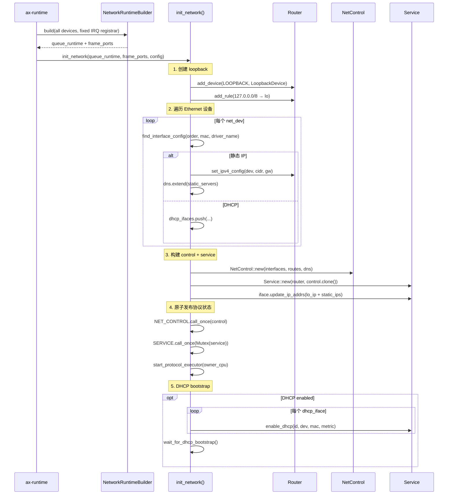
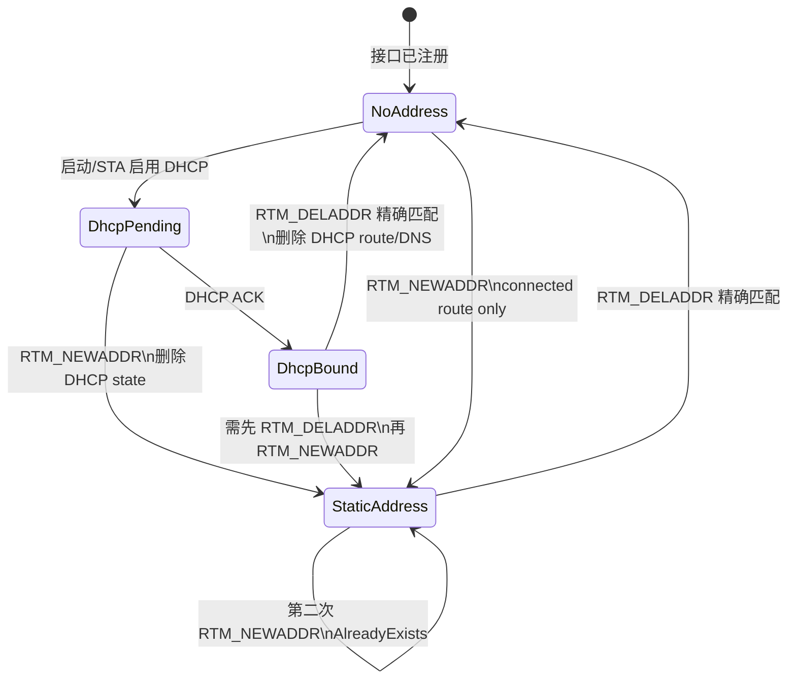
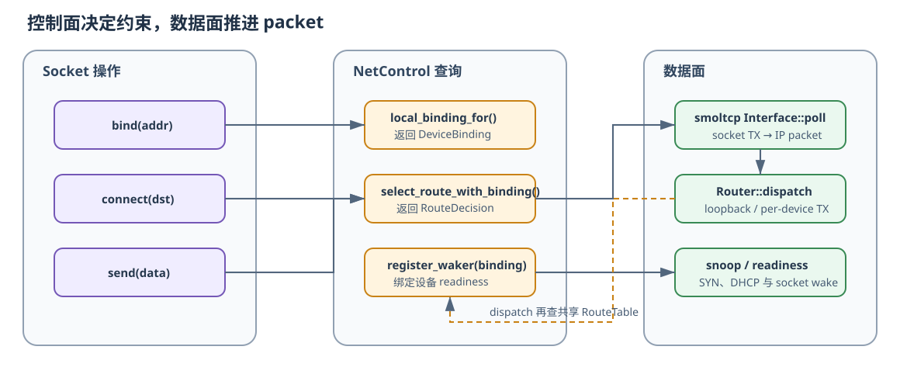

# 控制面

控制面维护 `ax-net` 的接口、地址、路由、DNS 和 socket 设备绑定状态，为协议核心和系统 ABI 提供查询与决策入口。对应到 Linux，相关职责分布在 netdevice、地址管理、FIB/route table、resolver 配置和 socket bind 状态中；对应到 lwIP/smoltcp，则是 netif 配置、地址管理和路由选择逻辑。

核心源码：

| 源码 | 职责 |
| --- | --- |
| `config.rs` | 控制面公开数据模型：`InterfaceId`、`InterfaceInfo`、`NetworkConfig`、`RouteInfo`、`DeviceBinding` |
| `service.rs` | `NetControl`、接口 registry、DNS registry、DHCP commit、route 查询入口 |
| `router.rs` | `RouteTable`、`Rule`、`RouteDecision`、TX dispatch route lookup |
| `general.rs` | socket 通用选项中的 `SO_BINDTODEVICE` / `DeviceBinding` 存取 |
| `tcp.rs`、`udp.rs`、`raw.rs` | connect/send/bind 时使用控制面做地址、路由和设备绑定决策 |

源码表将配置数据、控制面状态、路由规则和 socket 绑定分别定位到其维护模块。设计边界基于这些所有者区分只读快照、原子提交和实际 packet 处理，避免控制面膨胀为第二个数据面。

## 1. 设计边界

控制面是 `NetControl` 持有的只读状态层，通过 `ax_sync::SpinRwLock` 保护接口 registry、DNS registry 和共享路由表。它的查询接口（`interfaces()`、`select_route()`、`dns_servers()` 等）只持读锁、返回快照，不进入 `Service` 或 `SocketSet` 锁，也不接触设备收发队列。协议状态机、路由和 socket payload 只由唯一 protocol executor 推进；IRQ、DMA 与硬件 queue 只由对应 owner CPU 的 queue executor 推进。

### 1.1 无线控制事务

`WIFI_INTERFACES` 只保存接口名、设备序号、MAC 和 `WifiRuntimeHandle`。真正的 owned `WifiControl` 被固定 CPU 的 queue executor 独占。StarryOS wireless-extensions ioctl 调用 `reconfigure_wifi()` 时只提交一个有界 `WifiTransaction` 并等待结果；executor quiesce 所属 group、等待 `POLLING` 退出、在 owner CPU 执行 SDIO/MMIO 控制操作、重建 queue 状态并 rearm。任意调用 CPU 都不能直接取得控制 endpoint。

### 1.2 状态来源与消费者

控制面图把写入来源、原子提交边界和读取方放在同一视图中，强调 `NetControl` 保存的是协议核心与系统 ABI 共享的状态快照。`DeviceBinding` 不写入全局路由表，而是在 socket 查询时附加接口约束；这一区别决定了绑定行为不会修改其他 socket 的选路结果。


控制面状态有四类写入路径：`init_network()` 构造初始状态；DHCP ACK/NAK 通过 `commit_interface_update()` 原子替换某接口的地址、DNS 和路由规则；运行期 IPv4 API 修改已有接口地址；`reconfigure_wifi()` 在 owner-CPU transaction 成功后更新对应接口 IPv4/DHCP 角色。物理 NIC 集合只能在启动时一次性提交，不支持运行期新增或删除。除初始构造外，这些路径都在 `Service` 锁内同步更新 smoltcp IP address list、`NetControl` 快照和 `RouteTable`，避免数据面与查询面看到不一致状态。

`SharedRouteTable`（`Arc<RwLock<RouteTable>>`）同时被 `NetControl`（查询侧）和 `Router`（TX dispatch 侧）持有，两者指向同一实例。控制面通过 `select_route_with_binding()` 提供 socket 级别的路由查询；`Router::dispatch()` 通过 `select_route_for_source()` 做实际发包时的出接口选择。两者共享同一套路由规则，但查询时机和过滤条件不同。

## 2. 初始化流程

`NetworkRuntimeBuilder` 先消费全部设备 parts、建立 affinity domain、等待 queue executor pin 就绪并以 fixed affinity 注册/rearm IRQ；`init_network()` 随后构建 loopback、Ethernet 接口、静态地址、DNS registry 和共享路由表，最后发布 `NetControl`/`Service` 并启动唯一 protocol executor。运行期只允许更新已有接口状态和执行 Wi-Fi transaction，不允许新增物理设备。


```mermaid
sequenceDiagram
    participant Runtime as ax-runtime
    participant Builder as NetworkRuntimeBuilder
    participant Lib as init_network()
    participant Router as Router
    participant Control as NetControl
    participant Service as Service

    Runtime->>Builder: build(all devices, fixed IRQ registrar)
    Builder-->>Runtime: queue_runtime + frame_ports
    Runtime->>Lib: init_network(queue_runtime, frame_ports, config)

    Note over Lib: 1. 创建 loopback
    Lib->>Router: add_device(LOOPBACK, LoopbackDevice)
    Lib->>Router: add_rule(127.0.0.0/8 → lo)

    Note over Lib: 2. 遍历 Ethernet 设备
    loop 每个 net_dev
        Lib->>Lib: find_interface_config(order, mac, driver_name)
        alt 静态 IP
            Lib->>Router: set_ipv4_config(dev, cidr, gw)
            Lib->>Lib: dns.extend(static_servers)
        else DHCP
            Lib->>Lib: dhcp_ifaces.push(...)
        end
    end

    Note over Lib: 3. 构建 control + service
    Lib->>Control: NetControl::new(interfaces, routes, dns)
    Lib->>Service: Service::new(router, control.clone())
    Lib->>Service: iface.update_ip_addrs(lo_ip + static_ips)

    Note over Lib: 4. 原子发布协议状态
    Lib->>Lib: NET_CONTROL.call_once(control)
    Lib->>Lib: SERVICE.call_once(Mutex(service))

    Lib->>Lib: start_protocol_executor(owner_cpu)

    Note over Lib: 5. DHCP bootstrap
    opt DHCP enabled
        loop 每个 dhcp_iface
            Lib->>Service: enable_dhcp(id, dev, mac, metric)
        end
        Lib->>Lib: wait_for_dhcp_bootstrap()
    end
```

关键点：

- `routes` 是 `Arc<RwLock<RouteTable>>`，`Router` 和 `NetControl` 共享同一实例。
- `NetControl` 和 `SERVICE` 在 protocol executor 启动前发布；queue executor 已完成 affinity-ready 与 IRQ rearm。
- DHCP bootstrap 只要求任一 DHCP 接口配置成功即返回，避免断网卡阻塞启动。

初始化要点列表说明路由表共享和全局发布顺序是控制面一致性的基础，DHCP 等动态状态在此之后才能安全提交。数据模型章节将这些约束落实到接口 ID、快照、registry 和 DNS entry。

## 3. 数据模型

控制面状态分为三类：对外稳定的接口标识、可快照查询的接口/DNS 状态，以及被 Router 和 `NetControl` 共享的路由表。接口 ID 用于跨模块引用同一接口，接口快照用于系统 ABI 和诊断接口，`NetControl` 负责把这些状态组织成可查询的控制面视图。

### 3.1 接口标识

`InterfaceId(u32)` 是 `ax-net` 内部和对外统一的接口标识，也是 StarryOS Linux ABI 的 ifindex 来源。

```rust
// config.rs
#[derive(Debug, Clone, Copy, Eq, PartialEq, Ord, PartialOrd, Hash)]
pub struct InterfaceId(u32);

impl InterfaceId {
    pub const LOOPBACK: Self = Self(1);

    pub const fn new(raw: u32) -> Self {
        Self(raw)
    }

    pub const fn get(self) -> u32 {
        self.0
    }

    pub const fn to_linux_ifindex(self) -> i32 {
        self.0 as i32
    }

    pub const fn from_linux_ifindex(ifindex: i32) -> Option<Self> {
        if ifindex > 0 {
            Some(Self(ifindex as u32))
        } else {
            None
        }
    }
}
```

约定：

- `InterfaceId::LOOPBACK == 1`，固定对应 `lo`。
- Ethernet 接口从 `2` 开始分配，默认命名为 `eth0`、`eth1`。
- `InterfaceId(0)` 是内部 TX 占位符，不对外暴露。
- StarryOS 的 `SIOCGIFINDEX`、AF_PACKET `sockaddr_ll.sll_ifindex` 都应通过 `InterfaceId` 映射。

接口标识列表说明内部 ID 与 Linux ifindex 使用同一稳定数值，并提供显式转换函数。接口快照在这个身份基础上附加名称、地址和 flags，而不暴露 registry 内部引用。

### 3.2 接口快照

对外接口信息使用拥有型 `InterfaceInfo`，把名称、`InterfaceId`、地址、flags 和设备类型作为同一控制面快照返回。查询方不会持有内部 registry 引用或读锁，因此可以安全完成 ioctl、netlink 和诊断编码，而不会阻塞后续 DHCP 提交。

```rust
// config.rs
pub struct InterfaceInfo {
    pub id: InterfaceId,
    pub name: String,
    pub kind: InterfaceKind,
    pub mac: Option<EthernetAddress>,
    pub ipv4: Option<Ipv4InterfaceConfig>,
    pub mtu: usize,
    pub flags: InterfaceFlags,
    pub metric: u32,
}
```

内部状态是 `NetInterface`：

```rust
// service.rs
pub(crate) struct NetInterface {
    pub id: InterfaceId,
    pub name: String,
    pub kind: InterfaceKind,
    pub mac: Option<EthernetAddress>,
    pub ipv4: Option<Ipv4Cidr>,
    pub gateway: Option<Ipv4Address>,
    pub mtu: usize,
    pub metric: u32,
    pub flags: InterfaceFlags,
}

impl NetInterface {
    fn to_info(&self) -> InterfaceInfo {
        InterfaceInfo {
            id: self.id,
            name: self.name.clone(),
            kind: self.kind,
            mac: self.mac,
            ipv4: self.ipv4.map(|address| Ipv4InterfaceConfig {
                address,
                gateway: self.gateway,
            }),
            mtu: self.mtu,
            flags: self.flags,
            metric: self.metric,
        }
    }
}
```

这里特意返回快照，是为了让查询方不持有内部锁，也不依赖接口状态长期不变。DHCP、运行期地址 API、Wi-Fi transaction 或后续 link state 更新都可能改变快照内容。

### 3.3 控制面状态

`NetControl` 是控制面的核心对象。它在 `init_network()` 中创建，并早于 `SERVICE` 注册到全局 `NET_CONTROL`。

```rust
// service.rs
struct ControlState {
    interfaces: Vec<NetInterface>,
    dns: Vec<DnsServerEntry>,
}

pub struct NetControl {
    state: RwLock<ControlState>,
    pub(crate) routes: SharedRouteTable,
}

impl NetControl {
    pub(crate) fn new(
        interfaces: Vec<NetInterface>,
        routes: SharedRouteTable,
        dns: Vec<DnsServerEntry>,
    ) -> Self {
        Self {
            state: RwLock::new(ControlState { interfaces, dns }),
            routes,
        }
    }
}
```

初始化时，`lib.rs` 构造 loopback、Ethernet 接口、静态 DNS 和共享路由表，然后把同一份 `routes` 同时交给 `Router` 和 `NetControl`：

```rust
// lib.rs, 简化示意
let routes: SharedRouteTable = Arc::new(ax_sync::SpinRwLock::new(RouteTable::new()));
let mut router = Router::new(routes.clone());

let lo_id = InterfaceId::LOOPBACK;
let lo_dev = router.add_device(lo_id, Box::new(LoopbackDevice::new()));
router.add_rule(Rule::new(
    lo_ip.into(),
    None,
    lo_dev,
    lo_id,
    lo_ip.address().into(),
    0,
));

// 遍历 net_devs，为每个 Ethernet 分配 InterfaceId、name、metric、
// 静态地址或 DHCP 状态，并写入 interfaces / routes / dns。

let control = Arc::new(NetControl::new(interfaces, routes, dns));
let mut service = Service::new(router, control.clone());

NET_CONTROL.call_once(|| control);
SERVICE.call_once(|| Mutex::new(service));
```

这个共享关系很关键：控制面查询看到的是 `NetControl.routes`，数据面 TX dispatch 使用的是 `Router.table`，两者实际指向同一个 `SharedRouteTable`。

### 3.4 DNS 注册表

DNS server 以带来源接口、metric 和来源类型的 `DnsServerEntry` 保存，而不是无上下文地址列表。`NetControl` 按路由偏好排序并去重，使 DHCP、静态配置和 fallback server 能共存，同时在接口状态删除时精确移除对应来源。

```rust
pub enum DnsSource { Dhcp, Static, Fallback }

pub(crate) struct DnsServerEntry {
    pub server: Ipv4Address,
    pub interface_id: InterfaceId,
    pub metric: u32,
    pub source: DnsSource,
}
```

`DnsServerEntry` 的字段让控制面能够在接口 lease 变化时按来源精确替换，而不是清空整个 resolver 配置。下表把三个来源映射到创建时机和 metric，说明 fallback 为什么总排在具有接口上下文的 server 之后。

| 来源 | 创建时机 | metric |
| --- | --- | --- |
| DHCP | DHCP ACK 后 `commit_interface_update()` | 对应接口 metric |
| Static | `init_network()` 从 `InterfaceConfig::dns_servers` | 对应接口 metric |
| Fallback | `init_network()` 从 `NetworkConfig::default_dns_servers` | `u32::MAX` |

`dns_servers()` 排序去重后返回纯地址列表。`dns_query_timeout()` 还会通过 route decision 过滤不可达 server。

## 4. 查询决策

查询入口只返回快照或 route decision，不把内部锁、Router 设备索引以外的可变对象暴露给调用方。公共 API 通过 `lib.rs` facade 进入 `NetControl`，socket 实现则直接使用 crate 内部查询函数完成 bind/connect/send 前的决策。

### 4.1 接口查询

接口只读查询都通过 `NetControl.state` 的读锁取得拥有型快照，并在返回前释放锁。`interfaces()`、按名称或 ID 查询以及本地地址推导共享同一 registry，避免 ABI 层各自解释接口状态并产生不一致结果。

```rust
pub fn interfaces(&self) -> Vec<InterfaceInfo> {
    let state = self.state.read();
    state.interfaces.iter().map(NetInterface::to_info).collect()
}

pub fn interface_by_name(&self, name: &str) -> Option<InterfaceInfo> {
    let state = self.state.read();
    state
        .interfaces
        .iter()
        .find(|interface| interface.name == name)
        .map(NetInterface::to_info)
}

pub fn interface_by_id(&self, id: InterfaceId) -> Option<InterfaceInfo> {
    let state = self.state.read();
    state
        .interfaces
        .iter()
        .find(|interface| interface.id == id)
        .map(NetInterface::to_info)
}

pub fn ipv4_config(&self, name: &str) -> Option<Ipv4InterfaceConfig> {
    let state = self.state.read();
    state
        .interfaces
        .iter()
        .find(|interface| interface.name == name)
        .and_then(|interface| interface.ipv4.map(|address| (interface, address)))
        .map(|(interface, address)| Ipv4InterfaceConfig {
            address,
            gateway: interface.gateway,
        })
}
```

public facade 直接转发到 `NetControl`：

```rust
// lib.rs
pub fn interfaces() -> Vec<InterfaceInfo> {
    get_control().interfaces()
}

pub fn interface_by_name(name: &str) -> Option<InterfaceInfo> {
    get_control().interface_by_name(name)
}

pub fn interface_by_id(id: InterfaceId) -> Option<InterfaceInfo> {
    get_control().interface_by_id(id)
}

pub fn ipv4_config(name: &str) -> Option<Ipv4InterfaceConfig> {
    get_control().ipv4_config(name)
}
```

接口查询代码表明 snapshot 在释放控制面读锁后交给调用者，避免 ABI 编码期间阻塞状态提交。路由表是另一份共享状态，通过独立读写锁同时服务查询与 Router dispatch。

### 4.2 路由表

`RouteTable` 存在于 `router.rs`，被 `Arc<RwLock<_>>` 包装为 `SharedRouteTable`。

```rust
pub type SharedRouteTable = Arc<RwLock<RouteTable>>;

#[derive(Debug)]
pub struct Rule {
    pub filter: IpCidr,
    pub via: Option<IpAddress>,
    pub dev: usize,
    pub interface_id: InterfaceId,
    pub src: IpAddress,
    pub metric: u32,
    pub order: u64,
}

pub struct RouteTable {
    rules: Vec<Rule>,
    next_order: u64,
}
```

每条规则同时保存两类索引：

- `dev`：`Router.devices` 的内部索引，用于 TX dispatch 找到真实设备。
- `interface_id`：对外稳定接口 ID，用于查询、绑定和 Linux ifindex 映射。

这两个值不能混用。`dev` 是 Router 内部位置，`interface_id` 是公共语义。

#### 4.2.1 排序策略

路由规则在新增或按接口替换后立即按前缀长度、metric 和稳定插入序排序，使后续查询无需在热路径重复重排。排序规则同时服务 socket 预选路和 Router 实际 dispatch，任何变化都会影响多网卡出口优先级。

```rust
fn sort_rules(&mut self) {
    self.rules.sort_by(|a, b| {
        b.filter
            .prefix_len()
            .cmp(&a.filter.prefix_len())
            .then_with(|| a.metric.cmp(&b.metric))
            .then_with(|| a.order.cmp(&b.order))
    });
}
```

优先级：

1. 最长前缀匹配。
2. 低 metric 优先。
3. 插入顺序稳定。

排序要点保证最长前缀与 metric 在所有查询入口中一致，插入序只负责稳定打破完全相同的候选。查询策略在此顺序上再应用目标、源地址与设备绑定过滤。

#### 4.2.2 查询策略

普通路由查询通过 `select_route_if()` 过滤地址族、目标前缀、可选源地址与 `DeviceBinding`，再返回排序后的首个候选。DNS server 选择和 Router dispatch 会使用更具体的包装入口，但都必须保持相同规则语义。

```rust
pub fn select_route_if(
    &self,
    dst: &IpAddress,
    mut is_usable: impl FnMut(InterfaceId) -> bool,
) -> Option<RouteDecision> {
    self.rules
        .iter()
        .find(|rule| rule.filter.contains_addr(dst) && is_usable(rule.interface_id))
        .map(|rule| RouteDecision {
            dev: rule.dev,
            interface_id: rule.interface_id,
            source: rule.src,
            next_hop: rule.via.unwrap_or(*dst),
            metric: rule.metric,
        })
}
```

`NetControl::select_route_with_binding()` 在这个闭包里应用两个过滤条件：

- 如果 socket 绑定了接口，只允许该接口。
- 只允许 `InterfaceFlags::UP` 的接口。

过滤条件先把不可用接口和违反 socket 绑定的候选排除，再由已排序的 `RouteTable` 返回最终 `RouteDecision`。下面的实现片段显示状态锁与路由锁只在查询期间持有，结果离开函数后不携带 guard。

```rust
pub fn select_route_with_binding(
    &self,
    dst_addr: &IpAddress,
    binding: DeviceBinding,
) -> NetResult<RouteDecision> {
    let state = self.state.read();
    let routes = self.routes.read();
    let route = routes
        .select_route_if(dst_addr, |interface_id| {
            if binding
                .bound_if
                .is_some_and(|bound_if| bound_if != interface_id)
            {
                return false;
            }
            state
                .interfaces
                .iter()
                .find(|interface| interface.id == interface_id)
                .is_some_and(|interface| interface.flags.contains(InterfaceFlags::UP))
        })
        .ok_or_else(|| {
            ax_err_type!(
                NoSuchDeviceOrAddress,
                format!("no route to destination {dst_addr}")
            )
        })?;
    Ok(route)
}
```

TX dispatch 使用 `select_route_for_source()`：

```rust
pub fn select_route_for_source(
    &self,
    dst: &IpAddress,
    source: &IpAddress,
) -> Option<RouteDecision> {
    self.rules
        .iter()
        .find(|rule| rule.filter.contains_addr(dst) && &rule.src == source)
        .map(|rule| RouteDecision {
            dev: rule.dev,
            interface_id: rule.interface_id,
            source: rule.src,
            next_hop: rule.via.unwrap_or(*dst),
            metric: rule.metric,
        })
}
```

这个函数服务于多宿主场景：smoltcp 已经生成 IP 包并选择了源地址，Router 不能只按目的地址选路由，否则可能从 `eth1` 发出源地址属于 `eth0` 的包。

## 5. 状态更新

动态状态更新来自 DHCP、运行期 IPv4 地址 API 和 Wi-Fi transaction。更新必须同时覆盖 smoltcp `Interface` 地址、控制面接口快照、DNS registry 和 route table，避免外部查询和数据面发送路径看到不一致的网络状态；设备注册不是运行期操作。

### 5.1 路由规则更新

静态接口初始化和 DHCP ACK 都通过 `Router::ipv4_rules()` 为单个接口生成 connected 与可选 default route，再由控制面按来源整体替换。按接口替换而非逐条增删可以避免旧 lease 或旧 gateway 规则残留在共享路由表中。

```rust
// router.rs
pub(crate) fn ipv4_rules(
    &mut self,
    dev: usize,
    interface_id: InterfaceId,
    metric: u32,
    address: Option<Ipv4Cidr>,
    gateway: Option<IpAddress>,
) -> Vec<Rule> {
    self.devices[dev].inner.lock().set_ipv4_addr(address);

    let mut rules = Vec::new();
    if let Some(address) = address {
        rules.push(Rule::new(
            address.into(),
            None,
            dev,
            interface_id,
            address.address().into(),
            metric,
        ));
        if let Some(gateway) = gateway {
            rules.push(Rule::new(
                Ipv4Cidr::new(Ipv4Address::UNSPECIFIED, 0).into(),
                Some(gateway),
                dev,
                interface_id,
                address.address().into(),
                metric,
            ));
        }
    }
    rules
}
```

替换某接口 IPv4 规则时使用 `replace_ipv4_rules_for_interface()`：

```rust
pub fn replace_ipv4_rules_for_interface(
    &mut self,
    interface_id: InterfaceId,
    mut new_rules: Vec<Rule>,
) {
    self.remove_ipv4_rules_for_interface(interface_id);
    for rule in &mut new_rules {
        rule.order = self.next_order;
        self.next_order = self.next_order.saturating_add(1);
    }
    self.rules.extend(new_rules);
    self.sort_rules();
}
```

这保证 DHCP 更新不会留下旧地址或旧默认路由。

### 5.2 DHCP 事务更新

DHCP 更新跨越 smoltcp IP address list、`NetControl` 接口/DNS 快照和共享 `RouteTable` 三类状态，由 `Service::commit_network_state()` 在协议核心锁内协调。事务式提交避免外部查询在地址、路由和 DNS 之间看到不一致中间态。

- smoltcp `Interface` 的 IP address list。
- `NetControl.state.interfaces` 中的 IPv4/gateway。
- DNS entries 和 route table。

更新入口是 `Service::handle_dhcp_event()`：

```rust
fn handle_dhcp_event(&mut self, event: DhcpEvent) {
    let update = match event {
        DhcpEvent::Configured {
            interface_id,
            dev,
            metric,
            address,
            router,
            dns_servers,
            ..
        } => {
            let old_ipv4 = {
                let Some(state) = self
                    .dhcp
                    .iter_mut()
                    .find(|state| state.interface_id == interface_id)
                else {
                    return;
                };
                let old_ipv4 = state.address;
                state.address = Some(address);
                state.dns_servers = dns_servers.clone();
                old_ipv4
            };
            NetworkStateUpdate {
                interface_id,
                dev,
                metric,
                old_ipv4,
                ipv4: Some(address),
                gateway: router,
                dns_source: DnsSource::Dhcp,
                dns_servers,
            }
        }
        DhcpEvent::Deconfigured { /* 同接口清空 DHCP 状态 */ } => {
            /* 生成 ipv4=None / gateway=None / dns_servers=[] 的 update */
        }
    };
    self.commit_network_state(update);
}
```

真正提交在 `commit_network_state()`：

```rust
fn commit_network_state(&mut self, update: NetworkStateUpdate) {
    Self::set_interface_ipv4(&mut self.iface, update.old_ipv4, update.ipv4);
    let routes = self.router.ipv4_rules(
        update.dev,
        update.interface_id,
        update.metric,
        update.ipv4,
        update.gateway.map(IpAddress::Ipv4),
    );
    self.control.commit_interface_update(&update, routes);
}
```

`NetControl::commit_interface_update()` 在一个控制面写锁内替换接口状态、DNS 和路由：

```rust
fn commit_interface_update(
    &self,
    update: &NetworkStateUpdate,
    routes: Vec<crate::router::Rule>,
) {
    let mut state = self.state.write();
    if let Some(interface) = state
        .interfaces
        .iter_mut()
        .find(|interface| interface.id == update.interface_id)
    {
        interface.ipv4 = update.ipv4;
        interface.gateway = update.gateway;
    }
    state.dns.retain(|entry| {
        entry.interface_id != update.interface_id || entry.source != update.dns_source
    });
    state.dns.extend(update.dns_servers.iter().copied().map(|server| {
        DnsServerEntry {
            server,
            interface_id: update.interface_id,
            metric: update.metric,
            source: update.dns_source,
        }
    }));
    self.routes
        .write()
        .replace_ipv4_rules_for_interface(update.interface_id, routes);
}
```

这个过程保证外部查询不会看到“接口地址已更新但 DNS/路由仍旧”的半更新状态。需要注意的是，smoltcp IP address list 的更新发生在 `Service` 内，因为它属于协议核心；`NetControl` 只维护对外查询和 route decision 所需状态。

### 5.3 运行期 IPv4 地址更新

`set_interface_ipv4()` 和 `remove_interface_ipv4()` 在 `SERVICE` 锁内分别调用 `configure_static_ipv4()` / `remove_static_ipv4()`，复用同一条 `commit_network_state()` 提交链。这个入口面向 StarryOS `RTM_NEWADDR` / `RTM_DELADDR`，边界比启动配置窄：只接受 Ethernet、每接口只有一个 IPv4、没有 gateway 参数。


```mermaid
stateDiagram-v2
    [*] --> NoAddress: 接口已注册
    NoAddress --> DhcpPending: 启动/STA 启用 DHCP
    DhcpPending --> DhcpBound: DHCP ACK
    DhcpPending --> StaticAddress: RTM_NEWADDR\n删除 DHCP state
    DhcpBound --> NoAddress: RTM_DELADDR 精确匹配\n删除 DHCP route/DNS
    DhcpBound --> StaticAddress: 需先 RTM_DELADDR\n再 RTM_NEWADDR
    StaticAddress --> NoAddress: RTM_DELADDR 精确匹配
    NoAddress --> StaticAddress: RTM_NEWADDR\nconnected route only
    StaticAddress --> StaticAddress: 第二次 RTM_NEWADDR\nAlreadyExists
```

设置地址时提交 `gateway=None` 和空 DHCP DNS，只安装 connected route；因此它不能替代带默认网关的 `StaticIpConfig`。删除地址不会自动恢复 DHCP，如需 DHCP 必须经 STA 重配或重新初始化对应 DHCP 状态。

## 6. Socket 绑定

socket 层通过控制面把本地地址、`SO_BINDTODEVICE` 和 DNS server 可达性统一到接口语义上。绑定结果不直接保存设备索引，而是保存稳定的 `InterfaceId`，后续 route lookup 和 waker 注册再根据它过滤可用接口。

### 6.1 本地地址推导

对具体本地地址执行 bind 时，`local_binding_for()` 会从接口 registry 推导唯一 `InterfaceId`，并把它写入 socket 的 `DeviceBinding`。该约束会参与后续选路、readiness 和接收过滤；wildcard 地址则不会隐式绑定某个设备。

```rust
pub fn local_binding_for(&self, endpoint: &IpListenEndpoint) -> NetResult<DeviceBinding> {
    match endpoint.addr {
        Some(addr) => {
            let state = self.state.read();
            let bound_if = state.interfaces.iter().find_map(|interface| {
                (interface
                    .ipv4
                    .is_some_and(|ipv4| IpAddress::Ipv4(ipv4.address()) == addr))
                .then_some(interface.id)
            });
            bound_if
                .map(|interface_id| DeviceBinding {
                    bound_if: Some(interface_id),
                })
                .ok_or_else(|| {
                    ax_err_type!(
                        NoSuchDeviceOrAddress,
                        format!("local address {addr} is not assigned to any interface")
                    )
                })
        }
        None => Ok(DeviceBinding::default()),
    }
}
```

语义：

- 绑定具体地址：必须是某个接口已经拥有的 IPv4 地址，并推导出 `DeviceBinding { bound_if: Some(id) }`。
- wildcard bind：返回默认绑定，不限制接口。
- 该绑定会影响后续 route lookup 和 waker 注册。

TCP/UDP bind 会使用这个结果。例如 UDP bind 的设计是：

```rust
let endpoint = IpListenEndpoint {
    addr: if local_addr.ip().is_unspecified() {
        None
    } else {
        Some(local_addr.ip().into())
    },
    port: local_addr.port(),
};

let binding = get_control().local_binding_for(&endpoint)?;
if binding.bound_if.is_some() {
    self.general.set_device_binding(binding);
}
```

本地地址推导代码只返回接口约束，不修改 route 或 socket payload 状态。设备绑定将这个结果以原子 ID 保存到 `GeneralOptions`，供后续查询和 waker 注册复用。

### 6.2 设备绑定

`DeviceBinding` 对应 Linux `SO_BINDTODEVICE` 和本地地址推导出的接口约束：

```rust
// config.rs
#[derive(Debug, Clone, Copy, Default, Eq, PartialEq)]
pub struct DeviceBinding {
    pub bound_if: Option<InterfaceId>,
}
```

`GeneralOptions` 用 `AtomicU32` 保存它：

```rust
pub(crate) struct GeneralOptions {
    bound_if: AtomicU32,
    // ...
}

pub fn set_device_binding(&self, binding: DeviceBinding) {
    self.bound_if.store(
        binding.bound_if.map_or(0, InterfaceId::get),
        Ordering::Release,
    );
}

pub fn device_binding(&self) -> DeviceBinding {
    let raw = self.bound_if.load(Ordering::Acquire);
    DeviceBinding {
        bound_if: (raw != 0).then_some(InterfaceId::new(raw)),
    }
}
```

影响范围：

- `select_route_with_binding()` 只允许匹配接口的 route。
- `register_waker(binding, waker)` 把 socket readiness 等待注册到唯一 protocol state；设备事件先经目标 poll group 和 protocol generation 推进，不直接把 driver waker 暴露给 socket。
- `SO_BINDTODEVICE` 设置后，socket 不应被无关设备 readiness 唤醒。

设备绑定影响列表说明约束贯穿选路和 readiness，但不会修改全局接口状态。物理设备只在启动 builder 中一次性发布；运行期控制面写入只改变已存在接口的地址/link policy。

## 7. 运行期 Wi-Fi 控制提交

控制面不提供运行时新增物理设备的入口。所有 NIC/Wi-Fi 先由
`NetworkRuntimeBuilder` 原子发布，接口 registry、smoltcp address list 与 route table
在 service 可见前已经一致。运行期 `reconfigure_wifi()` 只改变已存在 Wi-Fi 接口：

1. 调用者提交 owned `WifiTransaction`，不借用 driver control handle。
2. fixed-CPU queue executor quiesce 该 group，在 owner CPU 执行 firmware/SDIO 操作，
   然后 `rearm_and_check()`。
3. transaction 成功后，唯一 protocol executor 调用 `Service` 的 STA/AP/disconnected
   状态提交方法。

`Service::reconfigure_as_ap()` 将接口转为 SoftAP 并可选启用 DHCP server，
`reconfigure_as_sta()` 清理 AP 状态并恢复 DHCP client，
`reconfigure_as_disconnected()` 则清除 link-dependent 地址。三条路径都同步协议地址、
控制面快照和路由规则。

```rust
pub fn reconfigure_as_ap(
    &mut self,
    dev: usize,
    server_ip: Ipv4Address,
    prefix_len: u8,
    client_ip: Option<Ipv4Address>,
) {
    let cidr = Ipv4Cidr::new(server_ip, prefix_len);
    // stop DHCP client if running
    self.dhcp.retain(|state| state.dev != dev);
    // atomically update smoltcp IP list, control plane, route table
    self.commit_network_state(NetworkStateUpdate { /* ... */ });
    // optionally enable minimal DHCP server
    if let Some(client_ip) = client_ip {
        self.dhcp_server = Some(DhcpServer::new(dev, interface.id, server_ip, client_ip, mask));
    }
}
```

`reconfigure_as_sta()` 反过来将设备转为 STA 模式并重启 DHCP client：

```rust
pub fn reconfigure_as_sta(&mut self, dev: usize, mac: EthernetAddress) {
    // disable DHCP server if running
    if self.dhcp_server.as_ref().is_some_and(|s| s.dev == dev) {
        self.dhcp_server = None;
    }
    // clear old address
    self.commit_network_state(NetworkStateUpdate { ipv4: None, ... });
    // restart DHCP client
    self.enable_dhcp(interface_id, dev, name, mac, metric);
}
```

这些方法都是唯一 protocol executor 持有 `Service` 锁时调用的，保证 smoltcp IP address list、`NetControl` 状态和 `RouteTable` 原子更新。

## 8. 并发边界

控制面锁只保护接口、DNS 和路由状态，不保护硬件 queue，也不在调用者线程推进 smoltcp poll。queue executor、socket 热路径和 DHCP commit 通过 ownership 边界进入控制面，避免硬件 owner 与协议核心锁互相反向嵌套。

控制面锁边界由查询和提交路径的不同所有权决定。维护 `NetControl.state`、`SharedRouteTable` 或 DHCP commit 时，需要遵循以下约束，才能避免设备锁与协议核心锁之间形成反向嵌套：

- 只读查询只持 `NetControl.state.read()`，返回快照后释放锁。
- 路由查询同时读取 `state` 和 `routes`，不进入设备锁。
- DHCP commit 在 `Service` 锁内更新 smoltcp IP list，然后进入 `NetControl` 写锁提交接口/DNS/route 状态。
- queue executor 不进入 `Service` 或 `SocketSet`；它只发布 protocol generation。

典型路径可以分开理解：

```text
poll path:
  SERVICE -> SOCKET_SET -> smoltcp Interface/SocketSet

TCP bind/listen path:
  SOCKET_SET -> TCP_BOUND_PORTS -> LISTEN_TABLE

DHCP commit path:
  SERVICE -> SOCKET_SET -> NET_CONTROL.state -> RouteTable

control query path:
  NET_CONTROL.state -> RouteTable
```

控制面查询路径通常不持有 `SERVICE`，因此 `interfaces()`、`default_routes()`、`dns_servers()` 不会阻塞在 smoltcp poll 上；运行期 commit 则由 `Service` 协调，确保 smoltcp 地址和控制面状态一致。

## 9. 数据面交互

控制面状态不是被动配置表——它在 socket 操作的每个关键路径上被主动查询。以下是 TCP/UDP socket 典型生命周期中控制面的参与点：



图中的控制面查询不会直接发送 packet，而是为 socket 形成地址和接口约束；真正的发送仍由 smoltcp 与 Router 在后续 poll 中完成。以下生命周期要点把 bind、connect、send 和 readiness 分别对应到这两个阶段。

- **bind**：`local_binding_for()` 从监听地址推导出 `DeviceBinding`，写入 `GeneralOptions::bound_if`。
- **connect**：`select_route_with_binding()` 按目的地址 + 绑定约束选出接口和源地址，smoltcp 用此源地址构造 SYN。
- **send**：socket 只写入 smoltcp TX buffer 并 `request_poll()`，真正的出接口选择在 `Router::dispatch()` 中由 `select_route_for_source()` 完成。
- **poll**：smoltcp 消费 RX 包后改变 socket readiness，通过 `register_waker()` 注册的 waker 唤醒等待的 socket 操作。

这种设计确保控制面查询与数据面发送在时间上解耦：bind/connect 时做一次路由决策确定源地址，实际发包时再由 dispatch 根据完整 IP 包头选择出接口。
