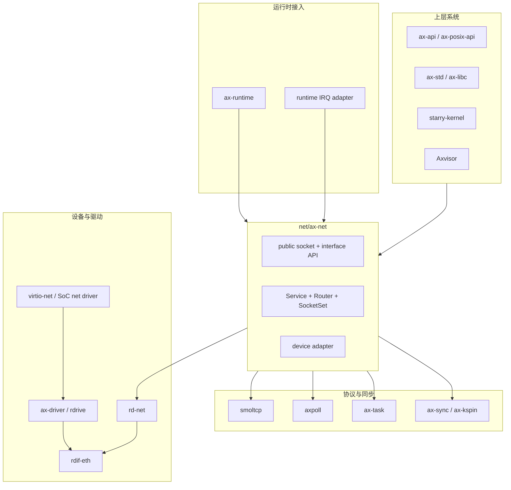
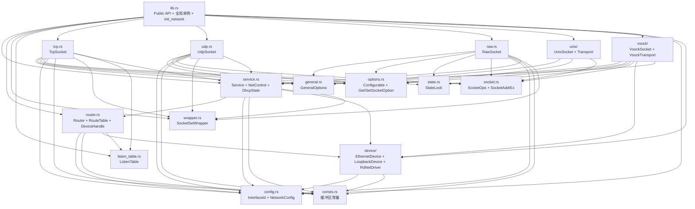

# 网络组件依赖关系

`ax-net` 是一个共享网络栈 crate，不包含具体硬件驱动。它位于 `net/ax-net`，上接 ArceOS、StarryOS、Axvisor，下接 `rd-net` / `rdif-eth` 设备能力。

## 分层关系



## 直接依赖

依赖声明在 [net/ax-net/Cargo.toml](net/ax-net/Cargo.toml)：

| 依赖 | 用途 |
| --- | --- |
| `smoltcp` | TCP/IP、UDP、raw、DHCPv4、DNS、ARP cache 和 `Device` token 模型 |
| `rd-net` | Ethernet 设备抽象和 RX/TX buffer trait |
| `rdif-vsock` | 可选 vsock 设备能力（`vsock` feature） |
| `ax-task` | worker、wait queue、future helper、sleep/yield |
| `axpoll` | readiness 和 `Pollable` |
| `ax-sync` / `ax-kspin` | mutex、spin lock 和同步原语 |
| `ax-hal` | monotonic/wall clock 等 HAL 能力 |
| `ax-io` | socket read/write buffer trait |
| `ax-errno` | `AxError` / `AxResult` |
| `spin` | `Once`、`LazyLock`、`RwLock` |
| `hashbrown` / `ringbuf` / `async-channel` | socket 和辅助数据结构 |
| `event-listener` / `bitflags` / `enum_dispatch` / `async-trait` | 事件通知、标志位、trait 分派 |

`smoltcp` 在 `Cargo.toml` 中固定启用一组能力（`medium-ethernet`、`medium-ip`、`proto-ipv4`、`proto-ipv6`、`socket-{raw,icmp,udp,tcp,dhcpv4,dns}`、`async`、`alloc`、`log`）。`ax-net` 自身只用 `Medium::Ip` 层，Ethernet 帧处理由 `EthernetDevice` 自行完成。

## 能力边界（EthernetDriver）

`ax-net` 不直接依赖硬件驱动框架，而是通过能力边界 trait `EthernetDriver`（[net/ax-net/src/device/driver.rs#L70-L82](net/ax-net/src/device/driver.rs#L70-L82)）对接网卡：

```rust
pub trait EthernetDriver: Send + Sync {
    fn device_name(&self) -> &str;
    fn irq_num(&self) -> Option<usize>;
    fn enable_irq(&mut self);
    fn disable_irq(&mut self);
    fn mac_address(&self) -> [u8; 6];
    fn alloc_tx_buffer(&mut self, size: usize) -> NetDeviceResult<Box<dyn NetTxBuffer>>;
    fn recycle_tx_buffers(&mut self) -> NetDeviceResult;
    fn transmit(&mut self, tx_buf: &mut dyn NetTxBuffer) -> NetDeviceResult;
    fn receive(&mut self) -> NetDeviceResult<Box<dyn NetRxBuffer>>;
    fn recycle_rx_buffer(&mut self, rx_buf: &mut dyn NetRxBuffer) -> NetDeviceResult;
    fn handle_irq(&mut self) -> NetIrqEvents;
}
```

`RdNetDriver`（[driver.rs#L128](net/ax-net/src/device/driver.rs#L128)）实现该 trait，内部包装 `rd-net` 的 `TxQueue` / `RxQueue`。`EthernetDeviceList` 即 `Vec<Box<dyn EthernetDriver>>`（[driver.rs#L84](net/ax-net/src/device/driver.rs#L84)），由 `ax-runtime` 收集后传入 `init_network()`。

## 主要消费者

| 消费方 | 使用方式 |
| --- | --- |
| `ax-runtime` | 收集 Ethernet/vsock 设备，构造 `NetworkConfig`，调用 `init_network()` / `init_vsock()` |
| `ax-api` | 提供 ArceOS socket API，复用 `SocketOps` |
| `ax-posix-api` | 提供 POSIX socket、poll、epoll 等适配 |
| `ax-std` / `ax-libc` | 面向应用暴露标准库和 libc 网络接口 |
| `starry-kernel` | Linux socket syscall、ioctl、AF_PACKET、AF_NETLINK 等 ABI 层 |
| Axvisor | 通过结构化配置表达管理面/服务面接口需求 |

## 与 `ax-runtime` 的边界

`ax-runtime` 负责平台设备与网络栈之间的装配：

- 从 rdrive / rdif registry 获取 Ethernet 设备。
- 包装为 `RdNetDriver` / `EthernetDeviceList`。
- 注册网络 IRQ adapter。
- 构造 `NetworkConfig`。
- 调用 `ax_net::init_network(net_devs, config)`。

`ax-runtime` 不维护第二套接口状态，不直接修改路由表，也不解析 Linux socket 语义。

## 与 StarryOS 的边界

StarryOS 负责 Linux ABI：

- `socket()`、`bind()`、`connect()`、`sendmsg()`、`recvmsg()` syscall 参数解析。
- `ifreq`、`sockaddr_in`、`sockaddr_ll`、`sockaddr_nl` 编解码。
- Linux errno 映射。
- root net namespace 可见性过滤。
- `SO_BINDTODEVICE` 到 `InterfaceId` 的转换。
- AF_PACKET 的 ifindex 绑定和兼容行为。

StarryOS 不缓存独立 IPv4/gateway/MAC 状态。接口信息统一来自：

- `ax_net::interfaces()`
- `ax_net::interface_by_name()`
- `ax_net::interface_by_id()`
- `ax_net::ipv4_config()`
- `ax_net::arp_entries()`

## 与驱动框架的边界

具体网卡驱动属于 `drivers/`、`ax-driver`、`rdrive` 和 `rdif-*`。`ax-net` 只关心 Ethernet 能力边界：

```text
driver core
  -> rdif-eth / rd-net
  -> ax-runtime collects devices
  -> ax-net EthernetDevice
```

这种边界避免网络协议栈直接依赖 FDT、PCI、MMIO、DMA、VirtIO 或平台 IRQ ABI。

## 与 smoltcp 的边界

smoltcp 提供协议核心，但不直接知道 TGOSKits 的多接口 registry。`ax-net` 在 smoltcp 外层维护：

- `InterfaceId`
- `InterfaceInfo`
- `NetworkConfig`
- `RouteTable`
- per-interface DHCP metadata
- DNS 来源信息
- StarryOS ifindex 映射

`Router` 是两者之间的适配层：对 smoltcp 它是一个 `phy::Device`（[router.rs#L672](net/ax-net/src/router.rs#L672)）；对 TGOSKits 它知道多个设备、路由和接口元数据。`Service`（[service.rs#L210-L218](net/ax-net/src/service.rs#L210-L218)）持有 smoltcp `Interface` 并驱动其 poll：

```rust
pub struct Service {
    pub iface: Interface,
    router: Router,
    control: Arc<NetControl>,
    timeout: Option<Pin<Box<dyn Future<Output = ()> + Send>>>,
    dhcp: Vec<DhcpState>,
}
```

`Service::new()`（[service.rs#L450-L462](net/ax-net/src/service.rs#L450-L462)）使用 `HardwareAddress::Ip` 创建 smoltcp `Interface`，把 `Router` 作为 `phy::Device` 传入。

## 内部模块依赖关系

`ax-net` crate 内部模块间调用关系：



### 关键数据流方向

| 方向 | 数据 | 载体 |
| --- | --- | --- |
| 设备 → Router | RX 包（bytes + InterfaceId） | `BoundedPacketQueue<RxPacket>` |
| Router → smoltcp | RX payload（IP 包裸内容） | `Router.rx_buffer`（`PacketBuffer<InterfaceId>`） |
| smoltcp → Router | TX IP 包（完整 IP packet） | `Router.tx_buffer`（`PacketBuffer<InterfaceId>`） |
| Router → 设备 | TX 包（next_hop + bytes） | `DeviceHandle.tx_queue`（`BoundedPacketQueue<TxPacket>`） |
| 设备 → Service | DHCP 事件 | `DhcpEvent` 枚举（通过 snoop callback） |
| Service → NetControl | 接口/routing/DNS 更新 | `commit_interface_update()` + `RouteTable::replace_ipv4_rules_for_interface()` |
| Socket → Service | Poll 请求 | `request_poll()` + `NET_POLL_REQUESTED` atomic + `NET_POLL_WAKE` |
| Service → Socket | I/O 就绪通知 | `register_waker()` 注册 → smoltcp readiness → waker 唤醒 |

### 对外提供的 trait 与类型

| trait/类型 | 定义位置 | 消费者 |
| --- | --- | --- |
| `SocketOps` | [socket.rs](net/ax-net/src/socket.rs) | `ax-api`, `ax-posix-api`, `starry-kernel` |
| `Configurable` | [options.rs](net/ax-net/src/options.rs) | 同上 + 各 socket backend |
| `Pollable` | 通过 `axpoll` | `axpoll` 消费者 |
| `EthernetDriver` | [device/driver.rs](net/ax-net/src/device/driver.rs) | `ax-runtime` |
| `EthernetIrqRegistrar` | [device/ethernet.rs](net/ax-net/src/device/ethernet.rs) | `ax-runtime` |
| `VsockDriver` | [device/vsock.rs](net/ax-net/src/device/vsock.rs) | `ax-runtime`（`vsock` feature） |
| `UnixNamespace` | [unix/namespace.rs](net/ax-net/src/unix/namespace.rs) | `starry-kernel` |
