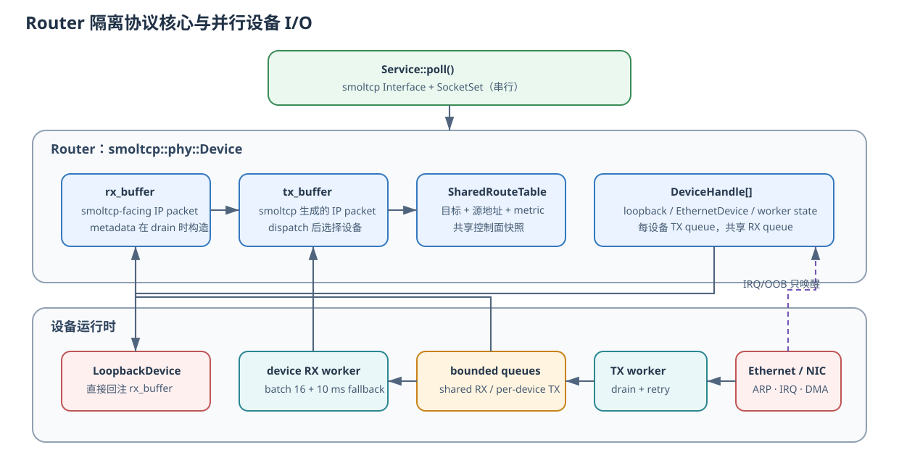
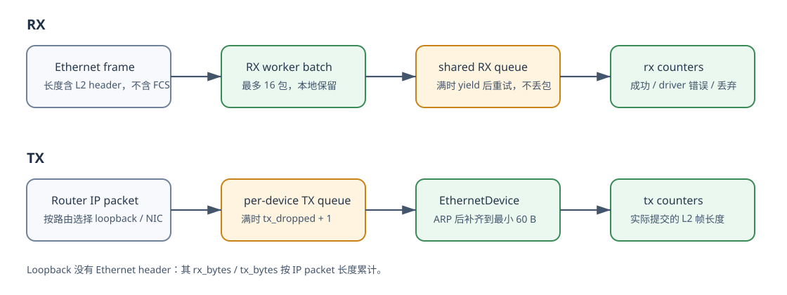

# 多设备实现

`ax-net` 使用 **single smoltcp Interface + Router as Device** 的数据面结构。smoltcp 只看到一个 `phy::Device`，这个虚拟设备在内部聚合 loopback、Ethernet 和运行期注册的静态设备，并通过共享路由表把 TX packet 分发到真实出接口。

核心源码：

| 源码 | 职责 |
| --- | --- |
| `router.rs` | `Router` 虚拟设备、route dispatch、bounded queue、loopback 快速路径、RX/TX worker |
| `device/mod.rs` | 内部 `Device` trait、ARP entry 对外模型 |
| `device/ethernet.rs` | Ethernet 帧封装/解析、ARP、IRQ/OOB readiness |
| `device/loopback.rs` | `lo` 接口占位设备，真实回环由 Router 快速路径完成 |
| `device/driver.rs` | `rd-net` 到 `EthernetDriver` 的适配 |
| `service.rs` | `Service::poll()` 调度 Router、smoltcp、DHCP、orphan |
| `lib.rs` | net-poll worker、`request_poll()`、设备注册入口 |

源码表把 Router、设备抽象、链路层和通用驱动适配分开定位，便于判断一个问题属于 packet 调度还是硬件能力。设计边界将用这些所有者解释为什么协议核心不直接调用 driver。

## 1. 设计边界

多设备层的核心是 `Router`——它实现 smoltcp 的 `phy::Device` trait，对协议核心暴露 `Medium::Ip` 层的单一虚拟设备，内部聚合 loopback 和多个 Ethernet 设备。smoltcp 只通过 `Router::receive()`/`transmit()` 读写 IP packet，不感知真实网卡数量。每个 packet 携带 ingress `InterfaceId` 元数据，用于 TCP SYN snoop、DHCP 分发和诊断。

TX 方向由 `Router::dispatch()` 在每次 `Service::poll()` 周期中执行：解析 smoltcp 输出的 IP 包头，通过共享 `RouteTable` 的 `select_route_for_source()` 选择出接口和 next hop。Loopback 目的地址走直接注入快速路径（`inject_loopback_rx_direct()`），在同一 poll 周期内完成 TX→RX 回环；Ethernet 设备的 packet 推入 per-device 有界 TX queue，由专用 TX worker 调用 `Device::send()` 发出。

设备 worker（`device_rx_worker`/`device_tx_worker`）只和有界队列交互，不进入 `Service` 或 `SocketSet` 锁。RX worker 从硬件读取 packet 后推入共享 `RouterQueues::rx`，并调用 `request_poll()` 唤醒 net-poll worker；TX worker 从 per-device TX queue 取出 packet 调用设备发送。这种隔离确保硬件收发延迟不阻塞协议核心，协议核心锁也不阻塞设备收发。

典型关系如下：



图中共享 RX queue 和每设备 TX queue 是协议核心与硬件并行域之间的唯一 packet 通道，虚线只表示 IRQ 唤醒。下面的设备抽象层把该图中的方框落实为 `Device`、`EthernetDevice` 和 `RdNetDriver` 等具体能力边界。

## 2. 设备抽象层

设备抽象层把硬件细节限制在 `device/*`，Router 只处理完整 IP packet 和 next-hop IP。这样 Ethernet、loopback、OOB Wi-Fi 等设备可以共享同一个 smoltcp 协议核心。

### 2.1 设备能力

内部 `Device` trait 是 `Router` 与具体设备之间的最小能力边界，统一接收、发送、配置查询、统计和 readiness，而不暴露 driver 类型。方法返回完整 IP packet 与二层长度，使 Router 可以保持介质无关，同时让 Ethernet 实现负责 ARP 和 frame 细节。

```rust
pub trait Device: Send + Sync {
    fn name(&self) -> &str;

    fn recv(
        &mut self,
        interface_id: InterfaceId,
        buffer: &mut PacketBuffer<InterfaceId>,
        timestamp: Instant,
        snoop: &mut dyn FnMut(&[u8]),
    ) -> usize;

    fn send(&mut self, next_hop: IpAddress, packet: &[u8], timestamp: Instant) -> usize;

    fn drain_deferred_tx(&mut self) -> Vec<usize> { Vec::new() }
    fn drain_deferred_rx(&mut self) -> Vec<usize> { Vec::new() }
    fn drain_deferred_tx_errors(&mut self) -> u64 { 0 }
    fn drain_deferred_tx_drops(&mut self) -> u64 { 0 }
    fn drain_deferred_rx_errors(&mut self) -> u64 { 0 }
    fn drain_deferred_rx_drops(&mut self) -> u64 { 0 }

    fn set_ipv4_addr(&mut self, _addr: Option<Ipv4Cidr>) {}

    fn arp_entries(&self, _timestamp: Instant) -> Vec<ArpEntry> {
        Vec::new()
    }

    fn wake_rx(&self) {}

    /// Returns the device readiness poll set when the device has a wake source.
    ///
    /// The router uses this to register the global [`NET_POLL_DEVICE_WAKER`]
    /// and to publish readiness to the per-device worker path. Pure-polling
    /// devices should return `None`.
    fn readiness_poll(&self) -> Option<Arc<PollSet>> {
        None
    }
}
```

约束：

- `recv()` 输出恰好一个完整 IP packet 时返回该包对应的 L2 frame 长度；返回 `0` 表示没有 IP 包入队。ARP 等旁路帧通过 `drain_deferred_*()` 交付统计。
- `send()` 输入完整 IP packet 和已选好的 `next_hop`，返回实际提交的 L2 frame 长度；ARP 未解析而暂存、发送失败或未发送时返回 `0`。
- route lookup、source address selection、TCP/UDP/raw 分发都在设备层之上完成。
- 设备只负责链路层封装、邻居解析、硬件 RX/TX 和 readiness。

trait 方法列表明确设备实现需要提供的 packet、配置和 readiness 能力，同时把协议对象排除在边界外。Loopback 只实现这套统一形状中的最小控制面角色，数据 packet 走 Router 快速路径。

### 2.2 Loopback 设备

`LoopbackDevice` 为 `lo` 提供接口身份、MTU 和统计存储，但普通 loopback packet 不通过其 `recv()` 或 `send()`。`Router::dispatch()` 直接把 IP packet 回注 `rx_buffer`，因此该对象主要维持统一设备模型和查询视图。

```rust
pub struct LoopbackDevice;

impl Device for LoopbackDevice {
    fn name(&self) -> &str {
        "lo"
    }

    fn recv(...) -> usize {
        0
    }

    fn send(&mut self, _next_hop: IpAddress, _packet: &[u8], _timestamp: Instant) -> usize {
        0
    }

    fn readiness_poll(&self) -> Option<Arc<PollSet>> {
        None
    }
}
```

真实 loopback 数据路径不走 `LoopbackDevice::send()/recv()`，而是在 `Router::dispatch()` 中直接把 smoltcp TX buffer 的 packet 注入 `Router.rx_buffer`。保留这个设备对象是为了让控制面、路由表和 Linux ifindex 能把 `lo` 作为普通接口处理。

### 2.3 以太网设备

`EthernetDevice` 是物理和虚拟 NIC 的主要链路层实现，组合 `EthernetDriver`、ARP cache、IRQ/OOB readiness 和 `NetDevStats`。它在 driver packet buffer 与 Router IP packet 之间完成解封装或封装，使上层协议核心始终工作在 `Medium::Ip`。

```rust
pub struct EthernetDevice {
    name: String,
    inner: Arc<EthernetIrqState>,
    neighbors: HashMap<IpAddress, Neighbor>,
    pending_neighbors: HashMap<IpAddress, PendingNeighbor>,
    ip: Option<Ipv4Cidr>,
    pending_packets: PacketBuffer<'static, IpAddress>,
}
```

职责：

- 从 `EthernetDriver::receive()` 读取 Ethernet frame。
- 解析 ARP 和 IPv4。
- 把 IPv4 payload 上交为完整 IP packet。
- 根据 next hop 做 ARP/neighbor lookup。
- 封装 Ethernet frame 并通过 driver 发送。
- 导出 `/proc/net/arp` 所需的 ARP entry。

Ethernet 职责列表表明 ARP、framing、IRQ 状态和统计都由设备包装器拥有，而非底层 driver。通用驱动适配只需要把 `rd-net` 队列转换为 `EthernetDriver` 的 buffer contract。

### 2.4 通用驱动适配

`RdNetDriver` 是 `rd-net` 设备到 `EthernetDriver` trait 的适配层。它持有 `rd_net::TxQueue`、`rd_net::RxQueue` 和一个很小的 `pending_rx` 预取队列。Router 不直接依赖 `rd-net` 类型，只依赖内部 `Device` trait。

```text
rd_net::Net
  -> RdNetDriver
  -> EthernetDriver trait
  -> EthernetDevice
  -> Router DeviceHandle
```

适配策略：

- RX：`rd_net::RxQueue::receive()` 返回的 packet 被复制到 `VecRxBuffer`，放入 `pending_rx` 或直接交给 `EthernetDevice`。`RX_PREFETCH_TARGET = 1`，只预取一个 packet，避免形成新的缓存层。
- TX：`alloc_tx_buffer(size)` 返回 `VecTxBuffer`，实际长度为 `max(size, ETH_ZLEN)`，保证 Ethernet 最小帧长 60 字节。
- IRQ：`handle_irq()` 调用底层 irq handler 后尝试预取 RX packet，并根据结果返回 `NetIrqEvents::RX_READY`、`RX_ERROR` 或 `SPURIOUS`。
- 错误：`rd_net::NetError::Retry` 映射为 `NetDeviceError::Again`，`NoMemory` / `NotSupported` 保留语义，link down 或其它错误映射为 `Io`。

这个适配层仍然是 copy-based 的。它的目标是隔离 `rd-net` ownership 模型，而不是提供端到端 zero-copy。后续如果要做 zero-copy，需要同时改造 `rd-net` buffer ownership、`EthernetDevice` frame 封装和 smoltcp token 生命周期。

## 3. 多设备路由器

`Router` 是 smoltcp `phy::Device` 的实现，也是单协议核心和多设备数据面之间的适配器。它不是传统意义上只维护 route table 的 router，而是一个 MultiDevice adapter。

### 3.1 核心结构

`Router` 同时持有 smoltcp-facing RX/TX buffer、共享路由表和 `DeviceHandle` 列表，是单协议核心映射到多设备的关键所有者。结构字段的生命周期都由 `Service` 管理，但设备 I/O 通过独立 Worker 执行，因此新增字段时必须明确它属于串行 poll 状态还是并行设备状态。

```rust
pub struct Router {
    rx_buffer: PacketBuffer,
    tx_buffer: PacketBuffer,
    queues: Arc<RouterQueues>,
    devices: Vec<Arc<DeviceHandle>>,
    table: SharedRouteTable,
}
```

字段语义：

- `rx_buffer`：smoltcp-facing RX packet buffer，由 `Router::receive()` 消费。
- `tx_buffer`：smoltcp-facing TX packet buffer，由 `TxToken::consume()` 写入。
- `queues.rx`：所有非 loopback 设备 worker 共享的有界 RX 队列。
- `devices`：Router 内部设备索引空间，和公开 `InterfaceId` 分离。
- `table`：与控制面共享的 route table。

Router 字段列表把协议侧 buffer、路由表和设备集合集中在串行所有者中，但具体硬件访问仍通过 handle 解耦。设备句柄为每个设备组合短锁、队列和 Worker wake state。

### 3.2 设备句柄

每个设备对应一个 `DeviceHandle`，其中短锁保护具体 `Device`，有界 TX queue 和 WaitQueue 则由专属 Worker 消费。handle 允许 `Router` 在不持有全局协议对象的情况下注册 readiness、查询统计和提交发送包，是设备并行性的所有权单元。

```rust
struct DeviceHandle {
    interface_id: InterfaceId,
    name: String,
    inner: Arc<Mutex<Box<dyn Device>>>,
    rx_queue: Arc<BoundedPacketQueue<RxPacket>>,
    tx_queue: Arc<BoundedPacketQueue<TxPacket>>,
    rx_wake: Arc<WaitQueue>,
    tx_wake: Arc<WaitQueue>,
    rx_waker: Waker,
    rx_ready: AtomicBool,
    rx_bytes: AtomicU64,
    rx_packets: AtomicU64,
    rx_errors: AtomicU64,
    rx_dropped: AtomicU64,
    tx_bytes: AtomicU64,
    tx_packets: AtomicU64,
    tx_errors: AtomicU64,
    tx_dropped: AtomicU64,
}
```

RX queue 是所有设备共享的，因为 smoltcp 只能从一个 `Router.rx_buffer` 获取 packet；TX queue 是每设备独立的，因为 dispatch 已经决定了出接口。

`rx_ready` 是 sticky readiness 位，避免 `WaitQueue` 非粘性通知与 worker 进入 wait 的竞态。统计字段使用 `Relaxed` 原子累计；它们只要求不丢更新，读取允许短暂陈旧，不承担其它状态的 publish/observe 同步。

`Router::send_on_device()` 允许调用方绕过路由表直接向指定设备发送 packet（如 DHCP 广播包）。该路径只用于控制面的协议辅助（DHCP client/server），不暴露给 socket 路径。

### 3.3 smoltcp 设备实现

Router 对 smoltcp 暴露 `Medium::Ip`，即 smoltcp 看到的是 IP packet 设备，而不是 Ethernet frame 设备：

```rust
impl smoltcp::phy::Device for Router {
    type RxToken<'a> = RxToken<'a>;
    type TxToken<'a> = TxToken<'a>;

    fn receive(&mut self, _timestamp: Instant) -> Option<(Self::RxToken<'_>, Self::TxToken<'_>)> {
        if self.rx_buffer.is_empty() || self.tx_buffer.is_full() {
            None
        } else {
            let (interface_id, packet) = self.rx_buffer.dequeue().unwrap();
            Some((RxToken { interface_id, packet }, TxToken(&mut self.tx_buffer)))
        }
    }

    fn transmit(&mut self, _timestamp: Instant) -> Option<Self::TxToken<'_>> {
        if self.tx_buffer.is_full() {
            None
        } else {
            Some(TxToken(&mut self.tx_buffer))
        }
    }

    fn capabilities(&self) -> DeviceCapabilities {
        let mut caps = DeviceCapabilities::default();
        caps.medium = Medium::Ip;
        caps.max_transmission_unit = STANDARD_MTU;
        caps.max_burst_size = Some(SOCKET_BUFFER_SIZE);
        caps
    }
}
```

shared queue 中的 `RxPacket` 只保存 ingress `InterfaceId`。`Router::poll()` 在写入 smoltcp-facing `rx_buffer` 时构造 `RxMetadata { interface_id, packet_meta }`：`packet_meta` 的 id 从 IP header 提取 IPv4 TOS/IPv6 traffic-class，供 UDP/raw `recvmsg()` 生成 cmsg。`TxToken` 使用占位 metadata，真实出接口由 `Router::dispatch()` 解析 IP header 后决定。

## 4. 队列缓冲区

队列层的目标是有界、低分配和清晰所有权：设备 worker 不持有 `Router` 本体，Router 不直接阻塞在硬件收发上。

### 4.1 有界包队列

`BoundedPacketQueue<T>` 是 Router 与设备 Worker 之间的有界 FIFO，内部队列锁保存拥有型消息，原子长度用于快速判空和等待谓词。容量满的处理由调用路径决定：RX Worker 保留本地 batch 重试，TX dispatch 则记录丢包。

```rust
struct BoundedPacketQueue<T> {
    inner: Mutex<VecDeque<T>>,
    capacity: usize,
    len: AtomicUsize,
}
```

语义：

- `push()` 满时返回 `Err(packet)`，由调用方决定策略：RX worker 保留未入队项并重试；TX enqueue 计入 `tx_dropped` 后丢弃。
- `pop()` 空时返回 `None`。
- `is_empty()` 只读原子 `len`，用于 worker wait predicate。
- 共享 RX queue 容量由 `DEVICE_RX_QUEUE_SIZE` 控制；per-device TX queue 容量由 `DEVICE_TX_QUEUE_SIZE` 控制。

有界队列操作列表说明容量判断、原子长度和等待通知属于队列自身职责。队列包表示则决定跨线程传递的实际所有权与最大 packet 大小。

### 4.2 队列包表示

队列使用固定上限的 `QueuedPacket` 保存 packet bytes，避免在每个收发事件上创建大小不受控的堆对象。长度字段决定有效载荷范围，复制边界则让 Worker 与 Router 不共享可变 driver buffer 或生命周期受限的 slice。

```rust
struct QueuedPacket {
    bytes: [u8; STANDARD_MTU],
    len: usize,
}
```

`QueuedPacket::new(packet)` 会拒绝超过 `STANDARD_MTU` 的 packet。这个设计牺牲了端到端 zero-copy，但给出了明确内存上限，并避免早期 loopback 队列路径中的 `to_vec()` 分配。

### 4.3 收发包表示

`RxPacket` 和 `TxPacket` 是跨 Worker 队列传递的拥有型消息：前者保留 ingress `InterfaceId`，后者保留选路后的 next hop 与 packet bytes。它们刻意不携带 socket 引用或设备锁 guard，使队列边界不会把协议核心生命周期扩散到驱动线程。

```rust
struct RxPacket {
    interface_id: InterfaceId,
    bytes: QueuedPacket,
}

struct TxPacket {
    next_hop: IpAddress,
    bytes: QueuedPacket,
}
```

RX queue 保存 ingress `InterfaceId`；接收侧 packet metadata 在 drain 到 `Router.rx_buffer` 时生成。TX 保存 route table 已经选择好的 next hop。

## 5. 数据路径

数据路径分为设备 RX、smoltcp poll、TX dispatch 和 loopback 快速路径。所有路径都围绕 `Service::poll()` 批量推进。
端到端的内存所有权、拷贝次数、队列满行为和预算估算见[内存与队列](memory.md)。

### 5.1 RX 路径

RX Worker 从真实设备批量取得 IP packet 和对应二层长度，释放设备锁后再写入所有网卡共享的 RX queue。`Router::poll()` 随后按 `InterfaceId` 构造 metadata 并执行 DHCP/TCP SYN snoop，设备线程本身不会进入 `SocketSet`。

```text
EthernetDriver RX
  -> EthernetDevice::recv()
  -> device_rx_worker local PacketBuffer
  -> shared RouterQueues.rx
  -> request_poll()
```

`Router::poll()` 在协议核心线程中把共享 RX queue drain 到 smoltcp-facing `rx_buffer`：

```rust
pub fn poll(
    &mut self,
    _timestamp: Instant,
    sockets: &mut SocketSet<'_>,
    mut snoop: impl FnMut(InterfaceId, &[u8]),
) -> bool {
    let mut moved_rx = false;
    while !self.rx_buffer.is_full() {
        let Some(packet) = self.queues.rx.pop() else {
            break;
        };
        let bytes = packet.bytes.as_slice();
        snoop_tcp_packet(bytes, sockets);
        snoop(packet.interface_id, bytes);
        let metadata = rx_metadata(packet.interface_id, bytes);
        let Ok(dst) = self.rx_buffer.enqueue(bytes.len(), metadata) else {
            break;
        };
        dst.copy_from_slice(bytes);
        moved_rx = true;
    }
    moved_rx || !self.queues.rx.is_empty()
}
```

`snoop_tcp_packet()` 在 smoltcp 消费 packet 前识别 TCP SYN，为 listen socket 预创建 child；`snoop(interface_id, bytes)` 用于 DHCP client/server 等按 ingress 接口分发的控制协议。

### 5.2 TX 路径

smoltcp 发送时只通过 `TxToken` 把完整 IP packet 写入 `Router.tx_buffer`，随后由 `Router::dispatch()` 解析目标与源地址并查询共享路由表。选中 Ethernet 后 packet 进入对应 TX queue；loopback 则绕过设备 Worker 直接回注。

```text
smoltcp socket
  -> TxToken::consume()
  -> Router.tx_buffer
  -> Router::dispatch()
  -> route lookup by dst + source
  -> loopback direct RX or per-device TX queue
```

dispatch 规则：

- IPv4 limited broadcast：复制到所有非 loopback 设备。
- IPv4/IPv6 单播：使用 `select_route_for_source(dst, src)`，确保源地址和出接口一致。
- IPv6 multicast：Router 层会尝试发往非 loopback 设备；但 `EthernetDevice` 当前只发送 IPv4 EtherType、接收 IPv4/ARP，也没有 NDP，所以外部 Ethernet IPv6 数据面实际不可用。
- 无 route：记录 warning 并丢弃该 packet。

普通设备 TX 进入对应设备的 TX queue：

```rust
fn enqueue_tx(&self, next_hop: IpAddress, packet: &[u8]) -> bool {
    let Some(bytes) = QueuedPacket::new(packet) else {
        return false;
    };
    if self.tx_queue.push(TxPacket { next_hop, bytes }).is_err() {
        return false;
    }
    self.tx_wake.notify_one(true);
    true
}
```

TX worker 再调用具体设备：

```rust
fn device_tx_worker(device: Arc<DeviceHandle>) {
    loop {
        if let Some(packet) = device.tx_queue.pop() {
            let frame_len =
                device.inner.lock().send(packet.next_hop, packet.bytes.as_slice(), now());
            if frame_len > 0 {
                device.count_tx(frame_len);
            }
        } else {
            device.tx_wake.wait_until(|| !device.tx_queue.is_empty());
        }
    }
}
```

发送代码展示 Router 在释放协议侧 packet 后只向选中设备的有界队列提交拥有型副本，设备 Worker 才会进入硬件。Loopback 快速路径保留相同 dispatch 决策，但把目标改为本地 RX buffer。

### 5.3 Loopback 快速路径

loopback TX 不经过设备 worker，也不进入共享 RX queue。dispatch 选中 `InterfaceId::LOOPBACK` 后直接注入 smoltcp-facing RX buffer：

```rust
fn inject_loopback_rx_direct(
    rx_buffer: &mut PacketBuffer,
    dst_addr: IpAddress,
    packet: &[u8],
    sockets: &mut SocketSet<'_>,
) -> bool {
    snoop_tcp_packet(packet, sockets);
    let Ok(dst) = rx_buffer.enqueue(packet.len(), InterfaceId::LOOPBACK) else {
        warn!("Loopback: RX buffer full, dropping packet to {}", dst_addr);
        return false;
    };
    dst.copy_from_slice(packet);
    true
}
```

这个路径减少了一次队列 hop 和一次 packet 临时分配，并允许 loopback TCP SYN 在同一个 `Service::poll()` 周期内触发 child socket 预创建。

`send_on_device()` 的 loopback 分支仍使用 `inject_loopback_rx()` 写入共享 RX queue，主要用于指定设备发送的控制面 packet；普通 socket TX loopback 走 direct injection。

## 6. Worker 唤醒

设备 worker 是多设备层和硬件之间的异步边界。worker 不访问 `SocketSet`，也不进入 `Service`。

### 6.1 Worker 启动

`Router::start_device_workers()` 为每个非 loopback 设备建立独立 RX/TX Worker，并把设备名用于任务标识。Worker 在接口、队列和控制面状态已经注册后启动，避免任务先运行却无法把 packet 关联到稳定 `InterfaceId`。

```rust
pub fn start_tx_workers(&self) {
    for dev in 0..self.devices.len() {
        self.start_device_tx_worker(dev);
    }
}

fn start_device_tx_worker(&self, dev: usize) {
    let Some(device) = self.devices.get(dev) else {
        return;
    };
    if device.interface_id == InterfaceId::LOOPBACK {
        return;
    }
    ax_task::spawn_with_name(move || device_tx_worker(device), name);
}
```

运行期新增静态设备时，`register_static_device()` 会调用 `router.start_device_workers(dev)`，走同一套 worker 模型。

### 6.2 RX Worker

RX worker 持有设备锁调用 `Device::recv()`，把每个 IP packet 与其 L2 frame 长度组成最多 16 项的本地 FIFO；释放设备锁后再推入共享 RX queue：

```rust
fn device_rx_worker(device: Arc<DeviceHandle>) {
    let mut local_batch = VecDeque::with_capacity(DEVICE_RX_WORKER_BATCH);

    loop {
        {
            let mut device_inner = device.inner.lock();
            while local_batch.len() < DEVICE_RX_WORKER_BATCH {
                let frame_len = device_inner.recv(/* rx_buffer, timestamp, snoop */);
                if frame_len == 0 { break; }
                let (interface_id, packet) = rx_buffer.dequeue().unwrap();
                let bytes = QueuedPacket::new(packet).unwrap();
                local_batch.push_back((RxPacket { interface_id, bytes }, frame_len));
            }
            // 汇入 ARP 等旁路帧长度及 device error/drop 计数。
        }

        if device.drain_local_batch_step(&mut local_batch).is_err() {
            request_poll();
            yield_now(); // shared RX queue 满：本地保留并重试。
        }

        if local_batch.is_empty() {
            register_device_poll(&device, &device.rx_waker);
            device.rx_wake.wait_timeout_until(
                DEVICE_RX_IDLE_POLL_INTERVAL, // 10 ms
                || device.take_rx_ready(),
            );
        }
    }
}
```

共享 RX queue 满不是丢包点：尚未入队的 `(RxPacket, frame_len)` 保留在 `local_batch`，worker 通知主 poll、让出 CPU 后重试。真正的 RX drop 包括超 MTU、frame 解析/目标过滤以及设备报告的丢弃。

### 6.3 Waker 注册

Router 提供两类 waker 注册。它先在短设备锁内 clone `readiness_poll()`，释放锁后再执行 `PollSet::register()`：

```rust
pub fn register_device_waker(&self, waker: &Waker) {
    for device in &self.devices {
        register_device_poll(device, &device.rx_waker);
        register_device_poll(device, waker);
    }
}

pub fn register_waker(&self, binding: DeviceBinding, waker: &Waker) {
    for device in &self.devices {
        if binding.bound_if.is_none_or(|id| id == device.interface_id) {
            register_device_poll(device, &device.rx_waker);
            register_device_poll(device, waker);
        }
    }
}
```

`register_device_waker()` 用于 net-poll worker 的全局设备 readiness；`register_waker(binding, waker)` 用于 socket readiness，只向 `SO_BINDTODEVICE` 或本地地址绑定允许的接口注册。

## 7. Ethernet 链路层

Ethernet 设备在 IP packet 与真实 Ethernet frame 之间转换，并维护 ARP/neighbor 状态。

### 7.1 RX 处理

`EthernetDevice::recv()` 从 driver 取得完整二层帧，校验目标与 EtherType 后处理 ARP 或提取 IPv4 payload，并返回实际 frame 长度用于统计。无效 frame、driver 错误和队列丢弃分别计数，不能合并为一个通用失败值。

1. 从 `EthernetDriver::receive()` 读取一帧。
2. 解析 `EthernetFrame`。
3. ARP frame：更新 neighbor 表、处理 gratuitous request/reply、释放 pending packet。
4. IPv4 frame：校验链路层目标，取出 IP payload，写入 Router 提供的 packet buffer。
5. 其他协议：忽略或记录。

`recv()` 输出给 Router 的始终是 IP packet，而不是 Ethernet frame。

### 7.2 TX 处理

`EthernetDevice::send(next_hop, packet)` 先解析或请求 next-hop MAC，再构造 Ethernet header 并把短帧补齐到不含 FCS 的最小长度。ARP 未解析时 packet 进入有界 pending 缓冲区，解析成功后才提交 driver 并累计实际二层长度。

1. 查询 `neighbors`。
2. 命中：封装 Ethernet frame 并发送。
3. 未命中但已有 pending ARP：把 packet 放入 `pending_packets`。
4. 未命中且需要重试：发送 ARP request，记录 `pending_neighbors`。

关键参数：

- neighbor TTL：300 秒。
- ARP retry：1 秒。
- pending packet buffer：有界。

链路发送列表区分立即提交、ARP pending 与失败统计，所有 driver I/O 都发生在任务上下文。IRQ 与 OOB RX 只为 Worker 提供 readiness，不改变这些发送所有权。

### 7.3 IRQ 与 OOB RX

Ethernet 支持独立 IRQ handler 和 OOB `ReadinessSource` 两种接收唤醒模式，两者都只负责通知设备 Worker 或网络任务。没有可用事件源时，RX Worker 通过 10 ms 兜底轮询保证进展；hard IRQ 不直接调用 `Device::recv()` 或 smoltcp poll。

- IRQ 模式：`EthernetIrqRegistrar` 注册硬件 IRQ action，IRQ 到来后 action 持有驱动提供的 `EthernetIrqHandler` 调用 `handle_irq()`，`ethernet_irq_outcome()` 将 `RX_READY`/`RX_ERROR`/`TX_DONE` 转成 `wake_net_task_irq()`；随后 `net-poll` worker 通过 `wake_all_devices()` 唤醒设备 poll set 和 RX worker。
- OOB RX 模式：用于 SDIO Wi-Fi 等设备，RX 就绪由设备外部线程调用 `wake_net_task_irq()`，唤醒 `net-poll` worker；`register_device_waker()` 同时把设备 readiness poll set 连接到设备 RX worker，使 `{ifname}-rx` worker 重新检查设备。

`readiness_poll()` 只在存在 IRQ registration 或 OOB RX wake source 时返回 poll set：

```rust
fn readiness_poll(&self) -> Option<Arc<PollSet>> {
    if self.inner.irq_registration.get().is_some() || self.inner.oob_rx {
        Some(self.inner.poll_ready.clone())
    } else {
        None
    }
}
```

纯 polling 设备不会把 waker 挂在永远不会被唤醒的 `poll_ready` 上；它仍由 RX worker 的 10 ms idle timeout 定期检查，不会永久休眠。

## 8. Service 轮询集成

`Service::poll()` 是 Router、smoltcp 和网络控制协议的汇合点。设备 worker 只负责把 packet 放入队列，真正协议推进由 net-poll worker 调用 `Service::poll()` 完成。

### 8.1 轮询顺序

`Service::poll()` 的步骤顺序决定 RX 注入、smoltcp 状态推进、控制协议处理和 TX dispatch 在同一轮中如何收敛。维护这段编排时应保留“先接收入协议核心、再生成并分发发送包”的因果关系，同时确保一次调用有明确的继续轮询信号。

```rust
pub fn poll(&mut self, sockets: &mut SocketSet) -> bool {
    let timestamp = now();
    // 1. router.poll(): drain device RX queue into smoltcp-facing rx_buffer
    // 2. process DHCP client/server snoop events
    // 3. iface.poll(timestamp, &mut router, sockets)
    // 4. DHCP client timers and sends
    // 5. orphan TCP reaping
    // 6. router.dispatch(): route smoltcp TX packets to devices or loopback
}
```

关键顺序：

- `router.poll()` 必须在 `iface.poll()` 前执行，让 smoltcp 能消费新 RX packet。
- DHCP client/server snoop 发生在 packet 进入 smoltcp 前，保留 ingress `InterfaceId`。
- orphan reaper 在持有 `SocketSet` 的 poll 上下文中运行，但删除列表在 orphan 锁外执行。
- `router.dispatch()` 在 smoltcp poll 后执行，把本轮产生的 TX packet 交给真实设备。

单轮 poll 列表展示协议核心如何从 Router RX 收敛到 TX dispatch，并且全程由同一所有权持有者执行。网络轮询 Worker 在外层决定何时重复或等待下一事件。

### 8.2 网络轮询 Worker

socket 与设备路径都只调用轻量 `request_poll()` 合并推进请求，由网络轮询 Worker 竞争 opportunistic `PollOwnership`。Worker 会根据 smoltcp 和控制协议定时期限安排下一次唤醒，并在释放所有权前重新检查并发请求。

```rust
pub fn request_poll() {
    publish_poll_request(&NET_POLL_REQUESTED, || {
        NET_POLL_WAKE.notify_one(true);
    });
}
```

重复 `request_poll()` 会被 pending 标志合并，只有 `false -> true` 的第一次请求真正唤醒 worker。

设备 readiness 通过两类 waker 分流：

- `NET_POLL_DEVICE_WAKER`：全局设备 waker，用于告诉 net-poll worker 有协议栈工作需要推进。
- `register_waker(binding, waker)`：socket readiness waker，只注册到 `DeviceBinding` 允许的接口，避免绑定到 `eth1` 的 socket 被 `eth0` 的 readiness 无意义唤醒。

常规 `net-poll` worker 以 `Opportunistic` 所有权调用 `poll_until_idle()`；UDP close 的 `flush_egress()` 可等待 `Required` 所有权：

```rust
fn poll_until_idle(ownership: PollOwnership) -> bool {
    if !ownership.try_acquire() {
        return false;
    }
    // 消费 NET_POLL_REQUESTED，持 SERVICE -> SOCKET_SET 反复 poll 到 idle。
    // 最后以 Release 释放 poll ownership。
    true
}
```

这个模型保持设备 worker 和协议核心分离，并确保没有并发 poll。普通 socket 热路径不会同步执行完整 smoltcp poll；UDP 析构的同步 flush 是为交付语义保留的受控例外。

## 9. 网卡统计

`Router::stats()` 从每个 `DeviceHandle` 的累计原子生成 `NetDevStats`。Ethernet 的 `rx/tx_bytes` 使用不含 FCS 的二层帧长度，包含 ARP 和 Ethernet header；短 TX 在 `RdNetDriver::transmit()` 补到 60 B 后按实际长度累计。loopback 没有 L2 header，按 IP packet 长度累计。



错误和丢包按发生边界归属：driver/解析/发送错误由 `Device` deferred counters 汇入对应接口；超 MTU、TX queue 满和 loopback RX buffer 满计入 dropped；IP 层无路由发生在选择接口之前，不计入某个接口的 `tx_dropped`（未来应进入系统级 `IpOutNoRoutes`）。

## 10. 控制协议边界

设备层只负责让 DHCP 与 ARP 获得正确的 ingress 接口、next hop 和二层收发能力，具体 lease 或解析状态机仍由 `Service` 和 `EthernetDevice` 各自拥有。明确这条边界可以防止控制协议逻辑侵入 Router queue 或通用 driver trait。

### 10.1 DHCP 角色

DHCP client 和 DHCP server 都依赖 Router RX snoop 拿到 ingress `InterfaceId`：

```text
device RX
  -> Router::poll()
  -> snoop(interface_id, packet)
  -> DHCP client/server packet classifier
```

DHCP client ACK 会通过 `NetworkStateUpdate` 更新 smoltcp address list、控制面接口快照、DNS 和 route table。DHCP server 的 Offer/Ack 使用 `Router::send_on_device(dev, next_hop, packet, timestamp)` 从指定接口发出。

#### 10.1.1 DHCP Client

DHCP client 属于 `Service` 状态，每个启用 DHCP 的 Ethernet 接口对应一个 `DhcpState`。`Router::poll()` 在把 packet 放入 smoltcp RX buffer 前先做 snoop，DHCP UDP packet 会按 ingress `InterfaceId` 分发给对应 `DhcpState`：

```text
Ethernet RX frame
  -> EthernetDevice strips Ethernet/ARP
  -> Router::poll(packet, ingress_if)
  -> DhcpState::process_packet(ingress_if, packet)
  -> optional DhcpEvent
```

`Configured` 事件提交以下状态：

- smoltcp `Interface` 的 IPv4 address list。
- `NetControl` 中的接口 IPv4/gateway snapshot。
- DHCP DNS entries。
- 该接口的 connected route 和 default route。

`Deconfigured` 事件清理同一接口的 DHCP 地址、DNS 和 IPv4 route。这样某个接口 DHCP NAK 不会影响其它接口的静态地址或 DHCP 状态。

#### 10.1.2 DHCP Server

内置 DHCP server 用于 SoftAP 或运行期注册的静态服务接口。它不是通用企业 DHCP server，而是一个轻量的 per-interface server：

```rust
pub struct DhcpServer {
    interface_id: InterfaceId,
    dev: usize,
    server_ip: Ipv4Address,
    client_ip: Ipv4Address,
    mac: EthernetAddress,
    enabled: bool,
}
```

设计语义：

- 只处理进入 `interface_id` 对应接口的 DHCP packet。
- 主要响应 Discover 和 Request，生成 Offer/Ack。
- server IP 来自 SoftAP/静态接口地址，client IP 来自 `NetConfig::dhcp_server_client_ip`。
- 使用固定轻量 lease 时间 `LEASE_SECS = 86400`，不维护复杂租约池。
- 发送不经过 smoltcp socket，而是直接通过 `Router::send_on_device(dev, next_hop, packet, timestamp)` 从绑定设备发出。
- 不参与 DHCP client 状态机，也不会更新控制面地址；它服务的是对端客户端。

这个边界避免 DHCP server 和 DHCP client 争抢同一个 UDP socket，也让 SoftAP 设备即使不依赖外部 DHCP 服务也能给对端分配一个简单地址。

### 10.2 ARP 表项

`arp_entries()` 在短设备锁内收集各 Ethernet 设备邻居表的只读快照，并附带接口身份供 StarryOS `/proc/net/arp` 等消费者展示。快照不延长 ARP entry 生命周期，也不允许查询方修改 cache 或触发路由决策。

```rust
pub fn arp_entries(&self, timestamp: Instant) -> Vec<ArpEntry> {
    let mut entries = Vec::new();
    for device in &self.devices {
        entries.extend(device.inner.lock().arp_entries(timestamp));
    }
    entries
}
```

Ethernet 设备返回 ARP entry，loopback 返回空列表。

## 11. 并发边界

多设备层的并发边界以“worker 不进入协议核心，协议核心不阻塞硬件”为原则。

### 11.1 锁顺序

多设备层的锁顺序把协议核心、Router queue 和具体设备分成单向路径，Worker 不持设备锁进入 `SERVICE`，Router 也不持全局 socket 锁等待硬件。以下调用链用于检查新增统计、readiness 或重试逻辑是否扩大临界区。

```text
net-poll path:
  SERVICE -> SOCKET_SET -> Router -> RouteTable/device queues

device RX worker:
  DeviceHandle.inner -> Device::recv -> shared RX queue -> request_poll()

device TX worker:
  per-device TX queue -> DeviceHandle.inner -> Device::send

socket readiness:
  GeneralOptions -> Service::register_waker -> Router::register_waker
  -> clone Device::readiness_poll under device lock -> PollSet::register outside lock
```

禁止的反向路径：

- 设备 worker 持设备锁进入 `Service` 或 `SocketSet`。
- 绕过 `PollOwnership` 从 socket 热路径直接调用完整 interface poll。
- Router dispatch 持 route table 锁时执行阻塞设备发送。
- loopback 普通 TX 重新绕到设备队列。

锁路径列表确保设备 Worker 和协议核心只通过队列及唤醒交接 packet，不形成反向嵌套。性能边界在这个安全模型上说明当前复制和串行点，而不是建议绕过所有权。

### 11.2 性能边界

当前设计优先保证所有权清晰和资源有界，通过固定大小 packet、批量 RX 和 per-device Worker 提供可预测行为。它仍包含跨队列复制和串行协议 poll，因而优化工作必须先定位瓶颈属于 driver、队列还是协议核心，而不是破坏边界追求局部零拷贝。

- 单 smoltcp `Interface` 保持 socket handle、wildcard listen 和动态 route 的一致性。
- per-device worker 解耦硬件收发和协议核心。
- 有界队列防止网络热路径无界增长。
- `QueuedPacket` 避免每包堆分配。
- loopback direct injection 避免额外 queue hop。

不承诺端到端 zero-copy。若后续要继续降低复制，需要同时调整 `rd-net` buffer ownership、smoltcp token 和 Router queue 的 packet 生命周期。
