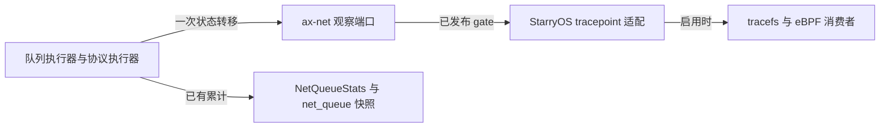

# 网络事件

网络事件把网络运行时的状态转移报成 `net:*` tracepoint，供 tracefs 与 eBPF 消费。事实由网络栈自己的状态所有者产生，`ax-net` 拥有事实与窄观察端口，StarryOS 拥有事件名称、记录格式与启用状态；事件可被关闭或丢弃，因此不能代替 `NetQueueStats`、`net_queue_snapshots()` 或 `/proc/net/dev` 的累计。

事件清单当前包含五个队列边界事件（`net:queue_poll_round`、`net:queue_rearm`、`net:queue_backpressure`、`net:tx_submit`、`net:rx_publish`）与一个协议执行器的事件 `net:proto_yield`。其余候选（IRQ、最终丢弃、协议侧交接边界）按各自准入条件逐项加入，未加入前不对外承诺字段。

## 1. 观察端口

`ax-net` 不依赖 StarryOS 或 `ax-tracepoint`，事件事实经一个窄观察端口交给操作系统适配层：

每个事件一个端口实例，对外只暴露 `install_<event>_observer()` 与 `publish_<event>_gate()`。端口契约：

- 每进程安装一次，重复安装同一函数幂等，替换存活消费者是不变量违背；端口不卸载。
- 报告只读一个已发布标志与一个函数指针槽，不分配、不读时钟、不取网络锁，可在队列执行器与协议执行器线程直接调用。
- 未安装端口等价于没有消费者：状态转换与结果不变。
- 安装发生在网络运行时已经运行之后，因此安装前完成的轮次不会被报告；这一段丢事件窗口是端口语义的一部分，不由缓存补偿。

`publish_<event>_gate()` 由 StarryOS 写入：启用事实仍由 `ax-tracepoint` 的门控拥有，运行时不维护第二份真相。查询 gate 与真正触发之间允许启停竞争，生成的事件函数仍会做最终门控检查。报告点在进入端口之前会组装报告值（一个 `Copy` 结构），这一步不受门控保护。

## 2. 事件清单

### 2.1 `net:queue_poll_round`

一次队列执行器 poll 调用返回时恰好报告一次，包括提前返回。报告的是一次队列轮询调用，不含其后的 IRQ rearm；未成功 `claim()` 因此没有进入 poll 的轮次不产生事件。

| 字段 | 类型 | 语义与约束 |
| --- | --- | --- |
| `discovery_order` | u32 | 设备在运行时输入列表中的位置；启动跳过设备后与接口发布序不同，只用于定位运行时内部设备。 |
| `group_id` | u32 | 驱动分配的队列组编号，仅在设备内唯一；`(discovery_order, group_id)` 才是 poll group 的键。 |
| `owner_cpu` | u32 | 建组时固定的队列归属 CPU，不是事件发生时的任意采样值。 |
| `budget` | u32 | 传给本次 poll 的 CPU 工作预算。它是本轮剩余预算，随同轮前序 group 递减，不是每队列固定值。 |
| `work_units` | u32 | 本次完成的执行器工作单位，含 TX 完成、TX 提交、RX 回收、RX 补投与 RX 取帧五类操作；不是帧数或包数，不能跨轮跨队列当作吞吐量比较。 |
| `outcome` | u32 | 固定数值：`0` 空闲、`1` 仍有工作、`2` 阻塞、`3` 失败。 |

结果码语义：

- `Idle`：本轮没有更多工作；调用方随后执行 IRQ rearm。
- `More`：预算耗尽，或 RX 补投暂时受阻但已有进展；两者都表示仍有工作，需要再调度。
- `Blocked`：TX 空闲槽、TX 提交或 RX 投递的目标环不可用，本轮就停在这里。
- `Failed`：本轮失败并禁用该 group。失败轮次同样携带失败前已完成的工作量，不把 `work_units` 填成零；轮内预算记账保持原有口径，不因报告而改变。

字段全部为固定宽度整数，转换在适配层进行并以饱和代替截断；运行时不会给出接近上限的值。

Linux 对照：本事件报告的事实对应 `napi:napi_poll` 的 `work` 与 `budget`。差异是结构性的——Starry 的队列执行器独立于 NAPI（不属于网络栈的软中断预算体系，因此不沿用 NAPI 的命名），`work_units` 是执行器工作单位而不是处理的包数，事件也不预计算耗时，不提供任何 duration 字段。

### 2.2 `net:queue_rearm`

只在 rearm **没有**以正常空闲结束时报告：一次 `finish_idle()` 至多一条，空闲结局不产生记录（它每轮都会发生，报它等于让 `queue_poll_round` 翻倍）。范围限于执行器空闲结束后的这次 rearm：建组初始化的 rearm 与 WiFi 控制事务里的 rearm（`run_wifi_step`）消费同样的设备结局但**不**产生记录，事件不承诺覆盖它们。

| 字段 | 类型 | 语义与约束 |
| --- | --- | --- |
| `discovery_order`/`group_id`/`owner_cpu` | u32 | 同 2.1 的身份字段。 |
| `outcome` | u32 | `0` 竞态、`1` 仍有工作、`2` 延迟重试、`3` 失败。 |

结果码语义：

- `Race`：轮询期间到达了新 IRQ，硬件 rearm 被跳过，group 直接回到已调度状态。
- `WorkPending`：rearm 窗口内发现工作，group 被重新调度；与本 group 的 `rearm_race` 计数同源同义。
- `RetryAt`：设备要求在某绝对时刻再次轮询。
- `Failed`：rearm 失败，group 被禁用。

Linux 对照：没有逐字段等价的通用网络事件；rearm 状态机是 Starry 自有边界。

### 2.3 `net:queue_backpressure`

报告设备**明确要求等待**而无法继续的每一次：TX 提交返回可重试（帧被保留）、RX 补投返回可重试（替换缓冲被保留）。协议端口不接受（`Again`）属于轮结局，不是本事件。

| 字段 | 类型 | 语义与约束 |
| --- | --- | --- |
| `discovery_order`/`group_id`/`owner_cpu` | u32 | 同 2.1。 |
| `stage` | u32 | `0` TX 提交、`1` RX 补投。 |
| `reason` | u32 | `0` 设备要求重试、`1` 链路不可用。 |

两个字段的可达组合不是全笛卡尔积：`1`（链路不可用）只在 `stage=0`（TX 提交）出现——TX 提交把它当可重试、帧被保留；RX 补投只接受重试，链路不可用在那里走整轮失败。因此 `(stage=1, reason=1)` 不会产生记录，消费者不应按全组合校验。

每次「可重试的未接纳」一条，不是每帧、不是每轮；重试成功后不会补发记录。设备返回**永久**错误不在此事件内：TX 侧该帧被回收放回空闲池，既不报接纳也不报背压，当前也没有队列侧计数；RX 侧整轮失败并由 `queue_poll_round` 的 `Failed` 报告。

Linux 对照：`net:net_dev_xmit` 报告发送结果、`napi:dql_stall_detected` 报告停滞，均非直接等价；本事件只报告 Starry 队列执行器观察到的设备层拒绝。

### 2.4 `net:tx_submit`

驱动接纳一帧时报告一次（逐帧事件）。**接纳不等于发出**：不表示硬件已经传输、也不表示 TX 完成；可重试的被拒提交由 `queue_backpressure` 报告，永久错误的拒绝两个事件都不产生记录（见 2.3）。

| 字段 | 类型 | 语义与约束 |
| --- | --- | --- |
| `discovery_order`/`group_id`/`owner_cpu` | u32 | 同 2.1。 |
| `frame_len` | u32 | 交给驱动的帧长（字节），已含以太网最小帧填充。 |

Linux 对照：`net:net_dev_start_xmit`/`net:net_dev_xmit` 是相近发送边界；本事件只覆盖「驱动接纳」这一步。

### 2.5 `net:rx_publish`

接收帧被发布到协议侧环时报告一次（逐帧事件）。发布失败（环满）不报告：帧留在执行器侧，下一轮再投。

| 字段 | 类型 | 语义与约束 |
| --- | --- | --- |
| `discovery_order`/`group_id`/`owner_cpu` | u32 | 同 2.1。 |
| `frame_len` | u32 | 帧长（字节）。 |

与将来的 `net:rx_consume` 不承诺逐帧配对（没有跨层帧 ID）；配对需要另有载体，当前不做。

Linux 对照：`net:netif_rx` 是相近的接收交接边界；本事件报告的是队列执行器把帧交给协议侧，不涉及协议分发结果。

### 2.6 `net:proto_yield`

协议执行器在预算检查处让出 CPU 时报告一次。**触发的是一次让出转移，不是一轮协议轮询**：执行器按固定预算（连续轮询次数与经过时间两个上限，先到者生效）获得 CPU，预算耗尽后投递延迟唤醒、让出 CPU、重置预算再继续，本事件报告的正是这一次让出。

| 字段 | 类型 | 语义与约束 |
| --- | --- | --- |
| `owner_cpu` | u32 | 协议执行器所在 CPU。执行器按亲和性固定在协议归属 CPU 上运行，因此这是它的归属 CPU，而不是事件发生时采样到的任意 CPU。 |
| `reason` | u32 | `0` 轮询次数上限、`1` 经过时间上限、`2` 同一次检查两个上限同时到达。 |
| `work_pending` | u32 | `0`/`1`：让出时协议侧是否仍有工作，即让出前那一轮是否报告还有工作。它区分「把 CPU 让给同 CPU 的设备所有者后仍会继续」与「让出后随即空闲」。 |

报告点不持任何网络锁：`get_service().poll(...)` 的锁守卫是语句临时值，语句结束即释放，让出分支执行时 `SERVICE` 与 `SOCKET_SET.inner` 都已不在持有中。

频率：预算只在让出时重置，因此连续轮询到达次数上限、或距上次重置已超过时间上限后的第一次轮询都会产生记录；轻载下通常每次唤醒周期至多一条（同一预算窗口内轮询不足 10 次且未超过时间上限的唤醒周期不产生记录）。判读该事件必须结合两个字段——`reason=0` 或 `reason=2`（次数上限到达）或 `work_pending=1` 才表示协议执行器在持续工作（协议侧饱和信号），`reason=1` 且 `work_pending=0` 才是让出后随即空闲的常规转换。

Linux 对照：Linux 没有同一个协议执行器对象；`napi:napi_poll` 的 `budget` 与 softirq 的重启预算只作边界范例。本事件不报告处理的包数，也不提供 duration 字段。

## 3. 启停与成本

- 事件由 `ax-tracepoint` 的每事件门控拥有。`tracefs` 的 `enable` 与 `perf`/BPF 附着都会改变回调集合，StarryOS 在回调集合变化的同一处把结果镜像到运行时的已发布标志。
- 镜像只在回调集合变化时更新，因此存在三种状态。**无回调**：队列执行器进入端口只付一次已发布标志读取与分支，不构造记录、不读时钟、不做格式化。**有回调且采集已启用**：完整付出记录构造与 `trace_pipe` 管线的成本。**有回调但采集未启用**（perf 附着后未 `enable`，或 `DISABLE` 之后）：镜像仍为真，事件函数照常被调用并遍历回调，最终由每个回调自己的启用位拦下——这一态按“无回调”以外处理，其开销与启用态同量级地走到分发入口。
- 事实所有者侧在进入端口前会组装报告值（本例是拷贝一个 `Copy` 结构），这一步发生在门控检查之前，编译器可以把它下沉到标志检查之后但不作保证；因此关闭态的准确口径是「一次已发布标志读取加分支，外加一次栈上报告值填充」。
- 逐帧事件（2.4、2.5）是成本上的主要观察对象：关闭态每帧付一次已发布标志读取与分支，外加一次栈上报告值填充，启用态每帧一条记录；记录进入固定容量的 ingress 环，高频负载下会丢弃（丢弃由 trace 侧计数，事件不承诺不丢）。现有测试没有量化这一成本，也从未宣称可忽略。
- 判定成本时区分度量对象：比较“端口已安装且事件关闭”与“事件开启”只能得到含 `trace_pipe` 管线的增量；端口本身的开销需要另一个“未安装端口”的对照构建，该对照列为合入后的板卡测量任务，不作为合入前的门槛。
- `net:proto_yield` 是每次让出一次的事件，不是每帧事件：关闭态每次让出付一次已发布标志读取，启用态每次让出一条记录，记录频度由协议执行器的预算决定，与帧量无直接关系。

## 4. 事件准入

新增候选事件前必须固定：事实所有者与唯一触发边界、是否可重试与是否算最终丢弃的区别、身份字段与设备重建稳定性、整数宽度与范围转换、以及该上下文能否安全执行消费者。硬 IRQ 路径下的候选（例如 `queue_irq`）在证明解释器、helper、映射与错误路径都不睡眠、不分配之前不实施，也不把任意 eBPF 程序放进 IRQ 现场。

## 5. 验收

- `ax-net` 单元测试覆盖：每次 poll 恰一条报告、提前返回不重复报告、失败轮次报告真实工作量、端口开关与有无消费者都不改变 `GroupPollOutcome`；rearm 的四种结局各自恰一条、背压只在可重试拒绝时出现且被拒帧不报为已提交、`tx_submit`/`rx_publish` 每次接纳/发布恰一条（含发布被拒时不报告）；协议执行的预算判定在次数上限、时间上限与两者同时三种情况下分类正确。
- StarryOS 系统用例 `qemu/system/net-events` 覆盖：六个事件都可发现且 `format` 声明了文档字段、关闭后同样流量不再产生记录；流量驱动的四个事件（`queue_poll_round`、`tx_submit`、`rx_publish`、`proto_yield`）还要证明启用时真实出现记录，并校验记录内部自洽（结果码在取值范围内、工作量不超过预算、帧长非零、owner CPU 落在在线集合内）。
- 覆盖边界：`queue_rearm` 的非空闲结局与 `queue_backpressure` 需要设备真的竞态或真的忙，QEMU 环境不保证触发；这两者的语义由 `ax-net` 单元测试覆盖——rearm 的四种结局、背压的 TX 提交重试、TX 提交链路不可用、RX 补投重试，以及「永久拒绝既不报接纳也不报背压」各有用例，系统用例只保证装配与格式。
- 覆盖边界：`proto_yield` 的触发边界在协议执行器线程的调度循环内，环路粘合无法在 host 单测里到达；单测覆盖的是预算分类，端口机制由其余五个事件共用的 `ObservationPort` 用例覆盖（`proto_yield` 自身没有直接的端口用例），真实触发由系统用例负责证明——系统用例对全部流量驱动事件统一等待，因此该事件在流量窗口内通常出现，机制上不保证每个唤醒周期都产生记录。
- eBPF 冒烟只证明 `load → attach → enable → read` 附着链路，不定义事件语义。
- 板卡测量（合入后）：对照构建比较未安装端口与已安装未启用的吞吐与 CPU，尾延迟指标在出现可靠载体前不列入。
