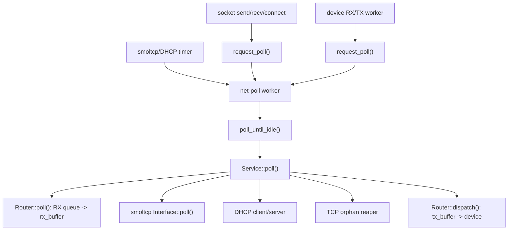
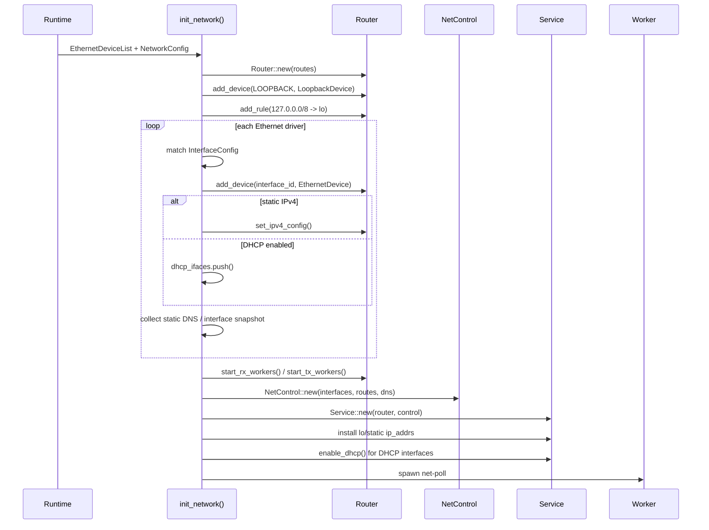
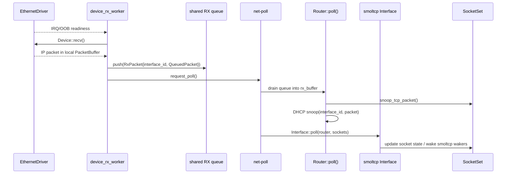
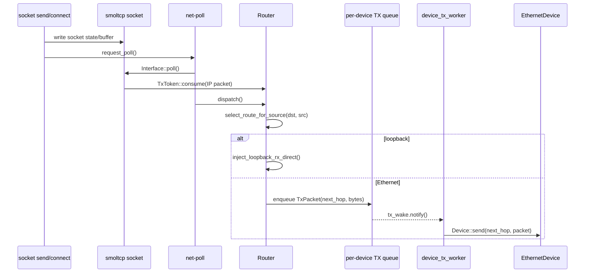

# 运行时流程

本文描述 `ax-net` 从初始化到运行期收发包、socket 阻塞等待、DHCP/DNS 和本地 transport 的关键流程。流程以源码中的真实边界为准：应用线程只修改 socket 状态并请求 poll，设备 worker 只搬运 packet，专用 net-poll worker 独占推进 smoltcp `Interface` 和全局 `SocketSet`。

核心流程涉及：

| 流程 | 关键源码 |
| --- | --- |
| 初始化 | [lib.rs](net/ax-net/src/lib.rs) `init_network()` |
| poll 主循环 | [lib.rs](net/ax-net/src/lib.rs) `net_poll_worker()` / `poll_until_idle()` |
| 协议推进 | [service.rs](net/ax-net/src/service.rs) `Service::poll()` |
| RX/TX dispatch | [router.rs](net/ax-net/src/router.rs) `Router::poll()` / `Router::dispatch()` |
| socket wait | [general.rs](net/ax-net/src/general.rs) `send_poller_with()` / `recv_poller_with()` |
| TCP passive open | [listen_table.rs](net/ax-net/src/listen_table.rs) / [router.rs](net/ax-net/src/router.rs) `snoop_tcp_packet()` |
| DHCP/DNS | [service.rs](net/ax-net/src/service.rs), [lib.rs](net/ax-net/src/lib.rs) |

## 总体时序

运行期只有一个协议核心 owner：net-poll worker。socket 调用者和设备 worker 都通过轻量唤醒把工作交给它。



## 初始化阶段

初始化阶段构造控制面、单协议核心和多设备数据面。`init_network()` 是一次性入口，重复调用会 panic。

### 配置校验

`init_network()` 首先校验 `NetworkConfig`：

- 接口名不能是保留名 `lo`。
- `dhcp = true` 不能同时配置 `static_ip`。
- 静态 IP 不能是 unspecified。
- 静态 prefix 不能大于 32。
- DNS server 不能是 unspecified。
- 每个显式 `InterfaceConfig` 必须匹配一个设备。
- 一个设备不能被多个 config 同时匹配。
- 接口名不能冲突。

网关 `0.0.0.0` 是有效配置，表示不安装默认路由。

### 设备与控制面构建



接口 ID 约定：

- `InterfaceId(1)` 固定为 `lo`。
- Ethernet 接口从 `InterfaceId(2)` 开始按设备发现顺序分配。
- `InterfaceId(0)` 是 Router TX 内部占位符，不出现在 public API。

### DHCP Bootstrap

如果存在 DHCP 接口，初始化末尾调用 `wait_for_dhcp_bootstrap()`：

```rust
fn wait_for_dhcp_bootstrap() {
    for _ in 0..DHCP_BOOTSTRAP_ATTEMPTS {
        request_poll();
        if get_service().dhcp_configured() {
            return;
        }
        ax_task::sleep(DHCP_BOOTSTRAP_POLL_INTERVAL);
    }
    warn!("DHCP bootstrap timed out");
}
```

bootstrap 等待只要求任一 DHCP 接口成功获得地址。这样一个断开的 DHCP 网口不会阻塞整个系统启动；未配置完成的接口后续仍由 net-poll worker 继续推进。

## Poll 主循环

poll 主循环由 `net-poll` 线程执行。它合并 socket、设备和 timer 唤醒，并通过 CAS 防止重入。

### request_poll

```rust
pub fn request_poll() {
    NET_POLL_REQUESTED.store(true, Ordering::Release);
    NET_POLL_WAKE.notify_one(true);
}
```

`request_poll()` 不执行协议栈，只设置标志并唤醒 worker。socket 热路径、设备 RX/TX worker、DHCP/DNS 查询都使用这个入口。

### poll_until_idle

```rust
fn poll_until_idle() {
    POLL_AGAIN.store(true, Ordering::Release);
    loop {
        if POLLING_INTERFACES
            .compare_exchange(false, true, Ordering::Acquire, Ordering::Acquire)
            .is_err()
        {
            return;
        }

        while POLL_AGAIN.swap(false, Ordering::AcqRel) {
            while poll_once() {}
        }
        POLLING_INTERFACES.store(false, Ordering::Release);
        if !POLL_AGAIN.load(Ordering::Acquire) {
            return;
        }
    }
}
```

`poll_once()` 的锁顺序是：

```text
SERVICE -> SOCKET_SET.inner -> Service::poll()
```

`poll_until_idle()` 在仍有工作时批量推进，不主动 yield。它是专用 worker，不需要在每个 packet 后让出给应用线程。

### Service::poll

`Service::poll()` 是协议核心的单轮调度。下面是保留关键顺序的简化示意：

```rust
pub fn poll(&mut self, sockets: &mut SocketSet) -> bool {
    let timestamp = now();
    let mut dhcp_events = Vec::new();
    let mut dhcp_server_replies = Vec::new();

    self.router.poll(timestamp, sockets, |interface_id, packet| {
        // DHCP client/server snoop
    });

    for event in dhcp_events {
        self.handle_dhcp_event(event);
    }
    let mut dhcp_server_sent = false;
    for (dev, reply) in dhcp_server_replies {
        dhcp_server_sent |= self.router.send_on_device(
            dev,
            IpAddress::Ipv4(Ipv4Address::BROADCAST),
            &reply,
            timestamp,
        );
    }

    let socket_state_changed =
        self.iface.poll(timestamp, &mut self.router, sockets) == PollResult::SocketStateChanged;
    let dhcp_poll_next = self.poll_dhcp(timestamp);
    crate::orphan::reap_orphans(timestamp, sockets);

    self.router.dispatch(timestamp, sockets)
        || dhcp_poll_next
        || dhcp_server_sent
        || socket_state_changed
}
```

顺序约束：

- `Router::poll()` 在 smoltcp 前执行，让新 RX packet 进入 `rx_buffer`。
- DHCP snoop 在 smoltcp 消费 packet 前执行，保留 ingress `InterfaceId`。
- DHCP ACK/NAK 先生成 `NetworkStateUpdate`，再提交到 smoltcp address list、控制面和 route table。
- `Router::dispatch()` 在 smoltcp 后执行，把本轮生成的 TX packet 送出。

## 数据面流程

数据面由 RX path、TX path 和 loopback fast path 组成。真实设备通过 worker 和有界队列与协议核心解耦。

### RX Path



数据结构转换：

```text
driver RX buffer
  -> device_rx_worker local PacketBuffer
  -> shared BoundedPacketQueue<RxPacket>
  -> Router.rx_buffer
  -> RxToken -> smoltcp Interface::poll()
```

`RxPacket` 保存 ingress `InterfaceId`，用于 DHCP 分发和诊断。队列满时丢包并记录 warning，避免网络热路径无界增长。

### TX Path



dispatch 规则：

- IPv4 limited broadcast 发往所有非 loopback 设备。
- IPv4/IPv6 单播按 `(dst, src)` 查 `select_route_for_source()`。
- 源地址必须与 route rule 的 source 一致，避免多宿主环境下从错误接口发包。
- loopback 目的地直接写入 `Router.rx_buffer`。
- 普通设备 TX 进入 per-device `tx_queue`，由 TX worker 调用 `Device::send()`。

### Loopback Fast Path

loopback 普通 TX 不进入设备队列：

```text
Router.tx_buffer
  -> Router::dispatch()
  -> inject_loopback_rx_direct()
  -> Router.rx_buffer
  -> next Service::poll() / same idle loop
```

`inject_loopback_rx_direct()` 在写入 RX buffer 前调用 `snoop_tcp_packet()`，因此 loopback TCP SYN 可以在同一轮 poll 中预创建 accept child socket。

### ARP / Neighbor

Ethernet TX 需要把 IP packet 发送到 next-hop MAC：

```text
Device::send(next_hop, ip_packet)
  -> neighbor cache hit: encapsulate Ethernet frame + transmit
  -> miss with pending ARP: queue packet in pending_packets
  -> miss without pending ARP: send ARP request + queue packet
```

入站 ARP reply 或 gratuitous ARP 会更新 neighbor 表，并释放等待该 next hop 的 pending packet。neighbor TTL 为 300 秒，ARP retry 间隔为 1 秒。

## Socket 流程

socket 流程只修改 socket 状态并注册 waker；协议状态机推进交给 net-poll worker。

### TCP Connect

```text
TcpSocket::connect(remote)
  -> choose/bind local endpoint
  -> control plane route/source decision
  -> smoltcp tcp::Socket::connect()
  -> state = Connecting
  -> request_poll()
  -> poll_io waits for OUT or error
```

连接完成由 smoltcp 在后续 `Interface::poll()` 中推进。`Pollable::register()` 同时注册 smoltcp send/recv waker 和设备 readiness waker。

### TCP Listen / Accept

```text
TcpSocket::listen(backlog)
  -> register endpoint in LISTEN_TABLE
  -> state = Listening

incoming SYN
  -> Router::poll()
  -> snoop_tcp_packet()
  -> LISTEN_TABLE.incoming_tcp_packet()
  -> create child smoltcp TCP socket
  -> enqueue PendingTcp
  -> smoltcp consumes SYN and advances child state

TcpSocket::accept()
  -> LISTEN_TABLE.accept()
  -> return first acceptable child
  -> construct connected TcpSocket
```

accept readiness 由 `ListenTableEntryInner.accept_poll` 维护。pending child 的 recv/send readiness 会唤醒 listener 的 accept waiters。

### TCP/UDP Send-Recv

通用阻塞逻辑来自 `GeneralOptions`：

```rust
pub fn send_poller_with<P: Pollable, F: FnMut() -> AxResult<T>, T>(
    &self,
    pollable: &P,
    extra_nonblocking: bool,
    f: F,
) -> AxResult<T> {
    block_on(timeout(
        self.send_timeout(),
        poll_io(pollable, IoEvents::OUT, self.nonblocking() || extra_nonblocking, f),
    ))?
}
```

`poll_io()` 流程：

1. 先执行一次操作闭包。
2. 成功则返回。
3. `WouldBlock` 且 nonblocking/`MSG_DONTWAIT` 则立即返回。
4. 否则注册 waker 并挂起。
5. 被 socket readiness、设备 readiness 或 timeout 唤醒后重试。

UDP connected socket 在 recv 时过滤 peer；`MSG_MORE` 会把多次 send 合并为一个 datagram，并固定第一次 send 的 remote/source。

### Raw Socket

raw socket 处理 IP 层 packet：

- send 时按 remote 选择 source，或使用显式绑定地址。
- loopback ICMP 走本地快速路径。
- connected raw socket 使用 peer filter。
- `deferred_rx` 保存被 peer filter 暂存的 wire packet，保证 `MSG_PEEK` 和后续 recv 不破坏 packet 格式。

## 控制协议流程

控制协议不是独立线程，它们挂在 `Service::poll()` 中运行。

### DHCP Client

DHCP 状态机：

```text
Discovering --Offer--> Requesting --ACK--> Bound
      ^          |          |                 |
      |          |          +--NAK/reset------+
      +--retry---+--timeout/retry-------------+
```

入站 packet 路径：

```text
Router::poll()
  -> snoop(interface_id, packet)
  -> DhcpState::process_packet(interface_id, packet, timestamp)
  -> DhcpEvent::Configured / Deconfigured
  -> Service::handle_dhcp_event()
  -> commit_network_state()
```

提交内容：

- smoltcp `Interface` IP address list。
- `NetControl.state.interfaces` 的 IPv4/gateway。
- DNS registry。
- route table 中该接口的 IPv4 rules。

出站 DHCP packet 由 `poll_dhcp()` 生成，再通过 `Router::send_on_device()` 从指定设备广播。

### DHCP Server

内置 DHCP server 用于 SoftAP 场景。它在 Router RX snoop 中接收 Discover/Request，生成 Offer/Ack 后通过 `send_on_device()` 从绑定设备发出。它不依赖 smoltcp DHCP socket。

### DNS Query

```text
dns_query_timeout(name, timeout)
  -> dns_servers()
  -> filter routable DNS server by control plane route lookup
  -> SOCKET_SET.add(dns::Socket)
  -> start_query()
  -> loop:
       request_poll()
       get_query_result()
       pending -> yield / timeout check
  -> DnsSocketGuard::drop() removes socket
```

错误语义：

- 无 DNS server：`NotFound`。
- DNS server 不可路由：`NoSuchDeviceOrAddress`。
- 查询超时：`TimedOut`。
- DNS socket 无 free slot：`ResourceBusy`。
- 名称非法或过长：`InvalidInput`。

## Local Transport 流程

AF_UNIX 和 AF_VSOCK 不通过 smoltcp `Interface`，但复用 `SocketOps` 和 `Pollable`。

### Unix Stream / Datagram

Unix socket 使用 `Transport` 分发：

```text
UnixSocket
  -> Transport::Stream(StreamTransport)
  -> Transport::Dgram(DgramTransport)
```

abstract namespace 存在内存 map 中；path namespace 通过 `register_unix_namespace()` 注入。Unix stream accept 使用 transport 自己的 `Pollable` 和 `poll_io()`，不调用 `request_poll()`。

### Vsock Stream

vsock 只在 `vsock` feature 下启用：

```text
VsockSocket
  -> VsockTransport::Stream
  -> vsock::connection_manager
  -> rdif_vsock::Interface event path
```

vsock 不进入 `SocketSet`，也不使用 Router。设备事件由 vsock device/event loop 推进。

## 并发与锁边界

运行时流程需要维持固定边界，避免应用线程、设备 worker 和协议核心互相阻塞。

### 典型锁路径

```text
net-poll:
  SERVICE -> SOCKET_SET.inner -> Service::poll()

Router RX/TX:
  Router queue locks -> RouteTable read lock -> per-device TX queue

device worker:
  DeviceHandle.inner -> Device::recv/send -> bounded queue -> request_poll()

TCP listen/accept:
  SOCKET_SET.inner -> LISTEN_TABLE bucket

control query:
  NetControl.state -> RouteTable
```

禁止路径：

- 设备 worker 进入 `Service` 或 `SocketSet`。
- socket 热路径同步执行完整 interface poll。
- 持设备锁等待 socket readiness。
- 持 `SocketSet` 锁做可能阻塞的用户 IO。

## 流程速查

| 场景 | 入口 | 推进者 | 结果 |
| --- | --- | --- | --- |
| 应用发送 TCP 数据 | `TcpSocket::send()` | net-poll worker | smoltcp 生成 IP packet，Router dispatch 到设备 |
| 设备收到包 | `device_rx_worker` | net-poll worker | Router RX buffer，smoltcp 处理 socket 状态 |
| TCP accept | `Router::poll()` SYN snoop + `accept()` | net-poll worker | child socket 进入 accept queue |
| DHCP 获取地址 | `DhcpState::process_packet()` | `Service::poll()` | 更新接口、route、DNS 和 smoltcp 地址 |
| DNS 查询 | `dns_query_timeout()` | caller + net-poll worker | 临时 DNS socket 查询并自动移除 |
| Unix socketpair | `UnixSocket` transport | transport PollSet | 不经过 smoltcp/Router |
