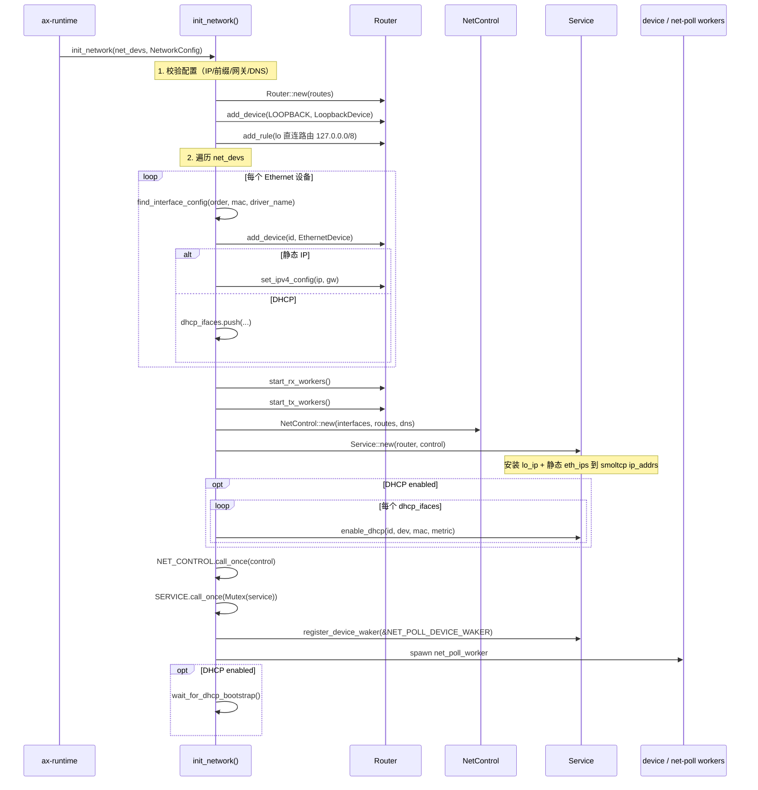
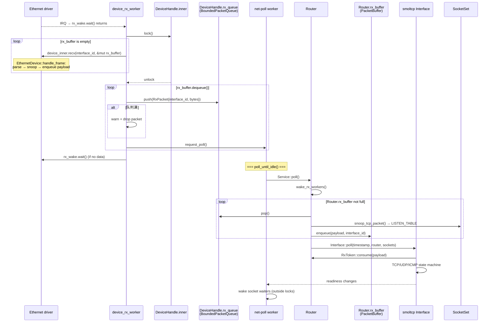
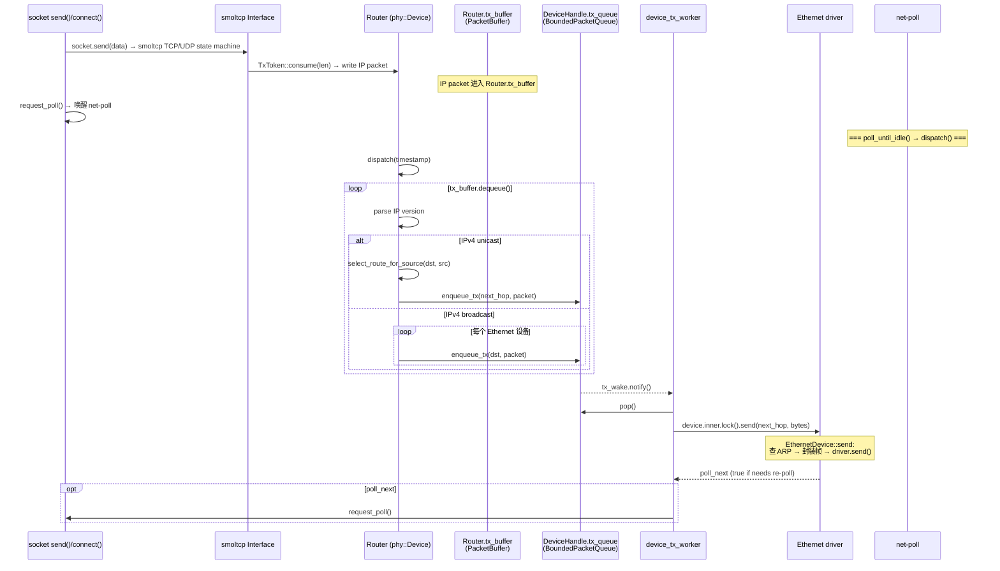
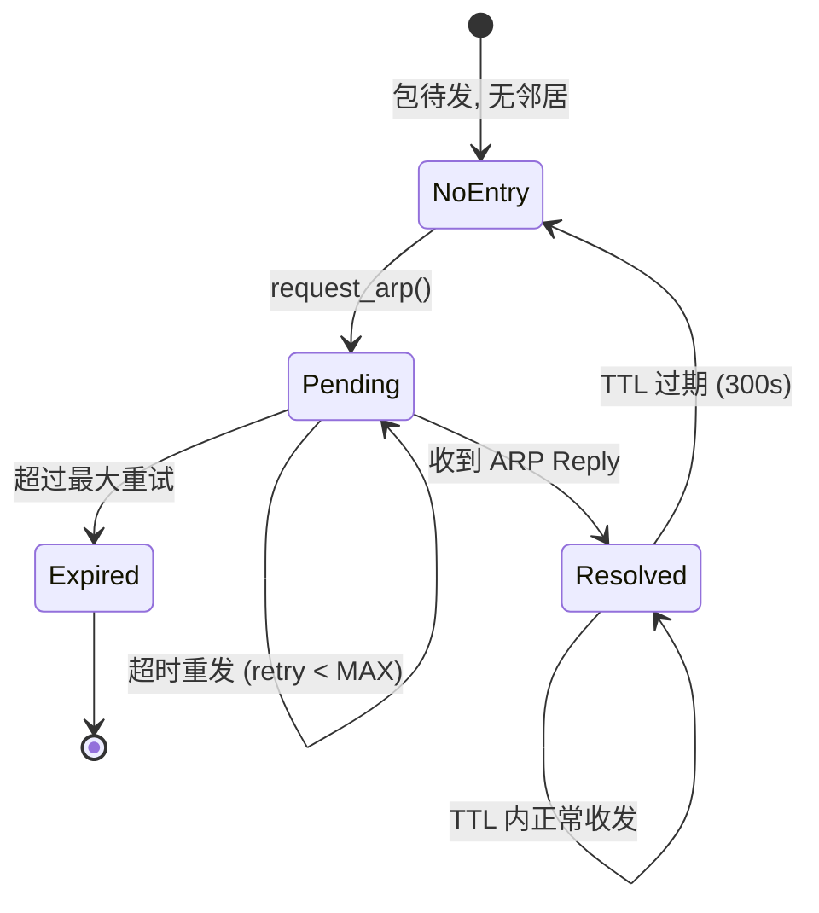
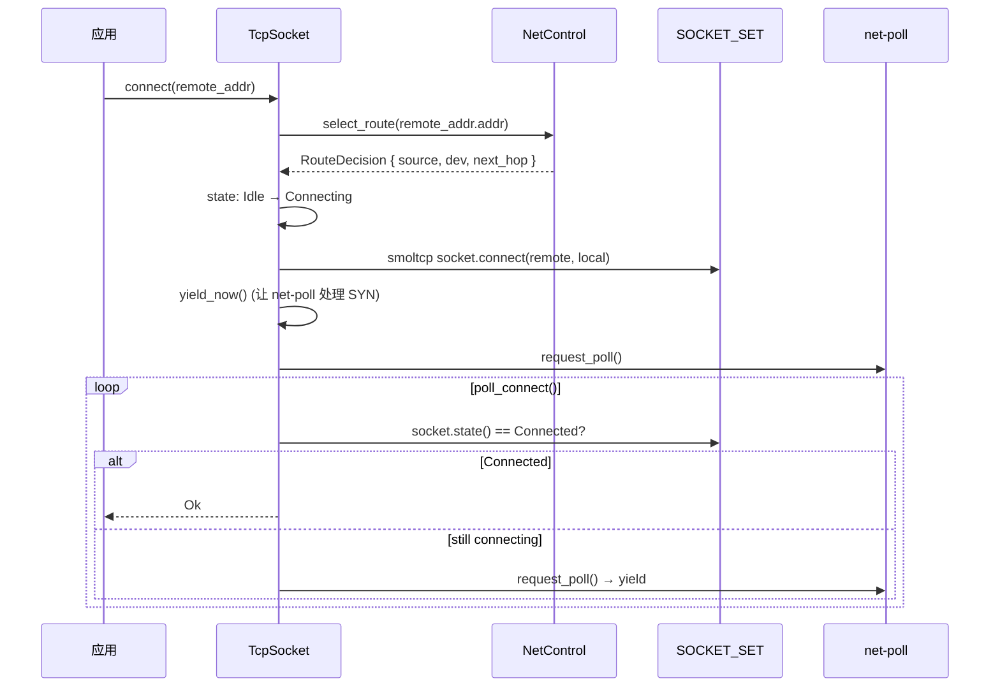
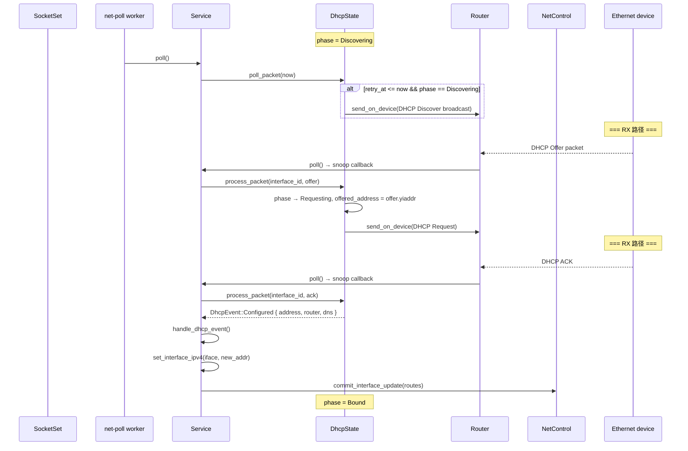
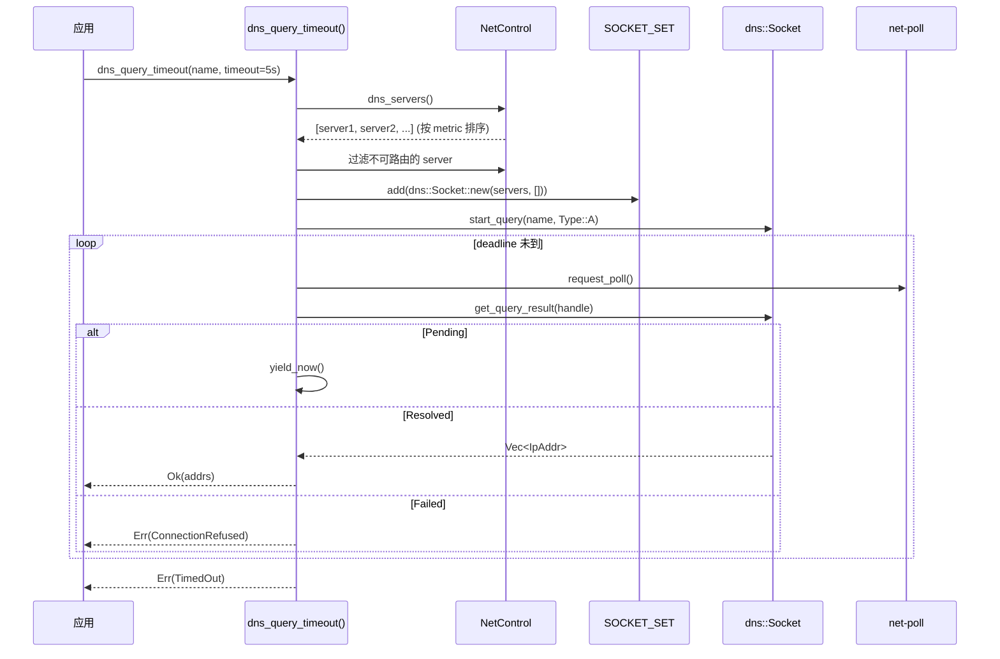
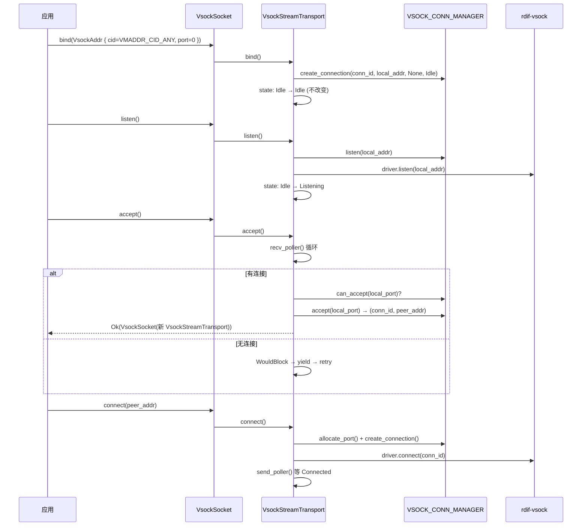
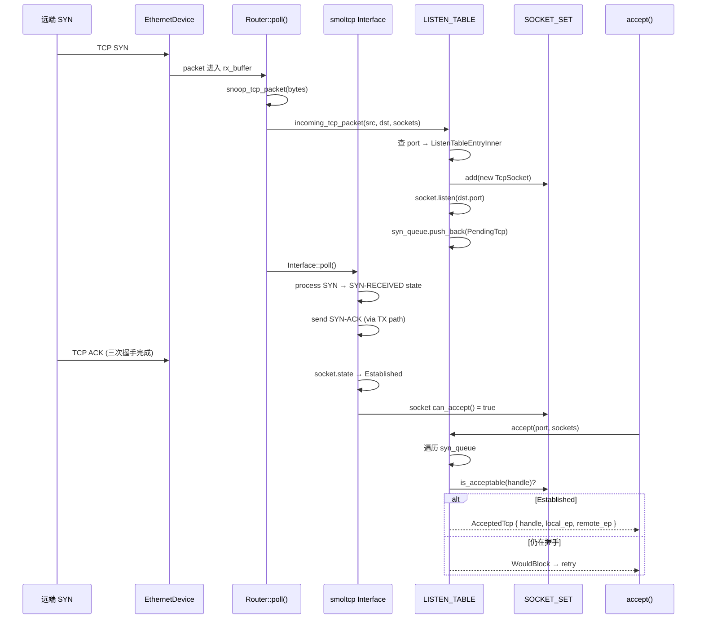

# 运行时流程

本章详述 `ax-net` 的初始化、收包、发包、ARP、TCP/UDP socket 操作、DHCP、DNS 和 poll 循环的完整运行路径。每个流程给出精确的锁获取顺序、数据结构转换和错误处理分支。

---

## 1. 初始化流程

入口 `init_network()` 在 [net/ax-net/src/lib.rs#L125](net/ax-net/src/lib.rs#L125)。



### 步骤详解

**步骤 1 — 配置校验**（[lib.rs#L132-L168](net/ax-net/src/lib.rs#L132-L168)）

对每个 `InterfaceConfig`：

- 名字不能是 `"lo"`（保留）。
- `dhcp` 和 `static_ip` 不能同时配置。
- 静态 IP 不能是 `0.0.0.0`（unspecified）。
- 静态前缀长度不能超过 32。
- 静态网关不能是 `0.0.0.0`。
- 所有 DNS server 都不能是 unspecified。

不满足则 `panic!`（启动阶段配置错误应 fail-fast）。

**步骤 2 — 创建 loopback**（[lib.rs#L184-L201](net/ax-net/src/lib.rs#L184-L201)）

```rust
let lo_id = InterfaceId::LOOPBACK;           // InterfaceId(1)
let lo_dev = router.add_device(lo_id, Box::new(LoopbackDevice::new()));
let lo_ip = Ipv4Cidr::new(Ipv4Address::new(127,0,0,1), 8);
router.add_rule(Rule::new(lo_ip.into(), None, lo_dev, lo_id, lo_ip.address().into(), 0));
```

Loopback 设备注册后，立即安装直连路由 `127.0.0.0/8 → lo_dev`，源地址 `127.0.0.1`，metric 0。`LoopbackDevice` 的 `send()`/`recv()` 直接在内部 buffer 中回环，不经过 Ethernet 帧封装。

**步骤 3 — 注册 Ethernet 设备**（[lib.rs#L205-L292](net/ax-net/src/lib.rs#L205-L292)）

对每个 driver 提供的 `EthernetDevice`（顺序由 `net_devs.drain(..)` 决定）：

1. 计算 `default_name = "eth{order}"`。
2. 用 `find_interface_config()` 匹配 `InterfaceConfig`。匹配方式由 `InterfaceMatcher` 决定：`ByOrder`、`ByMac` 或 `ByDriverName`（[lib.rs#L328-L356](net/ax-net/src/lib.rs#L328-L356)）。如果有多个 config 匹配同一设备则 panic。
3. 检查接口名冲突。
4. 分配 `InterfaceId`：`order + 2`（0 保留给 placeholder，1 是 loopback）。
5. 调用 `router.add_device()` 将 `EthernetDevice` 包装为 `DeviceHandle`，注册到 `Router::devices` 列表。
6. **静态接口**：调用 `router.set_ipv4_config()` 安装直连路由和默认路由（如果有 gateway）。
7. **DHCP 接口**：推入 `dhcp_ifaces` 向量，稍后在 `Service` 中启用。

匹配完成后，检查 `used_configs`：如果某个配置没有匹配到任何设备，则 panic（[lib.rs#L294-L301](net/ax-net/src/lib.rs#L294-L301)）。

**步骤 4 — 启动 worker 线程**（[lib.rs#L305-L306](net/ax-net/src/lib.rs#L305-L306)）

```rust
router.start_rx_workers();   // 每个 Ethernet DeviceHandle 一个 RX worker
router.start_tx_workers();   // 每个 Ethernet DeviceHandle 一个 TX worker
```

RX worker 入口 `device_rx_worker`（[router.rs#L596-L626](net/ax-net/src/router.rs#L596-L626)），TX worker 入口 `device_tx_worker`（[router.rs#L584-L596](net/ax-net/src/router.rs#L584-L596)）。Loopback 不需要 worker。

**步骤 5 — 构建 Service 和控制面**（[lib.rs#L308-L323](net/ax-net/src/lib.rs#L308-L323)）

```rust
let control = Arc::new(NetControl::new(interfaces, routes, dns));
let mut service = Service::new(router, control.clone());
service.iface.update_ip_addrs(|ip_addrs| {
    ip_addrs.push(lo_ip.into()).unwrap();
    for ip in eth_ips { ip_addrs.push(ip.into()).unwrap(); }
});
```

`NetControl` 持有接口 registry、路由表和 DNS 来源的可读快照。`Service` 持有 `smoltcp::Interface`、`Router` 和 `NetControl` 的引用。smoltcp 的 `ip_addrs` 在此阶段注入 loopback 和所有静态接口的 IP。

DHCP 接口的 IP 在 ACK 后由 `commit_network_state()` → `set_interface_ipv4()` 动态注入。

**步骤 6 — 注册全局单例并启动 poll worker**（[lib.rs#L325-L332](net/ax-net/src/lib.rs#L325-L332)）

```rust
NET_CONTROL.call_once(|| control);
SERVICE.call_once(|| Mutex::new(service));
get_service().register_device_waker(&NET_POLL_DEVICE_WAKER);
ax_task::spawn_with_name(net_poll_worker, "net-poll".to_owned());
```

`NET_POLL_DEVICE_WAKER` 是一个 `NetPollWake` 实例，其 `wake()` 直接调用 `request_poll()`（[lib.rs#L455-L464](net/ax-net/src/lib.rs#L455-L464)）。这样当设备 driver 有新数据可读时，能直接唤醒 net-poll worker。

**步骤 7 — DHCP bootstrap 等待**（[lib.rs#L333-L335](net/ax-net/src/lib.rs#L333-L335)）

```rust
if dhcp_enabled { wait_for_dhcp_bootstrap(); }
```

`wait_for_dhcp_bootstrap()`（[lib.rs#L613-L624](net/ax-net/src/lib.rs#L613-L624)）循环最多 `DHCP_BOOTSTRAP_ATTEMPTS` 次，每次 `request_poll()` + `sleep(DHCP_BOOTSTRAP_POLL_INTERVAL)`，检查 `dhcp_configured()` 是否为 true。

关键策略：**只要任一 DHCP 接口配置成功就返回**（[service.rs#L490-L496](net/ax-net/src/service.rs#L490-L496)）。这避免了一个断网的 DHCP 网卡阻塞整个系统启动。

超时后只打印 warning，不 panic。未配置的 DHCP 接口后续仍可在运行时异步完成配置。

---

## 2. 接收（RX）流程



### 步骤详解

**步骤 1 — RX worker 唤醒**（[router.rs#L596-L626](net/ax-net/src/router.rs#L596-L626)）

RX worker 在 `device.rx_wake.wait()` 上阻塞。设备 driver 收到 IRQ 或被其他路径唤醒后，调用 `rx_wake.notify_one()` 唤醒 worker。

Worker 使用一个本地 `PacketBuffer`（容量 1，大小 `STANDARD_MTU`）作为从 driver 读取的临时 buffer：

```rust
let mut rx_buffer = PacketBuffer::new(vec![PacketMetadata::EMPTY; 1], vec![0u8; STANDARD_MTU]);
```

**步骤 2 — 从设备读取**（持设备锁）

```rust
let mut device_inner = device.inner.lock();   // 获取设备写锁
let mut snoop = |_packet: &[u8]| {};           // 空 snoop（已在 Router::poll 中做 TCP snoop）
while rx_buffer.is_empty()
    && device_inner.recv(device.interface_id, &mut rx_buffer, now(), &mut snoop)
{
    received = true;
}
// 释放设备锁
```

`EthernetDevice::recv()`（[device/ethernet.rs](net/ax-net/src/device/ethernet.rs#L230)）内部流程：

1. 从 driver 的 RX ring 取一帧。
2. 用 `EthernetFrame::new_unchecked()` 解析帧头。
3. 检查目的 MAC：广播/空 MAC/自身 MAC 才接受，否则丢弃。
4. `EthernetProtocol::Ipv4` → `snoop(payload)` + `buffer.enqueue(len, interface_id)` + `copy_from_slice`。
5. `EthernetProtocol::Arp` → `process_arp()`（见 ARP 流程）。
6. 其他 ethertype → 丢弃。

**步骤 3 — 推入有界 RX 队列**（释放设备锁后）

```rust
while let Ok((interface_id, packet)) = rx_buffer.dequeue() {
    let rx = RxPacket { interface_id, bytes: packet.to_vec().into_boxed_slice() };
    if device.rx_queue.push(rx).is_err() {
        warn!("{}: RX queue is full, dropping packet", device.name);
        break;
    }
    crate::request_poll();   // 每包唤醒 net-poll worker
    received = true;
}
```

`rx_queue` 是 `BoundedPacketQueue`，容量 `SOCKET_BUFFER_SIZE = 64`（[consts.rs#L12](net/ax-net/src/consts.rs#L12)）。队列满时丢弃剩余包并 break，避免在队列已满时继续从 driver 拷贝。

**步骤 4 — Router drain 共享 RX 队列**

`net-poll` worker 被唤醒后进入 `poll_until_idle()` → `Service::poll()`。`Service::poll()` 首先调用 `Router::poll()`（[router.rs#L434-L455](net/ax-net/src/router.rs#L434-L455)）：

```rust
while !self.rx_buffer.is_full() {
    let Some(packet) = self.queues.rx.pop() else { break; };
    snoop_tcp_packet(&packet.bytes, sockets);    // 预创建 listen socket
    snoop(packet.interface_id, &packet.bytes);    // DHCP snoop 回调
    let Ok(dst) = self.rx_buffer.enqueue(packet.bytes.len(), packet.interface_id) else {
        warn!("Router RX buffer is full, dropping packet");
        break;
    };
    dst.copy_from_slice(&packet.bytes);
}
```

`Router.rx_buffer` 是 smoltcp 的 `phy::Device` RX token 来源。smoltcp 在 `Interface::poll()` 中通过 `Router::receive()` 从 `rx_buffer` 取出一个包构造 `RxToken`（[router.rs#L680-L700](net/ax-net/src/router.rs#L680-L700)）。

**步骤 5 — TCP SYN 预探测**

`snoop_tcp_packet()`（[router.rs#L640-L678](net/ax-net/src/router.rs#L640-L678)）在交付 smoltcp 前解析 IP 头和 TCP 头：

- 如果是 `SYN && !ACK`（连接首包），调用 `LISTEN_TABLE.incoming_tcp_packet(src, dst, sockets)`。
- `LISTEN_TABLE` 检查是否有 socket 在 `(src_ip, dst_port)` 上 listen。
- 如果是，在 `SocketSet` 中预创建一个 `smoltcp::socket::tcp::Socket`，使其处于 `SYN-RECEIVED` 状态。
- 这样当 smoltcp 正式处理这个 SYN 时，已经有 socket 接收它，避免 SYN 被丢弃。

**步骤 6 — smoltcp 协议处理**

`self.iface.poll(timestamp, &mut self.router, sockets)` 在持有 `Service` 锁和 `SocketSet` 锁时执行。smoltcp 从 `Router`（作为 `phy::Device`）获取 RxToken，调用 `RxToken::consume()` 将 payload 交给 TCP/UDP/ICMP 状态机处理。

处理结果反映在 `SocketSet` 中各 socket 的 readiness 上。poll 返回后，等待者在外部（不持锁）被唤醒。

### RX 数据结构转换链

```
driver RX ring
  → [copy] PacketBuffer (local, capacity=1, MTU=1500)
  → [copy] BoundedPacketQueue (per-device, capacity=64)
  → [copy] Router.rx_buffer (PacketBuffer, shared, capacity from smoltcp config)
  → [zero-copy ref] RxToken → smoltcp Interface::poll
```

每次 hop 最多一次内存拷贝。最坏路径有 3 次拷贝（driver → local buffer → queue → router buffer），但通过有界队列控制了背压。

---

## 3. 发送（TX）流程



### 步骤详解

**步骤 1 — Socket 层写入**

TCP socket 的 `send()`（[tcp.rs#L489-L514](net/ax-net/src/tcp.rs#L489-L514)）：

```rust
fn send(&self, mut src: impl Read, options: SendOptions) -> AxResult<usize> {
    let extra_nb = options.flags.contains(crate::SendFlags::DONTWAIT);
    let result = self.general.send_poller_with(self, extra_nb, || {
        request_poll();    // 请求 poll 驱动协议栈
        self.with_smol_socket(|socket| {
            if !socket.is_active() { Err(AxError::NotConnected) }
            else if !socket.can_send() { Err(AxError::WouldBlock) }
            else {
                let len = socket.send(|buffer| {
                    let result = src.read(buffer);
                    let len = result.unwrap_or(0);
                    (len, result)
                }).map_err(|_| ax_err_type!(NotConnected))??;
                Ok(len)
            }
        })
    });
    if result.is_ok() { request_poll(); }  // 写入后再请求一次 poll 触发发送
    result
}
```

`send_poller_with` 是一个通用 poller：在闭包返回 `WouldBlock` 时注册 waker 并让出任务，直到有 `IoEvents::OUT` 事件再次唤醒。

数据写入 smoltcp socket 的 TX buffer 后，**socket 层不直接发送**。发送发生在 smoltcp `Interface::poll()` 时。

**步骤 2 — smoltcp 生成 IP 包**

在 `Service::poll()` 中，`self.iface.poll()` 驱动 TCP/UDP 状态机。当 socket 有待发送数据且发送窗口允许时，smoltcp 构造 IP 包并通过 `phy::Device` 的 `TxToken::consume()` 输出。

`Router` 实现了 smoltcp 的 `phy::Device` trait，`transmit()` 返回 `TxToken`（[router.rs#L660-L678](net/ax-net/src/router.rs#L660-L678)）：

```rust
fn transmit(&mut self, _timestamp: Instant) -> Option<Self::TxToken<'_>> {
    if self.tx_buffer.is_full() { None }
    else { Some(TxToken(&mut self.tx_buffer)) }
}
```

`TxToken::consume()` 将 smoltcp 构造的 IP 包写入 `Router.tx_buffer`，metadata 设为 `TX_INTERFACE_PLACEHOLDER`（占位符，出接口由 `dispatch()` 决定）。

**步骤 3 — Router::dispatch() 选择出接口**（[router.rs#L498-L557](net/ax-net/src/router.rs#L498-L557)）

`dispatch()` 在 smoltcp `Interface::poll()` 返回后执行，从 `tx_buffer` 取出 IP 包：

```rust
while let Ok((_, packet)) = self.tx_buffer.dequeue() {
    match IpVersion::of_packet(packet).expect("got invalid IP packet") {
        IpVersion::Ipv4 => {
            let packet = Ipv4Packet::new_checked(packet).expect("got invalid IPv4 packet");
            let src_addr = IpAddress::Ipv4(packet.src_addr());
            let dst_addr = IpAddress::Ipv4(packet.dst_addr());
            if packet.dst_addr().is_broadcast() {
                // 广播：发往所有 Ethernet 设备（不含 loopback）
                for dev in &self.devices {
                    if dev.interface_id != InterfaceId::LOOPBACK {
                        poll_next |= dev.enqueue_tx(dst_addr, packet.into_inner());
                    }
                }
            } else {
                // 单播：按 (源地址, 目的地址) 查路由
                let routes = self.table.read();
                let Some(route) = routes.select_route_for_source(&dst_addr, &src_addr) else {
                    warn!("No route found for source {} destination {}", src_addr, dst_addr);
                    continue;    // 丢包但不 panic
                };
                let dev = &self.devices[route.dev];
                poll_next |= dev.enqueue_tx(route.next_hop, packet.into_inner());
            }
        }
        IpVersion::Ipv6 => { /* 类似逻辑 */ }
    }
}
```

关键点：

- **出接口不由 socket binding 决定**，而是由 IP 包的 `(源地址, 目的地址)` 在路由表中查 `select_route_for_source()` 决定。
- 源地址由 smoltcp 根据 socket binding 或 connect 时的路由查询结果注入。
- 广播包发往所有 Ethernet 设备。
- 查不到路由时 `warn!` + `continue`，不 panic。

**步骤 4 — 推入 per-device TX 队列**

`DeviceHandle::enqueue_tx()` 将 `TxPacket { next_hop, bytes }` 推入 `tx_queue`（同样是 `BoundedPacketQueue`）。如果队列满，返回 `true` 表示需要重新 poll（`poll_next`）。

**步骤 5 — TX worker 发送**（[router.rs#L584-L596](net/ax-net/src/router.rs#L584-L596)）

```rust
fn device_tx_worker(device: Arc<DeviceHandle>) {
    loop {
        if let Some(packet) = device.tx_queue.pop() {
            let poll_next = device.inner.lock().send(packet.next_hop, &packet.bytes, now());
            if poll_next { crate::request_poll(); }
        } else {
            device.tx_wake.wait_until(|| !device.tx_queue.is_empty());
        }
    }
}
```

`EthernetDevice::send()` 内部：

1. 查 `neighbors` 表获取下一跳的 MAC 地址。
2. 如果找到：封装 Ethernet 帧（`src=自身MAC, dst=邻居MAC, ethertype=IPv4`），调用 `driver.send()`。
3. 如果没找到：请求 ARP（见 ARP 流程），包暂存在 `pending_packets` 队列。

**步骤 6 — ARP 完成后发送暂存包**（[device/ethernet.rs#L330](net/ax-net/src/device/ethernet.rs#L330)）

ARP reply 到达后，`process_arp()` 查到邻居 MAC，drain `pending_packets` 队列：

```rust
let mut kept: Vec<(IpAddress, Vec<u8>)> = Vec::with_capacity(ETHERNET_MAX_PENDING_PACKETS);
for _ in 0..ETHERNET_MAX_PENDING_PACKETS {
    let Ok((&next_hop, buf)) = self.pending_packets.peek() else { break; };
    let action = match self.neighbors.get(&next_hop) {
        Some(neighbor) => Action::Send(neighbor.hardware_address, buf),
        None => Action::Keep(buf),    // 保留不匹配的包，避免头阻塞
    };
    // ...
}
```

重要策略：drain 遍历所有暂存包，**不从头阻塞**。如果一个不可达 IP 的包在队列头部，不会阻止后面可达 IP 的包发送。

### TX 数据结构转换链

```
socket.send(data)
  → [copy] smoltcp socket TX buffer
  → [smoltcp 内部] IP packet 构造
  → [TxToken::consume → copy] Router.tx_buffer
  → [dispatch → copy] DeviceHandle.tx_queue
  → [EthernetDevice::send → copy] driver TX buffer
```

---

## 4. ARP / 邻居发现流程



### 步骤详解

**ARP 请求**（[device/ethernet.rs#L278-L310](net/ax-net/src/device/ethernet.rs#L278-L310)）

当 `EthernetDevice::send()` 发现下一跳 IP 不在 `neighbors` 表中时，调用 `request_arp()`：

1. 构造 `ArpRepr::EthernetIpv4 { Request, src_mac=self.mac, src_ip=self.ip, target_mac=EMPTY, target_ip=next_hop }`。
2. 用 `send_to()` 通过 driver 发送广播 ARP 请求帧。
3. 将 `(target_ip, PendingNeighbor { requested_at: now })` 插入 `pending_neighbors`。
4. 将待发送的 IP 包存入 `pending_packets` 有界队列。

**ARP 响应处理**（[device/ethernet.rs#L312-L405](net/ax-net/src/device/ethernet.rs#L312-L405)）

收到 ARP 帧时 `process_arp()`：

1. 解析 ARP 包。
2. 检查目的 MAC（unicast 才检查是否是自身）。
3. 验证源 MAC 和源 IP 合法性（unicast MAC, 非 broadcast/multicast/unspecified IP）。
4. 如果是 Request 且目标是自己：构造 Reply 发回。
5. **无论 Request 还是 Reply**：更新 `neighbors` 表（`src_ip → src_mac, expires_at=now+NEIGHBOR_TTL`）。
6. 从 `pending_neighbors` 移除该 IP。
7. Drain `pending_packets`，发送所有下一跳已解析的包。

**邻居表 TTL**

- `NEIGHBOR_TTL = 300s`（5 分钟）。
- 过期后条目从 `neighbors` 移除，后续发送触发新的 ARP 请求。
- `pending_neighbors` 中的条目在 `poll_dhcp` 或下一次发送时检查 `requested_at`，超时后重发 ARP。

---

## 5. TCP Socket 操作流程

### 5.1 Connect



`TcpSocket::connect()`（[tcp.rs#L415-L432](net/ax-net/src/tcp.rs#L415-L432)）：

1. `start_connect()` 查路由获取源地址，在 smoltcp socket 上调用 `connect()`。
2. **`ax_task::yield_now()`** — 这是一个 hack：让出当前任务，让 net-poll worker 有机会处理 SYN 发送和 SYN-ACK 接收。
3. 在 `send_poller` 闭包中循环 `poll_connect()`，每次 `request_poll()` 触发协议栈推进。
4. 连接成功返回 `Ok(())`，连接失败返回对应错误（`ConnectionRefused` 等）。

### 5.2 Listen + Accept

`listen()`（[tcp.rs#L434-L462](net/ax-net/src/tcp.rs#L434-L462)）：

1. 状态转换 `Idle → Listening`。
2. 分配端口（如果未绑定）。
3. 在 `LISTEN_TABLE` 注册 `(port, backlog)`。
4. 设置 `DeviceBinding`。

`accept()`（[tcp.rs#L464-L487](net/ax-net/src/tcp.rs#L464-L487)）：

```rust
fn accept(&self) -> AxResult<Socket> {
    let bound_port = self.bound_endpoint()?.port;
    self.general.recv_poller(self, || {
        request_poll();
        let accepted = {
            let mut sockets = SOCKET_SET.inner.lock();
            LISTEN_TABLE.accept(bound_port, &mut sockets)?
        };
        Ok(TcpSocket::new_connected(accepted.handle, ...).into())
    })
}
```

Accept 依赖 RX 流程中的 `snoop_tcp_packet()` 预创建 socket。当 SYN 到达时，listen table 已在 SocketSet 中创建了 SYN-RECEIVED socket。三次握手完成后，`LISTEN_TABLE.accept()` 将该 socket 从 listen pool 移出并返回。

### 5.3 Send / Recv

见 TX 流程中的 TCP send 部分。TCP `recv()`（[tcp.rs#L516-L561](net/ax-net/src/tcp.rs#L516-L561)）在 `recv_poller_with` 中循环读取 smoltcp socket 的 RX buffer，直到用户 buffer 填满或 RX 队列空。

---

## 6. UDP Socket 操作流程

### 6.1 Send

UDP `send()`（[udp.rs#L236-L353](net/ax-net/src/udp.rs#L236-L353)）比 TCP 多了几个分支：

1. **MSG_MORE corking**：如果 `SendFlags::MORE` 被设置，数据缓存在 `self.cork` 中而非立即发送。Cork buffer 上限 `UDP_TX_BUF_LEN`。后续不带 MORE 的 send 会 flush cork buffer。
2. **目标地址解析**：connected socket 用 `remote_endpoint()`，unconnected socket 用 `options.to`。
3. **路由选择**：`select_route(dst_addr)` 获取源地址。
4. **smoltcp socket.send()**：写入 UDP payload + metadata（endpoint, local_address）。

零长度 UDP payload（只有 IP+UDP 头）是合法的，smoltcp `send(0, ...)` 处理。

### 6.2 Recv

UDP `recv()`（[udp.rs#L364-L425](net/ax-net/src/udp.rs#L364-L425)）：

```rust
fn recv(&self, mut dst: impl Write, mut options: RecvOptions) -> AxResult<usize> {
    // 确定 expected_remote：Any(addr_out) / AnyDiscard / Expecting(connected_peer)
    self.general.recv_poller_with(self, extra_nb, || {
        request_poll();
        self.with_smol_socket(|socket| {
            if !socket.can_recv() { Err(AxError::WouldBlock) }
            else {
                let result = socket.recv();   // 或 peek() for MSG_PEEK
                match result {
                    Ok((src, meta)) => {
                        // 检查 expected_remote 匹配
                        // 写入 dst，处理 truncation
                    }
                    Err(Exhausted) => Err(WouldBlock),
                }
            }
        })
    })
}
```

Connected UDP socket 只接受来自 peer 的包，其他包返回 `WouldBlock`。

---

## 7. DHCP 流程



### 步骤详解

**DhcpState 结构**（[service.rs#L242-L275](net/ax-net/src/service.rs#L242-L275)）

```rust
struct DhcpState {
    interface_id: InterfaceId,
    dev: usize,
    ifname: String,
    mac: EthernetAddress,
    metric: u32,
    transaction_id: u32,      // 由 MAC 派生，见 dhcp_transaction_id()
    phase: DhcpPhase,         // Discovering → Requesting → Bound
    retry_at: Instant,
    retry: usize,
    offered_address: Option<Ipv4Address>,
    server_identifier: Option<Ipv4Address>,
    address: Option<Ipv4Cidr>,
    dns_servers: Vec<Ipv4Address>,
}
```

**状态机转换**（[service.rs#L313-L402](net/ax-net/src/service.rs#L313-L402)）

`process_packet()` 按 `(phase, message_type)` 驱动：

| 当前 phase | 收到消息 | 动作 |
| --- | --- | --- |
| Discovering | Offer | 验证 yiaddr 是 unicast；记录 offered_address + server_id；phase → Requesting |
| Requesting | ACK | 解析 subnet_mask → prefix_len；验证 yiaddr；phase → Bound；返回 `DhcpEvent::Configured` |
| Bound | ACK | 更新地址（续约） |
| 任意 | NAK | reset；如果之前已配置则返回 `DhcpEvent::Deconfigured` |

**DHCP 包构造**

`poll_packet()`（[service.rs#L434-L460](net/ax-net/src/service.rs#L434-L460)）在 retry 到期时构造 DHCP Discover 或 Request：

- 使用 `dhcp_transaction_id()`（由 MAC 派生，[service.rs#L694](net/ax-net/src/service.rs#L694)）。
- `DHCP_PARAMETER_REQUEST_LIST = [1, 3, 6, 42]`（subnet mask, router, DNS, NTP）。
- 指数退避：`retry` 最大位移 `DHCP_MAX_RETRY_SHIFT = 4`。

**ACK 后状态提交**（[service.rs#L534-L612](net/ax-net/src/service.rs#L534-L612)）

`handle_dhcp_event(DhcpEvent::Configured)` → `commit_network_state()`：

1. `set_interface_ipv4(iface, old_addr, new_addr)` — 更新 smoltcp `ip_addrs`：移除旧地址，添加新地址。
2. `router.ipv4_rules()` — 生成直连路由 + 默认路由（如果有 gateway）。
3. `control.commit_interface_update()` — 在 `NetControl` 的 state 中更新接口 IPv4、gateway，替换该接口的 DNS 条目，替换路由表中该接口的 IPv4 规则。

**Bootstrap 等待策略**

`dhcp_configured()`（[service.rs#L490-L496](net/ax-net/src/service.rs#L490-L496)）只需**任一** DHCP 接口配置成功即返回 true。这确保一个断网的网卡不会阻塞启动。

---

## 8. DNS 查询流程



### 步骤详解

`dns_query_timeout()`（[lib.rs#L494-L510](net/ax-net/src/lib.rs#L494-L510)）：

1. 获取 DNS server 列表（DHCP + 静态 + fallback，去重排序）。
2. 用 `select_route()` 过滤掉不可路由的 server。
3. 创建临时 `dns::Socket`，加入 `SocketSet`。
4. `start_query()` 发起 A 记录查询。
5. 循环 `request_poll()` + `get_query_result()`，超时由 monotonic clock 判断。
6. `DnsSocketGuard` 的 `Drop` 自动移除 socket，避免泄漏。

超时常量：`DNS_DEFAULT_TIMEOUT = 5s`（[lib.rs#L488](net/ax-net/src/lib.rs#L488)）。

---

## 9. Poll 循环与 Waker 机制

### request_poll() 轻量唤醒

所有热路径（socket send/recv/connect/drop、设备 RX/TX、timer）只调用 `request_poll()`（[lib.rs#L408-L411](net/ax-net/src/lib.rs#L408-L411)）：

```rust
pub fn request_poll() {
    NET_POLL_REQUESTED.store(true, Ordering::Release);
    NET_POLL_WAKE.notify_one(true);
}
```

- `NET_POLL_REQUESTED` 是一个 `AtomicBool`，Release store 保证可见性。
- `NET_POLL_WAKE` 是一个 `Waker`（基于 `ax_task`），`notify_one(true)` 表示如果已有 pending wake 则合并（不重复唤醒）。

### net-poll worker 主循环

```rust
fn net_poll_worker() {
    loop {
        let delay = next_poll_delay();
        let timed_out = NET_POLL_WAKE.wait_timeout_until(delay,
            || NET_POLL_REQUESTED.load(Ordering::Acquire));
        if !timed_out {
            NET_POLL_REQUESTED.store(false, Ordering::Release);
        }
        poll_until_idle();
    }
}
```

1. `next_poll_delay()`（[lib.rs#L437-L460](net/ax-net/src/lib.rs#L437-L460)）向 smoltcp 询问下一次 poll 截止时间（TCP retransmit、DHCP retry、keep-alive 等），结合 monotonic clock 计算睡眠时长。空闲时回退到 100ms。
2. `wait_timeout_until()` 等待 wake 或超时。
3. 被 wake 唤醒（非超时）时清除 `NET_POLL_REQUESTED` 标志。
4. 进入 `poll_until_idle()`。

### poll_until_idle() 原子互斥

```rust
fn poll_until_idle() {
    POLL_AGAIN.store(true, Ordering::Release);
    loop {
        // CAS 获取 POLLING_INTERFACES 锁
        if POLLING_INTERFACES.compare_exchange(false, true, Acquire, Acquire).is_err() {
            return;    // 已有其他 poller 在运行
        }
        while POLL_AGAIN.swap(false, AcqRel) {
            while poll_once() {}    // 循环直到 smoltcp 返回 idle
        }
        POLLING_INTERFACES.store(false, Release);
        if !POLL_AGAIN.load(Acquire) { return; }
    }
}
```

- `POLLING_INTERFACES`：原子标志，保证同一时刻只有一个线程进入协议栈。
- `POLL_AGAIN`：在 poll 期间如果有新的 `request_poll()` 到来，设置此标志使循环重新执行。

### poll_once() 锁顺序

```rust
fn poll_once() -> bool {
    get_service().poll(&mut SOCKET_SET.inner.lock())
}
```

`Service::poll()` 内部锁顺序固定为：

```
1. Service lock (get_service())
2. SocketSet lock (SOCKET_SET.inner.lock())
   ├─ Router::poll()      — drain RX queue → rx_buffer
   ├─ smoltcp Interface::poll(timestamp, router, sockets)
   │   ├─ Router::receive() / Router::transmit()  (phy::Device trait)
   │   └─ TCP/UDP/ICMP state machine
   ├─ Router::dispatch()  — tx_buffer → per-device tx_queue
   └─ poll_dhcp()         — DHCP retry packets
3. 释放 SocketSet lock
4. 释放 Service lock
5. wake socket waiters (在锁外部)
```

**严格禁止**：

- 禁止在持有设备锁（`DeviceHandle.inner`）时进入 `Service` 或 `SocketSet` 锁。
- 禁止在持有 control-plane 写锁（`NetControl.state.write()`）时进入 smoltcp poll。
- 锁的获取和释放严格嵌套，不允许跨层级持有。

### Waker 注册路径

Socket 的 `register()` 将 task waker 注册到 `general.waker` 中。当 smoltcp poll 改变 socket readiness 后，`Service::poll()` 返回，poll worker 在释放锁后调用各 socket 的 waker：

```
socket.send/recv/connect returns WouldBlock
  → general.recv_poller / send_poller registers waker
  → task yields
  → net-poll worker calls poll_until_idle()
  → smoltcp updates socket readiness
  → poll worker wakes registered wakers
  → task resumes, retries send/recv
```

`NetPollWake` 实现了 `core::task::Wake` trait（[lib.rs#L455-L464](net/ax-net/src/lib.rs#L455-L464)），使设备 driver 可以通过标准 waker 接口唤醒 poll worker。

---

## 流程总结

| 流程 | 热路径入口 | 锁层级 | 延迟来源 |
| --- | --- | --- | --- |
| RX | IRQ → rx_wake → rx_worker → rx_queue | 设备锁 → RX 队列（无 Service 锁） | driver recv + 1 次 copy |
| TX | socket.send → smoltcp buffer → dispatch → tx_queue | Service 锁 → SocketSet 锁 → 路由表读锁 | smoltcp TCP 状态机 + ARP |
| TCP connect | socket.connect → smoltcp connect → yield → poll | Service 锁 → SocketSet 锁 | RTT × 1.5（SYN + SYN-ACK） |
| DHCP | poll_dhcp → send_on_device → RX → process_packet | Service 锁 → 路由表写锁 | DHCP server 响应时间 |
| DNS | dns_query_timeout → add socket → poll loop | Service 锁 → SocketSet 锁 | DNS server RTT |
| Poll | request_poll → net-poll worker → poll_until_idle | POLLING_INTERFACES 原子 → Service 锁 → SocketSet 锁 | smoltcp poll duration |

---

## 10. Unix Domain Socket 流程

### 10.1 Stream Transport（socketpair / connect-accept）

Unix stream 基于 `ringbuf::HeapRb` 实现全双工双向通道。`new_channels(pid)` 创建一对交叉连接的 `Channel`：

```rust
(client_tx → server_rx) + (server_tx → client_rx)
shared: poll_update (Arc<PollSet>), cmsg queues (s2c + c2s)
```

**Bind + Listen + Accept 流程**：

1. `bind(addr)` — 在 `ABSTRACT_BINDS` 或 `UnixNamespace` 中注册 `BindSlot`（stream bind + dgram bind）。Stream bind 存储在 `slot.stream: Mutex<Option<stream::Bind>>`。
2. `listen()` — Unix 中为 no-op（`Bind` 已准备就绪）。
3. `accept()` — `block_on(transport.accept())`，内部 `bind.inner.accept.recv()` 阻塞等对端的 `connect()` 调用。

**Connect 流程**：

1. `connect(remote_addr)` — 查 `with_slot(remote_addr, |slot| transport.connect(slot, local_addr))`。
2. `StreamTransport::connect()` 创建新的 `(client_channel, server_channel)` 对。
3. 将 `server_channel` 通过 `bind.inner.accept.send(server_channel)` 推给监听端。
4. 返回后，对端 accept 解除阻塞，两端各自持有 `client_channel` / `server_channel`。

**Cmsg 管道**：

- 每个 `Channel` 维护 `tx_cmsg` 和 `rx_cmsg` 两个 `CmsgQueue`（`Arc<Mutex<VecDeque<PendingCmsg>>>`）。
- `sendmsg` 时记录 `start_byte = tx_bytes_total + 1, end_byte = start_byte + len - 1`，推入 `tx_cmsg`。
- `recvmsg` 时从 `rx_cmsg` 前端检查：如果 `rx_bytes_total >= entry.start_byte`，释放 cmsg 给调用者；同时用 `end_byte` 限制本次 recv 长度（cmsg 边界语义）。

### 10.2 Datagram Transport

Unix datagram 基于 `async_channel::unbounded()` 无界通道：

```rust
struct Packet {
    data: Vec<u8>,
    cmsg: Vec<CMsgData>,
    sender: UnixSocketAddr,
}
```

**Bind**：注册 slot 时创建 `(tx, rx)` 通道对，`tx` 存入 `Bind` 供 connect/send 方使用，`rx` 存入 `DgramTransport::data_rx`。

**Connect**：从 slot 获取 `Bind::connect()`（Clones `data_tx`），更新 `connected: RwLock<Option<Channel>>`。

**Send**：读取用户数据到 `Vec<u8>`，构造 `Packet`，通过 `connected.data_tx.try_send()` 或查 `with_slot(options.to, |slot| slot.dgram.lock().as_ref().unwrap().data_tx.try_send())` 发送。

**Recv**：从 `data_rx.recv()` 或 `try_recv()` 取 `Packet`，处理 cmsg、包截断、sender address。

**SO_PASSCRED**：设置后 `send()` 自动添加 `UnixCredentials` 到每个包的 cmsg 中。

---

## 11. Vsock Stream 流程

Vsock 基于 `rdif-vsock` 驱动 + 全局 `VSOCK_CONN_MANAGER`：



Connection Manager（[vsock/connection_manager.rs](net/ax-net/src/vsock/connection_manager.rs)）维护 per-connection 状态机：`Idle → Listening/Connecting → Connected → Closed`。

Vsock stream 的 send/recv 直接从 `Connection` 的 ring buffer 读写数据。

### 11.1 Driver 事件处理（vsock-poll worker）

`vsock-poll` 是独立的 vsock 轮询线程（[device/vsock.rs](net/ax-net/src/device/vsock.rs)），引用计数管理（`start_vsock_poll`/`stop_vsock_poll`），自适应轮询频率（100μs → 500μs → 2ms → 10ms 的四级退避）。

`handle_vsock_event()` 将 driver 的 4 类事件分派给 `VSOCK_CONN_MANAGER`：

| 事件 | handler | 动作 |
| --- | --- | --- |
| `VsockEvent::ConnectionRequest` | `on_connection_request()` | 查 `listen_queues` → 创建新 `Connection`（state=Connected） → 推入 `AcceptQueue` → `wake()` 唤醒 accept 等待者 |
| `VsockEvent::Received` | `on_data_received()` | 查 `connections` → `push_rx_data()` 写入 RX ring buffer → `wake_rx()` 唤醒 recv 等待者 |
| `VsockEvent::Disconnected` | `on_disconnected()` | 查 `connections` → state=Closed, rx_closed=true, tx_closed=true → `wake_rx()` 通知 recv 端 EOF |
| `VsockEvent::Connected` | `on_connected()` | 查 `connections` → state=Connected → `wake_connect()` 唤醒 connect 等待者 |
| `VsockEvent::CreditUpdate` | `on_credit_update()` | 查 `connections` → `tx_wait_queue_notify()` 唤醒因 buffer 空间不足而等待的 send 调用 |

`VsockEvent::Received` 的特殊处理：如果 `Connection` RX buffer 已满（`rx_buffer_free() == 0`），事件重新推入 `PENDING_EVENTS` 全局队列，下次 poll 再尝试，避免数据丢失。

---

## 12. ICMP Loopback Echo 流程

`RawSocket::send()` 对 loopback 地址有特殊处理（[raw.rs](net/ax-net/src/raw.rs#L188-L203)）：

1. 检查目的地址是否是 loopback（`127.0.0.1` 或 `::1`）。
2. 如果是，**不经过 smoltcp 发送**。而是解析 ICMP echo request（type=8, code=0）。
3. 调用 `build_loopback_icmp_reply()`：将 type 改为 0（echo reply），清空 code，重新计算 ICMP checksum。
4. 将 reply 存入 `self.loopback_rx` 队列。
5. 下次 `recv()` 时优先消费 `loopback_rx` 中的内容。

这允许 `ping 127.0.0.1` 在不需要完整 IP stack 回环的情况下正确工作。

---

## 13. TCP Accept 完整流程图



关键状态检查：

- `is_closed_without_data()`：TCP socket 处于 `Closed/TimeWait/Closing/LastAck` 且无未读数据 → 跳过并从 `SocketSet` 移除。
- `is_acceptable()`：TCP state 为 `Established/CloseWait/FinWait1/FinWait2/Closing/LastAck/TimeWait` → 可以 accept，应用可通过 `recv()` 读取已到达数据或获知 EOF。
- `SYN_RECEIVED` → 不可 accept，仍在握手中。
