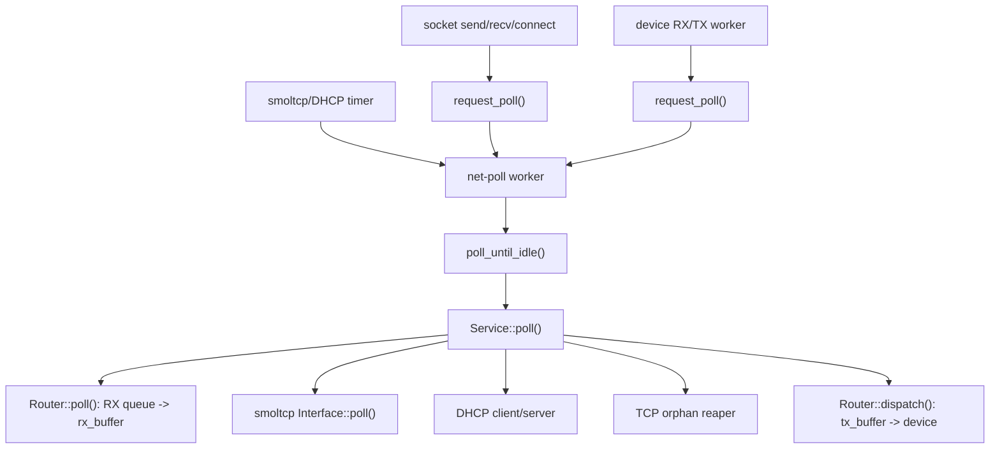
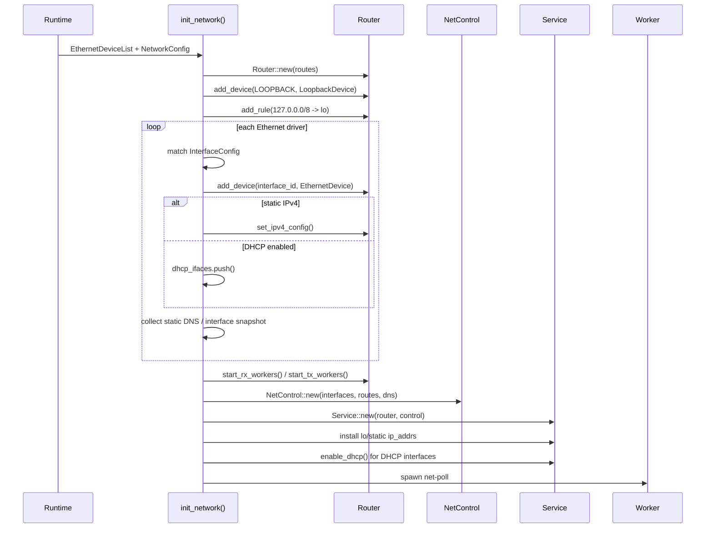
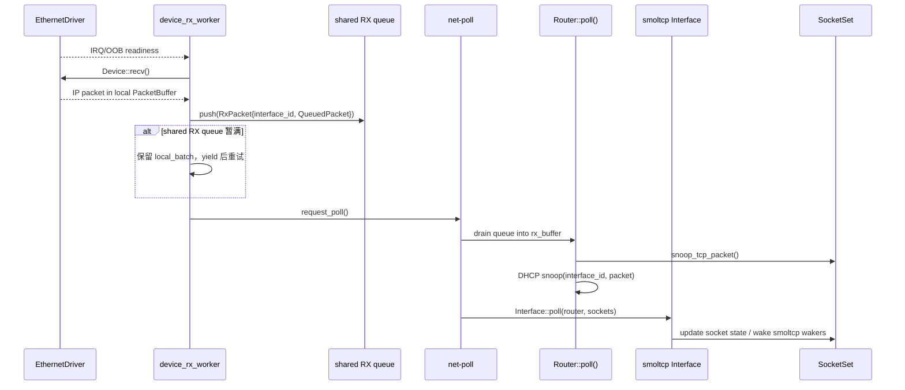
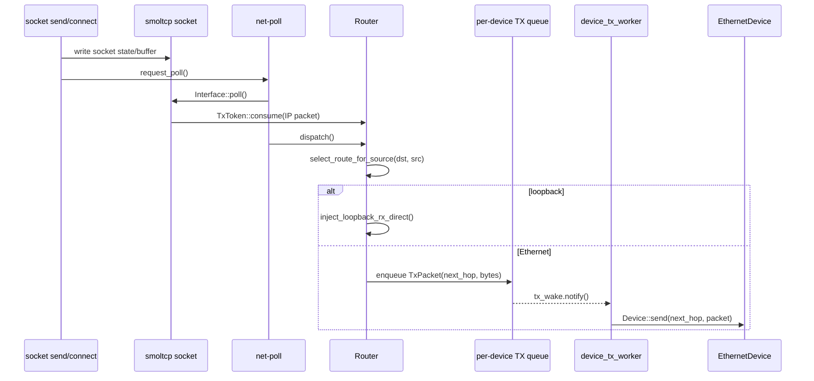
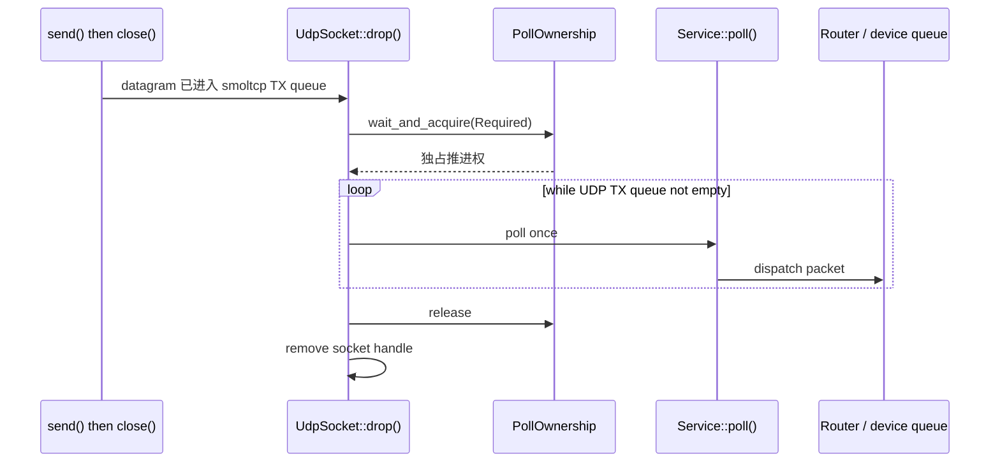

# 运行时流程

本文描述 `ax-net` 从初始化到运行期收发包、socket 阻塞等待、DHCP/DNS 和本地 transport 的关键流程。流程以源码中的真实边界为准：普通应用路径修改 socket 状态并请求 poll，设备 worker 只搬运 packet，`PollOwnership` 保证 smoltcp `Interface` 和全局 `SocketSet` 串行推进。

核心流程涉及：

| 流程 | 关键源码 |
| --- | --- |
| 初始化 | `lib.rs` `init_network()` |
| poll 主循环 | `lib.rs` `net_poll_worker()` / `poll_until_idle()` |
| 协议推进 | `service.rs` `Service::poll()` |
| RX/TX dispatch | `router.rs` `Router::poll()` / `Router::dispatch()` |
| socket wait | `general.rs` `send_poller_with()` / `recv_poller_with()` |
| TCP passive open | `listen_table.rs` / `router.rs` `snoop_tcp_packet()` |
| DHCP/DNS | `service.rs`, `lib.rs` |

源码表覆盖初始化、轮询、Router、socket 和本地 transport 五类流程所有者。总体时序先展示这些对象如何围绕一个协议推进者协作，后续章节再分别展开状态与异常分支。

## 1. 总体时序

运行期只有一个协议核心 owner：net-poll worker。socket 调用者和设备 worker 都通过轻量唤醒把工作交给它。


```mermaid
flowchart TB
    App["socket send/recv/connect"] --> Req1["request_poll()"]
    Dev["device RX/TX worker"] --> Req2["request_poll()"]
    Timer["smoltcp/DHCP timer"] --> Worker["net-poll worker"]
    Req1 --> Worker
    Req2 --> Worker

    Worker --> Poll["poll_until_idle()"]
    Poll --> Service["Service::poll()"]
    Service --> RouterPoll["Router::poll(): RX queue -> rx_buffer"]
    Service --> Iface["smoltcp Interface::poll()"]
    Service --> Dhcp["DHCP client/server"]
    Service --> Orphan["TCP orphan reaper"]
    Service --> Dispatch["Router::dispatch(): tx_buffer -> device"]
```

所有触发源都只产生轮询请求，`poll_until_idle()` 才是进入 `Service::poll()` 的统一入口。初始化阶段必须先建立这些对象和通知通道，之后应用与设备事件才能沿图中路径安全汇合。

## 2. 初始化阶段

初始化阶段构造控制面、单协议核心和多设备数据面。`init_network()` 是一次性入口，重复调用会 panic。

### 2.1 配置校验

`init_network()` 首先校验 `NetworkConfig` 中的接口匹配、名称、静态地址和路由约束，再构造任何全局状态或后台任务。fail-fast 使配置错误不会留下半初始化 `SERVICE`，也让后续设备与控制面构建可以依赖已验证输入。

- 接口名不能是保留名 `lo`。
- `dhcp = true` 不能同时配置 `static_ip`。
- 静态 IP 不能是 unspecified。
- 静态 prefix 不能大于 32。
- DNS server 不能是 unspecified。
- 每个显式 `InterfaceConfig` 必须匹配一个设备。
- 一个设备不能被多个 config 同时匹配。
- 接口名不能冲突。

网关 `0.0.0.0` 是有效配置，表示不安装默认路由。

### 2.2 设备与控制面构建

初始化构建时，`init_network()` 先把 loopback 和发现到的 Ethernet driver 加入 `Router`，再据静态配置或 DHCP 角色建立 `NetControl` 与 `Service`。时序图突出全局单例和 Worker 必须在接口、路由及 smoltcp 地址准备完成后发布，避免后台线程观察到半初始化状态。


```mermaid
sequenceDiagram
    participant Runtime
    participant Init as init_network()
    participant Router
    participant Control as NetControl
    participant Service
    participant Worker

    Runtime->>Init: EthernetDeviceList + NetworkConfig
    Init->>Router: Router::new(routes)
    Init->>Router: add_device(LOOPBACK, LoopbackDevice)
    Init->>Router: add_rule(127.0.0.0/8 -> lo)
    loop each Ethernet driver
        Init->>Init: match InterfaceConfig
        Init->>Router: add_device(interface_id, EthernetDevice)
        alt static IPv4
            Init->>Router: set_ipv4_config()
        else DHCP enabled
            Init->>Init: dhcp_ifaces.push()
        end
        Init->>Init: collect static DNS / interface snapshot
    end
    Init->>Router: start_rx_workers() / start_tx_workers()
    Init->>Control: NetControl::new(interfaces, routes, dns)
    Init->>Service: Service::new(router, control)
    Init->>Service: install lo/static ip_addrs
    Init->>Service: enable_dhcp() for DHCP interfaces
    Init->>Worker: spawn net-poll
```

接口 ID 约定：

- `InterfaceId(1)` 固定为 `lo`。
- Ethernet 接口从 `InterfaceId(2)` 开始按设备发现顺序分配。
- `InterfaceId(0)` 是 Router TX 内部占位符，不出现在 public API。

构建阶段列表说明 `Service`、控制面和 Worker 在同一初始化入口中按顺序发布，静态接口此时已经可用。DHCP bootstrap 只为动态接口提供有限启动等待，不重新构造这些对象。

### 2.3 DHCP Bootstrap

如果存在 DHCP 接口，初始化末尾调用 `wait_for_dhcp_bootstrap()` 等待至少一个动态接口获得可用配置，而不是等待所有 NIC 成功。该边界避免断开的次要网卡阻塞系统启动，同时仍允许网络轮询 Worker 继续推进其 DHCP 状态。

```rust
fn wait_for_dhcp_bootstrap() {
    for _ in 0..DHCP_BOOTSTRAP_ATTEMPTS {
        request_poll();
        if get_service().dhcp_configured() {
            return;
        }
        ax_task::sleep(DHCP_BOOTSTRAP_POLL_INTERVAL);
    }
    warn!("DHCP bootstrap timed out");
}
```

bootstrap 等待只要求任一 DHCP 接口成功获得地址。这样一个断开的 DHCP 网口不会阻塞整个系统启动；未配置完成的接口后续仍由 net-poll worker 继续推进。

## 3. 轮询主循环

poll 主循环通常由 `net-poll` 线程执行。它合并 socket、设备和 timer 唤醒，并通过 `PollOwnership` CAS 保证任一时刻只有一个推进者；UDP close 前的同步 flush 是另一种受控 owner。

### 3.1 轮询请求

`request_poll()` 是所有非 IRQ 调用者提交推进需求的轻量入口，它设置请求状态并唤醒 `NET_POLL_WAKE`，但不直接获取 `SERVICE`。这种设计让 socket 操作和设备 Worker 能在固定成本下合并多次请求，由网络轮询 Worker 统一竞争 `PollOwnership`。

```rust
pub fn request_poll() {
    publish_poll_request(&NET_POLL_REQUESTED, || {
        NET_POLL_WAKE.notify_one(true);
    });
}

fn publish_poll_request(requested: &AtomicBool, wake: impl FnOnce()) {
    if !requested.swap(true, Ordering::AcqRel) {
        wake();
    }
}
```

`request_poll()` 不执行协议栈，只设置标志并唤醒 worker。关键点：`publish_poll_request()` 用 `swap` 检测 `false→true` 转换，**仅在该转换发生时**才调用 `notify_one()`，避免已经在 pending 状态下重复 wake 唤醒造成的额外调度开销。socket 热路径、设备 RX/TX worker、DHCP/DNS 查询都使用这个入口。

### 3.2 空闲收敛

`poll_until_idle()` 在获得所有权后重复调用单轮 poll，直到协议核心没有立即工作或达到防止饥饿的边界。它同时处理循环期间出现的新请求，因此释放所有权前必须重新观察原子状态，避免错过并发唤醒。

```rust
fn poll_until_idle(ownership: PollOwnership) -> bool {
    if !ownership.try_acquire() {
        return false;
    }
    // 消费 NET_POLL_REQUESTED，持 SERVICE -> SOCKET_SET 推进到 idle，
    // drain deferred wakes，然后 Release poll ownership。
    true
}
```

`poll_until_idle()` 内联 poll 调用的锁顺序是：

```text
SERVICE -> SOCKET_SET.inner -> Service::poll()
```

`Opportunistic` 用于 `net-poll`，所有权被占用时直接跳过；`Required` 用于 `flush_egress()`，会等待现有 owner 释放。两者共享同一原子状态，因此不会并发进入 `Service::poll()`。持有所有权时在仍有工作时批量推进，不需要在每个 packet 后 yield。

### 3.3 延迟唤醒

smoltcp 在 `Interface::poll()` 中调用 socket waker 时，`SocketSet` 仍被持有。此时如果 waker 直接调用 `PollSet::wake()`，可能在 PollSet 内部触发 re-registration 等需要 socket 锁的操作，导致潜在重入或死锁。因此 ax-net 使用延迟唤醒机制：

```rust
// lib.rs
pub(crate) fn defer_poll_wake(poll: Arc<PollSet>, ready: IoEvents) {
    DEFERRED_POLL_WAKES.lock().push((poll, ready));
    if !DEFERRED_POLL_WAKE_PENDING.swap(true, Ordering::AcqRel) {
        NET_POLL_WAKE.notify_one(true);
    }
}
```

`DeferPollWake` 实现 `Wake` trait，被所有需要安全唤醒的 smoltcp socket 路径使用。每次 `poll_until_idle()` 结束前，`net-poll` worker 调用 `drain_deferred_poll_wakes()` 批量执行延迟的 PollSet 唤醒——此时 `SocketSet` 已解锁。

### 3.4 IRQ 唤醒

IRQ 上下文不能直接进入协议栈。设备通过 `wake_net_task_irq()` 通知 `NET_IRQ_NOTIFY`，并从 IRQ 上下文唤醒 net-poll worker。该函数不获取锁，也不复用普通 `request_poll()` 的 pending 位：

```rust
pub(crate) fn wake_net_task_irq() {
    NET_IRQ_NOTIFY.notify_irq();
    NET_POLL_WAKE.notify_one_from_irq();
}
```

worker 区分 IRQ、普通 poll request 和 timer/deferred wake。IRQ 或定时超时会额外调用 `wake_all_devices()`，使 sticky RX readiness 和没有硬件 wake source 的设备都能继续推进。

### 3.5 单轮协议推进

`Service::poll()` 是协议核心的单轮调度，依次吸收 Router RX、推进 smoltcp、处理 DHCP/orphan 等辅助状态并分发 TX。顺序决定同一轮中哪些事件可以立即收敛，返回值则告诉 `poll_until_idle()` 是否仍有无需等待外部事件的工作。

```rust
pub fn poll(&mut self, sockets: &mut SocketSet) -> bool {
    let timestamp = now();
    let mut dhcp_events = Vec::new();
    let mut dhcp_server_replies = Vec::new();

    self.router.poll(timestamp, sockets, |interface_id, packet| {
        // DHCP client/server snoop
    });

    for event in dhcp_events {
        self.handle_dhcp_event(event);
    }
    let mut dhcp_server_sent = false;
    for (dev, reply) in dhcp_server_replies {
        dhcp_server_sent |= self.router.send_on_device(
            dev,
            IpAddress::Ipv4(Ipv4Address::BROADCAST),
            &reply,
            timestamp,
        );
    }

    let socket_state_changed =
        self.iface.poll(timestamp, &mut self.router, sockets) == PollResult::SocketStateChanged;
    let dhcp_poll_next = self.poll_dhcp(timestamp);
    crate::orphan::reap_orphans(timestamp, sockets);

    self.router.dispatch(timestamp, sockets)
        || dhcp_poll_next
        || dhcp_server_sent
        || socket_state_changed
}
```

顺序约束：

- `Router::poll()` 在 smoltcp 前执行，让新 RX packet 进入 `rx_buffer`。
- DHCP snoop 在 smoltcp 消费 packet 前执行，保留 ingress `InterfaceId`。
- DHCP ACK/NAK 先生成 `NetworkStateUpdate`，再提交到 smoltcp address list、控制面和 route table。
- `Router::dispatch()` 在 smoltcp 后执行，把本轮生成的 TX packet 送出。

单轮协议推进列表给出了 `Service::poll()` 的因果顺序，延迟 wake 在释放 `SocketSet` 后统一执行。数据面章节会沿这个顺序分别跟踪 RX、TX 与 loopback packet。

## 4. 数据面流程

数据面由 RX path、TX path 和 loopback fast path 组成。真实设备通过 worker 和有界队列与协议核心解耦。

### 4.1 RX 路径

RX 时序跨越 driver、设备 Worker、共享队列、Router 和 smoltcp 五个所有权域。图中队列满分支尤其重要：`device_rx_worker` 保留本地 batch 并 yield 后重试，不把共享 RX queue 的短暂拥塞直接计为丢包。


```mermaid
sequenceDiagram
    participant Driver as EthernetDriver
    participant RxW as device_rx_worker
    participant Queue as shared RX queue
    participant Poll as net-poll
    participant Router as Router::poll()
    participant Smol as smoltcp Interface
    participant Sock as SocketSet

    Driver-->>RxW: IRQ/OOB readiness
    RxW->>Driver: Device::recv()
    Driver-->>RxW: IP packet in local PacketBuffer
    RxW->>Queue: push(RxPacket{interface_id, QueuedPacket})
    alt shared RX queue 暂满
        RxW->>RxW: 保留 local_batch，yield 后重试
    end
    RxW->>Poll: request_poll()
    Poll->>Router: drain queue into rx_buffer
    Router->>Sock: snoop_tcp_packet()
    Router->>Router: DHCP snoop(interface_id, packet)
    Poll->>Smol: Interface::poll(router, sockets)
    Smol->>Sock: update socket state / wake smoltcp wakers
```

数据结构转换：

```text
driver RX buffer
  -> device_rx_worker local PacketBuffer
  -> shared BoundedPacketQueue<RxPacket>
  -> Router.rx_buffer
  -> RxToken -> smoltcp Interface::poll()
```

`RxPacket` 保存 ingress `InterfaceId`。`Router::poll()` drain 时从 IP header 生成 TOS/traffic-class packet metadata。shared RX queue 满时，未入队 packet 连同 L2 frame 长度保留在 RX worker 的 `local_batch`，worker 请求主 poll、yield 后重试；这一处是有界背压，不是丢包。TX queue 满、超 MTU、frame 解析失败等边界才计入对应 dropped/error。

### 4.2 TX 路径

TX 时序从 socket 写入 smoltcp 状态开始，由网络轮询 Worker 生成 IP packet 并调用 `Router::dispatch()` 完成出接口决策。loopback 会直接回注 RX buffer，而 Ethernet 路径进入 per-device TX queue，再由设备 Worker 执行 ARP 和二层发送。


```mermaid
sequenceDiagram
    participant App as socket send/connect
    participant Smol as smoltcp socket
    participant Poll as net-poll
    participant Router as Router
    participant TxQ as per-device TX queue
    participant TxW as device_tx_worker
    participant Dev as EthernetDevice

    App->>Smol: write socket state/buffer
    App->>Poll: request_poll()
    Poll->>Smol: Interface::poll()
    Smol->>Router: TxToken::consume(IP packet)
    Poll->>Router: dispatch()
    Router->>Router: select_route_for_source(dst, src)
    alt loopback
        Router->>Router: inject_loopback_rx_direct()
    else Ethernet
        Router->>TxQ: enqueue TxPacket(next_hop, bytes)
        TxQ-->>TxW: tx_wake.notify()
        TxW->>Dev: Device::send(next_hop, packet)
    end
```

dispatch 规则：

- IPv4 limited broadcast 发往所有非 loopback 设备。
- IPv4/IPv6 单播按 `(dst, src)` 查 `select_route_for_source()`。
- 源地址必须与 route rule 的 source 一致，避免多宿主环境下从错误接口发包。
- loopback 目的地直接写入 `Router.rx_buffer`。
- 普通设备 TX 进入 per-device `tx_queue`，由 TX worker 调用 `Device::send()`。

TX 路径列表说明普通 Ethernet packet 在路由选择后进入设备队列，并由 Worker 完成链路发送。Loopback 选择相同路由接口，但在 Router 内直接回注，从而省去后半段设备路径。

### 4.3 Loopback 快速路径

loopback 普通 TX 不进入设备队列，`Router::dispatch()` 识别本地出口后直接把 IP packet 注入 smoltcp-facing RX buffer。该快速路径仍执行 TCP SYN snoop 并请求后续 poll，因此优化并未绕过监听与 readiness 语义。

```text
Router.tx_buffer
  -> Router::dispatch()
  -> inject_loopback_rx_direct()
  -> Router.rx_buffer
  -> next Service::poll() / same idle loop
```

`inject_loopback_rx_direct()` 在写入 RX buffer 前调用 `snoop_tcp_packet()`，因此 loopback TCP SYN 可以在同一轮 poll 中预创建 accept child socket。

### 4.4 ARP 邻居解析

Ethernet TX 需要根据路由决策中的 next hop 找到目标 MAC，`EthernetDevice` 会先查询 ARP cache，未命中时发送请求并暂存有限数量的 IP packet。解析成功后 pending packet 才进入 driver，超时或容量不足则反映到设备统计。

```text
Device::send(next_hop, ip_packet)
  -> neighbor cache hit: encapsulate Ethernet frame + transmit
  -> miss with pending ARP: queue packet in pending_packets
  -> miss without pending ARP: send ARP request + queue packet
```

入站 ARP reply 或 gratuitous ARP 会更新 neighbor 表，并释放等待该 next hop 的 pending packet。neighbor TTL 为 300 秒，ARP retry 间隔为 1 秒。

## 5. Socket 流程

socket 流程只修改 socket 状态并注册 waker；协议状态机推进交给 net-poll worker。

### 5.1 TCP 连接

TCP connect 先通过 `NetControl::select_route_with_binding()` 确定本地地址和接口约束，再在 `SocketSet` 中启动 smoltcp 状态机。调用者只负责写入连接意图并等待 readiness，握手重传和状态推进由网络轮询 Worker 完成。

```text
TcpSocket::connect(remote)
  -> choose/bind local endpoint
  -> control plane route/source decision
  -> smoltcp tcp::Socket::connect()
  -> state = Connecting
  -> request_poll()
  -> poll_io waits for OUT or error
```

连接完成由 smoltcp 在后续 `Interface::poll()` 中推进。`Pollable::register()` 同时注册 smoltcp send/recv waker 和设备 readiness waker。

### 5.2 TCP 监听接收

TCP listen/accept 依赖 `ListenTable` 聚合 wildcard 或按地址监听，并由 `Router::poll()` 的 SYN snoop 提前创建 child socket。该调用链确保 SYN 到达、child 入队和用户 `accept()` 使用同一监听仲裁状态，而不是为每个设备维护独立 listener。

```text
TcpSocket::listen(backlog)
  -> register endpoint in LISTEN_TABLE
  -> state = Listening

incoming SYN
  -> Router::poll()
  -> snoop_tcp_packet()
  -> LISTEN_TABLE.incoming_tcp_packet()
  -> create child smoltcp TCP socket
  -> enqueue AcceptedTcp
  -> smoltcp consumes SYN and advances child state

TcpSocket::accept()
  -> LISTEN_TABLE.accept()
  -> return first acceptable child
  -> construct connected TcpSocket
```

accept readiness 由 `ListenTableEntryInner.accept_poll` 维护。pending child 的 recv/send readiness 会唤醒 listener 的 accept waiters。

### 5.3 TCP 与 UDP 收发

TCP 与 UDP 的用户等待规则由 `GeneralOptions` 中的 nonblocking、timeout 和 `PollSet` 辅助统一实现，而协议数据分别保存在 stream 或 datagram buffer。普通 send/recv 只修改 socket 状态并提交 poll 请求；UDP drop 的同步 egress flush 是明确例外。

```rust
pub fn send_poller_with<P: Pollable, F: FnMut() -> NetResult<T>, T>(
    &self,
    pollable: &P,
    extra_nonblocking: bool,
    f: F,
) -> NetResult<T> {
    block_on(timeout(
        self.send_timeout(),
        poll_io(pollable, IoEvents::OUT, self.nonblocking() || extra_nonblocking, f),
    ))?
}
```

`poll_io()` 流程：

1. 先执行一次操作闭包。
2. 成功则返回。
3. `WouldBlock` 且 nonblocking/`MSG_DONTWAIT` 则立即返回。
4. 否则注册 waker 并挂起。
5. 被 socket readiness、设备 readiness 或 timeout 唤醒后重试。

UDP connected socket 在 recv 时过滤 peer；`MSG_MORE` 会把多次 send 合并为一个 datagram，并固定第一次 send 的 remote/source。

UDP 的析构路径还有一条交付保证：先调用 `flush_egress()` 申请 `Required` poll ownership，直到 smoltcp UDP TX queue 为空，再从 `SocketSet` 移除 socket。它修复了“send 成功后立即 close，packet 尚未被 `net-poll` 提取”的丢包窗口。


```mermaid
sequenceDiagram
    participant App as send() then close()
    participant Udp as UdpSocket::drop()
    participant Owner as PollOwnership
    participant Core as Service::poll()
    participant Dev as Router / device queue

    App->>Udp: datagram 已进入 smoltcp TX queue
    Udp->>Owner: wait_and_acquire(Required)
    Owner-->>Udp: 独占推进权
    loop while UDP TX queue not empty
        Udp->>Core: poll once
        Core->>Dev: dispatch packet
    end
    Udp->>Owner: release
    Udp->>Udp: remove socket handle
```

该时序是普通异步 send 路径的例外：UDP drop 必须确保已经进入 smoltcp TX queue 的 datagram 被 dispatch 后才能移除 handle。required ownership 只改变调用者是否等待，不允许与网络轮询 Worker 并发推进协议核心。

### 5.4 Raw Socket

Raw Socket 处理 IP 层 packet，并按协议 filter、connected peer、TTL 与 traffic-class 选项生成或筛选消息。ping datagram 的 ICMP 兼容也在该 backend 完成，但状态推进仍复用全局 smoltcp `SocketSet` 和网络轮询 Worker。

- send 时按 remote 选择 source，或使用显式绑定地址。
- loopback ICMP 走本地快速路径。
- connected raw socket 使用 peer filter。
- `deferred_rx` 保存被 peer filter 暂存的 wire packet，保证 `MSG_PEEK` 和后续 recv 不破坏 packet 格式。
- IPv4 ping datagram socket 只向用户返回 ICMP payload；普通 IPv4 raw socket 返回完整 IP packet，IPv6 raw recv 返回 payload。
- `IP_RECVTTL` 启用时通过 `IpCmsg::Ipv4Ttl` 返回 hop limit。

Raw Socket 列表界定返回完整 IP packet、payload 和 ICMP ping 兼容的不同格式，仍由 IP 协议核心推进。控制协议则通过 snoop 或临时 socket 参与同一轮询，不属于 raw 用户数据接口。

## 6. 控制协议流程

DHCP client/server 与 DNS 查询都依赖 `Service::poll()` 或临时 smoltcp socket 推进，不各自创建长期协议线程。它们通过 Router snoop、控制面提交和统一定时唤醒与普通数据面协作，因而必须遵守同一 `PollOwnership`。

### 6.1 DHCP Client

每个启用 DHCP 的 Ethernet 接口对应一个 `DhcpState`，其状态机通过 ingress `InterfaceId` 接收 snoop packet，并在定时期限到达时发送 discover/request。ACK 产生的地址、路由和 DNS 由 `commit_network_state()` 一次性提交，NAK 或 lease 失效则清理同一来源状态。

```text
Discovering --Offer--> Requesting --ACK--> Bound
      ^          |          |                 |
      |          |          +--NAK/reset------+
      +--retry---+--timeout/retry-------------+
```

入站 packet 路径：

```text
Router::poll()
  -> snoop(interface_id, packet)
  -> DhcpState::process_packet(interface_id, packet, timestamp)
  -> DhcpEvent::Configured / Deconfigured
  -> Service::handle_dhcp_event()
  -> commit_network_state()
```

提交内容：

- smoltcp `Interface` IP address list。
- `NetControl.state.interfaces` 的 IPv4/gateway。
- DNS registry。
- route table 中该接口的 IPv4 rules。

出站 DHCP packet 由 `poll_dhcp()` 生成，再通过 `Router::send_on_device()` 从指定设备广播。

### 6.2 DHCP Server

内置 DHCP server 用于 SoftAP 场景。它在 Router RX snoop 中接收 Discover/Request，生成 Offer/Ack 后通过 `send_on_device()` 从绑定设备发出。它不依赖 smoltcp DHCP socket。

```text
client DHCP Discover/Request
  -> device RX
  -> Router::poll()
  -> DHCP server classifier checks ingress InterfaceId
  -> DhcpServer::process_packet()
  -> build Offer/Ack
  -> Router::send_on_device(dev, client_ip/broadcast, packet)
  -> EthernetDevice ARP/Ethernet TX
```

DHCP server 和 DHCP client 的职责分离：

- client 负责本机作为 DHCP 客户端从外部网络获取地址，并通过 `NetworkStateUpdate` 修改控制面。
- server 负责本机作为 SoftAP/服务接口给对端分配一个固定客户端地址，不修改本机控制面地址。
- server 发送路径绕过 smoltcp UDP socket，避免和用户 UDP socket 或 DHCP client socket 竞争端口 67/68。

DHCP server 列表强调其轻量、单客户端和指定接口边界，不应被当作通用服务。DNS 查询不使用这套 server 状态，而是创建临时 smoltcp DNS socket 并读取控制面 server 快照。

### 6.3 DNS 查询

DNS 查询通过临时 smoltcp DNS socket 发起，server 顺序来自 `NetControl::dns_servers()` 的 metric-aware 快照。查询完成、超时或出错后都必须移除临时 handle，避免重复解析逐步耗尽全局 `SocketSet`。

```text
dns_query_timeout(name, timeout)
  -> dns_servers()
  -> filter routable DNS server by control plane route lookup
  -> SOCKET_SET.add(dns::Socket)
  -> start_query()
  -> loop:
       request_poll()
       get_query_result()
       pending -> yield / timeout check
  -> DnsSocketGuard::drop() removes socket
```

错误语义：

- 无 DNS server：`NotFound`。
- DNS server 不可路由：`NoSuchDeviceOrAddress`。
- 查询超时：`TimedOut`。
- DNS socket 无 free slot：`ResourceBusy`。
- 名称非法或过长：`InvalidInput`。

DNS 调用链在完成或超时后移除临时 handle，所有网络进展仍由统一轮询产生。本地 transport 不创建这类 IP handle，因此单独使用 namespace、ring buffer 和事件管理器。

## 7. 本地传输流程

AF_UNIX 和 AF_VSOCK 不通过 smoltcp `Interface`，但复用 `SocketOps` 和 `Pollable`。

### 7.1 Unix 传输

Unix socket 使用 `Transport` 枚举在 stream、datagram 与 seqpacket 语义之间分发，并由路径或 abstract namespace 建立端点关联。payload、凭据和 readiness 全部在本地 transport 内维护，不经过 Router 或 smoltcp poll。

```text
UnixSocket
  -> Transport::Stream(StreamTransport)
  -> Transport::Dgram(DgramTransport) // datagram 或 connection-oriented seqpacket
```

abstract namespace 存在内存 map 中；path namespace 通过 `register_unix_namespace()` 注入。Unix stream accept 使用 transport 自己的 `Pollable` 和 `poll_io()`，不调用 `request_poll()`。

stream 使用双向 ring buffer；datagram 使用 message queue。两者都通过 `PollSet` 唤醒本地 waiters。

```text
Unix stream sendmsg with cmsg
  -> write payload to peer RX ring
  -> enqueue PendingCmsg { start_byte, end_byte, cmsg }
  -> wake peer poll set

Unix stream recvmsg
  -> read bytes from RX ring
  -> deliver cmsg when rx offset reaches start_byte
  -> stop at cmsg message boundary when needed
```

datagram/seqpacket 的 cmsg 与 payload 一起封装在单个 packet 中，因此天然保留消息边界；seqpacket 还复用 namespace 的 bind/listen/connect/accept 状态机。`SO_PASSCRED` 只在接收端启用时附加发送任务 credentials，`SO_TIMESTAMP` 在消息入队时保存 wall-clock 时间。`MSG_PEEK` clone payload/cmsg 并保留原消息；stream 则依靠 byte offset 维护 ancillary data 与发送调用之间的关系。

### 7.2 Vsock 传输

Vsock 只在对应 feature 下启用，由 `rdif_vsock::Interface` 事件和独立 connection manager 推进 listening、connecting 与 connected 状态。无法立即交付的事件保存在 pending queue，并通过专用 waiters 唤醒 accept、connect 和收发调用者。

```text
VsockSocket
  -> VsockStreamTransport
  -> vsock::connection_manager
  -> rdif_vsock::Interface event path
```

vsock 不进入 `SocketSet`，也不使用 Router。设备事件由 vsock device/event loop 推进。

```text
vsock-poll task
  -> rdif_vsock::Interface::poll()
  -> event: request / connected / rx / credit / disconnect
  -> if blocked, keep event in PENDING_EVENTS
  -> VSOCK_CONN_MANAGER updates Connection
  -> wake accept/connect/rx/tx waiters
```

连接管理器维护 listening、connecting、connected 和 closed 状态。listener 通过 `ListenQueue` 和 `AcceptQueue` 接收连接；每条 established connection 拥有 64KiB RX ring，并通过 credit update 唤醒 TX waiters。设备事件处理使用 4KiB 临时 RX buffer；无法立即交付的事件会留在 pending queue，后续 poll 周期继续推进。

## 8. 并发锁边界

运行时流程需要维持固定边界，避免应用线程、设备 worker 和协议核心互相阻塞。

典型锁路径体现了各执行域允许进入的共享状态。`net-poll`、Router、设备 worker、TCP 监听和控制面查询分别沿固定方向获取资源，以下调用链用于维护时检查是否出现反向嵌套：

```text
net-poll:
  SERVICE -> SOCKET_SET.inner -> Service::poll()

Router RX/TX:
  Router queue locks -> RouteTable read lock -> per-device TX queue

device worker:
  DeviceHandle.inner -> Device::recv/send -> bounded queue -> request_poll()

TCP listen/accept:
  SOCKET_SET.inner -> LISTEN_TABLE bucket

control query:
  NetControl.state -> RouteTable
```

禁止路径：

- 设备 worker 进入 `Service` 或 `SocketSet`。
- 绕过 `PollOwnership` 从 socket 热路径同步执行完整 interface poll。
- 持设备锁等待 socket readiness。
- 持 `SocketSet` 锁做可能阻塞的用户 IO。

禁止路径列表把锁章节的规则落实到流程入口，特别排除设备 Worker 和 socket 热路径直接推进协议核心。速查表随后按相同边界汇总入口、推进者和结果，便于快速判断调用职责。

## 9. 流程速查

流程速查把常见入口、实际推进者和最终状态放在一起，用于判断一个调用是否应该同步完成还是仅提交异步工作。表中的推进者是并发边界的一部分，例如 UDP drop 可以申请 required ownership，而普通 TCP 发送只唤醒网络轮询 Worker。

| 场景 | 入口 | 推进者 | 结果 |
| --- | --- | --- | --- |
| 应用发送 TCP 数据 | `TcpSocket::send()` | net-poll worker | smoltcp 生成 IP packet，Router dispatch 到设备 |
| UDP send 后立即 close | `UdpSocket::drop()` | caller 持 Required poll ownership | 排空 UDP TX，再移除 socket |
| 设备收到包 | `device_rx_worker` | net-poll worker | Router RX buffer，smoltcp 处理 socket 状态 |
| TCP accept | `Router::poll()` SYN snoop + `accept()` | net-poll worker | child socket 进入 accept queue |
| DHCP 获取地址 | `DhcpState::process_packet()` | `Service::poll()` | 更新接口、route、DNS 和 smoltcp 地址 |
| DNS 查询 | `dns_query_timeout()` | caller + net-poll worker | 临时 DNS socket 查询并自动移除 |
| Unix socketpair | `UnixSocket` transport | transport PollSet | 不经过 smoltcp/Router |

速查表中的“入口”不等于执行全部工作的线程，判断阻塞和锁行为时应以“推进者”列为准。新增流程若无法归入现有所有权模型，应先设计明确的请求、队列或同步例外，而不是从任意调用线程直接进入协议核心。
