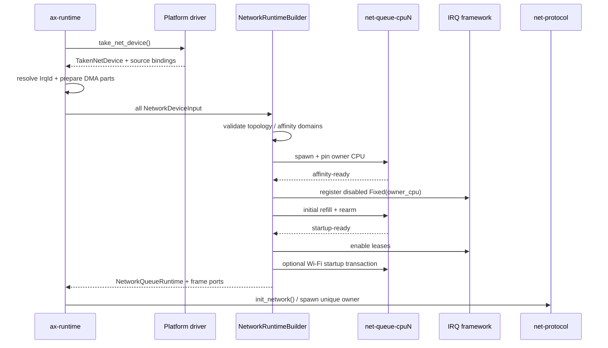
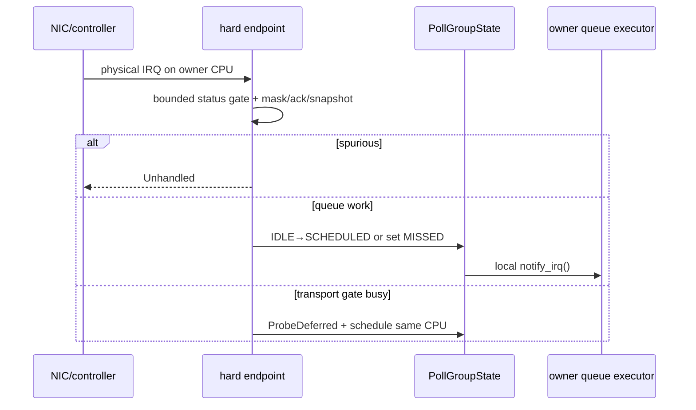
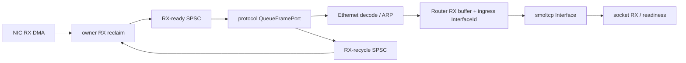
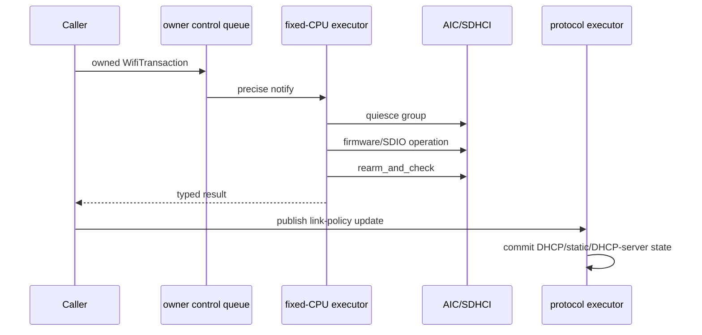

# 运行时流程

网络运行时由两级执行器组成：fixed-CPU queue executor 处理 IRQ/DMA/queue，唯一
protocol executor 处理 smoltcp/socket/control plane。流程中的跨 CPU 边界只传递
move-only token/frame 与 protocol generation。

## 1. 启动流程


```mermaid
sequenceDiagram
    participant RT as ax-runtime
    participant Driver as Platform driver
    participant Builder as NetworkRuntimeBuilder
    participant QE as net-queue-cpuN
    participant IRQ as IRQ framework
    participant PE as net-protocol

    RT->>Driver: take_net_device()
    Driver-->>RT: TakenNetDevice + source bindings
    RT->>RT: resolve IrqId + prepare DMA parts
    RT->>Builder: all NetworkDeviceInput
    Builder->>Builder: validate topology / affinity domains
    Builder->>QE: spawn + pin owner CPU
    QE-->>Builder: affinity-ready
    Builder->>IRQ: register disabled Fixed(owner_cpu)
    Builder->>QE: initial refill + rearm
    QE-->>Builder: startup-ready
    Builder->>IRQ: enable leases
    Builder->>QE: optional Wi-Fi startup transaction
    Builder-->>RT: NetworkQueueRuntime + frame ports
    RT->>PE: init_network() / spawn unique owner
```

没有物理 NIC 时 runtime 直接发布 loopback-only service。发现物理设备但 parts、IRQ、
fixed affinity、mask/rearm 或 worker pin 不完整时，初始化 panic/返回错误，不降级为
polling。

## 2. Affinity domain

builder 收集每个 group endpoint 的 source ID → physical `IrqId` 映射。任意两个 group
共享 IRQ 时合并到同一 domain；domain 按稳定顺序分配在线 CPU。独立 MSI-X source 可
落到不同 CPU。

worker 必须在 registration 前完成：

```text
set_current_affinity(AxCpuMask::one_shot(owner_cpu))
  -> yield
  -> this_cpu_id == owner_cpu
  -> affinity-ready
```

registration 使用 `NonReentrant + AutoEnable::No + Fixed(owner_cpu)`。shared action
affinity 不一致时 framework 拒绝。

## 3. Hard IRQ 流程


```mermaid
sequenceDiagram
    participant NIC as NIC/controller
    participant IRQ as hard endpoint
    participant State as PollGroupState
    participant QE as owner queue executor

    NIC->>IRQ: physical IRQ on owner CPU
    IRQ->>IRQ: bounded status gate + mask/ack/snapshot
    alt spurious
        IRQ-->>NIC: Unhandled
    else queue work
        IRQ->>State: IDLE→SCHEDULED or set MISSED
        State->>QE: local notify_irq()
    else transport gate busy
        IRQ->>State: ProbeDeferred + schedule same CPU
    end
```

hard IRQ 不访问 DMA payload，不调用 protocol，不分配，不取 sleeping lock，不调用任意
waker，也不在 virtio gate 上自旋。callback CPU 与 owner CPU 不一致时 group fail-stop，
remote wake 计数增加并作为契约失败。

## 4. Queue poll 流程

owner executor claim `SCHEDULED -> POLLING` 后先 `quiesce()`，随后按顺序处理：

```text
RX recycle       budget 64
RX reclaim       budget 64
TX completion    budget 64
TX submission    budget 64
per-CPU round total 256
```

budget 用尽或硬件仍有 work：保持 IRQ mask，group 回 `SCHEDULED`。ring full：token 保留
在 `pending_*`，group 留在 blocked polling state；protocol owner 释放空间后精准 schedule。

空闲完成：

```text
POLLING --CAS--> IDLE
  -> rearm_and_check()
  -> Idle: wait for next IRQ
  -> WorkPending: mask + schedule same group
```

IRQ 在 CAS 前到来会设置 `MISSED`；CAS 后到来由 rearm status check 或已经 unmask 的
fixed callback 捕获。

## 5. RX packet 流程


```mermaid
flowchart LR
    NIC[NIC RX DMA] --> QE[owner RX reclaim]
    QE --> Ring[RX-ready SPSC]
    Ring --> Port[protocol QueueFramePort]
    Port --> Eth[Ethernet decode / ARP]
    Eth --> Router[Router RX buffer + ingress InterfaceId]
    Router --> Smol[smoltcp Interface]
    Smol --> Sock[socket RX / readiness]
    Port --> Recycle[RX-recycle SPSC]
    Recycle --> QE
```

queue owner publish completion 后调用 `request_poll()`。protocol owner读取 DMA frame，
归还 recycle token，再解封装 IPv4/ARP。DHCP/TCP SYN snoop 使用 ingress
`InterfaceId`；smoltcp 更新 socket readiness 时产生的 `PollSet` wake 延迟到
`SocketSet` 解锁后执行。

## 6. TX packet 流程


```mermaid
flowchart LR
    App[send/connect] --> Sock[socket TX buffer]
    Sock --> Gen[request generation]
    Gen --> PE[net-protocol]
    PE --> Smol[smoltcp output]
    Smol --> Router[route by dst/src/binding]
    Router --> Eth[ARP + Ethernet frame]
    Eth --> Ready[TX-ready SPSC]
    Ready --> QE[owner submit]
    QE --> NIC[NIC TX DMA]
    NIC --> QE2[owner completion]
    QE2 --> Free[TX-free SPSC]
```

loopback route 直接把 IP packet 注入 Router RX buffer。普通 NIC 路径由 protocol owner
从 TX-free ring 取 token，写 frame 后 move 到 TX-ready。`submit` retry 返回同一 token
并保留在 queue owner；completion token 回到 free ring。

## 7. Protocol generation

socket、RX batch、TX completion、DHCP/DNS timer、deferred readiness 和同步 flush 都
调用 `ProtocolPollRuntime::request()/schedule()`。worker 流程：

```text
wait until scheduled or protocol timer deadline
  -> drain deferred wakes
  -> target = requested_generation
  -> poll Service/Interface until idle
  -> completed = target
  -> drain deferred wakes
  -> clear scheduled and recheck requested/completed
```

`flush_egress()` 等待自己的 generation，调用线程不进入 `Service::poll()`。因此生产
初始化、split-route helper 或任意 socket caller 都不能形成第二 owner。

## 8. Blocking socket 与 readiness

TCP/UDP/raw 操作只在短临界区修改对应 smoltcp socket，然后 `request_poll()` 并通过
`Pollable/poll_io` 等待 readiness。readiness waker 不绑定某个硬件 queue domain；目标 queue
事件先到 protocol executor，socket 状态改变后才唤醒等待者。

- nonblocking/`MSG_DONTWAIT` 在当前状态 would-block 时返回 `EAGAIN`；
- 没有 `SA_RESTART` 的可投递 signal 打断 blocking wait，返回 `EINTR`；
- peer close 经 protocol poll 产生 EOF/HUP/EPOLLRDHUP；
- close 与最后一次 UDP send 使用 generation completion 保证发送已离开 socket TX
  buffer，但不会让 close caller成为 poll owner。

Starry grouped `test-tcp-napi-runtime` 固定 blocking/nonblocking connect/accept、
send/recv、poll/epoll、peer close 与 signal-interrupted recv 的 Linux-visible 语义。

## 9. DHCP 与 DNS

DHCP client/server 与 DNS socket 都由唯一 protocol executor 推进。NIC RX ingress ID
决定 DHCP state；ACK 通过 `commit_interface_update()` 同步更新 smoltcp address、
`NetControl`、route 与 DNS source。DNS query 创建临时 smoltcp socket，完成/失败后由
guard 移除。

protocol timer deadline 可以唤醒 protocol executor，但不会唤醒空闲 queue executor，
也不会用于弥补设备 IRQ。

## 10. Wi-Fi reconfigure


```mermaid
sequenceDiagram
    participant Caller
    participant CQ as owner control queue
    participant QE as fixed-CPU executor
    participant HW as AIC/SDHCI
    participant PE as protocol executor

    Caller->>CQ: owned WifiTransaction
    CQ->>QE: precise notify
    QE->>HW: quiesce group
    QE->>HW: firmware/SDIO operation
    QE->>HW: rearm_and_check
    QE-->>Caller: typed result
    Caller->>PE: publish link-policy update
    PE->>PE: commit DHCP/static/DHCP-server state
```

AIC RX、TX、firmware command response、EAPOL 与 AP events 都由同一 queue owner
cooperatively 推进。没有独立 AIC task/kicker。

## 11. Stop 与 rollback

```text
reject/complete pending Wi-Fi requests
  -> disable and synchronize all IRQ leases
  -> stop queue executors
  -> owner executor quiesce + driver DMA shutdown proof
  -> join
  -> drop proven-safe resources or quarantine the complete group
```

builder 任一步失败使用相同反向顺序。service 在 builder 成功前不可见。

## 12. 流程速查

| 事件 | 发布者 | 推进者 | 结果 |
| --- | --- | --- | --- |
| NIC RX/TX IRQ | hard endpoint | fixed-CPU queue executor | completion/token 到 SPSC |
| virtio gate busy | hard endpoint `ProbeDeferred` | 同 CPU queue executor | task-context transport probe |
| socket send/connect | caller generation | protocol executor | smoltcp/Router TX |
| socket wait signal | signal subsystem | blocked caller | `EINTR` 或 restart policy |
| peer close | protocol RX/state | protocol executor | EOF/HUP readiness |
| DHCP/DNS timer | protocol deadline | protocol executor | control state/packet progress |
| Wi-Fi mode change | caller transaction | queue owner then protocol owner | hardware state后控制面提交 |

禁止从 hard IRQ 或 queue executor 进入 smoltcp，禁止调用者同步 poll，禁止用 timer、
remote IPI 或 wake-all 替代目标 group 的本地 IRQ activation。
