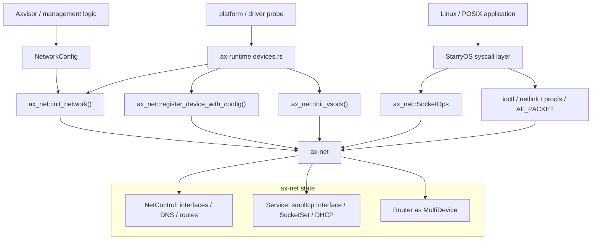
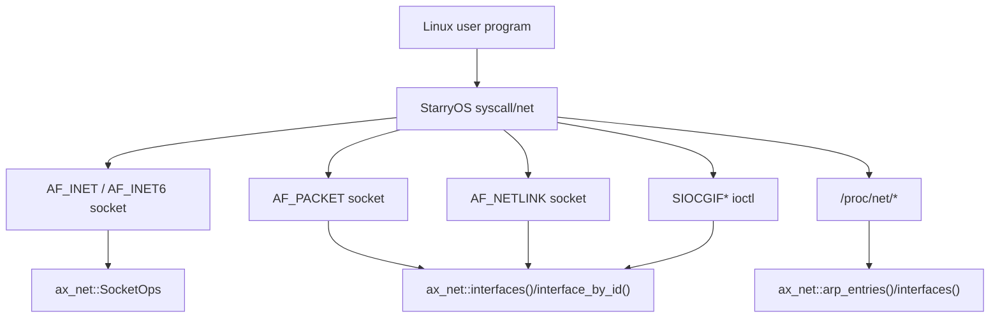

# 系统集成

`ax-net` 是 ArceOS、StarryOS 和 Axvisor 共享的网络栈实现。它统一维护接口、地址、路由、DNS、ARP、socket 状态和协议栈 poll 机制；上层系统只负责把平台设备、系统调用 ABI 或虚拟化管理意图转换为 `ax-net` 的公开 API。

核心源码：

| 源码 | 集成职责 |
| --- | --- |
| `os/arceos/modules/axruntime/src/devices.rs` | runtime 侧设备收集、IRQ 注册、`init_network()`、动态 Wi-Fi/SoftAP 注册、vsock 初始化 |
| `os/arceos/modules/axruntime/src/irq.rs` | 将 platform IRQ 注册能力适配为 `ax_net::EthernetIrqRegistrar` |
| `os/arceos/modules/axruntime/src/unix_ns.rs` | 将 ArceOS 文件系统命名空间适配为 Unix socket namespace |
| `os/StarryOS/kernel/src/file/net.rs` | Linux `ifreq`/`SIOCGIF*`/`FIONREAD` 等网络 ioctl 适配 |
| `os/StarryOS/kernel/src/file/packet.rs` | `AF_PACKET`、`sockaddr_ll`、packet socket ioctl 和模拟 ARP reply |
| `os/StarryOS/kernel/src/file/netlink.rs` | `RTM_GETLINK`、`RTM_GETADDR` 等 netlink 查询 |
| `os/StarryOS/kernel/src/syscall/net/opt.rs` | `getsockopt()`/`setsockopt()`，包括 `SO_BINDTODEVICE` |
| `os/StarryOS/kernel/src/pseudofs/proc.rs` | `/proc/net/arp`、`/proc/net/dev` 等 procfs 视图 |
| `net/ax-net/src/lib.rs` | `init_network()`、`register_device_with_config()`、`init_vsock()`、public facade |
| `net/ax-net/src/config.rs` | `NetworkConfig`、`InterfaceInfo`、`InterfaceId`、`DeviceBinding` 等跨系统数据模型 |

## 集成模型

系统集成的基本原则是：网络状态只有一份，位于 `ax-net`；外部系统不复制接口表、路由表或 socket domain。



各层边界：

| 层级 | 负责 | 不负责 |
| --- | --- | --- |
| runtime / platform | 收集设备、注册 IRQ、传入结构化配置、注册动态设备 | 维护路由表、解析 Linux socket ABI、直接访问 `SocketSet` |
| `ax-net` | 接口 registry、路由、DNS、socket、协议栈 poll、多设备 dataplane | 平台设备发现、Linux `ifreq` 编解码、虚拟机管理策略 |
| StarryOS | Linux syscall 参数校验、ABI 结构体编解码、namespace 可见性过滤 | 复制第二套路由表、直接驱动 smoltcp、固定假设 `eth0` |
| Axvisor | 描述管理面/服务面网络意图、选择接口绑定策略 | 自行实现 TCP/UDP/ARP/DNS 状态 |

## ArceOS Runtime

### 初始化入口

`ax-runtime` 是设备进入 `ax-net` 的主要入口。动态和静态设备路径都遵循同一顺序：

```rust
// os/arceos/modules/axruntime/src/devices.rs, 简化示意
ax_net::set_ethernet_irq_registrar(&crate::irq::NET_IRQ_REGISTRAR);
register_unix_namespace();

let config = parse_network_config();
let (nics, wireless) = collect_net_devices();

ax_net::init_network(nics, config);
register_wireless_devices(wireless);
```

这条路径完成三件事：

- 将 runtime 发现的 Ethernet 设备包装成 `ax_net::EthernetDriver`。
- 将结构化 `NetworkConfig` 交给 `ax-net`，由 `ax-net` 创建 `lo`、Ethernet 接口、路由、DHCP 状态和 DNS registry。
- 在主网络栈初始化后注册需要独立控制面的 Wi-Fi/SoftAP 设备。

`parse_network_config()` 是系统配置到 `NetworkConfig` 的转换点。接口地址、DHCP、DNS、metric 和设备匹配策略应在这里进入结构化配置，而不是在 StarryOS 或驱动层再维护一份网络状态。

### IRQ 适配

`ax-net` 的 Ethernet 设备只依赖抽象的 `EthernetIrqRegistrar`。runtime 侧通过 `set_ethernet_irq_registrar()` 注入平台 IRQ 注册能力：

```rust
ax_net::set_ethernet_irq_registrar(&crate::irq::NET_IRQ_REGISTRAR);
```

IRQ 处理函数只负责唤醒设备路径，不进入 smoltcp poll。协议栈推进仍由 `net-poll` worker 串行完成，避免 IRQ 上下文或应用线程重入 `SocketSet`。

### Unix Socket Namespace

Unix domain socket 的路径名绑定需要文件系统命名空间协助。`ax-runtime` 在启用 `fs-ng` 时注册 namespace adapter：

```rust
ax_net::unix::register_unix_namespace(crate::unix_ns::AxFsUnixNamespace);
```

该适配层只处理 pathname socket 与 VFS namespace 的关系；Unix socket 的连接、收发、poll 和生命周期仍位于 `ax-net`。

### 动态 Wi-Fi 与 SoftAP

带 `wifi_control()` 的设备会走动态注册路径。runtime 从驱动读取 link policy，并把 OOB RX 唤醒函数设置为 `ax_net::wake_net_task_irq`：

```rust
ctrl.set_rx_wake(ax_net::wake_net_task_irq);
let policy = ctrl.link_policy();
```

随后 runtime 构造 `NetConfig` 并调用：

```rust
ax_net::register_device_with_config(driver, config);
```

这条路径适合 SoftAP 或运行期新增的静态地址设备。`ax-net` 会分配新的 `InterfaceId`，创建路由规则，更新 smoltcp IP address list，启动设备 worker，并可按配置启用 DHCP server。

### Vsock

`vsock` feature 下，runtime 收集 virtio-vsock 等设备并调用：

```rust
ax_net::init_vsock(vsock_devs);
```

`init_vsock()` 只注册传入列表中的第一个设备；空列表只会记录 warning，不建立额外的“无设备但已初始化”状态。没有注册设备时，AF_VSOCK 的 listen/connect/send 路径会在 `device::vsock_*()` 返回 `NotFound`。vsock 不参与 IP 路由、ARP、DNS 或 Ethernet dataplane；它只复用 `ax-net` 的 socket facade 和 poll 语义。

## ArceOS API 层

ArceOS API 层通过 `SocketOps` 和 `Socket` 枚举访问 `ax-net`：

```text
ax-api / ax-posix-api
  -> ax_net::Socket
  -> SocketOps
  -> tcp / udp / raw / unix / vsock
```

API 层只做语言级或 POSIX 风格的入口适配。具体协议状态、端口冲突检查、socket option、设备绑定、poll readiness、DNS 查询都由 `ax-net` 内部处理。

典型调用关系：

| 上层操作 | `ax-net` 入口 | 说明 |
| --- | --- | --- |
| `socket(AF_INET, SOCK_STREAM)` | `Socket::Tcp(TcpSocket::new())` | 创建 TCP socket，加入统一 socket facade |
| `connect()` | `SocketOps::connect()` | TCP/UDP/raw 各自根据地址族和 route decision 处理 |
| `bind()` | `SocketOps::bind()` | 绑定本地地址时可推导 `DeviceBinding` |
| `poll()` / `select()` / `epoll()` | `SocketOps::poll()` | 查询 readiness 并注册 waker |
| `getaddrinfo()` / DNS 查询 | `dns_query()` / `dns_query_timeout()` | DNS server 来自控制面 registry，并按可达性过滤 |

应用通常不直接接触 `InterfaceId`。只有需要接口约束时，才通过 `bind_device()` 或 Linux ABI 层的 `SO_BINDTODEVICE` 建立 `DeviceBinding`。

## StarryOS Linux ABI

StarryOS 负责把 Linux ABI 转换为 `ax-net` API。它不维护第二套接口 registry、路由表、ARP 表或 socket poller。



### Namespace 可见性

StarryOS 的接口查询先经过可见性过滤：

```rust
fn visible_interfaces() -> impl Iterator<Item = InterfaceInfo> {
    ax_net::interfaces()
        .into_iter()
        .filter(|info| in_root_net_ns() || info.kind == InterfaceKind::Loopback)
}
```

语义：

- root network namespace 可以看到所有接口。
- 非 root namespace 只暴露 loopback 视图。
- 当前没有为每个 namespace 复制 `ax-net` 的 route table、socket domain 或协议栈实例。

因此，namespace 适配属于 ABI 可见性层，不是 `ax-net` 内部的多网络命名空间实现。

### ioctl 与 ifreq

`file/net.rs` 实现 `SIOCGIF*` 查询。数据来源必须是 `ax-net` 接口快照：

| ioctl | 数据来源 |
| --- | --- |
| `SIOCGIFCONF` | 遍历 `ax_net::interfaces()`，再应用 namespace 可见性过滤 |
| `SIOCGIFFLAGS` | `InterfaceInfo::flags` 映射到 Linux `IFF_*` |
| `SIOCGIFADDR` | `InterfaceInfo::ipv4.address` |
| `SIOCGIFDSTADDR` | loopback 返回自身地址，Ethernet 返回 `0.0.0.0` |
| `SIOCGIFBRDADDR` | loopback 返回自身地址，Ethernet 根据 IPv4 CIDR 计算广播地址 |
| `SIOCGIFNETMASK` | IPv4 CIDR prefix 转换为 netmask |
| `SIOCGIFHWADDR` | Ethernet 返回真实 MAC，loopback 返回 loopback 硬件类型 |
| `SIOCGIFMTU` | `InterfaceInfo::mtu` |
| `SIOCGIFINDEX` | `InterfaceInfo::id.to_linux_ifindex()` |
| `SIOCGIFMETRIC` / `SIOCGIFMAP` / `SIOCGIFTXQLEN` | 返回 Linux 兼容的固定或空结构值 |
| `FIONREAD` | 转发到底层 socket 的 `recv_available()` |

所有按接口名查询的 ioctl 都应先解析 ifreq 中的 name，再通过 `ax_net::interface_by_name()` 获取快照。这样多网口、loopback 和动态注册接口都能走同一套路径。

### Socket Option

StarryOS 的 `SO_BINDTODEVICE` 负责在 Linux 字符串接口名和 `ax-net` 的 `DeviceBinding` 之间转换：

```text
setsockopt(SO_BINDTODEVICE, "eth1")
  -> ax_net::interface_by_name("eth1")
  -> SetSocketOption::BindToDevice(Some(interface_id))
  -> GeneralOptions::set_device_binding()

getsockopt(SO_BINDTODEVICE)
  -> socket DeviceBinding
  -> ax_net::interface_by_id(interface_id)
  -> interface name
```

其它 socket option 通过 `GetSocketOption`、`SetSocketOption` 和 `Configurable` 分发到具体 socket。`SO_TYPE`、`TCP_INFO`、超时、nonblocking、`SO_REUSEADDR` 等语义应以 `ax-net` 的 socket 状态为准。

### AF_PACKET

`AF_PACKET` 由 StarryOS 的 `PacketSocket` 实现，接口信息来自 `ax-net`：

- 创建 packet socket 需要 root network namespace。
- `bind(sockaddr_ll)` 中 `sll_ifindex == 0` 时绑定第一个可见 Ethernet 接口。
- `sll_ifindex != 0` 时通过 `InterfaceId::from_linux_ifindex()` 和 `interface_by_id()` 找到接口。
- `SockAddrLl::from_interface()` 填充 ifindex、硬件类型、地址长度和 MAC。
- packet socket ioctl 支持 `SIOCGIFINDEX`、`SIOCGIFFLAGS`、`SIOCGIFHWADDR`。

`PacketSocket::send_packet()` 只模拟有限的 ARP reply 场景，用于让 Linux 用户态工具在 QEMU 中看到预期的 gateway ARP 行为。它不是通用二层转发路径，也不绕过 `ax-net` 的 IP dataplane。

### Netlink 与 procfs

StarryOS 的 netlink 和 procfs 视图也应复用 `ax-net` 状态：

| 视图 | 数据来源 | 说明 |
| --- | --- | --- |
| `RTM_GETLINK` | `ax_net::interfaces()` | 生成 `RTM_NEWLINK`，包含 ifindex、name、flags、MAC 等属性 |
| `RTM_GETADDR` | `ax_net::interfaces()` | 生成 IPv4 address dump |
| `/proc/net/arp` | `ax_net::arp_entries()` | device 字段使用真实接口名 |
| `/proc/net/dev` | `ax_net::interfaces()` | 按接口生成兼容视图 |

这些路径用于 Linux 兼容层观测网络状态，不应创建独立的接口或 ARP 缓存。

## Axvisor 接入

Axvisor 应通过 `NetworkConfig` 描述网络意图，例如：

- 管理面接口使用静态地址或 DHCP。
- VM 服务面接口配置独立 metric。
- DNS server 来自接口级静态配置或全局 fallback。
- 需要固定出接口的管理连接使用 `bind_device(InterfaceId)`。

示例：

```rust
let mgmt = ax_net::interface_by_name("eth0").ok_or(AxError::NoSuchDevice)?;
let sock = ax_net::tcp::TcpSocket::new();
sock.bind_device(mgmt.id)?;
```

普通 TCP/UDP 连接不需要 Axvisor 自行选择设备。目的地址、metric、接口 UP 状态和 socket 绑定约束统一交给 `ax-net` route decision。

## 集成约束

### 状态所有权

- 接口 ID、接口名、IPv4、gateway、metric、DNS 和 route table 由 `ax-net` 控制面维护。
- TCP/UDP/raw/Unix/vsock socket 状态由 `ax-net` socket 层维护。
- StarryOS ioctl、netlink、procfs 只读取 `ax-net` 快照。
- runtime 只传入设备和配置，不持有可变网络状态副本。

### 线程与 poll 边界

- runtime IRQ 和设备 worker 可以唤醒网络栈，但不直接调用 smoltcp poll。
- socket 热路径只请求 poll，不同步推进整个协议栈。
- `net-poll` worker 独占执行 `Service::poll()`、smoltcp `Interface::poll()` 和 `SocketSet` 处理。
- StarryOS syscall 层不应持有 Linux ABI 锁后再进入设备锁。

### 接口命名与 ifindex

- `lo` 固定为 `InterfaceId::LOOPBACK`，Linux ifindex 为 1。
- Ethernet 接口默认按发现顺序命名为 `eth0`、`eth1`。
- Linux `ifindex` 和 `InterfaceId` 直接映射。
- 外部系统不得把 Router 内部 `dev` 索引暴露为 ifindex。

### namespace 限制

当前 StarryOS namespace 集成是可见性过滤，不是完整 Linux network namespace：

- 没有 per-namespace route table。
- 没有 per-namespace socket bind domain。
- 没有 per-namespace ARP/DNS 状态。
- 非 root namespace 主要只看到 loopback。

需要完整 network namespace 时，应在 `ax-net` 上方设计 namespace domain，而不是在 StarryOS 局部复制接口表。

## 接入检查清单

新增或修改系统接入路径时，应检查：

- 是否通过 `NetworkConfig`、`InterfaceInfo`、`InterfaceId`、`DeviceBinding` 等公开模型传递网络语义。
- 是否避免固定 `eth0`、固定 ifindex 或固定 gateway。
- 是否只由 `ax-net` 维护 route table、DNS registry 和 ARP entries。
- 是否使用 `ax_net::interfaces()`、`interface_by_name()`、`interface_by_id()` 查询接口。
- 是否将 Linux ABI 结构体编解码留在 StarryOS，而不是下沉到 `ax-net`。
- 是否在动态设备注册后调用 `request_poll()` 或依赖 `register_device_with_config()` 的唤醒路径。
- 是否避免在 IRQ、设备 worker 或 syscall 热路径中直接推进 smoltcp poll。
