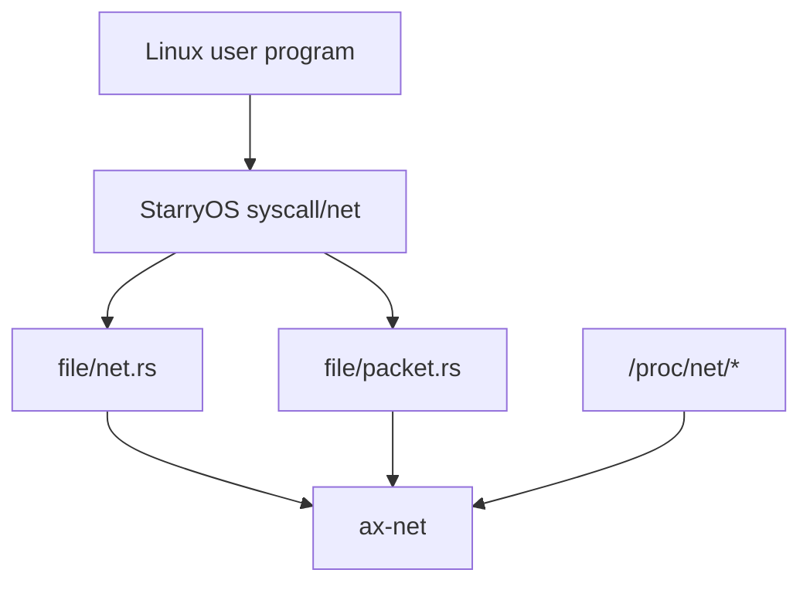

# 系统接入

本文说明 ArceOS、StarryOS 和 Axvisor 如何接入 `ax-net`，以及各自负责的边界。

## ArceOS / ax-runtime

`ax-runtime` 是网络栈初始化的主要入口。它负责：

- 在平台设备 probe 完成后收集 Ethernet 设备。
- 将 `rd-net` 设备包装为 `ax-net` 的 `EthernetDriver`（由 `RdNetDriver` 实现，[driver.rs](net/ax-net/src/device/driver.rs)）。
- 注册网络 IRQ adapter（`set_ethernet_irq_registrar()`，[ethernet.rs](net/ax-net/src/device/ethernet.rs)）。
- 构造结构化 `NetworkConfig`。
- 调用 `ax_net::init_network(net_devs, config)`（[lib.rs](net/ax-net/src/lib.rs)）。
- 在 `vsock` feature 下调用 `ax_net::init_vsock(vsock_devs)`（[lib.rs](net/ax-net/src/lib.rs)）。

`ax-runtime` 不负责：

- 维护接口 registry。
- 维护路由表。
- 解析 StarryOS Linux socket ABI。
- 直接读写 smoltcp `SocketSet`。

## ArceOS API 层

ArceOS API 层通过 `SocketOps` 访问 `ax-net`：

```text
ax-api / ax-posix-api
  -> ax-net Socket / SocketOps
  -> tcp / udp / raw / unix / vsock
```

应用侧通常不直接接触 `InterfaceId`，除非需要类似 `SO_BINDTODEVICE` 的接口绑定语义。

## StarryOS

StarryOS 在 Linux ABI 层接入 `ax-net`。它负责 syscall 参数和 Linux 数据结构，不维护第二套网络状态。



### ioctl

StarryOS `SIOCGIF*` 系列 ioctl 从 `ax-net` 查询接口：

- `SIOCGIFCONF` 遍历 `ax_net::interfaces()`。
- `SIOCGIFADDR` / `SIOCGIFBRDADDR` / `SIOCGIFNETMASK` 按接口名查询 IPv4。
- `SIOCGIFHWADDR` 返回真实 MAC 或 loopback 类型。
- `SIOCGIFINDEX` 返回 `InterfaceInfo::id.to_linux_ifindex()`。
- `SIOCGIFFLAGS` 从 `InterfaceFlags` 映射 Linux `IFF_*`。

### SO_BINDTODEVICE

StarryOS 将 Linux 传入的接口名解析为 `InterfaceId`：

```text
SO_BINDTODEVICE="eth1"
  -> ax_net::interface_by_name("eth1")
  -> SetSocketOption::BindToDevice(Some(id))
```

`getsockopt(SO_BINDTODEVICE)` 则反向从 socket 的 `DeviceBinding` 查询接口名。

### AF_PACKET

StarryOS 保留 Linux `sockaddr_ll` 编解码，接口信息来自 `ax-net`：

- `sll_ifindex == 0`：绑定第一个可见 Ethernet 接口。
- `sll_ifindex != 0`：通过 `InterfaceId::from_linux_ifindex()` 和 `ax_net::interface_by_id()` 查询接口。
- `SockAddrLl::from_interface(info, protocol)` 填充 ifindex、硬件类型和 MAC。
- `send_packet()` 保留旧的 ARP reply 模拟能力，并基于当前绑定接口的 gateway 和 MAC 工作。

### `/proc/net/arp`

`/proc/net/arp` 使用 `ax_net::arp_entries()`，device 字段必须是真实接口名，不写死 `eth0`。

## Axvisor

Axvisor 不维护自己的网络接口模型。它通过结构化 `NetworkConfig` 表达网络意图：

- 管理面接口。
- VM 服务面接口。
- 静态地址或 DHCP。
- 默认路由 metric。
- 接口级 DNS。

普通 TCP/UDP 连接交给 `ax-net` route decision 自动选择接口。需要固定接口时使用 `bind_device(InterfaceId)`。

```rust
let mgmt = ax_net::interface_by_name("eth0").ok_or(AxError::NoSuchDevice)?;
let sock = ax_net::tcp::TcpSocket::new();
sock.bind_device(mgmt.id)?;
```

## root net namespace

当前 StarryOS 初期 root net namespace 可以看到所有接口。非 root namespace 侧的完整 Linux net namespace 隔离尚未实现，现有路径主要做可见性过滤，不复制 `ax-net` 的 domain 或 route table。

## 边界原则

- `ax-net` 统一维护接口、地址、路由、DNS、ARP 和 socket 状态。
- ArceOS runtime 只做设备和 IRQ 装配。
- StarryOS 只做 Linux ABI。
- Axvisor 只表达网络意图。
- 具体驱动和平台发现不进入 `ax-net`。
