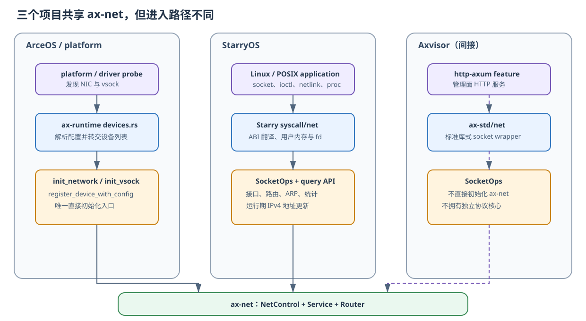
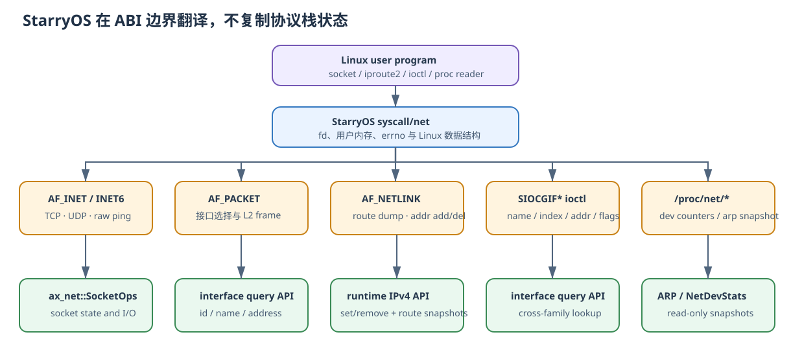

# 系统集成

`ax-net` 是 ArceOS 和 StarryOS 直接使用的网络栈实现。Axvisor 只有在启用 `http-axum` 等依赖 `ax-std/net` 的管理服务功能时，才经 ArceOS 间接使用它。`ax-net` 统一维护接口、地址、路由、DNS、ARP、网卡统计、socket 状态和协议栈 poll 机制；上层系统只负责平台设备接入和 ABI 转换。

核心源码：

| 源码 | 集成职责 |
| --- | --- |
| `os/arceos/modules/axruntime/src/devices.rs` | 一次性消费全部物理设备、准备 DMA/IRQ source、构造 `NetworkRuntimeBuilder`、`init_network()`、vsock 初始化 |
| `os/arceos/modules/axruntime/src/irq.rs` | 将 platform IRQ 注册能力适配为 fixed-affinity `PinnedNetIrqRegistrar` |
| `os/arceos/modules/axruntime/src/unix_ns.rs` | 将 ArceOS 文件系统命名空间适配为 Unix socket namespace |
| `os/StarryOS/kernel/src/file/net.rs` | Linux `ifreq`/`SIOCGIF*`/`FIONREAD` 等网络 ioctl 适配 |
| `os/StarryOS/kernel/src/file/packet.rs` | `AF_PACKET`、`sockaddr_ll`、packet socket ioctl 和模拟 ARP reply |
| `os/StarryOS/kernel/src/file/netlink.rs` | `RTM_GETLINK/GETADDR/GETROUTE` 查询和 IPv4 `RTM_NEWADDR/DELADDR` 更新 |
| `os/StarryOS/kernel/src/syscall/net/opt.rs` | `getsockopt()`/`setsockopt()`，包括 `SO_BINDTODEVICE` |
| `os/StarryOS/kernel/src/pseudofs/proc.rs` | `/proc/net/arp`、`/proc/net/dev` 等 procfs 视图 |
| `net/ax-net/src/lib.rs` | `init_network()`、唯一 protocol executor、Wi-Fi transaction、`init_vsock()`、public facade |
| `net/ax-net/src/config.rs` | `NetworkConfig`、`InterfaceInfo`、`InterfaceId`、`DeviceBinding` 等跨系统数据模型 |

源码表表明设备初始化、Linux ABI 和网络状态分别由不同模块维护，跨系统修改应沿公共 API 连接，而不是共享内部锁或对象。集成模型将在这些代码锚点基础上展示三类调用方进入 `ax-net` 的不同路径。

## 1. 集成模型

系统集成的基本原则是：网络状态只有一份，位于 `ax-net`；外部系统不复制接口表、路由表或 socket domain。



各层边界：

| 层级 | 负责 | 不负责 |
| --- | --- | --- |
| runtime / platform | 一次性收集设备与 source binding、固定 CPU 注册 IRQ、传入结构化配置 | 维护路由表、运行时追加物理设备、解析 Linux socket ABI、直接访问 `SocketSet` |
| `ax-net` | 接口 registry、路由、DNS、socket、协议栈 poll、多设备 dataplane | 平台设备发现、Linux `ifreq` 编解码、虚拟机管理策略 |
| StarryOS | Linux syscall 参数校验、ABI 结构体编解码、namespace 可见性过滤 | 复制第二套路由表、直接驱动 smoltcp、固定假设 `eth0` |
| Axvisor | 功能启用后经 `ax-std/net` 使用 ArceOS 网络 API | 直接构造或维护 `ax-net` 控制面 |

职责表明确 runtime、`ax-net`、StarryOS 与 Axvisor 各自负责和禁止承担的工作。ArceOS runtime 是设备能力进入共享网络状态的首要边界，下面按初始化、IRQ、namespace 和动态设备展开。

## 2. ArceOS Runtime

ArceOS runtime 负责把平台发现、驱动 parts、物理 IRQ binding 和文件系统命名空间转换为 `ax-net` 可消费的输入。它不保存接口或路由副本；所有物理 Ethernet/Wi-Fi 在启动阶段一次性移交，vsock 使用独立入口。

### 2.1 初始化入口

`ax-runtime` 的设备初始化是物理网卡进入 `ax-net` 的唯一入口。它先注册 Unix namespace，消费全部 `TakenNetDevice`，解析每个 typed IRQ source，准备 DMA，再构造 queue runtime。只有 builder 全部成功后才发布 protocol service。

```rust
// os/arceos/modules/axruntime/src/devices.rs, 简化示意
register_unix_namespace();

let config = parse_network_config();
let devices = collect_net_devices();
let (runtime, ports) = ax_net::NetworkRuntimeBuilder::new(
    devices,
    &crate::irq::NET_IRQ_REGISTRAR,
    ax_hal::cpu_num(),
).build()?;
ax_net::init_network(Some(runtime), ports, config);
```

这条路径完成三件事：

- 将 runtime 发现的设备消费为 `PreparedNetDevice`，并把 source ID 精确解析为物理 `IrqId`。
- 将结构化 `NetworkConfig` 交给 `ax-net`，由 `ax-net` 创建 `lo`、Ethernet 接口、路由、DHCP 状态和 DNS registry。
- 在 worker pin、disabled IRQ registration、owner startup、initial refill/rearm 和 startup Wi-Fi transaction 全部成功后发布 service。

`parse_network_config()` 当前直接返回 `NetworkConfig::default()`，尚未接入系统配置。因此启动时所有未显式匹配的普通 NIC 都采用 `ax-net` 默认策略：`eth{order}`、metric 100、DHCP、无静态 fallback DNS。该函数是未来接入接口地址/DNS/metric 的预留转换点，不应把它描述成已经生效的配置解析器。

### 2.2 IRQ 适配

`RuntimeNetIrqRegistrar` 只接受显式 `owner_cpu`。每个 action 使用
`NonReentrant + AutoEnable::No + IrqAffinity::Fixed(owner_cpu)` 注册，并返回记录
CPU 的 move-only lease。shared `IrqId` affinity 不一致、fixed routing 不可用或
registration 返回错误时，builder 反向 mask/synchronize 并拒绝发布。同步成功才让固定核
worker 执行 driver shutdown；同步失败则把 callback lease 与 executor backing 整体隔离。

hard callback 只调用对应 `NetHardIrqEndpoint::handle_irq()`，将
`Spurious/Schedule/ProbeDeferred` 发布给同 CPU group state。它不进入 smoltcp、不
扫描其它设备、不访问 DMA payload，也没有 no-IRQ 或周期轮询兜底。

### 2.3 Unix 命名空间

Unix domain socket 的路径名绑定需要文件系统命名空间协助。`ax-runtime` 在启用 `fs-ng` 时注册 namespace adapter：

```rust
ax_net::unix::register_unix_namespace(crate::unix_ns::AxFsUnixNamespace);
```

该适配层只处理 pathname socket 与 VFS namespace 的关系；Unix socket 的连接、收发、poll 和生命周期仍位于 `ax-net`。

### 2.4 Wi-Fi 与 SoftAP

Wi-Fi 与有线设备走同一个 all-at-once builder。AIC probe 只识别 variant 并提取 IRQ
source，固件与 FDRV 初始化经 `NetOwnerStartup` 在 worker pin、disabled IRQ registration
之后由 owner CPU 执行。`NetDeviceParts` 中的 owned `WifiControl` 绑定该设备首个 poll
group 的 owner CPU；startup transaction 只在 IRQ enable 完成后执行，service 尚未发布。运行期
`reconfigure_wifi(ifname, WifiTransaction)` 进入有界 control queue：owner 先
quiesce group，在同 CPU 执行 SDIO/MMIO 控制，再 rearm，最后由 protocol owner
提交 STA DHCP 或 SoftAP 静态地址/DHCP server 状态。启动后不支持新增物理 Wi-Fi。

### 2.5 Vsock

启用 `vsock` feature 后，runtime 收集 virtio-vsock 等设备并把列表交给 `init_vsock()`，由独立连接管理器与 poll task 负责后续事件。该路径不创建 smoltcp socket，也不经过 Ethernet `Router`；当前只消费列表末尾设备的选择规则需要由调用方明确接受。

```rust
ax_net::init_vsock(vsock_devs);
```

`init_vsock()` 使用 `pop()` 注册传入列表的**最后一个**设备，其余设备忽略；空列表只会记录 warning，不建立额外的“无设备但已初始化”状态。没有注册设备时，AF_VSOCK 的 listen/connect/send 路径会在 `device::vsock_*()` 返回 `NotFound`。vsock 不参与 IP 路由、ARP、DNS 或 Ethernet dataplane；它只复用 `ax-net` 的 socket facade 和 poll 语义。

## 3. ArceOS API 层

ArceOS API 层通过 `SocketOps` 与封闭的 `Socket` 枚举访问 `ax-net`，对上提供统一地址、I/O、poll 和 option 形状。这个外观层不暴露具体 backend 或 `SocketSet` handle，使 ArceOS 标准库式封装可以在 IP、Unix 和 vsock transport 之间保持一致调用方式。

```text
ax-api / ax-posix-api
  -> ax_net::Socket
  -> SocketOps
  -> tcp / udp / raw / unix / vsock
```

API 层只做语言级或 POSIX 风格的入口适配。具体协议状态、端口冲突检查、socket option、设备绑定、poll readiness、DNS 查询都由 `ax-net` 内部处理。

典型调用关系：

| 上层操作 | `ax-net` 入口 | 说明 |
| --- | --- | --- |
| `socket(AF_INET, SOCK_STREAM)` | `Socket::Tcp(TcpSocket::new())` | 创建 TCP socket，加入统一 socket facade |
| `connect()` | `SocketOps::connect()` | TCP/UDP/raw 各自根据地址族和 route decision 处理 |
| `bind()` | `SocketOps::bind()` | 绑定本地地址时可推导 `DeviceBinding` |
| `poll()` / `select()` / `epoll()` | `SocketOps::poll()` | 查询 readiness 并注册 waker |
| `getaddrinfo()` / DNS 查询 | `dns_query()` / `dns_query_timeout()` | DNS server 来自控制面 registry，并按可达性过滤 |

应用通常不直接接触 `InterfaceId`。只有需要接口约束时，才通过 `bind_device()` 或 Linux ABI 层的 `SO_BINDTODEVICE` 建立 `DeviceBinding`。

## 4. StarryOS Linux ABI

StarryOS 负责把 Linux ABI 转换为 `ax-net` API。它不维护第二套接口 registry、路由表、ARP 表或 socket poller。



图中的五类 ABI 最终都读取 `ax-net` 的权威状态，但只有 netlink 地址更新路径可以提交受限的运行期 IPv4 变化。namespace 过滤发生在 StarryOS 边界，不会为不同 namespace 创建独立 `Service` 或 `RouteTable`。

### 4.1 命名空间可见性

StarryOS 的接口查询先经过 namespace 可见性过滤，再从 `ax-net` 获取全局接口快照并筛选用户可见对象。当前机制只限制观察范围，不创建独立路由表或协议栈实例，因此不能等同于完整 Linux network namespace 隔离。

```rust
fn visible_interfaces() -> impl Iterator<Item = InterfaceInfo> {
    ax_net::interfaces()
        .into_iter()
        .filter(|info| in_root_net_ns() || info.kind == InterfaceKind::Loopback)
}
```

语义：

- root network namespace 可以看到所有接口。
- 非 root namespace 只暴露 loopback 视图。
- 当前没有为每个 namespace 复制 `ax-net` 的 route table、socket domain 或协议栈实例。

因此，namespace 适配属于 ABI 可见性层，不是 `ax-net` 内部的多网络命名空间实现。

### 4.2 接口 ioctl

`file/net.rs` 实现 `SIOCGIF*` 查询，并在 Linux `ifreq`、接口名与 `InterfaceId` 之间转换。所有地址、flags 和索引必须来自 `ax-net` 接口快照，避免 ioctl 与 netlink 或实际路由状态使用不同数据源。

| ioctl | 数据来源 |
| --- | --- |
| `SIOCGIFCONF` | 遍历 `ax_net::interfaces()`，再应用 namespace 可见性过滤 |
| `SIOCGIFFLAGS` | `InterfaceInfo::flags` 映射到 Linux `IFF_*` |
| `SIOCGIFADDR` | `InterfaceInfo::ipv4.address` |
| `SIOCGIFDSTADDR` | loopback 返回自身地址，Ethernet 返回 `0.0.0.0` |
| `SIOCGIFBRDADDR` | loopback 返回自身地址，Ethernet 根据 IPv4 CIDR 计算广播地址 |
| `SIOCGIFNETMASK` | IPv4 CIDR prefix 转换为 netmask |
| `SIOCGIFHWADDR` | Ethernet 返回真实 MAC，loopback 返回 loopback 硬件类型 |
| `SIOCGIFMTU` | `InterfaceInfo::mtu` |
| `SIOCGIFINDEX` | `InterfaceInfo::id.to_linux_ifindex()` |
| `SIOCGIFNAME` | `ifr_ifindex` 反查 `interface_by_id()` 并写回 NUL-padded name；该 device ioctl 对 AF_UNIX/AF_NETLINK socket 也可用 |
| `SIOCGIFMETRIC` / `SIOCGIFMAP` / `SIOCGIFTXQLEN` | 返回 Linux 兼容的固定或空结构值 |
| `FIONREAD` | 转发到底层 socket 的 `recv_available()` |

所有按接口名查询的 ioctl 都应先解析 ifreq 中的 name，再通过 `ax_net::interface_by_name()` 获取快照。这样多网口、loopback 和动态注册接口都能走同一套路径。

### 4.3 Socket 选项

StarryOS 的 `SO_BINDTODEVICE` 负责在 Linux 字符串接口名和 `ax-net` 的 `DeviceBinding` 之间转换：

```text
setsockopt(SO_BINDTODEVICE, "eth1")
  -> ax_net::interface_by_name("eth1")
  -> SetSocketOption::BindToDevice(Some(interface_id))
  -> GeneralOptions::set_device_binding()

getsockopt(SO_BINDTODEVICE)
  -> socket DeviceBinding
  -> ax_net::interface_by_id(interface_id)
  -> interface name
```

其它 socket option 通过 `GetSocketOption`、`SetSocketOption` 和 `Configurable` 分发到具体 socket。`SO_TYPE`、`TCP_INFO`、超时、nonblocking、`SO_REUSEADDR`/`SO_REUSEPORT`、`SO_PASSCRED`/`SO_TIMESTAMP` 和 `IP_MTU_DISCOVER` 等语义应以具体 backend 的支持矩阵为准；不支持的 option 不能被文档概括为“完整 Linux 实现”。

### 4.4 AF_PACKET

`AF_PACKET` 由 StarryOS `PacketSocket` 实现二层 ABI，并使用 `ax-net` 的接口 ID、名称与 MAC 快照解释 `sockaddr_ll`。packet socket 自身处理 frame 和必要的兼容行为，但不应复制接口 registry 或假定固定存在 `eth0`。

- 创建 packet socket 需要 root network namespace。
- `bind(sockaddr_ll)` 中 `sll_ifindex == 0` 时绑定第一个可见 Ethernet 接口。
- `sll_ifindex != 0` 时通过 `InterfaceId::from_linux_ifindex()` 和 `interface_by_id()` 找到接口。
- `SockAddrLl::from_interface()` 填充 ifindex、硬件类型、地址长度和 MAC。
- packet socket ioctl 支持 `SIOCGIFINDEX`、`SIOCGIFFLAGS`、`SIOCGIFHWADDR`。

`PacketSocket::send_packet()` 只模拟有限的 ARP reply 场景，用于让 Linux 用户态工具在 QEMU 中看到预期的 gateway ARP 行为。它不是通用二层转发路径，也不绕过 `ax-net` 的 IP dataplane。

### 4.5 Netlink 与 procfs

StarryOS 的 rtnetlink 与 procfs 都应从 `ax-net` 的接口、路由、ARP 和 `NetDevStats` 快照生成用户视图。`RTM_NEWADDR` 与 `RTM_DELADDR` 还会调用运行期 IPv4 API，使查询结果和后续数据面选路在同一次控制面提交后变化。

| 视图 | 数据来源 | 说明 |
| --- | --- | --- |
| `RTM_GETLINK` | `ax_net::interfaces()` | 生成 `RTM_NEWLINK`，包含 ifindex、name、flags、MAC 等属性 |
| `RTM_GETADDR` | `ax_net::interfaces()` | 生成 IPv4 address dump |
| `RTM_GETROUTE` | `ax_net::default_routes()` | 仅支持 dump，输出 IPv4 main/unspec table 的 default route；非 dump 返回 `EOPNOTSUPP` |
| `RTM_NEWADDR` | `ax_net::set_interface_ipv4()` | 仅 AF_INET；读取 `IFA_LOCAL` 或 `IFA_ADDRESS`，每接口最多一个 IPv4，无 gateway 参数 |
| `RTM_DELADDR` | `ax_net::remove_interface_ipv4()` | 仅 AF_INET；IP/prefix 必须精确匹配，内部 `NotFound` 映射为 `EADDRNOTAVAIL` |
| `/proc/net/arp` | `ax_net::arp_entries()` | device 字段使用真实接口名 |
| `/proc/net/dev` | `ax_net::net_dev_stats()` | 输出 bytes/packets/errors/dropped；fifo/frame/compressed/multicast/colls/carrier 等硬件专属列固定为 0 |

这些路径复用同一控制面和统计状态，不创建独立接口或 ARP 缓存。地址变更会删除该接口 DHCP 状态并同步 connected route；删除后不会自动重启 DHCP。

## 5. Axvisor 接入

当前 `os/axvisor/Cargo.toml` 没有直接依赖 `ax-net`；`http-axum` feature 通过 `ax-std/net` 启用 ArceOS socket API，用于管理 HTTP 服务。Axvisor 本身没有单独构造 `NetworkConfig`、选择 VM 服务面 route 或直接调用 `bind_device()` 的集成代码。因此网络状态仍由承载 Axvisor 的 ArceOS runtime 初始化，不能把“Axvisor 管理面/服务面策略”描述成已实现能力。

## 6. 集成约束

集成约束规定状态由谁拥有、哪些线程可以推进协议核心，以及接口身份如何跨 ABI 保持稳定。遵守这些边界可以防止 runtime、StarryOS 或 Axvisor 形成第二套网络真相，也能避免 hard IRQ 和 syscall 直接依赖内部锁顺序。

### 6.1 状态所有权

接口、地址、路由和 DNS 必须只有一个权威来源，StarryOS 与 runtime 只通过 `ax-net` 查询或提交变化。以下约束防止上层为了适配 ABI 复制第二套网络状态，从而出现 ioctl、netlink 与实际发包路径互相矛盾的结果。

- 接口 ID、接口名、IPv4、gateway、metric、DNS 和 route table 由 `ax-net` 控制面维护。
- TCP/UDP/raw/Unix/vsock socket 状态由 `ax-net` socket 层维护。
- StarryOS ioctl/procfs 读取 `ax-net` 快照；rtnetlink 的 `RTM_NEWADDR/DELADDR` 是明确的受限写入口。
- runtime 只传入设备和配置，不持有可变网络状态副本。

状态所有权列表要求所有查询和更新回到同一 `ax-net` 控制面，避免 ABI 层缓存派生状态。线程轮询边界进一步限制谁可以推进这份状态背后的协议核心。

### 6.2 线程轮询边界

平台 IRQ、queue executor、protocol executor 和 socket 调用者承担不同执行职责。只有唯一 protocol executor 可以推进 smoltcp；下面的边界用于避免 hard IRQ 获取普通锁、queue owner 进入全局协议锁，或 StarryOS syscall 绕过 generation 调度。

- runtime IRQ 只激活目标 group 的同 CPU queue executor；queue executor 不调用 smoltcp poll。
- 普通 socket 热路径只发布 generation；`flush_egress()` 等待 generation completion，不取得 protocol ownership。
- `ProtocolPollRuntime` 保证 `Service::poll()`、smoltcp `Interface::poll()` 和 `SocketSet` 只由固定 CPU `net-protocol` task 串行处理。
- StarryOS syscall 层不应持有 Linux ABI 锁后再进入设备锁。

线程列表将 IRQ 和 Worker 限制为通知或 packet 搬运者，只有轮询所有权持有者进入 smoltcp。接口标识则保证这些异步路径和用户 ABI 引用同一个设备身份。

### 6.3 接口标识

`InterfaceId` 是跨 ArceOS、StarryOS 和 `ax-net` 的稳定接口身份，Linux ifindex 只是它在 ABI 边界的数值表示。接口名可以用于用户查询和设备绑定，但实现不能假定永远存在 `eth0`，也不能把列表位置当作持久身份。

- `lo` 固定为 `InterfaceId::LOOPBACK`，Linux ifindex 为 1。
- Ethernet 接口默认按发现顺序命名为 `eth0`、`eth1`。
- Linux `ifindex` 和 `InterfaceId` 直接映射。
- 外部系统不得把 Router 内部 `dev` 索引暴露为 ifindex。

接口标识列表说明名称、ifindex 与内部 ID 的转换必须集中处理，不能依赖设备顺序。命名空间在这些稳定身份之上做可见性过滤，但不改变全局所有权。

### 6.4 命名空间限制

当前 StarryOS namespace 集成是可见性过滤，不是完整 Linux network namespace：

- 没有 per-namespace route table。
- 没有 per-namespace socket bind domain。
- 没有 per-namespace ARP/DNS 状态。
- 非 root namespace 主要只看到 loopback。

需要完整 network namespace 时，应在 `ax-net` 上方设计 namespace domain，而不是在 StarryOS 局部复制接口表。
