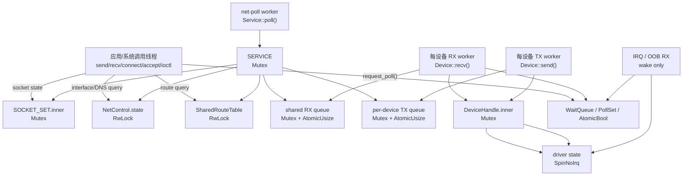

# 锁与并发

`ax-net` 的并发模型是：**协议核心串行推进，设备收发、控制面查询和用户 socket 调用通过短锁、队列、原子状态与 waker 解耦**。smoltcp 的 `Interface` 和 `SocketSet` 不是多线程并发对象，因此 `ax-net` 保持单协议核心，由专用 `net-poll` worker 独占执行完整 poll；应用线程和设备 worker 不直接成为协议栈驱动者。

本文按锁所在层级说明每个同步对象负责的状态、实际源码位置、常见获取路径和不应跨越的边界。代码片段只保留与锁边界相关的部分，完整实现以链接源码为准。

## 总体并发模型



图中的箭头表示常见访问方向，不表示所有对象都在同一个调用栈中嵌套。关键边界是：

- 应用线程可以修改 socket 状态并 `request_poll()`，但不直接执行完整 `Service::poll()`。
- 设备 worker 只在设备和 Router queue 之间搬运 packet，不反向进入 `SERVICE` 或 `SOCKET_SET`。
- IRQ 路径只做 driver 短操作和 wake，不进入 smoltcp、Router 或 socket set。
- 控制面查询返回快照，不持锁暴露内部对象引用。

## 协议核心锁

协议核心由 [lib.rs](net/ax-net/src/lib.rs#L113) 中的全局单例组织：

```rust
// lib.rs:113-123
static LISTEN_TABLE: LazyLock<ListenTable> = LazyLock::new(ListenTable::new);
static SOCKET_SET: LazyLock<SocketSetWrapper> = LazyLock::new(SocketSetWrapper::new);

static SERVICE: Once<Mutex<Service>> = Once::new();
static NET_CONTROL: Once<Arc<NetControl>> = Once::new();
static POLLING_INTERFACES: AtomicBool = AtomicBool::new(false);
static POLL_AGAIN: AtomicBool = AtomicBool::new(false);
static NET_POLL_REQUESTED: AtomicBool = AtomicBool::new(false);
static NET_POLL_WAKE: WaitQueue = WaitQueue::new();
```

### `SERVICE`

`SERVICE: Mutex<Service>` 是协议核心最外层锁，保护 [Service](net/ax-net/src/service.rs#L310) 内的 smoltcp `Interface`、`Router`、DHCP client/server 和 orphan reaper 状态。完整 poll 只通过 [poll_until_idle()](net/ax-net/src/lib.rs#L429) 进入：

```rust
// lib.rs:439-440
while POLL_AGAIN.swap(false, Ordering::AcqRel) {
    while get_service().poll(&mut SOCKET_SET.inner.lock()) {}
}
```

这行代码定义了主锁顺序：`SERVICE -> SOCKET_SET.inner -> Service::poll()`。因此任何已经持有 `SOCKET_SET.inner` 的路径都不能反向获取 `SERVICE`。

`Service::poll()` 的主体在 [service.rs](net/ax-net/src/service.rs#L737)。它在同一轮 poll 内处理 Router RX、DHCP event、DHCP server reply、smoltcp poll、DHCP 定时器、orphan reaper 和 Router TX dispatch：

```rust
// service.rs:737-785, 摘要
pub fn poll(&mut self, sockets: &mut SocketSet) -> bool {
    router_rx_pending = self.router.poll(timestamp, sockets, |interface_id, packet| {
        if let Some(event) = state.process_packet(interface_id, packet, timestamp) {
            dhcp_events.push(event);
        }
    });
    for event in dhcp_events {
        self.handle_dhcp_event(event);
    }
    let socket_state_changed =
        self.iface.poll(timestamp, &mut self.router, sockets) == PollResult::SocketStateChanged;
    let dhcp_poll_next = self.poll_dhcp(timestamp);
    crate::orphan::reap_orphans(timestamp, sockets);

    self.router.dispatch(timestamp, sockets)
        || dhcp_poll_next
        || socket_state_changed
        || router_rx_pending
}
```

`SERVICE` 是必要的全局串行点，因为 smoltcp `Interface`、Router 的 smoltcp-facing buffers 和 DHCP 状态必须作为一个协议核心一起推进。它不应包围用户态阻塞 I/O、设备驱动等待或长时间 sleep。

### `SOCKET_SET.inner`

`SOCKET_SET.inner` 定义在 [wrapper.rs](net/ax-net/src/wrapper.rs#L44)，保护全局 smoltcp `SocketSet`：

```rust
// wrapper.rs:44-50
pub(crate) struct SocketSetWrapper<'a> {
    pub inner: Mutex<SocketSet<'a>>,
    udp_binds: Mutex<HashMap<UdpBindKey, SocketHandle>>,
}
```

socket API 经常只需要 `SOCKET_SET.inner`，例如 `with_socket_mut()` 在 [wrapper.rs](net/ax-net/src/wrapper.rs#L68) 只短暂进入某个 smoltcp socket：

```rust
// wrapper.rs:68-75
pub fn with_socket_mut<T: AnySocket<'a>, R, F>(&self, handle: SocketHandle, f: F) -> R
where
    F: FnOnce(&mut T) -> R,
{
    let mut set = self.inner.lock();
    let socket = set.get_mut(handle);
    f(socket)
}
```

`SOCKET_SET.inner` 保护的是 smoltcp socket 内部状态，不保护 TCP/UDP public bind side table，也不保护控制面接口 registry。这样做可以避免所有 POSIX 语义都挤进一个全局 socket set 锁。

### poll 原子量与 worker 唤醒

[poll_until_idle()](net/ax-net/src/lib.rs#L415) 使用 `POLLING_INTERFACES` 防重入，用 `POLL_AGAIN` 合并 poll 过程中新到的请求：

```rust
// lib.rs:415-429
fn poll_until_idle() {
    POLL_AGAIN.store(true, Ordering::Release);
    loop {
        if POLLING_INTERFACES
            .compare_exchange(false, true, Ordering::Acquire, Ordering::Acquire)
            .is_err()
        {
            return;
        }

        while POLL_AGAIN.swap(false, Ordering::AcqRel) {
            while get_service().poll(&mut SOCKET_SET.inner.lock()) {}
        }
        POLLING_INTERFACES.store(false, Ordering::Release);
```

这些原子量不是数据结构锁。它们只表达“是否已有线程在 poll”“poll 过程中是否又有新事件”，从而让 socket path 和 device worker 只需轻量 `request_poll()`。

## 控制面与路由锁

控制面状态定义在 [service.rs](net/ax-net/src/service.rs#L99)。`NetControl.state` 保护接口 registry 和 DNS registry，`routes` 指向共享路由表：

```rust
// service.rs:99-107
struct ControlState {
    interfaces: Vec<NetInterface>,
    dns: Vec<DnsServerEntry>,
}

pub struct NetControl {
    state: RwLock<ControlState>,
    pub(crate) routes: SharedRouteTable,
}
```

路由表共享类型定义在 [router.rs](net/ax-net/src/router.rs#L417)，Router 和控制面持有同一份 `SharedRouteTable`：

```rust
// router.rs:417-425
pub(crate) type SharedRouteTable = Arc<RwLock<RouteTable>>;

pub struct Router {
    rx_buffer: PacketBuffer,
    tx_buffer: PacketBuffer,
    queues: Arc<RouterQueues>,
    devices: Vec<Arc<DeviceHandle>>,
    table: SharedRouteTable,
}
```

### `NetControl.state`

`NetControl.state` 是读多写少锁。接口查询、DNS 查询和本地地址绑定推导只持读锁并返回快照，例如 `interfaces()` 在 [service.rs](net/ax-net/src/service.rs#L126)：

```rust
// service.rs:126-130
pub fn interfaces(&self) -> Vec<InterfaceInfo> {
    let state = self.state.read();
    state.interfaces.iter().map(NetInterface::to_info).collect()
}
```

运行期 DHCP 或静态设备注册会写入接口/DNS 状态。DHCP commit 的关键更新在 [service.rs](net/ax-net/src/service.rs#L254)：

```rust
// service.rs:254-279, 摘要
let mut state = self.state.write();
if let Some(interface) = state
    .interfaces
    .iter_mut()
    .find(|interface| interface.id == update.interface_id)
{
    interface.ipv4 = update.ipv4;
    interface.gateway = update.gateway;
}
state.dns.retain(|entry| {
    entry.interface_id != update.interface_id || entry.source != update.dns_source
});
self.routes
    .write()
    .replace_ipv4_rules_for_interface(update.interface_id, routes);
```

这里写锁范围只覆盖接口和 DNS registry 的更新；路由表用独立 `SharedRouteTable` 锁。控制面查询路径不进入设备锁，也不需要获取 `SERVICE`。

### `SharedRouteTable`

`SharedRouteTable` 是 route lookup 和 TX dispatch 的共享边界。socket connect/send 通过控制面查询 route；Router dispatch 在 [router.rs](net/ax-net/src/router.rs#L672) 直接读路由表并根据 smoltcp 已选择的源地址决定出接口：

```rust
// router.rs:672-695, 摘要
let routes = self.table.read();
let Some(route) = routes.select_route_for_source(&dst_addr, &src_addr) else {
    warn!("No route found for source {} destination {}", src_addr, dst_addr);
    continue;
};

let dev = &self.devices[route.dev];
if dev.interface_id == InterfaceId::LOOPBACK {
    poll_next |= inject_loopback_rx_direct(
        &mut self.rx_buffer,
        dst_addr,
        packet.into_inner(),
        sockets,
    );
} else {
    poll_next |= dev.enqueue_tx(route.next_hop, packet.into_inner());
}
```

因此 `SharedRouteTable` 是 TX 热路径锁，但只做规则查找，不访问 driver，不访问 socket payload。接口配置或 DHCP 更新通过写锁替换某接口的 IPv4 路由规则。

## Socket 层锁

Socket 层锁分为三类：全局 smoltcp socket set、协议 public side table、单 socket 局部状态。它们不是 `SERVICE` 的重复，而是为了让不同语义有不同粒度。

### TCP public state、端口表与 listen bucket

TCP socket 的 public 状态不完全等同于 smoltcp TCP 状态。`TcpSocket` 在 [tcp.rs](net/ax-net/src/tcp.rs#L82) 中用 `StateLock`、endpoint mutex 和原子 option 保存 POSIX 可见状态：

```rust
// tcp.rs:82-92
pub struct TcpSocket {
    state: StateLock,
    handle: SocketHandle,
    bound_endpoint: Mutex<IpListenEndpoint>,
    peer_endpoint: Mutex<Option<IpEndpoint>>,
    bound_registered: AtomicBool,
```

`StateLock` 在 [state.rs](net/ax-net/src/state.rs#L47) 用 `AtomicU8` 做 public state CAS gate：

```rust
// state.rs:47-65
pub struct StateLock(AtomicU8);

impl StateLock {
    pub fn get(&self) -> State {
        self.0
            .load(Ordering::Acquire)
            .try_into()
            .expect("invalid state")
    }
}
```

TCP 端口占用表在 [tcp.rs](net/ax-net/src/tcp.rs#L922)：

```rust
// tcp.rs:922-939
static TCP_BOUND_PORTS: LazyLock<Mutex<HashMap<u16, Vec<Option<smoltcp::wire::IpAddress>>>>> =
    LazyLock::new(|| Mutex::new(HashMap::new()));

fn register_tcp_bound(endpoint: IpListenEndpoint) -> AxResult {
    let mut bound_ports = TCP_BOUND_PORTS.lock();
    let bound_addrs = bound_ports.entry(endpoint.port).or_default();
    if bound_addrs
        .iter()
        .any(|&addr| listen_addrs_conflict(addr, endpoint.addr))
    {
        return Err(AxError::AddrInUse);
    }
    bound_addrs.push(endpoint.addr);
    Ok(())
}
```

它只记录 public bind ownership，避免每次 ephemeral port 或 bind 冲突检查都扫描整个 `SocketSet`。listen bucket 是 per-port 锁，定义在 [listen_table.rs](net/ax-net/src/listen_table.rs#L113)：

```rust
// listen_table.rs:113-117
type ListenTableEntry = Arc<Mutex<Vec<ListenTableEntryInner>>>;

pub struct ListenTable {
    tcp: Box<[ListenTableEntry]>,
}
```

SYN snoop 在 Router RX 阶段进入对应 bucket，并在已经持有 `SOCKET_SET.inner` 的 poll 上下文里创建 child socket，见 [listen_table.rs](net/ax-net/src/listen_table.rs#L267)：

```rust
// listen_table.rs:274-315, 摘要
let entries = self.listen_entry(dst.port);
let mut table = entries.lock();
if let Some(entry) = table
    .iter_mut()
    .find(|entry| entry.can_accept_endpoint(dst))
{
    if entry.syn_queue.len() >= entry.backlog {
        return;
    }
    let handle = sockets.add(socket);
    entry.syn_queue.push_back(AcceptedTcp {
        handle,
        local_endpoint: dst,
        remote_endpoint: src,
    });
    entry.accept_poll.wake();
}
```

对应的 accept 路径在 [tcp.rs](net/ax-net/src/tcp.rs#L517)，顺序是先进入 `SOCKET_SET.inner`，再进入 `LISTEN_TABLE` bucket：

```rust
// tcp.rs:522-528
let bound_endpoint = self.bound_endpoint()?;
self.general.recv_poller(self, || {
    request_poll();
    let accepted = {
        let mut sockets = SOCKET_SET.inner.lock();
        LISTEN_TABLE.accept(bound_endpoint, &mut sockets)?
    };
```

### UDP bind side table 与局部状态

UDP 的 local/peer 状态定义在 [udp.rs](net/ax-net/src/udp.rs#L76)：

```rust
// udp.rs:76-88
pub struct UdpSocket {
    handle: SocketHandle,
    local_addr: RwLock<Option<IpEndpoint>>,
    peer_addr: RwLock<Option<(IpEndpoint, IpAddress)>>,
    general: GeneralOptions,
    cork: Mutex<Option<CorkState>>,
}
```

UDP public bind side table 放在 `SocketSetWrapper.udp_binds`，bind 路径在 [udp.rs](net/ax-net/src/udp.rs#L181) 体现了实际顺序：先写本地地址状态，进入 smoltcp bind，再登记 public bind ownership。

```rust
// udp.rs:183-220, 摘要
fn bind(&self, local_addr: SocketAddrEx) -> AxResult {
    let mut guard = self.local_addr.write();
    let binding = get_control().local_binding_for(&endpoint)?;

    self.with_smol_socket(|socket| {
        socket.bind(endpoint).map_err(|e| /* ... */)
    })?;
    if !self.general.reuse_address()
        && let Err(err) =
            SOCKET_SET.udp_bind(self.handle, local_endpoint.addr, local_endpoint.port)
    {
        self.with_smol_socket(|socket| socket.close());
        return Err(err);
    }
    *guard = Some(local_endpoint);
    Ok(())
}
```

这里 `local_addr` 和 `udp_binds` 是不同层级：前者是单 socket public state，后者是全局 UDP 端口占用 side table。它们不能简单合并到 `SOCKET_SET.inner`，否则 bind 冲突检查和 socket payload 访问会共享同一个重锁。

### raw socket 暂存锁

raw socket 使用读写锁保存 filter/TTL，并用 `SpinNoIrq` 保护本地暂存包。文件顶部在 [raw.rs](net/ax-net/src/raw.rs#L35) 把 `SpinNoIrq` 别名为 `Mutex`，字段定义在 [raw.rs](net/ax-net/src/raw.rs#L70)：

```rust
// raw.rs:35,70-84
use ax_kspin::SpinNoIrq as Mutex;

pub struct RawSocket {
    handle: SocketHandle,
    ip_version: IpVersion,
    local_addr: RwLock<Option<IpAddress>>,
    peer_addr: RwLock<Option<IpAddress>>,
    loopback_rx: Mutex<Option<(IpAddress, vec::Vec<u8>)>>,
    deferred_rx: Mutex<Option<(IpAddress, vec::Vec<u8>)>>,
    ttl: RwLock<Option<u8>>,
```

`deferred_rx` 的写入在 [raw.rs](net/ax-net/src/raw.rs#L488)，只保存一个被 peer filter 跳过的 wire packet，不跨越阻塞等待：

```rust
// raw.rs:488-490
if !self.source_matches_peer(source) {
    *self.deferred_rx.lock() = Some((source, wire_packet.to_vec()));
    return Err(AxError::WouldBlock);
}
```

### 通用 socket option

`GeneralOptions` 在 [general.rs](net/ax-net/src/general.rs#L34) 用原子字段保存 nonblocking、reuseaddr、timeout、`SO_BINDTODEVICE` 和 socket identity：

```rust
// general.rs:34-49
pub(crate) struct GeneralOptions {
    nonblock: AtomicBool,
    reuse_address: AtomicBool,
    send_timeout_nanos: AtomicU64,
    recv_timeout_nanos: AtomicU64,
    bound_if: AtomicU32,
    socket_type: AtomicI32,
```

这些字段是单值状态，用原子量可以避免 option get/set 每次进入全局 socket set。它们不保护 smoltcp socket state，也不保护复合 bind 语义。

## Router 与设备队列锁

Router 层是协议核心和设备 worker 之间的内存边界。它用有界队列解耦设备收发，不让设备 worker 直接持有 `SERVICE` 或 `SOCKET_SET`。

### `BoundedPacketQueue`

队列定义在 [router.rs](net/ax-net/src/router.rs#L128)。`inner` 保护 `VecDeque`，`len` 是 wait predicate 和快速空队列检查用的长度快照：

```rust
// router.rs:128-163
struct BoundedPacketQueue<T> {
    inner: Mutex<VecDeque<T>>,
    capacity: usize,
    len: AtomicUsize,
}

fn push(&self, packet: T) -> Result<(), T> {
    let mut inner = self.inner.lock();
    if inner.len() >= self.capacity {
        return Err(packet);
    }
    inner.push_back(packet);
    self.len.store(inner.len(), Ordering::Release);
    Ok(())
}

fn pop(&self) -> Option<T> {
    let mut inner = self.inner.lock();
    let packet = inner.pop_front();
    self.len.store(inner.len(), Ordering::Release);
    packet
}
```

`len` 不保护队列内容，因此任何真正 push/pop 都必须进入 `inner`。它的作用是减少 worker 等待判断时的无谓加锁。

### `DeviceHandle`

每个设备一个 `DeviceHandle`，定义在 [router.rs](net/ax-net/src/router.rs#L212)：

```rust
// router.rs:212-228
struct DeviceHandle {
    interface_id: InterfaceId,
    name: String,
    inner: Arc<Mutex<Box<dyn Device>>>,
    rx_queue: Arc<BoundedPacketQueue<RxPacket>>,
    tx_queue: Arc<BoundedPacketQueue<TxPacket>>,
    rx_wake: Arc<WaitQueue>,
    tx_wake: Arc<WaitQueue>,
    rx_waker: Waker,
}
```

`DeviceHandle.inner` 只保护具体设备对象，例如 loopback、Ethernet 或 OOB 设备。它不保护 smoltcp `Interface`、`SocketSet`、路由表或控制面。

### RX worker

RX worker 在 [router.rs](net/ax-net/src/router.rs#L805) 先短暂持有 `DeviceHandle.inner` 调用 `Device::recv()`，再把 packet 推入共享 RX queue 并 `request_poll()`：

```rust
// router.rs:810-847, 摘要
{
    let mut device_inner = device.inner.lock();
    while rx_buffer.is_empty()
        && device_inner.recv(device.interface_id, &mut rx_buffer, now(), &mut snoop)
    {
        received = true;
    }
}

while let Ok((interface_id, packet)) = rx_buffer.dequeue() {
    if device.rx_queue.push(rx).is_err() {
        warn!("{}: RX queue is full, dropping packet", device.name);
        crate::request_poll();
        break;
    }
    crate::request_poll();
}

if !received {
    device.inner.lock().register_waker(&device.rx_waker);
    device.rx_wake.wait();
}
```

这里的关键点是：设备锁释放后才向 Router queue 搬运 packet；整个路径不进入 `SERVICE` 或 `SOCKET_SET`。

### TX worker

TX worker 在 [router.rs](net/ax-net/src/router.rs#L787) 从 per-device TX queue 弹出 packet，然后持设备锁调用 `Device::send()`：

```rust
// router.rs:787-800
fn device_tx_worker(device: Arc<DeviceHandle>) {
    loop {
        if let Some(packet) = device.tx_queue.pop() {
            let poll_next =
                device
                    .inner
                    .lock()
                    .send(packet.next_hop, packet.bytes.as_slice(), now());
            if poll_next {
                crate::request_poll();
            }
        } else {
            device.tx_wake.wait_until(|| !device.tx_queue.is_empty());
        }
    }
}
```

这保证慢设备发送不会持有协议核心锁。Router dispatch 只负责路由选择和入队，真实发送由 TX worker 完成。

### Router poll 与 dispatch

`Router::poll()` 在 [router.rs](net/ax-net/src/router.rs#L577) 把 worker RX queue 搬到 smoltcp-facing `rx_buffer`：

```rust
// router.rs:586-600
while !self.rx_buffer.is_full() {
    let Some(packet) = self.queues.rx.pop() else {
        break;
    };
    let bytes = packet.bytes.as_slice();
    snoop_tcp_packet(bytes, sockets);
    snoop(packet.interface_id, bytes);
    let Ok(dst) = self.rx_buffer.enqueue(bytes.len(), packet.interface_id) else {
        break;
    };
    dst.copy_from_slice(bytes);
    moved_rx = true;
}
```

`Router::dispatch()` 在 smoltcp poll 之后处理 `tx_buffer`。普通设备走 per-device TX queue；loopback 直接注入 `rx_buffer`，避免设备队列 hop。相关逻辑见 [router.rs](net/ax-net/src/router.rs#L653)。

## 设备驱动短锁

设备驱动层锁比 Router 队列更底层，通常需要覆盖 IRQ 与任务上下文同时访问 driver state 的场景，因此使用短临界区。

### Ethernet IRQ state

Ethernet IRQ 共享状态定义在 [device/ethernet.rs](net/ax-net/src/device/ethernet.rs#L123)：

```rust
// device/ethernet.rs:123-138
struct EthernetIrqState {
    irq: Option<usize>,
    irq_registration: spin::Once<Box<dyn EthernetIrqRegistration>>,
    oob_rx: bool,
    driver: SpinNoIrq<Box<dyn EthernetDriver>>,
    poll_ready: PollSet,
}

impl EthernetIrqState {
    fn handle_irq(&self) -> NetIrqEvents {
        self.driver.lock().handle_irq()
    }
}
```

`SpinNoIrq` 下只允许 driver 短操作，例如 IRQ event 读取、TX/RX queue 操作、poll-ready 注册。不得在 guard 内 sleep、wait、调用 socket API 或进入 `Service::poll()`。

### rd-net adapter state

`rd-net` 适配器在 [device/driver.rs](net/ax-net/src/device/driver.rs#L179) 用 `SpinNoIrq` 保护底层 TX/RX queue 和 `pending_rx`：

```rust
// device/driver.rs:179-204
pub struct RdNetDriver {
    name: String,
    mac: [u8; 6],
    irq: Option<usize>,
    irq_handler: Option<rd_net::IrqHandler>,
    state: SpinNoIrq<RdNetState>,
}

state: SpinNoIrq::new(RdNetState {
    tx_queue,
    rx_queue,
    pending_rx: VecDeque::with_capacity(RX_PREFETCH_TARGET),
}),
```

这个锁只保护 `rd-net` ownership 和 queue state，不保护 Router queue，也不保护 smoltcp 状态。

## Unix 与 vsock 本地传输锁

Unix socket 和 vsock 不经过 smoltcp `SocketSet`，但仍复用 socket facade、`GeneralOptions` 和 readiness/poll 机制。它们有自己的局部锁。

Unix abstract namespace 的 bind slot 在 [unix/mod.rs](net/ax-net/src/unix/mod.rs#L112)：

```rust
// unix/mod.rs:112-121
pub struct BindSlot {
    stream: Mutex<Option<stream::Bind>>,
    dgram: Mutex<Option<dgram::Bind>>,
}

static ABSTRACT_BINDS: LazyLock<Mutex<HashMap<Arc<[u8]>, BindSlot>>> =
    LazyLock::new(|| Mutex::new(HashMap::new()));
```

vsock 设备和 pending events 在 [device/vsock.rs](net/ax-net/src/device/vsock.rs#L36)，连接管理器在 [vsock/connection_manager.rs](net/ax-net/src/vsock/connection_manager.rs#L568)：

```rust
// device/vsock.rs:36-53
static VSOCK_DEVICE: Mutex<Option<VsockDevice>> = Mutex::new(None);
static PENDING_EVENTS: Mutex<VecDeque<VsockEvent>> = Mutex::new(VecDeque::new());
static POLL_REF_COUNT: Mutex<usize> = Mutex::new(0);
static POLL_TASK_RUNNING: AtomicBool = AtomicBool::new(false);

// vsock/connection_manager.rs:568-569
pub static VSOCK_CONN_MANAGER: Mutex<VsockConnectionManager> =
    Mutex::new(VsockConnectionManager::new());
```

这部分锁不进入 `SERVICE`，也不要求 smoltcp poll。它们的锁顺序只需要在 Unix/vsock 局部模块内保持一致。

## 锁顺序与关键路径

### 全局锁顺序

[service.rs](net/ax-net/src/service.rs#L3) 文件头给出了协议核心的全局顺序：

```text
SERVICE
  -> SOCKET_SET.inner
    -> TCP_BOUND_PORTS
      -> LISTEN_TABLE.tcp[port]
```

这是允许嵌套时必须遵守的顺序，不表示每条路径都会同时持有全部锁。实际代码会尽量拆短临界区，例如 TCP bind 会分开检查 listen table、控制面绑定和 `TCP_BOUND_PORTS` 登记。

禁止模式：

```text
SOCKET_SET.inner -> SERVICE        // 反向获取协议核心锁
DeviceHandle.inner -> SERVICE      // 设备 worker 反向进入协议核心
SpinNoIrq guard -> block_on/wait   // 禁 IRQ/抢占状态下阻塞
SERVICE/SOCKET_SET -> long sleep   // 阻塞协议栈推进
```

### net-poll worker

```text
NET_POLL_WAKE wait
  -> POLLING_INTERFACES CAS
  -> SERVICE.lock()
  -> SOCKET_SET.inner.lock()
  -> Service::poll()
       -> Router::poll(): shared RX queue lock
       -> DHCP events may commit NetControl/RouteTable
       -> smoltcp Interface::poll()
       -> orphan reaper: ORPHAN_SOCKETS.lock()
       -> Router::dispatch(): RouteTable.read + per-device TX queue lock
```

`poll_until_idle()` 是唯一执行完整 smoltcp poll 的路径。socket 调用者只 `request_poll()`，不会在热路径同步抢 `SERVICE` 推进整个协议栈。

### TCP bind / listen / accept

```text
bind():
  StateLock CAS
  -> bound_endpoint Mutex
  -> LISTEN_TABLE.can_listen()
  -> NetControl.local_binding_for()
  -> TCP_BOUND_PORTS.lock()

listen():
  StateLock CAS
  -> bound_endpoint Mutex
  -> NetControl.local_binding_for()
  -> TCP_BOUND_PORTS.lock()       // only if bind() did not register it earlier
  -> LISTEN_TABLE.tcp[port].lock()

accept():
  SOCKET_SET.inner.lock()
  -> LISTEN_TABLE.tcp[port].lock()

SYN snoop during Router RX:
  SOCKET_SET.inner is already held by poll_until_idle()'s inline poll call
  -> LISTEN_TABLE.tcp[port].lock()
  -> SocketSet::add(child socket)
```

TCP 的 public bind 语义由 `TCP_BOUND_PORTS` 维护，passive open 的 pending child 由 `LISTEN_TABLE` 维护。两者分离是为了避免每次 bind 都扫描整个 `SocketSet`。

### UDP / raw socket

```text
UDP bind:
  local_addr.write()
  -> smoltcp socket bind through SOCKET_SET.inner
  -> SocketSetWrapper.udp_binds.lock()

UDP send:
  peer_addr.read()
  -> SOCKET_SET.inner.lock()
  -> request_poll()

raw recv with peer filter:
  SOCKET_SET.inner.lock()
  -> deferred_rx SpinNoIrq only for local stash
```

UDP/raw 的本地地址、peer 地址、TTL 使用读写锁或短 `SpinNoIrq`，因为这些状态和 smoltcp socket payload 的生命周期不同。

### 控制面查询与提交

```text
interfaces()/dns_servers()/ipv4_config():
  NetControl.state.read()
  -> clone snapshot
  -> unlock

select_route_with_binding():
  NetControl.state.read()
  -> SharedRouteTable.read()
  -> RouteDecision

DHCP/static commit:
  SERVICE.lock()
  -> update smoltcp Interface address list
  -> NetControl.state.write() and/or SharedRouteTable.write()
```

查询路径通常不获取 `SERVICE`，因此接口查询、DNS server 查询和 route snapshot 不会被 smoltcp poll 长时间阻塞。提交路径由 `Service` 协调，是为了让 smoltcp address list 与控制面快照保持一致。

### 设备 RX/TX worker

```text
RX worker:
  DeviceHandle.inner.lock()
  -> Device::recv()
       -> EthernetIrqState.driver SpinNoIrq
       -> RdNetDriver.state SpinNoIrq
  -> shared RX queue lock
  -> request_poll()

TX worker:
  per-device TX queue lock
  -> DeviceHandle.inner.lock()
  -> Device::send()
       -> EthernetIrqState.driver SpinNoIrq
       -> RdNetDriver.state SpinNoIrq
```

设备 worker 不持有 `SERVICE` 或 `SOCKET_SET`。它们只在设备和 Router queue 之间搬运 packet。队列满时丢包并唤醒 net-poll worker，不创建无界 backlog。

### IRQ / OOB RX

```text
Ethernet IRQ:
  EthernetIrqState.driver SpinNoIrq
  -> poll_ready.wake()
  -> return Wake

OOB RX:
  wake_net_task_irq()
  -> OOB_RX_SIGNAL.wake()
  -> {ifname}-oob-poll task
  -> request_poll()
```

IRQ handler 不进入 `SERVICE`、`SOCKET_SET` 或 Router。它只读取 driver IRQ event 并唤醒任务上下文，由 worker 或 net-poll 在可阻塞上下文中继续处理。

## 设计约束

### 为什么不能只保留全局锁

`SERVICE` 和 `SOCKET_SET.inner` 只能保护 smoltcp 协议核心与 socket set。内部仍需要局部锁，原因是：

- 设备 worker 必须能在不进入协议核心的情况下收发 packet，否则慢设备会阻塞 smoltcp poll。
- 控制面查询需要在不持 `SERVICE` 的情况下返回接口、DNS 和路由快照，否则 `ifconfig`、netlink、DNS server 查询会和协议 poll 强耦合。
- TCP/UDP bind side table 是 POSIX public 语义，不等同于 smoltcp socket payload state，单独维护可以避免扫描整个 `SocketSet`。
- Unix/vsock 不经过 smoltcp，不能依赖 `SERVICE` 表达本地传输状态。
- `SpinNoIrq` 只服务 IRQ/driver 短临界区，不能和任务级 `Mutex` 混用成一个大锁。

因此当前锁不是冗余叠加，而是按所有权边界拆分：协议核心、控制面、socket public state、Router queue、设备驱动、本地传输各自保护自己的状态。

### 为什么 socket 热路径不直接 poll

如果 socket send/recv/connect 在持有 socket 或 `SocketSet` 状态时同步调用 `Service::poll()`，容易形成：

- 应用线程与协议核心互相阻塞。
- 多线程抢全局 poll 锁。
- 设备 worker / net-poll worker 被应用线程时序影响。
- 单核上出现 busy-loop 或不稳定调度依赖。

当前模型是：

```text
socket path:
  mutate socket state
  -> request_poll()
  -> optional wait on poller/waker

net-poll worker:
  wake
  -> poll_until_idle()
```

这更接近 lwIP `tcpip_thread` 和 Linux softirq/NAPI 的职责分离：应用线程不成为临时协议栈驱动者。

## 检查清单

修改 `ax-net` 锁相关代码时，应确认：

- 新路径没有 `SOCKET_SET.inner -> SERVICE` 的反向获取。
- 设备 worker 没有在持有 `DeviceHandle.inner` 或 driver `SpinNoIrq` 时进入 `SERVICE` / `SOCKET_SET`。
- `SpinNoIrq` guard 内没有 sleep、wait、block_on、DNS 查询或 socket API。
- 新增全局表优先使用短临界区，并说明它与 `SERVICE` / `SOCKET_SET` 的顺序。
- 新增 socket 局部状态优先用原子或 `RwLock`，避免把整个 POSIX 操作包在全局 `SocketSet` 锁内。
- 新增 worker wake 路径只设置原子/waker，不直接执行 smoltcp poll。
- 文档中的锁顺序与 [service.rs](net/ax-net/src/service.rs#L3) 文件头保持一致。
