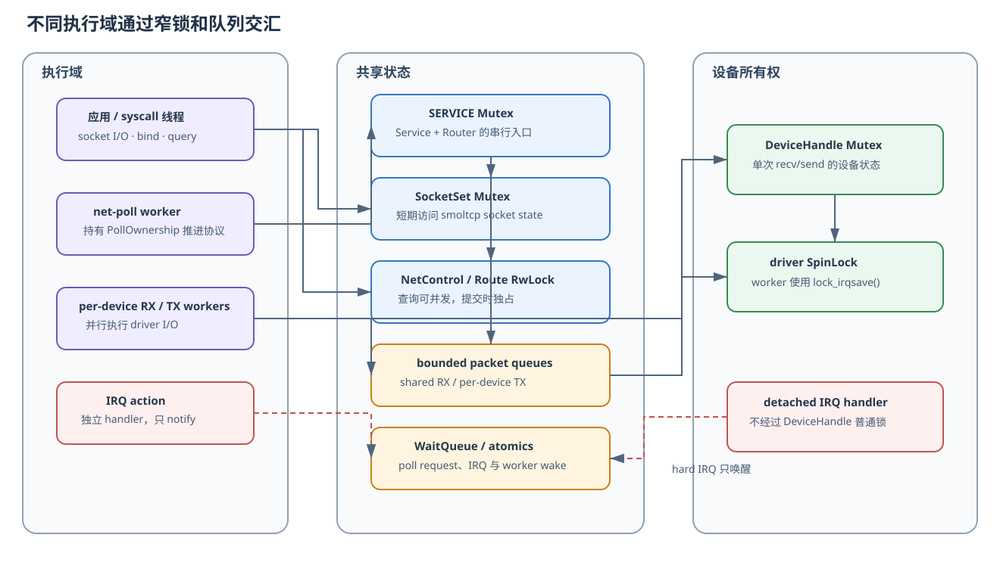

# 锁与并发

`ax-net` 的并发模型是：**协议核心串行推进，设备收发、控制面查询和用户 socket 调用通过短锁、队列、原子状态与 waker 解耦**。smoltcp 的 `Interface` 和 `SocketSet` 不是多线程并发对象，因此 `PollOwnership` 保证任一时刻只有一个完整 poll 推进者：通常是 `net-poll` worker；UDP drop 的同步 egress flush 可以在调用线程取得 required ownership。设备 worker 从不成为协议栈驱动者。

本文按锁所在层级说明每个同步对象负责的状态、实际源码位置、常见获取路径和不应跨越的边界。代码片段只保留与锁边界相关的部分，完整实现以链接源码为准。

## 1. 总体并发模型

总体并发模型把应用线程、网络轮询 Worker、设备收发 Worker 和 IRQ action 映射到各自允许访问的共享资源。`SERVICE`、`SocketSet`、控制面读写锁与设备队列具有固定方向，图中的虚线唤醒路径表示 IRQ 不会进入普通设备锁或协议核心。



图中的箭头表示常见访问方向，不表示所有对象都在同一个调用栈中嵌套。关键边界是：

- 普通应用路径修改 socket 状态并 `request_poll()`；只有 UDP drop 的内部 `flush_egress()` 会先获取 required ownership 再执行完整 `Service::poll()`。
- 设备 worker 只在设备和 Router queue 之间搬运 packet，不反向进入 `SERVICE` 或 `SOCKET_SET`。
- IRQ action 独立拥有从 driver 分离出的 `EthernetIrqHandler`，只确认/汇总事件并 wake，不获取正常收发的 driver lock，也不进入 smoltcp、Router 或 socket set。
- 控制面查询返回快照，不持锁暴露内部对象引用。

这些边界把图中的访问方向转化为可审查规则：协议核心、设备 Worker 和 IRQ 之间只能通过请求或队列交接。下一节从最上层的服务锁开始说明串行协议状态如何被保护。

## 2. 协议核心锁

协议核心由 `lib.rs` 中的全局 `SERVICE`、`SOCKET_SET` 和轮询原子状态共同组织，任一时刻只有一个所有权持有者可以推进 smoltcp。外层服务锁负责调度状态，内层 SocketSet 锁负责 socket 集合，两者必须保持固定嵌套方向。

```rust
// lib.rs:113-123
static LISTEN_TABLE: LazyLock<ListenTable> = LazyLock::new(ListenTable::new);
static SOCKET_SET: LazyLock<SocketSetWrapper> = LazyLock::new(SocketSetWrapper::new);

static SERVICE: Once<Mutex<Service>> = Once::new();
static NET_CONTROL: Once<Arc<NetControl>> = Once::new();
static POLL_OWNER: AtomicU8 = AtomicU8::new(POLL_OWNER_FREE);
static NET_POLL_REQUESTED: AtomicBool = AtomicBool::new(false);
static NET_POLL_WAKE: WaitQueue = WaitQueue::new();
```

全局单例代码显示服务、SocketSet、监听表和控制面分别拥有独立同步对象，初始化后不会替换所有者。服务锁位于协议推进最外层，下面说明它保护的状态和进入条件。

### 2.1 服务锁

`SERVICE: Mutex<Service>` 是协议核心最外层锁，保护 `Service` 内的 smoltcp `Interface`、`Router`、DHCP client/server 和 orphan reaper 状态。完整 poll 通过取得 `PollOwnership` 后的 `poll_until_idle(ownership)` 进入：

```rust
while get_service().poll(&mut SOCKET_SET.inner.lock()) {}
```

这行代码定义了主锁顺序：`SERVICE -> SOCKET_SET.inner -> Service::poll()`。因此任何已经持有 `SOCKET_SET.inner` 的路径都不能反向获取 `SERVICE`。

`Service::poll()` 的主体在 `service.rs`。它在同一轮 poll 内处理 Router RX、DHCP event、DHCP server reply、smoltcp poll、DHCP 定时器、orphan reaper 和 Router TX dispatch：

```rust
// service.rs:737-785, 摘要
pub fn poll(&mut self, sockets: &mut SocketSet) -> bool {
    router_rx_pending = self.router.poll(timestamp, sockets, |interface_id, packet| {
        if let Some(event) = state.process_packet(interface_id, packet, timestamp) {
            dhcp_events.push(event);
        }
    });
    for event in dhcp_events {
        self.handle_dhcp_event(event);
    }
    let socket_state_changed =
        self.iface.poll(timestamp, &mut self.router, sockets) == PollResult::SocketStateChanged;
    let dhcp_poll_next = self.poll_dhcp(timestamp);
    crate::orphan::reap_orphans(timestamp, sockets);

    self.router.dispatch(timestamp, sockets)
        || dhcp_poll_next
        || socket_state_changed
        || router_rx_pending
}
```

`SERVICE` 是必要的全局串行点，因为 smoltcp `Interface`、Router 的 smoltcp-facing buffers 和 DHCP 状态必须作为一个协议核心一起推进。它不应包围用户态阻塞 I/O、设备驱动等待或长时间 sleep。

### 2.2 SocketSet 锁

`SOCKET_SET.inner` 定义在 `wrapper.rs`，保护全局 smoltcp `SocketSet` 以及 handle 查找、插入和移除。调用方应在锁内只完成短状态操作，把用户复制、等待和可能触发回调的工作移到临界区之外。

```rust
// wrapper.rs:44-50
pub(crate) struct SocketSetWrapper<'a> {
    pub inner: Mutex<SocketSet<'a>>,
    udp_binds: Mutex<HashMap<u16, Vec<UdpBoundEntry>>>,
}
```

socket API 经常只需要 `SOCKET_SET.inner`，例如 `with_socket_mut()` 在 `wrapper.rs` 只短暂进入某个 smoltcp socket：

```rust
// wrapper.rs:68-75
pub fn with_socket_mut<T: AnySocket<'a>, R, F>(&self, handle: SocketHandle, f: F) -> R
where
    F: FnOnce(&mut T) -> R,
{
    let mut set = self.inner.lock();
    let socket = set.get_mut(handle);
    f(socket)
}
```

`SOCKET_SET.inner` 保护的是 smoltcp socket 内部状态，不保护 TCP/UDP public bind side table，也不保护控制面接口 registry。这样做可以避免所有 POSIX 语义都挤进一个全局 socket set 锁。

### 2.3 轮询原子量

`poll_until_idle()` 使用 `PollOwnership` 的单原子状态防止并发推进，并消费 `NET_POLL_REQUESTED` 合并 poll 过程中新到的请求：

```rust
fn poll_until_idle(ownership: PollOwnership) -> bool {
    if !ownership.try_acquire() {
        return false;
    }
    // poll Service/SocketSet，解锁后 drain deferred PollSet wakes。
    // owner guard Drop 以 Release 释放所有权。
    true
}
```

这些原子量不是数据结构锁。`Opportunistic` 申请失败即可返回，供常规 worker 使用；`Required` 等待 owner 释放，供 UDP close 保证 egress 交付。两者都不能替代 `SERVICE`/`SOCKET_SET` 对具体状态的保护。

## 3. 控制面路由锁

控制面状态定义在 `service.rs`。`NetControl.state` 保护接口 registry 和 DNS registry，`routes` 指向共享路由表：

```rust
// service.rs:99-107
struct ControlState {
    interfaces: Vec<NetInterface>,
    dns: Vec<DnsServerEntry>,
}

pub struct NetControl {
    state: RwLock<ControlState>,
    pub(crate) routes: SharedRouteTable,
}
```

路由表共享类型定义在 `router.rs`，Router 和控制面持有同一份 `SharedRouteTable`：

```rust
// router.rs:417-425
pub(crate) type SharedRouteTable = Arc<RwLock<RouteTable>>;

pub struct Router {
    rx_buffer: PacketBuffer,
    tx_buffer: PacketBuffer,
    queues: Arc<RouterQueues>,
    devices: Vec<Arc<DeviceHandle>>,
    table: SharedRouteTable,
}
```

结构代码显示接口/DNS registry 与共享路由表采用分离锁，使普通快照查询不需要进入 `SERVICE`。控制面状态锁负责第一部分，路由锁在下一小节单独说明。

### 3.1 控制面状态锁

`NetControl.state` 是读多写少锁。接口查询、DNS 查询和本地地址绑定推导只持读锁并返回快照，例如 `interfaces()` 在 `service.rs`：

```rust
// service.rs:126-130
pub fn interfaces(&self) -> Vec<InterfaceInfo> {
    let state = self.state.read();
    state.interfaces.iter().map(NetInterface::to_info).collect()
}
```

运行期 DHCP 或静态设备注册会写入接口/DNS 状态。DHCP commit 的关键更新在 `service.rs`：

```rust
// service.rs:254-279, 摘要
let mut state = self.state.write();
if let Some(interface) = state
    .interfaces
    .iter_mut()
    .find(|interface| interface.id == update.interface_id)
{
    interface.ipv4 = update.ipv4;
    interface.gateway = update.gateway;
}
state.dns.retain(|entry| {
    entry.interface_id != update.interface_id || entry.source != update.dns_source
});
self.routes
    .write()
    .replace_ipv4_rules_for_interface(update.interface_id, routes);
```

这里写锁范围只覆盖接口和 DNS registry 的更新；路由表用独立 `SharedRouteTable` 锁。控制面查询路径不进入设备锁，也不需要获取 `SERVICE`。

### 3.2 共享路由锁

`SharedRouteTable` 是 route lookup 和 TX dispatch 的共享边界。socket connect/send 通过控制面查询 route；Router dispatch 在 `router.rs` 直接读路由表并根据 smoltcp 已选择的源地址决定出接口：

```rust
// router.rs:672-695, 摘要
let routes = self.table.read();
let Some(route) = routes.select_route_for_source(&dst_addr, &src_addr) else {
    warn!("No route found for source {} destination {}", src_addr, dst_addr);
    continue;
};

let dev = &self.devices[route.dev];
if dev.interface_id == InterfaceId::LOOPBACK {
    poll_next |= inject_loopback_rx_direct(
        &mut self.rx_buffer,
        dst_addr,
        packet.into_inner(),
        sockets,
    );
} else {
    poll_next |= dev.enqueue_tx(route.next_hop, packet.into_inner());
}
```

因此 `SharedRouteTable` 是 TX 热路径锁，但只做规则查找，不访问 driver，不访问 socket payload。接口配置或 DHCP 更新通过写锁替换某接口的 IPv4 路由规则。

## 4. Socket 层锁

Socket 层锁分为三类：全局 smoltcp socket set、协议 public side table、单 socket 局部状态。它们不是 `SERVICE` 的重复，而是为了让不同语义有不同粒度。

### 4.1 TCP 公共状态

TCP socket 的 public 状态不完全等同于 smoltcp TCP 状态。`TcpSocket` 在 `tcp.rs` 中用 `StateLock`、endpoint mutex 和原子 option 保存 POSIX 可见状态：

```rust
// tcp.rs:82-92
pub struct TcpSocket {
    state: StateLock,
    handle: SocketHandle,
    bound_endpoint: Mutex<IpListenEndpoint>,
    peer_endpoint: Mutex<Option<IpEndpoint>>,
    bound_registered: AtomicBool,
```

`StateLock` 在 `state.rs` 用 `AtomicU8` 做 public state CAS gate：

```rust
// state.rs:47-65
pub struct StateLock(AtomicU8);

impl StateLock {
    pub fn get(&self) -> State {
        self.0
            .load(Ordering::Acquire)
            .try_into()
            .expect("invalid state")
    }
}
```

TCP 端口占用表在 `tcp.rs`：

```rust
// tcp.rs:953-970
static TCP_BOUND_PORTS: LazyLock<Mutex<HashMap<u16, Vec<TcpBoundEntry>>>> =
    LazyLock::new(|| Mutex::new(HashMap::new()));

struct TcpBoundEntry {
    addr: Option<IpAddress>,
    reuse_port: bool,
}
```

它只记录 public bind ownership，避免每次 ephemeral port 或 bind 冲突检查都扫描整个 `SocketSet`。listen table 按端口懒创建 bucket，每个 bucket 仍是独立短锁，定义在 `listen_table.rs`：

```rust
// listen_table.rs:108-112
type ListenTableEntry = Arc<Mutex<Vec<ListenTableEntryInner>>>;

pub struct ListenTable {
    tcp: Mutex<HashMap<u16, ListenTableEntry>>,
}
```

SYN snoop 在 Router RX 阶段进入对应 bucket，并在已经持有 `SOCKET_SET.inner` 的 poll 上下文里创建 child socket，见 `listen_table.rs`：

```rust
// listen_table.rs:274-315, 摘要
let Some(entries) = self.listen_entry(dst.port) else {
    return;
};
let mut table = entries.lock();
if let Some(entry) = table
    .iter_mut()
    .find(|entry| entry.can_accept_endpoint(dst))
{
    if entry.syn_queue.len() >= entry.backlog {
        return;
    }
    let handle = sockets.add(socket);
    entry.syn_queue.push_back(AcceptedTcp {
        handle,
        local_endpoint: dst,
        remote_endpoint: src,
    });
    entry.accept_poll.wake();
}
```

对应的 accept 路径在 `tcp.rs`，顺序是先进入 `SOCKET_SET.inner`，再进入 `LISTEN_TABLE` bucket：

```rust
// tcp.rs:522-528
let bound_endpoint = self.bound_endpoint()?;
self.general.recv_poller(self, || {
    request_poll();
    let accepted = {
        let mut sockets = SOCKET_SET.inner.lock();
        LISTEN_TABLE.accept(bound_endpoint, &mut sockets)?
    };
```

TCP 代码展示 public state、端口表和监听 bucket 的获取方向，accept queue 不直接暴露 smoltcp child。UDP 使用独立 bind side table 和局部 endpoint 锁，不能复用 TCP 的 stream 生命周期。

### 4.2 UDP 绑定状态

UDP 的 local/peer endpoint、cork 与 option 状态定义在 `udp.rs`，而 wildcard 冲突和 reuseport 组由 `SocketSetWrapper` 的 bind side table 仲裁。局部锁与全局表必须按统一顺序更新，确保 bind 失败或 drop 时不会留下幽灵占用。

```rust
// udp.rs:76-88
pub struct UdpSocket {
    handle: SocketHandle,
    bind_lock: Mutex<()>,
    local_addr: Mutex<Option<IpEndpoint>>,
    peer_addr: Mutex<Option<(IpEndpoint, IpAddress)>>,
    general: GeneralOptions,
    tos_keys: Mutex<Vec<EgressIpTosKey>>,
    cork: Mutex<Option<CorkState>>,
}
```

UDP public bind side table 放在 `SocketSetWrapper.udp_binds`。`bind_lock` 把 local 检查、smoltcp bind、side-table 登记和回滚串成一个事务；`local_addr`/`peer_addr` 使用 sleepable `Mutex`，不是 `RwLock`。

```rust
// udp.rs:183-220, 摘要
fn bind(&self, local_addr: SocketAddrEx) -> NetResult {
    let _bind_guard = self.bind_lock.lock();
    let binding = get_control().local_binding_for(&endpoint)?;

    self.with_smol_socket(|socket| {
        socket.bind(endpoint).map_err(|e| /* ... */)
    })?;
    if let Err(err) = SOCKET_SET.udp_bind(
        self.handle,
        local_endpoint.addr,
        local_endpoint.port,
        self.general.reuse_port(),
    ) {
        self.with_smol_socket(|socket| socket.close());
        return Err(err);
    }
    *self.local_addr.lock() = Some(local_endpoint);
    Ok(())
}
```

这里 `local_addr` 和 `udp_binds` 是不同层级：前者是单 socket public state，后者是全局 UDP 端口占用 side table。它们不能简单合并到 `SOCKET_SET.inner`，否则 bind 冲突检查和 socket payload 访问会共享同一个重锁。

### 4.3 Raw Socket 暂存锁

raw socket 使用读写锁保存 filter/TTL，并用 `SpinLock` 保护本地暂存包。文件顶部在 `raw.rs`
把 `SpinLock` 别名为 `Mutex`，获取暂存包时使用 `lock_irqsave()`：

```rust
// raw.rs，简化示意
use ax_sync::{SpinLock as Mutex, SpinRwLock as RwLock};

pub struct RawSocket {
    handle: SocketHandle,
    ip_version: IpVersion,
    local_addr: RwLock<Option<IpAddress>>,
    peer_addr: RwLock<Option<IpAddress>>,
    loopback_rx: Mutex<Option<(IpAddress, vec::Vec<u8>)>>,
    deferred_rx: Mutex<Option<(IpAddress, vec::Vec<u8>)>>,
    ttl: RwLock<Option<u8>>,
```

`deferred_rx` 的写入在 `raw.rs`，只保存一个被 peer filter 跳过的 wire packet，不跨越阻塞等待：

```rust
// raw.rs:488-490
if !self.source_matches_peer(source) {
    *self.deferred_rx.lock() = Some((source, wire_packet.to_vec()));
    return Err(NetError::WouldBlock);
}
```

Raw Socket 暂存代码把 packet 所有权限制在单 backend 的短锁内，避免持全局 `SocketSet` 构造用户消息。通用选项主要使用原子字段和 PollSet，属于另一种跨 backend 同步模式。

### 4.4 通用 Socket 选项

`GeneralOptions` 在 `general.rs` 用原子字段保存 nonblocking、reuseaddr、timeout、`SO_BINDTODEVICE` 和 socket identity：

```rust
// general.rs:34-49
pub(crate) struct GeneralOptions {
    nonblock: AtomicBool,
    reuse_address: AtomicBool,
    reuse_port: AtomicBool,
    send_timeout_nanos: AtomicU64,
    recv_timeout_nanos: AtomicU64,
    bound_if: AtomicU32,
    ip_tos: AtomicU8,
    ip_mtu_discover: AtomicU8,
    socket_type: AtomicI32,
```

这些字段是单值状态，用原子量可以避免 option get/set 每次进入全局 socket set。它们不保护 smoltcp socket state，也不保护复合 bind 语义。

## 5. Router 设备队列锁

Router 层是协议核心和设备 worker 之间的内存边界。它用有界队列解耦设备收发，不让设备 worker 直接持有 `SERVICE` 或 `SOCKET_SET`。

### 5.1 有界包队列

队列定义在 `router.rs`。`inner` 保护 `VecDeque`，`len` 是 wait predicate 和快速空队列检查用的长度快照：

```rust
// router.rs:128-163
struct BoundedPacketQueue<T> {
    inner: Mutex<VecDeque<T>>,
    capacity: usize,
    len: AtomicUsize,
}

fn push(&self, packet: T) -> Result<(), T> {
    let mut inner = self.inner.lock();
    if inner.len() >= self.capacity {
        return Err(packet);
    }
    inner.push_back(packet);
    self.len.store(inner.len(), Ordering::Release);
    Ok(())
}

fn pop(&self) -> Option<T> {
    let mut inner = self.inner.lock();
    let packet = inner.pop_front();
    self.len.store(inner.len(), Ordering::Release);
    packet
}
```

`len` 不保护队列内容，因此任何真正 push/pop 都必须进入 `inner`。它的作用是减少 worker 等待判断时的无谓加锁。

### 5.2 设备句柄

每个设备对应一个定义在 `router.rs` 的 `DeviceHandle`，短锁保护具体 `Device`，队列和 wake state 则支持独立 RX/TX Worker。handle 的方法应复制 readiness 或统计快照后立即释放锁，不能把 guard 带入 `PollSet` 注册或协议回调。

```rust
// router.rs:212-228
struct DeviceHandle {
    interface_id: InterfaceId,
    name: String,
    inner: Arc<Mutex<Box<dyn Device>>>,
    rx_queue: Arc<BoundedPacketQueue<RxPacket>>,
    tx_queue: Arc<BoundedPacketQueue<TxPacket>>,
    rx_wake: Arc<WaitQueue>,
    tx_wake: Arc<WaitQueue>,
    rx_waker: Waker,
    rx_ready: AtomicBool,
    // rx/tx bytes, packets, errors, dropped: AtomicU64
}
```

`DeviceHandle.inner` 只保护具体设备对象，例如 loopback、Ethernet 或 OOB 设备。它不保护 smoltcp `Interface`、`SocketSet`、路由表或控制面。

### 5.3 RX Worker

RX worker 在 `router.rs` 先短暂持有 `DeviceHandle.inner` 调用 `Device::recv()`，再把 packet 推入共享 RX queue 并 `request_poll()`：

```rust
let mut local_batch = VecDeque::with_capacity(DEVICE_RX_WORKER_BATCH);
loop {
    let mut device_inner = device.inner.lock();
    while local_batch.len() < DEVICE_RX_WORKER_BATCH {
        let frame_len = device_inner.recv(/* ... */);
        if frame_len == 0 { break; }
        local_batch.push_back((dequeue_rx_packet(), frame_len));
    }
    drop(device_inner);
    if device.drain_local_batch_step(&mut local_batch).is_err() {
        request_poll();
        yield_now();
    } else if local_batch.is_empty() {
        register_device_poll(&device, &device.rx_waker);
        device.rx_wake.wait_timeout_until(DEVICE_RX_IDLE_POLL_INTERVAL, /* ... */);
    }
}
```

这里的关键点是：设备锁释放后才向 Router queue 搬运 packet；整个路径不进入 `SERVICE` 或 `SOCKET_SET`。当前实现还维护最多 16 项的 `local_batch`，shared RX queue 满时保留未入队项、`request_poll()`、yield 后重试，而不是立即丢包。无 readiness source 时使用 10 ms idle timeout 兜底。

### 5.4 TX Worker

TX worker 在 `router.rs` 从 per-device TX queue 弹出 packet，然后持设备锁调用 `Device::send()`：

```rust
// router.rs:787-800
fn device_tx_worker(device: Arc<DeviceHandle>) {
    loop {
        if let Some(packet) = device.tx_queue.pop() {
            let frame_len =
                device
                    .inner
                    .lock()
                    .send(packet.next_hop, packet.bytes.as_slice(), now());
            if frame_len > 0 {
                device.count_tx(frame_len);
            }
        } else {
            device.tx_wake.wait_until(|| !device.tx_queue.is_empty());
        }
    }
}
```

这保证慢设备发送不会持有协议核心锁。Router dispatch 只负责路由选择和入队，真实发送由 TX worker 完成。

### 5.5 Router 轮询分发

`Router::poll()` 在 `router.rs` 把 worker RX queue 搬到 smoltcp-facing `rx_buffer`：

```rust
// router.rs:586-600
while !self.rx_buffer.is_full() {
    let Some(packet) = self.queues.rx.pop() else {
        break;
    };
    let bytes = packet.bytes.as_slice();
    snoop_tcp_packet(bytes, sockets);
    snoop(packet.interface_id, bytes);
    let metadata = rx_metadata(packet.interface_id, bytes);
    let Ok(dst) = self.rx_buffer.enqueue(bytes.len(), metadata) else {
        break;
    };
    dst.copy_from_slice(bytes);
    moved_rx = true;
}
```

`Router::dispatch()` 在 smoltcp poll 之后处理 `tx_buffer`。普通设备走 per-device TX queue；loopback 直接注入 `rx_buffer`，避免设备队列 hop。相关逻辑见 `router.rs`。

## 6. 设备驱动短锁

设备驱动层锁比 Router 队列更底层，通常需要覆盖 IRQ 与任务上下文同时访问 driver state 的场景，因此使用短临界区。

### 6.1 Ethernet IRQ 状态

Ethernet IRQ 共享状态定义在 `device/ethernet.rs`，用于记录独立 handler、事件确认和 OOB readiness，而不是保护普通收发全过程。平台 action 消费 detached handler 后只执行 IRQ-safe 通知，Worker 再在任务上下文进入 driver 锁。

```rust
// device/ethernet.rs，简化示意
struct EthernetIrqState {
    irq: Option<IrqId>,
    irq_registration: ax_lazyinit::OnceLock<Box<dyn EthernetIrqRegistration>>,
    oob_rx: bool,
    driver: SpinLock<Box<dyn EthernetDriver>>,
    poll_ready: Arc<PollSet>,
}
```

注册时，`EthernetDevice` 调用 `driver.take_irq_handler()`，把 `Box<dyn EthernetIrqHandler>` 移交给 `EthernetIrqAction`；平台 IRQ callback 独立持有并调用它。因此硬 IRQ 不再获取 `EthernetIrqState.driver` 的收发 `SpinLock`。如果驱动有 IRQ id 却没有可移交 handler，或 registrar 不存在/注册失败，设备保持纯 polling fallback，由 RX worker 每 10 ms 检查。

### 6.2 通用驱动状态

`rd-net` 适配器在 `device/driver.rs` 用 `SpinLock` 的 IRQ-save 获取保护底层 TX/RX queue 和 `pending_rx`：

```rust
// device/driver.rs:179-204
pub struct RdNetDriver {
    name: String,
    mac: [u8; 6],
    irq: Option<IrqId>,
    irq_handler: Option<Box<dyn EthernetIrqHandler>>,
    control: Net,
    state: SpinLock<RdNetState>,
}

state: SpinLock::new(RdNetState {
    tx_queue,
    rx_queue,
    pending_rx: VecDeque::with_capacity(RX_PREFETCH_TARGET),
}),
```

这个锁只保护 `rd-net` ownership 和 queue state，不保护 Router queue，也不保护 smoltcp 状态。

## 7. 本地传输锁

Unix socket 和 vsock 不经过 smoltcp `SocketSet`，但仍复用 socket facade、`GeneralOptions` 和 readiness/poll 机制。它们有自己的局部锁。

Unix abstract namespace 的 bind slot 在 `unix/mod.rs`：

```rust
// unix/mod.rs:112-121
pub struct BindSlot {
    stream: Mutex<Option<stream::Bind>>,
    dgram: Mutex<Option<dgram::Bind>>,
}

static ABSTRACT_BINDS: LazyLock<Mutex<HashMap<Arc<[u8]>, BindSlot>>> =
    LazyLock::new(|| Mutex::new(HashMap::new()));
```

vsock 设备和 pending events 在 `device/vsock.rs`，连接管理器在 `vsock/connection_manager.rs`：

```rust
// device/vsock.rs:36-53
static VSOCK_DEVICE: Mutex<Option<VsockDevice>> = Mutex::new(None);
static PENDING_EVENTS: Mutex<VecDeque<VsockEvent>> = Mutex::new(VecDeque::new());
static POLL_REF_COUNT: Mutex<usize> = Mutex::new(0);
static POLL_TASK_RUNNING: AtomicBool = AtomicBool::new(false);

// vsock/connection_manager.rs:568-569
pub static VSOCK_CONN_MANAGER: Mutex<VsockConnectionManager> =
    Mutex::new(VsockConnectionManager::new());
```

这部分锁不进入 `SERVICE`，也不要求 smoltcp poll。它们的锁顺序只需要在 Unix/vsock 局部模块内保持一致。

## 8. 锁顺序关键路径

关键路径把抽象锁顺序落实到网络轮询、socket 仲裁、控制面提交、设备 Worker 和 IRQ 等实际调用链。维护者应从入口沿箭头检查每次获取，任何从局部设备或 side table 反向进入 `SERVICE` 的路径都需要重新设计。

### 8.1 全局锁顺序

`service.rs` 文件头记录了协议核心的全局锁顺序，约束 `SERVICE`、`SocketSet`、控制面状态与路由表的嵌套方向。局部 socket side table 和设备锁位于不同分支，不能通过回调把它们重新接成环。

```text
SERVICE
  -> SOCKET_SET.inner
    -> TCP_BOUND_PORTS
      -> LISTEN_TABLE.tcp[port]
```

这是允许嵌套时必须遵守的顺序，不表示每条路径都会同时持有全部锁。实际代码会尽量拆短临界区，例如 TCP bind 会分开检查 listen table、控制面绑定和 `TCP_BOUND_PORTS` 登记。

禁止模式：

```text
SOCKET_SET.inner -> SERVICE        // 反向获取协议核心锁
DeviceHandle.inner -> SERVICE      // 设备 worker 反向进入协议核心
SpinLock irqsave guard -> block_on/wait // 禁 IRQ/抢占状态下阻塞
SERVICE/SOCKET_SET -> long sleep   // 阻塞协议栈推进
```

全局锁顺序代码给出协议核心、控制面和 side table 的主链，设备锁不在这条嵌套中。网络轮询 Worker 是该主链最常见的入口，必须先获得轮询所有权再进入服务锁。

### 8.2 网络轮询 Worker

网络轮询 Worker 是普通运行期间的协议推进者，它先取得 `PollOwnership`，再进入 `SERVICE` 和 `SocketSet` 完成一轮或多轮收敛。调用链禁止在持有设备锁时反向进入该路径，否则 RX/TX Worker 与 Router dispatch 可能形成环形等待。

```text
NET_POLL_WAKE wait
  -> PollOwnership::Opportunistic CAS
  -> SERVICE.lock()
  -> SOCKET_SET.inner.lock()
  -> Service::poll()
       -> Router::poll(): shared RX queue lock
       -> DHCP events may commit NetControl/RouteTable
       -> smoltcp Interface::poll()
       -> orphan reaper: ORPHAN_SOCKETS.lock()
       -> Router::dispatch(): RouteTable.read + per-device TX queue lock
```

`poll_until_idle()` 是唯一执行完整 smoltcp poll 的函数入口，但可由不同 owner 调用：常规 `net-poll` 使用 opportunistic ownership，UDP `flush_egress()` 使用 required ownership。普通 socket 调用者只 `request_poll()`。

### 8.3 TCP 绑定监听

TCP 绑定和监听同时涉及 smoltcp socket state、全局端口占用及 `ListenTable` bucket，因此必须保持从 `SocketSet` 向 side table 的单向获取顺序。accept 只消费已经由 SYN snoop 建立的 child，不应在持有监听 bucket 时执行可能阻塞的协议 poll。

```text
bind():
  StateLock CAS
  -> bound_endpoint Mutex
  -> LISTEN_TABLE.can_listen()
  -> NetControl.local_binding_for()
  -> TCP_BOUND_PORTS.lock()

listen():
  StateLock CAS
  -> bound_endpoint Mutex
  -> NetControl.local_binding_for()
  -> TCP_BOUND_PORTS.lock()       // only if bind() did not register it earlier
  -> LISTEN_TABLE.tcp[port].lock()

accept():
  SOCKET_SET.inner.lock()
  -> LISTEN_TABLE.tcp[port].lock()

SYN snoop during Router RX:
  SOCKET_SET.inner is already held by poll_until_idle()'s inline poll call
  -> LISTEN_TABLE.tcp[port].lock()
  -> SocketSet::add(child socket)
```

TCP 的 public bind 语义由 `TCP_BOUND_PORTS` 维护，passive open 的 pending child 由 `LISTEN_TABLE` 维护。两者分离是为了避免每次 bind 都扫描整个 `SocketSet`。

### 8.4 UDP 与 Raw Socket

UDP 和 Raw Socket 的局部状态锁只保护单个 backend 的 endpoint、选项或暂存包，而全局 `SocketSet` 负责协议对象本身。路径分离允许用户复制和 cmsg 构造在释放全局锁后进行，并避免一个大 datagram 长时间阻塞其他 socket。

```text
UDP bind:
  bind_lock.lock()
  -> smoltcp socket bind through SOCKET_SET.inner
  -> SocketSetWrapper.udp_binds.lock()
  -> local_addr.lock()

UDP send:
  peer_addr.lock()
  -> SOCKET_SET.inner.lock()
  -> request_poll()

raw recv with peer filter:
  SOCKET_SET.inner.lock()
  -> deferred_rx SpinLock::lock_irqsave() only for local stash
```

UDP 的 bind/local/peer 使用 sleepable `Mutex`；raw 的本地地址、peer 地址、TTL 使用 `SpinRwLock`，本地暂存包使用短 IRQ-save `SpinLock`。这些状态和 smoltcp socket payload 的生命周期不同。

### 8.5 控制面查询提交

控制面查询通常只持有 `NetControl.state` 和共享路由读锁，而 DHCP 或运行期地址提交由 `SERVICE` 协调后进入写锁。区分这两条路径可以让 ioctl/netlink 快照不等待 smoltcp poll，同时保证地址、路由和 DNS 更新没有可见的中间态。

```text
interfaces()/dns_servers()/ipv4_config():
  NetControl.state.read()
  -> clone snapshot
  -> unlock

select_route_with_binding():
  NetControl.state.read()
  -> SharedRouteTable.read()
  -> RouteDecision

DHCP/static commit:
  SERVICE.lock()
  -> update smoltcp Interface address list
  -> NetControl.state.write() and/or SharedRouteTable.write()
```

查询路径通常不获取 `SERVICE`，因此接口查询、DNS server 查询和 route snapshot 不会被 smoltcp poll 长时间阻塞。提交路径由 `Service` 协调，是为了让 smoltcp address list 与控制面快照保持一致。

### 8.6 设备收发 Worker

设备 RX/TX Worker 先获取 `DeviceHandle` 的设备锁完成一次 driver 操作，再通过有界队列与协议核心交换拥有型 packet。它们只调用 `request_poll()` 提交工作，不在设备锁作用域内获取 `SERVICE` 或 `SocketSet`。

```text
RX worker:
  DeviceHandle.inner.lock()
  -> Device::recv()
       -> EthernetIrqState.driver SpinLock::lock_irqsave()
       -> RdNetDriver.state SpinLock::lock_irqsave()
  -> local_batch -> shared RX queue lock
  -> request_poll()

TX worker:
  per-device TX queue lock
  -> DeviceHandle.inner.lock()
  -> Device::send()
       -> EthernetIrqState.driver SpinLock::lock_irqsave()
       -> RdNetDriver.state SpinLock::lock_irqsave()
```

设备 worker 不持有 `SERVICE` 或 `SOCKET_SET`。它们只在设备和 Router queue 之间搬运 packet。shared RX queue 满时保留有界 local batch 并重试；per-device TX queue 满时丢包并计入 `tx_dropped`。

### 8.7 IRQ 与 OOB RX

IRQ action 拥有从 driver 分离出的 handler，只确认事件并唤醒 `NET_IRQ_NOTIFY` 与网络任务；OOB readiness 也通过设备 Worker 进入收包路径。这个调用链刻意绕开 `DeviceHandle.inner`，使 hard IRQ 不会等待可睡眠或普通上下文使用的锁。

```text
Ethernet IRQ:
  EthernetIrqAction-owned EthernetIrqHandler::handle_irq()
  -> publish NetIrqEvents
  -> poll_ready.wake()
  -> return Wake

OOB RX:
  wake_net_task_irq()
  -> NET_IRQ_NOTIFY.notify_irq()
  -> NET_POLL_WAKE.notify_one_from_irq()
  -> net-poll worker wakes devices
  -> {ifname}-rx worker re-checks Device::recv()
```

IRQ handler 不获取常规 driver state lock，也不进入 `SERVICE`、`SOCKET_SET` 或 Router。它只通过独立 endpoint 读取/确认 IRQ event 并唤醒任务上下文，由 worker 或 net-poll 在可阻塞上下文中继续处理。

## 9. 设计约束

锁设计约束解释为什么协议核心、socket side table、控制面和设备运行时需要不同同步原语，而不是把所有状态塞进一个全局互斥锁。判断新增锁时应从所有权、执行上下文和等待行为出发，并保持 hard IRQ、Worker 与 syscall 的边界可证明。

### 9.1 锁域拆分原因

`SERVICE` 和 `SOCKET_SET.inner` 只能保护 smoltcp 协议核心与 socket set。内部仍需要局部锁，原因是：

- 设备 worker 必须能在不进入协议核心的情况下收发 packet，否则慢设备会阻塞 smoltcp poll。
- 控制面查询需要在不持 `SERVICE` 的情况下返回接口、DNS 和路由快照，否则 `ifconfig`、netlink、DNS server 查询会和协议 poll 强耦合。
- TCP/UDP bind side table 是 POSIX public 语义，不等同于 smoltcp socket payload state，单独维护可以避免扫描整个 `SocketSet`。
- Unix/vsock 不经过 smoltcp，不能依赖 `SERVICE` 表达本地传输状态。
- IRQ-save `SpinLock` 只服务 IRQ/driver 短临界区，不能和任务级 `Mutex` 混用成一个大锁。

因此当前锁不是冗余叠加，而是按所有权边界拆分：协议核心、控制面、socket public state、Router queue、设备驱动、本地传输各自保护自己的状态。

### 9.2 热路径异步推进

如果 socket send/recv/connect 在持有 socket 或 `SocketSet` 状态时同步调用 `Service::poll()`，容易形成：

- 应用线程与协议核心互相阻塞。
- 多线程抢全局 poll 锁。
- 设备 worker / net-poll worker 被应用线程时序影响。
- 单核上出现 busy-loop 或不稳定调度依赖。

当前模型是：

```text
socket path:
  mutate socket state
  -> request_poll()
  -> optional wait on poller/waker

net-poll worker:
  wake
  -> poll_until_idle(Opportunistic)

UDP drop exception:
  wait_and_acquire(Required)
  -> poll_until_idle(Required) until UDP TX empty
  -> remove socket
```

常规路径仍保持应用线程与协议核心职责分离；UDP 析构的例外通过同一个 ownership 原子串行化，不会与 worker 并发推进。
