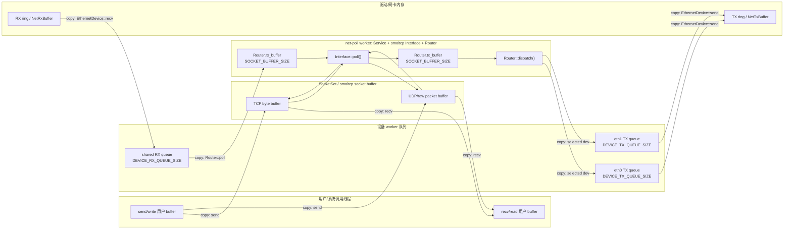
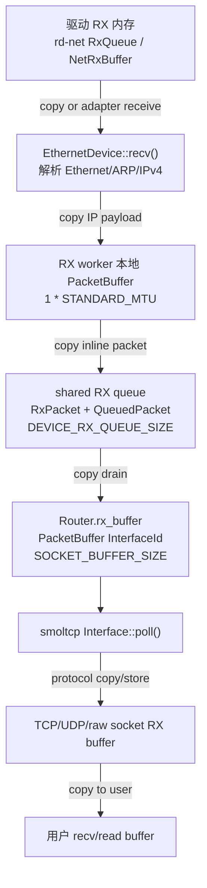
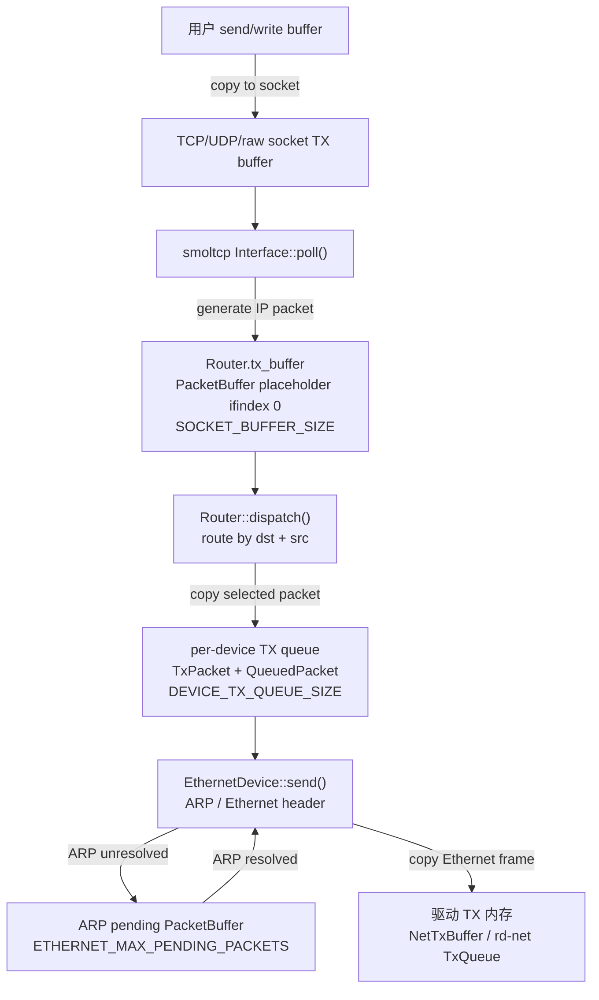
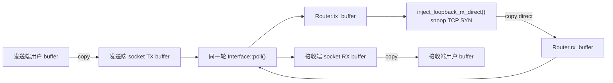

# 内存与队列

`ax-net` 的数据面内存模型以有界队列和明确拷贝边界为核心。当前实现不承诺端到端 zero-copy；它优先保证嵌入式/unikernel 场景下的内存上限、锁边界和协议栈所有权清晰。RX 方向从驱动 buffer 进入 Router 队列，再进入 smoltcp socket buffer，最终复制到用户 buffer；TX 方向从用户 buffer 写入 smoltcp socket buffer，再进入 Router TX buffer、设备 TX queue，最后交给驱动发送。

核心源码：

| 源码 | 职责 |
| --- | --- |
| [consts.rs](net/ax-net/src/consts.rs) | socket buffer、Router packet buffer、设备 RX/TX queue 容量 |
| [router.rs](net/ax-net/src/router.rs) | `BoundedPacketQueue`、`QueuedPacket`、`Router.rx_buffer` / `tx_buffer`、RX/TX worker |
| [service.rs](net/ax-net/src/service.rs) | `Service::poll()` 中的 RX drain、smoltcp poll、TX dispatch 顺序 |
| [device/driver.rs](net/ax-net/src/device/driver.rs) | `rd-net` buffer 适配、`VecRxBuffer` / `VecTxBuffer`、RX prefetch |
| [device/ethernet.rs](net/ax-net/src/device/ethernet.rs) | Ethernet 解封装、ARP pending packet、driver TX buffer 写入 |
| [tcp.rs](net/ax-net/src/tcp.rs)、[udp.rs](net/ax-net/src/udp.rs)、[raw.rs](net/ax-net/src/raw.rs) | 用户 buffer 与 smoltcp socket buffer 之间的收发拷贝 |

## 总体模型

数据面分成四个内存域：

| 内存域 | 典型对象 | 所有者 | 生命周期 |
| --- | --- | --- | --- |
| Driver buffer | `NetRxBuffer` / `NetTxBuffer`、`rd_net::RxQueue` / `TxQueue` | 具体网卡驱动或 `RdNetDriver` | 单个收发操作或驱动队列周期 |
| Router queue / packet buffer | `QueuedPacket`、`RxPacket`、`TxPacket`、`Router.rx_buffer`、`Router.tx_buffer` | `Router` / device worker | packet 在设备 worker 与 net-poll worker 之间流转期间 |
| smoltcp socket buffer | TCP `SocketBuffer`、UDP/raw `PacketBuffer` | 全局 `SocketSet` 中的具体 socket | socket 生命周期内固定分配 |
| 用户 buffer | syscall 传入的 `Read` / `Write` / `IoBufMut` | 调用者线程 | 单次 `send()` / `recv()` 调用 |

总体关系如下：



图中的 queue 都是有界队列。真实设备 RX 先由设备 worker 入队，再由 net-poll worker drain；真实设备 TX 先由 net-poll worker dispatch 到 per-device TX queue，再由设备 TX worker 送入驱动。用户线程只读写 socket buffer 并请求 poll，不直接推进设备队列。

关键原则：

- 设备 worker 不持有 `Service` 或 `SocketSet` 锁。
- net-poll worker 是唯一推进 smoltcp `Interface` 的线程。
- Router queue 使用 inline `[u8; STANDARD_MTU]`，避免每包堆分配。
- queue 满时丢包并 warning，不创建无界 backlog。
- loopback 普通 TX 直接注入 `Router.rx_buffer`，少一次队列 hop。

## 容量常量

默认容量集中在 [consts.rs](net/ax-net/src/consts.rs)：

```rust
pub const STANDARD_MTU: usize = 1500;

pub const TCP_RX_BUF_LEN: usize = 64 * 1024;
pub const TCP_TX_BUF_LEN: usize = 64 * 1024;
pub const UDP_RX_BUF_LEN: usize = 64 * 1024;
pub const UDP_TX_BUF_LEN: usize = 64 * 1024;
pub const RAW_RX_BUF_LEN: usize = 64 * 1024;
pub const RAW_TX_BUF_LEN: usize = 64 * 1024;

pub const SOCKET_BUFFER_SIZE: usize = 64;
pub const DEVICE_RX_QUEUE_SIZE: usize = 256;
pub const DEVICE_TX_QUEUE_SIZE: usize = 128;
pub const ETHERNET_MAX_PENDING_PACKETS: usize = 128;
```

| 常量 | 作用范围 | 默认内存预算 |
| --- | --- | --- |
| `SOCKET_BUFFER_SIZE` | `Router.rx_buffer` 和 `Router.tx_buffer` 的 packet metadata 槽位；每个 data buffer 是 `STANDARD_MTU * SOCKET_BUFFER_SIZE` | RX 约 96 KiB，TX 约 96 KiB |
| `DEVICE_RX_QUEUE_SIZE` | 所有真实设备共享的 device-to-Router RX queue | 256 × 1500B，约 384 KiB |
| `DEVICE_TX_QUEUE_SIZE` | 每个真实设备独立的 TX queue | 每设备 128 × 1500B，约 192 KiB |
| `TCP_RX_BUF_LEN` / `TCP_TX_BUF_LEN` | 每个 TCP socket 的 smoltcp byte buffer | 每连接约 128 KiB |
| `UDP_RX_BUF_LEN` / `UDP_TX_BUF_LEN` | 每个 UDP socket 的 smoltcp packet data buffer | 每 socket 约 128 KiB，外加 metadata |
| `RAW_RX_BUF_LEN` / `RAW_TX_BUF_LEN` | 每个 raw socket 的 smoltcp packet data buffer | 每 socket 约 128 KiB，外加 metadata |
| `ETHERNET_MAX_PENDING_PACKETS` | ARP 解析期间暂存的待发送 IP packet | 每 Ethernet device 约 192 KiB |

`DEVICE_RX_QUEUE_SIZE` 有意大于 `SOCKET_BUFFER_SIZE`。前者吸收设备 RX worker 与 net-poll worker 调度之间的短 burst；后者是 smoltcp-facing 的单轮 packet buffer。APK index 下载、TCP slow start 或 QEMU user networking burst 都可能在短时间内产生超过 64 个 MTU packet 的入站积压，因此 RX worker 共享队列需要更大的缓冲。

## RX 内存路径

RX 从真实设备到用户态 `recv()` 大致经过下面的内存边界：



```text
NIC / virtqueue / rd-net RX memory
  -> NetRxBuffer / VecRxBuffer
  -> EthernetDevice::recv()
  -> device_rx_worker local PacketBuffer<InterfaceId>
  -> BoundedPacketQueue<RxPacket> (QueuedPacket inline copy)
  -> Router.rx_buffer (PacketBuffer<InterfaceId>)
  -> smoltcp Interface::poll()
  -> TCP/UDP/raw socket RX buffer in SocketSet
  -> socket recv()
  -> user Write / IoBufMut
```

### Driver 到 EthernetDevice

`RdNetDriver` 把 `rd-net` 的 RX queue 适配成 `EthernetDriver::receive()`。当前适配层是 copy-based：

```text
rd_net::RxQueue::receive()
  -> VecRxBuffer { data: Vec<u8> }
  -> EthernetDevice::recv()
```

`RX_PREFETCH_TARGET = 1`，只允许一个小的预取窗口，避免在 driver adapter 中形成新的大缓存层。`EthernetDevice::recv()` 解析 Ethernet frame：

- ARP frame：更新 neighbor / pending packet 状态，不进入 smoltcp socket。
- IPv4 frame：校验链路层目标后，把 IP payload 写入调用方提供的 `PacketBuffer<InterfaceId>`。
- 其它 frame：忽略或返回没有可交付 packet。

### RX Worker 到共享 RX Queue

`device_rx_worker` 用一个本地 `PacketBuffer` 暂存从 `Device::recv()` 得到的 IP packet：

```rust
let mut rx_buffer = PacketBuffer::new(
    vec![PacketMetadata::EMPTY; 1],
    vec![0u8; STANDARD_MTU],
);
```

随后把 packet 复制进共享 RX queue：

```text
local PacketBuffer slice
  -> QueuedPacket { bytes: [u8; STANDARD_MTU], len }
  -> RxPacket { interface_id, bytes }
  -> RouterQueues::rx.push()
```

共享 RX queue 是 `Arc<BoundedPacketQueue<RxPacket>>`，所有非 loopback 设备共用一个队列。它保存 ingress `InterfaceId`，让 DHCP client/server、TCP SYN snoop 和诊断路径知道 packet 来自哪个接口。队列满时：

- 当前 packet 被丢弃。
- 打印 `"{ifname}: RX queue is full, dropping packet"`。
- 调用 `request_poll()` 并 `yield_now()`，给 net-poll worker 机会 drain backlog。

### Router.rx_buffer 到 smoltcp socket

`Service::poll()` 首先调用 `Router::poll()`，把共享 RX queue drain 到 smoltcp-facing `Router.rx_buffer`：

```rust
while !self.rx_buffer.is_full() {
    let Some(packet) = self.queues.rx.pop() else {
        break;
    };
    let bytes = packet.bytes.as_slice();
    snoop_tcp_packet(bytes, sockets);
    snoop(packet.interface_id, bytes);
    let Ok(dst) = self.rx_buffer.enqueue(bytes.len(), packet.interface_id) else {
        break;
    };
    dst.copy_from_slice(bytes);
}
```

这一步又发生一次 copy：`QueuedPacket` 的 inline bytes 复制到 `Router.rx_buffer`。随后 smoltcp `Interface::poll()` 通过 `Router::receive()` 获取 `RxToken` 并解析 IP/TCP/UDP/raw，最后写入具体 socket 的 RX buffer：

- TCP：写入 TCP socket 的 byte stream RX buffer。
- UDP：写入 UDP packet buffer 和 metadata。
- raw：写入 raw packet buffer；connected peer 不匹配时，`raw.rs` 可把 packet 暂存到 `deferred_rx`。

### Socket RX Buffer 到用户 Buffer

用户执行 `recv()` 时，不直接接触 Router queue。IP socket 从 smoltcp socket buffer 复制到 syscall 提供的用户 buffer：

```text
TCP recv:
  smoltcp TCP SocketBuffer
  -> socket.recv(|buf| dst.write(buf))
  -> user buffer

UDP recv:
  smoltcp UDP PacketBuffer
  -> socket.recv() / socket.peek()
  -> dst.write(payload)
  -> user buffer

raw recv:
  smoltcp raw PacketBuffer or deferred_rx / loopback_rx
  -> parse/filter
  -> dst.write(payload)
  -> user buffer
```

阻塞等待由 `GeneralOptions::recv_poller_with()` 处理：如果 socket RX buffer 为空，当前调用注册 waker 并等待；等待期间协议推进仍由 `net-poll` worker 完成。

## TX 内存路径

TX 从用户态 `send()` 到真实驱动大致经过下面的内存边界：



```text
user Read / IoBuf
  -> smoltcp TCP/UDP/raw socket TX buffer
  -> smoltcp Interface::poll()
  -> Router.tx_buffer
  -> Router::dispatch()
  -> per-device BoundedPacketQueue<TxPacket> (QueuedPacket inline copy)
  -> device_tx_worker
  -> EthernetDevice::send()
  -> NetTxBuffer / VecTxBuffer
  -> driver transmit / rd-net TX queue
```

### 用户 Buffer 到 smoltcp Socket

socket `send()` 只写协议 socket buffer，并请求 net-poll worker：

```text
send()
  -> socket.can_send()
  -> socket.send(|buffer| src.read(buffer))
  -> request_poll()
```

TCP 的用户 bytes 进入 TCP TX byte buffer。UDP/raw 发送会申请一个 packet-sized smoltcp buffer，然后把用户 payload 写进去；UDP `MSG_MORE` corking 会在 socket 层暂存第一次 send 的 endpoint/source，最终 flush 时一次性写入 smoltcp UDP packet buffer。

### smoltcp 到 Router.tx_buffer

net-poll worker 执行 `Interface::poll()` 时，smoltcp 根据 TCP/UDP/raw socket 状态生成完整 IP packet。`Router::transmit()` 返回 `TxToken`，`TxToken::consume()` 把 packet 写入 `Router.tx_buffer`：

```rust
fn consume<R, F>(self, len: usize, f: F) -> R
where
    F: FnOnce(&mut [u8]) -> R,
{
    f(self
        .0
        .enqueue(len, TX_INTERFACE_PLACEHOLDER)
        .expect("This was checked before creating the TxToken"))
}
```

这里的 metadata 使用内部占位 `InterfaceId(0)`，因为真实出接口必须等 IP header 生成后才能按 `(dst, src)` 查 route table。

### Router.dispatch 到 per-device TX Queue

`Router::dispatch()` 从 `Router.tx_buffer` 取完整 IP packet：

- loopback：直接复制到 `Router.rx_buffer`。
- IPv4 limited broadcast：复制到所有非 loopback device 的 TX queue。
- 普通单播：解析 `src/dst`，调用 `select_route_for_source(dst, src)`，把 packet 复制到选中设备的 `tx_queue`。

普通 Ethernet TX 入队形态：

```text
Router.tx_buffer packet slice
  -> QueuedPacket { bytes: [u8; STANDARD_MTU], len }
  -> TxPacket { next_hop, bytes }
  -> DeviceHandle.tx_queue
```

per-device TX queue 满时，当前 packet 丢弃并 warning。TX queue 是每个真实设备独立的，避免一个慢设备阻塞其它接口的发送 backlog。

### TX Worker 到 Driver

`device_tx_worker` 从 per-device queue 取 `TxPacket`，持有设备锁调用 `Device::send(next_hop, packet)`。对 Ethernet 设备而言：

```text
TxPacket IP payload
  -> EthernetDevice::send(next_hop)
  -> neighbor cache / ARP
  -> alloc_tx_buffer(frame_len)
  -> copy Ethernet header + IP payload
  -> driver.transmit(tx_buf)
```

如果 ARP 未解析，`EthernetDevice` 会把 IP packet 暂存在 `pending_packets`，发送 ARP request，等 ARP reply 后再 flush。`pending_packets` 也是有界 `PacketBuffer`，上限由 `ETHERNET_MAX_PENDING_PACKETS` 控制。

`RdNetDriver` 的 TX buffer 是 `VecTxBuffer`，分配大小至少为 Ethernet 最小帧长 `ETH_ZLEN = 60`。因此当前普通 Ethernet TX 至少包含两次 copy：用户 buffer 到 smoltcp socket buffer、Router/设备队列到 driver TX buffer；不同协议还可能有额外的协议封装 copy。

## Loopback 内存路径

loopback 普通 socket TX 是特殊快速路径：



```text
user send()
  -> smoltcp socket TX buffer
  -> Router.tx_buffer
  -> Router::dispatch()
  -> inject_loopback_rx_direct()
  -> Router.rx_buffer
  -> smoltcp Interface::poll()
  -> peer socket RX buffer
  -> user recv()
```

这个路径不进入 `DeviceHandle.tx_queue`，也不进入共享 `RouterQueues::rx`。它仍会把 IP packet 从 `Router.tx_buffer` 复制到 `Router.rx_buffer`，但避免了早期实现中的 `to_vec()` 分配和额外 RX queue hop。`inject_loopback_rx_direct()` 在写入 `rx_buffer` 前调用 `snoop_tcp_packet()`，因此 loopback TCP SYN 能在同一轮 poll 中预创建 accept child socket。

`send_on_device()` 的 loopback 分支仍可能使用共享 RX queue，这是控制面指定设备发送路径；普通 socket loopback TX 走 direct injection。

## 满队列与背压

当前普通 Ethernet 数据面不把 Router queue 满映射为用户态 `EAGAIN`：

| 满的位置 | 行为 | 用户可见性 |
| --- | --- | --- |
| smoltcp socket TX buffer 满 | `send()` 返回 `WouldBlock` 或阻塞等待 | 直接可见 |
| smoltcp socket RX buffer 满 | smoltcp 按协议窗口/丢包策略处理 | 间接可见 |
| shared RX queue 满 | 丢弃入站 packet，warning，request poll + yield | TCP 通过重传恢复，UDP/raw 可能丢包 |
| Router.rx_buffer 满 | 停止 drain，下一轮继续；直接注入失败时丢包 warning | TCP 通过重传恢复，UDP/raw 可能丢包 |
| per-device TX queue 满 | 丢弃出站 packet，warning | TCP 通过重传恢复，UDP/raw 可能丢包 |
| ARP pending queue 满 | 丢弃等待 ARP 的出站 packet，warning | 连接建立或首包可能超时/重传 |
| driver TX buffer 分配失败 | `Device::send()` 返回失败，packet 已离开 Router queue | 协议层后续重传或应用超时 |

这种策略与很多嵌入式协议栈一致：内部队列保持有界，不把所有链路层瞬时拥塞都反馈到已完成的 socket send 调用。TCP 正确性依赖重传和窗口控制；UDP/raw 本身允许丢包。

## 内存预算示例

以 2 个 Ethernet 设备、默认常量估算，不含驱动自身 ring/DMA 内存：

| 项目 | 估算 |
| --- | --- |
| `Router.rx_buffer` | `64 * 1500` ≈ 96 KiB |
| `Router.tx_buffer` | `64 * 1500` ≈ 96 KiB |
| shared RX queue | `256 * 1500` ≈ 384 KiB |
| per-device TX queue | `2 * 128 * 1500` ≈ 384 KiB |
| ARP pending packets | `2 * 128 * 1500` ≈ 384 KiB |
| 每条 TCP 连接 | RX 64 KiB + TX 64 KiB |
| 每个 UDP/raw socket | RX 64 KiB + TX 64 KiB + metadata |

实际内存还包括 metadata、`VecDeque` 元素开销、socket 对象、route/DNS/interface registry、Unix/vsock buffer 和驱动队列。调整常量时应按“共享一次”“每设备”“每 socket”“每连接”分别乘算。

## 不属于当前模型的能力

当前实现没有：

- 端到端 zero-copy。
- DMA buffer 直接挂入 smoltcp socket buffer。
- RSS / 多队列 NIC / per-queue poll。
- Linux `sk_buff` 类动态链式 backlog。
- `MSG_ZEROCOPY` 或 `io_uring` send/recv path。

如果后续要实现 zero-copy，需要同时改造 `rd-net` buffer ownership、`EthernetDevice` frame 封装、Router queue 生命周期和 smoltcp token/socket buffer 接口。单独把某个队列改成 `Arc<[u8]>` 只能减少局部 copy，不能形成完整 zero-copy 数据面。
