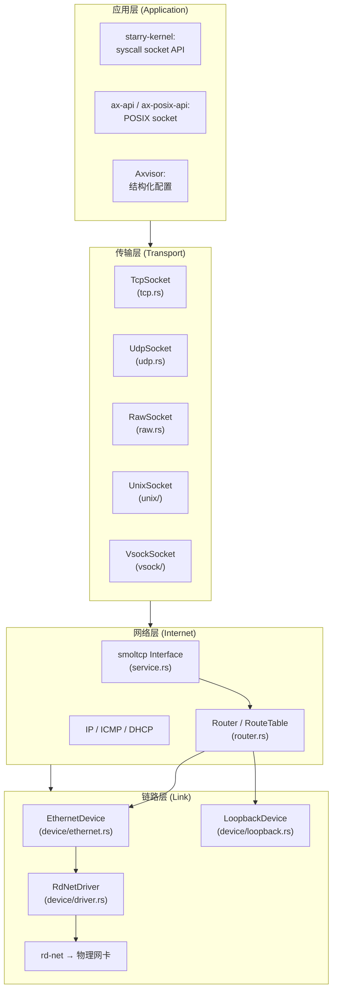

# 协议栈映射

`ax-net` 实现了标准 TCP/IP 四层模型的完整协议栈，以下说明各层在代码中的具体承担者、封装格式和处理路径。



## 各层职责与封装格式

| TCP/IP 层 | ax-net 组件 | 封装格式 | 职责 |
| --- | --- | --- | --- |
| **应用层** | `Socket` enum + `SocketOps` trait（[socket.rs](net/ax-net/src/socket.rs)） | 用户数据（字节流/数据报） | 暴露 TCP/UDP/raw/unix/vsock socket API，管理 socket options、超时、非阻塞、poll readiness |
| **传输层** | smoltcp `socket::tcp` / `socket::udp` / `socket::raw` | TCP segment / UDP datagram | 连接管理（三次握手/四次挥手）、可靠传输（重传/ACK/窗口）、端口复用、corking |
| **网络层** | smoltcp `Interface` + `Router`（[router.rs](net/ax-net/src/router.rs)） + `RouteTable` | IP packet（IPv4 header + payload） | IP 路由决策、分片/重组、ICMP 处理、ARP 缓存、DHCP 状态机、IP 地址管理 |
| **链路层** | `EthernetDevice`（[ethernet.rs](net/ax-net/src/device/ethernet.rs)） + `LoopbackDevice` + `RdNetDriver` | Ethernet frame（MAC header + ethertype + payload） | MAC 编址、ARP 封帧与解帧、IRQ 处理、邻居表（300s TTL）、pending packet 队列 |

## 数据封装沿各层的具体转换

以 **TCP 发送** 为例，数据从应用到物理网卡经过以下封装步骤：

```
应用层:    用户调用 send(data)  →  TcpSocket::send()
               │
               ▼  写入 smoltcp socket TX buffer (TCP_TX_BUF_LEN=64KiB)
传输层:    smoltcp TCP 状态机构造 TCP segment
               │  [src_port, dst_port, seq, ack, flags, window, payload]
               ▼  smoltcp 通过 Router::transmit() 输出
网络层:    smoltcp 添加 IPv4 header（或 IPv6）
               │  [version, ihl, tos, total_len, id, flags, ttl, proto=TCP,
               │   checksum, src_ip, dst_ip, options..., payload=TCP segment]
               │  IP packet 写入 Router.tx_buffer
               ▼  Router::dispatch() 查路由表选择出接口
链路层:    EthernetDevice::send() 查 ARP 表获取 dst_mac
               │  添加 Ethernet header
               │  [dst_mac(6B), src_mac(6B), ethertype=0x0800(IPv4), payload=IP packet]
               ▼  EthernetDriver::transmit()
物理层:    rd-net 驱动将帧写入硬件 TX ring → DMA 发送
```

以 **TCP 接收** 为例，数据从物理网卡到应用的解封装：

```
物理层:    硬件 DMA → RX ring → 中断/轮询
               ▼  EthernetDriver::receive()
链路层:    EthernetDevice::recv() 解析 EthernetFrame
               │  提取 dst_mac, src_mac, ethertype
               │  ethertype=0x0806(ARP) → 更新 neighbors 表
               │  ethertype=0x0800(IPv4) → 提取 IP payload
               ▼  写入 smoltcp PacketBuffer
网络层:    smoltcp Interface::poll() 从 Router::receive() 取 IP packet
               │  解析 IPv4 header → 提取 protocol=TCP, src_ip, dst_ip
               │  protocol=ICMP → raw socket
               ▼  交付给对应的 socket
传输层:    smoltcp TCP 状态机处理 TCP segment
               │  校验 seq/ack, 更新窗口, 提取 payload
               │  payload 写入 socket RX buffer (TCP_RX_BUF_LEN=64KiB)
               ▼  socket readiness 更新 → waker 唤醒 recv() 调用者
应用层:    用户调用 recv(data)  → TcpSocket::recv() → 从 smoltcp RX buffer 读取
```

## 协议穿越各层的路由决策点

| 操作 | 发生层 | 决策方式 |
| --- | --- | --- |
| **端口选择** (ephemeral port) | 传输层 | `bind(port=0)` → 从 49152 递增尝试 |
| **路由决策** (出接口选择) | 网络层 | smoltcp 构造 IP 包时注入 src_addr → `dispatch()` 用 `select_route_for_source(dst, src)` 查 `RouteTable` → 选接口 |
| **ARP 解析** (IP→MAC) | 网络层↔链路层 | `EthernetDevice::send()` 查 `neighbors: HashMap<IpAddress, Neighbor>` → 未命中则广播 ARP request |
| **DHCP** | 网络层↔链路层 | `DhcpState` 在 `Service::poll()` 中独立于 smoltcp 运行，直接操作 `Router::send_on_device()` |
| **DNS** | 应用层 | `dns_query()` 创建临时 smoltcp `dns::Socket`，通过 smoltcp UDP 发送 DNS 查询 |

## smoltcp 承担的协议与 ax-net 补充的部分

| 协议 | smoltcp 原生支持 | ax-net 补充 |
| --- | --- | --- |
| **IPv4** | 包头构造、分片、校验和 | 多接口地址管理、静态/DHCP 地址分配、`InterfaceId` 元数据 |
| **IPv6** | 基本包头、多播 | IPv6→IPv4 映射（v4-mapped）、`IPV6_V6ONLY` socket option |
| **TCP** | 状态机、重传、窗口、keep-alive | `ListenTable` 端口槽位表、SYN pre-create、`TcpInfo` 快照、`SO_BINDTODEVICE` |
| **UDP** | 数据报、端口 | 端口冲突仲裁（`SocketSetWrapper::udp_binds`）、MSG_MORE corking |
| **ICMP** | 基础 | Loopback ICMP echo reply 模拟 |
| **ARP** | 无 | `EthernetDevice::neighbors` 表、TTL 300s、ARP-pending 队列 drain |
| **DHCP** | 无 | 完整 Discover→Offer→Request→ACK 状态机、per-interface `DhcpState`、指数退避 |
| **DNS** | `dns::Socket`、A 查询 | server 路由过滤、超时管理、`DnsSocketGuard` |
| **路由** | 无 | `RouteTable` 最长前缀匹配、metric 排序、`select_route_if` 接口可用性过滤 |

## 非 TCP/IP 协议路径

| 协议 | 承载方式 | 数据路径 |
| --- | --- | --- |
| **Unix domain stream** | `ringbuf::HeapRb<u8>` 双向 buffer | 不经过 smoltcp，直接内存拷贝，含 cmsg 管道 |
| **Unix domain datagram** | `async_channel::unbounded()` | 不经过 smoltcp，无界队列 + Packet 结构体（含 data + cmsg + sender addr） |
| **Vsock stream** | `Connection` 的 ring buffer | 经过 `rdif-vsock` 驱动，不经过 smoltcp IP 层 |
