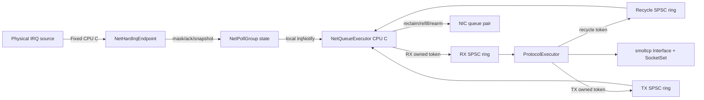
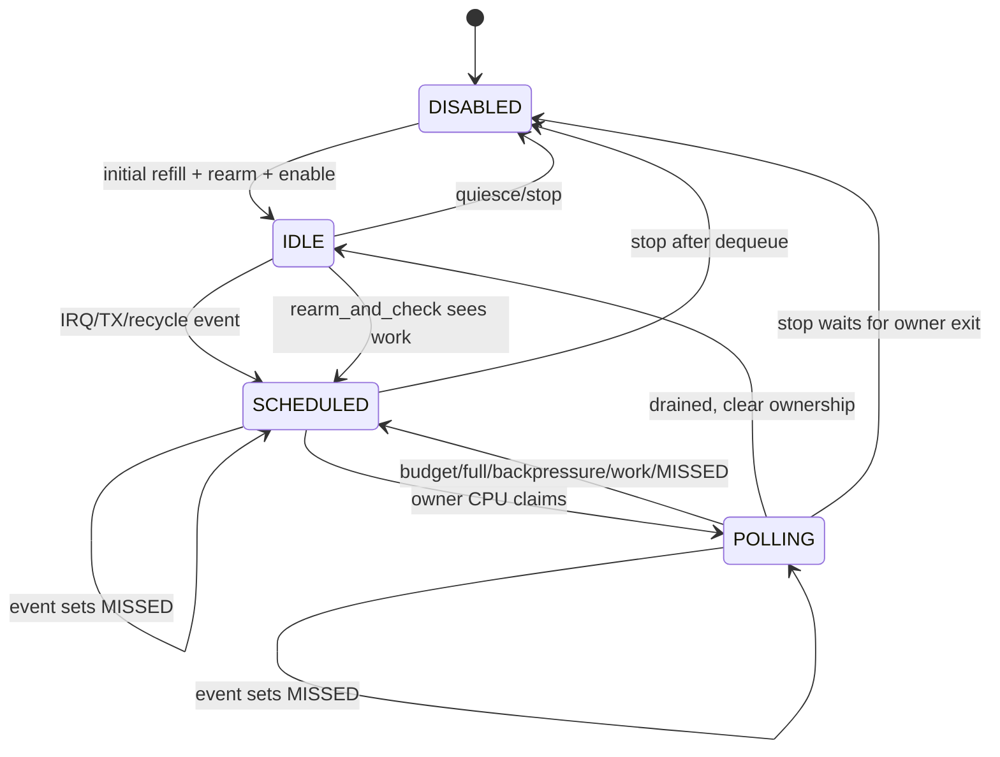
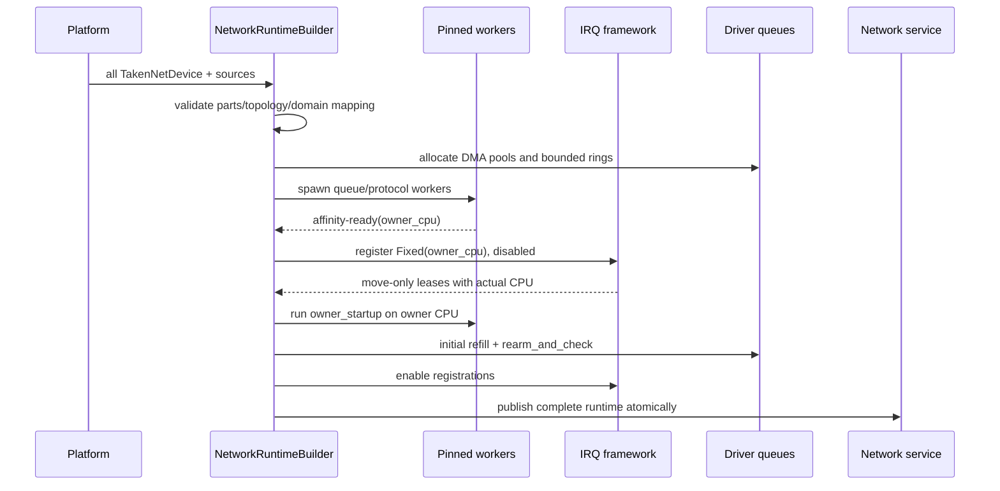

# 队列级 NAPI 运行时设计

## 1. 状态与结论

本文既是网络运行时破坏性重构的设计基线，也是当前实现契约。实现必须同时满足这里定义的所有权、CPU 亲和性、IRQ、DMA、停止和回滚不变量；不满足能力要求的物理网卡不能被发布为可用设备。

设计结论如下：

- 每个共享 IRQ mask/rearm 域对应一个 `NetPollGroup`。
- 每个物理 IRQ source 与其覆盖的 poll group 形成 `NetAffinityDomain`，一个 domain 只有一个 `owner_cpu`。
- hard IRQ callback、mask/ack、queue poll、DMA reclaim/refill 和 rearm 必须在同一 `owner_cpu` 上连续推进。
- smoltcp 的 `Interface`、`SocketSet`、路由、DHCP 与 socket side table 仍由唯一 `ProtocolExecutor` 串行拥有。
- queue executor 与 protocol executor 之间只转移 frame/buffer 的唯一所有权，不把 IRQ continuation 转移到另一 CPU。
- 物理网卡只支持完整 IRQ 模式。缺少 IRQ、固定 affinity、mask/rearm 或 worker pin 能力时初始化失败。
- 本次不保留旧 polling、OOB wake、动态 queue 创建、设备级 IRQ 控制或同步 protocol poll 的兼容入口。

这项改动属于高风险架构变更：它同时改变公开驱动接口、IRQ 生命周期、DMA 所有权、SMP 调度和 StarryOS socket 唤醒路径。实现和验证应按本文的阶段边界独立审查。

## 2. 问题、用户与成功标准

### 2.1 具体问题

当前网络路径在 hard IRQ 后丢失了 source 和 queue 身份，只向一个全局通知发布事件。共享 net-poll task 随后唤醒全部设备，设备各自的 RX/TX task 再搬运数据，最终竞争单一 smoltcp poll owner。该结构产生四类问题：

1. 单个设备 IRQ 会唤醒所有设备，SMP 下形成无关 worker 扇出。
2. 永久 net-poll worker 与同步 flush 调用者都可能取得 protocol poll ownership，运行时不具备单一任务所有权。
3. virtio task-side transport gate 竞争时不能在 hard IRQ 中等待；当前延迟 ACK 依赖设备周期 poll 才能保证后续探测。
4. 迁移前的 AIC8800/SDIO 通过带外回调、独立 RX/TX task 和 10ms kicker 推进，绕过网卡 IRQ 注册与 CPU affinity 契约。

PR #1775 曾实际暴露生产初始化与 split-route helper 各启动一个永久协议 worker，二者竞争同一 IRQ waiter，最终触发 `net IRQ waiter was registered concurrently`。当前 dev 虽以一个原子 owner 串行化实际 poll，但调用者仍可成为第二种 owner，并且全局 IRQ fanout、设备 fallback 与 AIC OOB 路径仍存在。

### 2.2 直接用户

- `rdif-eth` 和 `rd-net` 的可移植网卡驱动与适配层。
- ArceOS/StarryOS/Axvisor 的网络运行时。
- virtio-net、E1000、RTL8125、FXMAC、Loongson GMAC 与 AIC8800/SDIO 后端。
- 依赖 Linux socket readiness、errno、信号中断与 restart 语义的 StarryOS 用户态程序。

### 2.3 成功标准

- `last_irq_cpu == last_poll_cpu == owner_cpu` 对每个 group 恒成立。
- 相同物理 `IrqId` 覆盖的所有 endpoint 只能注册到同一 CPU。
- 网络注册路径中不存在 `IrqAffinity::Any`，IRQ 到 queue poll 的 remote wake/IPI 计数恒为零。
- 一个 group 的 IRQ 只激活该 group；空闲 group worker 不被周期唤醒。
- burst 在 IRQ 关闭期间按预算合并处理，drain 与 `rearm_and_check()` 完成后才重开 IRQ。
- 任一步初始化失败都不会发布部分网络 service，也不会留下已使能 IRQ、运行 worker 或失去所有权的 DMA buffer。
- 只有 protocol executor 能调用 smoltcp poll；同步 flush 只等待 generation completion。
- 现有有线和 AIC8800 后端一次性迁移，旧入口在源码、测试与文档中全部删除。

## 3. 精确研究基线

本设计于 2026-08-24 对以下版本进行了源码核验：

| 来源 | 精确版本 | 采用的事实 |
| --- | --- | --- |
| TGOSKits dev | `f96452ce892e2916a0c5bfe5aa9e7908b8085c06` | 当前 per-device worker、global wake-all、poll fallback、driver queue/IRQ contract |
| PR #1775 | `1572814000fc9b27d740cb5ce56dde68c42a14d0` | 单 protocol owner、`requested/completed` generation、重复 runtime 初始化回归；不直接移植其 ax-task 大重构 |
| Linux | v7.1，`8cd9520d35a6c38db6567e97dd93b1f11f185dc6` | `NAPI_STATE_SCHED/MISSED/DISABLE`、budget repoll、complete/rearm 窗口、per-NAPI threaded owner |
| TGOSKits block runtime | 同 dev 版本 | hctx 固定 CPU worker、`NonReentrant + AutoEnable::No + Fixed(cpu)`、disabled-before-publish 和同步 teardown |

Linux v7.1 的关键语义不是 API 形状，而是以下所有权规则：

- 原子设置 `SCHED` 的实体取得 poll-list ownership；已在运行时再次 schedule 只设置 `MISSED`。
- poll 消耗满 budget 时保留 ownership 并 repoll，不完成/重开 IRQ。
- complete 清除 `SCHED/MISSED` 时如果观察到 `MISSED`，立即重新 schedule，避免 completion 窗口丢事件。
- disable 阻止新 schedule，并等待已有 poll ownership 退出。

TGOSKits 不复制 Linux softirq、GRO、RPS 或 busy-poll；这里只复用 queue-local ownership、budget、missed-event 与 complete/rearm 不变量。

## 4. 被否决方案

### 4.1 保留全局 IRQ 通知并在 worker 中扫描设备

否决原因：source 身份已经丢失，无法证明只唤醒目标 group，也无法让 IRQ callback CPU 与 queue poll CPU 保持一致。增加 bitmap 过滤只能减少扫描，不能建立注册 affinity 与 queue ownership 的同一原子事务。

### 4.2 每个 NIC 保留 RX/TX task，再增加固定 CPU NAPI task

否决原因：同一 queue 会出现多个 task-context owner，DMA reclaim/refill、IRQ rearm 和 TX submission 的顺序仍需共享锁协调。额外任务也会保留 PR #1775 已观察到的 wake/park 放大。

### 4.3 hard IRQ 竞争时自旋等待 transport gate

否决原因：IRQ 可能抢占持有 gate 的同 CPU task；等待被抢占者释放 gate 没有前进保证。IRQ 只能发布 `ProbeDeferred`，由同 CPU queue executor 完成 transport probe。

### 4.4 fixed affinity 失败后使用 `Any`、IPI 或周期 poll

否决原因：三者都会破坏 `IRQ source -> poll group -> owner_cpu` 不变量，并掩盖平台路由、worker pin 或 shared IRQ action 的不兼容。初始化必须原子失败。

### 4.5 多个 smoltcp `Interface` 共享或拆分 `SocketSet`

否决原因：smoltcp poll 要求同时独占 `&mut Interface`、`&mut Device` 和 `&mut SocketSet`。拆分会破坏全局 socket handle、wildcard bind/listen、reuseport、raw socket、orphan、route 与 DHCP 语义；共享锁则仍完全串行。协议分片是另一个高风险项目。

### 4.6 为 AIC8800 保留 kicker 作为暂时保险

否决原因：kicker 会把丢 IRQ、错误 clear/retrigger 或变体差异伪装为可用网络，无法证明空闲 worker 零唤醒。证据不足的变体必须拒绝发布，而不是静默轮询。

## 5. 总体结构



唯一允许跨 CPU 的路径是预分配 ring 上的 frame/token 所有权转移与 protocol request generation。hard IRQ 到 queue executor 的 continuation 不跨 CPU。

### 5.1 核心对象

- `NetworkRuntimeBuilder`：消费全部设备和唯一 `PinnedNetIrqRegistrar`，完成 topology、分配、pin、注册、enable 和 service publication。
- `NetAffinityDomain`：一组因共享物理 IRQ source 而必须同 CPU 的 poll group，持有不可变 `owner_cpu`。
- `NetQueueExecutor`：固定到一个 CPU，轮询该 CPU 上的所有 group，每轮总预算 256。
- `NetPollGroup`：一个 IRQ mask/rearm 域以及对应 RX/TX queue、endpoint、SPSC rings、状态和统计。
- `ProtocolPollRuntime`：唯一 protocol task 的 generation 请求/完成状态，不保存第二种同步 poll 入口。
- `ProtocolExecutor`：独占 `Service`、smoltcp `Interface`、`SocketSet`、route/DHCP/listener/orphan 状态。

## 6. Affinity domain 构造

### 6.1 输入

每个 `NetPollGroupParts` 声明一个或多个 `NetIrqSourceId`。平台把 source 解析为：

- `BindingIrq(IrqId)`：runtime 可直接注册的物理 IRQ。
- `NestedIrqSource`：由 controller/provider 拥有，接受选定的 `owner_cpu` 后返回固定 affinity 的 move-only registration lease。

source ID 是 topology identity，不等同于 queue ID。多个 endpoint 引用相同 source ID 时表示共享物理 affinity/rearm 约束。

### 6.2 算法

1. 为每个 poll group 建立一个并查集节点。
2. 对引用相同 `NetIrqSourceId` 的 group 做 union。
3. 每个连通分量构造一个 `NetAffinityDomain`。
4. 按 `(minimum source id, minimum group id)` 排序 domain，保证启动顺序稳定。
5. 按当前在线 CPU 集合进行最小负载分配；负载先按 group 数，再按稳定 CPU ID 打破平局。
6. protocol executor 选择 domain 负载最小的 CPU；没有物理网卡时使用 bootstrap CPU 并只发布 loopback。

同一个 source ID 如果解析出不同物理 `IrqId`，或同一个物理 `IrqId` 被不同 source identity 隐式共享，builder 必须拒绝初始化。平台必须在注册前提供完整映射，不能在 callback 内动态发现。

### 6.3 固定 CPU 不变量

```text
endpoint.registered_cpu
    == domain.owner_cpu
    == group.owner_cpu
    == current_cpu(hard_irq_callback)
    == current_cpu(group.poll)
    == current_cpu(mask/ack/rearm)
```

独立 MSI-X/per-queue vector 可形成不同 domain。INTx、共享 FDT IRQ 和 AIC SDIO controller IRQ 只能形成一个 domain。

## 7. Poll group 状态机

实现使用一个 `AtomicU8` 编码基础状态和 `MISSED` 位：

```text
base state: IDLE | SCHEDULED | POLLING | DISABLED
flag:       MISSED
```

文档中的 `POLLING|MISSED` 等组合对应同一个原子字。不存在需要独立锁协调的第二份运行状态。



### 7.1 事件发布

- `IDLE -> SCHEDULED`：CAS 使用 `AcqRel`。成功者把 group ID 发布到本 CPU executor 的 pending set，然后 `IrqNotify::notify_irq()`。
- 已是 `SCHEDULED/POLLING`：CAS/`fetch_or(MISSED, Release)`，不重复入队。
- `DISABLED`：拒绝调度并增加 stop-rejected 统计；不能把事件留给未来 enable。

pending set 必须预分配且按 group ID 定位。相同 group 同时只允许一个逻辑 pending entry；通知只是 doorbell，不承载事件计数。

### 7.2 取得 poll ownership

owner CPU 从 pending set 取 group 后，以 CAS 把 `SCHEDULED` 变为 `POLLING`，同时清本轮已消费的 `MISSED`。Acquire 观察 hard IRQ 在 mask/ack 后发布的 snapshot。非 owner CPU 调用 poll 是不可恢复的 contract violation；测试构建返回 typed error，kernel 构建记录 fatal initialization/runtime invariant failure并禁用 domain。

### 7.3 预算

每个 group 的一次 poll cycle 依次执行：

1. recycle/refill，最多 64 个 token；
2. RX completion，最多 64 项；
3. TX completion/reclaim，最多 64 项；
4. TX submission，最多 64 项。

每个 CPU executor 一轮最多处理 256 项。group 任一子预算耗尽即保持 IRQ 关闭并重新排队；executor 总预算耗尽时 yield 给调度器，然后立即继续，不等待 IRQ 或 timer。

### 7.4 complete 与 rearm 窗口

poll 结束时按以下顺序判断：

1. 如果预算耗尽、ring backpressure、driver 报告仍有硬件工作、`ProbeDeferred` 未完成或观察到 `MISSED`，把状态恢复为 `SCHEDULED` 并重新排队，IRQ 保持关闭。
2. 否则 CAS `POLLING -> IDLE`，使用 Release 发布所有 queue/DMA 更新。
3. 在 owner CPU 调用原子的 `rearm_and_check()`：驱动完成必要 sync、清源、打开 queue IRQ，并立即读取 pending/used ring。
4. 若返回 `WorkPending`，CAS `IDLE -> SCHEDULED` 并重新排队；若 IRQ 同时先发布了 `SCHEDULED`，不重复入队。

驱动不能把 `enable_irq()` 与 pending check 暴露为两个可被 runtime 任意组合的入口；`rearm_and_check()` 是一个语义原子操作，即使硬件需要多条指令完成。

## 8. Hard IRQ contract

`NetHardIrqEndpoint::handle_irq()` 只能返回：

```rust
pub enum NetHardIrqResult {
    Spurious,
    Schedule(NetIrqSnapshot),
    ProbeDeferred,
}
```

允许的工作：

- 读取 bounded 状态寄存器或 transport interrupt status。
- mask queue/controller source。
- ACK 能在 hard IRQ 安全确认的状态。
- 发布固定大小 snapshot、`MISSED` 与本地 doorbell。

禁止的工作：

- 分配、释放、复制 packet payload。
- 访问 RX/TX descriptor payload 或执行 DMA sync。
- 阻塞、自旋等待 task-side gate、获取 sleeping lock。
- 调用 smoltcp、socket waker、任意用户回调或全局设备扫描。

注册固定为：

```text
execution  = NonReentrant
auto_enable = No
affinity   = Fixed(owner_cpu)
share_mode = Shared only when all actions have identical fixed affinity
```

callback 首行在测试构建记录 `current_cpu`。如果与 registration lease 或 group 的 CPU 不同，callback 只 mask source 并将 domain 标为 failed，不能 remote-wake 正确 CPU 继续运行。

## 9. Driver queue 与 DMA 所有权

### 9.1 Move-only token

`DmaBuffer` 不实现 `Clone` 或 `Copy`。它表示 runtime 对一段映射和 DMA ownership 的唯一权利，而不是可复制描述符。

```text
free pool
  -> RX posted to device
  -> RX completed by group
  -> RX ring to protocol owner
  -> recycle ring to group
  -> RX posted to device

free/TX pool
  -> protocol writes frame
  -> TX ring to group
  -> submitted to device
  -> TX completion reclaim
  -> free/TX pool
```

任何 submit 失败必须把原 token 放回 typed error：

```rust
pub struct SubmitError {
    pub buffer: DmaBuffer,
    pub reason: SubmitErrorKind,
}
```

`reclaim` 返回原 token，而不是只返回 `bus_addr`。runtime 不通过地址 side table 猜测所有权。

`NetError::Retry` 与 `NetError::LinkDown` 表示只有未来硬件或 task 事件才能改变
提交条件。runtime 保留 typed error 归还的 token；本轮没有 RX reclaim 等可观察进展时，
group 完成本轮 poll 并执行 `rearm_and_check()`，等待未来事件，而不是在 IRQ 保持关闭时
立即自调度形成 busy loop。只有同一轮 reclaim 已释放 descriptor 时，RX refill 才可以立即
重试。

### 9.2 DMA sync

跨 CPU ring 只转移 CPU ownership，不替代非一致 DMA 同步：

- RX device completion 后，group owner 先 `sync_for_cpu`，再 Release 发布到 RX ring。
- protocol owner Acquire 取得 token 后才读 payload。
- recycle 返回 group 后，group owner 完成必要清理与 `sync_for_device`，再提交 RX descriptor。
- protocol owner 写完 TX payload后 Release 发布；group owner Acquire 后 `sync_for_device`，再写 TX descriptor/doorbell。
- TX completion ACK 后才能回收 token；设备仍拥有时禁止 CPU 访问或重复提交。

每个 driver parts 必须声明 queue/token 是否 `Send`。无法证明跨 CPU 唯一所有权和 DMA mapping 生命周期的 driver 不能实现新 trait。

### 9.3 有界 SPSC ring

每个 group 与 protocol owner 之间预分配：

- `rx_ready`: group producer，protocol consumer。
- `rx_recycle`: protocol producer，group consumer。
- `tx_submit`: protocol producer，group consumer。
- 可选 `tx_complete`: group producer，protocol consumer；如果完成只归还通用 pool，可由 group 直接回收。

ring 满不分配、不覆盖、不丢失 token：

- RX ring 满：group 进入 backpressure，IRQ 保持关闭，保留尚未移交的 completion ownership。
- protocol 消费 RX 后向 recycle ring 发布 token，并精准调度该 group。
- TX ring 满：socket/Router 观察 backpressure，保留 protocol-owned frame 并等待该 group 的空间 generation；不能同步调用 queue 或 protocol poll。

## 10. 破坏性驱动接口

### 10.1 顶层设备

旧 `Interface` 被删除，由消费式边界替代：

```rust
pub trait NetDevice: Send {
    fn into_parts(self: Box<Self>) -> Result<NetDeviceParts, NetError>;
}

pub struct NetDeviceParts {
    pub info: NetDeviceInfo,
    pub control: Box<dyn NetControlEndpoint>,
    pub wifi_control: Option<Box<dyn WifiControlEndpoint>>,
    pub poll_groups: Vec<NetPollGroupParts>,
}
```

`into_parts` 只能调用一次。成功后不再存在能同时访问全部 queues、IRQ 和 control 的完整设备对象。

### 10.2 Poll group parts

```rust
pub struct NetPollGroupParts {
    pub id: NetPollGroupId,
    pub queues: NetQueuePairParts,
    pub irq_control: Box<dyn NetPollIrqControl>,
    pub owner_startup: Option<Box<dyn NetOwnerStartup>>,
    pub irq_endpoints: Vec<NetHardIrqEndpoint>,
}
```

- queue ID 与 group ID 使用 typed newtype。
- 当前生产后端全部提供一个 queue-0 group；接口允许多个 group，但本次不启用 virtio/fxmac 硬件多队列。
- 只有拥有独立 IRQ source 和独立 `rearm_and_check()` 域的硬件队列才能拆成多个 group。
- `NetOwnerStartup` 是 move-only one-shot endpoint，只能由已固定 CPU 的 group worker 在 IRQ 注册但尚未 enable 时执行。AIC 固件和 FDRV 初始化经此边界延后，probe 不再执行 SDIO 数据面 I/O。
- `NetPollIrqControl` 暴露 `quiesce()`、`shutdown()` 和 `rearm_and_check()`；`shutdown()` 只有在硬件已不能访问 descriptor/token backing 时才能成功，否则 runtime 必须隔离整个 group。
- hard endpoint 是 move-only owned callback，不保存 queue 或 control 的反向引用。

### 10.3 平台获取与 IRQ registrar

平台一次性返回：

```rust
pub struct TakenNetDevice {
    pub prepared_device: Box<dyn NetDevice>,
    pub irq_sources: Vec<PreparedNetIrqSource>,
}
```

`NetworkRuntimeBuilder` 显式消费所有 `TakenNetDevice` 和一个 `PinnedNetIrqRegistrar`。registrar API 必须携带 `owner_cpu`，并在 lease 中记录实际 CPU；它没有 `Any` variant。

nested source 的 controller registration、child callback 和 source mask/rearm lease 必须由同一个 move-only 对象管理。AIC SDIO controller IRQ 不能在 driver probe 中提前注册到任意 CPU。

## 11. Protocol executor

### 11.1 单一 owner

`ProtocolPollRuntime` 使用两个 wrapping `AtomicU64` generation：

- `requested`：socket、RX batch、TX completion、timer deadline 或 flush 请求发布新 generation。
- `completed`：唯一 protocol executor 完成该 generation 可见的全部 poll 工作后发布。

另有一个 `scheduled` bit 保证只有永久 protocol task 能取得 owner。外部调用者没有 `poll_until_idle()` 或 required ownership API。

### 11.2 请求与完成

```text
publisher:
  generation = requested.fetch_add(1, Release) + 1
  notify protocol executor

protocol executor:
  acquire scheduled ownership
  target = requested.load(Acquire)
  drain RX rings / smoltcp poll / enqueue TX
  completed.store(target, Release)
  clear scheduled with AcqRel
  recheck requested and external ring readiness
  if pending: reacquire/schedule before sleeping
```

同步 flush 记录自己的 generation，并等待 `completed` 到达该 generation。它不能调用 smoltcp poll、不能取得 queue lock，也不能成为临时 protocol owner。

### 11.3 Timer

协议 timer 只用于 smoltcp 的真实 `poll_at` deadline，不用于设备探测或丢 IRQ兜底。timer 到期发布 protocol generation；它不会唤醒空闲 queue executor。

## 12. 初始化、发布与回滚

### 12.1 原子初始化



worker 的 `affinity-ready` 不能等价于“task 已创建”。worker 必须在其自身上下文验证 `current_cpu == owner_cpu` 并发布成功；失败时在任何 IRQ 注册前回滚。

### 12.2 反向回滚

任一步失败按下列顺序执行：

1. 设置 runtime stopping，拒绝新的 socket/TX/control 请求。
2. mask 所有已接触的 source，并把 group 置为 `DISABLED`。
3. disable and synchronize 每个 registration/nested lease，等待 callback 退出；同步失败时向所有相关 worker 下发 `QUARANTINE`，lease、callback、queue、control、DMA backing 整体隔离，不能继续执行 driver shutdown 或 free/drop。
4. 只有 callback 同步成功时才下发 `STOP`；worker 在 owner CPU 执行 `quiesce()` 与 `shutdown()`，退出 `POLLING` 后 join。startup 失败的 worker 发布结果后必须等待 builder 的 `STOP/QUARANTINE` 决策，不能抢先自行释放。
5. 只有所有 group 的 `shutdown()` 都证明 DMA 已停止时才回收 runtime-owned token；任一 group 无法证明时，完整 executor ownership graph 进入隔离，不能只释放其中的 pool、ring 或 control。
6. 释放已经证明与硬件断开的 queue、control、source 和 platform device resources。
7. 丢弃未发布的 service；已发布 runtime 的停止需要独立 shutdown transaction。

回滚过程中不能调用普通 socket waker，也不能把失败设备降级成 polling device。

## 13. Wi-Fi quiesce transaction

所有访问 AIC SDIO/MMIO 的控制操作必须在所属 domain 的 owner CPU 上执行：

1. 控制调用向 bounded command queue 提交 request 并等待 completion。
2. owner CPU 把 domain 置为 quiescing，mask controller/card IRQ。
3. 等待各 group 离开 `POLLING`，停止接收新的 TX submit。
4. 在 owner CPU 执行 STA/AP/firmware command；RX confirmation 仍由同一 executor 的 command/RX step 推进，不能同步等待一个已被暂停的 RX task。
5. 重建 queue/FIFO 状态，完成 refill、clear 与 `rearm_and_check()`。
6. 恢复 group，完成 control request。

AP/STA confirmation 已由同一 owner executor 中的 command/RX 有限状态机推进；控制请求使用 `start/advance/cancel`，不能重新引入阻塞 `send_cmd` 或独立 RX task。

## 14. 驱动迁移约束

### 14.1 virtio-net

- 只有 `QUEUE_INTERRUPT` 才返回 `Schedule`；configuration-only 或空 status 为 `Spurious`。
- IRQ 无法进入 transport gate 时设置 deferred probe 位并返回 `ProbeDeferred`，不得自旋。
- task poll 期间关闭 virtqueue callback；`rearm_and_check()` 开启 callback 后立即检查 used ring 和 deferred transport status。
- 锁定的 `virtio-drivers 0.13.0` 中，`poll_receive()`/`poll_transmit()` 只调用
  `VirtQueue::peek_used()`，不会推进 `last_used_idx` 或释放 descriptor；它们只用于
  rearm 窗口的非消费 pending 检查。只有 queue reclaim 调用
  `receive_complete()`/`transmit_complete()` 后，`pop_used()` 才消费 completion 并归还
  inflight token。
- transport ACK、queue used-ring 检查与 callback rearm 全在 group owner CPU。

### 14.2 E1000

- queue-0 RX/TX 共享一个 group 和设备 IRQ mask 域。
- hard IRQ 读取 ICR 完成 read-to-clear snapshot，并 mask 默认 interrupt source。
- owner poll drain 后恢复 mask 并复查 RX/TX descriptor head/tail。

### 14.3 RTL8125

- queue-0 group 共享 `QueueStartState`，不能把 TX/RX start/rearm ownership 拆开。
- hard IRQ 状态门控、写回 ACK 后 mask；deferred RX refill 由 owner poll 完成。
- `rearm_and_check()` 必须覆盖 overflow/deferred-refill 和 pending status 复查。
- link-down submit 返回 `NetError::LinkDown` 并归还 token；runtime 保留 token、完成本轮
  poll 并 rearm，等待 link-change IRQ，不能把 link-down 当成可立即重试的 queue-full。

### 14.4 FXMAC

- 本次仅 queue 0；底层最多四队列的痕迹不代表生产多队列已完成。
- IRQ `try_lock` 竞争转为 `ProbeDeferred`，已有 pending ACK 状态必须纳入 group poll，不能返回空事件后依赖 timer。

### 14.5 Loongson GMAC

- queue-0 group 共享一个 DMA status/mask 域。
- 当前 IRQ lock 竞争直接返回空事件的路径必须改为 deferred probe。
- RX stopped restart、DMA status ACK 和 rearm 全在 owner poll 中有序完成。

### 14.6 AIC8800/SDIO

- SDHCI controller IRQ 是 nested source，由 unified runtime 选择 CPU 后注册。
- probe 只识别 chip variant 并提取 move-only CARD_INT source；固件下载与 FDRV/bus 创建由 `NetOwnerStartup` 在 group owner CPU 上完成。
- top half 只 mask `CARD_INT` signal、发布 pending/snapshot 并激活本地 group。
- RX FIFO、TX queue、firmware command completion 和 card-side clear 由 owner executor 推进。
- 删除 `set_rx_wake`、全局 raw callback、RX/TX kicker 和独立 RX/TX data tasks。
- 当前发布 AIC8800D80 的 V3 queue/status 路径，以及 AKA 实板使用的 AIC8800DC
  V1 双 Function 路径。D80 的 command/data FIFO 都在 Function 1；DC 的 data FIFO
  在 Function 1，firmware mailbox 在 Function 2。8801、D80X2、DW 和未知变体仍
  fail-closed。
- SDHCI rearm 是一个 task-context 原子操作：unmask CARD_INT 后立即读 controller status，若 level 已经挂起则重新 mask 并返回 `WorkPending`，不依赖重新产生 edge。
- shutdown 在 owner CPU 先 mask CARD_INT，按 variant 清除 chip interrupt-enable register，再禁用 SDHCI interrupt signal；任一步无法确认时整个 executor graph 进入隔离。
- D80/DC 都不提供 kicker 或 polling fallback；缺少对应 profile、固件或 CIS 身份证据
  的变体在 probe 阶段明确失败。
- SDHCI 的 PIO command/data completion 仍是 host transaction 语义，不能误当成 network queue IRQ。

## 15. 公共错误与失败策略

公开 library API 使用可匹配的 typed error，至少区分：

- invalid parts/topology/duplicate typed ID；
- missing or unresolved IRQ source；
- incompatible shared affinity；
- worker affinity/pin failure；
- IRQ registration/enable/synchronize failure；
- initial refill/rearm failure；
- queue stopped/backpressure/submit failure；
- unsupported driver rearm、DMA shutdown unconfirmed 或 DMA ownership contract；
- Wi-Fi variant IRQ semantics unverified。

错误在 ArceOS integration boundary 映射为 `AxError`。不能把 source、CPU 或 buffer ownership 信息只编码在日志字符串中。

## 16. 测试与证据计划

### 16.1 确定性 red/green

在删除旧实现前保存四个必然失败的契约：

- production init 与 split-route helper 只能产生一个 protocol owner。
- 一个 device IRQ 只能激活目标 group，不能改变其他 group 的 schedule/wake 统计。
- virtio task gate 被占用时，hard endpoint 立即返回 `ProbeDeferred`，测试不允许等待 gate 释放。
- callback CPU 与 poll CPU 不一致时 topology/registration 必须失败。
- RX descriptor 报告超出 allocation 的长度时，真实 `RxQueue::reclaim` 只能同步 token 拥有的范围，必须保留原始长度供协议层拒绝并回收。
- 初始 RX submit 返回 `Retry` 时初始化必须失败，不能发布没有 posted descriptor 的空队列。
- driver 无法证明 DMA shutdown 时 backing 必须进入隔离，不能执行 Drop。
- IRQ lease 无法完成 callback synchronize 时 registration 必须进入隔离，不能释放仍可能执行的 action。

同一测试在实现后转绿；不能通过放宽超时或删除断言替代修复。

### 16.2 状态机模型

Loom 或等价穷举模型覆盖：

- IRQ 与 `POLLING -> IDLE` completion CAS；
- 已 scheduled/polling 时 `MISSED`；
- budget exhaustion 与 executor round budget；
- `rearm_and_check()` 窗口；
- RX/TX ring backpressure 和精准再激活；
- disable/stop 与 callback/poll 并发；
- protocol TX 请求与 IRQ RX 同时发布；
- wrapping generation 的 request/completed 比较。

### 16.3 Affinity 与驱动契约

- 每个 group 记录 owner、last IRQ、last poll CPU。
- shared `IrqId` 不同 CPU 注册失败；独立 MSI-X source 可分布。
- worker pin、fixed route 或 shared action compatibility 失败时 builder 不发布 service。
- source scan 确认网络注册无 `IrqAffinity::Any`、无 remote wake。
- shared IRQ spurious、mask-before-poll、under-budget rearm、pending-after-rearm、独立子预算、submit error 归还 token、stop 后拒绝调度。

### 16.4 StarryOS Linux ABI

真实 syscall 回归覆盖 blocking/nonblocking connect、accept、send/recv、poll/epoll wake、peer/concurrent close、signal interruption 与 restart。断言返回值、errno、事件消费、signal mask 和 syscall restart；不以“程序最终退出 0”替代中间语义断言。

### 16.5 系统验证

- virtio-net/e1000 SMP4、双设备并发、shared IRQ。
- Starry system 网络组与 dual-net；受影响的 Axvisor 网络配置。
- SG2002 Wi-Fi STA/AP、异步空闲 RX、EAPOL、ping、iperf，并记录 controller IRQ CPU 与 group poll CPU。
- 可用时执行 RTL8125、FXMAC、Loongson 实机 smoke。

测试态统计至少包含 IRQ、schedule、MISSED、poll batch、budget exhaustion、spurious、deferred probe、rearm race、owner/IRQ/poll CPU 和 remote wake。

## 17. 实施与验证状态

当前代码已经完成以下单一边界迁移：

- `rdif-eth`/`rd-net` 使用 consumable parts、move-only DMA token、typed queue/group/source ID 与 split hard/task IRQ endpoint。
- `NetworkRuntimeBuilder` 在 worker affinity-ready 后以 fixed CPU 注册 disabled IRQ，依次执行 owner startup、initial refill/rearm，再 enable IRQ 并原子发布 service。
- E1000、RTL8125、virtio、FXMAC、Loongson GMAC 已迁移到 queue-0 poll group；AIC/SDHCI 已迁移到 nested CARD_INT source 与 owner-CPU control transaction。
- runtime stop 在 disable/synchronize callback 后由 owner CPU 调用 driver `shutdown()`；同步失败的 callback lease 会隔离，E1000、RTL8125 与 Loongson GMAC 以 reset 证明停止，无法从当前 API 证明停止的 virtio/FXMAC backing 会显式隔离。
- queue 状态机具备确定性交错模型，Starry grouped case `test-tcp-napi-runtime` 固定真实 TCP/epoll/signal/close 语义。
- oversized RX frame 的错误路径会先回收 DMA token，再返回 protocol error；对应回归还
  覆盖真实 queue reclaim 的安全 DMA sync、原始长度保留、recycle ring 暂满和下一帧继续接收。
- hardware `Retry`/`LinkDown` 在没有 reclaim 进展时完成并 rearm，不会保持 IRQ mask 后
  立即自调度；RTL8125 link-down 因此等待 link-change IRQ 而不是空转。
- 旧 driver `Interface`、动态 queue、设备级 IRQ 控制、OOB callback、wake-all、设备 fallback 与 AIC kicker 边界已删除。
- x86_64 SMP4 的 `qemu-e1000/system` 以真实 E1000 IRQ 数据面完成 DHCP，并由两个进程并发下载、逐字节校验各 4 MiB payload。
- riscv64 SMP4 的 `qemu/dual-net` 同时取得两个独立 DHCP lease，完成两接口串行/并行 1 MiB 下载及 17 MiB 以上 APK 集合的签名与 SHA-256 回读校验。
- x86_64 SMP4 的 `test-tcp-napi-runtime` 已通过真实 syscall 路径，覆盖 blocking/nonblocking connect、accept、send/recv、poll/epoll、并发 close/HUP 与 signal/EINTR。

仍需在目标物理环境完成 SG2002 Wi-Fi、RTL8125、FXMAC、Loongson 的吞吐与 IRQ CPU 统计验收；QEMU 结果不能替代真实板卡的 IRQ/DMA 证据。DC/DW 在取得逐变体板级证据前保持 fail-closed。

后续修改必须继续保持公开边界单一。禁止通过 feature flag、type alias 或薄 adapter 让新旧 runtime 并存。

## 18. 非目标与未来工作

- CPU hotplug 和 owner migration。
- 运行时新增/删除 NIC。
- RPS/RFS、GRO、busy-poll。
- smoltcp flow/socket 分片与多 protocol executor。
- 真正启用 virtio/fxmac 多硬件队列。
- 完整端到端零拷贝；本次先建立可证明的 move-only buffer ownership 和有界转移边界。

CPU 在线集合在 network runtime 启动后视为不变。没有物理 NIC 时可发布 loopback-only service；一旦发现物理设备，不能以 loopback-only 成功掩盖该设备初始化失败。
