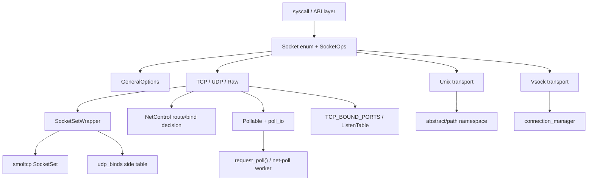

# Socket 系统

`ax-net` 的 socket 层向上提供统一的 POSIX-like socket facade，向下分别连接 smoltcp IP socket、内核 Unix domain socket transport 和可选 vsock transport。IP 类 socket 共享单个 smoltcp `SocketSet`，但 TCP 监听、UDP bind 冲突、raw packet 过滤、Unix namespace 和 vsock connection manager 都由 `ax-net` 在协议核心外补齐。

核心源码：

| 源码 | 职责 |
| --- | --- |
| [socket.rs](net/ax-net/src/socket.rs) | 统一地址、send/recv 选项、`SocketOps` trait、`Socket` 枚举分发 |
| [general.rs](net/ax-net/src/general.rs) | 通用 socket 选项、超时、nonblocking、`SO_BINDTODEVICE`、poll helper |
| [wrapper.rs](net/ax-net/src/wrapper.rs) | 全局 smoltcp `SocketSet` 包装和 UDP bind side table |
| [state.rs](net/ax-net/src/state.rs) | TCP 等 socket 的轻量状态门禁 |
| [listen_table.rs](net/ax-net/src/listen_table.rs) | TCP listen bucket、SYN/accept 队列、accept waker |
| [tcp.rs](net/ax-net/src/tcp.rs) | TCP stream socket、端口仲裁、connect/listen/accept、orphan 接入 |
| [udp.rs](net/ax-net/src/udp.rs) | UDP datagram socket、connected peer、MSG_MORE corking、route-aware source selection |
| [raw.rs](net/ax-net/src/raw.rs) | Raw IP socket、ICMP loopback、peer filter、deferred RX |
| [unix/](net/ax-net/src/unix/mod.rs) | Unix stream/datagram transport、abstract/path namespace |
| [vsock/](net/ax-net/src/vsock/mod.rs) | 可选 AF_VSOCK facade 和 stream transport |

## 设计边界

socket 层通过 `SocketOps` trait 和 `Socket` 枚举把系统调用语义映射到协议栈内部对象。它将 AF_INET、AF_UNIX、AF_VSOCK 的地址统一为 `SocketAddrEx`，将 `bind/connect/listen/accept/send/recv/shutdown` 统一为 trait 方法，并通过 `GeneralOptions` 维护 `O_NONBLOCK`、`SO_REUSEADDR`、超时和 `SO_BINDTODEVICE` 等通用选项。

IP 类 socket（TCP/UDP/raw）持有 smoltcp `SocketHandle`，注册到全局 `SocketSetWrapper`。socket 层补齐 smoltcp 不直接提供的 POSIX 语义——TCP accept queue（`ListenTable`）、UDP wildcard bind 冲突（`udp_binds` side table）、raw connected-peer 过滤。出接口选择由控制面 `NetControl` 在 bind/connect 时决策，实际发包由 `Router::dispatch()` 在 net-poll worker 中完成；socket 操作本身不同步推进 `Interface::poll()`，只调用 `request_poll()` 请求 worker 推进。

Unix domain socket 和 vsock 不经过 smoltcp，各自维护独立的 transport、namespace 和连接状态，但共享 `SocketOps`/`Configurable`/`Pollable` 入口，向上层呈现一致的 socket facade。

典型关系如下：



## 公共 Facade

公共 facade 定义跨协议族共享的数据形状和操作入口。系统调用层只需要持有 `Socket`，不需要知道底层是 smoltcp、Unix transport 还是 vsock connection manager。

### 地址与选项

`SocketAddrEx` 是跨地址族的统一地址类型：

```rust
// socket.rs
pub enum SocketAddrEx {
    Ip(SocketAddr),
    Unix(UnixSocketAddr),
    #[cfg(feature = "vsock")]
    Vsock(VsockAddr),
}
```

send/recv 选项保留 Linux `MSG_*` 语义：

```rust
pub struct SendOptions {
    pub to: Option<SocketAddrEx>,
    pub flags: SendFlags,
    pub cmsg: Vec<CMsgData>,
}

pub struct RecvOptions<'a> {
    pub from: Option<&'a mut SocketAddrEx>,
    pub flags: RecvFlags,
    pub cmsg: Option<&'a mut Vec<CMsgData>>,
    pub truncated: Option<&'a mut bool>,
}
```

其中 `MSG_DONTWAIT` 只影响当前调用，不修改 socket 自身的 `O_NONBLOCK`；`MSG_PEEK`、`MSG_TRUNC`、`MSG_MORE` 由具体 transport 按协议语义解释。

### SocketOps

`SocketOps` 是所有 backend 的统一接口：

```rust
pub trait SocketOps: Configurable {
    fn bind(&self, local_addr: SocketAddrEx) -> AxResult;
    fn connect(&self, remote_addr: SocketAddrEx) -> AxResult;
    fn listen(&self, _backlog: usize) -> AxResult {
        Err(AxError::OperationNotSupported)
    }
    fn accept(&self) -> AxResult<Socket> {
        Err(AxError::OperationNotSupported)
    }
    fn send(&self, src: impl Read + IoBuf, options: SendOptions) -> AxResult<usize>;
    fn recv(&self, dst: impl Write + IoBufMut, options: RecvOptions<'_>) -> AxResult<usize>;
    fn recv_available(&self) -> AxResult<usize> {
        Err(AxError::OperationNotSupported)
    }
    fn local_addr(&self) -> AxResult<SocketAddrEx>;
    fn peer_addr(&self) -> AxResult<SocketAddrEx>;
    fn shutdown(&self, how: Shutdown) -> AxResult;
}
```

默认实现只给出“不支持”的语义，具体 backend 再按协议覆盖。例如 TCP 支持 `listen/accept`，UDP/raw 不支持；Unix stream 支持 accept，Unix datagram 不按 TCP listen 语义工作；vsock 提供 stream transport。

### Backend 分发

`Socket` 枚举负责把统一 API 分发到具体 backend：

```rust
pub enum Socket {
    Udp(Box<UdpSocket>),
    Tcp(Box<TcpSocket>),
    Raw(Box<RawSocket>),
    Unix(Box<UnixSocket>),
    #[cfg(feature = "vsock")]
    Vsock(Box<VsockSocket>),
}
```

| Backend | 地址族/类型 | 协议核心 | 关键状态 |
| --- | --- | --- | --- |
| `TcpSocket` | AF_INET / SOCK_STREAM | smoltcp TCP socket | `StateLock`、`TCP_BOUND_PORTS`、`ListenTable`、orphan |
| `UdpSocket` | AF_INET / SOCK_DGRAM | smoltcp UDP socket | UDP bind side table、connected peer、cork |
| `RawSocket` | AF_INET / SOCK_RAW | smoltcp raw socket | local/peer filter、loopback RX、deferred RX |
| `UnixSocket` | AF_UNIX / stream,dgram | in-kernel transport | abstract/path namespace、stream/dgram transport |
| `VsockSocket` | AF_VSOCK / stream | rdif-vsock transport | connection manager、stream ring buffers |

## 共享 Socket 状态

共享状态层包含三类内容：通用 socket 选项、smoltcp handle 空间，以及状态转换门禁。它们不表达某个协议的完整语义，只提供所有 backend 复用的基础设施。

### GeneralOptions

`GeneralOptions` 被 TCP、UDP、raw、Unix、vsock transport 复用，用来维护通用 socket option 和阻塞等待入口：

```rust
// general.rs
pub(crate) struct GeneralOptions {
    nonblock: AtomicBool,
    reuse_address: AtomicBool,
    send_timeout_nanos: AtomicU64,
    recv_timeout_nanos: AtomicU64,
    bound_if: AtomicU32,
    socket_type: AtomicI32,
    domain: i32,
    protocol: i32,
}
```

构造时固定 `(SOCK_*, AF_*, IPPROTO_*)`，后续 `getsockopt()` 直接从这里读取：

| socket | SOCK_* | AF_* | protocol |
| --- | --- | --- | --- |
| TCP | `SOCK_STREAM` | `AF_INET` | `IPPROTO_TCP` |
| UDP | `SOCK_DGRAM` | `AF_INET` | `IPPROTO_UDP` |
| Raw | `SOCK_RAW` | `AF_INET` | 创建时指定的 `IpProtocol` |
| Unix stream | `SOCK_STREAM` | `AF_UNIX` | `0` |
| Unix dgram | `SOCK_DGRAM` | `AF_UNIX` | `0` |
| Vsock stream | `SOCK_STREAM` | `AF_VSOCK` | `0` |

`bound_if` 保存的是稳定的 `InterfaceId`，不是 Router 内部设备索引：

```rust
pub fn set_device_binding(&self, binding: DeviceBinding) {
    self.bound_if.store(
        binding.bound_if.map_or(0, InterfaceId::get),
        Ordering::Release,
    );
}

pub fn device_binding(&self) -> DeviceBinding {
    let raw = self.bound_if.load(Ordering::Acquire);
    DeviceBinding {
        bound_if: (raw != 0).then_some(InterfaceId::new(raw)),
    }
}
```

### SocketSetWrapper

TCP、UDP 和 raw socket 都注册到同一个 smoltcp `SocketSet`，由 `SocketSetWrapper` 持有：

```rust
pub(crate) struct SocketSetWrapper<'a> {
    pub inner: Mutex<SocketSet<'a>>,
    udp_binds: Mutex<HashMap<UdpBindKey, SocketHandle>>,
}
```

统一 `SocketSet` 的意义：

- TCP/UDP/raw 共享同一 handle 空间。
- net-poll worker 可以一次性推进所有 IP socket。
- TCP listen table 和 orphan reaper 可以通过 handle 操作 child socket。
- 不需要为每个接口复制 socket set，wildcard listen 和动态 route 选择保持简单。

`SocketSetWrapper` 只封装 smoltcp socket 访问，不持有 `Service` 锁，也不直接唤醒任务：

```rust
pub fn with_socket_mut<T: AnySocket<'a>, R, F>(&self, handle: SocketHandle, f: F) -> R
where
    F: FnOnce(&mut T) -> R,
{
    let mut set = self.inner.lock();
    let socket = set.get_mut(handle);
    f(socket)
}
```

### StateLock

`StateLock` 是 TCP 等 socket 的轻量状态门禁，避免同一个 socket 上并发 `bind/connect/listen` 进入不一致状态：

```rust
#[repr(u8)]
pub(crate) enum State {
    Idle = 0,
    Busy = 1,
    Connecting = 2,
    Connected = 3,
    Listening = 4,
    Closed = 5,
}

pub struct StateLock(AtomicU8);
```

`lock(expect)` 通过 CAS 把期望状态临时切到 `Busy`，`StateGuard::transit()` 在操作成功后提交新状态，失败时回退旧状态：

```rust
pub fn lock(&self, expect: State) -> Result<StateGuard<'_>, State> {
    match self.0.compare_exchange(
        expect as u8,
        State::Busy as u8,
        Ordering::Acquire,
        Ordering::Acquire,
    ) {
        Ok(_) => Ok(StateGuard(self, expect as u8)),
        Err(old) => Err(old.try_into().expect("invalid state")),
    }
}
```

典型 TCP 公共状态流：

```text
Idle --bind--> Idle
Idle --listen--> Listening
Idle --connect--> Connecting --established--> Connected
Listening --accept--> Listening
Connected --shutdown/drop--> Closed or orphaned smoltcp socket
```

## 端口与监听仲裁

端口仲裁是 POSIX 兼容语义的一部分，不能完全交给 smoltcp。`ax-net` 使用 TCP 和 UDP 各自的 side table 表达 wildcard/specific-address 冲突关系。

### UDP Bind Side Table

UDP bind side table 位于 `SocketSetWrapper`，用于补齐 Linux 风格的 wildcard bind 冲突：

```rust
#[derive(Clone, Copy, Debug, Eq, Hash, PartialEq)]
struct UdpBindKey {
    addr: Option<IpAddress>,
    port: u16,
}

fn udp_bind_available(binds: &HashMap<UdpBindKey, SocketHandle>, key: UdpBindKey) -> bool {
    let wildcard = UdpBindKey {
        addr: None,
        port: key.port,
    };
    if binds.contains_key(&key) || (key.addr.is_some() && binds.contains_key(&wildcard)) {
        return false;
    }
    key.addr.is_some() || !binds.keys().any(|bind| bind.port == key.port)
}
```

| bind 类型 | 示例 | 冲突规则 |
| --- | --- | --- |
| 精确地址 | `192.168.1.10:53` | 同地址同端口冲突；同端口 wildcard 已存在也冲突 |
| Wildcard | `0.0.0.0:53` | 任意地址已占用该端口即冲突 |
| `SO_REUSEADDR` | socket option | `UdpSocket::bind()` 跳过 wrapper 的 UDP bind side table；smoltcp 仍执行自身 bind 检查 |

### TCP Bound Ports

TCP 除了 listen table，还需要记录“已经 bind 但还没有 listen/connect 完成”的端口所有权：

```rust
static TCP_BOUND_PORTS: LazyLock<Mutex<HashMap<u16, HashSet<Option<IpAddress>>>>> =
    LazyLock::new(|| Mutex::new(HashMap::new()));

fn listen_addrs_conflict(a: Option<IpAddress>, b: Option<IpAddress>) -> bool {
    a.is_none() || b.is_none() || a == b
}

fn register_tcp_bound(endpoint: IpListenEndpoint) -> AxResult {
    let mut bound_ports = TCP_BOUND_PORTS.lock();
    let bound_addrs = bound_ports.entry(endpoint.port).or_default();
    if bound_addrs
        .iter()
        .any(|&addr| listen_addrs_conflict(addr, endpoint.addr))
    {
        return Err(AxError::AddrInUse);
    }
    bound_addrs.insert(endpoint.addr);
    Ok(())
}
```

语义是 wildcard 与所有地址冲突，两个具体地址仅在相等时冲突。ephemeral TCP 端口分配同时检查 listen table 和 bound table：

```rust
fn tcp_port_available(port: u16) -> bool {
    LISTEN_TABLE.can_listen(IpListenEndpoint { addr: None, port })
        && !TCP_BOUND_PORTS.lock().contains_key(&port)
}
```

这里用 wildcard endpoint 检查 listen table 是有意的保守策略：自动分配 ephemeral port 时，只要该端口已经存在任何 listen entry，就不再分配给主动连接 socket。

### ListenTable

`ListenTable` 是 TCP passive open 的核心数据结构。smoltcp 没有“一个 public listen socket 管理多个 child socket”的 POSIX 对象模型，所以 `ax-net` 在外部维护 accept queue：

```rust
struct ListenTableEntryInner {
    listen_endpoint: IpListenEndpoint,
    backlog: usize,
    syn_queue: VecDeque<AcceptedTcp>,
    accept_poll: Arc<PollSet>,
}

pub struct ListenTable {
    tcp: Mutex<HashMap<u16, ListenTableEntry>>,
}
```

`tcp` 按端口懒创建 listen bucket，每个 bucket 存放该端口下的多个具体地址 listener。`listen()` 检查 wildcard/specific 冲突后插入 entry：

```rust
pub fn listen(&self, listen_endpoint: IpListenEndpoint, backlog: usize) -> AxResult {
    let port = listen_endpoint.port;
    let entries = self.listen_entry_or_create(port);
    let mut entries = entries.lock();
    if entries
        .iter()
        .any(|entry| listen_addrs_conflict(entry.listen_endpoint.addr, listen_endpoint.addr))
    {
        return Err(AxError::AddrInUse);
    }
    entries.push(ListenTableEntryInner::new(listen_endpoint, backlog));
    Ok(())
}
```

### SYN 预创建与 accept

`Router::poll()` 在 RX 路径 snoop TCP SYN 包，`incoming_tcp_packet()` 匹配 listen endpoint 后预创建 child smoltcp socket，并推入 listener 的 `syn_queue`。这样每条 pending 连接都有自己的 smoltcp TCP 状态机，可以独立完成 SYN-RECEIVED 到 ESTABLISHED 的推进。

`accept()` 遍历 `syn_queue`，清理已经关闭且无数据的 child，返回第一个可接受 socket：

```rust
pub fn accept(
    &self,
    listen_endpoint: IpListenEndpoint,
    sockets: &mut SocketSet<'_>,
) -> AxResult<AcceptedTcp> {
    let Some(entries) = self.listen_entry(listen_endpoint.port) else {
        return Err(AxError::InvalidInput);
    };
    let mut table = entries.lock();
    let Some(entry) = table
        .iter_mut()
        .find(|entry| entry.listen_endpoint == listen_endpoint)
    else {
        return Err(AxError::InvalidInput);
    };

    let syn_queue: &mut VecDeque<AcceptedTcp> = &mut entry.syn_queue;
    let mut idx = 0;
    while idx < syn_queue.len() {
        let handle = syn_queue[idx].handle;
        if is_closed_without_data(sockets, handle) {
            syn_queue.swap_remove_front(idx);
            sockets.remove(handle);
            continue;
        }
        if is_acceptable(sockets, handle) {
            return Ok(syn_queue.swap_remove_front(idx).unwrap());
        }
        idx += 1;
    }
    Err(AxError::WouldBlock)
}
```

可接受状态包括已经建立以及已经进入关闭流程但仍可被 userspace 观察的 child，例如 `Established`、`CloseWait`、`FinWait*`、`Closing`、`LastAck`、`TimeWait`。

## IP Socket Backend

TCP、UDP 和 raw socket 都持有 smoltcp `SocketHandle`，但它们在 public 语义、side table 和 packet 格式上差异很大。

### TCP Socket

`TcpSocket` 包装 smoltcp stream socket，并维护 public TCP 状态、端口注册、peer endpoint、keepalive/TCP_INFO 选项和 readiness poll set：

```rust
pub struct TcpSocket {
    state: StateLock,
    handle: SocketHandle,
    bound_endpoint: Mutex<IpListenEndpoint>,
    peer_endpoint: Mutex<Option<IpEndpoint>>,
    bound_registered: AtomicBool,
    general: GeneralOptions,
    pending_error: AtomicI32,
    keep_idle_secs: AtomicU32,
    keep_interval_secs: AtomicU32,
    keep_count: AtomicU32,
    user_timeout_millis: AtomicU32,
    rx_closed: AtomicBool,
    poll_rx: Arc<PollSet>,
    poll_tx: Arc<PollSet>,
    poll_rx_closed: PollSet,
}
```

TCP socket 的主要职责：

- `bind()`：通过控制面校验本地地址并注册 `TCP_BOUND_PORTS`。
- `connect()`：选择 route/source，绑定 ephemeral port，启动 smoltcp connect，然后 `request_poll()`。
- `listen()`：把 endpoint 移入 `ListenTable`。
- `accept()`：从 `ListenTable` 取出 child handle，构造已连接 `TcpSocket`。
- `send/recv()`：只操作 smoltcp socket buffer，不同步驱动完整 interface poll。
- `drop()`：必要时把未完全关闭的 smoltcp socket移入 orphan reaper。

### UDP Socket

`UdpSocket` 是 datagram backend，保留本地 endpoint、connected peer 和 `MSG_MORE` cork 状态：

```rust
struct CorkState {
    buf: Vec<u8>,
    remote: IpEndpoint,
    source: IpAddress,
}

pub struct UdpSocket {
    handle: SocketHandle,
    local_addr: RwLock<Option<IpEndpoint>>,
    peer_addr: RwLock<Option<(IpEndpoint, IpAddress)>>,
    general: GeneralOptions,
    cork: Mutex<Option<CorkState>>,
}
```

设计要点：

- bind 时通过 `SocketSetWrapper::udp_bind()` 记录 wildcard/specific ownership。
- connect/sendto 时通过控制面 route decision 选择源地址。
- connected UDP 保存 `(peer endpoint, selected source)`，recv 时过滤不匹配 peer 的 datagram。
- `MSG_MORE` 会把多次 send 合并为一个 datagram，并固定第一次 send 的 remote/source，避免后续调用改变目标。
- drop 时从 UDP bind side table 中移除 handle。

### Raw Socket

`RawSocket` 暴露 IP 层以上、TCP/UDP 以下的 packet-oriented 接口：

```rust
pub struct RawSocket {
    handle: SocketHandle,
    ip_version: IpVersion,
    local_addr: RwLock<Option<IpAddress>>,
    peer_addr: RwLock<Option<IpAddress>>,
    loopback_rx: Mutex<Option<(IpAddress, Vec<u8>)>>,
    deferred_rx: Mutex<Option<(IpAddress, Vec<u8>)>>,
    ttl: RwLock<Option<u8>>,
    rx_closed: AtomicBool,
    tx_closed: AtomicBool,
    general: GeneralOptions,
}
```

raw socket 有两个特别路径：

- `loopback_rx` 保存本地快速路径产生、尚未被 recv 取走的 loopback packet。
- `deferred_rx` 保存 connected-peer 过滤时暂存的非当前可交付 packet，格式保持为一致的 wire packet，避免 peek/filter 后破坏 smoltcp receive queue 语义。

发送时，如果没有显式本地地址，raw socket 通过控制面按 remote 选择 source；loopback 目的地址走本地路径，非 loopback 目的地址交给 smoltcp raw socket 和 Router dispatch。

## Local Transport Backend

Unix 和 vsock 不经过 smoltcp `SocketSet`，但共享 `SocketOps`、`Configurable` 和 `Pollable` 入口。它们的状态机和缓冲区由各自 transport 管理。

### Unix Socket

Unix socket facade 维护公共 local/remote 地址，具体 stream/datagram 语义交给 `Transport`：

```rust
pub enum UnixSocketAddr {
    Unnamed,
    Abstract(Arc<[u8]>),
    Path(Arc<str>),
}

pub enum Transport {
    Stream(StreamTransport),
    Dgram(DgramTransport),
}

pub struct UnixSocket {
    transport: Transport,
    local_addr: Mutex<UnixSocketAddr>,
    remote_addr: Mutex<UnixSocketAddr>,
}
```

namespace 分两类：

- abstract namespace：`ABSTRACT_BINDS: HashMap<Arc<[u8]>, BindSlot>`，完全位于内存。
- path namespace：通过 `register_unix_namespace()` 注入外部 VFS namespace provider。

`BindSlot` 同时容纳 stream listener 和 datagram endpoint，因此同一路径下 stream/dgram ownership 由 transport 分别仲裁：

```rust
pub struct BindSlot {
    stream: Mutex<Option<stream::Bind>>,
    dgram: Mutex<Option<dgram::Bind>>,
}
```

Unix socket 的 accept 使用 transport 自己的 `Pollable`，不涉及 `request_poll()` 或 smoltcp：

```rust
let (transport, peer_addr) =
    block_on(poll_io(&self.transport, IoEvents::IN, nonblocking, || {
        self.transport.try_accept()
    }))?;
```

#### Unix Stream

Unix stream 使用两组单向 ring buffer 组成全双工连接：

```text
endpoint A tx -> endpoint B rx
endpoint B tx -> endpoint A rx
```

每个方向还带一条 cmsg side channel。stream 的 ancillary data 不按“单个字节”保存，而是绑定到一次 send 调用产生的字节区间：

```rust
struct PendingCmsg {
    start_byte: u64,
    end_byte: u64,
    cmsg: Vec<CMsgData>,
}
```

接收端在读到 `start_byte` 后交付该 cmsg，并可在 `end_byte` 处截断一次 recv，使下一次 `recvmsg()` 从下一个带 cmsg 的消息边界开始。这避免了 `MSG_PEEK` 或分段读取时把 ancillary data 和 payload 的对应关系打散。

stream listener 的 bind 状态是 `stream::Bind`：

```text
bind/listen
  -> install stream::Bind into BindSlot.stream
connect
  -> create paired channels
  -> enqueue server-side ConnRequest
  -> wake listener poll set
accept
  -> receive ConnRequest
  -> wrap server-side channel as accepted UnixSocket
```

#### Unix Datagram

Unix datagram 使用 message queue，而不是 byte stream。每个 packet 保存 payload、发送端地址和 cmsg：

```text
DgramTransport::send
  -> resolve peer BindSlot.dgram
  -> enqueue Packet { bytes, addr, cmsg }
  -> wake receiver poll set
```

datagram 的消息边界天然保留；`MSG_TRUNC`、接收缓冲区不足和 cmsg 交付都按单个 packet 处理。path namespace 与 abstract namespace 的 ownership 仍通过同一个 `BindSlot` 管理。

#### Credentials

Unix transport 支持 Linux 风格的 credentials 查询：

- `PassCredentials(bool)` 接受 `SO_PASSCRED` 设置，用于兼容 Linux 应用的 option 探测。
- `PeerCredentials(UnixCredentials)` 返回对端或创建者 PID，uid/gid 当前使用内核默认值。
- stream channel 在连接建立时保存 peer pid；datagram endpoint 返回绑定 transport 的 pid。

`CMsgData` 是 `Box<dyn Any + Send + Sync>`，由 StarryOS 或上层 ABI 保存具体 ancillary payload。`ax-net` 只负责按 socket 语义运输 cmsg，不解析 Linux `cmsghdr` 二进制布局。

### Vsock Socket

vsock 是可选 feature，不属于 IP 协议，也不通过 smoltcp poll。facade 只把 `SocketOps` 映射到 stream transport：

```rust
pub struct VsockSocket {
    transport: VsockStreamTransport,
}
```

核心连接状态位于 `vsock::connection_manager`，设备事件由 vsock 设备层推进。

#### Vsock Connection Manager

`vsock::connection_manager` 是 AF_VSOCK stream 的全局状态表：

```rust
pub enum ConnectionState {
    Idle,
    Listening,
    Connecting,
    Connected,
    Closed,
}

pub struct VsockConnectionManager {
    connections: BTreeMap<VsockConnId, Arc<Mutex<Connection>>>,
    listen_queues: BTreeMap<u32, Arc<Mutex<ListenQueue>>>,
}
```

核心对象：

| 对象 | 职责 |
| --- | --- |
| `Connection` | 保存 state、local/peer address、RX ring、TX wait queue、RX/connect poll set、半关闭标志和统计 |
| `AcceptQueue` | listener 的已完成连接队列，容量为 `VSOCK_ACCEPT_QUEUE_SIZE` |
| `ListenQueue` | 绑定一个 local port，持有 `AcceptQueue` 和 accept poll set |
| `VSOCK_CONN_MANAGER` | 全局 manager，处理 listen/connect/accept/disconnect 和设备事件 |

每条连接拥有 `VSOCK_RX_BUFFER_SIZE = 64 KiB` 的 RX ring。设备收到数据后写入对应 connection 的 RX ring 并唤醒 `rx_wakers`；socket `recv()` 从 ring 消费。发送路径调用 `device::vsock_send()`，当 peer credit 或设备侧压力不足时通过 `tx_wait_queue` 短暂等待。

vsock 设备层还有一个临时 RX buffer 和 pending event queue：

- `VSOCK_RX_TMPBUF_SIZE = 4 KiB`：poll task 从 `rdif_vsock::Interface` 拉取事件时使用的临时接收缓冲。
- `PENDING_EVENTS`：当事件暂时无法完整交付给 manager（例如目标连接 RX ring 空间不足）时保存事件，后续 poll 周期继续处理，避免直接丢弃设备事件。

#### Vsock Poll Worker

vsock 设备不进入 smoltcp poll。`start_vsock_poll()` / `stop_vsock_poll()` 使用引用计数控制一个独立 poll task：

```text
first active vsock socket
  -> start_vsock_poll()
  -> spawn vsock-poll task

last active vsock socket dropped
  -> stop_vsock_poll()
  -> poll task observes refcount=0 and exits
```

poll task 从 `rdif_vsock::Interface` 拉取事件，并分发到 `VSOCK_CONN_MANAGER`：

| 事件 | manager 动作 |
| --- | --- |
| connection request | 查找 `ListenQueue`，创建 server-side connection，压入 accept queue |
| connected | 将 outgoing connection 置为 `Connected` 并唤醒 connect waker |
| received data | 写 RX ring，唤醒 recv waker |
| credit update | 唤醒 TX wait queue |
| disconnect | 标记 close，唤醒 RX/connect waiters |

poll 频率自适应：有事件时降低 sleep interval，长时间 idle 时逐步退回较长 interval，避免空轮询占用 CPU。

## Poll 与唤醒

socket 阻塞语义基于 `Pollable` + `poll_io()`。应用线程只注册 waker 并等待 readiness；协议栈推进由 net-poll worker 或本地 transport 自己的 poll set 完成。

### 通用 poll helper

`GeneralOptions` 提供 send/recv 两类阻塞 helper：

```rust
pub fn send_poller_with<P: Pollable, F: FnMut() -> AxResult<T>, T>(
    &self,
    pollable: &P,
    extra_nonblocking: bool,
    f: F,
) -> AxResult<T> {
    block_on(timeout(
        self.send_timeout(),
        poll_io(
            pollable,
            IoEvents::OUT,
            self.nonblocking() || extra_nonblocking,
            f,
        ),
    ))?
}
```

`poll_io()` 的流程：

1. 先执行一次 socket 操作闭包。
2. 如果成功，直接返回。
3. 如果返回 `WouldBlock` 且是 nonblocking 或 `MSG_DONTWAIT`，立即返回错误。
4. 否则调用 `Pollable::register()` 注册 waker，挂起当前任务。
5. 被唤醒或 timeout 后重试闭包。

### IP socket readiness

TCP/UDP/raw 的 `poll()` 都会先 `request_poll()`，表示需要专用 net-poll worker 推进 smoltcp：

```rust
impl Pollable for UdpSocket {
    fn poll(&self) -> IoEvents {
        request_poll();
        if self.local_addr.read().is_none() {
            return IoEvents::empty();
        }
        let mut events = IoEvents::empty();
        self.with_smol_socket(|socket| {
            events.set(IoEvents::IN, socket.can_recv());
            events.set(IoEvents::OUT, socket.can_send());
        });
        events
    }
}
```

注册 waker 时分两层：

- 向 smoltcp socket 注册 recv/send waker，等待协议 socket buffer 状态变化。
- 通过 `GeneralOptions::register_waker()` 向匹配 `DeviceBinding` 的设备注册 waker，等待设备 RX 触发下一轮 net-poll。

```rust
pub fn register_waker(&self, waker: &Waker) {
    get_service().register_waker(self.device_binding(), waker);
}
```

TCP listener 还有额外 accept waker：`ListenTable::register_accept_waker()` 会把 userspace waker 放到 listener 的 `accept_poll`，并把 `accept_poll` 转成 waker 注册到 pending child 的 recv/send readiness 上。

### Local transport readiness

Unix/vsock 不调用 `request_poll()`。它们的 `Pollable` 由 transport 内部 `PollSet`、channel 或 connection manager 状态驱动。这样 AF_UNIX/AF_VSOCK 的等待路径不会依赖 IP net-poll worker。

## 生命周期与清理

socket drop 需要清理 public side table，但不能破坏协议栈还需要推进的状态。

### TCP orphan

TCP drop 时，如果 smoltcp socket 已经进入需要继续关闭或 TIME-WAIT 的状态，socket 不会立即从 `SocketSet` 删除，而是交给 orphan reaper：

```text
TcpSocket::drop
  -> unregister_tcp_bound / unlisten if needed
  -> if smoltcp socket still needs protocol cleanup:
       orphan::add_orphan(handle, timestamp)
     else:
       SOCKET_SET.remove(handle)
```

这样 FIN、LAST-ACK、TIME-WAIT 等状态仍由 net-poll worker 推进，避免应用对象释放后协议状态被过早销毁。

### UDP/raw cleanup

UDP drop 会调用 `SOCKET_SET.remove(handle)`，wrapper 在 remove 中清除 UDP bind side table：

```rust
pub fn remove(&self, handle: SocketHandle) {
    self.udp_unbind(handle);
    self.inner.lock().remove(handle);
}
```

raw drop 会先 `shutdown(Shutdown::Both)`，再移除 smoltcp raw socket。raw 的 `loopback_rx` 和 `deferred_rx` 是 socket 本地暂存状态，随对象释放。

### Listen cleanup

TCP listener unlisten 时会从 listen table 删除 entry，并销毁尚未 accept 的 child socket handle：

```rust
pub fn unlisten(&self, listen_endpoint: IpListenEndpoint) {
    let handles = {
        let mut entries = self.tcp[listen_endpoint.port as usize].lock();
        let Some(idx) = entries
            .iter()
            .position(|entry| entry.listen_endpoint == listen_endpoint)
        else {
            return;
        };
        entries.swap_remove(idx).into_handles()
    };
    for handle in handles {
        SOCKET_SET.remove(handle);
    }
}
```

## 并发边界

socket 层并发边界围绕三类锁：`SERVICE`、`SOCKET_SET.inner`、协议 side table。原则是 socket 操作只在必要范围内持锁，并通过 `request_poll()` 交给 net-poll worker 推进协议核心。

### 锁顺序

典型锁顺序：

```text
net-poll path:
  SERVICE -> SOCKET_SET.inner -> smoltcp sockets

TCP listen/accept path:
  SOCKET_SET.inner -> LISTEN_TABLE bucket

TCP bind path:
  TCP_BOUND_PORTS -> LISTEN_TABLE check

UDP bind path:
  SOCKET_SET.inner / udp_binds

control-assisted bind/send path:
  NetControl.state -> RouteTable
```

需要避免的反向路径：

- 持设备锁时进入 `SocketSet` 或 `Service`。
- 持 `SocketSet` 时执行可能阻塞的用户 buffer IO。
- socket 热路径直接调用完整 interface poll。

### 热路径原则

TCP/UDP/raw 的 send/connect/recv 路径只做三件事：

1. 操作对应 smoltcp socket 或本地 socket 状态。
2. 调用 `request_poll()` 请求专用 net-poll worker 推进协议栈。
3. 在 `WouldBlock` 时通过 `Pollable::register()` 注册 waker 并让出当前任务。

这个模型保持应用线程和协议栈驱动线程分离，避免 socket 调用者临时成为 smoltcp interface owner。
