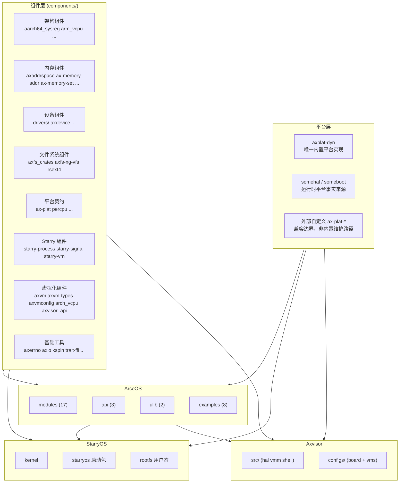
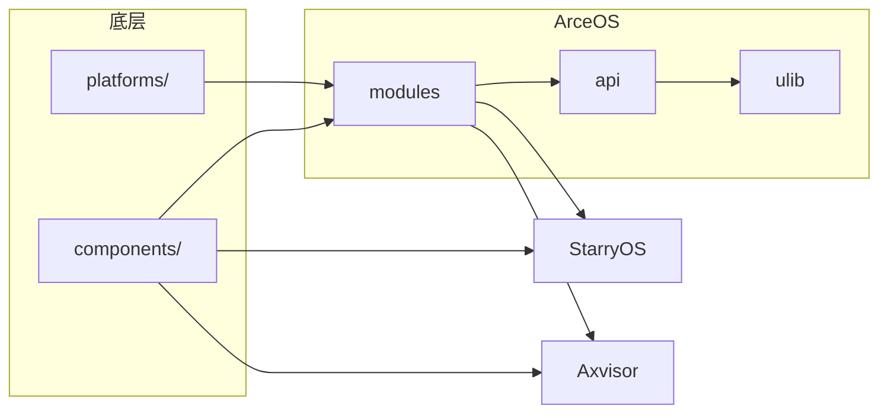

# 总体架构

TGOSKits 是一个统一的 Cargo workspace，包含 140 余个 crate，覆盖三个操作系统（ArceOS、StarryOS、Axvisor）及其共享组件层。理解这些 crate 之间的层次关系和依赖方向，是判断改动影响范围和选择验证策略的前提。

## 三套系统

TGOSKits 包含三套独立的系统实现，它们共享同一套组件基础设施，但面向不同的应用场景。

### ArceOS

ArceOS 是组件化 Unikernel，同时充当三个角色：独立运行时、示例应用平台和共享能力提供者。它通过 Cargo feature 做编译期装配，只链接被选中的子系统，避免不需要的运行时负担。StarryOS 和 Axvisor 均复用其 HAL、调度、内存、驱动等基础能力。

- 17 个内核模块（`os/arceos/modules/`）
- 3 个 API crate（`os/arceos/api/`）
- 2 个用户库（`os/arceos/ulib/`）
- 9 个 Rust std 应用（`apps/arceos/`）

→ 详细架构见 [ArceOS 架构](./arceos)

### StarryOS

StarryOS 是建立在 ArceOS 基础能力之上的组件化宏内核系统，引入了更接近 Linux 的进程、线程、syscall、文件系统和 rootfs 语义。它并非简单地为 ArceOS 增加一个 shell，而是将进程、地址空间、syscall 分发、伪文件系统、信号、资源限制等内核机制系统化地组合起来。

- 10 个内核子系统（`os/StarryOS/kernel/src/`）
- 12 个 syscall 功能域
- 3 个 Starry 专用组件（`components/starry-*`）

→ 详细架构见 [StarryOS 架构](./starryos)

### Axvisor

Axvisor 是基于 ArceOS 的统一组件化 Type-I Hypervisor，建立在 ArceOS 运行时、虚拟化组件库与分层配置系统之上。它与 ArceOS/StarryOS 的最大差异在于：代码、配置和 Guest 镜像同等重要。

- 4 套架构适配（aarch64、riscv64、loongarch64、x86_64）
- 10 份板级配置、50 余份 VM 配置
- 支持 ArceOS、Linux、NimbOS、RT-Thread、FreeRTOS、Zephyr 等 Guest

→ 详细架构见 [Axvisor 架构](./axvisor)

## 驱动框架重构方向

宿主物理设备路径正在收敛到 `rdrive + rdif`。这个方向将 FDT/ACPI 等运行时发现来源和外部自定义平台适配放进同一套 `rdrive` 注册与 probe 主线，并让文件系统、网络、显示、输入、vsock、StarryOS 和 Axvisor 直接消费 `rdif-*` / `rd-*` 设备。

本轮重构不迁移 `axdevice` / `axdevice_base`。它们继续作为 Axvisor / axvm 的 guest emulated device model，与宿主物理设备路径保持边界。

→ 详细设计见 [驱动框架](./driver/overview)

## 平台层架构

平台层位于 `platforms/`，把启动入口、内存布局、时钟、中断、控制台、电源、SMP 和设备发现事实接入 `ax-plat` / `ax-hal`。当前默认路径是 `axplat-dyn + somehal + someboot`，外部平台可以通过独立 `ax-plat` 实现接入，但需要自己维护启动、链接、IRQ、timer 和设备发现 glue。

→ 详细设计见 [平台层架构](./platform/overview)

## 网络栈架构

网络栈能力收敛在 `net/ax-net`，对上提供 TCP、UDP、raw socket、DNS、DHCP、ARP、poll/waker 等统一 API，对下通过 `rd-net` 设备适配真实网卡。多网口方案保持单 `smoltcp::iface::Interface + SocketSet` 协议栈模型，通过接口 registry、路由表、设备队列和 net-poll worker 管理多个接口。

→ 详细设计见 [网络栈架构](./net/overview)

## 核心层次

TGOSKits 按职责将 crate 组织为六个核心层次和一个辅助层，每一层都面向明确的职责边界。上层依赖下层，但下层不感知上层——这一原则使得同一套组件可以同时服务于多个系统。

| 层次 | 路径 | 角色 | 规模 |
|------|------|------|------|
| 共享组件 | `components/` | 独立可复用 crate：架构组件、内存管理、设备抽象、同步原语、工具库 | 54 个目录，77 个 crate |
| ArceOS 内核 | `os/arceos/modules/` | ArceOS 内核模块：HAL、调度、内存、驱动、文件系统、网络 | 17 个模块 |
| ArceOS API | `os/arceos/api/` | Feature 聚合与 API 封装 | 3 个 crate |
| ArceOS 用户库 | `os/arceos/ulib/` | 应用开发接口 | 2 个 crate |
| StarryOS 内核 | `os/StarryOS/kernel/` | 宏内核逻辑：syscall、进程、信号、内存管理、文件系统 | 10 个子系统 |
| Axvisor 运行时 | `os/axvisor/` | Hypervisor 运行时：HAL 适配、VMM、shell、配置 | 6 个模块 |

辅助层：

- `platforms/` — 平台实现，当前维护动态平台 `axplat-dyn`，详见 [平台层架构](./platform/overview)
- `drivers/` — SoC 专用驱动（blk、net、npu、pci、soc）
- `test-suit/` — 系统级测试入口（ArceOS、StarryOS、Axvisor）

## 依赖方向

依赖关系从底层组件流向三个操作系统，ArceOS 同时作为 StarryOS 和 Axvisor 的基础运行时。

| 依赖路径 | 含义 |
|----------|------|
| `components/` → ArceOS modules | ArceOS 模块基于共享组件构建 |
| `components/` → StarryOS kernel | Starry 专用组件（starry-process、starry-signal、starry-vm）独立于 ArceOS 模块 |
| `components/` → Axvisor runtime | 虚拟化组件（axvm、axvm-types、架构 vCPU 后端、axvisor_api）被 Axvisor 直接使用 |
| ArceOS modules → StarryOS kernel | StarryOS 复用 ArceOS 的 HAL、调度、内存、驱动等基础能力 |
| ArceOS modules → Axvisor runtime | Axvisor 复用 ArceOS 的 std、HAL、alloc、task、sync |
| `platforms/` → 三个系统 | 平台实现通过 ax-hal 注入各系统 |

## 改动影响评估

修改不同层次的代码时，影响范围差异显著。以下规则帮助在改动前预判验证范围。

| 改动位置 | 影响范围 | 验证策略 |
|----------|---------|---------|
| `components/` | 跨系统基础设施，三个系统都可能受影响 | 至少验证 ArceOS + 一个上游系统 |
| `os/arceos/modules/` | ArceOS 本身 + StarryOS/Axvisor 的复用路径 | 不要只测 ArceOS，补跑上游系统最小用例 |
| `os/StarryOS/kernel/` | 仅 StarryOS | 重点关注 rootfs 和 Linux 兼容行为 |
| `os/axvisor/` | 仅 Axvisor | 代码、配置和 Guest 镜像要一起验证 |
| `platforms/` | 所有使用该平台的系统 | 至少验证对应架构的 ArceOS 基础启动 |
