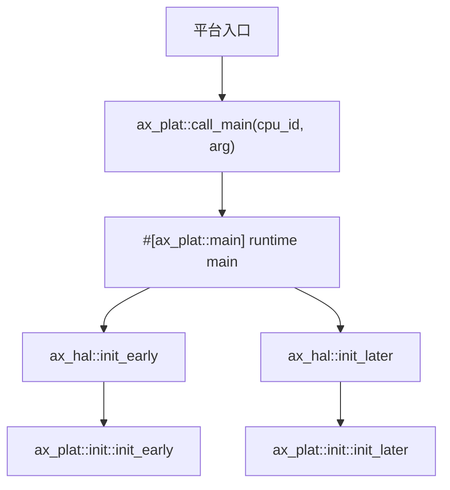

# 平台契约

平台契约由 `platforms/ax-plat` 定义，平台 crate 负责实现这些 trait，`ax-hal` 再把它们转成 ArceOS、StarryOS 和 Axvisor 可复用的统一接口。这个边界的核心约束是：**一个最终镜像中只能有一个平台 crate 实现 `ax-plat` 接口**。

## crate 全貌

`ax-plat` 是一个 `#![cfg_attr(not(test), no_std)]` 的库（`platforms/ax-plat/src/lib.rs`），默认开启 `alloc`。其顶层模块：

```rust
// platforms/ax-plat/src/lib.rs
#![cfg_attr(not(test), no_std)]
extern crate alloc;

pub mod console;
pub mod init;
#[cfg(feature = "irq")]
pub mod irq;
pub mod mem;
pub mod percpu;
pub mod platform;
pub mod power;
pub mod time;

pub use ax_crate_interface::impl_interface as impl_plat_interface;
pub use ax_plat_macros::main;
#[cfg(feature = "smp")]
pub use ax_plat_macros::secondary_main;
```

两个 feature：`smp`（多核，依赖 `ax-kspin/smp`）、`irq`（接入 `irq-framework` + `rdif-intc`）。

## 接口集合（trait 全签名）

下表给出所有 `#[def_plat_interface]` 装饰的接口 trait，源码位置见对应文件：

| 接口 | 源码 | 关键方法 |
| --- | --- | --- |
| `PlatformInfoIf` | `platform.rs` | `fn platform_name() -> &'static str` |
| `InitIf` | `init.rs` | `init_early`、`init_later`，以及 `smp` feature 下的 `_secondary` 变种 |
| `ConsoleIf` | `console.rs` | `write_bytes`、`read_bytes`、`device_id`、`claim_runtime_output`，以及 `irq` feature 下的 IRQ 系列 |
| `MemIf` | `mem.rs` | `phys_ram_ranges`、`reserved_phys_ram_ranges`、`mmio_ranges`、`phys_to_virt`、`virt_to_phys`、`kernel_aspace` |
| `TimeIf` | `time.rs` | `current_ticks`、`ticks_to_nanos`、`nanos_to_ticks`、`epochoffset_nanos`，`irq` 下还有 `irq_num`/`set_oneshot_timer` |
| `PowerIf` | `power.rs` | `system_off`、`system_reset`、`cpu_num`，`smp` 下 `cpu_boot(cpu_id, stack_top_paddr)` |
| `IrqIf` | `irq.rs` | `set_enable`、`set_affinity`、`handle`、`send_ipi`、`ipi_irq`、`resolve_source`、`resolve_percpu` |
| `LoongArchHvIrqIf` | `irq/loongarch64_hv.rs` | 虚拟中断注入 / guest IRQ 路由（仅 LoongArch hypervisor） |

`IrqIf` 是体量最大的模块（`irq.rs` 约 470 行），它把 `irq_framework` 的整套 API 都 re-export，并维护一个静态的 `Registry<PlatIrqOps>`（`spin::Once` 包裹）。`PlatIrqOps` 是 `IrqOps` 的实现，桥接到平台层 `current_cpu`、`cpu_online`、`in_irq_context`、`local_irq_save`/`restore`、`run_on_cpu_sync`、`set_enabled`、`set_affinity` 等运行时事实。

### IRQ domain 常量

`platforms/ax-plat/src/irq.rs` 中定义的全局 `IrqDomainId` 预留段：

```rust
pub const LEGACY_IRQ_DOMAIN:       IrqDomainId = IrqDomainId(0);
pub const X86_LAPIC_DOMAIN:        IrqDomainId = IrqDomainId(1);
pub const X86_IOAPIC_DOMAIN:       IrqDomainId = IrqDomainId(2);
pub const AARCH64_GIC_DOMAIN:      IrqDomainId = IrqDomainId(3);
pub const RISCV_PLIC_DOMAIN:       IrqDomainId = IrqDomainId(4);
pub const LOONGARCH_EIOINTC_DOMAIN:IrqDomainId = IrqDomainId(5);
pub const LOONGARCH_PCH_PIC_DOMAIN:IrqDomainId = IrqDomainId(6);
pub const CPU_LOCAL_IRQ_DOMAIN:    IrqDomainId = IrqDomainId(u16::MAX);
```

`somehal` 中 `alloc_irq_domain` 会在 `7..u16::MAX` 区间动态分配新 domain，详见 [somehal.md](somehal.md)。

### `IpiTarget` 抽象

IPI 的目标集合由 `platforms/ax-plat/src/irq.rs` 的 `IpiTarget` 枚举表达，避免裸 `usize` 表示：

```rust
pub enum IpiTarget {
    Current          { cpu_id: usize },
    Other            { cpu_id: usize },
    AllExceptCurrent { cpu_id: usize, cpu_num: usize },
}
```

### MemIf 的类型集合

`MemIf` 不是裸数字的堆砌：`mem.rs` 提供 `bitflags! MemRegionFlags: usize`、`struct PhysMemRegion { paddr, size, flags, name }` 与构造器 `new_ram`/`new_mmio`/`new_reserved`，并提供 `Aligned4K<T>` 4K 对齐包装器。一组默认 flag 常量被预定义：

| 常量 | 取值 | 用途 |
| --- | --- | --- |
| `DEFAULT_RAM_FLAGS` | READ \| WRITE \| EXECUTE | 普通 RAM |
| `DEFAULT_RESERVED_FLAGS` | RESERVED | BIOS/固件保留 |
| `DEFAULT_MMIO_FLAGS` | DEVICE \| UNCACHED | MMIO 寄存器区 |

辅助函数 `total_ram_size`、`check_sorted_ranges_overlap`、`ranges_difference` 在平台 crate 内组合 ranges 时被反复使用。

### ConsoleIf 的 IRQ 事件

`console.rs` 定义：

```rust
pub enum ConsoleDeviceIdError { NotSpecified, NoHardwareDevice, DeviceNotFound }
pub type ConsoleDeviceIdResult = Result<DeviceId, ConsoleDeviceIdError>;

bitflags! ConsoleIrqEvent: u32 {
    const RX_READY = 1 << 0;
    const RX_ERROR = 1 << 1;
    const OVERRUN  = 1 << 2;
}
```

并提供全局 `CONSOLE_LOCK: SpinNoIrq<()>`、`write_text_bytes`、`__simple_print`，以及导出宏 `console_print!` / `console_println!` 供内核早期日志使用。

## `def_plat_interface` 宏展开

`#[def_plat_interface]` 由 `platforms/ax-plat-macros/src/lib.rs` 提供。展开等价于：

```rust
#[crate::__priv::def_interface]
#trait_ast

#(#attrs)*
#[inline]
pub #sig {
    crate::__priv::call_interface!(#trait_name::#fn_name, #(#args),* )
}
```

对 trait 的每个方法，宏都会生成同名的 free function，函数体通过 `call_interface!` 宏分发到 `ax-crate-interface` 维护的单实现槽。该宏拒绝带 `self` 的方法（`FnArg::Receiver`）。

`__priv` 模块 (`platforms/ax-plat/src/lib.rs`) 内 re-export 了 `ax_crate_interface::{call_interface, def_interface}` 与 `const_str::equal`。

## 入口符号契约

平台入口最终要跳到 `ax-plat` 定义的运行时入口：

```rust
// platforms/ax-plat/src/lib.rs
pub fn call_main(cpu_id: usize, arg: usize) -> ! {
    unsafe { __axplat_main(cpu_id, arg) }
}
#[cfg(feature = "smp")]
pub fn call_secondary_main(cpu_id: usize) -> ! {
    unsafe { __axplat_secondary_main(cpu_id) }
}
unsafe extern "Rust" {
    fn __axplat_main(cpu_id: usize, arg: usize) -> !;
    fn __axplat_secondary_main(cpu_id: usize) -> !;
}
```

`#[ax_plat::main]` / `#[ax_plat::secondary_main]` 校验函数签名后用 `#[unsafe(export_name = "...")]` 把用户函数绑定到这两个 Rust ABI 符号。`main` 要求 `fn(usize, usize) -> !`，`secondary_main` 要求 `fn(usize) -> !`。详细展开规则见 `platforms/ax-plat-macros/src/lib.rs` 中的 `common_main` 辅助函数。

入口流程：



SMP 从核路径使用 `ax_plat::call_secondary_main(cpu_id)`，随后进入 `init_early_secondary()` 和 `init_later_secondary()`。

## percpu 集成

`platforms/ax-plat/src/percpu.rs` 通过 `#[ax_percpu::def_percpu]` 声明两个 per-CPU 静态：

```rust
static CPU_ID:  usize = 0;
static IS_BSP:  bool  = false;
```

公共函数：`this_cpu_id`、`this_cpu_is_bsp`、`init_primary`、`init_secondary`。`axplat-dyn` 还通过 `ax-percpu/custom-base` feature 让 percpu 基址指向 `somehal` 维护的区域，见 [dynamic.md](dynamic.md)。

## 平台选择

`ax-hal` 的 build script 会生成一个被选中的平台 crate 导入：

```rust
pub extern crate axplat_dyn as selected;
```

默认 crate 标识符是 `axplat_dyn`。外部平台通过环境变量覆盖：

```bash
AX_PLATFORM_CRATE=axplat_myplat cargo check -p ax-hal --features axplat-myplat
```

`AX_PLATFORM_CRATE` 是 Rust crate 标识符，不是 Cargo package 名。包名 `axplat-myplat` 对应的默认 crate 标识符通常是 `axplat_myplat`。

## Feature 传播

平台 feature 需要在本地使用方沿调用层级转发。外部平台需要在自己的 workspace / fork 中给 `ax-hal` 增加 optional dependency 和 feature，再按需向上层转发：

| 使用层 | 示例 feature |
| --- | --- |
| 直接 HAL | `ax-hal/axplat-myplat` |
| ArceOS feature 聚合 | `ax-runtime/axplat-myplat` |
| Rust std 应用 | `ax-std/axplat-myplat` |
| C / libc 应用 | `ax-libc/axplat-myplat` |

普通应用应优先使用自身依赖层的 feature 前缀，避免 Cargo 拒绝非当前 package 的 feature。

## 不变量

- 平台 crate 实现的是链接期全局接口，不是运行时插件。`ax-crate-interface` 只为每个 `*If` trait 保留一个实现槽。
- `axplat-dyn` 与另一个外部平台同时进入最终链接时，会因为重复实现 `ax-plat` crate-interface 符号而失败。
- `smp`、`irq`、`hv`、`uspace` 等能力 feature 必须同时满足平台实现和上层 runtime 的需求。例如 `axplat-dyn` 的 `hv` feature 会同时开启 `somehal/hv` 和 `ax-cpu/arm-el2`。
- `AX_PLATFORM_CRATE` 只决定 `ax-hal` 生成哪个 crate 标识符；Cargo 仍需要通过 `ax-hal` 自己的 feature/依赖把该 crate 放进依赖图。
- `unsafe extern "Rust"` 入口符号的调用方必须确保 `cpu_id`、`arg` 语义与平台宏文档一致：`arg` 通常是 bootloader 传下来的 device tree blob 地址。
