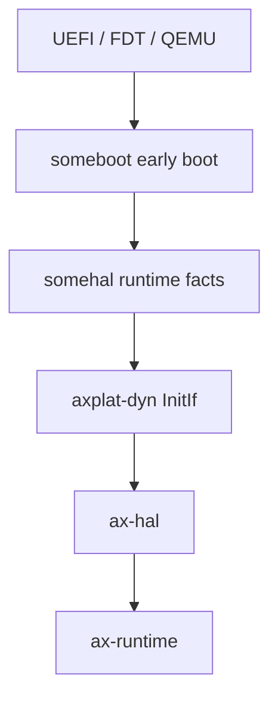

# 动态平台 `axplat-dyn`

`axplat-dyn` 是当前仓库默认维护的平台实现（`platforms/axplat-dyn`）。它不把板级常量写死在 Cargo feature 中，而是通过 `someboot` / `somehal` 在启动时获取平台事实，再把这些事实适配成 `ax-plat` 接口。

## crate 元数据与 feature

`Cargo.toml` 中的 `[package.metadata.axplat]`：

```toml
[package.metadata.axplat]
platform = "dyn"
arch     = "aarch64"
crate    = "axplat_dyn"
dynamic  = true
```

`dynamic = true` 表示它由启动时发现平台事实，而不是静态板级平台包提供固定事实；该标志会被 `axbuild` xtask 识别。

| feature | 默认 | 启用的能力 |
| --- | --- | --- |
| `smp` | ✓ | 多核 boot；转发到 `ax-plat/smp` |
| `irq` | ✓ | IRQ 接口；转发到 `ax-plat/irq` |
| `rtc` | ✗ | LoongArch RTC epoch offset 初始化 |
| `efi` | ✗ | `somehal/efi` → UEFI 启动路径 |
| `fp-simd` | ✗ | `ax-cpu/fp-simd`，aarch64/loongarch64 启用 FP/SIMD |
| `uspace` | ✗ | `somehal/uspace` + 用户态地址空间 |
| `hv` | ✗ | `somehal/hv` + `ax-cpu/arm-el2`，hypervisor 模式 |
| `thead-mae` | ✗ | T-Head 扩展；`somehal/thead-mae` + `ax-cpu/xuantie-c9xx` |

依赖：`anyhow`、`ax-cpu`、`ax-driver`、`ax-errno`、`axklib`（`buddy-slab`）、`ax-plat`、`heapless`、`log`、`ax-memory-addr`、`ax-percpu`（`custom-base`）、`rdrive`、`somehal`、`spin`。

## lib.rs 总览

`platforms/axplat-dyn/src/lib.rs`：

```rust
#![no_std]
extern crate alloc;
extern crate ax_driver as _;
extern crate somehal;

#[macro_use] extern crate ax_plat;
#[macro_use] extern crate log;

mod boot;
mod console;
pub mod drivers;
mod generic_timer;
mod init;
#[cfg(feature = "irq")]
mod irq;
mod mem;
mod platform;
mod power;

pub use boot::{boot_stack_bounds, bootargs};
pub use generic_timer::try_init_epoch_offset;

#[cfg(feature = "irq")]
pub fn enable_timer_irq() { somehal::timer::irq_enable(); }

#[cfg(feature = "irq")]
pub fn ipi_irq() -> ax_plat::irq::IrqId { somehal::irq::ipi_irq() }

#[cfg(all(feature = "irq", target_arch = "riscv64", feature = "hv"))]
pub use irq::register_virtual_irq_injector;
```

注意：`extern crate ax_driver as _` 与 `extern crate somehal` 只是为了把它们拉入依赖图，并不在 `axplat-dyn` 内直接调用。

## 组件分工

| 组件 | 职责 |
| --- | --- |
| `someboot`（`platforms/someboot`） | 固件入口、UEFI/FDT 获取、重定位、早期页表、BSS、boot stack、SMP 启动准备 |
| `somehal`（`platforms/somehal`） | 运行时平台事实：内存图、console、timer、IRQ、power、CPU 拓扑；架构后端实现 `PlatOp` |
| `axplat-dyn` | 将 `somehal` 能力实现为 `ax-plat` 接口；接入 `rdrive` 设备发现；提供链接脚本 |
| `ax-hal` | 对上提供稳定 HAL facade |

`axplat-dyn` 默认假设更早的架构级 bring-up 已由 `someboot` / `somehal` 完成。它主要完成接口适配和运行时后期初始化，不重新实现最早期的 CPU 模式切换、固件退出和页表建立。

## 初始化主线



## boot.rs — 入口与 boot stack

`platforms/axplat-dyn/src/boot.rs` 把 `somehal::entry` 与 `ax_plat::call_main` 桥接：

```rust
#[somehal::entry(Kernel)]
fn main() {
    let cpu_idx = somehal::smp::early_current_cpu_idx();
    install_percpu_layout();
    bind_current_cpu(cpu_idx);
    ax_plat::call_main(cpu_idx, args)
}

#[somehal::secondary_entry]
fn secondary_main() {
    bind_current_cpu(meta.cpu_idx);
    ax_plat::call_secondary_main(meta.cpu_idx)
}
```

`install_percpu_layout()` 把 someboot 的连续 `runtime_base/area_stride/area_count` 一次注册为 `PerCpuLayoutV1`；`bind_current_cpu()` 在 IRQ 尚未开放、CPU 尚未 online 时初始化 header 并安装架构 anchor。ax-runtime 后续只验证 CPU index、generation 和 cookie，不重复绑定。

`struct Kernel` 同时实现 `somehal::KernelOp` 与 `somehal::setup::MmioOp`：后者把 ioremap 委托给 `axklib::mmio::op()`，前者把 `current_cpu_idx` 委托给 `somehal::cpu::current_cpu_idx`。

`boot_stack_bounds(cpu_idx)` 查询 `somehal::smp::cpu_meta(cpu_idx)`，返回 `(stack_top_virt - stack_size, stack_size)`，供 `ax-percpu` 与 stack overflow 检查使用。

`bootargs()` 直接 re-export `somehal::bootargs`。

## platform.rs — 平台名

```rust
// platforms/axplat-dyn/src/platform.rs（简化）
fn platform_name() -> &'static str {
    somehal::platform_name().unwrap_or_else(default_platform_name)
}
```

`default_platform_name()` 按目标架构给出 `"aarch64-plat-dyn"`、`"riscv64-plat-dyn"` 等回退字符串。

## init.rs — 两阶段初始化

`platforms/axplat-dyn/src/init.rs`：

- `init_early`：在 aarch64/loongarch64 且开启 `fp-simd` 时启用 FP/SIMD；调用 `somehal::timer::enable()` 启动系统时钟。
- `init_later`：调用 `somehal::post_paging()`（内部完成 `someboot::post_allocator()` + `driver::rdrive_setup()`）；若启用 `rtc` feature 且目标是 loongarch64，则通过 `try_init_epoch_offset()` 从固件 RTC 读取 epoch。

`init_early_secondary` / `init_later_secondary` 在 `smp` feature 下处理从核镜像逻辑。

## mem.rs — 内存视图构造

`platforms/axplat-dyn/src/mem.rs` 在首次访问时通过 `spin::Once` + `heapless::Vec` 懒构造三张静态表：

| 列表 | 容量 | 来源 |
| --- | --- | --- |
| `FREE_LIST` | 32 | `somehal::mem::memory_map()` 中 `MemoryType::Free` |
| `RESERVED_LIST` | 32 | `MemoryType::Reserved \| KImage \| PerCpuData`，并附加架构相关空洞（x86 低 2 MiB、loongarch 低 256 MiB） |
| `MMIO_LIST` | 16 | `MemoryType::Mmio`，以及 x86 固定区（IOAPIC `0xfec0_0000`、HPET `0xfed0_0000`、LAPIC `0xfee0_0000`） |

`push_non_overlapping` 负责合并/拆分相邻或重叠的 range，确保最终列表单调不重叠。per-CPU remote lookup 不经过 `mem.rs` 或外部函数，而由已安装 layout 直接计算。

`phys_to_virt` / `virt_to_phys` 直接转发到 `somehal::mem`。

## console.rs — 控制台适配

`platforms/axplat-dyn/src/console.rs` 把 `ax_plat::console::ConsoleIf` 转发到 `somehal::console`：

```rust
fn write_bytes(bytes) { somehal::console::_write_bytes(bytes) }
fn read_byte()        { somehal::console::read_byte() }
fn device_id()        { somehal::console::device_id() }
fn claim_runtime_output() { somehal::console::claim_runtime_output() }
```

x86_64 上特别处理：当 IRQ 向量落在 PCI INTx 区间时，通过 `ax_plat::irq::IrqSource::AcpiGsi` 翻译；否则按 legacy IRQ 处理。

## power.rs — 关机与 SMP boot

`platforms/axplat-dyn/src/power.rs`：

```rust
fn cpu_num() -> usize { somehal::smp::cpu_meta_list().count() }
fn system_off() -> !  { somehal::power::shutdown() }
fn system_reset() -> !{ somehal::power::reset() }
fn cpu_boot(cpu_id, stack_top_paddr) { somehal::power::cpu_on(cpu_id, stack_top_paddr) }
```

## generic_timer.rs — TimeIf 实现

`platforms/axplat-dyn/src/generic_timer.rs` 为 `struct GenericTimer` 实现 `ax_plat::time::TimeIf`：

```rust
fn current_ticks()        -> u64  { somehal::timer::ticks() }
fn ticks_to_nanos(t)      -> u64  { (t as u128 * 1_000_000_000 / freq as u128) as u64 }
fn nanos_to_ticks(ns)     -> u64  { (ns as u128 * freq as u128 / 1_000_000_000) as u64 }
fn set_oneshot_timer(ns)          {
    let delta = ns.saturating_sub(current_nanos);
    somehal::timer::set_next_event_in_ticks(nanos_to_ticks(delta))
}
```

`freq` 来自 `somehal::timer::freq()`。LoongArch + `rtc` feature 下还有 `try_init_epoch_offset_from_firmware()`，读取 `somehal::rtc::epoch_time_nanos()`。

## irq.rs — IrqIf 实现

`platforms/axplat-dyn/src/irq.rs` 是平台与中断子系统交互的核心：

```rust
fn handle(vector) {
    let active = somehal::irq::begin_irq(vector.0)?;
    let irq    = active.id();
    // riscv64 + hv：若属于 PLIC domain，尝试虚拟注入
    let outcome = ax_plat::irq::dispatch_irq(irq);
    // loongarch64 + hv：若 dispatch 未处理，回退到 guest 路由
    drop(active); // 触发 EOI/complete
}
```

- `set_enable`、`set_affinity`：在 `ax_plat::irq::IrqAffinity` / `IpiTarget` 与 `somehal::irq` 对应枚举之间转换。
- `resolve_percpu(hwirq)`：aarch64 走 `somehal::irq::aarch64_gic_irq_id_checked`；其它架构用 `CPU_LOCAL_IRQ_DOMAIN` 包装。
- `send_ipi` / `ipi_irq`：转发 `IpiTarget` 到 `somehal::irq::send_ipi`。
- `feature = "hv"` 时（RISC-V）：通过 `AtomicPtr<fn(usize) -> bool>` 暴露 `register_virtual_irq_injector`，让 hypervisor 注入 guest 中断。

### irq/loongarch64_hv.rs — guest IRQ 路由表

`platforms/axplat-dyn/src/irq/loongarch64_hv.rs` 实现 `LoongArchHvIrqIf`，用 256 槽静态表把物理 IRQ ↔ `(vm_id, vcpu_id, guest_vector)` 关联起来：

```rust
static GUEST_IRQ_ROUTES:   [AtomicUsize; 256] = ...;
static GUEST_IRQ_TARGETS:  [AtomicUsize; 256] = ...;
const LOONGARCH_IRQ_TRACE_LIMIT: usize = 80;
```

`register_guest_irq_route` 显式检测冲突；`inject_virtual_irq(physical_irq)` 调用注册过的 injector 把中断送进对应 vCPU。

## drivers/mod.rs — 设备 probe

整个模块只有一个函数 (`platforms/axplat-dyn/src/drivers/mod.rs`)：

```rust
pub fn probe_all_devices() -> Result<(), AxError> {
    if !rdrive::is_initialized() {
        warn!("rdrive is not initialized; skip platform device probe");
        return Ok(());
    }
    rdrive::probe_all(false).map_err(|_| AxError::BadState)
}
```

它假设 `somehal::post_paging()` 已经在 `init_later` 中调用过 `rdrive_setup()`。具体的设备发现机制见 [devices.md](devices.md) 与 [somehal.md](somehal.md)。

## build.rs — 链接脚本生成

`platforms/axplat-dyn/build.rs` 从 `link.ld` 模板生成 `axplat.x`：

- `INCLUDE "link.x"` 引入 somehal/someboot 提供的脚本。
- 把 `{{SMP}}` 占位符替换成 `SMP` 环境变量（默认 16）。
- 定义 `__SMP`、`boot_stack`、`boot_stack_top`，导出 `_percpu_load_start`。
- x86_64 上额外提供 `__PERCPU_TSS` 符号给 trap 汇编使用。

## 约束

- 动态平台名应来自运行时发现结果，而不是旧式平台 feature。
- IRQ source 必须保持 namespace 清晰：CPU trap vector、firmware source、controller-local hardware line 和 guest GSI/vector 不能混用。
- 平台发现设备时应保留 FDT/ACPI/PCI 元数据，交给平台 resolver 解析 IRQ 和资源。
- `axplat-dyn` 的所有硬件事实都来自 `somehal`；要替换底层实现请参考 [somehal.md](somehal.md)。
