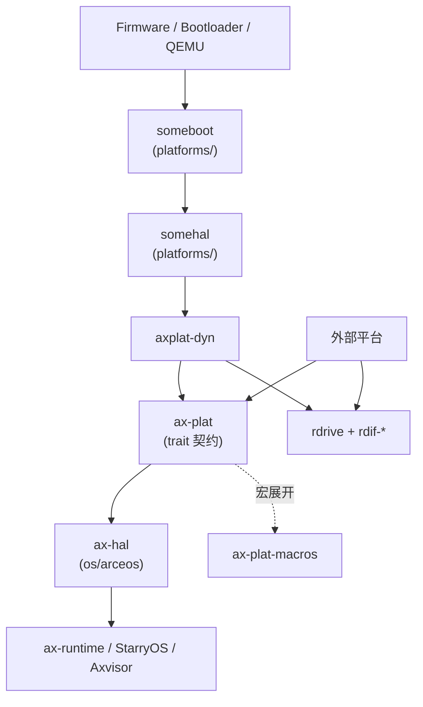

# 平台层概览

TGOSKits 的平台层位于 `platforms/`，负责把具体机器的启动入口、内存布局、时钟、中断、控制台、电源、SMP 和设备发现事实接入 ArceOS、StarryOS 与 Axvisor。平台层不直接实现调度、文件系统、网络或 Linux 兼容语义；它的职责是把硬件和固件事实变成 `ax-plat`、`ax-hal`、`rdrive` 等上层可消费的稳定接口。

## 源码组成

| 路径 | 角色 |
| --- | --- |
| `platforms/ax-plat` | 平台 trait 契约层。定义 `InitIf`、`MemIf`、`TimeIf`、`ConsoleIf`、`PowerIf`、`IrqIf`、`PlatformInfoIf` 等 interface trait，并对上提供 `call_main` / `call_secondary_main` 入口和 `console_print!` / `console_println!` 等便利宏 |
| `platforms/ax-plat-macros` | 过程宏 crate。提供 `#[ax_plat::main]`、`#[ax_plat::secondary_main]` 与内部的 `#[def_plat_interface]`，把 trait 方法展开成单实现槽分发函数 |
| `platforms/axplat-dyn` | 生产用动态平台实现。运行时通过 `somehal` / `someboot` 获取所有平台事实，是 ArceOS、AxVisor、StarryOS 默认链接的平台 crate |
| `platforms/someboot` | UEFI/FDT 早期启动、重定位、早期页表、BSS 清零、boot stack、SMP 启动准备。`somehal` 的依赖 |
| `platforms/somehal` | 多架构运行时 HAL，位于 `someboot` 和 `axplat-dyn` 之间。实现 GICv2/v3 运行时识别、AArch64/RISC-V/LoongArch64/x86_64 中断控制器、ACPI/FDT 设备发现 |
| `platforms/somehal-macros` | `somehal` / `someboot` 的入口宏 crate，提供主 CPU 与 secondary CPU 入口属性宏 |
| `os/arceos/modules/axhal` | `ax-plat` 能力进入 ArceOS 运行时的 HAL 汇聚层 |

## 分层依赖关系

仓库内置平台 crate 通过 `[workspace.dependencies]` 引用，并通过 `ax-crate-interface` 在链接期绑定到唯一的 trait 实现。外部平台需要在自己的 workspace 或 fork 中显式接入依赖和 feature。依赖图如下：



跨 crate 的依赖层次（自上而下）：

- `ax-plat` 仅依赖 `ax-plat-macros`、`ax-crate-interface`、`irq-framework`、`ax-percpu`、`ax-kspin`、`ax-memory-addr`、`rdrive`、`spin`、`bitflags`、`const-str`。
- `axplat-dyn` 依赖 `ax-plat`、`somehal`、`ax-driver`、`axklib`、`ax-cpu`、`rdrive`、`heapless`、`spin`，并按 feature 启用 `somehal/hv`、`somehal/uspace`、`ax-cpu/fp-simd` 等。
- `somehal` 依赖 `someboot`、`somehal-macros`、`mmio-api`、`irq-framework`、`rdif-intc`、`rdrive`，以及按目标架构引入 `aarch64-cpu`、`arm-gic-driver`、`ax-riscv-plic`、`riscv`、`sbi-rt`、`loongArch64`、`x2apic`、`x86` 等。页表错误类型由 `someboot` 的启动契约重导出，不增加第二个页表依赖。

## 能力边界

| 能力 | 所属边界 | 说明 |
| --- | --- | --- |
| 启动入口 | `platforms/ax-plat-macros/src/lib.rs`、平台 crate | 平台 crate 用 `#[ax_plat::main]` 导出 `__axplat_main` 符号；内核通过 `ax_plat::call_main(cpu_id, arg)` 调用 |
| 平台接口 | `platforms/ax-plat/src/lib.rs` | `InitIf`、`MemIf`、`TimeIf`、`ConsoleIf`、`PowerIf`、`IrqIf`、`PlatformInfoIf`，每个都是单实现 `interface trait` |
| HAL 汇聚 | `os/arceos/modules/axhal` | 对上导出内存、时间、IRQ、console、power、paging 等统一 API |
| 动态事实 | `platforms/somehal`、`platforms/someboot` | UEFI/FDT/ACPI/QEMU 运行时初始化结果 |
| 设备发现 | `platforms/somehal/src/driver.rs`、`rdrive`、`ax-driver` | Static、FDT、ACPI、PCI 等 probe 来源 |
| 驱动能力 | `rdif-*`、`rd-*` | 块、网卡、显示、输入、中断控制器等设备能力边界 |

## 注册与发现机制（端到端视图）

整个平台栈通过 6 层联动完成“平台 crate 选择 → trait 实现 → 入口跳转 → 设备发现 → IRQ 路由 → MMIO ioremap”：

1. **编译期 crate 选择** — 平台 crate 的 `Cargo.toml` 中带 `[package.metadata.axplat]` 元数据（`platform`、`arch`、`crate`、`dynamic`），由 `axbuild` xtask 读取以决定把哪个 crate 接入内核构建。例如 `platforms/axplat-dyn/Cargo.toml`：

   ```toml
   [package.metadata.axplat]
   platform = "dyn"
   arch     = "aarch64"
   crate    = "axplat_dyn"
   dynamic  = true
   ```

2. **链接期 trait 实现** — `ax-plat::*If` trait 由 `#[def_plat_interface]` 装饰（在 `platforms/ax-plat/src/lib.rs` 的 `__priv` 模块展开为 `ax_crate_interface::def_interface`），每个 trait 只允许一个全局实现槽。平台 crate 用 `#[impl_plat_interface] impl FooIf for FooImpl` 填充该槽。
3. **入口符号导出** — `#[ax_plat::main]` 校验签名 `fn(cpu_id: usize, arg: usize) -> !` 并通过 `#[unsafe(export_name = "__axplat_main")]` 暴露 Rust ABI 符号；内核侧 `platforms/ax-plat/src/lib.rs` 的 `call_main` 调用之。SMP 路径同理使用 `__axplat_secondary_main`。
4. **运行时设备发现** — `platforms/somehal/src/driver.rs` 的 `rdrive_setup()` 根据 `someboot::fdt_addr()` 或 `someboot::rsdp_addr_phys()` 决定走 FDT 还是 ACPI 路径初始化 `rdrive::Platform`；随后各架构模块用 `rdrive::module_driver!` 声明 driver（如 `arm,armv8-timer`、`ACPIIOAP`）；最终由 `platforms/axplat-dyn/src/drivers/mod.rs` 的 `probe_all_devices()` 调用 `rdrive::probe_all(false)` 枚举硬件。
5. **IRQ domain 注册表** — `platforms/somehal/src/irq.rs` 维护 `IRQ_DOMAINS: Mutex<Vec<IrqDomain>>` 静态表，通过 `alloc_irq_domain` / `register_irq_domain` 把 `(DeviceId, IrqDomainKind)` 映射到 `IrqDomainId`，各架构后端用 `domain_by_kind_fast` O(1) 查询并完成硬件 IRQ 与 `ax_plat::irq::IrqId` 之间的双向转换。
6. **MMIO capability 边界** — `somehal::init(kernel)` 把 `&'static dyn KernelOp` 写入全局，同时调用 `mmio_api::init(op)`，让所有 driver 中的 `mmio_api::ioremap` 请求回流到内核地址空间管理器（`axplat-dyn` 的 `Kernel` 结构体把 ioremap 委托给 `axklib::mmio::op()`）。

## 设计原则

- **单一平台实现**：最终镜像只能链接一个实现 `ax-plat` crate-interface 的平台 crate。`axplat-dyn` 与外部平台同时进入链接会产生重复 `__*If_*` 符号。
- **ISA 与平台分离**：`ax-cpu` 负责架构语义，平台 crate 负责机器事实，`ax-hal` 负责汇聚。
- **动态平台优先**：仓库内置路径默认使用 `axplat-dyn`，平台事实来自启动时发现，而不是旧的 `myplat` / `defplat` feature。
- **外部平台可替换**：外部平台可以实现自己的 `ax-plat` crate，但需要同步 Cargo feature、依赖和 `AX_PLATFORM_CRATE`。
- **设备发现独立于平台选择**：`rdrive::Platform::Static` / FDT / ACPI / PCI 是设备 probe 来源，不是 Cargo 平台选择机制。
- **能力边界**：driver core（`rdrive`、`rdif-*`）不接触 OS runtime；MMIO/DMA/IRQ/scheduling 通过显式 capability（`mmio-api`、`dma-api`、`rdif-intc`、runtime adapter）跨边界。
