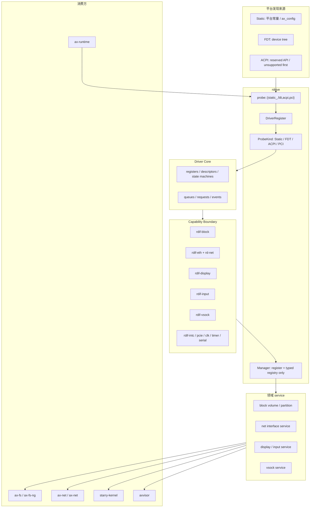
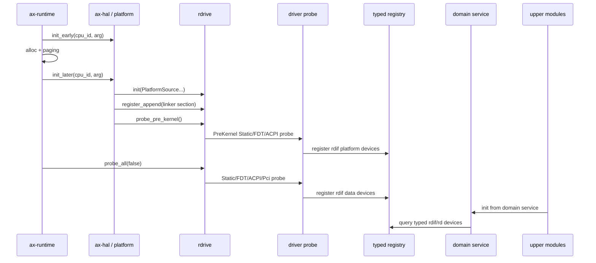
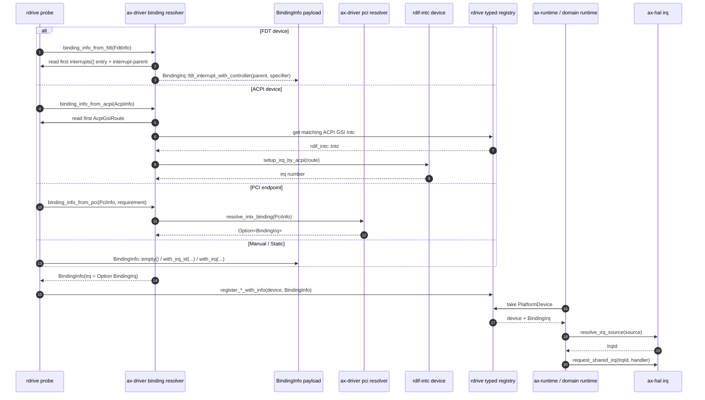

# rdrive + rdif 驱动框架

本文记录 #606 的宿主物理设备重构目标。新的设备路径硬切到 `rdrive + rdif`：`rdrive` 负责发现、probe、注册和查询，`rdif-*` 负责能力接口，必要时由对应领域 crate 提供运行时封装，上层系统按领域能力消费设备。旧驱动接口包组已移除，宿主物理设备初始化与交付主线不再经过 legacy driver crates；块设备路径中原有 runtime 已删除，统一以 `rdif-block` 作为 block capability boundary。

`axdevice` 与 `axdevice_base` 不纳入本轮迁移。它们继续作为 Axvisor / axvm 的 guest emulated device model，不参与宿主物理设备 probe，不作为 FS、NET、display、input、vsock 的设备来源。

## 非目标与硬约束

本轮只处理宿主侧物理设备，包括 ArceOS、StarryOS、Axvisor 在真实平台或 QEMU 平台上使用的块设备、网卡、中断控制器、时钟、显示、输入、vsock、PCIe、USB host 等设备。

架构硬约束如下：

- 不新增长期存在的 `rdrive <-> ax-driver` 双向适配层。
- 不新增 `RDriveDeviceContainer`、`AllRDriveDevices` 这类换名后的 `AllDevices` 大容器。
- 不用一个 `KernelHal`、`PlatformSystem` 或其它大结构体包办 Static、FDT、ACPI、PCI、MMIO、DMA、IRQ、runtime。
- 不把 FDT 当作唯一或默认平台抽象；Static、FDT、ACPI 是并列平台来源。
- 不在 portable driver core 中调用 `iomap`、`ioremap`、`axklib`、`somehal`、任务调度或 IRQ 注册。
- 不用字符串拼接或 ad-hoc 匹配替代 FDT compatible、ACPI HID/CID、PCI vendor/device 的结构化匹配。
- 不在文档或代码中保留“以后补”的占位路径；ACPI 第一版必须返回明确 unsupported error。
- 除测试外，新增或重构后的单个 `.rs` 文件不超过 600 行。

`ax-driver` 现在作为共享驱动聚合 crate 接入 `rdrive + rdif`，不再依赖旧驱动接口包组。迁移目标模块完成后，不应再引入 `AllDevices`、`AxDeviceContainer`、`AxBlockDevice`、`AxNetDevice` 这类旧全局容器模型。

## 总体结构

新的宿主设备路径分为五层：平台发现来源、`rdrive` backend 分发、具体驱动、`rdif` 能力边界、领域 service 与上层消费方。



`rdrive::Manager` 只保存 `DriverRegister` 和类型化设备 registry。Static、FDT、ACPI、PCI 各自拥有独立 `probe::*::{System, Info, FnOnProbe}`，不把平台状态合并成一个大 `System`。

## rdrive Backend 模型

`rdrive` 公共 API 的目标形态是多来源初始化和按 `ProbeKind` 分发：

```rust
pub enum PlatformSource {
    Static,
    Fdt(core::ptr::NonNull<u8>),
    Acpi(AcpiRoot),
}

pub enum ProbeKind {
    Static { on_probe: static_::FnOnProbe },
    Fdt { compatibles: &'static [&'static str], on_probe: fdt::FnOnProbe },
    Acpi { ids: &'static [AcpiId], on_probe: acpi::FnOnProbe },
    Pci { on_probe: pci::FnOnProbe },
}
```

各 backend 的职责如下：

| backend | 独立状态 | 匹配输入 | probe 输入 | 第一版行为 |
| --- | --- | --- | --- | --- |
| `probe::static_` | `System { probed_names }` | `ProbeKind::Static` register name | `PlatformDevice` | 平台 crate 自己注册静态 model driver 并在回调中使用平台常量 |
| `probe::fdt` | `System { fdt, phandle_map, probed }` | compatible + node status | `FdtInfo` + `PlatformDevice` | 保留当前 FDT 能力 |
| `probe::acpi` | `System { root, routing, pci, probed }` | HID/CID + ACPI device，或空 `ids` 的全局 table probe | `AcpiInfo` + `PlatformDevice` | ACPI source 初始化、MCFG/GSI controller routing、PCI `_PRT` 和普通设备 IRQ route |
| `probe::pci` | PCIe controller enumerator | vendor/device/class | endpoint + `PlatformDevice` | 保留当前 PCIe 二阶段 probe |

`probe_pre_kernel()` 只运行 `ProbeLevel::PreKernel`，并通过 backend 分发器执行 Static、FDT、ACPI 中的早期 probe。PCI endpoint 枚举依赖已注册的 PCIe controller，因此仍在普通 probe 阶段触发。

`probe_all(stop_if_fail)` 运行普通设备 probe，再执行 PCI endpoint 枚举。它不能被塞进 early init，也不能变成 FDT 专用流程。

## 初始化时序

初始化顺序固定为：

1. `ax_hal::init_early(cpu_id, arg)` 只记录 boot arg / DTB，初始化 early trap、console、time 等最低层能力，不 probe 宿主设备。
2. allocator 和 paging 初始化完成后，`ax_hal::init_later(cpu_id, arg)` 或平台 post-paging 阶段执行 `rdrive::init(...)`、`rdrive::register_append(...)`、`rdrive::probe_pre_kernel()`。
3. `probe_pre_kernel()` 只初始化后续平台依赖，例如 interrupt controller、clock、timer、systick、pinmux、PCIe root complex。
4. 平台 later init 完成后，`ax-runtime` 调用 `rdrive::probe_all(false)`。
5. FS、NET、display、input、vsock、StarryOS、Axvisor 通过领域 service 或 `rdif-*` 能力接口消费设备。



`ax-runtime` 不再拆 `AllDevices.block/net/display/input/vsock` 后逐个传给模块。它只触发 probe 和领域 service 初始化。

## IRQ 解析与统一注册模型

IRQ 路径使用 domain 化的 `IrqId` 作为运行时注册 key。FDT、ACPI、PCI、manual/static 注册都会先得到一个 `BindingInfo`，再经 `register_*_with_info` 注册到 `rdrive`。`BindingInfo` 可以携带已经解析好的 `IrqId`，也可以携带待平台解析的 firmware source，例如 `AcpiGsiRoute` 或 `FdtInterrupt`；运行时在真正注册 handler 前调用 `ax_hal::irq::resolve_irq_source(...)`，由平台 IRQ resolver 解析并执行 interrupt-controller setup。`rdrive` 只把 ACPI/FDT probe metadata 交给 resolver，不把平台 IRQ route/source 记录混进自己的设备 registry。



这个边界让平台 IRQ namespace 解析留在平台 resolver 侧：

- FDT 设备读取第一个 `interrupts()` 项并连同 `interrupt-parent` 保存为 `BindingIrq::fdt_interrupt_with_controller(...)`；generic driver probe 不调用 `rdif_intc::setup_irq_by_fdt()` 取得裸数字，避免把 GIC/PLIC/PCH 等控制器本地线号混进 legacy IRQ namespace。
- ACPI PCI INTx route 保存为 `BindingIrq::acpi_gsi_route(...)`，保留 trigger、polarity、controller 和 input 等元数据；x86 IOAPIC 等平台 resolver 使用这些信息执行控制器 setup，而不是把 route flatten 成裸 GSI。
- PCI 设备先在枚举阶段计算 INTx swizzle route，再由 `ax-driver::pci::resolve_intx_binding()` 按 ACPI route、FDT `interrupt-map`、已注册 legacy route、`interrupt_line` fallback 的顺序返回 `BindingIrq`。静态或未 domain 化平台仍可返回 legacy IRQ 作为兼容入口。
- 无中断的设备注册为 `None`；PCI required IRQ 最终无结果时返回 probe error，optional IRQ 允许注册为 `None`。
- `ax-runtime`、`ax-hal`、`ax-net-ng`、StarryOS usbfs 等上层以 `IrqId` 注册 handler。需要处理 firmware source 的地方应先经 `resolve_irq_source(...)`，不应自行做 `usize` 算术换算。

网络 IRQ 的 runtime 适配也遵循同一方向。`ax-net-ng` 只暴露网络领域自己的 `EthernetIrqAction`、`EthernetIrqOutcome` 和注册错误类型，不再在公开 registrar trait 中泄漏 `ax-hal::irq::{RawIrqHandler, IrqContext, IrqReturn, IrqError}`。`ax-runtime` 持有 HAL IRQ registration，并把 HAL raw handler trampoline 适配到 `EthernetIrqAction`；因此网络 runtime 只描述“是否需要唤醒 poll 方”，HAL ABI 留在 ArceOS runtime 边界内。

## Capability Boundary

`rdif-*` 是能力边界，只定义某类设备向上暴露什么能力，不负责设备发现、iomap、IRQ 注册、任务调度或系统启动顺序。块设备已移除原 runtime crate，`rdif-block` 直接承载设备 LBA 语义的 submit/poll block capability boundary；其它领域如网络仍可按需保留 runtime wrapper，负责 waker、poll、blocking API、buffer pool 等运行时行为。

| 能力 | interface crate | runtime crate | 上层消费 |
| --- | --- | --- | --- |
| 块设备 | `rdif-block` | 已删除，直接消费 `rdif-block` submit/poll 边界 | block volume service、FS |
| 网络设备 | `rdif-eth` | `rd-net` | net interface service、NET/NET-NG |
| 显示 | `rdif-display` | `rd-display` | display service、Starry fb |
| 输入 | `rdif-input` | `rd-input` | input service、Starry input |
| vsock | `rdif-vsock` | `rd-vsock` | vsock service |
| 平台设备 | `rdif-intc`、`rdif-pcie`、`rdif-clk`、`rdif-timer`、`rdif-systick`、`rdif-serial` | 按需 | HAL、Axvisor backend、平台 glue |

`rdif-block` 的块请求不暴露 Linux block layer 的 512B sector 公共单位，而使用真实设备的 `lba` / `block_count` / `logical_block_size`。OS glue 负责把上层 byte offset、FS block、Linux-like sector 或分区 region 转换成设备 LBA。接口保留 blk-mq 风格的结构能力：设备可报告 `QueueTopology`，OS 可创建一个或多个 queue，每个 queue 使用 queue-local `RequestId`/tag，经 `submit_request()` 提交、经 `poll_request()` 回收完成。

块设备内部的 IRQ 事件仍按 source 和 queue 分离。`Interface::irq_sources()` 返回的是 `rdif-block` 能力边界内的事件 source 列表，每个 `IrqSourceInfo { id, queues }` 描述该硬件事件 source 可能影响的 queue mask；它不是平台 FDT/PCI IRQ source，也不写入 `rdrive` 或 `BindingInfo`。当前 ArceOS `ax-driver` glue 只取 legacy source `0` 的 handler，并把它绑定到 `BindingInfo::irq_num()` 已解析出的数字 IRQ；`ax-runtime` 最终只看到 `(irq, handler)`。

`IrqHandler::handle_irq()` 只确认中断源并返回可 poll 的 queue mask，不做 OS wake、不阻塞、不持有 OS 锁，也不在中断上下文推进慢路径完成。收到事件后，runtime 或 task-side wrapper 再对相应 queue 调用 `poll_request()`。

新增接口按多文件拆分：

- `rdif-display/src/lib.rs` 只 re-export；`types.rs` 定义 `DisplayInfo`、`PixelFormat`、`FrameBuffer<'_>`；`error.rs` 定义 `DisplayError`；`interface.rs` 定义 `Interface` 和 `Event`。
- `rdif-input/src/lib.rs` 只 re-export；`event.rs` 定义 `EventType`、`InputEvent`、`AbsInfo`；`id.rs` 定义 `InputDeviceId`；`error.rs` 定义 `InputError`；`interface.rs` 定义 `Interface` 和 `Event`。
- `rdif-vsock/src/lib.rs` 只 re-export；`addr.rs` 定义 `VsockAddr`、`VsockConnId`；`event.rs` 定义 `VsockEvent`；`error.rs` 定义 `VsockError`；`interface.rs` 定义 `Interface` 和 `Event`。

接口目标形态：

```rust
pub trait DisplayInterface: rdif_base::DriverGeneric {
    fn info(&self) -> DisplayInfo;
    fn framebuffer(&mut self) -> Result<FrameBuffer<'_>, DisplayError>;
    fn need_flush(&self) -> bool;
    fn flush(&mut self) -> Result<(), DisplayError>;
    fn handle_irq(&mut self) -> DisplayEvent;
}
```

```rust
pub trait InputInterface: rdif_base::DriverGeneric {
    fn device_id(&self) -> InputDeviceId;
    fn physical_location(&self) -> &str;
    fn unique_id(&self) -> &str;
    fn get_event_bits(&mut self, ty: EventType, out: &mut [u8]) -> Result<bool, InputError>;
    fn read_event(&mut self) -> Result<InputEvent, InputError>;
    fn get_prop_bits(&mut self, out: &mut [u8]) -> Result<usize, InputError>;
    fn get_abs_info(&mut self, axis: u8) -> Result<AbsInfo, InputError>;
    fn handle_irq(&mut self) -> InputEventState;
}
```

```rust
pub trait VsockInterface: rdif_base::DriverGeneric {
    fn guest_cid(&self) -> u64;
    fn listen(&mut self, port: u32) -> Result<(), VsockError>;
    fn connect(&mut self, id: VsockConnId) -> Result<(), VsockError>;
    fn send(&mut self, id: VsockConnId, buf: &[u8]) -> Result<usize, VsockError>;
    fn recv(&mut self, id: VsockConnId, buf: &mut [u8]) -> Result<usize, VsockError>;
    fn recv_avail(&mut self, id: VsockConnId) -> Result<usize, VsockError>;
    fn disconnect(&mut self, id: VsockConnId) -> Result<(), VsockError>;
    fn abort(&mut self, id: VsockConnId) -> Result<(), VsockError>;
    fn poll_event(&mut self) -> Result<Option<VsockEvent>, VsockError>;
    fn handle_irq(&mut self) -> VsockIrqEvent;
}
```

IRQ 路径只返回稳定事件和唤醒等待方；不能在 IRQ handler 中执行阻塞 I/O、长流程状态推进或广域锁持有。

## Driver Core / OS Glue / Runtime

驱动按四层拆分：

| 层 | 位置 | 允许依赖 | 不允许 |
| --- | --- | --- | --- |
| Driver Core | `drivers/<type>/<device>` | `no_std`、寄存器/队列/描述符、`mmio-api`、`dma-api` 小边界 | `ax-driver`、`ax-hal`、`axplat-dyn`、`rdrive::PlatformDevice` |
| Capability Boundary | `drivers/interface/rdif-*` | `rdif-base`、小型错误和事件类型 | 平台、runtime、任务调度 |
| OS Glue | `drivers/ax-driver` 或平台 crate | `rdrive::module_driver!`、FDT/PCI/Static probe、iomap、IRQ setup、DMA op | 上层 FS/NET 策略 |
| Runtime | `drivers/*/rd-*`，块设备除外 | `rdif-*`、waker、poll/blocking wrapper、buffer pool | probe、设备树、ACPI、平台选择 |

Driver Core 只推进硬件状态机。OS Glue 将硬件实例包装成 `rdif-*::Interface` 后通过 `PlatformDevice::register(...)` 注册。除块设备外，Runtime wrapper 从 `rdif-*::Interface` 构建领域运行时对象，供服务层和上层模块使用；块设备服务直接基于 `rdif-block` 的 submit/poll 能力边界组织 volume 和文件系统入口。

## 领域 Service 与上层消费

上层业务模块不直接处理 `AllDevices`，也不直接把 `rdrive` 当作全局设备篮子。每个领域有自己的 service，service 可以从 `rdrive` 查询 typed device 并整理成上层需要的能力集合。

| 领域 | 新 service 职责 | 上层边界 |
| --- | --- | --- |
| block | 枚举 disk，扫描 partition，生成 `BlockVolume`，根据 bootargs 选择 root candidate | FS 只拿 volume / FS block trait |
| net | 枚举 `rd-net`，建立 interface，处理 DHCP/static IP policy | NET/NET-NG 只拿 net interface |
| display | 枚举 `rdif-display` / `rd-display`，选择 primary display | display 模块和 Starry fb 只拿 display handle |
| input | 枚举 `rdif-input` / `rd-input`，建立 event stream | input 模块和 Starry input 只拿 event source |
| vsock | 枚举 `rdif-vsock` / `rd-vsock`，维护 connection/event API | vsock socket 层只拿 vsock device |

直接使用 `rdrive::get_*` 只允许出现在设备管理型或低层 HAL 型代码中，例如 Starry USBFS host 管理和 Axvisor AArch64 GIC backend。普通 FS、NET、display、input、vsock 上层模块不得裸查 `rdrive`。

## Block Volume 与分区扫描

分区扫描抽成唯一实现，位于独立 block volume 层，而不是 FS 层或旧块驱动接口路径。

目标数据模型：

```rust
pub struct BlockVolume {
    pub disk_id: DiskId,
    pub partition_id: Option<PartitionId>,
    pub region: BlockRegion,
    pub table_kind: PartitionTableKind,
    pub partuuid: Option<PartUuid>,
    pub partlabel: Option<PartLabel>,
}
```

block volume 层负责：

- 从 `rdif-block` 枚举 physical disk。
- 支持 GPT、MBR、raw disk。
- 产出稳定 volume metadata。
- 提供裁剪到 `BlockRegion` 的 block reader。

FS 负责：

- 根据 `root=/dev/sdXn`、`root=/dev/mmcblkXpY`、`PARTUUID=`、`PARTLABEL=` 选择 root volume。
- 检测 ext4、FAT 等 filesystem magic。
- 挂载选定 volume。

FS 不再 import `ax_driver::{AxBlockDevice, AxDeviceContainer, PartitionInfo, PartitionRegion, PartitionTableKind}`，也不调用 `ax_driver::scan_partitions`。

## Feature 映射

Feature 的职责从“选择 `ax-driver` 子模块和单个 Ax*Device 类型”调整为“选择要链接的 rdrive probe module、driver core、rdif 能力和 runtime wrapper”。

| 旧 feature 语义 | 新 feature 语义 |
| --- | --- |
| `ax-driver` | 启用宿主设备 probe 主线，即 `rdrive` |
| `virtio-blk` / `virtio-net` | 链接 VirtIO probe 和对应 `rdif-block` / `rdif-eth` 注册 |
| `virtio-gpu` | 链接 `rdif-display` / `rd-display` probe |
| `virtio-input` | 链接 `rdif-input` / `rd-input` probe |
| `virtio-socket` | 链接 `rdif-vsock` / `rd-vsock` probe |
| `driver-*` | 链接具体硬件 driver core 和 OS glue probe |
| `bus-*` | 链接总线枚举或控制器 probe，例如 PCIe |
| `plat-dyn` | 选择 FDT 动态平台来源，不走 `ax_driver_*Ops` 回灌 |

MMIO 与 PCI feature 要分开表达，例如 `virtio-gpu-mmio` 与 `virtio-gpu-pci` 都是 probe module，而不是上层设备类型选择。

## 文件拆分规则

新增 crate 默认遵循以下布局：

```text
src/
  lib.rs          # re-export only
  error.rs       # error type and conversions
  types.rs       # public data types
  interface.rs   # trait and event contract
  device.rs      # runtime device wrapper, if this is rd-* crate
  irq.rs         # irq event handling, if needed
  queue.rs       # queue/request/event stream, if needed
```

已有大文件在迁移触及时必须拆分：

| 文件 | 当前问题 | 拆分方向 |
| --- | --- | --- |
| `platforms/axplat-dyn/src/drivers/pci/rk3588.rs` | 单文件超过 600 行 | RC init、ATU/window、MSI/IRQ、config space、FDT glue |
| `drivers/ax-driver/src/block/rockchip/sd/mod.rs` | 单文件超过 600 行 | probe/FDT、clock/tuning、card init、rdif-block adapter |
| `platforms/axplat-dyn/src/drivers/blk/mod.rs` | 容器、adapter、IRQ、FDT decode 混杂 | registry、adapter、irq、probe |
| `platforms/axplat-dyn/src/drivers/mod.rs` | 设备收集、iomap、DMA 混杂 | device collection、iomap、dma |

`lib.rs` 只做模块声明和 re-export，不承载核心实现。

## 分阶段硬切实施

Phase 1: `rdrive` backend 分发

- 增加 `PlatformSource::{Static,Fdt,Acpi}` 和 `ProbeKind::{Static,Fdt,Acpi,Pci}`。
- 新增 `probe::static_` 与 `probe::acpi` 模块；ACPI 初始化提供 MCFG、GSI controller routing、PCI `_PRT` 和普通设备 IRQ metadata。
- `probe_pre_kernel()` 和 `probe_all()` 改为 backend 分发，保留当前 FDT 与 PCI 能力。
- `Manager` 保持只管理 register 和 typed device registry。

Phase 2: 补齐 `rdif-display/input/vsock`

- 新增三个 interface crate 并接入 workspace。
- 每个 crate 按 `error/types/interface` 或 `addr/event/interface` 拆文件。
- 不依赖 `ax-driver`、`ax-runtime`、`ax-hal` 或平台 crate。

Phase 3: block volume service

- 抽出唯一分区扫描实现，支持 GPT、MBR、raw disk。
- 产出 `BlockVolume` 和裁剪后的 block reader。
- `ax-fs` / `ax-fs-ng` 只消费 volume 和 FS block trait。

Phase 4: NET / NET-NG 硬切

- `ax-net` / `ax-net` 从 `AxNetDevice` 切到 `rd-net` 或 net service。
- DHCP/static IP policy 留在 net service 或 NET/NET-NG，不回到 platform glue。

Phase 5: display / input / vsock 硬切

- 新增 runtime wrapper `rd-display`、`rd-input`、`rd-vsock`。
- 上层 display/input/vsock 模块消费领域 service，不接收 `AxDeviceContainer`。

Phase 6: `ax-runtime` 切主线

- 删除宿主初始化主线中的 `ax-driver::init_drivers()` 和 `AllDevices` 拆包。
- 平台 later init 后调用 `rdrive::probe_all(false)`。
- 调用领域 service 初始化 FS、NET、display、input、vsock。

Phase 7: feature 映射切换

- `ax-feat` 中旧 `ax-driver/virtio-*`、`driver-*`、`bus-*` 映射到 rdrive probe feature。
- legacy `ax-driver` feature 只保留给未迁移代码，不作为新宿主路径入口。

## 验收标准

文档验收：

```bash
git diff --check
cd docs
yarn build
```

本地 `docs` 未安装依赖时，先执行 `corepack enable` 与 `yarn install --frozen-lockfile`，再运行 `yarn build`。

代码验收：

```bash
cargo xtask clippy --package rdrive
cargo xtask clippy --package ax-runtime
cargo xtask clippy --package ax-fs-ng
cargo xtask clippy --package ax-net
cargo xtask clippy --package starry-kernel
cargo xtask clippy --package axvisor
```

搜索验收：

```bash
rg "AllDevices|AxDeviceContainer|AxBlockDevice|AxNetDevice|ax_driver::scan_partitions" os/arceos/modules os/StarryOS/kernel os/axvisor
rg "rdrive::get_|rdrive::get_one|rdrive::get_list" os/arceos/modules os/StarryOS/kernel os/axvisor
```

第二条搜索只允许 Starry USBFS 设备管理路径和 Axvisor HAL/GIC backend 出现裸 `rdrive::get_*`。

系统回归重点：

- StarryOS QEMU smoke。
- ext4 rootfs 启动与读写。
- `net` / DHCP。
- aarch64 QEMU 动态平台配置。
- Axvisor QEMU / GIC / `rdif-intc` 路径。
