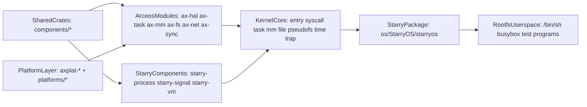
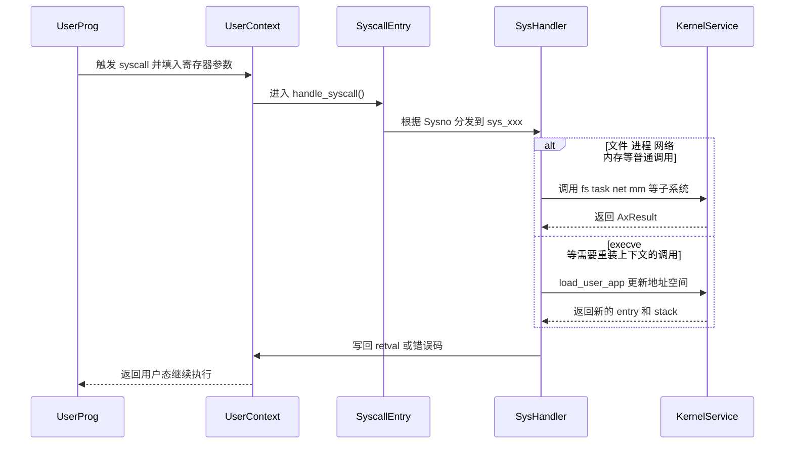
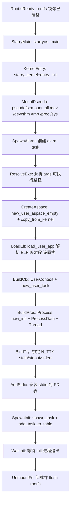
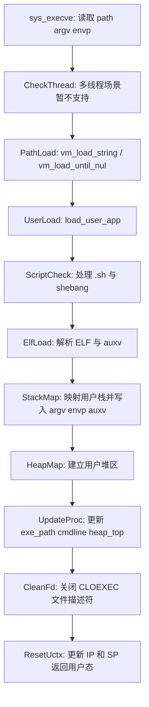

# StarryOS 架构

StarryOS 是建立在 ArceOS 基础能力之上的组件化宏内核系统，继承了 ArceOS 的模块化、跨平台和 Rust 安全性，同时引入了更接近 Linux 的进程、线程、syscall、文件系统和 rootfs 语义。它介于"ArceOS 单内核应用运行时"与"完整 Linux 宏内核"之间。

本文聚焦 StarryOS 的内部结构、syscall 分发机制和执行路径。若尚未运行过 StarryOS，建议先阅读 [StarryOS 快速上手](/docs/quickstart/starryos)。

## 系统定位

StarryOS 并非从零构建一个全新的内核，而是在 ArceOS 的模块化基础设施之上，补齐 Linux 兼容所需的进程管理、syscall 分发、信号、伪文件系统等宏内核语义。这种设计让 StarryOS 能够复用底层能力，同时将精力集中在 Linux 用户态程序的兼容性上。

| 目标 | 含义 | 典型落点 |
| --- | --- | --- |
| Linux 兼容语义 | 提供更接近 Linux 的用户态程序运行环境 | `kernel/src/syscall/*`、`kernel/src/task/*`、`kernel/src/file/*` |
| 复用 ArceOS 基础能力 | 不重复实现 HAL、调度、部分文件与网络基础设施 | `os/arceos/modules/*` |
| 组件化宏内核 | 在一个内核映像中组织多种子系统，但继续按组件边界拆分职责 | `components/starry-*`、`kernel/*` |
| 用户态验证闭环 | 通过 rootfs 和 init shell 验证系统行为 | `os/StarryOS/starryos`、rootfs 镜像、`test-suit/starryos` |

## 架构概览

StarryOS 的核心特征在于多个层次共同组成最终可运行的系统，而非仅有一个 `kernel/` 目录。从底向上依次是平台层、ArceOS 模块层、Starry 专用组件层、内核核心层、启动包层和 rootfs 用户态。每一层各有独立的目录和职责边界。



理解此图需注意：

- `rootfsUsers` 是 StarryOS 验证 Linux 兼容行为的核心载体。
- `kernelCore` 并非从零实现全部底层能力，而是将 ArceOS 模块和 Starry 专用组件拼接成宏内核语义。
- 修改 `arceosModules` 时，不仅 ArceOS 受影响，StarryOS 也会被波及。

## 分层职责

与 ArceOS 的"单内核单层次"不同，StarryOS 的分层从用户态的 rootfs 一直延伸到平台层。中间的内核核心层和 Starry 专用组件层共同实现了宏内核语义，而 ArceOS 模块层则提供了硬件抽象和基础 OS 能力。

| 层次 | 目录 | 职责 |
| --- | --- | --- |
| 用户态层 | rootfs 中的 shell、busybox、测试程序 | 触发 syscall、文件系统、进程管理等行为 |
| 启动包层 | `os/StarryOS/starryos` | 构造命令行与环境变量，进入内核入口 |
| 内核核心层 | `os/StarryOS/kernel` | `entry`、`syscall`、`task`、`mm`、`file`、`pseudofs`、`time`、`trap` |
| Starry 专用组件层 | `components/starry-*` | 进程、信号、虚拟内存等抽象 |
| ArceOS 基础模块层 | `os/arceos/modules/*` | HAL、任务调度、同步、基础 I/O、文件与网络能力 |
| 平台层 | `platforms/*`、`axplat-*` | 架构与板级支持 |

## 内核子系统

StarryOS 内核按职责划分为 10 个子系统，覆盖从启动入口到 syscall 分发、内存管理、文件系统和伪文件系统等完整宏内核功能。每个子系统对应 `kernel/src/` 下的一个目录或文件。

| 子系统 | 目录 | 职责 | 典型关联 |
| --- | --- | --- | --- |
| 启动入口 | `kernel/src/entry.rs` | 挂载伪文件系统、创建 init 进程与线程、绑定 TTY、安装 stdio、等待系统退出 | `mm`、`task`、`pseudofs`、`file` |
| crate 根 | `kernel/src/lib.rs` | 定义 kernel crate 的公共模块导出与依赖声明 | 全局 |
| syscall | `kernel/src/syscall/*` | 按 Linux syscall 语义分发系统调用（12 个功能域） | `task`、`mm`、`file`、`ipc`、`net` |
| task | `kernel/src/task/*` | 进程/线程创建与回收（clone、fork、execve、exit、wait4）、futex、资源限制、信号 | `starry-process`、`starry-signal`、`ax-task` |
| mm | `kernel/src/mm/*` | 地址空间管理、ELF 装载、brk/mmap/mprotect、COW 后端 | `starry-vm`、`ax-mm` |
| file | `kernel/src/file/*` | FD 表、文件/目录/管道/epoll/eventfd/signalfd/pidfd 操作 | `ax-fs`、`pseudofs` |
| pseudofs | `kernel/src/pseudofs/*` | `/dev`、`/proc`、`/tmp`、`/dev/shm`、`/sys` 等伪文件系统 | `file` |
| time | `kernel/src/time.rs` | 时间格式转换与时钟相关 syscall 支持 | `ax-task`、`ax-hal` |
| trap | `kernel/src/trap.rs` | 异常/陷入处理，从用户态进入内核态的入口分发 | `syscall`、`task` |
| config | `kernel/src/config` | 内核构建配置与常量 | 全局 |

## Starry 专用组件

StarryOS 的 Linux 兼容语义中，有一部分抽象足够通用，被提取为 `components/` 下的独立组件。这些组件介于 ArceOS 基础模块和 StarryOS 内核实现之间，避免将所有逻辑集中到 `kernel/` 目录，便于后续替换、扩展或复用。

- **starry-process** — 进程抽象（`Process` 结构体），管理 PID 分配、进程组、会话、退出事件等。
- **starry-signal** — 信号处理框架，提供 `ProcessSignalManager` 和 `ThreadSignalManager`。
- **starry-vm** — 虚拟地址空间抽象（`AddrSpace`），基于 `ax-page-table-multiarch` 提供跨架构页表管理。

## 进程与线程模型

StarryOS 在 `task` 子系统中把"进程共享状态"和"线程私有状态"明确分离。`ProcessData` 存放进程级资源（地址空间、FD 表、信号处理器），`Thread` 存放线程私有上下文。这种分离使得 `clone()` 可以通过 flags 精确控制哪些资源共享、哪些复制。

| 对象 | 主要内容 | 语义 |
| --- | --- | --- |
| `ProcessData` | `proc`、`exe_path`、`cmdline`、`aspace`、`scope`、`rlim`、`signal`、`futex_table`、`umask` | 进程级共享状态 |
| `Thread` | `proc_data`、线程级 signal、time、`clear_child_tid`、`robust_list_head`、退出标志 | 线程级运行状态 |

这种分离使得：

- `clone()` 可根据 flags 决定共享进程级资源或复制新的进程上下文。支持 `CLONE_VM`（共享地址空间）、`CLONE_THREAD`（同线程组）、`CLONE_VFORK`（挂起父进程直到 execve/exit）等标志位组合。
- `execve()` 可在保持进程身份的前提下重装用户地址空间与程序映像。
- `fork()` 等价于带默认 flags 的 `clone()`，使用 COW 后端复制地址空间。

## syscall 分发

`kernel/src/syscall/mod.rs` 中的 `handle_syscall()` 是 StarryOS 的核心控制中枢。它从 `UserContext` 读取 syscall 编号，按功能域分发到对应子系统处理，再将返回值写回用户态。Linux 兼容行为明确定义在这一分发层及各子模块实现中。

`syscall/` 目录按功能域组织为 12 个模块（含入口 `mod.rs`）：

| 目录/文件 | 覆盖的 syscall 类别 |
| --- | --- |
| `mod.rs` | `handle_syscall()` 分发入口，Sysno 到子模块的路由 |
| `fs/` | `open`、`read`、`write`、`close`、`lseek`、`stat`、`mkdir`、`getdents64`、`chdir`、`symlink` |
| `io_mpx/` | `poll`、`select`、`epoll_create1`、`epoll_ctl`、`epoll_pwait` |
| `ipc/` | `msgget`、`msgsnd`、`msgrcv`、`shmget`、`shmat`、`shmdt` |
| `mm/` | `brk`、`mmap`、`munmap`、`mprotect`、`mremap` |
| `net/` | `socket`、`bind`、`listen`、`accept`、`connect`、`send`、`recv` |
| `signal.rs` | `rt_sigaction`、`rt_sigprocmask`、`kill`、`futex`、`sigaltstack` |
| `sync/` | futex 相关同步操作 |
| `task/` | `clone`、`clone3`、`fork`、`execve`、`exit`、`wait4` |
| `time.rs` | `clock_gettime`、`nanosleep`、`gettimeofday` |
| `resources.rs` | `getrlimit`、`setrlimit` 等资源限制 |
| `sys.rs` | `uname`、`getpid`、`getppid` 等系统信息 |

分发流程：



## 启动流程

StarryOS 的启动分为两个阶段：启动包（`starryos`）仅负责准备命令行参数和环境变量，随后将控制权交给内核入口（`starry_kernel::entry::init`）。真正的宏内核初始化——挂载伪文件系统、创建 init 进程、加载 ELF、绑定 TTY——全部发生在 `kernel/src/entry.rs` 中。

`os/StarryOS/starryos/src/main.rs` 的职责很轻——它把命令行与环境准备好后，就把控制权交给 `starry_kernel::entry::init()`：

```rust
pub const CMDLINE: &[&str] = &["/bin/sh", "-c", include_str!("init.sh")];

#[unsafe(no_mangle)]
fn main() {
    let args = CMDLINE.iter().copied().map(str::to_owned).collect::<Vec<_>>();
    let envs = [];
    starry_kernel::entry::init(&args, &envs);
}
```

真正的宏内核初始化发生在 `kernel/src/entry.rs` 中：



### execve 与 ELF 装载

`execve()` 是 StarryOS 最能体现宏内核语义的场景之一，需同时重写地址空间、用户栈、命令行和线程上下文。



## 支持架构

StarryOS 当前支持四种目标架构。稳定验证内核语义时，建议优先使用 `riscv64`，该路径在文档和测试套件中覆盖最为全面。

| 架构 | 状态 |
|------|------|
| `riscv64` | 可用（稳定验证推荐） |
| `loongarch64` | 可用 |
| `aarch64` | 可用 |
| `x86_64` | 可用 |
