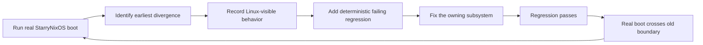

# StarryNixOS Stage-2 设计

StarryNixOS 是一个显式选择、仅支持 x86_64 的 StarryOS 应用。它让 StarryOS
内核启动由锁定 NixOS 声明生成的用户态闭包，并通过 NixOS stage 2 启动
systemd。这个边界用于验证真实发行版工作负载，但不代表 StarryOS 已完整兼容
NixOS。

本文记录需要长期维护的架构决策和接口契约。构建命令、当前兼容性例外和逐次运行
证据分别记录在 `apps/starry/nixos/README.md` 与
`apps/starry/nixos/compatibility.md`。

## 目标与非目标

该设计需要同时满足以下目标：

- 从锁定的 NixOS 声明生成可识别、可校验的 x86_64 ext4 系统镜像；
- 让生成的 NixOS stage-2 初始化程序成为 PID 1，并由它启动 systemd；
- 证明运行中的系统来自该声明，而不是 Alpine 覆盖层或临时启动脚本；
- 让现有 StarryOS 应用继续使用原有 rootfs 准备方式和 shell PID-1 路径；
- 把不兼容行为定位为可复现的最小 Linux 语义差异，避免用宽泛屏蔽制造假阳性。

初始边界不包括 NixOS 内核、initrd、bootloader、安装器、guest 内构建、generation
切换或回滚、桌面环境、完整设备管理和服务栈，也不包括 aarch64。新增这些能力前
必须独立设计和验证。

## 总体架构


设计跨越三个边界：

| 边界 | 实现位置 | 责任 |
| --- | --- | --- |
| 系统声明与制品 | `apps/starry/nixos/` | 锁定输入、生成闭包、构造和校验镜像、记录 provenance |
| rootfs 编排 | `scripts/axbuild/src/starry/app/` | 选择 `AppOwned` 模式，调用应用 builder，拒绝缺失或不匹配的制品 |
| guest 启动 | `os/StarryOS/starryos/` | 仅在 `nixos` feature 下选择生成的 stage-2 init；其它应用保持原行为 |

## 为什么使用 app-owned rootfs

共享 rootfs 流程面向 Alpine：它可以复制默认镜像、改写 APK 配置并注入覆盖层。
这些行为无法证明 NixOS provenance，也可能在 NixOS 构建失败时意外启动 Alpine。
因此 StarryNixOS 使用显式 `AppOwned` 准备模式，而不是根据文件名或是否存在
`prebuild.sh` 推断行为。

### 配置与 builder 契约

`AppOwned` 配置必须提供目标相关的 managed image 路径、应用本地 builder 和目标
架构。初始实现只接受 x86_64。builder 必须：

1. 从 `apps/starry/nixos/flake.lock` 标识的输入构造 x86_64 系统闭包；
2. 在发布前校验闭包架构、系统身份和 ext4 镜像；
3. 先写相邻临时文件，全部校验通过后再原子发布镜像和 manifest；
4. 对输入不可用、构建失败、架构不匹配或镜像无效返回非零状态和明确诊断。

Axbuild 消费该制品前必须再次确认目标、manifest 和文件存在。任何失败都是终止性
准备错误；不得复制默认 rootfs、修改 APK 区域、注入 Alpine overlay 或回退到其它
镜像。

### 制品状态

```text
Absent -> Building -> Validated -> Published -> Selected for QEMU
                     |
                     +-> Failed
```

只有 `Validated` 制品可以进入 `Published`。失败不得替换上一次有效镜像；下一次
成功发布可以原子替代旧版本。

manifest 将运行制品绑定到 flake-lock 哈希、NixOS toplevel store path、systemd
版本、目标架构和镜像哈希。复用已发布镜像仍需重新检查这些字段和 ext4 完整性，
不能只检查文件是否存在。

## PID-1 与启动隔离

StarryNixOS 不直接执行 `/sbin/init` 或 systemd，也不修改生成的 NixOS 脚本。
应用的 build 配置启用 opt-in `nixos` feature，使 `starryos` 启动包把生成的 NixOS
toplevel init 作为 PID 1。该程序完成 NixOS activation 后再启动 systemd。

这种选择保留了声明式系统的 stage-2 语义，同时将影响限制在一个应用。未启用
`nixos` feature 的 StarryOS 应用继续执行原有 shell 命令，rootfs 默认值也不变。

直接执行 systemd 会跳过 activation 和 active-system 建立；从交互 shell 启动
systemd 又无法使其成为 PID 1，因此两者都不能满足设计目标。

## 启动证据契约

一次通过的 QEMU 运行必须按顺序输出：

```text
STARRY_NIXOS_PHASE=pid1
STARRY_NIXOS_PHASE=activation
STARRY_NIXOS_PHASE=systemd
STARRY_NIXOS_PHASE=marker
STARRY_NIXOS_SYSTEM_PASSED
```

各阶段含义如下：

| 阶段 | 必须已验证的事实 |
| --- | --- |
| `pid1` | PID 1 是生成的 NixOS init/systemd 路径，而不是 Starry shell init |
| `activation` | active-system 指向预期 toplevel，声明的身份、账户、包和服务数据可见 |
| `systemd` | systemd 已到达配置的 multi-user target |
| `marker` | NixOS 声明的 marker service 在上述阶段之后运行 |

`STARRY_NIXOS_SYSTEM_PASSED` 是唯一成功标记。缺少阶段、顺序错误、shell prompt、
失败 unit、panic/fatal 输出、超时，或成功标记后 guest 未按约定关机，都必须判为
失败。每次运行只能产生一个终态：通过、按阶段分类的启动失败、制品准备失败或
超时。

## 兼容性演进规则

systemd 是用来发现真实兼容性缺口的工作负载，而不是要求一次性实现完整 Linux
环境。每次失败按以下闭环处理：



- 只处理当前 x86_64 启动中最早、可复现的差异；后续 systemd 报错可能只是连锁
  结果。
- Linux 可见语义和必然失败的 focused regression 必须先于内核修复。
- 修复应落在拥有该语义的 syscall、VFS、procfs、mount、task、socket 或其它子系统，
  不能在 StarryNixOS 应用中伪造结果。
- focused regression 变绿后，真实启动还必须越过原失败边界，才算独立验证完成。
- 不能返回虚假的 cgroup controller、猜测的设备或其它未实现能力。
- 若首个差异仅来自上游 systemd unit 的 sandbox 要求，初始 baseline 可以对该 unit
  的精确 directive 添加局部 override；必须记录原值、失败症状、override 和恢复
  条件，且不得全局关闭 sandbox。

具体 finding、例外和复测条件统一维护在
`apps/starry/nixos/compatibility.md`，避免设计文档退化为随每次运行增长的日志。

## 关键取舍

| 决策 | 采用方案 | 未采用方案及原因 |
| --- | --- | --- |
| 首个架构 | 原生 x86_64 host 与 x86_64 StarryOS guest | aarch64 需要额外 builder；双架构会在稳定 baseline 前扩大变量 |
| 系统来源 | host 侧生成并锁定 NixOS closure 和 ext4 镜像 | guest 内构建扩大到 Nix daemon、网络和 generation 管理；预发布镜像弱化 provenance |
| rootfs 所有权 | 显式 `AppOwned` 模式 | 复用 Alpine prebuild 或修改全局默认 rootfs 都会污染其它应用 |
| PID 1 | 生成的 NixOS stage-2 init，通过 app-only feature 选择 | 直接 systemd 跳过 activation；shell 启动无法建立 PID-1 语义 |
| 兼容策略 | 真实启动驱动的 first-divergence 红绿回归 | 预先复制历史补丁、宽泛 mask 或伪造能力都会隐藏当前问题 |
| 成功判断 | PID 1、provenance、activation、target、marker 的复合证据 | 单日志字符串、shell prompt 或 QEMU exit code 都可能产生假阳性 |

## 验证与回滚

设计级验证分为三层：builder self-test 和 manifest 检查保证制品边界，Axbuild 单元
测试保证 rootfs 模式与失败语义，focused Starry QEMU 用例保证每项 Linux 兼容
修复。最终必须通过完整 x86_64 app QEMU 验收；运行方法见应用 README。

回滚时禁用或删除 StarryNixOS app 配置及其生成的 managed image 即可。由于 feature
和 rootfs 模式都是 opt-in，回滚不修改共享 Alpine 镜像，也不改变其它 StarryOS
应用的 PID-1 路径。
