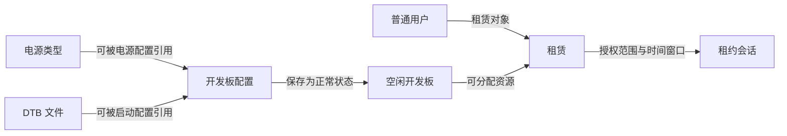

# 管理员端使用

管理员通过管理后台维护普通用户、开发板资源和租赁关系，也可以处理会话异常与站点运维。后台入口是 [管理员登录页](https://ostool.muxai.net:14321/admin/login)。普通用户账号不能代替管理员账号登录，管理员账号也不能代替普通用户完成 `ostool` 的浏览器授权。

## 1. 登录与仪表盘

后台路由由前端 `router/index.js` 中的 `/admin` 子路由组织，并带有 `requiresAuth` 和 `requiresAdmin` 标记。未登录访问后台页面时，路由守卫会转到管理员登录页。

### 1.1 登录后台

在管理员登录页填写管理员账号、密码和验证码，再点击“立即登录”。验证码通过后提交按钮才会启用；提交时，页面还会检查管理员账号和密码是否已填写。登录成功后，页面进入仪表盘。

不要在截图、工单或聊天记录中发送密码和验证码。如果登录后又回到登录页，可以刷新页面后重新登录，并确认使用的是管理员入口而不是普通用户登录页。

### 1.2 查看仪表盘

仪表盘显示资源、租赁和用户的汇总状态。开发板卡片区分可用、租赁中和禁用数量，租赁卡片区分进行中和已释放数量，用户卡片区分正常和禁用数量。点击统计卡会进入对应列表。

页面下方还会显示开发板型号分布、最近租赁和最近注册用户。统计卡只提供汇总信息；删除、释放或修改资源时，仍应进入对应列表核对具体对象。

## 2. 账号与权限

普通用户、角色和管理员是三类不同的管理对象。用户列表维护使用开发板的普通用户，角色页面维护权限组合，管理员列表维护能够登录后台的管理员账号。

### 2.1 管理普通用户

“用户列表”可以按用户名或邮箱搜索，并按正常、已禁用状态筛选。管理员可以新建用户，编辑邮箱和状态，重置密码，启用、禁用或删除用户；编辑现有用户时，用户名不可修改。

新建用户时填写用户名、邮箱和初始密码。重置密码后应通过安全渠道通知本人，不要在公共记录中保留明文密码。禁用会阻止账号继续正常使用；删除前应先确认该用户是否仍有租赁或需要保留的业务记录。

### 2.2 配置角色权限

“角色与权限”页面按开发板、DTB、用户、租赁、会话、公告、审计日志、系统设置和 TFTP 等模块显示权限。新建角色后，在右侧权限矩阵勾选所需权限并保存。

页面支持新建角色、修改角色名称和描述、勾选权限，以及删除非 `admin` 角色。系统页面不提供 `admin` 角色的删除按钮。

### 2.3 管理后台账号

“管理员列表”支持搜索、新建、编辑和删除。新建管理员必须填写不重复的用户名和密码，系统会把账号群组设为 `admin`；编辑时用户名不可修改，新密码留空则保留原密码。

任何删除或账号调整都必须至少保留一个已知密码、可以正常登录的管理员。准备替换最后一个可用管理员时，先创建并实际登录验证新账号，再处理旧账号，避免后台无人能够进入。

## 3. 资源配置

开发板配置可以引用预先登记的电源类型和已上传的 DTB。创建租赁只要求系统中已有普通用户和状态为 `normal` 的空闲开发板；电源类型和 DTB 不是租赁的前置条件。

### 3.1 资源依赖

开发板配置可以选择性地引用电源类型和 DTB，二者互不依赖。后台建立租赁时，普通用户和空闲开发板必须同时存在。

如果已有开发板不使用继电模块或 DTB，可以在相应配置中留空。删除或重命名电源类型、DTB 前，应逐块检查开发板配置中的引用。重命名不会自动更新开发板中的引用。

### 3.2 管理电源类型

“电源管理”保存电源类型名称、继电模块串口和备注。开发板编辑页选择某个电源类型后，会自动填充该类型的继电串口，管理员仍可针对单块开发板手工修改。

此页面维护的是开发板可引用的电源配置，不是直接控制开发板开机或关机的面板。编辑或删除电源类型前，先确认哪些开发板仍在使用它，并在必要时调整这些开发板的电源配置。

### 3.3 管理 DTB

“DTB 管理”可以上传、重命名和删除文件，列表同时显示文件大小、TFTP 路径模板和更新时间。上传时必须填写文件名并选择文件；文件名没有 `.dtb` 后缀时，页面会自动补上该后缀。

重命名只修改文件名，删除会移除相应 DTB。执行这两类操作前，先检查开发板启动配置中的 `dtb_name` 引用，确认没有开发板继续依赖旧名称或待删除文件。

### 3.4 新建与维护开发板

“开发板列表”可以按开发板 ID、型号和状态筛选。状态包括正常、租赁中和已禁用；正常或已禁用的开发板可以编辑、切换启停状态或删除。

<!-- 截图占位：管理员开发板列表。建议路径：/img/build/development-board-rental/admin-board-list.png。加入截图前请遮盖开发板 ID、设备路径、标签、服务器地址、内网地址和其他内部资源数据。 -->

点击“新增开发板”后，页面将配置分为基本信息、串口、电源和启动四部分。开发板 ID 和型号必填；串口配置控制设备路径和波特率；电源配置可以选择电源类型；启动配置可以选择启动方式、DTB、网络模式和加载地址。缩略图是可选项。

保存前核对开发板 ID、串口设备和硬件连接是否一一对应。电源串口、DTB 和加载地址应由熟悉该开发板启动方式的管理员填写，不能照搬其他型号的值。

租赁中的开发板不能编辑、启用或禁用，也不能删除。页面会禁用这些操作；需要修改资源时，先到租赁列表释放关联租赁，确认开发板退出租赁状态后再处理。

## 4. 租赁与会话

租赁记录授予普通用户在指定时间使用开发板的权限，会话记录保存后端登记的状态，但不能证明 `ostool-server` 上的实际连接已经建立或释放。管理员需要分别维护这两类对象，释放租赁和关闭会话也不是同一个动作。

### 4.1 创建与维护租赁

“租赁列表”可以按用户或开发板搜索，并按状态筛选。页面的未来两周到期日历只列出状态为“租赁中”且将在对应日期结束的记录，用于提前处理即将到期的资源。

新建租赁前，确认目标普通用户已经存在，并且至少有一块开发板处于正常空闲状态。点击“新建租赁”后选择用户和空闲开发板，再填写精确到分钟的开始、结束时间；型号和标签会根据所选开发板带出。编辑已有租赁时，用户和开发板不可更换，只能调整时间和状态。

<!-- 截图占位：管理员新建租赁弹窗。建议路径：/img/build/development-board-rental/admin-new-lease.png。加入截图前请遮盖用户名、用户 ID、开发板 ID、租赁编号、租赁时间以及服务器或内部网络数据。 -->

状态为“正常”或“租赁中”的记录可以释放。释放操作会结束租赁，并尝试释放正在运行的会话；会话释放失败时，页面仍可能提示租赁已释放，因此成功提示不能证明真实开发板已经归还。只有已释放或已经到期的租赁才能删除。释放前要核对租赁 ID、用户、开发板与时间范围；如果开发板仍被占用或真实会话卡住，请联系平台维护人员，并保留租赁和会话记录供排查。

### 4.2 处理租约会话

“租约会话”可以按开发板或客户端搜索，并按活跃、释放中、已释放、失败筛选。编辑操作可以修改客户端名称、失败原因和状态；“关闭”只对活跃会话显示。

<!-- 截图占位：管理员租约会话列表。建议路径：/img/build/development-board-rental/admin-session-list.png。加入截图前请遮盖会话 ID、客户端名称、用户信息、开发板 ID、时间、服务器地址、IP、路径和其他内部数据。 -->

后台的“关闭”只会更新管理记录，不会中断真实的 `ostool` 会话或释放开发板。需要释放开发板或结束租赁时，先确认对用户的影响，再到“租赁列表”执行“释放”。如果开发板仍被占用或真实会话卡住，请联系平台维护人员，并保留租赁和会话记录供排查。删除会话会移除页面中的记录，当前界面没有恢复入口；不要把“删除记录”当成常规关闭方式。

### 4.3 处理问题会话

“问题会话”可以按标题或描述搜索，并按状态和优先级筛选。管理员可以编辑问题内容、处理状态、优先级和负责人，也可以删除记录。

处理时先根据现象更新状态和负责人，再结合租赁、会话和审计日志核对时间线。删除后页面没有恢复入口，因此只应删除确认不再需要追踪的问题记录。

## 5. 公告与审计

公告用于后台维护通知内容，审计日志用于追查后台和客户端操作。两个页面的用途不同：公告可以编辑，审计日志只提供查询和详情查看。

### 5.1 维护公告

“公告管理”可以新建、编辑和删除公告，也可以设置草稿或已发布状态及置顶标记。标题和内容不能为空。

当前平台首页不会显示公告管理中的记录，已发布或置顶也不代表普通用户已经在首页看到通知。涉及停机或租赁中断时，应同时使用现有的其他通知渠道联系受影响用户。

### 5.2 查询审计日志

“审计日志”提供搜索、操作分类筛选、清空条件、刷新、分页和详情展开。可以按操作、操作人或 IP 查找记录，并查看操作结果及关联详情。

审计日志是只读页面，没有编辑或删除入口。排查异常时，先用操作分类和文字搜索缩小范围，再从时间列和分页中核对记录顺序、操作人、目标对象与结果；分享日志截图前应遮盖账号、IP、用户代理和元数据中的敏感内容。

## 6. 站点运维

站点设置和 TFTP 页面会影响服务访问或开发板启动环境。修改前应记录原值，完成后立即验证页面、服务状态和实际使用路径，避免把保存成功当成运行状态正常。

### 6.1 修改站点设置

“站点设置”分为可保存的站点信息和只读服务信息。保存操作只提交站点配置；监听地址、数据目录、开发板目录、DTB 目录和上传限制等只读值不能在该页面修改。

修改站点展示内容、维护模式或前后端服务地址前，先记录原值并确认新地址可达。服务地址属于内部运行配置，截图、工单和对外文档中应遮盖主机名、端口、内网 IP 与目录路径。

### 6.2 检查 TFTP

“TFTP 配置”展示当前配置和运行状态。页面可以刷新状态，也可以执行 Reconcile；它不提供直接编辑配置字段的表单。

执行 Reconcile 后，重新检查健康状态、可写状态和服务状态。如果页面报告异常，应保留错误信息供排查，同时遮盖服务器 IP、绑定地址、根目录和配置路径等内部数据。
