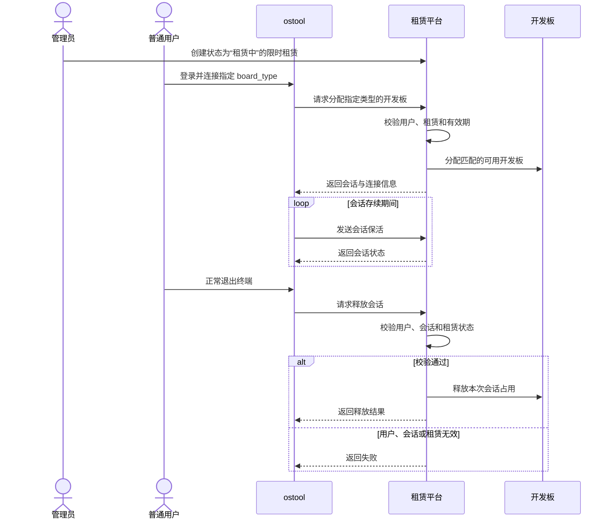

# 开发板租赁平台

开发板租赁平台通过网页管理账号、开发板和租赁关系，普通用户通过 `ostool` 接入已获授权的开发板。

## 1. 访问与职责

网页负责账号与租赁管理，`ostool` 负责建立和维持开发板会话，平台服务负责验证权限、分配开发板和释放会话。

### 1.1 访问入口

普通用户从 [平台首页](https://ostool.muxai.net:14321/) 注册、登录并查看开发板，管理员从 [管理后台](https://ostool.muxai.net:14321/admin/login) 登录。平台建议使用最新版 Chrome、Edge 或 Firefox；命令行客户端也必须能够访问首页所用的 HTTPS 地址。

<!-- 截图占位：平台首页，建议路径 /img/build/development-board-rental/platform-home.png；加入图片前请遮盖账号、租约编号和开发板标识等敏感信息。 -->

首页可以展示空闲开发板，但“立即申请”当前不能创建租赁。管理员需要先在后台建立租赁授权，普通用户再通过 `ostool` 登录并连接相应类型的开发板。

### 1.2 责任边界

各方分别管理账号、租赁、会话和硬件状态。管理员权限不能代替普通用户授权，网页中的租赁记录也不等于正在运行的会话。

| 参与者   | 主要职责                                                                           | 边界                                                                          |
| -------- | ---------------------------------------------------------------------------------- | ----------------------------------------------------------------------------- |
| 普通用户 | 注册和维护普通账号，通过浏览器授权`ostool`，并使用管理员授予的租赁权限           | 不能从首页自行创建租赁，也不能用管理员账号代替普通账号登录`ostool`          |
| 管理员   | 配置开发板，授予用户在指定开发板类型、标签和时间窗口内的使用权限，并管理异常会话   | 设定准入范围，不决定会话最终分配哪块开发板，也不参与普通用户的`ostool` 授权 |
| 平台服务 | 完成浏览器授权，检查用户和租赁状态，选择符合条件的可用开发板，并处理会话保活与释放 | 不代替管理员审批租赁，也不修改用户设置的运行内容                              |
| 开发板   | 作为最终运行目标，按平台中登记的串口、电源和启动配置提供硬件能力                   | 不处理网站账号、OAuth 授权或租赁审批                                          |

“租赁”和“会话”是两个对象。租赁决定用户可以使用的开发板类型和时间范围；用户连接时，平台再从符合条件的资源中分配实际开发板。释放会话只归还本次占用，不会结束管理员维护的租赁。

## 2. 租赁生命周期

管理员先创建有效租赁，普通用户完成授权后才能创建会话。会话运行期间由 `ostool` 发送心跳；正常退出时，客户端发起释放请求，服务端成功处理后才完成开发板释放和网站侧清理。

### 2.1 租赁与授权

管理员先在后台创建状态为“租赁中”的记录，设定用户、开发板和租赁时间。用户创建会话时，平台会核对账号、开发板类型、标签和有效期；任一条件不满足都会拒绝连接。

`ostool` 登录使用设备授权流程。平台生成待确认的设备码，普通用户在浏览器中确认授权后，客户端取得访问令牌。管理员账号不能用于这条授权流程。

### 2.2 会话保活与释放

下图说明管理员建立租赁后，普通用户从创建会话到释放开发板的完整过程。

会话建立后，`ostool` 会定期发送保活请求。保活可以维持当前会话，但不会延长管理员设置的租赁结束时间。

正常退出终端时，`ostool` 会停止保活并尝试释放会话。平台验证用户、会话和租赁状态后才会归还开发板；验证或释放失败时，本次占用可能不会立即清理。用户应按终端提示正常退出，不要直接强制结束 `ostool` 进程。
