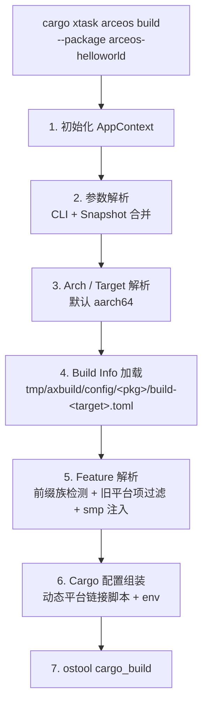

# ArceOS 构建

`cargo xtask arceos build` 把用户友好的高层参数（`--package`、`--arch`、`--smp`）转换为 Cargo 能理解的底层编译参数（target triple、features、环境变量、链接器脚本），最终调用 ostool 的 `cargo_build()` 完成编译。本节描述 ArceOS 构建的完整流程及其特有行为；通用的参数解析、Snapshot、Build Info 和动态平台构建约定详见 [参数与配置](../configuration)，QEMU/U-Boot/板卡运行详见 [ArceOS 运行](./runtime)。

构建过程分七个阶段。ArceOS 与 [StarryOS](../starry/build)、[Axvisor](../axvisor/build) 共享前四个阶段的逻辑（初始化、参数解析、arch/target 解析、Build Info 加载），在 Feature 解析和 Cargo 配置组装阶段开始分化。

## 流程总览



## 阶段细节

### 1-2. 初始化与参数解析

`ArceOS::new()` 创建 `AppContext`（详见 [参数与配置 §AppContext](../configuration#appcontext)），随后 `prepare_arceos_request()` 把 CLI 参数与 `tmp/axbuild/.arceos.toml` Snapshot 合并为 `ResolvedBuildRequest`。**`--package` 是 ArceOS 的必需参数**，会被写入 Snapshot 供后续短命令复用。

### 3. Arch / Target 解析

ArceOS 默认架构为 `aarch64`（`aarch64-unknown-none-softfloat`）。arch↔target 映射规则详见 [参数与配置 §Arch / Target 映射](../configuration#arch--target-映射)。ArceOS 的四种架构均走动态平台路径，Build Info 中不再提供平台选择开关。

### 4. Build Info 加载

ArceOS 的 Build Info 位于 `tmp/axbuild/config/<package>/build-<target>.toml`。初次构建时写入 `ArceosBuildConfig::default_config()`（默认 `BuildInfo` 加空的 `app-c` 字段）；后续构建直接 TOML 反序列化，用户可手动编辑调整 features 和环境变量。详见 [参数与配置 §Build Info](../configuration#build-info)。

### 5. Feature 解析

`BuildInfo::resolve_features()` 执行 ArceOS 特有的 feature 处理：

- **前缀族检测**：通过分析包的 Cargo.toml 依赖确定使用 `ax-std/` 还是 `ax-runtime/` 前缀
- **旧平台项过滤**：移除 `plat-dyn`、`defplat`、`myplat` 等旧平台选择 feature；动态平台由当前构建路径固定提供
- **SMP feature 注入**：`max_cpu_num > 1` 时注入 `{prefix}/smp`
- **遗留别名归一化**：`axstd` → `ax-std`、`feature` → `ax-runtime`

### 6-7. Cargo 配置组装与执行

构建使用动态平台链接脚本 `Taxplat.x`。硬件信息来自启动时的固件表、FDT/ACPI 和 `somehal`/`axplat-dyn` 运行时发现结果；`axbuild` 不再生成 `.axconfig.toml`，也不再向 Cargo 注入 `AX_CONFIG_PATH`。最终 `AppContext::build()` 调用 `Tool::cargo_build()` 完成编译，产出 ELF（aarch64/riscv64 进一步转为 raw binary）。

## ArceOS 特有：C 应用构建管线

除标准构建外，ArceOS 还支持独立的 C 应用构建（`scripts/axbuild/src/arceos/cbuild.rs`），通过 `ax-libc` 提供的 C 运行时和 musl 交叉工具链把用户 C 源码链接为可在 ArceOS 运行的 ELF。此管线不依赖测试框架，可独立使用。详见 [ArceOS 测试 §C 应用构建管线](./test#c-应用构建管线)。

## 用法示例

```bash
# 构建单个 app（默认 aarch64）
cargo arceos build --package arceos-helloworld

# 切换架构
cargo arceos build --package arceos-httpserver --arch riscv64

# 多核
cargo arceos build --package arceos-helloworld --smp 4
```
