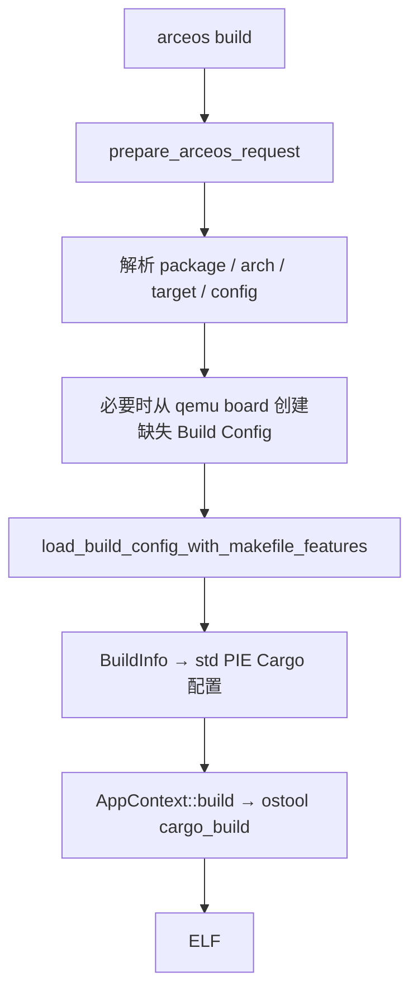

# ArceOS 构建

`cargo xtask arceos build` 通过 `ArceOS::build()`、`prepare_arceos_request()` 和 `arceos/build/` 将 app 选择转换为可执行的 Cargo 配置。共享 Cargo 基础配置以 `to_bin = false` 创建 ELF，运行命令再按运行器配置准备启动产物。

## 1. Rust 应用构建

Rust app 的构建路径从请求解析开始，将 package、target 和 Build Config 固化为一次 Cargo 调用；每个阶段都有对应代码锚点，便于排查错误发生的位置。



### 1.1 请求解析

`context/resolve.rs` 先读取 Snapshot，再读取存在的显式或可继承 Build Config 中的 `package`、`target` 选择器。package 的优先级是 CLI → 配置 → Snapshot；没有任何来源时给出明确错误。显式 arch/target 会抑制不匹配的 Snapshot 搭配，详情见 [参数与配置](../configuration)。

### 1.2 配置装载

默认配置路径是：

```text
tmp/axbuild/config/<package>/build-<target>.toml
```

对于 `build` 和 `qemu`，若默认路径不存在，`ensure_default_build_config_for_target()` 会查找 `os/arceos/configs/board/qemu-<arch>.toml` 中 package 与 target 都匹配的文件并复制。找不到匹配 board 时，`ensure_build_info()` 才会写入 `ArceosBuildConfig::default_config()`。

普通 ArceOS Build Config 的最小示例：

```toml
features = ["net", "ax-driver/virtio-net"]
log = "Info"
max_cpu_num = 2

[env]
BACKTRACE = "y"
```

Board 文件可以额外带 `package` 与 `target`，因此既可作为 `defconfig` 模板，也可作为显式 `--config` 的请求选择器。

### 1.3 特性装配

`load_build_config_with_makefile_features()` 执行以下操作：

1. 校验 Build Config 根字段和 feature；
2. 合并 `FEATURES` 环境变量；
3. 用 CLI `--smp` 覆盖 `max_cpu_num`；
4. 再次校验，确保环境变量同样不能绕过规则。

随后共享 BuildInfo 逻辑把裸机 logical target 映射到 `scripts/targets/std/pie/` 下的 musl JSON target，设置 `build-std=std,panic_abort`，准备交叉 C 编译环境、占位库和 linker wrapper。`max_cpu_num > 1` 会加入 `smp`；应用 Cargo metadata 决定该 feature 传递给 app、`ax-std` 或两者。

### 1.4 产物生成

`AppContext::build()` 调用 `ostool_build::cargo_build()`，基础 Cargo 配置中的 `to_bin` 为 `false`。生成的 ELF 路径由 ostool 输出；QEMU、U-Boot 或 Board 命令才会根据各自运行配置决定是否准备 raw BIN。

## 2. C 应用构建

`app-c` 是 ArceOS 专属配置字段：

```toml
app-c = "../../my-c-app"
features = ["fs"]
log = "Info"
```

- 相对路径相对于 Build Config 文件解析；目录必须直接包含 C 源文件。
- `prepare_arceos_request()` 将 package 锁定为 `ax-libc`，冲突的 `--package` 会报错。
- `load_c_app_cargo_config()` 以 `build-std=core,alloc` 准备 ax-libc 的 Cargo 环境；`cbuild::build_c_app()` 再执行 CMake/musl 编译和链接。
- C app 的 `build` 打印 ELF 路径。QEMU 运行读取 `qemu.to_bin` 决定是否转换；U-Boot C app 总是请求 BIN。

## 3. 命令示例

这些示例分别验证默认 target、显式 target/SMP 与 board 文件作为完整选择器的行为。

```bash
# 默认 aarch64
cargo xtask arceos build --package arceos-helloworld

# 目标架构与多核
cargo xtask arceos build --package arceos-httpserver --arch riscv64 --smp 4

# 使用完整配置选择器
cargo xtask arceos build --config os/arceos/configs/board/qemu-aarch64.toml
```

运行阶段的 QEMU/FAT32 行为见 [ArceOS 运行](./runtime)。
