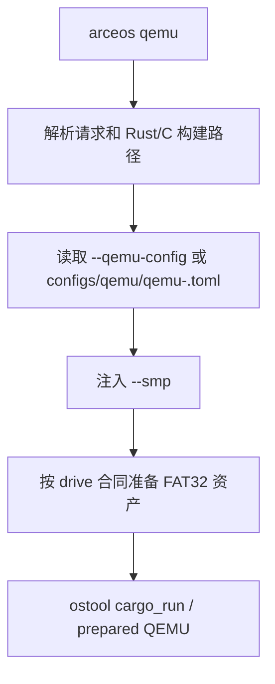

# ArceOS 运行

`qemu`、`uboot` 和 `board` 都复用 ArceOS 的请求解析和构建配置。QEMU 的 `to_bin`、UEFI、machine 和 device 参数由选中的 TOML 提供，`run_qemu_request_with_cargo()` 负责加载该配置并启动运行器。

## 1. QEMU 启动

QEMU 启动在读取 TOML 后才注入 SMP 和运行资产，因此 Cargo 构建、磁盘准备和启动参数具有清晰的责任边界。下图对应 `run_qemu_request_with_cargo()` 的执行顺序。



未传 `--qemu-config` 时，默认路径为：

```text
os/arceos/configs/qemu/qemu-<arch>.toml
```

典型配置明确给出：

```toml
args = [
  "-device", "virtio-blk-pci,drive=disk0",
  "-drive", "id=disk0,if=none,format=raw,file=${workspace}/tmp/axbuild/rootfs/arceos-aarch64-fat32.img",
]
uefi = false
to_bin = true
```

`to_bin = true` 要求运行器从构建 ELF 准备 BIN；`false` 则直接使用 ELF。仓库中的 x86_64 和 loongarch64 默认 TOML 组合了 UEFI 与 `to_bin = true`。

### 1.1 FAT32 资产

ArceOS 默认 QEMU 路径不使用 StarryOS/Axvisor 的 managed Alpine rootfs。`run_qemu_request_with_cargo()` 调用 `prepare_default_qemu_fat32_rootfs()`，根据 QEMU `-drive` 参数中声明的文件路径准备一个新的 FAT32 盘，以便 app 的文件系统或 virtio-blk 能力有确定的启动介质。

因此，`--rootfs` 虽是共享 CLI 形态的一部分，当前 ArceOS 默认 QEMU 流程仍以 QEMU drive 合同和 FAT32 资产为准；它不应被理解为会把 Alpine rootfs 自动挂到 ArceOS 默认 QEMU 中。

`apply_smp_qemu_arg()` 替换或追加 QEMU `-smp N`；machine、CPU model、firmware 和设备参数保持由 TOML 定义。

### 1.2 C 应用启动

`app-c` 先由 CMake/musl 生成 ELF，再以当前 QEMU TOML 的 `to_bin` 调用 `prepare_elf_artifact()`，最后执行 `run_prepared_qemu()`。C app 配置若无法找到 QEMU config，会报错并要求显式提供配置。

## 2. U-Boot 启动

`cargo xtask arceos uboot` 读取 `--uboot-config`，没有显式路径时交由 ostool 的 U-Boot 配置发现逻辑处理。Rust app 使用 `AppContext::uboot()` 执行 build+run；C app 必须有明确 U-Boot 配置，并在启动前始终准备 BIN。

## 3. 板卡启动

`cargo xtask arceos board` 通过 ostool-server 运行。`--board-config` 有最高优先级；未指定时 axbuild 在 workspace 中为当前 Cargo 配置查找或生成 ostool board run config。`--board-type`、`--server`、`--port` 作为 `RunBoardOptions` 传递。

Rust app 走 build+board；C app 先构建 ELF，再以当前 Cargo 的 `to_bin` 值调用 `board_prepared_elf()`。板卡管理和租用配置见 [板卡管理](../board)。

## 4. 命令示例

以下命令展示默认 QEMU、显式启动 TOML，以及 U-Boot 和板卡路径的最小调用形式。

```bash
# 默认 QEMU 配置和 FAT32 资产
cargo xtask arceos qemu --package arceos-helloworld

# 使用测试或应用专属的 QEMU 启动契约
cargo xtask arceos qemu --package arceos-httpserver \
  --qemu-config path/to/qemu-aarch64.toml --smp 4

# U-Boot 与远程板卡
cargo xtask arceos uboot --package arceos-helloworld --uboot-config path/to/uboot.toml
cargo xtask arceos board --package arceos-helloworld --board-config path/to/board.toml
```
