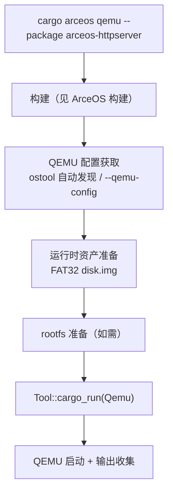

# ArceOS 运行

`cargo xtask arceos qemu/uboot/board` 在构建基础上增加运行环节：将编译好的 ArceOS app 部署到 QEMU、U-Boot 或远程板卡中执行并收集输出。本节描述 ArceOS 运行的完整流程及其特有行为；通用的 QEMU 配置获取、ostool 执行机制详见 [参数与配置](../configuration)。

## 子命令

| 子命令 | 说明 |
|--------|------|
| `cargo arceos qemu` | 编译并在 QEMU 中运行 ArceOS app |
| `cargo arceos uboot` | 编译并通过 U-Boot 运行 ArceOS app |
| `cargo arceos board` | 编译并在远程板卡运行 ArceOS app |

## 运行流程



### QEMU 配置获取

ArceOS 未显式指定 `--qemu-config` 时，由 ostool 根据包名和 target 自动查找（`Tool::ensure_qemu_config_for_cargo()`）。测试场景下每个用例有自己的 `qemu-{arch}.toml`，通过 `--qemu-config` 显式指定。

### 运行时资产准备（FAT32 disk image）

某些 ArceOS app/feature 在运行前需要额外的 FAT32 磁盘镜像。`arceos/mod.rs::ensure_qemu_runtime_assets` 扫描 QEMU 配置中所有名为 `disk.img` 的 `-drive` 参数：

| 镜像位置 | 创建策略 |
|----------|---------|
| `tmp/axbuild/runtime-assets/**`（测试用临时镜像） | **每次运行重建**（先删后建，确保干净状态） |
| 其他路径（如 checked-in 的 `test-suit/arceos/.../disk.img`） | 仅在文件不存在时创建 |

每个镜像通过 `truncate -s 64M` + `mkfs.fat -F 32` 生成（大小由 `DEFAULT_TEST_DISK_IMAGE_SIZE = "64M"` 决定）。

### Rootfs 准备

当 QEMU 配置引用了 managed rootfs 路径时，axbuild 会按架构默认镜像名（`rootfs-<arch>-alpine.img`）从 image storage 拉取。详见 [镜像管理](../image) 和 [参数与配置](../configuration)。

## 参数

| 参数 | 说明 |
|------|------|
| `--package <PKG>`（必需） | ArceOS app 包名 |
| `--arch <ARCH>` | 目标架构，默认 `aarch64` |
| `--smp <N>` | CPU 核数 |
| `--debug` | debug 构建 |
| `--qemu-config <PATH>` | 显式 QEMU 配置路径 |
| `--uboot-config <PATH>` | 显式 U-Boot 配置路径 |
| `--board-config <PATH>` | 显式板卡运行配置路径 |
| `--board-type`/`-b` | 远程板卡类型 |
| `--server` / `--port` | ostool-server 地址 |
| `--rootfs <IMAGE>` | 显式 rootfs 镜像路径（跳过自动下载） |

## 用法示例

```bash
# 运行 httpserver app
cargo arceos qemu --package arceos-httpserver

# 切换架构并指定 rootfs
cargo arceos qemu --package arceos-httpserver --arch riscv64 --rootfs alpine

# 多核运行
cargo arceos qemu --package arceos-httpserver --smp 4
```
