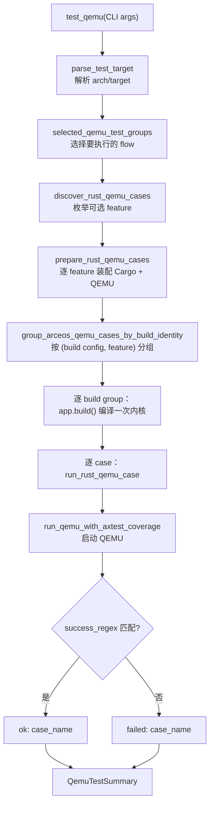
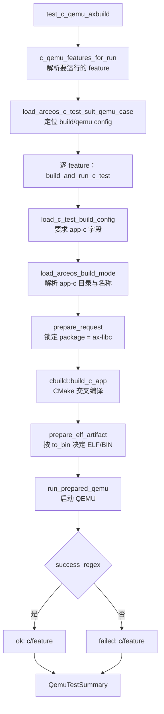
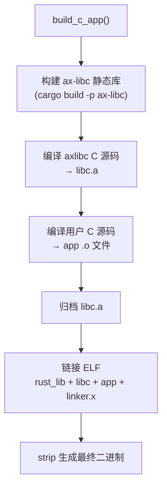

# ArceOS 测试

ArceOS 的测试覆盖两类用例：**Rust 用例**（统一入口为 `arceos-test-suit`，单个用例由 crate feature 控制）和 **C 用例**（通过 Makefile 构建的 C 语言程序，由 `test_cmd` 文件定义测试序列）。两类用例的发现和处理方式有所不同，但最终都通过 QEMU 运行并使用正则匹配判定结果。

测试编排（用例发现、分组构建、资产准备、结果判定）由 `scripts/axbuild/src/test/` 提供统一框架，核心原则是 **OS 只构建一次，逐 case 运行**——具有相同构建配置的用例归入同一 build wrapper，组内共享一次内核编译，然后逐 case 准备资产、运行 QEMU、匹配结果。共享框架的完整说明见 [测试基础设施](../test_infra)；本文描述 ArceOS 特有的测试目录结构和两类用例的处理差异。

## 命令

通过 `cargo xtask arceos test qemu` 触发 ArceOS 测试，支持按架构、测试组和用例名过滤：

```text
cargo xtask arceos test qemu --arch <arch> [--test-group <group>] [--test-case <case>]
```

ArceOS 测试命令支持通过 `--test-group` 选择测试组（`rust`、`c` 或自定义组），通过 `--test-case` 过滤特定用例。不指定 `--test-group` 时默认运行所有组。Rust 组中 `--test-case` 直接使用 feature 名，例如 `task-yield`；不指定时运行 `all` feature。

## 测试组

ArceOS 测试提供 `rust` 和 `c` 两个预定义组，以及自定义组：

| 组 | 路径 | 说明 |
|----|------|------|
| `rust` | `test-suit/arceos/rust/` | Rust feature 测试 |
| `c` | `test-suit/arceos/c/` | C 语言测试 |
| 自定义 | `test-suit/arceos/<group>/` | 通过 `--test-group` 选择 |

Rust 组和 C 组是预定义的标准组，分别用于验证 ArceOS 的 Rust 应用和 C 语言兼容性。自定义组允许开发者按需添加新的测试类别。

### 组分发逻辑

`runner.rs::selected_qemu_test_groups()` 根据 `--test-group` 决定要执行的 `QemuTestFlow` 集合。不指定 `--test-group` 时默认执行 `rust` 和 `c`（以及 `axtest` 和所有自定义组）。每个 flow 映射到独立的处理函数：

| QemuTestFlow | 处理函数 | 说明 |
|--------------|----------|------|
| `Rust` | `rust_qemu::test_rust_qemu()` | feature-based runner，共享编译 |
| `C` | `c_qemu::test_c_qemu()` | 每个 feature 独立 CMake 编译 |
| `Axtest` | `axtest_qemu::test_axtest_qemu()` | `harness=false` 的内核 axtest |
| `Generic(group)` | `generic_qemu::test_generic_qemu()` | 自定义组，走共享发现流程 |

分发后，每个 flow 独立打印进度（`[N/M] arceos <flow> qemu <case>`）和结果汇总（`QemuTestSummary`），最终由 `summary.finish_with_total_detail()` 统一判定退出码。

## Rust 用例

Rust 组只保留一个 Cargo 项目，测例按模块分层存放，并通过 feature 选择：

```text
test-suit/arceos/rust/
├── Cargo.toml
├── src/
├── build-{target}.toml
└── qemu-{arch}.toml
```

### 执行流程

Rust 用例的执行链位于 `arceos/test/runner.rs::test_qemu()` → `rust_qemu.rs::test_rust_qemu()` → `rust_qemu.rs::prepare_rust_qemu_cases()` → `runner.rs::run_prepared_qemu_groups()`。下图和步骤描述从 CLI 到 QEMU 运行的完整数据流。



关键步骤的源码行为：

| 步骤 | 源码位置 | 行为 |
|------|----------|------|
| 用例枚举 | `discovery.rs::discover_rust_qemu_cases()` | 枚举 `ARCEOS_RUST_QEMU_FEATURES`；`--test-case` 选中单个 feature，省略时选 `all`；未匹配当前架构支持的 feature 时返回空集（跳过） |
| 请求装配 | `rust_qemu.rs::prepare_rust_qemu_cases()` | 对每个 feature 调用 `arceos.prepare_request()`（`SnapshotPersistence::Discard`，测试不写回快照），加载 `build-<target>.toml` 与 `qemu-<arch>.toml` |
| Feature 注入 | `rust_qemu.rs::add_cargo_feature()` | 把 feature 名追加到 `cargo.features` 并排序去重 |
| SMP | `rust_qemu.rs` | `request.smp` → Build Config `max_cpu_num` → 默认 `1`，调用 `apply_smp_qemu_arg()` 写入 `-smp` |
| 构建分组 | `runner.rs::group_arceos_qemu_cases_by_build_identity()` | 按 `(build_config_path, package, feature)` 元组分组；**相同 feature 的多个 case 共享一次内核编译** |
| 内核编译 | `runner.rs::run_prepared_qemu_groups()` → `app.build()` | 每个 build group 调用一次 `ostool_build::cargo_build()`，产物为 ELF |

### Feature 专属覆盖

`apply_rust_qemu_feature_overrides()` 为部分 feature 覆盖 QEMU 的 `success_regex`、`fail_regex` 和 `timeout`，因为它们的判定语义与默认的 "内核启动成功" 不同：

| Feature | 覆盖行为 |
|---------|----------|
| `debug-panic-path` | 成功条件改为 `BACKTRACE_BEGIN ... kind=panic`；失败 `ARCEOS_TEST_FAIL`；timeout ≤30s |
| `exception-page-fault` | 成功 `Page fault test OK!`；失败含 `panic` 或 "handler did not stop"；timeout ≤30s |
| `lockdep-detect` | 成功 "lockdep: lock order inversion detected"；失败 "did not report"；timeout ≤30s |
| `task-stack-guard-page` | 成功匹配 guard page hit；失败 "was not hit"；timeout ≤30s |
| `task-wait-queue-remote-wake` (riscv64) | 追加 `-accel tcg,thread=single`，强制单线程 TCG 以保证唤醒顺序确定性 |

### 单个 case 运行

`run_rust_qemu_case()` 在 QEMU 运行前后的额外处理：

1. **自动符号化判定**：`auto_symbolize = symbolize_after && build_info_enables_backtrace_path(build_config)`，即 Build Config 中 `BACKTRACE=y` 或 `DWARF=y` 时启用。
2. **Backtrace capture**：启用时在 `tmp/axbuild/qemu-logs/<case>-<target>.log` 保存 QEMU 日志，并通过 `BacktraceQemuCapture` 流式捕获 `BACKTRACE_BLOCK` 块。
3. **Host HTTP fixture**：若用例 QEMU TOML 声明了 `[host_http_server]`，启动 `HostHttpServerGuard`（见 [测试基础设施](../test_infra#10-host-http-fixture)）。
4. **覆盖率**：`run_qemu_with_axtest_coverage()` 在启用 `AXTEST_COVERAGE` 时额外配置 QEMU monitor 和覆盖率正则。
5. **后符号化断言**：`debug-backtrace` feature 要求符号化输出包含特定函数链（`nested_c → nested_b → nested_a`），通过 `host_symbolize_success_regex` 强制校验；该类 case 禁止 `--no-symbolize`。

### FAT32 rootfs 准备

`rootfs::prepare_default_qemu_fat32_rootfs()` 为需要磁盘的 feature（如 `fs-basic`、`all`）在 `tmp/axbuild/runtime-assets/arceos/rust/` 下生成临时 FAT32 镜像，并补丁到 QEMU 的 `-drive`。这与 StarryOS/Axvisor 的 managed rootfs 注入是不同的路径——ArceOS 不经过共享的 `test/case/` 资产注入层。

## C 用例

通过 `test_cmd` 文件定义调用序列，支持 `test_one` 指令：

```bash
# test_cmd 格式：每行一个 test_one 指令
# test_one <KEY=VALUE...> <expect_output_file>
test_one ARCH=riscv64 FEATURES=net expect_net.out
```

每个 C 用例目录可包含：
- `.c` 源文件
- `axbuild.mk`：标记文件，指示该目录为 C 测试用例（与 `test_cmd`、`features.txt` 同为标识文件）
- `features.txt`：Cargo features
- `test_cmd`：测试调用定义
- `expect_*.out`：预期输出

### 执行流程

C 测试的执行链位于 `c_qemu.rs::test_c_qemu_axbuild()` → `build_and_run_c_test()`。每个 C 用例独立编译和运行（不像 Rust 那样按 feature 分组共享编译）。



关键步骤的源码行为：

| 步骤 | 源码位置 | 行为 |
|------|----------|------|
| Feature 解析 | `c_qemu.rs::c_qemu_features_for_run()` | `--test-case` 选中单个，省略时选 `all`；未知 feature 报错 |
| 配置定位 | `c_qemu.rs::load_arceos_c_test_suit_qemu_case()` | 从 `test-suit/arceos/c/` 定位 `build-<target>.toml` 和 `qemu-<arch>.toml` |
| Build Config 校验 | `c_qemu.rs::load_c_test_build_config()` | 必须含 `app-c` 字段（如 `app-c = "c"`），否则报错 |
| Package 锁定 | `build_and_run_c_test()` | `prepare_request` 时 `package = "ax-libc"`，与 C app 路径绑定 |
| C 编译 | `cbuild::build_c_app()` | 使用 CMake + musl 交叉工具链，注入 `c-define:<FEATURE>` 宏选择用例 |
| 产物处理 | `prepare_elf_artifact()` | 根据 QEMU TOML 的 `to_bin` 决定是否从 ELF 生成 raw BIN |
| 结果判定 | `run_prepared_qemu()` | 由 QEMU TOML 的 `success_regex`/`fail_regex` 判定，与 Rust 用例相同 |

C 用例与 Rust 用例的核心区别：Rust 用例通过 axbuild 的标准发现和分组流程执行（相同 feature 的 case 共享编译），而 C 用例**每个 feature 独立编译独立运行**，使用 `cbuild.rs` 的 CMake/musl 管线而非共享 std-aware Cargo 路径。

## C 应用构建管线

除了测试场景外，ArceOS 还支持独立的 C 应用构建（`arceos/cbuild.rs`），用于将 C 源码编译为在 ArceOS 上运行的可执行文件。此管线通过 `ax-libc` 包提供 C 语言支持：



构建步骤：
1. **构建 ax-libc**：先编译 `ax-libc` Rust 包，生成 `libax_libc.a` 静态库和 `linker.x` 链接脚本
2. **编译 C 运行时**：将 `os/arceos/ulib/axlibc/c/` 下的 C 源码（如 `libc.c`）交叉编译为 `.o` 文件并归档为 `libc.a`
3. **编译用户 C 源码**：将用户 C 源码目录下的文件交叉编译为 `.o` 文件
4. **链接**：将 Rust 静态库、C 运行时库、用户程序和链接脚本合并为 ELF 可执行文件
5. **Strip**：去除调试信息生成最终二进制

C 交叉编译使用与目标架构匹配的 musl 工具链（如 `aarch64-linux-musl-gcc`），编译标志包含 `-ffreestanding -nostdlib -static` 等裸机选项，以及来自 ax-libc 的头文件路径。

### C 测试流程与 C 应用构建管线的关系

ArceOS 的 C 测试涉及两套不同的构建流程：

- **C 测试用例流程**（`test_cmd` + Makefile）：用于 `cargo xtask arceos test qemu --test-group c`，通过 `test_cmd` 文件定义编译-运行-比对序列，使用传统的 Makefile 构建系统。每条 `test_one` 指令指定编译参数和预期输出文件，由 Makefile 驱动 `defconfig` → `build` → `justrun` 流程。

- **C 应用构建管线**（`cbuild.rs` + CMake）：独立的 C 应用构建能力，通过 `ax-libc` 包提供 C 语言运行时支持，使用 CMake + musl 交叉编译工具链将用户 C 源码编译为可在 ArceOS 上运行的 ELF 可执行文件。此管线不依赖测试框架，可独立使用。

两者的核心区别在于：C 测试流程是测试框架的一部分，负责"编译 → 运行 → 比对"的完整测试循环；C 应用构建管线是纯构建能力，仅负责将 C 源码编译为 ArceOS 可执行文件。
