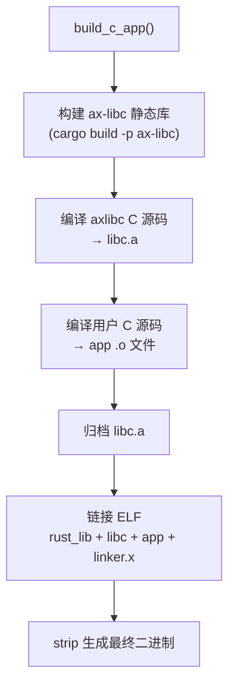

# ArceOS 测试

ArceOS 的测试覆盖两类用例：**Rust 用例**（统一入口为 `arceos-test-suit`，单个用例由 crate feature 控制）和 **C 用例**（通过 Makefile 构建的 C 语言程序，由 `test_cmd` 文件定义测试序列）。两类用例的发现和处理方式有所不同，但最终都通过 QEMU 运行并使用正则匹配判定结果。

测试编排框架（用例发现、分组构建、资产准备、结果判定）是三套子系统共享的，详见 测试框架(../test_framework)。本文只描述 ArceOS 特有的测试目录结构和两类用例的处理差异。

## 命令

通过 `cargo xtask arceos test qemu` 触发 ArceOS 测试，支持按架构、测试组和用例名过滤：

```text
cargo xtask arceos test qemu --arch <arch> [--test-group <group>] [--test-case <case>]
```

ArceOS 测试命令支持通过 `--test-group` 选择测试组（`rust`、`c` 或自定义组），通过 `--test-case` 过滤特定用例。不指定 `--test-group` 时默认运行所有组。Rust 组中 `--test-case` 直接使用 feature 名，例如 `task-yield`；不指定时运行 `all` feature。

## 测试组

ArceOS 测试提供 `rust` 和 `c` 两个预定义组，以及自定义组：

| 组 | 路径 | 说明 |
|----|------|------|
| `rust` | `test-suit/arceos/rust/` | Rust feature 测试 |
| `c` | `test-suit/arceos/c/` | C 语言测试 |
| 自定义 | `test-suit/arceos/<group>/` | 通过 `--test-group` 选择 |

Rust 组和 C 组是预定义的标准组，分别用于验证 ArceOS 的 Rust 应用和 C 语言兼容性。自定义组允许开发者按需添加新的测试类别。

## Rust 用例

Rust 组只保留一个 Cargo 项目，测例按模块分层存放，并通过 feature 选择：

```text
test-suit/arceos/rust/
├── Cargo.toml
├── src/
├── build-{target}.toml
└── qemu-{arch}.toml
```

执行流程：
1. `--test-case` 直接匹配 `arceos-test-suit` 的 feature 名；未指定时选择 `all`
2. 加载根目录的 `build-{target}.toml` 和 `qemu-{arch}.toml`
3. 准备运行时资产（如 FAT32 disk.img）
4. 构建 `arceos-test-suit` 并注入选中的 feature
5. 启动 QEMU，由测试 runner 在一次启动中顺序执行所选 feature 下的测试

Rust runner 会打印每个测试的开始、结束状态和耗时。需要磁盘镜像等运行时资产的 feature（如 `fs-basic` 或 `all`）会使用 axbuild 在 `tmp/axbuild/runtime-assets/arceos/rust/` 下生成的临时镜像。

## C 用例

通过 `test_cmd` 文件定义调用序列，支持 `test_one` 指令：

```bash
# test_cmd 格式：每行一个 test_one 指令
# test_one <KEY=VALUE...> <expect_output_file>
test_one ARCH=riscv64 FEATURES=net expect_net.out
```

每个 C 用例目录可包含：
- `.c` 源文件
- `axbuild.mk`：标记文件，指示该目录为 C 测试用例（与 `test_cmd`、`features.txt` 同为标识文件）
- `features.txt`：Cargo features
- `test_cmd`：测试调用定义
- `expect_*.out`：预期输出

执行流程：
1. 解析 `features.txt` 和 `test_cmd`
2. 设置交叉编译环境（`make defconfig`）
3. `make build` 编译
4. `make justrun` 运行（QEMU 内）
5. 输出与 `expect_*.out` 比对

C 用例的测试方式与 Rust 用例有本质区别：Rust 用例通过 axbuild 的标准发现和分组流程执行，而 C 用例使用独立的 Makefile 构建系统。`test_cmd` 文件定义了多轮编译-运行-比对序列，每轮通过 `test_one` 函数指定编译参数（`MAKE_VARS`）和预期输出文件（`expect_output`）。`features.txt` 中的 features 会被注入到 ArceOS 内核的编译配置中，允许 C 测试启用特定的内核功能。

## C 应用构建管线

除了测试场景外，ArceOS 还支持独立的 C 应用构建（`arceos/cbuild.rs`），用于将 C 源码编译为在 ArceOS 上运行的可执行文件。此管线通过 `ax-libc` 包提供 C 语言支持：



构建步骤：
1. **构建 ax-libc**：先编译 `ax-libc` Rust 包，生成 `libax_libc.a` 静态库和 `linker.x` 链接脚本
2. **编译 C 运行时**：将 `os/arceos/ulib/axlibc/c/` 下的 C 源码（如 `libc.c`）交叉编译为 `.o` 文件并归档为 `libc.a`
3. **编译用户 C 源码**：将用户 C 源码目录下的文件交叉编译为 `.o` 文件
4. **链接**：将 Rust 静态库、C 运行时库、用户程序和链接脚本合并为 ELF 可执行文件
5. **Strip**：去除调试信息生成最终二进制

C 交叉编译使用与目标架构匹配的 musl 工具链（如 `aarch64-linux-musl-gcc`），编译标志包含 `-ffreestanding -nostdlib -static` 等裸机选项，以及来自 ax-libc 的头文件路径。

### C 测试流程与 C 应用构建管线的关系

ArceOS 的 C 测试涉及两套不同的构建流程：

- **C 测试用例流程**（`test_cmd` + Makefile）：用于 `cargo xtask arceos test qemu --test-group c`，通过 `test_cmd` 文件定义编译-运行-比对序列，使用传统的 Makefile 构建系统。每条 `test_one` 指令指定编译参数和预期输出文件，由 Makefile 驱动 `defconfig` → `build` → `justrun` 流程。

- **C 应用构建管线**（`cbuild.rs` + CMake）：独立的 C 应用构建能力，通过 `ax-libc` 包提供 C 语言运行时支持，使用 CMake + musl 交叉编译工具链将用户 C 源码编译为可在 ArceOS 上运行的 ELF 可执行文件。此管线不依赖测试框架，可独立使用。

两者的核心区别在于：C 测试流程是测试框架的一部分，负责"编译 → 运行 → 比对"的完整测试循环；C 应用构建管线是纯构建能力，仅负责将 C 源码编译为 ArceOS 可执行文件。
