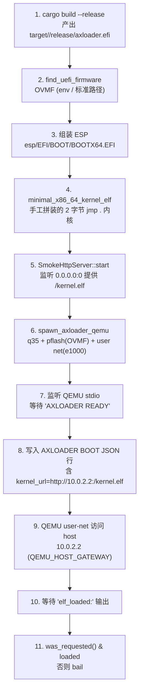

# Axloader

`cargo xtask axloader` 是 axbuild 对 `bootloader/axloader`（一个 UEFI bootloader）的构建与 HTTP smoke 测试入口。axloader 本身在裸机/UEFI 环境运行，无法用普通 `cargo test` 验证它的核心能力——通过网络下载内核镜像并加载。axloader 子模块负责用 QEMU + 一段最小 host HTTP 服务把这条链路端到端跑通，确保每次 CI 都能验证 bootloader 真的能从网络取到内核、解析 ELF 并跳转入口。

## 命令结构

```text
cargo xtask axloader <subcommand>
  build   构建 axloader EFI 二进制
  test    运行 axloader 测试套件
    qemu  host 检查 + QEMU HTTP smoke 测试
```

| 子命令 | 参数 | 说明 |
|--------|------|------|
| `build` | `--target <TRIPLE>`（默认 `x86_64-unknown-uefi`）、`--release`/`--debug`（互斥） | 调 `cargo build -p axloader --bin axloader --target ...` |
| `test qemu` | `--target <TRIPLE>`（默认 `x86_64-unknown-uefi`） | 顺序：① `cargo test -p axloader --all-targets` ② `cargo check --target <uefi> --bin axloader` ③ HTTP smoke test |

构建默认 `--release`（`args.release || !args.debug`），因为 smoke 测试要求 release 产物。

## HTTP Smoke Test 流程

这是 axloader 模块最核心的部分，串起了 bootloader 的网络引导能力验证：



关键点：

- **UEFI 固件定位**：`find_uefi_firmware` 依次查询环境变量（`AXLOADER_X86_64_UEFI_FIRMWARE`，兼容旧名 `AXVISOR_X86_64_UEFI_FIRMWARE`），再扫描 `X86_64_UEFI_FIRMWARE_CANDIDATES` 中常见的 OVMF 路径（`/usr/share/OVMF/OVMF_CODE_4M.fd` 等）。都找不到时报错并提示安装 `ovmf`。
- **QEMU user-net 网关**：QEMU 的 user-mode 网络把 host 映射为 `10.0.2.2`（常量 `QEMU_HOST_GATEWAY`），因此 guest 内的 axloader 通过这个 IP 访问 host 上临时启动的 HTTP 服务，无需配置 bridge/tap。
- **最小内核**：`minimal_x86_64_kernel_elf` 手工拼装一个极简 ELF64——程序头指向 `0x20_0000`，入口指令为 `eb fe`（`jmp .`）。它不需要做任何实际工作，smoke test 只关心 axloader 是否成功下载、解析 ELF 并报告 `elf_loaded:`。
- **协议 JSON**：通过 QEMU 的 stdio 串口向 axloader 发送一行 `AXLOADER BOOT {...}`，字段包括 `protocol_version`、`boot_id`、`kernel_url`、`kernel_size`、`image_format=elf64`、`arch`、`entry_symbol`。axloader 看到 `AXLOADER READY` 提示后才开始读取这行命令。
- **成功判据**：必须在 `HTTP_SMOKE_TIMEOUT`（120s）内同时观察到 ① transcript 出现 `elf_loaded:`；② HTTP server 的 `was_requested()` 为真（即 axloader 真的发起了对 `/kernel.elf` 的请求）。只满足其中一条仍判定失败，防止假阳性。

## SmokeHttpServer

`SmokeHttpServer` 是一个极简的非阻塞单线程 HTTP/1.1 服务器，只为 smoke test 而存在：

- `TcpListener::bind("0.0.0.0:0")` 随机端口，避免 CI 并发冲突。
- `set_nonblocking(true)` + 10ms 轮询，配合 `AtomicBool` stop 标志优雅退出。
- 仅响应 `GET /kernel.elf`，对每个连接回 `200 OK` + `Content-Length` + 固定 body；同时把 `requested` 标志置位。
- `Drop` 实现里设置 stop 并 join 线程，保证测试结束即释放端口。

## QEMU 启动参数

`x86_64_qemu_args` 构造的命令行（核心字段）：

```bash
qemu-system-x86_64 \
  -m 256M -smp 1 -machine q35 \
  -display none -monitor none -serial stdio \
  -netdev user,id=net0 -device e1000,netdev=net0 \
  -drive if=pflash,format=raw,readonly=on,file=<OVMF> \
  -drive format=raw,if=ide,file=fat:rw:<esp_dir>
```

ESP（EFI System Partition）通过 QEMU 的 `fat:rw:` 内存盘映射提供，省去真实磁盘镜像的构建。`-serial stdio` 让 axloader 的串口输出直接进入 axbuild 进程，配合 `stdin` 注入 `AXLOADER BOOT` 行实现双向通信。

## 模块组成

axloader 是单文件实现：

| 代码位置 | 作用 |
|----------|------|
| `scripts/axbuild/src/axloader/mod.rs` | CLI 入口（`ArgsBuild`/`ArgsTest`/`Command`）、构建、HTTP smoke 测试、`SmokeHttpServer`、最小 ELF 构造 |

常量集中在文件头部：

```rust
const AXLOADER_PACKAGE: &str = "axloader";
const AXLOADER_BIN: &str = "axloader";
const DEFAULT_UEFI_TARGET: &str = "x86_64-unknown-uefi";
const HTTP_SMOKE_TIMEOUT: Duration = Duration::from_secs(120);
const QEMU_HOST_GATEWAY: &str = "10.0.2.2";
```

`LoaderSmokeTarget` 是按 target 抽象的测试目标（cargo target、arch、EFI 文件名、固件候选、QEMU 程序、QEMU 参数构造函数、内核 ELF 工厂），目前只实现了 `x86_64-unknown-uefi`。新增架构（如 aarch64 UEFI）时按同样模式扩展 `smoke_target` 即可。

## 用法示例

```bash
# 构建 release EFI 二进制
cargo xtask axloader build --release

# 完整测试：host 单测 + UEFI check + HTTP smoke
cargo xtask axloader test qemu

# 显式指定 target（未来支持更多 UEFI target 时）
cargo xtask axloader test qemu --target x86_64-unknown-uefi
```

CI 中通常直接 `cargo xtask axloader test qemu`。若本地缺少 OVMF 固件，可设置 `AXLOADER_X86_64_UEFI_FIRMWARE=/path/to/OVMF_CODE.fd` 指向已有固件。
