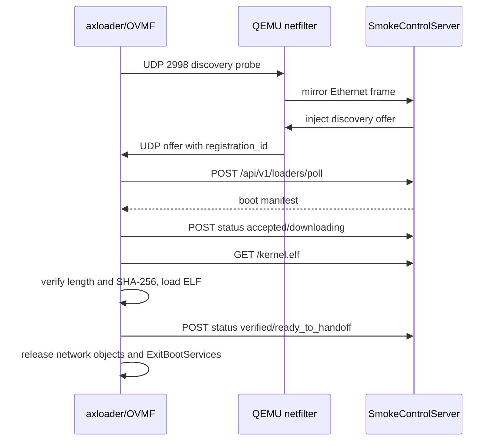

# Axloader

`cargo xtask axloader` 是 `bootloader/axloader` 的构建与 QEMU 网络启动验证入口。axloader 在 UEFI 环境中运行，控制协议通过 UDP 和 HTTP 完成；串口只承载诊断输出，测试不会向串口注入启动命令。

## 命令

```text
cargo xtask axloader <subcommand>
  build   构建 axloader EFI
  test
    qemu  执行宿主测试、UEFI check 和真实网络启动
```

```bash
cargo xtask axloader build --target x86_64-unknown-uefi --release
cargo xtask axloader test qemu --target x86_64-unknown-uefi
```

当前第一阶段固定验证 `x86_64-unknown-uefi + OVMF + q35`。构建产物是 `target/x86_64-unknown-uefi/release/axloader.efi`。

## 网络启动验证


```mermaid
sequenceDiagram
    participant A as axloader/OVMF
    participant F as QEMU netfilter
    participant S as SmokeControlServer

    A->>F: UDP 2998 discovery probe
    F->>S: mirror Ethernet frame
    S->>F: inject discovery offer
    F->>A: UDP offer with registration_id
    A->>S: POST /api/v1/loaders/poll
    S-->>A: boot manifest
    A->>S: POST status accepted/downloading
    A->>S: GET /kernel.elf
    A->>A: verify length and SHA-256, load ELF
    A->>S: POST status verified/ready_to_handoff
    A->>A: release network objects and ExitBootServices
```

测试按以下顺序执行：

1. `cargo test -p axloader --all-targets`。
2. 对 UEFI target 执行 `cargo check`。
3. release 构建 EFI 并放入临时 ESP 的 `EFI/BOOT/BOOTX64.EFI`。
4. 使用 Ostool 固定版本 OVMF 启动 q35；缓存默认位于 `${TMPDIR}/ostool/ovmf`，可用 `TGOS_OVMF_DIR` 隔离。
5. QEMU SLiRP 提供 DHCP 和 HTTP 到宿主 `10.0.2.2`。
6. `filter-mirror` 捕获客户机发出的发现帧，宿主解析强类型 `LoaderDiscoveryProbe`；`filter-redirector` 注入带 IPv4/UDP 校验和的发现响应。
7. 最小控制服务处理 poll、status 和内核下载，返回带大小、SHA-256、架构与格式的启动清单。
8. 同时观察串口诊断，但不读取 QEMU stdin，也不等待或发送 `AXLOADER READY/BOOT`。

QEMU netfilter 的字符设备采用四字节大端长度加完整以太网帧。镜像和注入分成两个字符设备，避免把注入响应再次当作客户机请求。

## 成功判据与重试

一次 smoke 必须同时满足：

- 串口出现 `elf_loaded:`；
- 控制服务实际收到 `/kernel.elf` 请求；
- 控制服务收到 `ready_to_handoff`。

QEMU 提前退出、输出关闭或超时时保留 transcript，并用全新 ESP、控制服务和 QEMU 进程重试一次。每次尝试最多等待 240 秒。

## QEMU 关键参数

```bash
qemu-system-x86_64 \
  -m 256M -smp 1 -machine q35 -accel kvm -cpu host \
  -display none -monitor none -serial stdio \
  -netdev user,id=user0 \
  -chardev socket,id=discovery_capture,... \
  -chardev socket,id=discovery_injection,... \
  -object filter-mirror,netdev=user0,queue=rx,outdev=discovery_capture \
  -object filter-redirector,netdev=user0,queue=tx,indev=discovery_injection \
  -device virtio-net-pci,netdev=user0,mac=02:00:00:00:00:01 \
  -drive if=pflash,format=raw,readonly=on,file=<OVMF> \
  -drive format=raw,if=ide,file=fat:rw:<ESP>
```

固定 OVMF 包含 `VirtioNetDxe`，因此默认使用 `virtio-net-pci`。本验证需要可访问 `/dev/kvm` 的 x86_64 主机。

## 故障定位

| 现象 | 优先检查 |
| --- | --- |
| `network_select_error` | OVMF 是否在同一控制器发布 SNP、IPv4、UDP4、HTTP service binding |
| `discovery_error: Timeout` | DHCP、UDP 2998、netfilter 捕获/注入方向与帧长度编码 |
| 多 server 拒绝 | 是否同时存在不同 `server_id` 的发现响应 |
| poll 失败 | offer 的 HTTP 基地址、SLiRP 宿主地址和响应 `Content-Length` |
| 长度或 SHA-256 不匹配 | 启动清单是否对应当前 `boot_id`，下载内容是否被替换 |
| 停在 handoff | 所有 UDP/HTTP/IP 对象是否在 `ExitBootServices` 前析构 |

新增架构时，应扩展 `LoaderSmokeTarget` 的协议架构、OVMF 架构、EFI 文件名、QEMU 程序、参数构造和最小 ELF；不能只让目标编译通过而跳过发现、下载、校验和 handoff 证据。
