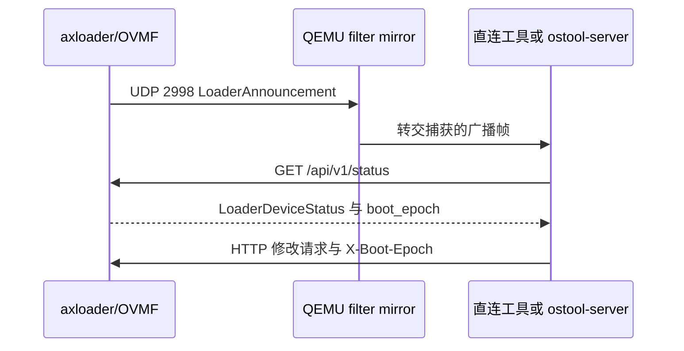

# Axloader

`cargo xtask axloader` 负责构建 x86_64 UEFI 装载器，并在本地 OVMF/QEMU 中验证设备 HTTP 启动、可选 cmdline/initramfs 和 A/B OTA。axloader 启动后是 TCP4 HTTP 服务端；直连工具与 ostool-server 都调用同一组设备接口。串口只输出诊断，测试不会向串口注入控制命令。

## 1. 构建入口

本地入口由 `scripts/axbuild/src/axloader/mod.rs` 提供。当前支持 `x86_64-unknown-uefi + OVMF + q35`，产物包含负责选择 A/B 槽的启动器和提供设备接口的装载器。

### 1.1 命令

`build` 构建 EFI 文件，`test qemu` 依次执行宿主测试、UEFI target 检查、release 构建和真实网络场景。

```text
cargo xtask axloader <subcommand>
  build   构建 axloader EFI
  test
    qemu  执行宿主测试、UEFI check 和真实网络启动/OTA
```

常用命令如下；项目验证应从工作区根目录执行。

```bash
cargo xtask axloader build --target x86_64-unknown-uefi --release
cargo xtask axloader test qemu --target x86_64-unknown-uefi
```

### 1.2 产物与布局

`run_loader_build()` 生成两个 EFI 文件。安装后的 ESP 由固定启动器选择装载器槽，普通 OTA 只写非活动槽。

| 产物 | ESP 位置 | 职责 |
| --- | --- | --- |
| `axloader-launcher.efi` | `EFI/BOOT/BOOTX64.EFI` | 校验双状态记录和槽摘要，选择 A/B 槽，处理未确认试运行的回滚 |
| `axloader.efi` | `EFI/AXLOADER/A.EFI` 或 `B.EFI` | 广播设备、提供 HTTP 启动和 OTA 接口、交接目标内核 |

`axloader::ota::State` 保存稳定槽、待试槽、摘要、升级 ID、来源和结果；`axloader::ota::OtaDisk` 负责 `STATE0.BIN`、`STATE1.BIN` 与槽文件的 Flush 和读回校验。两份状态都损坏或没有可信槽时，启动器停止并要求外部介质恢复。

## 2. 设备控制

v5 把控制面放在设备上。`network::NetworkInterface` 要求同一 UEFI 控制器同时提供 SNP、IP4、UDP4 和 TCP4；`network::Announcer` 向 UDP `2998` 单向广播 `LoaderAnnouncement`，`direct::Listener` 在 TCP `2999` 接受请求。设备不再发现、轮询或下载 ostool-server 的资源。

### 2.1 发现与代次

每次固件启动都会生成新的 `boot_epoch`。调用方先读取 `GET /api/v1/status`，随后在修改请求中携带相同的 `X-Boot-Epoch`；旧代次返回 `409`。广播只用于发现，有设备地址的直连调用方不依赖 ostool-server。


```mermaid
sequenceDiagram
    participant L as axloader/OVMF
    participant F as QEMU filter mirror
    participant C as 直连工具或 ostool-server

    L->>F: UDP 2998 LoaderAnnouncement
    F->>C: 转交捕获的广播帧
    C->>L: GET /api/v1/status
    L-->>C: LoaderDeviceStatus 与 boot_epoch
    C->>L: HTTP 修改请求与 X-Boot-Epoch
```

本地服务端联调只把测试环境中的设备地址映射到 QEMU `hostfwd` 端口。ostool-server 随后通过真实 HTTP 连接操作客户机中的 axloader，测试夹具不替设备生成响应。

### 2.2 启动事务

`boot_server::BootServer` 保存单个内存事务，并直接使用 `httpboot_protocol::DeviceBootJob`、`DeviceBootImage` 和 `DeviceBootStatus`。同一启动 ID 与相同清单可以重试；冲突清单或并发事务返回 `409`。cmdline 和 initramfs 相互独立，均可省略。

| 接口 | 行为 |
| --- | --- |
| `POST /api/v1/boot/jobs` | 提交启动 ID、x86_64 ELF64、文件长度和 SHA-256，以及可选 cmdline/initramfs |
| `GET /api/v1/boot/jobs/{id}` | 查询文件接收状态和阶段 |
| `PUT /api/v1/boot/jobs/{id}/kernel` | 定长上传内核并核对 `X-Image-Sha256` |
| `PUT /api/v1/boot/jobs/{id}/initramfs` | 上传清单声明的可选归档 |
| `DELETE /api/v1/boot/jobs/{id}` | 取消尚未执行的事务 |
| `POST /api/v1/boot/jobs/{id}/start` | 完成 ELF 与载荷检查，回复 `202`，关闭网络对象后交接 |

v5 只接受 `__x86_64_efi_pe_entry`。cmdline 经 `entry::PreparedLoadOptions` 编码为带 NUL 的 UCS-2 EFI LoadOptions；initramfs 存在时才由 `payload::PreparedPayload` 安装 `BootPayload` 配置表。启动文件单个上限 256 MiB，请求头上限 4 KiB，只接受定长 body。

### 2.3 OTA 事务

OTA 实现集中在 `bootloader/axloader/src/ota/`。`state.rs` 维护纯状态机与记录编解码，`disk.rs` 独占 ESP 文件访问，`runtime.rs` 的 `OtaController` 负责当前运行槽、上传失败原因和确认操作。该分层让宿主测试可以验证状态机，同时把 UEFI I/O 限制在目标专用模块。

| 接口 | 行为 |
| --- | --- |
| `GET /api/v1/ota/status` | 返回运行槽、稳定槽、待试 ID、来源和最近结果 |
| `PUT /api/v1/ota/image` | 流式写非活动槽，核对长度、SHA-256、PE/COFF 和 UEFI LoadImage 后重启 |
| `POST /api/v1/ota/confirm` | 仅由匹配升级 ID 与来源的待试槽提交为稳定槽 |

EFI 镜像上限 32 MiB。待试槽确认前拒绝内核启动；启动失败、掉电或复位后，启动器清除未确认槽的可信摘要并回到稳定槽。首次替换 `BOOTX64.EFI` 仍有断电窗口，安装时必须保留原文件和外部恢复介质。

## 3. 本地验证

QEMU 验证使用真实 FAT 磁盘、OVMF VARS 和 SLiRP `hostfwd`。`scripts/axbuild/src/axloader/ota_qemu.rs` 属于宿主测试编排层，负责创建 ESP、启动 QEMU、调用设备 HTTP 接口并跨多次启动复用同一磁盘。

### 3.1 执行链

`test qemu` 的每一步都有不同责任：宿主测试验证纯状态和解析，UEFI check 验证目标组合，QEMU 场景验证固件网络、持久磁盘和真实内核交接。

1. 执行 `cargo test -p axloader --all-targets`。
2. 检查 `axloader` 的 `x86_64-unknown-uefi` 目标。
3. release 构建启动器、装载器和真实 ArceOS UEFI ELF。
4. 把启动器、A/B 槽和双状态记录写入真实 FAT 镜像。
5. 用 `hostfwd` 调用客户机 TCP `2999`，覆盖直连启动、OTA、重启确认和回滚。
6. 在四种可选载荷组合中观察启动后的内核输出。

该流程不会安装 systemd 服务，不会修改 runner、板卡配置或实体设备。宿主需要 `qemu-system-x86_64`、KVM、`mkfs.vfat`、`mcopy`、`mmd` 和 `python3`。

### 3.2 成功判据

测试必须到达目标内核，`ready_to_handoff` 只表示 axloader 已准备交接。四种组合分别验证无附加载荷、仅 cmdline、仅 initramfs 和两者都有。

- 基础场景输出 `Hello, world!`。
- cmdline 场景输出精确的 `HOST_CMDLINE`。
- initramfs 场景输出 `HOST_INITRAMFS_PASSED`。
- OTA 场景跨 QEMU 启动验证坏摘要、短请求、未确认复位回滚、确认持久化和再次启动。

QEMU 提前退出或超时时保留 transcript。测试应根据具体失败阶段报告 HTTP、网络、磁盘或内核交接错误，不能用重试掩盖确定性失败。

## 4. 故障定位

诊断从设备状态和稳定日志标记开始。广播失败与 TCP 监听失败的影响不同，持久状态损坏也不能按普通网络错误处理。

### 4.1 网络路径

下表把常见日志或 HTTP 结果映射到最先检查的边界。

| 现象 | 优先检查 |
| --- | --- |
| `loader_tcp4_unavailable` | 同一网卡是否同时发布 SNP、IP4、UDP4、TCP4 service binding |
| `loader_tcp4_listen_failed` | 固件能否在 TCP `2999` 建立被动监听，端口是否已占用 |
| `loader_broadcast_error` | UDP `2998` 的广播地址、帧捕获与转交；有设备 IP 时仍可直连 |
| `409 stale_boot_epoch` | 重新读取 `/api/v1/status` 并使用新的启动代次 |
| 上传被拒绝 | `Content-Length`、`X-Image-Sha256`、清单长度和当前事务 ID |

设备回复准备交接后，`direct::Listener`、TCP 子句柄、事件和 UDP 广播对象必须先析构。退出 Boot Services 后不能继续调用固件网络或控制台服务。

### 4.2 启动与恢复

`ready_to_handoff` 后失败时检查 ELF 入口、EFI LoadOptions 和 `BootPayload` 配置表。OTA 复位循环则先读取两份状态记录的代次与校验和，再核对当前槽文件摘要。

| 现象 | 优先检查 |
| --- | --- |
| cmdline 缺失 | 清单字段、`PreparedLoadOptions`、someboot 的 EFI image handle 与命令行优先级 |
| initramfs 缺失 | 清单是否声明归档、上传状态、`BootPayload` 表是否在 ExitBootServices 前读取 |
| 待试槽重复回滚 | 升级 ID、`OtaSource`、运行摘要和确认请求是否匹配 |
| 两份状态均无效 | 停止自动启动，使用备份的原装载器和外部介质恢复 |

当前 OTA 只用 SHA-256 检查传输一致性，适用于可信隔离实验网。MAC 绑定不构成认证；以后引入内核验签时，应先让两槽执行同一验签策略并验证拒绝路径。
